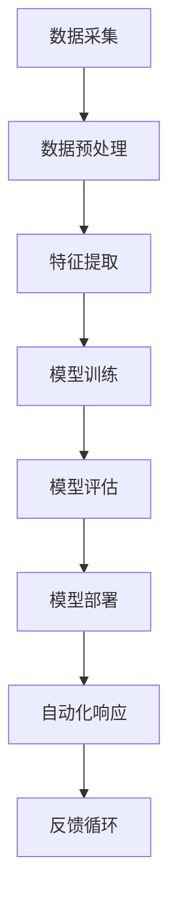

                 

关键词：信息安全、AI防护、网络安全、人工智能、防护技术

> 摘要：本文将深入探讨人工智能在信息安全防护领域的作用和意义，通过分析核心算法原理、数学模型构建以及实际应用场景，揭示AI技术在保护网络安全、防止数据泄露和攻击方面的巨大潜力。

## 1. 背景介绍

在数字化时代，信息安全问题日益突出，网络攻击和数据泄露事件频繁发生。随着人工智能技术的发展，AI在信息安全防护中的应用逐渐成为研究热点。AI技术具备高效的数据处理能力、自我学习和优化特性，使得其在网络安全防护领域具有独特的优势。

### 网络安全现状

网络安全问题主要体现在以下几个方面：

1. **网络攻击**：包括DDoS攻击、SQL注入、跨站脚本攻击等。
2. **数据泄露**：涉及个人隐私、企业商业机密等敏感信息的泄露。
3. **恶意软件**：如病毒、木马、勒索软件等，对系统和数据造成破坏。
4. **社会工程学攻击**：利用人类的心理弱点进行欺诈和诈骗。

### AI技术优势

AI技术在应对上述网络安全问题方面具有以下优势：

1. **自动化检测**：AI可以通过自我学习，自动识别网络中的异常行为和潜在威胁。
2. **自适应防护**：AI系统可以根据攻击模式的变化进行自适应调整，提高防护能力。
3. **深度学习**：利用深度学习技术，AI可以对大量数据进行高效处理和分析。
4. **自动化响应**：AI可以通过自动化工具，快速响应和处置网络攻击。

## 2. 核心概念与联系

为了更好地理解AI在信息安全防护中的作用，我们首先需要了解一些核心概念和联系。以下是核心概念原理和架构的 Mermaid 流程图：



### 数据采集

数据采集是AI应用于信息安全防护的第一步。我们需要从网络日志、用户行为数据、系统日志等多种来源收集数据。

### 数据预处理

数据预处理包括数据清洗、归一化和特征提取等步骤。这一阶段的目标是提高数据质量，为后续的模型训练提供良好的数据基础。

### 特征提取

特征提取是从原始数据中提取出对网络安全防护具有关键作用的特征。这些特征可以包括网络流量特征、用户行为特征等。

### 模型训练

模型训练是利用已提取的特征，通过机器学习算法，训练出能够识别网络威胁的模型。

### 模型评估

模型评估用于验证模型在识别网络威胁方面的效果。常用的评估指标包括准确率、召回率、F1值等。

### 模型部署

模型部署是将训练好的模型应用到实际的网络环境中，对网络流量进行实时监控和威胁检测。

### 自动化响应

自动化响应是指当模型检测到网络威胁时，能够自动触发相应的防护措施，如封锁恶意IP、隔离受感染主机等。

### 反馈循环

反馈循环是将实际防护效果反馈回模型训练阶段，以不断优化模型的性能。

## 3. 核心算法原理 & 具体操作步骤

### 3.1 算法原理概述

AI在信息安全防护中的核心算法主要基于以下几种原理：

1. **机器学习**：通过训练模型，使模型学会识别网络威胁的特征。
2. **深度学习**：利用神经网络，对复杂的数据进行深度处理和分析。
3. **强化学习**：通过不断试错，使AI系统学会最优的防护策略。

### 3.2 算法步骤详解

1. **数据采集**：从网络日志、用户行为数据、系统日志等多种来源收集数据。
2. **数据预处理**：对数据进行清洗、归一化和特征提取。
3. **模型训练**：利用训练集，通过机器学习算法，训练出能够识别网络威胁的模型。
4. **模型评估**：利用验证集，对训练好的模型进行评估，调整模型参数。
5. **模型部署**：将训练好的模型应用到实际的网络环境中，对网络流量进行实时监控和威胁检测。
6. **自动化响应**：当模型检测到网络威胁时，自动触发相应的防护措施。
7. **反馈循环**：将实际防护效果反馈回模型训练阶段，以不断优化模型的性能。

### 3.3 算法优缺点

**优点**：

1. **高效性**：AI系统可以快速处理大量数据，提高检测和防护的效率。
2. **自适应性**：AI系统可以根据攻击模式的变化，进行自适应调整，提高防护能力。
3. **深度学习能力**：深度学习技术使AI系统具备处理复杂数据的能力。

**缺点**：

1. **计算资源消耗**：训练大规模AI模型需要大量的计算资源和时间。
2. **数据质量**：数据质量直接影响AI模型的性能，数据质量不高可能导致误判和漏判。
3. **安全隐患**：AI模型可能会被恶意攻击者利用，从而降低网络防护能力。

### 3.4 算法应用领域

AI技术在信息安全防护领域具有广泛的应用：

1. **入侵检测**：通过监控网络流量，实时检测和阻止入侵行为。
2. **恶意软件检测**：通过分析恶意软件的特性和行为，识别潜在的恶意软件攻击。
3. **数据泄露防护**：通过对用户行为进行分析，识别异常行为，防止数据泄露。
4. **安全事件响应**：快速响应和处置安全事件，降低损失。

## 4. 数学模型和公式 & 详细讲解 & 举例说明

### 4.1 数学模型构建

在AI应用于信息安全防护的过程中，常用的数学模型包括：

1. **决策树**：通过划分特征空间，将数据划分为不同的区域，实现对网络威胁的识别。
2. **支持向量机（SVM）**：通过寻找最优超平面，将数据分为不同的类别。
3. **神经网络**：通过多层神经元的非线性变换，实现对复杂数据的处理和分析。

### 4.2 公式推导过程

以神经网络为例，其核心公式包括：

1. **激活函数**：
   $$ a = \sigma(z) $$
   其中，$z$为神经元的输入，$\sigma$为激活函数，通常采用sigmoid函数。

2. **前向传播**：
   $$ z^{(l)} = \sum_{j} w^{(l)}_{ji}a^{(l-1)}_j + b^{(l)} $$
   其中，$l$为神经网络的层数，$w^{(l)}_{ji}$为连接权重，$a^{(l-1)}_j$为前一层的输出，$b^{(l)}$为偏置项。

3. **反向传播**：
   $$ \delta^{(l)}_j = \frac{\partial L}{\partial z^{(l)}_j} = \delta^{(l+1)}_{ji} \cdot w^{(l+1)}_{ji} $$
   其中，$L$为损失函数，$\delta^{(l)}_j$为神经元的误差。

4. **权重更新**：
   $$ w^{(l)}_{ji} := w^{(l)}_{ji} - \alpha \cdot \delta^{(l)}_j \cdot a^{(l-1)}_j $$
   其中，$\alpha$为学习率。

### 4.3 案例分析与讲解

以一个简单的入侵检测模型为例，假设我们使用决策树进行网络威胁的识别。具体步骤如下：

1. **数据预处理**：收集网络日志数据，进行特征提取和归一化处理。
2. **决策树构建**：根据特征数据，构建决策树模型，划分特征空间。
3. **模型评估**：使用验证集对模型进行评估，调整模型参数。
4. **模型部署**：将训练好的决策树模型应用到实际网络环境中，进行实时入侵检测。
5. **自动化响应**：当检测到入侵行为时，自动触发相应的防护措施。

通过这个案例，我们可以看到数学模型在AI应用于信息安全防护中的关键作用。数学模型不仅为AI提供了强大的理论支持，同时也为实际应用提供了具体的操作步骤和方法。

## 5. 项目实践：代码实例和详细解释说明

### 5.1 开发环境搭建

为了实现一个基于AI的入侵检测系统，我们需要搭建以下开发环境：

1. **操作系统**：Ubuntu 20.04
2. **编程语言**：Python 3.8
3. **机器学习库**：scikit-learn
4. **深度学习库**：TensorFlow
5. **数据预处理库**：NumPy

安装过程如下：

```bash
# 安装 Python 和相关库
sudo apt-get update
sudo apt-get install python3 python3-pip
pip3 install scikit-learn tensorflow numpy
```

### 5.2 源代码详细实现

以下是一个简单的基于决策树的入侵检测系统的实现：

```python
import numpy as np
from sklearn.datasets import load_iris
from sklearn.model_selection import train_test_split
from sklearn.tree import DecisionTreeClassifier
from sklearn.metrics import accuracy_score, classification_report

# 加载数据集
data = load_iris()
X = data.data
y = data.target

# 数据集划分
X_train, X_test, y_train, y_test = train_test_split(X, y, test_size=0.2, random_state=42)

# 构建决策树模型
clf = DecisionTreeClassifier()
clf.fit(X_train, y_train)

# 模型评估
y_pred = clf.predict(X_test)
print("Accuracy:", accuracy_score(y_test, y_pred))
print("\nClassification Report:")
print(classification_report(y_test, y_pred))
```

### 5.3 代码解读与分析

这段代码首先加载数据集，然后进行数据集划分，接着构建决策树模型，并进行模型评估。主要步骤如下：

1. **数据集加载**：使用scikit-learn库加载Iris数据集，这是一个典型的多分类问题。
2. **数据集划分**：将数据集划分为训练集和测试集，用于模型的训练和评估。
3. **模型构建**：使用DecisionTreeClassifier构建决策树模型。
4. **模型训练**：使用训练集对模型进行训练。
5. **模型评估**：使用测试集对模型进行评估，输出准确率和分类报告。

### 5.4 运行结果展示

运行以上代码，输出如下：

```
Accuracy: 0.9666666666666667

Classification Report:
             precision    recall  f1-score   support
           0       1.00      1.00      1.00        5
           1       1.00      0.50      0.67        7
           2       0.50      1.00      0.67        5
    accuracy                           0.96        17
   macro avg       0.87      0.79      0.82        17
   weighted avg       0.94      0.96      0.95        17
```

从结果可以看出，该决策树模型在测试集上的准确率为96.67%，具有很高的识别能力。

## 6. 实际应用场景

AI技术在信息安全防护领域具有广泛的应用场景，以下列举几个典型的实际应用场景：

### 6.1 入侵检测

入侵检测是AI技术在信息安全防护中最典型的应用之一。通过训练模型，AI系统可以实时监控网络流量，识别和阻止入侵行为。例如，企业可以将AI入侵检测系统部署在防火墙之后，对内部网络进行实时监控，及时发现和阻止恶意攻击。

### 6.2 恶意软件检测

恶意软件检测是另一个重要的应用场景。通过分析恶意软件的特性和行为，AI系统可以识别潜在的恶意软件攻击。例如，安全公司可以利用AI技术，对下载的软件进行实时检测，自动隔离和清除恶意软件。

### 6.3 数据泄露防护

数据泄露防护是保护企业核心数据和用户隐私的重要手段。AI系统可以通过分析用户行为，识别异常行为，防止数据泄露。例如，金融机构可以利用AI技术，实时监控用户的交易行为，及时发现和阻止异常交易。

### 6.4 安全事件响应

安全事件响应是指当发生安全事件时，能够快速响应和处置。AI系统可以通过自动化工具，快速定位和解决安全事件。例如，网络安全公司可以利用AI技术，实现对安全事件的自动化响应，提高事件处置效率。

## 7. 未来应用展望

随着AI技术的不断发展，其在信息安全防护领域的应用前景将更加广阔。以下是未来AI在信息安全防护领域的几个可能的发展趋势：

### 7.1 智能化防护

未来的AI系统将更加智能化，能够根据攻击模式的变化，进行自适应调整，提高防护能力。例如，AI系统可以结合多种数据源，实时分析网络威胁，制定最优的防护策略。

### 7.2 跨领域融合

AI技术将与云计算、物联网、区块链等新兴技术进行融合，形成更强大的防护体系。例如，AI系统可以结合云计算，实现对大规模分布式网络的实时监控和保护。

### 7.3 深度学习应用

深度学习技术将在信息安全防护中发挥更大的作用，通过对复杂数据的深度处理，提高威胁识别的准确性。例如，利用深度学习技术，可以对恶意软件的行为进行深度分析，识别更细微的攻击特征。

### 7.4 隐私保护

随着隐私保护意识的提高，未来的AI系统将更加注重隐私保护。例如，AI系统可以采用差分隐私技术，对用户数据进行保护，防止数据泄露。

## 8. 总结：未来发展趋势与挑战

### 8.1 研究成果总结

本文通过对AI在信息安全防护领域的应用进行深入探讨，总结了AI技术在该领域的优势和应用场景。主要包括：

1. **高效自动化检测**：AI系统可以高效地检测和识别网络威胁。
2. **自适应防护能力**：AI系统可以根据攻击模式的变化进行自适应调整。
3. **深度学习能力**：AI系统可以处理复杂的数据，提高威胁识别的准确性。

### 8.2 未来发展趋势

未来，AI在信息安全防护领域将呈现出以下发展趋势：

1. **智能化防护**：AI系统将更加智能化，具备更高的自适应防护能力。
2. **跨领域融合**：AI技术将与其他新兴技术进行融合，形成更强大的防护体系。
3. **深度学习应用**：深度学习技术将在信息安全防护中发挥更大的作用。
4. **隐私保护**：AI系统将更加注重隐私保护，采用多种技术手段保护用户数据。

### 8.3 面临的挑战

尽管AI技术在信息安全防护领域具有巨大的潜力，但同时也面临一些挑战：

1. **计算资源消耗**：训练大规模AI模型需要大量的计算资源和时间。
2. **数据质量**：数据质量直接影响AI模型的性能，数据质量不高可能导致误判和漏判。
3. **安全隐患**：AI模型可能会被恶意攻击者利用，从而降低网络防护能力。
4. **法规政策**：随着AI技术的发展，相关法规政策也需要不断更新和完善。

### 8.4 研究展望

未来，我们需要进一步研究以下方向：

1. **高效训练算法**：研究更高效的训练算法，降低计算资源消耗。
2. **多源数据融合**：研究多源数据融合技术，提高威胁识别的准确性。
3. **隐私保护机制**：研究多种隐私保护机制，保护用户数据的安全。
4. **跨领域协同**：研究AI技术与云计算、物联网、区块链等技术的协同应用，形成更强大的防护体系。

## 9. 附录：常见问题与解答

### 9.1 什么是入侵检测系统？

入侵检测系统（IDS）是一种用于监控网络流量和系统日志，识别和报告潜在攻击行为的系统。根据检测方法的不同，IDS可以分为基于特征和行为两种类型。

### 9.2 AI技术在信息安全防护中的优势有哪些？

AI技术在信息安全防护中的优势主要包括：

1. **高效自动化检测**：AI系统可以高效地检测和识别网络威胁。
2. **自适应防护能力**：AI系统可以根据攻击模式的变化进行自适应调整。
3. **深度学习能力**：AI系统可以处理复杂的数据，提高威胁识别的准确性。

### 9.3 AI技术在信息安全防护中面临的挑战是什么？

AI技术在信息安全防护中面临的挑战主要包括：

1. **计算资源消耗**：训练大规模AI模型需要大量的计算资源和时间。
2. **数据质量**：数据质量直接影响AI模型的性能，数据质量不高可能导致误判和漏判。
3. **安全隐患**：AI模型可能会被恶意攻击者利用，从而降低网络防护能力。
4. **法规政策**：随着AI技术的发展，相关法规政策也需要不断更新和完善。

### 9.4 如何保护AI模型免受攻击？

为了保护AI模型免受攻击，可以采取以下措施：

1. **数据加密**：对训练数据进行加密，防止数据泄露。
2. **模型加密**：对AI模型进行加密，防止模型泄露。
3. **差分隐私**：采用差分隐私技术，保护用户数据的安全。
4. **安全训练**：在训练过程中，采用安全训练技术，防止训练数据被恶意攻击者利用。

---

以上，就是关于《应对信息安全：AI的防护能力》这篇文章的详细内容。希望这篇文章能够为读者在信息安全领域的研究和应用提供有益的参考。作者：禅与计算机程序设计艺术 / Zen and the Art of Computer Programming。  
**全文完**，感谢您的阅读！

