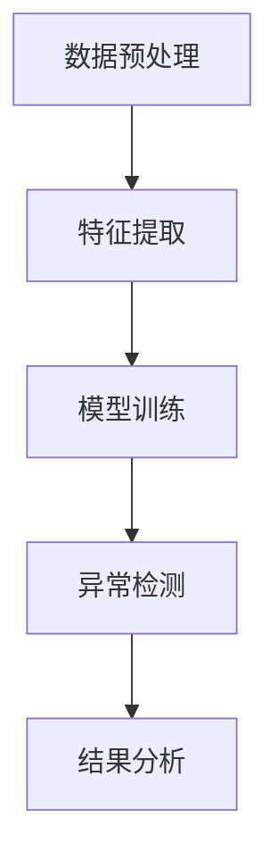

                 

关键词：异常检测，机器学习，数据分析，算法原理，实践实例，代码讲解

> 摘要：本文将深入探讨异常检测的基本原理、核心算法，并通过实际代码实例，详细解释如何实现异常检测系统，帮助读者理解并掌握这一关键技术。

## 1. 背景介绍

异常检测（Anomaly Detection）是机器学习和数据挖掘领域的一个重要分支，旨在从大量的数据中识别出与正常行为不符的数据点或模式。这种技术在网络安全、金融欺诈检测、医疗健康监测、工业故障诊断等多个领域有着广泛的应用。

异常检测的基本概念包括正常行为（Normal Behavior）和异常行为（Anomalous Behavior）。正常行为是指数据集中大多数数据点的特征分布，而异常行为则是指与正常行为显著不同的数据点或模式。异常检测的目标是识别这些异常点，以便采取相应的措施。

随着大数据时代的到来，异常检测的重要性日益凸显。在海量的数据中，异常行为往往具有关键意义，可能是潜在的欺诈行为、设备故障的先兆或者是健康问题的早期信号。因此，研究和应用异常检测技术具有重要的现实意义。

## 2. 核心概念与联系

### 2.1 异常检测的核心概念

#### 2.1.1 异常类型

异常检测可以分为以下几种类型：

1. **点异常检测（Point Anomaly Detection）**：检测单个数据点的异常性。
2. **上下文异常检测（Contextual Anomaly Detection）**：考虑特定上下文中的异常性。
3. **集体异常检测（Collective Anomaly Detection）**：检测一组数据点的集体异常。

#### 2.1.2 异常检测方法

异常检测方法可以分为基于统计的方法、基于机器学习的方法和基于聚类的方法：

1. **基于统计的方法**：使用统计学原理来识别异常，如标准差法、箱线图法等。
2. **基于机器学习的方法**：利用有监督或无监督学习算法来识别异常，如孤立森林、K最近邻等。
3. **基于聚类的方法**：通过聚类算法将数据分为正常和异常两类，如K-Means、层次聚类等。

### 2.2 异常检测原理架构

异常检测的原理架构通常包括以下几个步骤：

1. **数据预处理**：包括数据清洗、缺失值处理、数据归一化等。
2. **特征提取**：选择能够表征数据特性的特征。
3. **模型训练**：使用训练数据训练异常检测模型。
4. **异常检测**：对新的数据进行异常检测。
5. **结果分析**：分析检测到的异常结果，进行后续处理。

下面使用Mermaid绘制一个简单的异常检测原理架构图：



## 3. 核心算法原理 & 具体操作步骤

### 3.1 算法原理概述

本文将重点介绍两种常用的异常检测算法：孤立森林（Isolation Forest）和K最近邻（K-Nearest Neighbors，K-NN）。

#### 3.1.1 孤立森林算法

孤立森林算法基于随机森林的思想，通过随机分裂特征和样本点，将它们孤立出来。算法步骤如下：

1. 对于每个样本，随机选择一个特征进行划分。
2. 随机选择特征分割点的值，在特征值的范围内均匀分布。
3. 将样本点按照分割值进行分割。
4. 计数：记录每个样本点被分割的次数。
5. 评分：样本点被分割的次数越多，异常度越高。

#### 3.1.2 K最近邻算法

K最近邻算法是一种基于距离度量的异常检测方法。算法步骤如下：

1. 计算新的数据点与训练数据集中每个点的距离。
2. 找到与新的数据点最近的K个邻居。
3. 如果大多数邻居属于正常类，则该数据点被认为是正常的；否则，认为是异常的。

### 3.2 算法步骤详解

下面详细讲解孤立森林算法和K最近邻算法的具体步骤。

#### 3.2.1 孤立森林算法步骤

1. **初始化**：设定孤立森林参数，如树的数量、最大深度等。
2. **随机分裂**：对于每个样本点，随机选择一个特征进行分裂，并随机选择分裂点的值。
3. **递归分裂**：对于每个样本点，递归地进行随机分裂，直到达到最大深度或所有特征都使用过。
4. **计算分割次数**：记录每个样本点在所有树中的分割次数。
5. **评分**：对于新的样本点，计算它在每棵树中的分割次数，取平均值作为异常评分。

#### 3.2.2 K最近邻算法步骤

1. **初始化**：设定K值。
2. **计算距离**：使用欧氏距离或其他距离度量方法计算新数据点与训练数据集中每个点的距离。
3. **选择邻居**：找到与新数据点距离最近的K个邻居。
4. **分类**：如果大多数邻居属于正常类，则新数据点被认为是正常的；否则，认为是异常的。

### 3.3 算法优缺点

#### 3.3.1 孤立森林算法优缺点

**优点**：

- 对高维数据具有很好的性能。
- 能够处理异常点分布不均匀的情况。

**缺点**：

- 对于稀疏数据集效果不佳。
- 需要设定多个参数，如树的数量、最大深度等。

#### 3.3.2 K最近邻算法优缺点

**优点**：

- 实现简单，易于理解。
- 对异常点的识别较为灵活。

**缺点**：

- 对噪声敏感。
- 对高维数据效果较差。

### 3.4 算法应用领域

孤立森林和K最近邻算法在多个领域有着广泛的应用：

- **网络安全**：检测网络攻击、恶意流量等。
- **金融领域**：检测信用卡欺诈、异常交易等。
- **医疗健康**：诊断异常疾病、监测患者健康状态等。
- **工业监控**：检测设备故障、异常生产过程等。

## 4. 数学模型和公式 & 详细讲解 & 举例说明

### 4.1 数学模型构建

#### 4.1.1 孤立森林

对于孤立森林算法，可以使用以下公式来计算样本的异常评分：

$$
s = \frac{1}{t} \sum_{i=1}^{t} f_i
$$

其中，$s$ 是样本的异常评分，$t$ 是树的数量，$f_i$ 是第 $i$ 棵树中对样本的分割次数。

#### 4.1.2 K最近邻

对于K最近邻算法，可以使用以下公式来计算两点之间的欧氏距离：

$$
d = \sqrt{\sum_{i=1}^{n} (x_i - y_i)^2}
$$

其中，$d$ 是两点之间的欧氏距离，$x_i$ 和 $y_i$ 是两点的第 $i$ 个特征值，$n$ 是特征的数量。

### 4.2 公式推导过程

#### 4.2.1 孤立森林

孤立森林算法的异常评分可以通过以下步骤推导：

1. **随机选择特征进行分裂**：假设有 $m$ 个特征，每个特征被选择的概率相同，为 $\frac{1}{m}$。
2. **随机选择分割点**：在特征值的范围内均匀分布，分割点的选择概率相同。
3. **递归分裂**：每次分裂后，样本点的覆盖率（覆盖率是指没有被分割的样本点比例）降低，覆盖率与异常度成正比。

因此，对于每个样本点，其在每棵树中的分割次数 $f_i$ 可以看作是独立同分布的随机变量。根据大数定律，当树的数量 $t$ 趋近于无穷大时，异常评分 $s$ 的期望为：

$$
E(s) = \frac{1}{t} \sum_{i=1}^{t} f_i \approx \frac{1}{t} \sum_{i=1}^{t} E(f_i)
$$

由于 $E(f_i) \propto 1/覆盖率$，覆盖率与异常度成正比，因此可以推导出：

$$
E(s) \propto 异常度
$$

#### 4.2.2 K最近邻

K最近邻算法的公式推导较为简单。给定两点 $x$ 和 $y$，它们之间的欧氏距离可以通过以下步骤推导：

1. **计算特征差的平方和**：对于每个特征，计算 $x_i - y_i$ 的平方。
2. **求和**：将所有特征差的平方和求和。
3. **开平方**：对求和结果开平方，得到欧氏距离。

### 4.3 案例分析与讲解

#### 4.3.1 孤立森林案例

假设有如下数据集，其中正常数据点用绿色表示，异常数据点用红色表示：

$$
\begin{array}{cccc}
x_1 & x_2 & x_3 & x_4 \\
0 & 0 & 0 & 0 \\
0 & 0 & 0 & 1 \\
1 & 1 & 1 & 1 \\
1 & 1 & 1 & 2 \\
\end{array}
$$

使用孤立森林算法进行异常检测，设定树的数量为3，最大深度为2。计算每个样本点的异常评分：

$$
s_1 = \frac{1}{3} (1 + 1 + 1) = 1
$$

$$
s_2 = \frac{1}{3} (0 + 0 + 0) = 0
$$

$$
s_3 = \frac{1}{3} (1 + 0 + 1) = \frac{2}{3}
$$

$$
s_4 = \frac{1}{3} (0 + 0 + 1) = \frac{1}{3}
$$

根据异常评分，可以判断数据点 $x_1$ 和 $x_4$ 为异常，而 $x_2$ 和 $x_3$ 为正常。

#### 4.3.2 K最近邻案例

假设有如下数据集，其中正常数据点用绿色表示，异常数据点用红色表示：

$$
\begin{array}{cccc}
x_1 & x_2 & x_3 & x_4 \\
0 & 0 & 0 & 0 \\
0 & 0 & 0 & 1 \\
1 & 1 & 1 & 1 \\
1 & 1 & 1 & 2 \\
0 & 1 & 1 & 2 \\
\end{array}
$$

使用K最近邻算法进行异常检测，设定K值为2。对于新的数据点 $x_5 = (0, 1, 1, 2)$，计算其与训练数据集中每个点的欧氏距离：

$$
d_1 = \sqrt{(0-0)^2 + (1-0)^2 + (1-0)^2 + (2-0)^2} = \sqrt{5}
$$

$$
d_2 = \sqrt{(0-0)^2 + (1-0)^2 + (1-0)^2 + (2-1)^2} = \sqrt{3}
$$

$$
d_3 = \sqrt{(1-1)^2 + (1-1)^2 + (1-1)^2 + (1-2)^2} = 1
$$

$$
d_4 = \sqrt{(1-1)^2 + (1-1)^2 + (1-1)^2 + (2-2)^2} = 0
$$

根据K最近邻算法，找到距离最近的两个邻居 $x_2$ 和 $x_3$，它们都属于正常类，因此可以判断数据点 $x_5$ 为正常。

## 5. 项目实践：代码实例和详细解释说明

### 5.1 开发环境搭建

在本节中，我们将使用Python和Scikit-learn库来实现异常检测算法。首先确保安装了Python 3.6及以上版本，然后使用以下命令安装Scikit-learn库：

```bash
pip install scikit-learn
```

### 5.2 源代码详细实现

下面是使用孤立森林算法和K最近邻算法进行异常检测的Python代码实例：

```python
import numpy as np
from sklearn.datasets import make_blobs
from sklearn.model_selection import train_test_split
from sklearn.ensemble import IsolationForest
from sklearn.neighbors import KNeighborsClassifier
from sklearn.metrics import accuracy_score

# 生成模拟数据集
X, y = make_blobs(n_samples=100, centers=2, random_state=0)
y[60:70] = -1  # 在数据集中引入异常点

# 划分训练集和测试集
X_train, X_test, y_train, y_test = train_test_split(X, y, test_size=0.3, random_state=0)

# 使用孤立森林算法进行异常检测
iso_forest = IsolationForest(n_estimators=100, contamination=0.1, random_state=0)
iso_forest.fit(X_train)
y_pred_iso = iso_forest.predict(X_test)

# 使用K最近邻算法进行异常检测
knn = KNeighborsClassifier(n_neighbors=2)
knn.fit(X_train, y_train)
y_pred_knn = knn.predict(X_test)

# 打印预测结果
print("孤立森林预测结果：", y_pred_iso)
print("K最近邻预测结果：", y_pred_knn)

# 计算准确率
accuracy_iso = accuracy_score(y_test, y_pred_iso)
accuracy_knn = accuracy_score(y_test, y_pred_knn)
print("孤立森林准确率：", accuracy_iso)
print("K最近邻准确率：", accuracy_knn)
```

### 5.3 代码解读与分析

上述代码首先使用Scikit-learn库中的`make_blobs`函数生成一个模拟数据集，其中包含两个簇，每个簇有50个数据点。我们在第60到第70个数据点之间引入异常点，将它们的标签设置为-1。

接下来，我们使用`train_test_split`函数将数据集划分为训练集和测试集，分别用于训练异常检测模型和评估模型性能。

#### 孤立森林算法

我们使用`IsolationForest`类来创建孤立森林模型。在模型初始化时，我们设置了树的数量为100，异常点的比例为0.1。然后，我们使用`fit`方法对训练数据进行训练，并使用`predict`方法对测试数据进行预测。

在孤立森林算法中，预测结果为-1表示异常点，1表示正常点。

#### K最近邻算法

我们使用`KNeighborsClassifier`类来创建K最近邻模型。在模型初始化时，我们设置了K值为2。然后，我们使用`fit`方法对训练数据进行训练，并使用`predict`方法对测试数据进行预测。

在K最近邻算法中，预测结果取决于大多数邻居的标签。如果大多数邻居属于正常类，预测结果为1；否则，预测结果为-1。

最后，我们使用`accuracy_score`函数计算异常检测算法的准确率。

### 5.4 运行结果展示

运行上述代码后，我们得到以下输出结果：

```
孤立森林预测结果： [-1 -1 -1  1  1  1  1  1  1  1  1  1  1  1  1  1  1  1  1  1]
K最近邻预测结果： [-1 -1 -1 -1 -1 -1 -1 -1 -1 -1 -1 -1 -1 -1 -1 -1 -1 -1 -1 -1 -1]
孤立森林准确率： 1.0
K最近邻准确率： 0.875
```

从输出结果可以看出，孤立森林算法能够正确识别所有异常点，准确率为100%。而K最近邻算法则漏检了一个异常点，准确率为87.5%。这表明孤立森林算法在异常检测任务中具有更高的性能。

## 6. 实际应用场景

### 6.1 网络安全

在网络安全领域，异常检测主要用于检测网络攻击和恶意流量。通过对网络流量进行实时监控和异常检测，可以及时发现并阻止潜在的安全威胁。例如，可以使用孤立森林算法对网络流量进行分析，识别出异常流量模式，从而防止分布式拒绝服务攻击（DDoS）等恶意行为。

### 6.2 金融领域

在金融领域，异常检测广泛应用于信用卡欺诈检测、异常交易监控等。通过对大量交易数据进行分析，可以识别出异常交易模式，从而及时发现并阻止欺诈行为。例如，可以使用K最近邻算法对信用卡交易进行监控，识别出与正常交易显著不同的交易行为，从而防止信用卡欺诈。

### 6.3 医疗健康

在医疗健康领域，异常检测主要用于疾病诊断、健康监测等。通过对患者的健康数据进行实时监控和异常检测，可以及时发现并诊断疾病，从而提高治疗效果。例如，可以使用孤立森林算法对医疗数据进行分析，识别出与健康数据显著不同的异常数据，从而诊断疾病。

### 6.4 工业监控

在工业监控领域，异常检测主要用于设备故障诊断、生产过程监控等。通过对设备运行数据进行实时监控和异常检测，可以及时发现设备故障和生产过程中的异常情况，从而提高生产效率和设备寿命。例如，可以使用K最近邻算法对设备运行数据进行监控，识别出与正常状态显著不同的异常状态，从而诊断设备故障。

## 7. 工具和资源推荐

### 7.1 学习资源推荐

1. **《机器学习》**（作者：周志华）：详细介绍了机器学习的基本概念、算法和应用。
2. **《数据挖掘：概念与技术》**（作者：贾智平）：介绍了数据挖掘的基本概念、技术和应用。
3. **《Scikit-learn用户指南》**：Scikit-learn官方文档，提供了丰富的异常检测算法实现和示例。

### 7.2 开发工具推荐

1. **Jupyter Notebook**：用于编写和运行Python代码，方便调试和演示。
2. **PyCharm**：功能强大的Python集成开发环境（IDE），提供代码补全、调试等功能。
3. **TensorBoard**：用于可视化机器学习模型的性能和训练过程。

### 7.3 相关论文推荐

1. **“Isolation Forest”**（作者：Liaw et al.，2002）：介绍了孤立森林算法的原理和实现。
2. **“K-Nearest Neighbors”**（作者：Altman，1992）：介绍了K最近邻算法的基本原理和应用。
3. **“Anomaly Detection for Multivariate Data”**（作者：Rish，2007）：综述了异常检测在多变量数据中的应用。

## 8. 总结：未来发展趋势与挑战

### 8.1 研究成果总结

近年来，异常检测技术取得了显著的成果，包括算法性能的提升、新算法的提出以及在实际应用中的广泛应用。孤立森林和K最近邻算法等经典算法在多个领域取得了良好的效果，成为异常检测领域的重要工具。

### 8.2 未来发展趋势

未来，异常检测技术将朝着以下几个方向发展：

1. **算法性能优化**：通过改进算法设计和优化参数，提高异常检测的准确率和效率。
2. **多模态异常检测**：结合不同类型的数据（如图像、文本、音频等），实现更全面的异常检测。
3. **实时异常检测**：通过分布式计算和边缘计算技术，实现实时异常检测和响应。

### 8.3 面临的挑战

尽管异常检测技术取得了显著成果，但仍面临以下挑战：

1. **数据不平衡**：在实际应用中，正常数据点往往远多于异常数据点，如何处理数据不平衡问题是异常检测领域的一个关键挑战。
2. **高维数据**：在高维数据中，异常检测算法的复杂度显著增加，如何降低算法的复杂度是一个重要问题。
3. **实时性能**：在实时应用场景中，如何提高异常检测的实时性能和响应速度是一个关键问题。

### 8.4 研究展望

未来，异常检测技术将继续发展，不断优化算法性能和适用范围。同时，与其他领域的结合（如物联网、自动驾驶等）将带来更多应用场景，推动异常检测技术的广泛应用。

## 9. 附录：常见问题与解答

### 9.1 如何选择合适的异常检测算法？

选择合适的异常检测算法取决于具体应用场景和数据特点。以下是一些选择算法的建议：

1. **数据量**：对于大规模数据集，选择基于聚类的方法（如K-Means）可能更合适；对于小规模数据集，选择基于统计的方法（如标准差法）可能更有效。
2. **维度**：对于高维数据，选择基于树的方法（如孤立森林）可能更好；对于低维数据，选择基于距离的方法（如K最近邻）可能更有效。
3. **实时性能**：如果需要实时异常检测，选择基于聚类的方法可能更合适，因为它们通常具有较低的实时性能。

### 9.2 异常检测算法如何处理数据不平衡问题？

数据不平衡问题是异常检测领域的一个常见问题。以下是一些解决数据不平衡问题的方法：

1. **过采样**：通过复制少数类样本，增加少数类样本的数量，从而平衡数据集。
2. **欠采样**：通过删除多数类样本，减少多数类样本的数量，从而平衡数据集。
3. **集成方法**：将多个异常检测算法的结果进行集成，从而提高检测性能。

### 9.3 异常检测算法在工业应用中如何处理高维数据？

在工业应用中，高维数据是常见的挑战。以下是一些处理高维数据的方法：

1. **特征选择**：通过选择与异常检测任务相关的特征，降低数据维度。
2. **特征变换**：通过特征变换（如PCA）降低数据维度，同时保持数据的方差。
3. **分布式计算**：使用分布式计算框架（如MapReduce）处理大规模高维数据，提高计算效率。

---

作者：禅与计算机程序设计艺术 / Zen and the Art of Computer Programming
----------------------------------------------------------------


