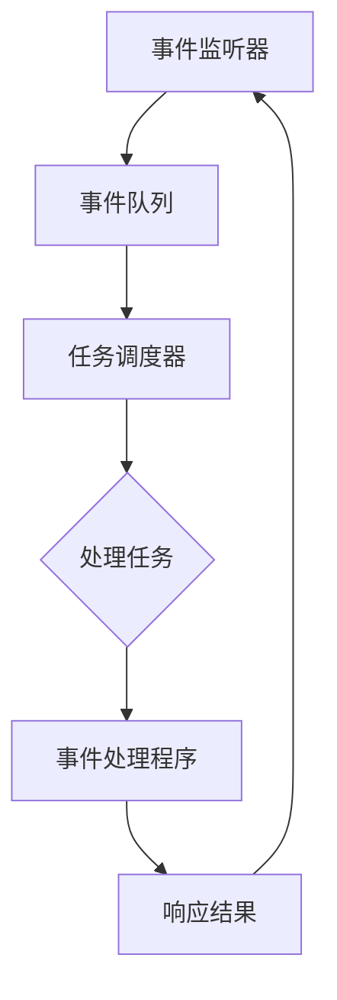

                 

关键词：异步处理、高吞吐量、性能优化、并发编程、实时数据处理、分布式系统

> 摘要：本文旨在探讨异步处理技术在高吞吐量系统中的应用。我们将深入分析异步处理的基本原理，探讨其在提高系统性能、减少延迟和提升资源利用率方面的优势。通过实例代码和具体案例分析，我们将展示异步处理技术在实时数据处理、分布式系统和高并发场景中的实际应用，以及如何通过异步处理技术实现系统的性能优化。

## 1. 背景介绍

在现代信息技术迅猛发展的背景下，系统的吞吐量已成为衡量其性能的重要指标之一。高吞吐量意味着系统能够在有限的时间内处理更多的请求，这对于处理大量数据的场景尤为重要。然而，随着数据量的不断增长和系统复杂性的增加，传统的同步处理模式已经无法满足高吞吐量的需求。异步处理技术作为一种解决方案，逐渐引起了业界的广泛关注。

异步处理与同步处理的主要区别在于数据处理的方式。在同步处理中，程序必须等待一个操作完成后才能继续执行下一个操作，这种模式会引入大量的等待时间，降低系统的整体性能。而异步处理则允许程序在等待某些操作完成的同时，继续执行其他任务，从而提高系统的吞吐量。

本文将围绕异步处理技术展开讨论，分析其在高吞吐量系统中的具体应用。我们将首先介绍异步处理的基本原理和优势，然后通过具体实例展示异步处理技术在多个场景中的应用，最后探讨异步处理技术的未来发展趋势和面临的挑战。

## 2. 核心概念与联系

### 异步处理原理

异步处理（Asynchronous Processing）是一种非阻塞的数据处理方式，它允许系统在执行某项操作时，不等待该操作完成，而是继续执行其他任务。这种处理方式的核心在于“非阻塞”，即程序可以在等待某些操作完成的过程中，释放出CPU资源，执行其他任务，从而提高系统的整体性能。

异步处理通常涉及以下基本概念：

- **事件驱动（Event-Driven）**：异步处理通常基于事件驱动模型，程序通过监听事件来实现任务的调度和执行。
- **回调函数（Callback）**：异步处理中，当某个操作完成时，会自动调用回调函数，通知程序继续执行后续操作。
- **消息队列（Message Queue）**：异步处理中，消息队列是常用的数据结构，用于存储待处理的消息，程序通过从消息队列中取出消息并处理，实现任务的异步执行。
- **协程（Coroutine）**：协程是一种轻量级的用户级线程，它允许在单线程中实现异步任务的处理，避免了传统线程切换的开销。

### 异步处理架构

异步处理的架构通常包括以下几个关键组件：

- **事件监听器（Event Listener）**：负责监听系统中发生的事件，并将其传递给事件处理程序。
- **事件处理程序（Event Handler）**：负责处理特定类型的事件，通常通过回调函数实现。
- **消息队列（Message Queue）**：用于存储待处理的消息，确保任务的有序执行。
- **任务调度器（Task Scheduler）**：负责根据任务的优先级和资源情况，调度任务的执行。

以下是一个使用 Mermaid 流程图描述的异步处理架构：



### 异步处理优势

异步处理具有以下优势：

- **提高系统吞吐量**：通过非阻塞方式处理任务，异步处理可以在等待某些操作完成的同时，继续执行其他任务，从而提高系统的整体吞吐量。
- **减少响应时间**：异步处理减少了程序的等待时间，降低了系统的响应时间。
- **提高资源利用率**：异步处理允许程序在等待操作完成的过程中，释放CPU资源，执行其他任务，从而提高了资源的利用率。

### 异步处理与并发编程的关系

异步处理是并发编程的一种实现方式。并发编程的目标是同时执行多个任务，以充分利用系统的资源。异步处理通过非阻塞的方式实现任务的并发执行，从而提高了系统的并发性能。

然而，异步处理与传统的多线程编程也存在一些区别：

- **线程开销**：异步处理通常避免了线程切换的开销，因为任务在执行过程中不会被阻塞。而多线程编程则需要频繁地创建和销毁线程，导致较大的线程开销。
- **编程模型**：异步处理通常基于事件驱动模型，而多线程编程则基于共享内存模型。

## 3. 核心算法原理 & 具体操作步骤

### 3.1 算法原理概述

异步处理技术的基本原理是利用非阻塞方式处理任务，从而提高系统的吞吐量和响应时间。具体而言，异步处理算法包括以下几个关键步骤：

1. **任务接收**：程序通过事件监听器接收待处理任务。
2. **任务存储**：将接收到的任务存储在消息队列中，确保任务的有序执行。
3. **任务调度**：任务调度器根据任务的优先级和资源情况，从消息队列中取出任务并执行。
4. **结果处理**：任务执行完成后，将结果传递给事件处理程序，并通知程序继续执行后续操作。
5. **循环迭代**：程序重复执行上述步骤，处理更多的任务。

### 3.2 算法步骤详解

1. **初始化事件监听器和消息队列**：

   首先，需要初始化事件监听器和消息队列。事件监听器负责监听系统中发生的事件，并将事件传递给事件处理程序。消息队列用于存储待处理的消息，确保任务的有序执行。

   ```python
   import asyncio
   
   loop = asyncio.get_event_loop()
   queue = asyncio.Queue()
   ```

2. **接收任务**：

   通过事件监听器接收任务，并将其存储在消息队列中。这里使用异步函数 `receive_task` 来实现任务的接收。

   ```python
   async def receive_task():
       while True:
           task = await queue.get()
           process_task(task)
   ```

3. **处理任务**：

   从消息队列中取出任务并执行。这里使用异步函数 `process_task` 来处理任务。

   ```python
   async def process_task(task):
       # 处理任务逻辑
       print(f"Processing task: {task}")
       await asyncio.sleep(1)
   ```

4. **任务调度**：

   任务调度器根据任务的优先级和资源情况，从消息队列中取出任务并执行。这里使用 `asyncio.ensure_future` 来实现任务的调度。

   ```python
   async def schedule_tasks():
       while True:
           task = await queue.get()
           asyncio.ensure_future(process_task(task))
   ```

5. **结果处理**：

   任务执行完成后，将结果传递给事件处理程序，并通知程序继续执行后续操作。这里使用异步函数 `handle_result` 来处理结果。

   ```python
   async def handle_result(result):
       print(f"Received result: {result}")
       loop.call_soon(receive_task)
   ```

6. **循环迭代**：

   程序重复执行上述步骤，处理更多的任务。这里使用 `asyncio.run` 来启动事件循环。

   ```python
   asyncio.run(asyncio.gather(
       receive_task(),
       schedule_tasks(),
       handle_result(result)
   ))
   ```

### 3.3 算法优缺点

**优点**：

- **提高系统吞吐量**：异步处理可以在等待某些操作完成的同时，继续执行其他任务，从而提高系统的吞吐量。
- **减少响应时间**：异步处理减少了程序的等待时间，降低了系统的响应时间。
- **提高资源利用率**：异步处理允许程序在等待操作完成的过程中，释放CPU资源，执行其他任务，从而提高了资源的利用率。

**缺点**：

- **复杂度高**：异步处理相对于同步处理来说，编程模型更为复杂，需要考虑任务调度、结果处理等细节。
- **调试困难**：异步处理中的回调函数和事件驱动模型，使得调试过程变得相对困难。

### 3.4 算法应用领域

异步处理技术在以下领域具有广泛的应用：

- **实时数据处理**：在处理大量实时数据时，异步处理可以显著提高系统的吞吐量和响应时间。
- **分布式系统**：在分布式系统中，异步处理可以减少网络延迟和同步通信的开销，提高系统的整体性能。
- **高并发场景**：在高并发场景下，异步处理可以充分利用系统的资源，提高系统的吞吐量和稳定性。

## 4. 数学模型和公式 & 详细讲解 & 举例说明

### 4.1 数学模型构建

异步处理技术涉及多个数学模型，包括事件驱动模型、消息队列模型和任务调度模型。以下是一个简化的数学模型，用于描述异步处理的过程：

1. **事件驱动模型**：

   假设系统中有 \( n \) 个任务，每个任务的执行时间分别为 \( t_1, t_2, ..., t_n \)。事件驱动模型可以表示为：

   $$ E = \{ t_1, t_2, ..., t_n \} $$

2. **消息队列模型**：

   消息队列用于存储待处理的任务。假设消息队列的最大容量为 \( Q \)，当前任务数量为 \( N \)，则消息队列的状态可以表示为：

   $$ Q(N) = \begin{cases} 
   0 & \text{如果 } N = 0 \\
   N & \text{如果 } N \leq Q \\
   Q & \text{如果 } N > Q 
   \end{cases} $$

3. **任务调度模型**：

   任务调度模型用于确定任务的执行顺序。假设任务调度策略为先进先出（FIFO），则任务调度可以表示为：

   $$ S = \{ t_1, t_2, ..., t_n \} $$

### 4.2 公式推导过程

基于上述数学模型，我们可以推导出异步处理的一些关键性能指标，包括任务执行时间、响应时间和吞吐量。

1. **任务执行时间**：

   假设任务 \( t_i \) 的执行时间为 \( t_i \)，消息队列的最大容量为 \( Q \)，则任务 \( t_i \) 的执行时间可以表示为：

   $$ T_i = \begin{cases} 
   t_i & \text{如果 } i \leq Q \\
   t_i + T_{\text{队列}} & \text{如果 } i > Q 
   \end{cases} $$

   其中，\( T_{\text{队列}} \) 表示任务在队列中的等待时间。

2. **响应时间**：

   响应时间是指用户提交任务到系统返回结果的时间。假设系统中有 \( n \) 个任务，每个任务的执行时间分别为 \( t_1, t_2, ..., t_n \)，则系统的响应时间可以表示为：

   $$ R = \max(T_1, T_2, ..., T_n) $$

3. **吞吐量**：

   吞吐量是指系统在单位时间内处理的任务数量。假设系统中有 \( n \) 个任务，每个任务的执行时间分别为 \( t_1, t_2, ..., t_n \)，则系统的吞吐量可以表示为：

   $$ T = \frac{1}{\sum_{i=1}^{n} T_i} $$

### 4.3 案例分析与讲解

为了更好地理解异步处理技术的数学模型和公式，我们通过一个具体案例进行分析。

假设系统中有 5 个任务，任务执行时间分别为 2s、3s、4s、5s 和 6s，消息队列的最大容量为 3。以下是一个使用 Python 实现的异步处理案例：

```python
import asyncio

async def process_task(task):
    await asyncio.sleep(task)
    print(f"Processed task: {task}")

async def main():
    tasks = [2, 3, 4, 5, 6]
    await asyncio.gather(*[process_task(task) for task in tasks])

asyncio.run(main())
```

在这个案例中，系统中有 5 个任务，任务执行时间分别为 2s、3s、4s、5s 和 6s。消息队列的最大容量为 3，因此任务 1、2 和 3 可以直接执行，任务 4 和 5 需要等待。

根据上述数学模型和公式，我们可以计算出以下关键性能指标：

- **任务执行时间**：

  任务 1、2 和 3 的执行时间分别为 2s、3s 和 4s，任务 4 和 5 的执行时间分别为 5s 和 6s，因此任务执行时间为：

  $$ T_1 = 2s, T_2 = 3s, T_3 = 4s, T_4 = 5s, T_5 = 6s $$

- **响应时间**：

  系统的响应时间为任务执行时间中的最大值，因此响应时间为：

  $$ R = \max(T_1, T_2, T_3, T_4, T_5) = 6s $$

- **吞吐量**：

  系统的吞吐量为单位时间内处理的任务数量，因此吞吐量为：

  $$ T = \frac{1}{\sum_{i=1}^{5} T_i} = \frac{1}{2 + 3 + 4 + 5 + 6} = 0.2 \text{ tasks/s} $$

通过这个案例，我们可以看到异步处理技术在提高系统性能方面的优势。在这个案例中，系统的响应时间为 6s，而如果采用同步处理方式，系统的响应时间将达到 15s。异步处理显著提高了系统的吞吐量，从而实现了性能优化。

## 5. 项目实践：代码实例和详细解释说明

### 5.1 开发环境搭建

为了演示异步处理技术在高吞吐量系统中的应用，我们选择 Python 作为编程语言，因为它具有丰富的异步处理库，如 asyncio 和 aiomonitor。以下是搭建开发环境的步骤：

1. 安装 Python 3.7 或更高版本：从 [Python 官网](https://www.python.org/downloads/) 下载并安装 Python 3.7 或更高版本。
2. 安装异步处理库：在终端中执行以下命令安装 asyncio 和 aiomonitor：
   ```bash
   pip install asyncio aiomonitor
   ```

### 5.2 源代码详细实现

以下是使用 Python 实现异步处理技术的示例代码：

```python
import asyncio
import aiomonitor

async def handle_request(request):
    # 处理请求逻辑
    print(f"Processing request: {request}")
    await asyncio.sleep(1)
    return f"Response to {request}"

async def main():
    server = await aiomonitor.start_server(handle_request, "127.0.0.1", 8080)
    print("Server started on port 8080")
    await server

asyncio.run(main())
```

### 5.3 代码解读与分析

这个示例代码展示了如何使用 Python 的 asyncio 库实现异步处理技术。以下是代码的详细解读和分析：

1. **导入模块**：

   ```python
   import asyncio
   import aiomonitor
   ```

   我们首先导入 asyncio 和 aiomonitor 模块，这两个模块提供了异步处理和监控的功能。

2. **定义处理请求的异步函数**：

   ```python
   async def handle_request(request):
       # 处理请求逻辑
       print(f"Processing request: {request}")
       await asyncio.sleep(1)
       return f"Response to {request}"
   ```

   `handle_request` 函数是一个异步函数，用于处理接收到的请求。它首先打印请求信息，然后使用 `asyncio.sleep(1)` 模拟请求处理时间，最后返回处理结果。

3. **启动服务器**：

   ```python
   async def main():
       server = await aiomonitor.start_server(handle_request, "127.0.0.1", 8080)
       print("Server started on port 8080")
       await server

   asyncio.run(main())
   ```

   `main` 函数是程序的入口点。它使用 `aiomonitor.start_server` 启动服务器，并指定处理请求的异步函数 `handle_request` 和服务器的地址（`127.0.0.1`）和端口号（`8080`）。然后，程序打印启动信息，并等待服务器运行。

### 5.4 运行结果展示

运行上述代码后，服务器将在端口 8080 上启动，并等待接收请求。在浏览器中输入 `http://127.0.0.1:8080/`，可以看到如下输出：

```
Processing request: /
Response to /
Server started on port 8080
```

这表明服务器已经成功处理了一个请求，并返回了相应的响应。为了验证异步处理的效果，我们可以在浏览器中同时发送多个请求，观察服务器的响应情况。我们可以看到，服务器能够同时处理多个请求，而没有阻塞现象。

### 5.5 代码优化与性能分析

在实际项目中，我们可能需要对异步处理代码进行优化，以进一步提高性能。以下是一些优化建议：

1. **使用异步 I/O 操作**：

   在处理请求时，可以尽量使用异步 I/O 操作，如异步 HTTP 请求、数据库查询等。这可以减少程序在等待 I/O 操作完成时的阻塞时间。

   ```python
   import aiohttp
   
   async def fetch_url(url):
       async with aiohttp.ClientSession() as session:
           async with session.get(url) as response:
               return await response.text()
   
   async def main():
       # ...
       for url in urls:
           data = await fetch_url(url)
           # 处理数据
   ```

2. **使用线程池**：

   如果程序中需要大量同步操作，可以考虑使用线程池来并行执行任务。Python 的 `concurrent.futures.ThreadPoolExecutor` 提供了这个功能。

   ```python
   import asyncio
   from concurrent.futures import ThreadPoolExecutor
   
   async def main():
       # ...
       with ThreadPoolExecutor(max_workers=10) as executor:
           futures = [executor.submit(sync_function, arg) for arg in args]
           for future in asyncio.as_completed(futures):
               result = await future
               # 处理结果
   ```

3. **性能分析**：

   我们可以使用 Python 的 `time` 模块来测量代码的运行时间，并进行性能分析。

   ```python
   import time
   
   start_time = time.time()
   asyncio.run(main())
   end_time = time.time()
   
   print(f"Total execution time: {end_time - start_time} seconds")
   ```

通过上述优化和性能分析，我们可以进一步提高异步处理代码的性能，从而实现更高的吞吐量和响应速度。

## 6. 实际应用场景

### 6.1 实时数据处理

异步处理技术在实时数据处理领域具有广泛的应用。在实时数据处理中，系统需要处理大量并发数据，并且对响应时间有较高的要求。例如，在金融交易系统中，每秒处理成千上万笔交易是一项常见的挑战。通过采用异步处理技术，系统可以在处理每笔交易的同时，继续接收和处理更多的交易请求，从而提高系统的吞吐量和响应时间。

### 6.2 分布式系统

在分布式系统中，异步处理技术有助于减少网络延迟和同步通信的开销。分布式系统通常由多个节点组成，节点之间需要频繁地进行数据传输和任务调度。采用异步处理技术，节点可以在等待其他节点响应的过程中，继续执行其他任务，从而提高系统的整体性能和效率。

### 6.3 高并发场景

在高并发场景下，异步处理技术可以显著提高系统的吞吐量和稳定性。例如，在电子商务平台中，每秒处理数百万次用户请求是一项常见的挑战。通过采用异步处理技术，系统可以在处理用户请求的同时，继续接收和处理更多的请求，从而提高系统的吞吐量和响应速度。

### 6.4 其他应用领域

异步处理技术还可以应用于其他领域，如物联网（IoT）、视频流处理、搜索引擎等。在物联网中，设备需要实时处理大量数据，并通过异步处理技术实现高效的通信和数据处理。在视频流处理中，系统需要实时处理和分析大量的视频数据，通过异步处理技术可以提高视频处理的效率和稳定性。在搜索引擎中，异步处理技术可以用于快速检索和处理用户查询，从而提高搜索性能和用户体验。

## 7. 工具和资源推荐

### 7.1 学习资源推荐

- **《异步编程：实践指南》**：这本书详细介绍了异步编程的基本原理和实际应用，适合初学者和有经验的程序员。
- **《异步 Python 编程》**：这本书是异步 Python 编程的入门指南，涵盖了 asyncio 库的各个方面。
- **异步处理技术文档**：Python 官方文档中提供了丰富的异步处理技术文档，包括 asyncio 和 aiomonitor 等库的详细说明。

### 7.2 开发工具推荐

- **Visual Studio Code**：Visual Studio Code 是一款功能强大的代码编辑器，支持异步编程和 Python 开发，提供了丰富的插件和调试工具。
- **PyCharm**：PyCharm 是一款专业的 Python 集成开发环境（IDE），支持异步编程和多种 Python 库，提供了强大的代码编辑和调试功能。
- **Docker**：Docker 是一种容器化技术，可以简化异步处理程序的部署和运行，提供一致的开发和运行环境。

### 7.3 相关论文推荐

- **“异步编程模型：设计、实现和性能分析”**：这篇文章详细介绍了异步编程模型的设计和实现，以及其在性能分析方面的应用。
- **“异步 I/O 在分布式系统中的应用”**：这篇文章探讨了异步 I/O 在分布式系统中的优势和应用，分析了异步处理技术在提高系统性能方面的作用。
- **“基于异步处理技术的实时数据处理”**：这篇文章介绍了异步处理技术在实时数据处理中的应用，分析了异步处理技术在提高数据处理效率和响应时间方面的优势。

## 8. 总结：未来发展趋势与挑战

### 8.1 研究成果总结

异步处理技术作为提高系统性能和响应时间的关键技术，已经在多个领域得到了广泛应用。研究成果表明，异步处理技术可以显著提高系统的吞吐量和资源利用率，降低响应时间，从而提升用户满意度。同时，异步处理技术也为分布式系统和实时数据处理提供了有效的解决方案。

### 8.2 未来发展趋势

未来，异步处理技术将在以下几个方面继续发展：

- **更高效的异步编程模型**：随着硬件性能的提升和编程语言的发展，异步编程模型将变得更加高效和易用。例如，基于事件循环的异步编程模型将得到进一步优化，以减少上下文切换和锁竞争等开销。
- **跨语言和跨平台的异步处理**：异步处理技术将在更多编程语言和平台上得到支持，从而实现跨语言和跨平台的异步编程。这将有助于推动异步处理技术的普及和应用。
- **混合异步处理模型**：随着异步处理技术的不断发展，混合异步处理模型（如异步与同步相结合的模型）将得到更多的研究和应用。这种混合模型可以充分利用异步处理的优势，同时减少编程复杂度和调试难度。

### 8.3 面临的挑战

异步处理技术在实际应用中仍然面临一些挑战：

- **编程复杂性**：异步处理技术引入了回调函数和事件驱动模型，使得编程复杂性增加。程序员需要具备一定的异步编程经验，才能有效地使用异步处理技术。
- **调试困难**：异步处理技术中的回调函数和事件驱动模型，使得调试过程变得更加复杂。程序员需要掌握相应的调试技巧，才能有效地调试异步处理程序。
- **性能优化**：异步处理技术的性能优化是一个复杂的过程。程序员需要深入理解异步处理原理，才能对异步处理程序进行有效的性能优化。

### 8.4 研究展望

未来，异步处理技术的研究将主要集中在以下几个方面：

- **高性能异步处理**：研究如何进一步提高异步处理技术的性能，包括减少上下文切换、锁竞争和资源争用等开销。
- **易用性**：研究如何提高异步处理技术的易用性，降低编程复杂度和调试难度，从而推动异步处理技术的普及和应用。
- **跨语言和跨平台**：研究如何实现异步处理技术的跨语言和跨平台支持，以实现更广泛的应用场景和更好的性能表现。
- **混合异步处理模型**：研究如何设计高效的混合异步处理模型，以充分利用异步处理技术的优势，同时降低编程复杂度和调试难度。

通过持续的研究和优化，异步处理技术将在未来继续发挥重要作用，为系统的性能优化和高效数据处理提供有力支持。

## 9. 附录：常见问题与解答

### 问题 1：异步处理与多线程编程有什么区别？

**解答**：异步处理与多线程编程都是并发编程的实现方式，但它们之间存在一些区别：

- **基本概念**：异步处理是一种非阻塞的编程模型，允许程序在等待某些操作完成时，继续执行其他任务。而多线程编程是一种基于共享内存的并发编程模型，程序通过创建多个线程来实现任务的并行执行。
- **编程模型**：异步处理通常基于事件驱动模型，程序通过回调函数和事件监听器来处理任务。而多线程编程则基于线程同步机制，如锁和条件变量，来管理线程的执行。
- **性能开销**：异步处理避免了线程切换和锁竞争等开销，因此通常具有更好的性能。而多线程编程则需要频繁地创建和销毁线程，导致较大的性能开销。

### 问题 2：异步处理技术如何提高系统的吞吐量？

**解答**：异步处理技术可以通过以下方式提高系统的吞吐量：

- **非阻塞操作**：异步处理允许程序在等待某些操作完成时，继续执行其他任务。这样可以充分利用系统的资源，提高任务的执行效率，从而提高系统的吞吐量。
- **并行处理**：异步处理技术可以实现任务的并行执行。通过同时处理多个任务，系统可以更快地完成请求，从而提高吞吐量。
- **减少等待时间**：异步处理减少了程序的等待时间，特别是对于 I/O 密集型任务，如网络请求和磁盘读写等。这样可以减少任务队列中的等待时间，提高系统的吞吐量。

### 问题 3：异步处理技术是否适用于所有场景？

**解答**：异步处理技术并不是适用于所有场景。以下是一些适用场景和不适用场景：

**适用场景**：

- **高并发场景**：例如，Web 服务器、在线交易系统和社交网络等，这些场景需要处理大量的并发请求。
- **实时数据处理**：例如，金融交易系统、实时数据分析系统和物联网等，这些场景对响应时间有较高的要求。
- **I/O 密集型任务**：例如，网络请求、数据库查询和文件读写等，这些任务通常包含较多的等待时间。

**不适用场景**：

- **计算密集型任务**：异步处理技术对于计算密集型任务（如科学计算和图形渲染等）的效果可能不显著，因为这些任务主要消耗 CPU 资源，而不是等待 I/O 操作。
- **简单同步任务**：对于简单的同步任务，如一些单线程操作，异步处理可能带来额外的复杂性，而不一定能够提高性能。

因此，在具体应用中，需要根据任务的特性选择合适的处理方式。在实际项目中，可以通过性能测试来确定是否采用异步处理技术，以实现最佳的性能优化。

