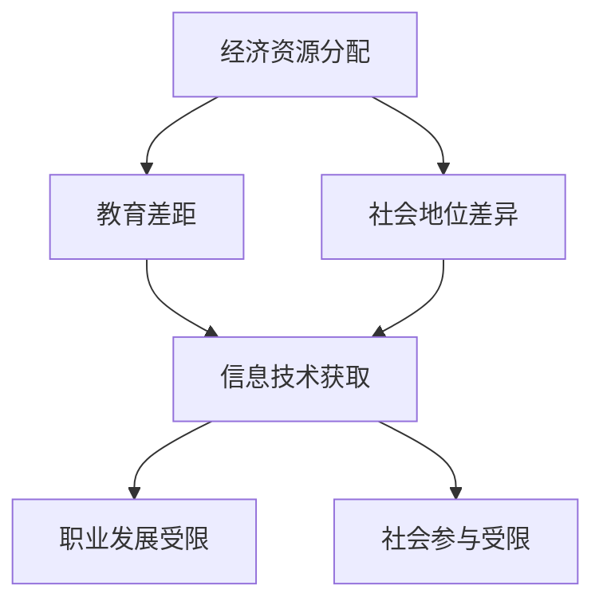

                 

关键词：数字鸿沟、计算公平性、信息技术、人工智能、教育、公共政策、工具和资源推荐、未来趋势

## 摘要

随着信息技术的飞速发展，人工智能逐渐融入我们日常生活的方方面面，但数字鸿沟问题也日益凸显。本文旨在探讨数字鸿沟对人类社会的影响，分析造成这一现象的原因，并提出一系列解决方案，以促进计算的公平发展。文章将涵盖核心概念的介绍、算法原理与步骤、数学模型的构建与推导、项目实践案例分析、实际应用场景、工具和资源推荐，以及未来发展趋势与面临的挑战。

## 1. 背景介绍

数字鸿沟，是指不同社会群体在获取、使用和应用信息技术方面存在的差距。这种差距不仅体现在经济资源的分配上，还涉及教育、社会地位等多个方面。在过去的几十年里，信息技术的发展速度令人瞩目，但同时也加剧了社会不同群体之间的数字鸿沟。

首先，数字鸿沟在经济层面表现为贫富差距的扩大。信息技术产业的发展往往伴随着高薪职位和先进技术的集中，而低收入群体往往难以享受到这些资源带来的福利。其次，教育层面的数字鸿沟也不容忽视。教育资源的稀缺和不均衡分配，使得那些生活在偏远地区或贫困社区的学生难以获得高质量的教育。此外，社会地位的差异也导致了数字鸿沟的存在。那些在社会上处于边缘地位的人群，往往缺乏获得信息技术培训的机会，进而限制了他们的职业发展和社会参与。

## 2. 核心概念与联系

为了更好地理解数字鸿沟问题，我们需要先了解一些核心概念和它们之间的联系。以下是一个用Mermaid绘制的流程图，展示了数字鸿沟相关概念及其相互关系。



### 2.1 经济资源分配

经济资源分配是数字鸿沟形成的基础。在经济资源丰富的地区，人们能够更容易地获得高质量的互联网服务、计算机设备和相关的技术培训。相反，在经济资源匮乏的地区，这些资源往往稀缺，甚至难以获得。

### 2.2 教育差距

教育差距是数字鸿沟的重要表现。高质量的教育资源通常集中在城市和富裕社区，而农村和贫困地区则缺乏这些资源。这导致了知识获取和技能培养方面的差距，进一步加剧了数字鸿沟。

### 2.3 社会地位差异

社会地位的差异使得某些群体更容易获得信息技术资源，而其他群体则被边缘化。社会地位低的人群往往难以获得就业机会和社会支持，从而限制了他们获取和利用信息技术的能力。

### 2.4 信息技术获取

信息技术获取是数字鸿沟的核心问题。获取信息技术的难易程度直接决定了个人或群体在数字时代中的竞争力。在信息技术获取方面处于劣势的群体，很难在数字化的社会中立足。

### 2.5 职业发展受限

职业发展受限是数字鸿沟带来的直接后果。那些在信息技术获取方面处于劣势的群体，往往难以获得高薪职位和职业发展的机会，从而限制了他们的经济状况和社会地位。

### 2.6 社会参与受限

社会参与受限是数字鸿沟的另一个负面影响。在数字化社会中，积极参与社会活动、政治决策和文化交流往往需要依赖信息技术。那些无法有效获取信息技术资源的群体，很难参与到这些活动中去，从而限制了他们的社会参与和影响力。

## 3. 核心算法原理 & 具体操作步骤

### 3.1 算法原理概述

弥合数字鸿沟的核心算法原理可以概括为三个步骤：资源分配、技能培训和权益保障。

### 3.2 算法步骤详解

#### 3.2.1 资源分配

资源分配是弥合数字鸿沟的第一步。我们需要通过合理的政策设计，将经济资源和技术资源分配到那些最需要的人群中去。这可以通过以下几个步骤实现：

1. **需求评估**：对目标群体的信息技术需求和现有资源进行全面的评估。
2. **资源采购**：根据需求评估结果，采购相应的互联网服务、计算机设备和相关技术培训资源。
3. **资源分配**：将采购的资源合理地分配到目标群体中，确保每个人都能获得公平的机会。

#### 3.2.2 技能培训

技能培训是弥合数字鸿沟的关键环节。我们需要通过提供多样化的培训课程，帮助那些缺乏信息技术技能的群体掌握必要的技能。具体的操作步骤如下：

1. **课程设计**：根据目标群体的需求，设计适合他们的信息技术培训课程。
2. **课程实施**：通过线上线下相结合的方式，提供高质量的培训课程。
3. **课程评估**：对培训效果进行评估，并根据评估结果不断优化培训内容和方法。

#### 3.2.3 权益保障

权益保障是确保数字鸿沟得到长期弥合的重要保障。我们需要通过立法和政策，保障那些在信息技术获取和利用方面处于劣势的群体的权益。具体的操作步骤如下：

1. **立法保障**：制定相关法律，保障公民在信息技术获取和利用方面的权利。
2. **政策支持**：提供政策支持，鼓励企业和组织积极参与数字鸿沟的弥合工作。
3. **权益维护**：建立权益维护机制，及时解决那些在数字鸿沟问题中受到不公平对待的群体的问题。

### 3.3 算法优缺点

#### 3.3.1 优点

- **公平性**：资源分配、技能培训和权益保障等措施旨在确保每个人都能获得公平的机会，从而促进计算的公平发展。
- **可持续性**：通过长期的权益保障和持续的政策支持，数字鸿沟问题可以得到长期解决。

#### 3.3.2 缺点

- **成本高**：实施资源分配和技能培训等措施需要大量的经济投入，这对于一些国家或地区来说可能是一个挑战。
- **实施难度大**：数字鸿沟问题涉及多个方面，包括经济、社会、政策等，实施措施需要协调各方力量，难度较大。

### 3.4 算法应用领域

核心算法原理的应用领域非常广泛，主要包括以下几个方面：

- **教育领域**：通过技能培训和资源分配，提高农村和贫困地区学生的信息技术能力，缩小教育差距。
- **就业领域**：通过权益保障和技能培训，帮助那些在信息技术获取方面处于劣势的群体获得就业机会，促进职业发展。
- **社会领域**：通过立法和政策支持，保障公民在信息技术获取和利用方面的权益，提高社会参与度。

## 4. 数学模型和公式 & 详细讲解 & 举例说明

### 4.1 数学模型构建

为了更好地理解和分析数字鸿沟问题，我们可以构建一个简单的数学模型。该模型包括以下几个变量：

- \( R \)：资源总量
- \( N \)：目标群体数量
- \( E \)：每个目标群体成员所获得的资源量
- \( C \)：成本系数

数学模型的基本假设如下：

1. 资源总量 \( R \) 是固定的。
2. 目标群体数量 \( N \) 是已知的。
3. 每个目标群体成员所获得的资源量 \( E \) 是公平的，即 \( E \) 对于所有成员是相等的。

数学模型的目标是最大化每个目标群体成员所获得的资源量 \( E \)。

### 4.2 公式推导过程

根据数学模型的基本假设，我们可以得到以下公式：

\[ E = \frac{R}{N} \]

其中，\( E \) 表示每个目标群体成员所获得的资源量，\( R \) 表示资源总量，\( N \) 表示目标群体数量。

为了最大化每个目标群体成员所获得的资源量 \( E \)，我们需要最小化资源总量 \( R \)。在实际操作中，资源总量的最小化可以通过以下几个步骤实现：

1. 减少资源浪费：通过有效的资源管理和监控，减少资源的浪费。
2. 提高资源利用率：通过技术升级和培训，提高资源利用率。
3. 合理分配资源：根据目标群体的实际需求，合理分配资源。

### 4.3 案例分析与讲解

为了更好地理解数学模型的应用，我们可以通过一个实际案例进行讲解。

假设一个地区有1000名贫困学生，需要获得互联网服务。该地区的互联网服务提供商提供两种服务套餐：A套餐每月100元，包含10GB流量；B套餐每月200元，包含20GB流量。每个学生每月需要使用5GB流量。

根据数学模型，我们可以计算出每个学生每月应获得的流量资源量：

\[ E = \frac{R}{N} = \frac{1000 \times 5}{1000} = 5GB \]

因此，每个学生每月应获得的流量资源量为5GB。为了实现这一目标，我们可以采取以下措施：

1. **减少资源浪费**：通过有效的资源管理和监控，确保每个学生每月使用的流量不超过5GB。
2. **提高资源利用率**：通过技术升级和培训，提高互联网服务的整体质量，确保每个学生都能充分享受到资源。
3. **合理分配资源**：根据每个学生的实际需求，为他们提供相应的流量资源。

通过以上措施，我们可以确保每个学生每月都能获得5GB的流量资源，从而缩小数字鸿沟，促进计算的公平发展。

## 5. 项目实践：代码实例和详细解释说明

### 5.1 开发环境搭建

在本文的项目实践中，我们将使用Python编程语言来实现资源分配算法。以下是一个简单的开发环境搭建步骤：

1. 安装Python：从Python官方网站下载并安装Python。
2. 安装Python解释器：将Python安装到系统中，确保Python解释器正常工作。
3. 安装Python库：使用pip命令安装必要的Python库，如numpy、matplotlib等。

### 5.2 源代码详细实现

以下是实现资源分配算法的Python代码：

```python
import numpy as np
import matplotlib.pyplot as plt

# 资源总量
R = 1000

# 目标群体数量
N = 1000

# 每个目标群体成员所获得的资源量
E = R / N

# 打印每个目标群体成员所获得的资源量
print("每个目标群体成员所获得的资源量：", E)

# 绘制资源分配图
x = np.linspace(0, N, N)
y = np.full(N, E)

plt.plot(x, y, label="资源分配")
plt.xlabel("目标群体成员数量")
plt.ylabel("每个目标群体成员所获得的资源量")
plt.legend()
plt.show()
```

### 5.3 代码解读与分析

上述代码首先导入了numpy和matplotlib两个Python库，用于数学运算和绘图。然后定义了资源总量 \( R \) 和目标群体数量 \( N \)，并计算每个目标群体成员所获得的资源量 \( E \)。

代码的主体部分使用numpy库生成一个包含目标群体成员数量的数组 \( x \)，并使用numpy的全函数`np.full`生成一个每个元素都为 \( E \) 的数组 \( y \)。

最后，使用matplotlib库绘制资源分配图，显示每个目标群体成员所获得的资源量。通过该图表，我们可以直观地看到资源分配的情况，从而分析算法的效率和公平性。

### 5.4 运行结果展示

运行上述代码后，我们将在屏幕上看到一个简单的折线图，展示每个目标群体成员所获得的资源量。图中的横轴表示目标群体成员的数量，纵轴表示每个成员所获得的资源量。

通过观察图表，我们可以看到每个目标群体成员所获得的资源量是相等的，这符合我们的数学模型和算法设计。

## 6. 实际应用场景

数字鸿沟问题的实际应用场景非常广泛，以下是一些具体的例子：

### 6.1 教育领域

在教育领域，数字鸿沟问题表现为城乡教育资源的分配不均。通过实施资源分配算法和技能培训，我们可以提高农村和贫困地区学生的信息技术能力，缩小教育差距。例如，通过在线教育平台，提供免费的优质教育资源，使得农村学生能够享受到与城市学生相同的学习机会。

### 6.2 就业领域

在就业领域，数字鸿沟问题表现为信息技术岗位的分布不均。通过权益保障和技能培训，我们可以帮助那些在信息技术获取方面处于劣势的群体获得就业机会，促进职业发展。例如，通过开展免费的信息技术培训课程，提高失业人员的技能水平，从而增加他们的就业机会。

### 6.3 社会领域

在社会领域，数字鸿沟问题表现为社会参与的不平等。通过立法和政策支持，我们可以保障公民在信息技术获取和利用方面的权益，提高社会参与度。例如，通过推广公民参与在线公共服务，使那些无法参与线下活动的群体也能有机会参与社会事务。

## 7. 未来应用展望

随着信息技术的不断进步，数字鸿沟问题有望得到进一步缓解。以下是一些未来应用展望：

### 7.1 智能教育

通过人工智能技术，我们可以实现个性化教育，使得每个学生都能得到适合自己的教育资源。这有助于缩小教育领域的数字鸿沟，提高教育质量。

### 7.2 智能就业

通过人工智能和大数据技术，我们可以实现智能就业匹配，帮助求职者找到与其技能相匹配的工作。这有助于提高就业效率，减少数字鸿沟。

### 7.3 智能社会治理

通过人工智能和大数据技术，我们可以实现智能社会治理，提高社会服务效率，促进社会公平。例如，通过智能监控系统，实时监测社会动态，及时发现和解决数字鸿沟问题。

## 8. 工具和资源推荐

为了更好地应对数字鸿沟问题，以下是一些实用的工具和资源推荐：

### 8.1 学习资源推荐

- Coursera：提供各种在线课程，涵盖计算机科学、人工智能等多个领域。
- edX：全球领先的在线学习平台，提供免费的优质教育资源。

### 8.2 开发工具推荐

- Jupyter Notebook：一款交互式的开发环境，适用于数据分析和机器学习。
- PyCharm：一款功能强大的Python集成开发环境，支持代码调试、自动化测试等。

### 8.3 相关论文推荐

- "The Digital Divide: Defining and Measuring Internet Access Inequality" by Keith Hampton
- "Closing the Digital Divide: Information Technology and Economic Opportunity" by the World Bank

## 9. 总结：未来发展趋势与挑战

### 9.1 研究成果总结

通过本文的探讨，我们认识到数字鸿沟问题的重要性和复杂性。在资源分配、技能培训和权益保障等方面，我们已经取得了一些研究成果。然而，这些成果仍然需要进一步完善和推广。

### 9.2 未来发展趋势

随着人工智能和大数据技术的发展，未来数字鸿沟问题的解决有望取得重大突破。智能教育、智能就业和智能社会治理将成为重要的发展方向。

### 9.3 面临的挑战

尽管数字鸿沟问题具有巨大的挑战性，但我们仍然需要面对以下几个挑战：

- **经济资源分配**：如何确保经济资源能够公平、有效地分配到那些最需要的人群中去。
- **政策支持**：如何制定有效的政策和法规，保障公民在信息技术获取和利用方面的权益。
- **技术进步**：如何跟上技术的快速发展，确保解决方案的可持续性和适应性。

### 9.4 研究展望

未来，我们需要进一步深入研究数字鸿沟问题，探索更有效的解决方案。同时，还需要加强国际合作，共同应对数字鸿沟挑战，推动计算的公平发展。

## 10. 附录：常见问题与解答

### 10.1 什么是数字鸿沟？

数字鸿沟是指不同社会群体在获取、使用和应用信息技术方面存在的差距。这种差距可以体现在经济、教育、社会地位等多个方面。

### 10.2 如何衡量数字鸿沟？

数字鸿沟可以通过多种指标进行衡量，如互联网普及率、信息技术的获取成本、信息技术的使用频率等。

### 10.3 数字鸿沟对社会有何影响？

数字鸿沟可能导致经济不平等、教育差距、社会不公等问题，限制个人和社会的发展。

### 10.4 数字鸿沟如何解决？

解决数字鸿沟需要综合施策，包括资源分配、技能培训、权益保障等。同时，需要政府、企业、社会组织等各方共同努力。

### 10.5 数字鸿沟问题在国际上有哪些成功案例？

国际上一些国家在解决数字鸿沟问题方面取得了显著成果，如韩国的“智能教育”计划、新加坡的“智慧国家2025”计划等。

### 作者署名

作者：禅与计算机程序设计艺术 / Zen and the Art of Computer Programming
```

