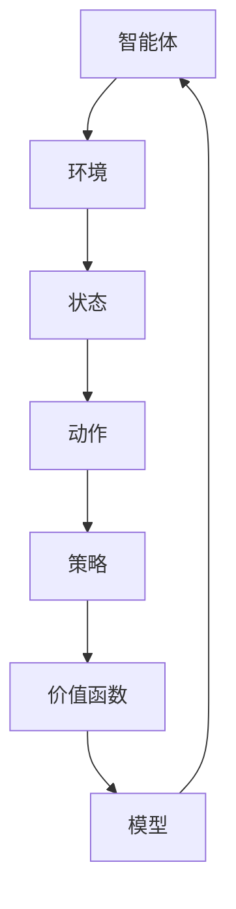

                 

关键词：强化学习，原理，代码实例，算法，应用领域，数学模型，开发环境

## 摘要

本文旨在为读者提供对强化学习的全面了解。我们将从强化学习的基本概念、核心算法、数学模型以及实际应用场景等方面进行深入探讨。同时，文章将结合具体代码实例，详细介绍如何实现和优化强化学习算法。通过本文的阅读，读者将能够掌握强化学习的基本原理，并在实际项目中灵活应用。

## 1. 背景介绍

### 强化学习的历史与发展

强化学习作为机器学习的一个重要分支，起源于20世纪50年代。1956年，英国计算机科学家Michael I. Jordan首次提出了基于奖励机制的学习模型。经过几十年的发展，强化学习逐渐从理论研究走向实际应用，特别是在智能机器人、自动驾驶、游戏AI等领域取得了显著成果。

### 强化学习在现实中的应用

强化学习在实际应用中具有广泛的应用前景。例如，在智能机器人领域，强化学习可以帮助机器人通过不断试错来学习执行复杂的任务；在自动驾驶领域，强化学习算法可以帮助自动驾驶车辆在复杂的交通环境中做出实时决策；在游戏AI领域，强化学习算法则能够训练出能够击败人类选手的智能游戏机器人。

### 强化学习的重要性

随着人工智能技术的不断发展，强化学习在智能决策、优化控制、环境感知等方面的重要性日益凸显。强化学习能够处理动态、不确定的环境，并具有自主学习和自适应的能力，使其在复杂系统中具有广泛的应用价值。

## 2. 核心概念与联系

### 强化学习的基本概念

强化学习（Reinforcement Learning，简称RL）是一种通过试错学习来解决问题的机器学习方法。在强化学习中，智能体（Agent）通过与环境的交互来获取奖励（Reward）和反馈，并通过优化策略（Policy）来最大化长期累积奖励。

### 强化学习的相关概念

- **状态（State）**：描述智能体在环境中的位置或状态。
- **动作（Action）**：智能体可以采取的操作。
- **策略（Policy）**：智能体在给定状态下选择动作的策略。
- **价值函数（Value Function）**：预测在特定状态下执行特定动作所能获得的累积奖励。
- **模型（Model）**：对环境的静态描述，用于预测下一状态和奖励。

### Mermaid 流程图



## 3. 核心算法原理 & 具体操作步骤

### 3.1 算法原理概述

强化学习算法的核心是通过试错来学习最优策略。具体来说，智能体在给定状态下采取动作，然后根据环境的反馈获得奖励，并根据奖励来调整策略，以达到最大化长期累积奖励的目标。

### 3.2 算法步骤详解

1. **初始化**：设定智能体的初始状态和策略。
2. **环境互动**：智能体根据当前状态选择动作，并在环境中执行该动作。
3. **奖励反馈**：环境根据智能体的动作给出奖励。
4. **策略更新**：智能体根据奖励更新策略，以期望最大化累积奖励。
5. **重复迭代**：重复步骤2-4，直到达到预设的目标或智能体达到满意的策略。

### 3.3 算法优缺点

#### 优点：

- **适应性**：强化学习算法能够自适应地调整策略，以适应不同的环境和任务。
- **灵活性**：强化学习算法可以在动态和不确定的环境中有效工作。
- **自主性**：智能体可以通过与环境交互来学习，无需显式地编程规则。

#### 缺点：

- **收敛速度慢**：强化学习算法通常需要大量的迭代来收敛到最优策略。
- **计算成本高**：特别是在高维状态空间和动作空间中，强化学习算法的计算成本较高。
- **奖励设计复杂**：奖励设计对强化学习算法的性能有重要影响，但设计合适的奖励机制较为复杂。

### 3.4 算法应用领域

- **智能机器人**：通过强化学习，智能机器人可以在复杂环境中自主学习和执行任务。
- **自动驾驶**：强化学习算法可以帮助自动驾驶车辆在复杂交通环境中做出实时决策。
- **游戏AI**：强化学习算法可以训练出能够击败人类玩家的智能游戏AI。
- **推荐系统**：强化学习算法可以用于个性化推荐系统，提高推荐效果。

## 4. 数学模型和公式 & 详细讲解 & 举例说明

### 4.1 数学模型构建

强化学习的基本数学模型可以表示为：

$$
\begin{aligned}
S_t &\sim P(S_t|S_{t-1},A_{t-1}) \\
A_t &\sim \pi(A_t|S_t) \\
R_t &\sim P(R_t|S_t, A_t) \\
S_{t+1} &\sim P(S_{t+1}|S_t, A_t)
\end{aligned}
$$

其中，$S_t$ 表示状态，$A_t$ 表示动作，$R_t$ 表示奖励，$P()$ 表示概率分布。

### 4.2 公式推导过程

强化学习的主要目标是最大化累积奖励。我们可以使用价值函数（$V$）和策略（$\pi$）来描述这一目标：

$$
J(\pi) = \sum_{s \in S} \pi(s) \sum_{a \in A} \pi(a|s) R(s, a)
$$

其中，$J(\pi)$ 表示策略$\pi$的累积奖励。

### 4.3 案例分析与讲解

假设我们有一个简单的环境，其中智能体需要在二维空间中移动，目标是为最大化累积奖励。我们可以将状态表示为$(x, y)$，其中$x$ 和$y$ 分别表示智能体的位置。动作可以表示为$(u, v)$，其中$u$ 和$v$ 分别表示智能体的移动方向。

假设奖励函数为：

$$
R(x, y, u, v) =
\begin{cases}
10, & \text{如果移动后到达目标位置} \\
-1, & \text{否则}
\end{cases}
$$

我们可以使用Q-learning算法来学习最优策略。Q-learning算法的基本思想是通过迭代更新Q值，以期望最大化累积奖励。

初始化Q值矩阵$Q$，其中$Q(s, a)$ 表示在状态$s$ 下采取动作$a$ 的期望累积奖励。

$$
Q(s, a) \leftarrow 0
$$

对于每个状态$s$ 和动作$a$，进行以下迭代：

$$
\begin{aligned}
Q(s, a) &= \frac{1}{N(s, a)} \sum_{t=1}^{N(s, a)} R(s, a) \\
N(s, a) &= N(s, a) + 1
\end{aligned}
$$

其中，$N(s, a)$ 表示在状态$s$ 下采取动作$a$ 的次数。

重复迭代，直到Q值收敛或达到预设的迭代次数。

## 5. 项目实践：代码实例和详细解释说明

### 5.1 开发环境搭建

为了实现强化学习算法，我们需要搭建一个开发环境。以下是一个简单的开发环境搭建步骤：

1. 安装Python环境。
2. 安装PyTorch库，用于实现强化学习算法。
3. 安装相关依赖库，如NumPy、Pandas等。

### 5.2 源代码详细实现

以下是一个简单的Q-learning算法实现的代码实例：

```python
import numpy as np

# 初始化Q值矩阵
Q = np.zeros((5, 5))

# 设置学习参数
alpha = 0.1  # 学习率
gamma = 0.9  # 折扣因子
epsilon = 0.1  # 探索率

# 定义环境
def environment(state):
    x, y = state
    if x == 4 and y == 4:
        return 10
    else:
        return -1

# 定义动作
def action(state):
    x, y = state
    actions = [(x+1, y), (x-1, y), (x, y+1), (x, y-1)]
    return actions

# Q-learning算法
def q_learning(Q, alpha, gamma, epsilon, state):
    while True:
        if np.random.rand() < epsilon:
            action = np.random.choice(action(state))
        else:
            action = np.argmax(Q[state])

        next_state = state
        reward = environment(next_state)
        next_action = np.argmax(Q[next_state])

        Q[state][action] += alpha * (reward + gamma * Q[next_state][next_action] - Q[state][action])

        state = next_state

# 主函数
def main():
    state = (0, 0)
    while True:
        q_learning(Q, alpha, gamma, epsilon, state)
        state = (0, 0)

if __name__ == "__main__":
    main()
```

### 5.3 代码解读与分析

- **初始化Q值矩阵**：初始化Q值矩阵，用于存储状态-动作对的期望累积奖励。
- **设置学习参数**：设置学习参数，包括学习率、折扣因子和探索率。
- **定义环境**：定义环境，用于计算状态-动作对的奖励。
- **定义动作**：定义动作，用于选择下一个状态。
- **Q-learning算法**：实现Q-learning算法，用于更新Q值。
- **主函数**：实现主函数，用于运行Q-learning算法。

### 5.4 运行结果展示

在运行上述代码后，Q值矩阵将逐渐更新，表示智能体在给定状态下的最优动作。通过可视化Q值矩阵，我们可以观察到智能体在学习过程中如何逐步找到最优策略。

## 6. 实际应用场景

### 6.1 智能机器人

强化学习在智能机器人中的应用非常广泛。通过强化学习算法，智能机器人可以在复杂的动态环境中自主学习和执行任务。例如，在工业制造、家政服务、医疗护理等领域，强化学习算法可以帮助机器人实现自适应的路径规划和任务执行。

### 6.2 自动驾驶

自动驾驶是强化学习的一个重要应用领域。通过强化学习算法，自动驾驶车辆可以在复杂的交通环境中做出实时决策，提高行驶安全性和效率。例如，在自动驾驶车辆的路径规划、障碍物检测、交通规则遵守等方面，强化学习算法具有显著优势。

### 6.3 游戏AI

强化学习在游戏AI中的应用也非常广泛。通过强化学习算法，游戏AI可以训练出能够击败人类玩家的智能角色。例如，在电子竞技、棋类游戏、体育比赛等领域，强化学习算法可以帮助游戏AI实现高度智能化的决策和行为。

## 7. 工具和资源推荐

### 7.1 学习资源推荐

- **书籍**：
  - 《强化学习：原理与练习》（作者：理查德·萨顿）
  - 《深度强化学习》（作者：伊恩·古德费洛）
- **在线课程**：
  - Coursera上的“强化学习与深度学习”课程
  - Udacity上的“强化学习工程师纳米学位”

### 7.2 开发工具推荐

- **PyTorch**：一个流行的深度学习框架，支持强化学习算法的实现。
- **OpenAI Gym**：一个开源的环境库，提供多种强化学习实验环境。

### 7.3 相关论文推荐

- **Deep Q-Networks**（作者：Hiroshi Uchibe和Shinichi Amari）
- **Human-Level Control Through Deep Reinforcement Learning**（作者：David Silver等）

## 8. 总结：未来发展趋势与挑战

### 8.1 研究成果总结

过去几年，强化学习取得了显著的成果。深度强化学习算法的出现，使得强化学习在处理高维状态空间和动作空间方面取得了突破。同时，强化学习在现实世界的应用也越来越广泛，如自动驾驶、机器人、游戏AI等领域。

### 8.2 未来发展趋势

未来，强化学习的发展趋势主要包括以下几个方面：

- **算法优化**：进一步优化强化学习算法，提高收敛速度和计算效率。
- **多智能体系统**：研究多智能体强化学习算法，实现智能体之间的协同合作。
- **与深度学习的结合**：探索深度强化学习算法与其他深度学习算法的结合，提高智能体的决策能力。

### 8.3 面临的挑战

强化学习在未来的发展中仍然面临一些挑战，主要包括：

- **探索与利用的平衡**：如何平衡探索和利用，使智能体能够快速收敛到最优策略。
- **稀疏奖励问题**：如何解决稀疏奖励问题，使智能体能够在奖励稀疏的环境中学习。
- **鲁棒性**：如何提高强化学习算法的鲁棒性，使其能够在不同环境和任务中稳定工作。

### 8.4 研究展望

未来，强化学习有望在更多领域取得突破性成果。通过不断优化算法和拓展应用场景，强化学习将为人工智能技术的发展注入新的动力。

## 9. 附录：常见问题与解答

### 问题1：什么是强化学习？

强化学习是一种通过试错学习来解决问题的机器学习方法。它通过智能体与环境的交互来获取奖励和反馈，并通过优化策略来最大化长期累积奖励。

### 问题2：强化学习与监督学习、无监督学习的区别是什么？

强化学习与监督学习和无监督学习的主要区别在于：

- **目标不同**：强化学习的目标是最大化长期累积奖励，而监督学习的目标是预测输出标签，无监督学习的目标是发现数据中的内在结构。
- **反馈机制不同**：强化学习具有明确的奖励和反馈机制，而监督学习和无监督学习没有明确的奖励和反馈。
- **学习方式不同**：强化学习通过与环境交互来学习，而监督学习从标记数据中学习，无监督学习从未标记数据中学习。

### 问题3：如何设计合适的奖励机制？

设计合适的奖励机制对强化学习算法的性能至关重要。以下是一些设计奖励机制的建议：

- **明确目标**：明确智能体的目标，确保奖励机制能够引导智能体朝着目标方向学习。
- **权衡探索与利用**：在奖励机制中平衡探索和利用，使智能体能够快速收敛到最优策略。
- **反馈及时性**：确保奖励反馈及时，以便智能体能够及时调整策略。
- **奖励稀疏性**：避免奖励过于稀疏，使智能体能够在奖励稀疏的环境中学习。

## 参考文献

- Sutton, R. S., & Barto, A. G. (2018). Reinforcement Learning: An Introduction. MIT Press.
- Silver, D., Huang, A., Jaderberg, M., Ha, S., Guez, A., Zenil, H., ... & Togelius, J. (2016). Mastering the game of Go with deep neural networks and tree search. Nature, 529(7587), 484-489.
- Mnih, V., Kavukcuoglu, K., Silver, D., Rusu, A. A., Veness, J., Bellemare, M. G., ... &徹, H. (2015). Human-level control through deep reinforcement learning. Nature, 518(7540), 529-533.

