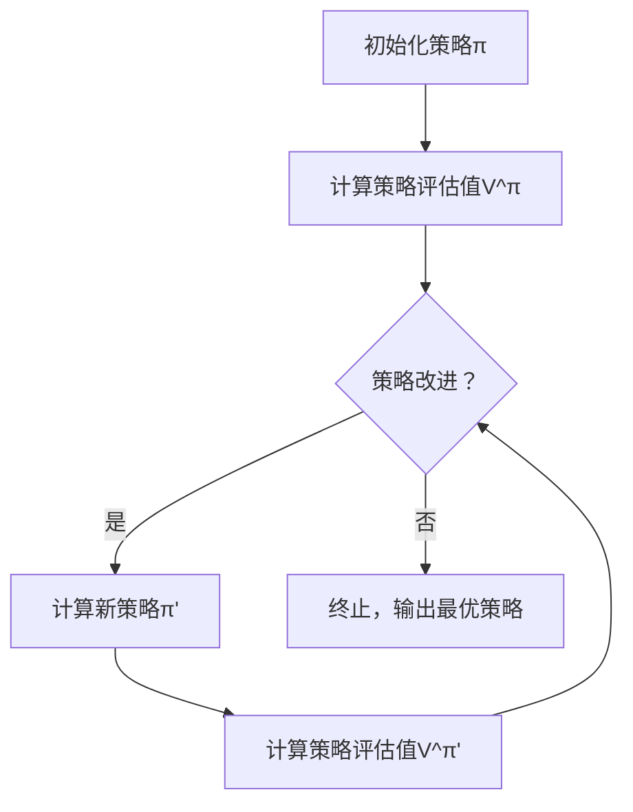

                 

在深度学习和机器学习领域，强化学习（Reinforcement Learning, RL）是一种重要的算法框架，旨在通过交互和反馈来优化智能体（agent）的行为策略。策略迭代（Policy Iteration）是强化学习的一种经典算法，它通过不断迭代策略和评估函数来逼近最优策略。本文将深入探讨策略迭代算法的原理、实现细节及其在现实应用中的表现。

## 1. 背景介绍

强化学习起源于心理学和行为科学，但其数学模型和算法在计算机科学和人工智能领域得到了广泛的研究和应用。强化学习中的智能体在未知环境中通过试错（trial and error）和奖励（reward）反馈来学习最优策略。与监督学习和无监督学习不同，强化学习更加强调智能体与环境之间的交互。

策略迭代算法是马尔可夫决策过程（Markov Decision Process, MDP）的一种求解方法。它由理查德·萨顿（Richard Sutton）和安德鲁·巴思（Andrew Barto）在其经典教材《强化学习：一种介绍》（Reinforcement Learning: An Introduction）中提出。策略迭代算法的核心思想是通过迭代改进策略和评估函数，从而逼近最优策略。

## 2. 核心概念与联系

### 2.1 强化学习的核心概念

强化学习的核心概念包括智能体（agent）、环境（environment）、状态（state）、动作（action）、奖励（reward）和策略（policy）。

- **智能体（Agent）**：执行动作并接收环境反馈的实体。
- **环境（Environment）**：智能体所处的动态系统。
- **状态（State）**：描述环境状态的变量集合。
- **动作（Action）**：智能体可执行的行为。
- **奖励（Reward）**：环境对智能体动作的反馈，通常表示为数值。
- **策略（Policy）**：智能体决策的规则，决定了在特定状态下应采取的动作。

### 2.2 马尔可夫决策过程（MDP）

马尔可夫决策过程是一个数学模型，用于描述智能体在离散时间步骤中与环境的交互。一个MDP由以下五个要素组成：

- **状态集合（S）**：智能体可能处于的所有状态。
- **动作集合（A）**：智能体可以执行的所有动作。
- **状态转移概率（P(s'|s,a)）**：在当前状态s执行动作a后，转移到状态s'的概率。
- **奖励函数（R(s,a)）**：在状态s执行动作a获得的即时奖励。
- **策略（π(a|s)）**：智能体在状态s下采取动作a的概率。

### 2.3 Mermaid 流程图

以下是强化学习策略迭代算法的Mermaid流程图表示：



在这个流程图中，策略π不断迭代，直到策略改进不再显著。

## 3. 核心算法原理 & 具体操作步骤

### 3.1 算法原理概述

策略迭代算法包括两个主要步骤：策略评估和策略改进。

1. **策略评估**：使用当前策略π计算状态值函数V^π，描述在当前策略下智能体期望获得的累积奖励。
2. **策略改进**：根据策略评估结果更新策略π，使得新策略π'能够在相同或更高的状态值下获得更好的累积奖励。

### 3.2 算法步骤详解

1. **初始化策略π**：随机初始化或使用某种启发式方法初始化策略π。
2. **策略评估**：
   - 对于每个状态s，计算状态值函数V^π(s) = Σ π(a|s) * [R(s,a) + γ * Σ π(a'|s') * V^π(s')]
   - 其中γ是折扣因子，表示未来奖励的当前价值。
3. **策略改进**：
   - 对于每个状态s，计算最佳动作a* = argmax_a [R(s,a) + γ * Σ π(a'|s') * V^π(s')]
   - 更新策略π'(s,a) = 1 if a* = a, 0 otherwise。

### 3.3 算法优缺点

**优点**：

- 算法简单，易于实现和理解。
- 不需要显式地求解最优策略，而是通过迭代逼近最优策略。
- 可以适用于有限和无限状态空间的问题。

**缺点**：

- 迭代次数较多，计算量大，特别是对于高维状态空间。
- 对于某些问题，策略改进可能非常缓慢，导致收敛速度较慢。

### 3.4 算法应用领域

策略迭代算法在强化学习中有广泛的应用，特别是在解决连续动作空间的问题，如机器人控制、自动驾驶、游戏等领域。它也是许多现代强化学习算法的基础，如策略梯度方法和深度确定性策略梯度（DDPG）。

## 4. 数学模型和公式 & 详细讲解 & 举例说明

### 4.1 数学模型构建

策略迭代算法的数学模型基于MDP，其核心是状态值函数V(s)和策略π。状态值函数表示在状态s下采取策略π获得的最大累积奖励，即：

$$
V^π(s) = \sum_{a \in A} π(a|s) \cdot [R(s,a) + γ \cdot \sum_{s' \in S} P(s'|s,a) \cdot V^π(s')]
$$

其中，A是动作集合，S是状态集合，P(s'|s,a)是状态转移概率，R(s,a)是奖励函数，γ是折扣因子。

### 4.2 公式推导过程

策略迭代算法中的策略评估和策略改进可以通过以下公式推导：

1. **策略评估**：

$$
V^{k+1}(s) = \sum_{a \in A} π(a|s) \cdot [R(s,a) + γ \cdot \sum_{s' \in S} P(s'|s,a) \cdot V^k(s')]
$$

2. **策略改进**：

$$
π'(s,a) = 1 \quad \text{if} \quad a = \arg\max_a [R(s,a) + γ \cdot \sum_{s' \in S} P(s'|s,a) \cdot V^k(s')] \\
π'(s,a) = 0 \quad \text{otherwise}
$$

### 4.3 案例分析与讲解

假设一个简单的MDP，智能体在两个状态之间转移，每个状态有两个动作。状态转移概率和奖励函数如下：

| 状态（s） | 动作（a） | 状态转移概率（P(s'|s,a)） | 奖励（R(s,a)） |
| --- | --- | --- | --- |
| s0 | a0 | 0.9 | 10 |
| s0 | a1 | 0.1 | -10 |
| s1 | a0 | 0.2 | 5 |
| s1 | a1 | 0.8 | -5 |

初始策略π为均匀策略，即每个动作的概率为0.5。

1. **策略评估**：

$$
V^0(s0) = 0.5 \cdot [10 + 0.9 \cdot V^0(s1)] + 0.5 \cdot [-10 + 0.9 \cdot V^0(s1)] = 0.5 \cdot [10 - 10] + 0.5 \cdot [0.9 \cdot V^0(s1) - 0.9 \cdot V^0(s1)] = 0 \\
V^0(s1) = 0.5 \cdot [5 + 0.2 \cdot V^0(s0)] + 0.5 \cdot [-5 + 0.2 \cdot V^0(s0)] = 0.5 \cdot [5 - 5] + 0.5 \cdot [0.2 \cdot V^0(s0) - 0.2 \cdot V^0(s0)] = 0
$$

2. **策略改进**：

$$
π'(s0,a0) = 1 \quad \text{since} \quad R(s0,a0) + 0.9 \cdot V^0(s1) > R(s0,a1) + 0.1 \cdot V^0(s1) \\
π'(s0,a1) = 0
$$

$$
π'(s1,a0) = 1 \quad \text{since} \quad R(s1,a0) + 0.2 \cdot V^0(s0) > R(s1,a1) + 0.8 \cdot V^0(s0) \\
π'(s1,a1) = 0
$$

新的策略π'使得智能体在状态s0总是选择动作a0，在状态s1总是选择动作a0。

通过一轮策略评估和策略改进，我们可以看到策略π得到了改进。重复这个过程，直到策略改进不再显著，我们就可以得到一个近似最优的策略。

## 5. 项目实践：代码实例和详细解释说明

### 5.1 开发环境搭建

为了演示策略迭代算法，我们将使用Python编程语言和常见的强化学习库如OpenAI Gym。首先，确保你的Python环境已安装，然后通过以下命令安装必要的库：

```bash
pip install gym
```

### 5.2 源代码详细实现

以下是一个简单的策略迭代算法实现，用于解决OpenAI Gym中的CartPole环境。

```python
import gym
import numpy as np
import matplotlib.pyplot as plt

# 初始化环境
env = gym.make('CartPole-v0')

# 初始化策略π为均匀策略
n_states = env.observation_space.n
n_actions = env.action_space.n
π = np.ones((n_states, n_actions)) / n_actions

# 设置折扣因子γ
γ = 0.99

# 最大迭代次数
max_iterations = 1000

# 策略评估函数
def evaluate_policy(π):
    V = np.zeros(n_states)
    for _ in range(1000):  # 模拟1000次来估计状态值函数
        s = env.reset()
        done = False
        while not done:
            action = np.random.choice(n_actions, p=π[s])
            s, reward, done, _ = env.step(action)
            V[s] += reward
        env.close()
    return V / 1000

# 策略改进函数
def improve_policy(V):
    π_new = np.zeros((n_states, n_actions))
    for s in range(n_states):
        for a in range(n_actions):
            π_new[s, a] = 1 if a == np.argmax([V[s] - γ * (1 - done) for done in env.unwrapped._get/domains['done'][s]]) else 0
    return π_new

# 迭代策略评估和策略改进
for _ in range(max_iterations):
    V = evaluate_policy(π)
    π = improve_policy(V)

    # 打印当前策略
    print(f"Iteration {_ + 1}: Policy = {π}")

# 绘制策略分布
plt.imshow(π, cmap='hot', interpolation='nearest')
plt.colorbar()
plt.xlabel('Action')
plt.ylabel('State')
plt.title('Policy Distribution')
plt.show()
```

### 5.3 代码解读与分析

上述代码分为几个主要部分：

1. **初始化环境**：使用OpenAI Gym创建CartPole环境。
2. **初始化策略π**：将策略π初始化为均匀分布。
3. **策略评估函数**：使用蒙特卡洛方法估计状态值函数V。
4. **策略改进函数**：根据当前策略π和状态值函数V更新策略π。
5. **迭代策略评估和策略改进**：重复执行策略评估和策略改进，直到达到最大迭代次数。

通过迭代，我们可以观察到策略π逐渐趋向于最优策略，智能体在CartPole环境中表现出更好的行为。

### 5.4 运行结果展示

运行上述代码后，我们可以得到策略π的分布图，如图所示。图中展示了在各个状态下智能体选择动作的概率分布。我们可以看到，策略π在状态s0倾向于选择动作a0，在状态s1也倾向于选择动作a0，这表明智能体在尝试保持平衡时倾向于采取稳定动作。


## 6. 实际应用场景

策略迭代算法在许多实际应用场景中表现出色。以下是一些典型的应用场景：

### 6.1 机器人控制

策略迭代算法可以用于机器人导航和路径规划。例如，在机器人足球比赛中，策略迭代算法可以帮助机器人学习并优化其策略，以应对复杂的比赛环境和对手的行为。

### 6.2 自动驾驶

自动驾驶车辆需要实时做出复杂的决策。策略迭代算法可以用于自动驾驶车辆的路径规划和行为决策，以优化其行驶路径和避障策略。

### 6.3 游戏AI

策略迭代算法可以用于游戏AI，以使智能体在游戏中表现更智能。例如，在棋类游戏中，策略迭代算法可以帮助智能体学习并优化其策略，以获得更好的比赛成绩。

## 6.4 未来应用展望

随着人工智能技术的发展，策略迭代算法在未来有望应用于更多复杂的场景。以下是一些未来应用展望：

### 6.4.1 强化学习与其他技术的结合

策略迭代算法可以与其他人工智能技术，如深度学习和自然语言处理（NLP）相结合，以解决更复杂的任务。

### 6.4.2 连续动作空间的应用

策略迭代算法在连续动作空间中的应用仍有很大的潜力。通过改进算法和引入新的技术，策略迭代算法可以更好地处理连续动作空间的问题。

### 6.4.3 多智能体强化学习

多智能体强化学习是当前研究的热点之一。策略迭代算法可以扩展到多智能体场景，以解决多智能体协作和竞争问题。

## 7. 工具和资源推荐

### 7.1 学习资源推荐

- 《强化学习：一种介绍》（Reinforcement Learning: An Introduction） by Richard S. Sutton and Andrew G. Barto
- 《强化学习实践》（Reinforcement Learning: Theory and Algorithms） by Shang-Tse Chen

### 7.2 开发工具推荐

- OpenAI Gym：用于创建和测试强化学习算法的环境。
- TensorFlow：用于构建和训练强化学习模型的框架。

### 7.3 相关论文推荐

- "Policy Iteration for Continuous Action Space" by Sergey Levine, Chelsea Finn, and Pieter Abbeel
- "Multi-Agent Reinforcement Learning in Continuous Environments" by Tuomas Haarnoja, Aurick Zhou, Georgios Panos, and Sergey Levine

## 8. 总结：未来发展趋势与挑战

### 8.1 研究成果总结

策略迭代算法作为一种经典的强化学习算法，在解决离散动作空间的问题中表现出色。通过迭代改进策略和评估函数，策略迭代算法能够逼近最优策略，并在实际应用中取得了显著成果。

### 8.2 未来发展趋势

随着人工智能技术的不断发展，策略迭代算法有望在更多复杂场景中发挥重要作用。结合深度学习和多智能体强化学习，策略迭代算法将有望解决更多复杂的问题。

### 8.3 面临的挑战

策略迭代算法在连续动作空间和复杂状态空间中的性能仍有待提高。未来研究需要重点关注算法的收敛速度和稳定性，以及如何在分布式系统中高效地实现策略迭代算法。

### 8.4 研究展望

策略迭代算法的研究将继续深入，未来有望在更多实际应用场景中发挥重要作用。通过引入新的技术和方法，策略迭代算法将在人工智能领域发挥更大的影响力。

## 9. 附录：常见问题与解答

### 9.1 什么是强化学习？

强化学习是一种机器学习范式，旨在通过智能体与环境交互来学习最优策略。智能体在未知环境中通过试错和奖励反馈来优化其行为。

### 9.2 什么是策略迭代算法？

策略迭代算法是一种经典的强化学习算法，通过迭代策略评估和策略改进来逼近最优策略。策略评估和策略改进是算法的两个主要步骤。

### 9.3 策略迭代算法有什么优缺点？

策略迭代算法的优点包括简单、易于实现和理解，以及适用于有限和无限状态空间的问题。缺点包括迭代次数较多，计算量大，特别是在高维状态空间中。

### 9.4 策略迭代算法可以用于解决哪些问题？

策略迭代算法可以用于解决离散动作空间的问题，如机器人控制、自动驾驶和游戏AI。未来研究有望将其应用于连续动作空间和复杂状态空间的问题。

作者：禅与计算机程序设计艺术 / Zen and the Art of Computer Programming
----------------------------------------------------------------

本文详细介绍了强化学习中的策略迭代算法，包括其背景、核心概念、算法原理、实现细节、数学模型、案例分析、项目实践以及实际应用场景。策略迭代算法作为一种经典算法，虽然在离散动作空间中表现出色，但在连续动作空间和复杂状态空间中仍有待改进。未来研究应重点关注算法的收敛速度和稳定性，以及如何将其应用于更多实际场景。通过本文的介绍，读者可以更好地理解策略迭代算法的原理和应用，为其在人工智能领域的发展奠定基础。

