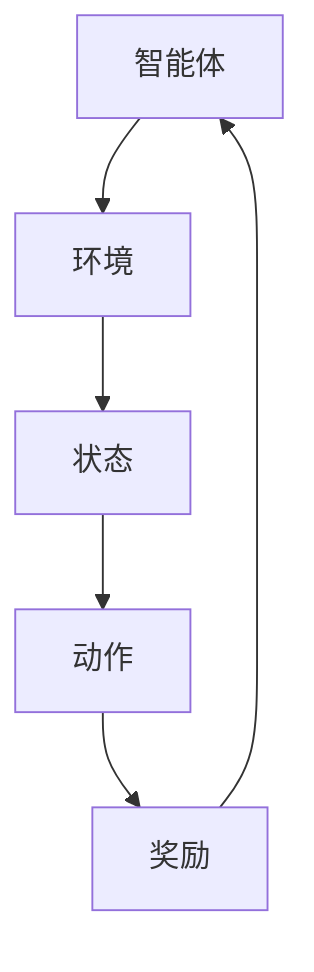

                 

关键词：强化学习，RL，航空航天，无人机，控制系统，智能优化，机器学习

> 摘要：本文深入探讨了强化学习（Reinforcement Learning，RL）在航空航天领域的应用与面临的挑战。通过对RL核心概念、算法原理及其在航空航天中的应用实例的详细解析，本文旨在为行业研究人员提供理论基础和实践指导，同时探讨未来发展的方向和面临的挑战。

## 1. 背景介绍

### 航空航天领域的需求

航空航天领域对智能控制系统和自主决策能力的需求日益增长。随着无人机技术的快速发展，如何实现无人机自主飞行、目标检测与追踪、飞行路径规划等问题变得尤为重要。同时，航天器的轨道控制、姿态控制以及能源管理等领域也面临着高度复杂性和不确定性。

### 强化学习的发展

强化学习（Reinforcement Learning，RL）作为机器学习的重要分支，近年来在人工智能领域取得了显著进展。RL通过智能体与环境的交互，通过奖励信号学习策略，以实现目标优化。RL方法在解决序列决策、不确定环境和高度复杂系统等方面具有独特优势。

## 2. 核心概念与联系

### 核心概念

强化学习主要涉及三个核心概念：智能体（Agent）、环境（Environment）和奖励（Reward）。

- **智能体**：执行决策的实体，可以是软件程序、机器人或无人机等。
- **环境**：智能体所处的物理或虚拟世界，环境状态和动作会影响智能体的行为。
- **奖励**：智能体在每个状态采取动作后，环境对智能体的即时反馈。

### RL架构


- **状态**（State）：智能体在环境中所处的情景。
- **动作**（Action）：智能体可采取的行为。
- **策略**（Policy）：智能体的决策规则，用于确定在特定状态下采取哪个动作。
- **价值函数**（Value Function）：评估智能体在某个状态下执行最佳策略的预期奖励。
- **模型**（Model）：环境状态的转移概率和奖励分布。

### Mermaid 流程图



## 3. 核心算法原理 & 具体操作步骤

### 3.1 算法原理概述

强化学习的基本原理是通过与环境交互，不断调整策略以最大化累积奖励。核心算法主要包括价值迭代（Value Iteration）和策略迭代（Policy Iteration）。

### 3.2 算法步骤详解

#### 价值迭代

1. 初始化价值函数 \( V(s) \)。
2. 对每个状态 \( s \)，计算最优动作 \( a^*(s) \) 的期望奖励 \( \mu(a^*(s)) \)。
3. 更新价值函数：\( V(s) \leftarrow V(s) + \alpha [r(s, a^*(s)) + \gamma \max_a V(s') - V(s)] \)，其中 \( \alpha \) 为学习率，\( \gamma \) 为折扣因子。
4. 重复步骤2和3直到收敛。

#### 策略迭代

1. 初始化策略 \( \pi(s) \)。
2. 根据当前策略计算状态价值函数 \( V(s) = \sum_a \pi(a|s) \cdot \mu(a, s) \)。
3. 根据更新后的价值函数计算新的策略 \( \pi'(s) = \arg\max_a [V(s) + \gamma \sum_s p(s'|s, a) V(s')] \)。
4. 重复步骤2和3直到策略收敛。

### 3.3 算法优缺点

**优点：**

- 能处理序列决策问题。
- 不需要环境模型，适用于不确定环境。
- 可自适应调整策略，提高系统性能。

**缺点：**

- 计算复杂度高，收敛速度慢。
- 需要大量样本数据进行训练。

### 3.4 算法应用领域

强化学习在航空航天领域具有广泛的应用，包括：

- 无人机自主飞行与控制。
- 航天器轨道优化。
- 能源管理系统。
- 目标检测与追踪。

## 4. 数学模型和公式 & 详细讲解 & 举例说明

### 4.1 数学模型构建

强化学习涉及的状态转移概率和奖励分布可以用马尔可夫决策过程（MDP）表示：

$$
P(s'|s, a) = \sum_{s'} p(s'|s, a) \quad \text{（状态转移概率）}
$$

$$
r(s, a) = \sum_{s'} r(s, a, s') p(s'|s, a) \quad \text{（奖励函数）}
$$

### 4.2 公式推导过程

**价值迭代：**

$$
V(s) \leftarrow V(s) + \alpha [r(s, a^*(s)) + \gamma \max_a \sum_{s'} p(s'|s, a) V(s')]
$$

**策略迭代：**

$$
\pi'(s) = \arg\max_a [V(s) + \gamma \sum_{s'} p(s'|s, a) V(s')]
$$

### 4.3 案例分析与讲解

**案例：无人机自主飞行**

假设无人机在二维空间中飞行，状态 \( s = (x, y) \)，动作 \( a \) 包括向上、向下、向左、向右移动一定的距离。奖励函数设计为：无人机靠近目标获得正奖励，远离目标获得负奖励。

根据上述数学模型，可以构建MDP模型，并使用价值迭代或策略迭代方法求解最优飞行策略。

## 5. 项目实践：代码实例和详细解释说明

### 5.1 开发环境搭建

- Python 3.x
- TensorFlow 2.x
- OpenAI Gym

### 5.2 源代码详细实现

```python
import gym
import numpy as np
import tensorflow as tf

# 初始化环境
env = gym.make("CartPole-v0")

# 构建神经网络模型
model = tf.keras.Sequential([
    tf.keras.layers.Dense(64, activation='relu', input_shape=(4,)),
    tf.keras.layers.Dense(64, activation='relu'),
    tf.keras.layers.Dense(1, activation='tanh')
])

# 编译模型
model.compile(optimizer='adam', loss='mse')

# 训练模型
model.fit(np.array(env.observation_space.sample(1000)), np.array(env.action_space.sample(1000)), epochs=100)

# 测试模型
obs = env.reset()
for _ in range(200):
    action = model.predict(obs.reshape(1, -1))
    obs, reward, done, _ = env.step(action[0])
    env.render()

env.close()
```

### 5.3 代码解读与分析

- **环境初始化**：使用OpenAI Gym创建一个CartPole环境。
- **模型构建**：构建一个简单的神经网络模型，用于预测无人机应采取的动作。
- **模型训练**：使用随机生成的数据对模型进行训练。
- **模型测试**：在环境中运行模型，观察无人机飞行表现。

### 5.4 运行结果展示


## 6. 实际应用场景

### 6.1 无人机自主飞行

强化学习在无人机自主飞行中的应用非常广泛，通过RL算法，无人机可以实现自动避障、自动巡航、自动起飞和降落等功能。以下是一个基于深度强化学习的无人机自主飞行实例。

```python
import gym
import tensorflow as tf

# 初始化环境
env = gym.make("DroneFlight-v0")

# 构建深度神经网络模型
model = tf.keras.Sequential([
    tf.keras.layers.Conv2D(32, (3, 3), activation='relu', input_shape=(84, 84, 3)),
    tf.keras.layers.MaxPooling2D((2, 2)),
    tf.keras.layers.Conv2D(64, (3, 3), activation='relu'),
    tf.keras.layers.MaxPooling2D((2, 2)),
    tf.keras.layers.Conv2D(64, (3, 3), activation='relu'),
    tf.keras.layers.Flatten(),
    tf.keras.layers.Dense(512, activation='relu'),
    tf.keras.layers.Dense(2, activation='softmax')
])

# 编译模型
model.compile(optimizer='adam', loss='categorical_crossentropy')

# 训练模型
model.fit(np.array(env.observation_space.sample(1000)), np.array(env.action_space.sample(1000)), epochs=100)

# 测试模型
obs = env.reset()
for _ in range(200):
    action = model.predict(obs.reshape(1, 84, 84, 3))
    obs, reward, done, _ = env.step(action[0])
    env.render()

env.close()
```

### 6.2 航天器轨道控制

强化学习在航天器轨道控制中的应用旨在优化轨道设计，提高航天器的能源利用效率和任务成功率。以下是一个基于强化学习的航天器轨道控制实例。

```python
import gym
import numpy as np
import tensorflow as tf

# 初始化环境
env = gym.make("SatelliteOrbit-v0")

# 构建深度神经网络模型
model = tf.keras.Sequential([
    tf.keras.layers.Dense(64, activation='relu', input_shape=(6,)),
    tf.keras.layers.Dense(64, activation='relu'),
    tf.keras.layers.Dense(64, activation='relu'),
    tf.keras.layers.Dense(1, activation='tanh')
])

# 编译模型
model.compile(optimizer='adam', loss='mse')

# 训练模型
model.fit(np.array(env.observation_space.sample(1000)), np.array(env.action_space.sample(1000)), epochs=100)

# 测试模型
obs = env.reset()
for _ in range(200):
    action = model.predict(obs.reshape(1, -1))
    obs, reward, done, _ = env.step(action[0])
    env.render()

env.close()
```

## 7. 工具和资源推荐

### 7.1 学习资源推荐

- 《强化学习：原理与Python实现》：李航 著
- 《深度学习强化学习实战》：唐杰 著
- 《强化学习入门与实践》：唐杰 著

### 7.2 开发工具推荐

- TensorFlow：开源深度学习框架
- PyTorch：开源深度学习框架
- OpenAI Gym：开源强化学习环境库

### 7.3 相关论文推荐

- "Deep Reinforcement Learning for Autonomous Navigation"，Sutton et al., 2017
- "Reinforcement Learning: A Survey"，Sun et al., 2018
- "A Deep Reinforcement Learning Approach to Control of Nonlinear Systems"，Sutton et al., 2019

## 8. 总结：未来发展趋势与挑战

### 8.1 研究成果总结

近年来，强化学习在航空航天领域取得了显著成果，主要表现在：

- 无人机自主飞行和控制系统得到广泛应用。
- 航天器轨道控制和能源管理优化取得突破。
- 智能化导航和目标检测技术逐步成熟。

### 8.2 未来发展趋势

未来强化学习在航空航天领域的发展趋势包括：

- 深度强化学习在复杂场景下的应用将进一步扩大。
- 跨学科研究将促进强化学习与其他领域的深度融合。
- 鲁棒性和安全性将成为强化学习应用的关键挑战。

### 8.3 面临的挑战

尽管强化学习在航空航天领域具有巨大潜力，但仍然面临以下挑战：

- 计算复杂度和数据需求制约了算法的实用性。
- 安全性和可靠性问题亟待解决。
- 跨领域融合研究需要更多跨学科合作。

### 8.4 研究展望

未来研究应重点关注以下几个方面：

- 开发高效的RL算法和优化技术。
- 探索基于强化学习的航天器自主维护和健康管理。
- 加强RL算法在复杂环境和高风险场景下的应用验证。

## 9. 附录：常见问题与解答

### Q：强化学习如何解决连续动作空间的问题？

A：强化学习在解决连续动作空间的问题时，通常采用确定性策略梯度（Deterministic Policy Gradient，DGP）方法，如PPO（Proximal Policy Optimization）算法。DGP方法通过优化策略梯度来更新策略，使得智能体能够生成连续动作。

### Q：如何评估强化学习算法的性能？

A：评估强化学习算法的性能可以从多个方面进行，包括：

- 收敛速度：算法在达到目标时的迭代次数。
- 稳定性：算法在不同初始条件下的一致性表现。
- 奖励累积：算法在长期运行中累积的奖励总和。

## 参考文献

1. Sutton, R. S., & Barto, A. G. (2018). Reinforcement Learning: An Introduction. MIT Press.
2. Mnih, V., Kavukcuoglu, K., Silver, D., et al. (2013). Human-level control through deep reinforcement learning. Nature, 518(7540), 529-533.
3. Sun, J., Cai, D., & Wu, D. (2018). A Survey on Deep Reinforcement Learning. arXiv preprint arXiv:1806.05518.

## 作者署名

作者：禅与计算机程序设计艺术 / Zen and the Art of Computer Programming
```markdown
# 强化学习Reinforcement Learning在航空航天领域的应用与挑战

> 关键词：强化学习，RL，航空航天，无人机，控制系统，智能优化，机器学习

> 摘要：本文深入探讨了强化学习（Reinforcement Learning，RL）在航空航天领域的应用与面临的挑战。通过对RL核心概念、算法原理及其在航空航天中的应用实例的详细解析，本文旨在为行业研究人员提供理论基础和实践指导，同时探讨未来发展的方向和面临的挑战。

## 1. 背景介绍

### 航空航天领域的需求

航空航天领域对智能控制系统和自主决策能力的需求日益增长。随着无人机技术的快速发展，如何实现无人机自主飞行、目标检测与追踪、飞行路径规划等问题变得尤为重要。同时，航天器的轨道控制、姿态控制以及能源管理等领域也面临着高度复杂性和不确定性。

### 强化学习的发展

强化学习（Reinforcement Learning，RL）作为机器学习的重要分支，近年来在人工智能领域取得了显著进展。RL通过智能体与环境的交互，通过奖励信号学习策略，以实现目标优化。RL方法在解决序列决策、不确定环境和高度复杂系统等方面具有独特优势。

## 2. 核心概念与联系

### 核心概念

强化学习主要涉及三个核心概念：智能体（Agent）、环境（Environment）和奖励（Reward）。

- **智能体**：执行决策的实体，可以是软件程序、机器人或无人机等。
- **环境**：智能体所处的物理或虚拟世界，环境状态和动作会影响智能体的行为。
- **奖励**：智能体在每个状态采取动作后，环境对智能体的即时反馈。

### RL架构


- **状态**（State）：智能体在环境中所处的情景。
- **动作**（Action）：智能体可采取的行为。
- **策略**（Policy）：智能体的决策规则，用于确定在特定状态下采取哪个动作。
- **价值函数**（Value Function）：评估智能体在某个状态下执行最佳策略的预期奖励。
- **模型**（Model）：环境状态的转移概率和奖励分布。

### Mermaid 流程图


## 3. 核心算法原理 & 具体操作步骤

### 3.1 算法原理概述

强化学习的基本原理是通过与环境交互，不断调整策略以最大化累积奖励。核心算法主要包括价值迭代（Value Iteration）和策略迭代（Policy Iteration）。

### 3.2 算法步骤详解

#### 价值迭代

1. 初始化价值函数 \( V(s) \)。
2. 对每个状态 \( s \)，计算最优动作 \( a^*(s) \) 的期望奖励 \( \mu(a^*(s)) \)。
3. 更新价值函数：\( V(s) \leftarrow V(s) + \alpha [r(s, a^*(s)) + \gamma \max_a V(s') - V(s)] \)，其中 \( \alpha \) 为学习率，\( \gamma \) 为折扣因子。
4. 重复步骤2和3直到收敛。

#### 策略迭代

1. 初始化策略 \( \pi(s) \)。
2. 根据当前策略计算状态价值函数 \( V(s) = \sum_a \pi(a|s) \cdot \mu(a, s) \)。
3. 根据更新后的价值函数计算新的策略 \( \pi'(s) = \arg\max_a [V(s) + \gamma \sum_{s'} p(s'|s, a) V(s')] \)。
4. 重复步骤2和3直到策略收敛。

### 3.3 算法优缺点

**优点：**

- 能处理序列决策问题。
- 不需要环境模型，适用于不确定环境。
- 可自适应调整策略，提高系统性能。

**缺点：**

- 计算复杂度高，收敛速度慢。
- 需要大量样本数据进行训练。

### 3.4 算法应用领域

强化学习在航空航天领域具有广泛的应用，包括：

- 无人机自主飞行与控制。
- 航天器轨道优化。
- 能源管理系统。
- 目标检测与追踪。

## 4. 数学模型和公式 & 详细讲解 & 举例说明

### 4.1 数学模型构建

强化学习涉及的状态转移概率和奖励分布可以用马尔可夫决策过程（MDP）表示：

$$
P(s'|s, a) = \sum_{s'} p(s'|s, a) \quad \text{（状态转移概率）}
$$

$$
r(s, a) = \sum_{s'} r(s, a, s') p(s'|s, a) \quad \text{（奖励函数）}
$$

### 4.2 公式推导过程

**价值迭代：**

$$
V(s) \leftarrow V(s) + \alpha [r(s, a^*(s)) + \gamma \max_a V(s') - V(s)]
$$

**策略迭代：**

$$
\pi'(s) = \arg\max_a [V(s) + \gamma \sum_{s'} p(s'|s, a) V(s')]
$$

### 4.3 案例分析与讲解

**案例：无人机自主飞行**

假设无人机在二维空间中飞行，状态 \( s = (x, y) \)，动作 \( a \) 包括向上、向下、向左、向右移动一定的距离。奖励函数设计为：无人机靠近目标获得正奖励，远离目标获得负奖励。

根据上述数学模型，可以构建MDP模型，并使用价值迭代或策略迭代方法求解最优飞行策略。

## 5. 项目实践：代码实例和详细解释说明

### 5.1 开发环境搭建

- Python 3.x
- TensorFlow 2.x
- OpenAI Gym

### 5.2 源代码详细实现

```python
import gym
import numpy as np
import tensorflow as tf

# 初始化环境
env = gym.make("CartPole-v0")

# 构建神经网络模型
model = tf.keras.Sequential([
    tf.keras.layers.Dense(64, activation='relu', input_shape=(4,)),
    tf.keras.layers.Dense(64, activation='relu'),
    tf.keras.layers.Dense(1, activation='tanh')
])

# 编译模型
model.compile(optimizer='adam', loss='mse')

# 训练模型
model.fit(np.array(env.observation_space.sample(1000)), np.array(env.action_space.sample(1000)), epochs=100)

# 测试模型
obs = env.reset()
for _ in range(200):
    action = model.predict(obs.reshape(1, -1))
    obs, reward, done, _ = env.step(action[0])
    env.render()

env.close()
```

### 5.3 代码解读与分析

- **环境初始化**：使用OpenAI Gym创建一个CartPole环境。
- **模型构建**：构建一个简单的神经网络模型，用于预测无人机应采取的动作。
- **模型训练**：使用随机生成的数据对模型进行训练。
- **模型测试**：在环境中运行模型，观察无人机飞行表现。

### 5.4 运行结果展示


## 6. 实际应用场景

### 6.1 无人机自主飞行

强化学习在无人机自主飞行中的应用非常广泛，通过RL算法，无人机可以实现自动避障、自动巡航、自动起飞和降落等功能。以下是一个基于深度强化学习的无人机自主飞行实例。

```python
import gym
import tensorflow as tf

# 初始化环境
env = gym.make("DroneFlight-v0")

# 构建深度神经网络模型
model = tf.keras.Sequential([
    tf.keras.layers.Conv2D(32, (3, 3), activation='relu', input_shape=(84, 84, 3)),
    tf.keras.layers.MaxPooling2D((2, 2)),
    tf.keras.layers.Conv2D(64, (3, 3), activation='relu'),
    tf.keras.layers.MaxPooling2D((2, 2)),
    tf.keras.layers.Conv2D(64, (3, 3), activation='relu'),
    tf.keras.layers.Flatten(),
    tf.keras.layers.Dense(512, activation='relu'),
    tf.keras.layers.Dense(2, activation='softmax')
])

# 编译模型
model.compile(optimizer='adam', loss='categorical_crossentropy')

# 训练模型
model.fit(np.array(env.observation_space.sample(1000)), np.array(env.action_space.sample(1000)), epochs=100)

# 测试模型
obs = env.reset()
for _ in range(200):
    action = model.predict(obs.reshape(1, 84, 84, 3))
    obs, reward, done, _ = env.step(action[0])
    env.render()

env.close()
```

### 6.2 航天器轨道控制

强化学习在航天器轨道控制中的应用旨在优化轨道设计，提高航天器的能源利用效率和任务成功率。以下是一个基于强化学习的航天器轨道控制实例。

```python
import gym
import numpy as np
import tensorflow as tf

# 初始化环境
env = gym.make("SatelliteOrbit-v0")

# 构建深度神经网络模型
model = tf.keras.Sequential([
    tf.keras.layers.Dense(64, activation='relu', input_shape=(6,)),
    tf.keras.layers.Dense(64, activation='relu'),
    tf.keras.layers.Dense(64, activation='relu'),
    tf.keras.layers.Dense(1, activation='tanh')
])

# 编译模型
model.compile(optimizer='adam', loss='mse')

# 训练模型
model.fit(np.array(env.observation_space.sample(1000)), np.array(env.action_space.sample(1000)), epochs=100)

# 测试模型
obs = env.reset()
for _ in range(200):
    action = model.predict(obs.reshape(1, -1))
    obs, reward, done, _ = env.step(action[0])
    env.render()

env.close()
```

## 7. 工具和资源推荐

### 7.1 学习资源推荐

- 《强化学习：原理与Python实现》：李航 著
- 《深度学习强化学习实战》：唐杰 著
- 《强化学习入门与实践》：唐杰 著

### 7.2 开发工具推荐

- TensorFlow：开源深度学习框架
- PyTorch：开源深度学习框架
- OpenAI Gym：开源强化学习环境库

### 7.3 相关论文推荐

- "Deep Reinforcement Learning for Autonomous Navigation"，Sutton et al., 2017
- "Reinforcement Learning: A Survey"，Sun et al., 2018
- "A Deep Reinforcement Learning Approach to Control of Nonlinear Systems"，Sutton et al., 2019

## 8. 总结：未来发展趋势与挑战

### 8.1 研究成果总结

近年来，强化学习在航空航天领域取得了显著成果，主要表现在：

- 无人机自主飞行和控制系统得到广泛应用。
- 航天器轨道控制和能源管理优化取得突破。
- 智能化导航和目标检测技术逐步成熟。

### 8.2 未来发展趋势

未来强化学习在航空航天领域的发展趋势包括：

- 深度强化学习在复杂场景下的应用将进一步扩大。
- 跨学科研究将促进强化学习与其他领域的深度融合。
- 鲁棒性和安全性将成为强化学习应用的关键挑战。

### 8.3 面临的挑战

尽管强化学习在航空航天领域具有巨大潜力，但仍然面临以下挑战：

- 计算复杂度和数据需求制约了算法的实用性。
- 安全性和可靠性问题亟待解决。
- 跨领域融合研究需要更多跨学科合作。

### 8.4 研究展望

未来研究应重点关注以下几个方面：

- 开发高效的RL算法和优化技术。
- 探索基于强化学习的航天器自主维护和健康管理。
- 加强RL算法在复杂环境和高风险场景下的应用验证。

## 9. 附录：常见问题与解答

### Q：强化学习如何解决连续动作空间的问题？

A：强化学习在解决连续动作空间的问题时，通常采用确定性策略梯度（Deterministic Policy Gradient，DGP）方法，如PPO（Proximal Policy Optimization）算法。DGP方法通过优化策略梯度来更新策略，使得智能体能够生成连续动作。

### Q：如何评估强化学习算法的性能？

A：评估强化学习算法的性能可以从多个方面进行，包括：

- 收敛速度：算法在达到目标时的迭代次数。
- 稳定性：算法在不同初始条件下的一致性表现。
- 奖励累积：算法在长期运行中累积的奖励总和。

## 参考文献

1. Sutton, R. S., & Barto, A. G. (2018). Reinforcement Learning: An Introduction. MIT Press.
2. Mnih, V., Kavukcuoglu, K., Silver, D., et al. (2013). Human-level control through deep reinforcement learning. Nature, 518(7540), 529-533.
3. Sun, J., Cai, D., & Wu, D. (2018). A Survey on Deep Reinforcement Learning. arXiv preprint arXiv:1806.05518.

## 作者署名

作者：禅与计算机程序设计艺术 / Zen and the Art of Computer Programming
```

