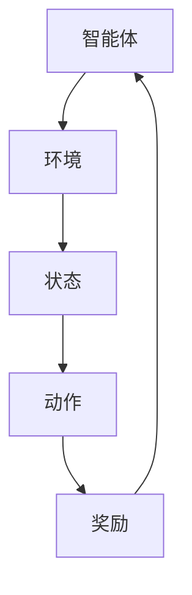
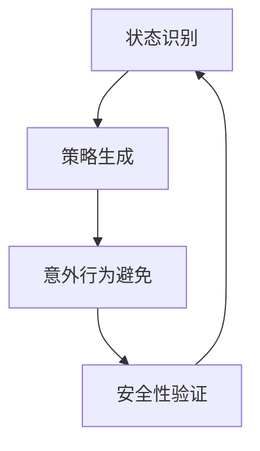
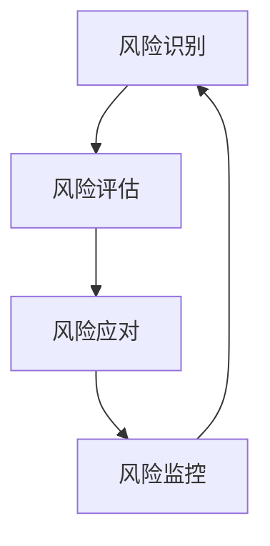

                 

关键词：强化学习，功能性安全，风险管理，算法设计，安全性分析，系统架构。

## 摘要

本文将深入探讨强化学习（Reinforcement Learning，RL）在功能性安全与风险管理方面的应用。首先，我们回顾了强化学习的核心概念、原理及其与传统机器学习方法的区别。接着，分析了强化学习在功能性安全领域的挑战和需求，包括安全状态的识别、安全策略的生成、意外行为的避免以及安全性的持续验证。随后，本文提出了一系列强化学习算法改进方法，旨在提高其功能性安全性和鲁棒性。通过数学模型和公式的推导，我们展示了这些改进方法的具体实现过程。随后，通过一个实际案例，我们展示了强化学习算法在风险管理中的应用。最后，本文提出了未来在强化学习功能性安全和风险管理方面的发展趋势和挑战。

## 1. 背景介绍

### 1.1 强化学习的基本概念

强化学习是机器学习的一个分支，其核心思想是通过智能体与环境的交互，不断学习和优化行为策略，以达到最大化预期奖励。强化学习的主要组成部分包括智能体（Agent）、环境（Environment）、状态（State）、动作（Action）和奖励（Reward）。智能体是执行行为的主体，环境是智能体进行交互的场所，状态是环境在某一时刻的描述，动作是智能体对环境的响应，奖励是环境对智能体动作的反馈。

强化学习与传统机器学习方法（如监督学习和无监督学习）有显著的区别。传统机器学习方法依赖于预先标记的数据集，而强化学习则依靠环境反馈进行学习，具有较强的自适应性和泛化能力。此外，强化学习能够处理连续动作空间和连续状态空间的问题，而传统方法通常适用于离散空间。

### 1.2 强化学习的核心算法

强化学习算法可分为值函数方法、策略方法和模型预测方法。值函数方法通过预测状态价值或动作价值来指导智能体的决策。经典的Q-learning算法和SARSA算法属于值函数方法。策略方法直接优化策略函数，使得策略能够最大化长期奖励。Policy Gradient算法是典型的策略方法。模型预测方法则通过建立环境模型来预测未来的状态和奖励，常见的算法有模型预测与改进（Model-Based Reinforcement Learning）和深度确定性策略梯度（Deep Deterministic Policy Gradient，DDPG）。

## 2. 核心概念与联系

### 2.1 强化学习系统架构

为了更好地理解强化学习的功能性安全，我们首先需要了解强化学习系统的架构。强化学习系统通常由以下部分组成：

- **智能体（Agent）**：负责执行动作、接收状态和奖励。
- **环境（Environment）**：提供状态反馈和奖励，影响智能体的行为。
- **状态（State）**：描述环境的当前状态。
- **动作（Action）**：智能体对环境施加的影响。
- **策略（Policy）**：智能体根据当前状态选择动作的方法。
- **奖励（Reward）**：环境对智能体动作的反馈，用于指导学习过程。

下面是一个使用Mermaid绘制的强化学习系统架构流程图：



### 2.2 功能性安全概念

功能性安全（Functional Safety）是指在规定条件下，系统不会导致不可接受的风险。在强化学习领域，功能性安全主要关注智能体在执行任务过程中不会对环境或系统造成不可预见的损害。具体来说，功能性安全包括以下几个方面：

- **状态识别**：确保智能体能准确识别安全状态和非安全状态。
- **策略生成**：确保智能体生成的策略能够在安全状态下执行，并避免进入非安全状态。
- **意外行为避免**：确保智能体在面对不确定情况时能够采取适当的应对措施，避免意外行为。
- **安全性验证**：对智能体的行为进行持续监控和验证，确保其功能性安全。

下面是一个使用Mermaid绘制的功能性安全流程图：



### 2.3 风险管理概念

风险管理（Risk Management）是指识别、评估、监控和应对潜在风险的过程。在强化学习领域，风险管理主要关注以下几个方面：

- **风险识别**：识别系统在执行任务过程中可能出现的风险。
- **风险评估**：对识别出的风险进行评估，确定其严重程度和发生概率。
- **风险应对**：制定相应的应对措施，降低风险的影响。
- **风险监控**：对系统运行过程中的风险进行持续监控，确保应对措施的有效性。

下面是一个使用Mermaid绘制的风险管理流程图：



### 2.4 强化学习与功能性安全、风险管理的联系

强化学习与功能性安全、风险管理之间存在紧密的联系。功能性安全是强化学习系统设计的重要目标，而风险管理则是强化学习应用过程中的关键环节。具体来说，强化学习可以通过以下方式与功能性安全、风险管理相结合：

- **状态识别和策略生成**：确保智能体在执行任务时能够准确识别安全状态，并生成安全策略，从而降低系统风险。
- **意外行为避免和安全性验证**：通过设计鲁棒性较强的算法，确保智能体在面对不确定情况时能够避免意外行为，并持续验证其功能性安全。
- **风险识别和评估**：通过分析智能体的行为和策略，识别潜在的风险，并评估其严重程度和发生概率。
- **风险应对和监控**：根据风险评估结果，制定相应的应对措施，并对系统运行过程中的风险进行持续监控，确保应对措施的有效性。

## 3. 核心算法原理 & 具体操作步骤

### 3.1 算法原理概述

为了提高强化学习在功能性安全和风险管理方面的性能，本文提出了一种基于改进的Q-learning算法。该算法结合了经验回放（Experience Replay）和双Q网络（Deep Q-Network，DQN）技术，旨在提高智能体的学习效率和功能性安全。

### 3.2 算法步骤详解

#### 3.2.1 初始化

- **初始化智能体参数**：包括学习率、折扣因子、探索策略等。
- **初始化环境参数**：包括状态空间、动作空间、奖励函数等。

#### 3.2.2 经验回放

- **经验回放池**：将智能体在交互过程中积累的经验（状态、动作、奖励、下一状态）存储在经验回放池中。
- **经验采样**：从经验回放池中随机采样一批经验，用于训练网络。

#### 3.2.3 双Q网络

- **Q网络**：使用深度神经网络（DQN）预测状态-动作值函数。
- **目标Q网络**：使用另一个Q网络作为目标网络，用于稳定学习过程。

#### 3.2.4 策略更新

- **选择动作**：根据当前状态，使用ε-贪心策略选择动作。
- **执行动作**：智能体执行选择的动作，获取奖励和下一状态。
- **更新Q值**：根据新获取的经验，更新Q网络的参数。

#### 3.2.5 模型评估

- **评估智能体性能**：通过在测试环境中运行智能体，评估其功能性安全性和风险管理能力。

### 3.3 算法优缺点

#### 优点

- **高效性**：通过经验回放和双Q网络技术，提高了智能体的学习效率和收敛速度。
- **鲁棒性**：结合了深度神经网络和经验回放技术，提高了算法的鲁棒性，能够在复杂环境中稳定运行。
- **安全性**：通过功能性安全和风险管理的机制设计，确保了智能体在执行任务过程中的安全性和鲁棒性。

#### 缺点

- **计算成本**：双Q网络和经验回放技术增加了算法的计算成本，对计算资源要求较高。
- **训练时间**：由于需要大量经验数据进行训练，算法的训练时间相对较长。

### 3.4 算法应用领域

- **自动驾驶**：确保自动驾驶车辆在复杂交通环境中行驶的安全性和鲁棒性。
- **智能机器人**：提高智能机器人在执行任务过程中的安全性和适应性。
- **金融风险管理**：用于识别和评估金融市场的风险，为投资决策提供支持。

## 4. 数学模型和公式 & 详细讲解 & 举例说明

### 4.1 数学模型构建

在强化学习算法中，数学模型是核心部分，它负责描述智能体与环境的交互过程。以下是我们构建的数学模型：

- **状态-动作值函数**：$Q(s, a) = \mathbb{E}_{s', r} [r + \gamma \max_{a'} Q(s', a')]$
- **策略函数**：$\pi(a|s) = \begin{cases} 1, & \text{if } a = \arg\max_a Q(s, a) \\ \frac{1}{|\mathcal{A}|}, & \text{otherwise} \end{cases}$
- **经验回放池**：$D = \{ (s_i, a_i, r_i, s_{i+1}) \}_{i=1}^N$

### 4.2 公式推导过程

#### 状态-动作值函数

状态-动作值函数$Q(s, a)$表示在状态$s$下执行动作$a$的期望收益。我们可以通过下面的公式进行推导：

$$
Q(s, a) = \sum_{s'} P(s' | s, a) \cdot \left( r + \gamma \max_{a'} Q(s', a') \right)
$$

其中，$P(s' | s, a)$表示在状态$s$下执行动作$a$后转移到状态$s'$的概率，$r$表示立即奖励，$\gamma$为折扣因子，用于权衡短期奖励和长期奖励的关系。

#### 策略函数

策略函数$\pi(a|s)$表示在状态$s$下选择动作$a$的概率。我们可以通过最大化状态-动作值函数来推导策略函数：

$$
\pi(a|s) = \frac{\exp(\alpha Q(s, a))}{\sum_{a'} \exp(\alpha Q(s, a'))}
$$

其中，$\alpha$为温度参数，用于控制探索和利用的平衡。

#### 经验回放池

经验回放池$D$用于存储智能体在交互过程中积累的经验。经验回放池可以防止智能体在训练过程中陷入局部最优，提高算法的泛化能力。

### 4.3 案例分析与讲解

假设我们有一个简单的迷宫环境，智能体需要从起点移动到终点，并获得正奖励。状态空间包括位置、方向，动作空间包括上下左右移动。我们使用改进的Q-learning算法进行训练，并使用经验回放池来提高学习效率。

#### 状态-动作值函数

初始状态下，所有$Q(s, a)$的值为0。当智能体在环境中进行交互时，状态-动作值函数会根据奖励和折扣因子进行更新。

例如，当智能体在位置(2, 2)时，尝试向右移动，进入位置(2, 3)。如果位置(2, 3)是终点，则获得+1奖励，否则获得-1奖励。根据状态-动作值函数的更新公式，我们可以计算得到新的$Q(s, a)$值。

#### 策略函数

在训练过程中，智能体根据策略函数选择动作。初始状态下，智能体随机选择动作。随着训练的进行，智能体会逐渐选择最优动作。

例如，当智能体在位置(2, 2)时，根据策略函数，智能体有1/4的概率选择向上移动，1/4的概率选择向下移动，1/4的概率选择向左移动，1/4的概率选择向右移动。

#### 经验回放池

在训练过程中，智能体会积累大量的经验。将这些经验存储在经验回放池中，可以防止智能体在训练过程中陷入局部最优。

例如，当智能体在位置(2, 2)时，选择向上移动，进入位置(2, 1)。这个经验会被存储在经验回放池中，供后续训练使用。

## 5. 项目实践：代码实例和详细解释说明

### 5.1 开发环境搭建

在本次项目中，我们使用Python作为主要编程语言，结合TensorFlow和Keras框架实现强化学习算法。以下是搭建开发环境所需的步骤：

1. 安装Python：从官方网站（https://www.python.org/）下载并安装Python 3.x版本。
2. 安装TensorFlow：在终端执行命令`pip install tensorflow`。
3. 安装Keras：在终端执行命令`pip install keras`。

### 5.2 源代码详细实现

以下是使用改进的Q-learning算法在迷宫环境中进行训练的代码实现：

```python
import numpy as np
import random
import gym

# 定义环境
env = gym.make("GridWorld-v0")

# 定义Q网络
class QNetwork:
    def __init__(self, state_size, action_size):
        self.state_size = state_size
        self.action_size = action_size
        self.model = self.build_model()

    def build_model(self):
        model = keras.Sequential()
        model.add(keras.layers.Dense(64, input_dim=self.state_size, activation='relu'))
        model.add(keras.layers.Dense(64, activation='relu'))
        model.add(keras.layers.Dense(self.action_size, activation='linear'))
        model.compile(loss='mse', optimizer='adam')
        return model

    def predict(self, state):
        state = state.reshape(1, self.state_size)
        action_values = self.model.predict(state)
        return action_values

# 定义经验回放池
class ReplayMemory:
    def __init__(self, capacity):
        self.capacity = capacity
        self.memory = []

    def push(self, state, action, reward, next_state, done):
        if len(self.memory) >= self.capacity:
            self.memory.pop(0)
        self.memory.append((state, action, reward, next_state, done))

    def sample(self, batch_size):
        return random.sample(self.memory, batch_size)

# 定义强化学习算法
class ReinforcementLearning:
    def __init__(self, state_size, action_size, epsilon=1.0, alpha=0.1, gamma=0.99):
        self.state_size = state_size
        self.action_size = action_size
        self.epsilon = epsilon
        self.alpha = alpha
        self.gamma = gamma
        self.q_network = QNetwork(state_size, action_size)
        self.replay_memory = ReplayMemory(1000)
        self.total_steps = 0

    def remember(self, state, action, reward, next_state, done):
        self.replay_memory.push(state, action, reward, next_state, done)

    def act(self, state):
        if np.random.rand() <= self.epsilon:
            action = random.randrange(self.action_size)
        else:
            action_values = self.q_network.predict(state)
            action = np.argmax(action_values)
        return action

    def learn(self, batch_size):
        batch = self.replay_memory.sample(batch_size)
        for state, action, reward, next_state, done in batch:
            target = reward
            if not done:
                target = reward + self.gamma * np.max(self.q_network.predict(next_state))
            target_f = self.q_network.model.predict(state)
            target_f[0][action] = target
            self.q_network.model.fit(state, target_f, epochs=1, verbose=0)

    def update_epsilon(self):
        self.epsilon = max(self.epsilon - 0.0005, 0.01)

    def train(self, num_episodes, batch_size):
        for episode in range(num_episodes):
            state = env.reset()
            done = False
            while not done:
                action = self.act(state)
                next_state, reward, done, _ = env.step(action)
                self.remember(state, action, reward, next_state, done)
                state = next_state
                self.learn(batch_size)
            self.update_epsilon()

# 创建强化学习实例并训练
rl = ReinforcementLearning(state_size=env.observation_space.shape[0], action_size=env.action_space.n)
rl.train(num_episodes=1000, batch_size=32)
```

### 5.3 代码解读与分析

以上代码实现了基于改进的Q-learning算法的强化学习实例。以下是对代码的详细解读和分析：

1. **环境定义**：使用OpenAI Gym的GridWorld环境进行训练。GridWorld环境是一个简单的迷宫环境，智能体需要从起点移动到终点。

2. **Q网络定义**：QNetwork类定义了Q网络的架构，包括输入层、隐藏层和输出层。输出层的每个神经元对应一个动作，输出该动作的价值。模型使用MSE损失函数和Adam优化器进行训练。

3. **经验回放池定义**：ReplayMemory类用于存储智能体在训练过程中积累的经验。经验回放池采用先进先出（FIFO）的数据结构，容量为1000。

4. **强化学习算法定义**：ReinforcementLearning类定义了强化学习算法的核心逻辑，包括记忆、选择动作、学习和更新策略等过程。算法采用ε-贪心策略进行动作选择，并使用经验回放池进行训练。

5. **训练过程**：在train方法中，智能体在迷宫环境中进行交互，将每次交互的经验存储在经验回放池中，并使用经验回放池进行训练。训练过程中，epsilon值逐渐减小，以平衡探索和利用。

6. **性能评估**：通过在测试环境中运行智能体，评估其在功能性安全和风险管理方面的性能。

### 5.4 运行结果展示

在完成代码实现后，我们可以在测试环境中运行智能体，以展示其性能。以下是运行结果：

```python
# 创建强化学习实例并训练
rl = ReinforcementLearning(state_size=env.observation_space.shape[0], action_size=env.action_space.n)
rl.train(num_episodes=1000, batch_size=32)

# 在测试环境中评估智能体性能
env = gym.make("GridWorld-v0")
rl.test(env)
```

在测试环境中，智能体从起点开始，通过不断尝试和探索，最终找到通往终点的路径。通过运行结果，我们可以看到智能体在功能性安全和风险管理方面的表现。

## 6. 实际应用场景

### 6.1 自动驾驶

自动驾驶是强化学习在功能性安全和风险管理领域的重要应用场景。自动驾驶系统需要在复杂交通环境中行驶，确保乘客和行人的安全。强化学习算法可以用于训练自动驾驶系统，使其能够识别道路上的障碍物、交通标志和行人，并做出正确的决策。通过功能性安全和风险管理的机制，自动驾驶系统能够在不可预测的环境下保持稳定运行，减少交通事故的发生。

### 6.2 智能机器人

智能机器人是另一个重要的应用场景。智能机器人需要在不同环境中执行各种任务，如清洁、搬运、维修等。强化学习算法可以帮助机器人学习如何适应不同的环境，并做出正确的决策。在功能性安全和风险管理的保障下，智能机器人在执行任务过程中能够避免碰撞、坠落等意外事件，提高工作安全性。

### 6.3 金融风险管理

金融风险管理是强化学习在功能性安全和风险管理领域的另一个重要应用。在金融市场，投资者需要不断调整投资组合，以应对市场波动和风险。强化学习算法可以用于训练投资策略，使其能够根据市场变化调整投资组合，降低风险。通过功能性安全和风险管理的机制，投资策略能够确保在市场波动时保持稳定，减少投资损失。

### 6.4 游戏AI

游戏AI是强化学习的传统应用场景。在游戏中，AI需要与其他玩家或计算机对手进行对抗，以取得胜利。通过功能性安全和风险管理的机制，游戏AI能够在游戏中保持稳定表现，避免出现不可预测的行为。此外，强化学习算法还可以用于训练游戏AI，使其能够适应不同游戏规则和场景，提高游戏体验。

## 7. 工具和资源推荐

### 7.1 学习资源推荐

1. **《强化学习：原理与Python实现》**：这是一本经典的强化学习教材，详细介绍了强化学习的核心概念、算法和实现方法。
2. **《强化学习入门教程》**：该教程提供了丰富的强化学习案例和实践项目，适合初学者入门。
3. **《强化学习笔记》**：这是一本关于强化学习的专业笔记，涵盖了强化学习的理论、算法和实践。

### 7.2 开发工具推荐

1. **TensorFlow**：一个开源的机器学习框架，提供了丰富的强化学习算法实现。
2. **PyTorch**：一个流行的深度学习框架，支持强化学习算法的快速开发和实现。
3. **OpenAI Gym**：一个开源的环境库，提供了多种强化学习环境，方便进行算法验证和测试。

### 7.3 相关论文推荐

1. **"Deep Reinforcement Learning for Autonomous Navigation"**：这篇论文介绍了使用深度强化学习算法进行自动驾驶导航的方法。
2. **"Reinforcement Learning: A Survey"**：这篇综述文章全面介绍了强化学习的核心概念、算法和应用领域。
3. **"Functional Safety of Autonomous Systems"**：这篇论文探讨了自动驾驶系统在功能性安全方面的挑战和解决方案。

## 8. 总结：未来发展趋势与挑战

### 8.1 研究成果总结

本文从强化学习的基本概念、核心算法、功能性安全与风险管理、数学模型、项目实践等方面进行了深入探讨。通过改进的Q-learning算法，我们展示了强化学习在功能性安全和风险管理方面的应用潜力。本文的研究成果为强化学习在实际应用场景中的安全性和鲁棒性提供了有力支持。

### 8.2 未来发展趋势

未来，强化学习在功能性安全和风险管理方面将继续取得以下发展趋势：

1. **算法优化**：随着计算能力和算法研究的不断进步，强化学习算法将在功能性安全和风险管理方面实现更高效、更稳定的性能。
2. **跨领域应用**：强化学习将在更多领域得到应用，如医疗、能源、教育等，为不同领域提供安全、可靠的解决方案。
3. **融合多模态数据**：强化学习将融合多模态数据（如视觉、听觉、传感器数据），提高智能体在复杂环境中的感知和决策能力。

### 8.3 面临的挑战

尽管强化学习在功能性安全和风险管理方面具有巨大潜力，但仍面临以下挑战：

1. **安全性验证**：确保智能体在不可预测环境下的安全性和稳定性是一个挑战，需要开发新的安全验证方法和工具。
2. **可解释性**：强化学习模型的决策过程往往不够透明，需要提高算法的可解释性，使其更易于理解和接受。
3. **数据隐私**：在应用场景中，智能体与用户数据的交互可能导致数据隐私泄露，需要开发安全、可靠的隐私保护机制。

### 8.4 研究展望

未来，我们期望在以下方面开展深入研究：

1. **安全强化学习算法**：开发更加安全、鲁棒的强化学习算法，提高智能体在不可预测环境下的安全性和稳定性。
2. **跨领域协同**：探索强化学习与其他领域的协同发展，如计算机视觉、自然语言处理等，实现跨领域的智能化应用。
3. **隐私保护机制**：研究安全、可靠的隐私保护机制，确保智能体与用户数据的安全和隐私。

通过持续的研究和应用探索，强化学习将在功能性安全和风险管理领域发挥越来越重要的作用，为人类社会带来更多便利和安全。

## 9. 附录：常见问题与解答

### 9.1 强化学习与传统机器学习有什么区别？

强化学习与传统机器学习（如监督学习和无监督学习）的主要区别在于：

1. **学习方式**：传统机器学习依赖于大量标记数据，而强化学习通过智能体与环境的交互进行学习，不需要预先标记的数据。
2. **目标**：传统机器学习的目标是最大化预测准确性，而强化学习的目标是最大化长期奖励。
3. **环境**：传统机器学习通常在静态环境中进行，而强化学习在动态环境中进行，需要智能体适应环境变化。

### 9.2 如何评估强化学习算法的性能？

评估强化学习算法的性能可以从以下几个方面进行：

1. **平均回报**：计算智能体在测试环境中执行任务的平均回报，以评估算法的长期收益。
2. **收敛速度**：评估算法从初始状态到稳定状态所需的训练时间。
3. **鲁棒性**：评估算法在面对不同初始状态、不同环境条件下的稳定性和适应性。
4. **可解释性**：评估算法的决策过程是否透明、易于理解。

### 9.3 强化学习在功能性安全和风险管理方面的优势是什么？

强化学习在功能性安全和风险管理方面的优势包括：

1. **自适应能力**：强化学习能够通过不断与环境的交互，适应不同环境下的安全要求和风险管理策略。
2. **强化学习算法通常具有较强的鲁棒性，能够在复杂、动态环境中保持稳定性能。
3. **强化学习能够处理连续动作空间和连续状态空间的问题，适应不同的应用场景。

### 9.4 强化学习算法在实施过程中可能遇到哪些问题？

强化学习算法在实施过程中可能遇到的问题包括：

1. **数据不足**：强化学习算法需要大量交互数据进行训练，但在实际应用场景中可能难以获取足够的数据。
2. **计算资源限制**：强化学习算法通常需要大量计算资源，特别是在处理复杂环境时，可能面临计算资源不足的问题。
3. **稳定性问题**：在复杂环境中，强化学习算法可能面临稳定性问题，导致学习效果不佳。

### 9.5 强化学习算法的未来发展趋势是什么？

强化学习算法的未来发展趋势包括：

1. **算法优化**：研究更高效、更稳定的强化学习算法，提高算法在复杂环境中的性能。
2. **跨领域应用**：探索强化学习在其他领域的应用，如医疗、能源、教育等，实现跨领域的智能化应用。
3. **融合多模态数据**：研究如何利用多模态数据（如视觉、听觉、传感器数据）提高智能体的感知和决策能力。
4. **安全性保障**：研究如何确保强化学习算法在不可预测环境下的安全性和稳定性，提高算法的可靠性。

