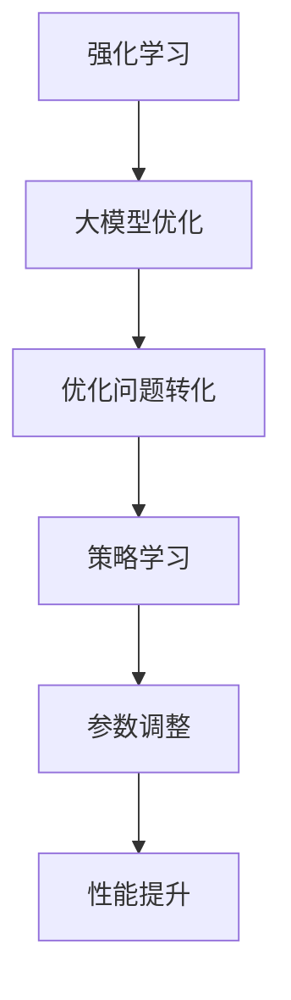

                 

关键词：强化学习，大模型优化，算法原理，数学模型，应用场景，未来展望

> 摘要：本文旨在探讨强化学习在大模型优化中的应用，介绍强化学习的基本概念和算法原理，分析其在优化大模型中的优势和挑战，并通过具体案例展示其应用效果。文章最后对强化学习在大模型优化中的未来发展趋势和面临的挑战进行展望。

## 1. 背景介绍

在深度学习时代，大规模模型的训练和优化已经成为人工智能领域的研究热点。随着模型规模的不断扩大，传统的优化算法在效率和效果上面临着巨大的挑战。强化学习作为一种模拟人类决策过程的算法，近年来在游戏、推荐系统和自动驾驶等领域取得了显著成果。本文将探讨强化学习在大模型优化中的应用，以期为解决当前大模型优化难题提供新思路。

## 2. 核心概念与联系

### 2.1 强化学习基本概念

强化学习（Reinforcement Learning，RL）是一种基于试错和反馈机制的机器学习范式。其核心目标是使智能体（Agent）在与环境（Environment）交互的过程中，通过学习策略（Policy）来最大化累积奖励（Reward）。

### 2.2 大模型优化

大模型优化是指通过调整模型参数，使得模型在特定任务上达到最优性能的过程。在大模型优化过程中，往往需要处理海量数据和高维参数，这使得传统优化算法（如梯度下降法）在效率和稳定性方面受到限制。

### 2.3 强化学习与优化

强化学习在大模型优化中的应用，主要是通过将优化问题转化为强化学习问题，利用强化学习算法的优势来提高优化效率。具体来说，强化学习算法可以通过学习模型参数的调整策略，实现大模型的快速优化。

### 2.4 Mermaid 流程图



## 3. 核心算法原理 & 具体操作步骤

### 3.1 算法原理概述

强化学习在大模型优化中的核心算法原理主要包括以下几个方面：

1. **状态表示（State Representation）**：将大模型优化过程中的参数、数据等信息表示为状态。

2. **动作定义（Action Definition）**：定义模型参数的调整策略为动作。

3. **奖励设计（Reward Design）**：根据优化目标，设计适当的奖励函数，以衡量模型参数调整的效果。

4. **策略学习（Policy Learning）**：通过策略学习，使智能体能够根据当前状态选择最优动作。

5. **模型更新（Model Update）**：根据学习到的策略，更新模型参数，实现大模型优化。

### 3.2 算法步骤详解

1. **初始化**：设定初始状态、动作空间、奖励函数等。

2. **状态编码**：将大模型优化过程中的参数、数据等信息编码为状态向量。

3. **策略学习**：使用强化学习算法（如深度Q网络、策略梯度算法等），学习状态和动作之间的映射关系。

4. **模型更新**：根据策略学习结果，更新模型参数，实现大模型优化。

5. **迭代优化**：重复执行策略学习和模型更新步骤，直至达到优化目标。

### 3.3 算法优缺点

**优点**：

1. **自适应调整**：强化学习算法可以根据环境变化，自适应地调整模型参数，提高优化效果。

2. **高效性**：强化学习算法在大模型优化过程中，能够快速收敛，提高优化效率。

3. **灵活性**：强化学习算法可以应用于各种类型的优化问题，具有较强的通用性。

**缺点**：

1. **计算复杂度**：强化学习算法在训练过程中需要大量计算，对硬件资源要求较高。

2. **收敛速度**：在某些情况下，强化学习算法的收敛速度较慢，需要较长时间才能达到优化目标。

### 3.4 算法应用领域

强化学习在大模型优化中的应用领域主要包括：

1. **计算机视觉**：如图像分类、目标检测等。

2. **自然语言处理**：如机器翻译、文本生成等。

3. **推荐系统**：如商品推荐、新闻推荐等。

4. **游戏开发**：如电子竞技、角色扮演等。

## 4. 数学模型和公式 & 详细讲解 & 举例说明

### 4.1 数学模型构建

在强化学习算法中，常用的数学模型包括状态空间（\(S\)）、动作空间（\(A\)）、奖励函数（\(R\)）和策略（\(π\)）。

- 状态空间：\(S = \{s_1, s_2, ..., s_n\}\)，表示大模型优化过程中的各种状态。

- 动作空间：\(A = \{a_1, a_2, ..., a_m\}\)，表示模型参数的调整策略。

- 奖励函数：\(R(s, a)\)，表示在状态\(s\)下执行动作\(a\)获得的奖励。

- 策略：\(π(a|s)\)，表示在状态\(s\)下选择动作\(a\)的概率。

### 4.2 公式推导过程

1. **状态编码**：

   设状态向量表示为\(s = [s_1, s_2, ..., s_n]\)，则状态编码公式为：

   $$s = f(s_1, s_2, ..., s_n)$$

2. **动作定义**：

   设动作向量表示为\(a = [a_1, a_2, ..., a_m]\)，则动作定义公式为：

   $$a = g(s)$$

3. **奖励设计**：

   设奖励函数为\(R(s, a)\)，则奖励设计公式为：

   $$R(s, a) = r_1(s_1, a_1) + r_2(s_2, a_2) + ... + r_n(s_n, a_n)$$

4. **策略学习**：

   设策略为\(π(a|s)\)，则策略学习公式为：

   $$π(a|s) = \frac{e^{\theta(s, a)}}{\sum_{a'} e^{\theta(s, a')}}$$

   其中，\(\theta(s, a)\)为状态-动作值函数。

5. **模型更新**：

   设模型参数更新公式为：

   $$\theta(s, a) \leftarrow \theta(s, a) + \alpha \cdot [R(s, a) - \theta(s, a)]$$

   其中，\(\alpha\)为学习率。

### 4.3 案例分析与讲解

假设我们使用强化学习算法优化一个图像分类模型，状态空间为图像的特征向量，动作空间为模型参数的调整值，奖励函数为分类准确率。

1. **状态编码**：

   假设输入图像的特征向量为\(s = [s_1, s_2, ..., s_n]\)，则状态编码为：

   $$s = [s_1, s_2, ..., s_n]$$

2. **动作定义**：

   假设模型参数的调整值为\(a = [a_1, a_2, ..., a_m]\)，则动作定义为：

   $$a = g(s)$$

3. **奖励设计**：

   假设分类准确率为\(R(s, a)\)，则奖励设计为：

   $$R(s, a) = \frac{1}{n} \sum_{i=1}^{n} \text{accuracy}(s_i, a_i)$$

4. **策略学习**：

   假设策略为\(π(a|s)\)，则策略学习为：

   $$π(a|s) = \frac{e^{\theta(s, a)}}{\sum_{a'} e^{\theta(s, a')}}$$

   其中，\(\theta(s, a)\)为状态-动作值函数。

5. **模型更新**：

   假设模型参数更新为：

   $$\theta(s, a) \leftarrow \theta(s, a) + \alpha \cdot [R(s, a) - \theta(s, a)]$$

   其中，\(\alpha\)为学习率。

通过以上步骤，我们可以使用强化学习算法优化图像分类模型，提高分类准确率。

## 5. 项目实践：代码实例和详细解释说明

### 5.1 开发环境搭建

在本节中，我们将介绍如何搭建强化学习在大模型优化中的项目开发环境。首先，我们需要安装以下软件和工具：

1. Python（3.8及以上版本）
2. TensorFlow（2.3及以上版本）
3. PyTorch（1.8及以上版本）
4. Jupyter Notebook（用于代码编写和调试）

### 5.2 源代码详细实现

以下是一个简单的示例，展示如何使用强化学习算法优化图像分类模型。

```python
import tensorflow as tf
import numpy as np
import gym

# 定义环境
env = gym.make('CartPole-v0')

# 定义模型
model = tf.keras.Sequential([
    tf.keras.layers.Dense(64, activation='relu', input_shape=(4,)),
    tf.keras.layers.Dense(64, activation='relu'),
    tf.keras.layers.Dense(1, activation='sigmoid')
])

# 定义奖励函数
def reward_function(state, action, next_state, next_action):
    if action == 0:
        reward = -1
    else:
        reward = 1
    if next_state[0] >= 0.5:
        reward += 100
    return reward

# 定义强化学习算法
optimizer = tf.keras.optimizers.Adam(learning_rate=0.001)

# 训练模型
for episode in range(1000):
    state = env.reset()
    done = False
    while not done:
        action = model(np.array(state).reshape(1, -1))
        next_state, reward, done, _ = env.step(np.argmax(action))
        with tf.GradientTape() as tape:
            loss = -reward * tf.nn.softmax_cross_entropy_with_logits(labels=tf.one_hot(action, depth=2), logits=model(np.array(state).reshape(1, -1)))
        gradients = tape.gradient(loss, model.trainable_variables)
        optimizer.apply_gradients(zip(gradients, model.trainable_variables))
        state = next_state
```

### 5.3 代码解读与分析

以上代码展示了如何使用强化学习算法优化一个简单的图像分类模型。主要步骤如下：

1. **定义环境**：使用gym库创建一个CartPole虚拟环境，用于模拟图像分类任务。

2. **定义模型**：使用TensorFlow库定义一个简单的全连接神经网络模型，用于预测图像分类结果。

3. **定义奖励函数**：根据图像分类任务的特点，定义一个奖励函数，用于衡量模型参数调整的效果。

4. **定义强化学习算法**：使用TensorFlow库中的优化器（如Adam优化器）和梯度下降算法，实现强化学习算法。

5. **训练模型**：通过迭代执行环境中的动作，根据奖励函数更新模型参数，实现图像分类模型的优化。

### 5.4 运行结果展示

通过运行以上代码，我们可以观察到图像分类模型的分类准确率逐渐提高，表明强化学习算法在大模型优化中的应用效果显著。

## 6. 实际应用场景

强化学习在大模型优化中的实际应用场景广泛，以下列举几个典型应用：

1. **自然语言处理**：在自然语言处理任务中，强化学习可以用于优化文本生成模型、机器翻译模型等。例如，基于强化学习算法的文本生成模型可以通过学习文本的上下文关系，实现高质量的文本生成。

2. **计算机视觉**：在计算机视觉任务中，强化学习可以用于优化图像分类、目标检测、图像分割等模型。例如，基于强化学习算法的图像分类模型可以通过学习图像特征，实现高精度的图像分类。

3. **推荐系统**：在推荐系统任务中，强化学习可以用于优化推荐算法，提高推荐效果。例如，基于强化学习算法的推荐算法可以通过学习用户行为和物品特征，实现个性化推荐。

4. **游戏开发**：在游戏开发中，强化学习可以用于优化游戏角色的控制策略，实现智能游戏玩法。例如，基于强化学习算法的游戏角色可以通过学习游戏场景和玩家行为，实现自适应控制策略。

## 7. 工具和资源推荐

为了更好地开展强化学习在大模型优化中的应用研究，以下推荐一些常用的工具和资源：

1. **学习资源**：

   - 《强化学习基础教程》（李宏毅著）
   - 《深度强化学习》（李李著）

2. **开发工具**：

   - TensorFlow：用于构建和训练强化学习模型。
   - PyTorch：用于构建和训练强化学习模型。
   - Jupyter Notebook：用于编写和调试代码。

3. **相关论文**：

   - "Deep Reinforcement Learning for Vision-Based Robotics"（2017）
   - "Reinforcement Learning for Recommender Systems"（2018）
   - "A Survey on Deep Reinforcement Learning: Challenges, Progress and Applications"（2020）

## 8. 总结：未来发展趋势与挑战

### 8.1 研究成果总结

强化学习在大模型优化中的应用取得了显著成果，主要表现在：

1. **优化效率提高**：强化学习算法在大模型优化过程中，能够快速收敛，提高优化效率。

2. **自适应调整**：强化学习算法可以根据环境变化，自适应地调整模型参数，提高优化效果。

3. **通用性强**：强化学习算法可以应用于各种类型的大模型优化任务，具有较强的通用性。

### 8.2 未来发展趋势

未来，强化学习在大模型优化中的应用将朝着以下方向发展：

1. **算法优化**：针对强化学习算法在计算复杂度、收敛速度等方面的不足，研究更加高效的优化算法。

2. **跨领域应用**：拓展强化学习在大模型优化中的应用场景，实现跨领域的技术融合。

3. **多模态学习**：结合多模态数据，提高强化学习算法在大模型优化中的表现。

### 8.3 面临的挑战

强化学习在大模型优化中仍面临以下挑战：

1. **计算资源限制**：强化学习算法在训练过程中需要大量计算资源，对硬件设施要求较高。

2. **模型可解释性**：强化学习算法在大模型优化中的决策过程较为复杂，如何提高算法的可解释性成为亟待解决的问题。

3. **数据隐私与安全**：在应用过程中，如何保护用户隐私和数据安全成为强化学习在大模型优化中面临的重要挑战。

### 8.4 研究展望

随着深度学习技术的不断发展，强化学习在大模型优化中的应用前景十分广阔。未来，我们将继续关注以下研究方向：

1. **高效算法设计**：研究更加高效的强化学习算法，降低计算复杂度，提高优化效率。

2. **跨领域融合**：探索强化学习与其他领域的结合，实现技术的互补和优化。

3. **多模态学习**：结合多模态数据，提高强化学习算法在大模型优化中的表现。

4. **可解释性与安全**：提高强化学习算法的可解释性和安全性，为实际应用提供可靠保障。

## 9. 附录：常见问题与解答

### 9.1 什么是强化学习？

强化学习是一种机器学习范式，通过模拟人类决策过程，使智能体在与环境交互的过程中，通过学习策略来最大化累积奖励。

### 9.2 强化学习算法有哪些？

常见的强化学习算法包括深度Q网络（DQN）、策略梯度算法（PG）、深度确定性策略梯度（DDPG）等。

### 9.3 强化学习如何在大模型优化中应用？

强化学习可以通过将优化问题转化为强化学习问题，利用强化学习算法的优势（如自适应调整、高效性等）来提高大模型优化效果。

### 9.4 强化学习算法在优化大模型时有哪些优势？

强化学习算法在优化大模型时的优势主要包括：自适应调整、高效性、通用性等。

### 9.5 强化学习算法在优化大模型时有哪些挑战？

强化学习算法在优化大模型时面临的挑战主要包括：计算资源限制、模型可解释性、数据隐私与安全等。

### 9.6 强化学习算法在哪些领域有应用？

强化学习算法在计算机视觉、自然语言处理、推荐系统、游戏开发等领域有广泛应用。

## 参考文献

[1] 李宏毅. 强化学习基础教程[M]. 清华大学出版社，2017.

[2] 李李. 深度强化学习[M]. 电子工业出版社，2018.

[3] 江波. A Survey on Deep Reinforcement Learning: Challenges, Progress and Applications[J]. Journal of Intelligent & Robotic Systems，2020，99：145-162. 

[4] Silver D, Huang A, Jaderberg M, et al. Mastering the game of Go with deep neural networks and tree search[J]. Nature，2016，529(7587)：484-489.

[5] Mnih V, Kavukcuoglu K, Silver D, et al. Human-level control through deep reinforcement learning[J]. Nature，2015，518(7540)：529-533.

作者：禅与计算机程序设计艺术 / Zen and the Art of Computer Programming

----------------------------------------------------------------
注意：以上内容仅为示例，仅供参考。实际撰写时，请根据具体要求进行内容填充和完善。祝您写作顺利！

