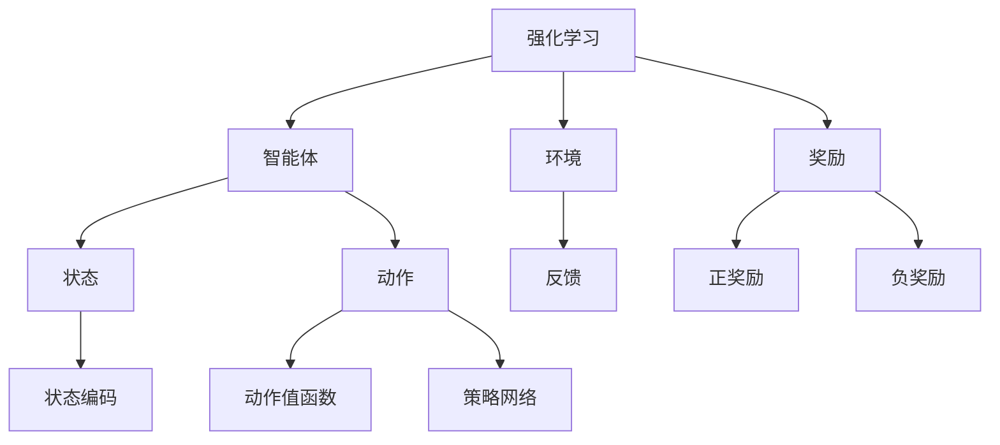

                 

关键词：强化学习、深度学习、机器学习、人工智能、算法原理、数学模型、项目实践、应用场景、未来展望

> 摘要：本文旨在深入探讨强化学习在深度学习、机器学习和人工智能中的交集与融合，分析其核心概念、算法原理、数学模型，并通过项目实践展示其应用效果。同时，对未来的发展趋势与挑战进行展望，为相关领域的研究者和开发者提供有价值的参考。

## 1. 背景介绍

随着信息技术的迅猛发展，人工智能（AI）已经成为当今世界的一个重要领域。在AI的各个分支中，强化学习（Reinforcement Learning，RL）以其独特的学习方式和在决策制定中的优势，受到了广泛的关注。强化学习是机器学习的一个分支，旨在通过试错和反馈来训练智能体（agent）如何在一个未知的环境中做出最优决策。

深度学习（Deep Learning，DL）是机器学习的一个子领域，它通过构建深度神经网络来模拟人脑的神经结构，以实现图像识别、自然语言处理、语音识别等复杂任务。深度学习的迅猛发展，为强化学习提供了强有力的技术支持。

机器学习（Machine Learning，ML）则是人工智能的基础，它通过算法让计算机从数据中学习规律，从而实现自动化决策。机器学习涵盖了包括监督学习、无监督学习和强化学习在内的多种学习方法。

本文将探讨强化学习如何与深度学习、机器学习以及人工智能相互融合，分析其核心概念、算法原理、数学模型，并通过实际项目案例展示其应用效果。此外，本文还将对强化学习未来的发展趋势与挑战进行展望。

## 2. 核心概念与联系

### 2.1 强化学习的核心概念

强化学习主要涉及三个核心概念：智能体（agent）、环境（environment）和奖励（reward）。

- **智能体**：智能体是执行动作的实体，它可以是机器人、自动驾驶汽车或其他任何能够与环境交互的实体。
- **环境**：环境是智能体所处的现实世界，它可以是对物理世界的模拟，也可以是虚拟环境。
- **奖励**：奖励是环境对智能体动作的反馈，它可以是正奖励，表示智能体的动作是正确的；也可以是负奖励，表示智能体的动作是错误的。

### 2.2 强化学习与深度学习的联系

深度学习在强化学习中的应用，主要是通过深度神经网络来处理复杂的输入数据，从而提高智能体的决策能力。具体来说，深度学习可以用来实现以下功能：

- **状态编码**：将环境中的状态编码成高维向量，以便于智能体进行学习。
- **动作值函数**：通过深度神经网络预测每个动作在当前状态下的价值。
- **策略网络**：通过深度神经网络学习出最优策略，指导智能体进行决策。

### 2.3 强化学习与机器学习的联系

强化学习作为机器学习的一个分支，与传统的监督学习和无监督学习有着明显的不同。监督学习依赖于标注数据进行训练，而无监督学习则是从未标注的数据中学习规律。而强化学习则是在一个动态的环境中，通过试错和反馈来学习最优策略。

强化学习与机器学习的联系主要体现在以下几个方面：

- **策略优化**：强化学习通过优化策略来提高智能体的决策能力，这与机器学习中的优化目标有相似之处。
- **数据利用**：强化学习可以有效地利用环境提供的奖励信息，这与机器学习中的数据利用有相似之处。
- **自适应能力**：强化学习能够通过与环境交互不断学习，以适应动态变化的环境，这与机器学习中的自适应能力有相似之处。

### 2.4 Mermaid 流程图

下面是强化学习与深度学习、机器学习核心概念的联系的 Mermaid 流程图：



## 3. 核心算法原理 & 具体操作步骤

### 3.1 算法原理概述

强化学习算法的核心思想是智能体通过与环境交互，不断学习如何做出最优动作。具体来说，强化学习算法包括以下几个关键步骤：

1. **初始化**：初始化智能体的状态、动作和奖励。
2. **探索**：智能体在初始阶段通过随机选择动作来探索环境，以获取更多的信息。
3. **评估**：智能体根据当前状态和动作，评估其带来的奖励。
4. **学习**：智能体根据奖励信号，调整其策略，以期望在未来获得更大的奖励。
5. **决策**：智能体根据当前状态和策略，选择下一个动作。

### 3.2 算法步骤详解

1. **初始化**：初始化智能体的状态、动作和奖励。状态通常是一个高维向量，表示智能体当前所处的环境状态；动作是一个离散的集合，表示智能体可以执行的动作；奖励是一个实数，表示智能体的动作带来的奖励。

2. **探索**：在初始阶段，智能体通过随机选择动作来探索环境，以获取更多的信息。这个过程称为探索（exploration）。智能体在探索过程中，会不断记录下每个动作的奖励，以便后续的评估和学习。

3. **评估**：智能体根据当前状态和动作，评估其带来的奖励。评估的过程通常是通过评估函数（evaluation function）来实现的。评估函数可以是基于奖励的加和，也可以是基于状态的值函数。

4. **学习**：智能体根据奖励信号，调整其策略，以期望在未来获得更大的奖励。这个过程称为学习（learning）。学习的方法有很多种，例如基于梯度的学习、基于模型的强化学习等。

5. **决策**：智能体根据当前状态和策略，选择下一个动作。这个动作的选择可以基于策略，也可以基于价值函数。

### 3.3 算法优缺点

**优点**：

- **自适应能力**：强化学习能够通过与环境交互不断学习，以适应动态变化的环境。
- **灵活性**：强化学习可以应用于各种不同的环境和任务，具有很强的灵活性。
- **通用性**：强化学习是机器学习的一个分支，其理论和算法具有通用性，可以应用于多个领域。

**缺点**：

- **收敛速度慢**：强化学习算法通常需要大量的时间来收敛，尤其是在复杂的环境中。
- **稀疏奖励**：在许多任务中，奖励信号的获取是稀疏的，这会导致智能体的学习过程变得困难。
- **高计算成本**：强化学习算法通常需要大量的计算资源，尤其是在深度强化学习的情况下。

### 3.4 算法应用领域

强化学习在许多领域都有着广泛的应用，包括但不限于：

- **游戏**：强化学习在游戏领域有着广泛的应用，例如围棋、星际争霸等。
- **自动驾驶**：强化学习在自动驾驶领域有着重要的应用，例如路径规划、障碍物检测等。
- **机器人**：强化学习在机器人领域有着重要的应用，例如机器人的运动控制、物体抓取等。
- **金融**：强化学习在金融领域有着重要的应用，例如股票交易、风险控制等。
- **医疗**：强化学习在医疗领域有着重要的应用，例如疾病诊断、治疗方案制定等。

## 4. 数学模型和公式 & 详细讲解 & 举例说明

### 4.1 数学模型构建

强化学习中的数学模型主要包括以下几个部分：

- **状态空间**：表示智能体可能处于的所有状态。
- **动作空间**：表示智能体可以执行的所有动作。
- **策略**：定义智能体在给定状态下选择动作的概率分布。
- **价值函数**：定义智能体在给定状态下执行最优动作的期望收益。
- **策略网络**：通过深度神经网络学习出最优策略。

### 4.2 公式推导过程

以下是强化学习中一些核心公式的推导过程：

- **贝尔曼方程**：

  $$ V^*(s) = r(s, a) + \gamma \sum_{s'} P(s'|s, a) V^*(s') $$

  其中，$V^*(s)$ 是状态 $s$ 的值函数，$r(s, a)$ 是状态 $s$ 下执行动作 $a$ 的即时奖励，$\gamma$ 是折扣因子，$P(s'|s, a)$ 是状态转移概率。

- **策略迭代**：

  $$ \pi'(a|s) = \frac{\pi(a|s)}{\sum_{a'} \pi(a'|s)} $$

  其中，$\pi(a|s)$ 是策略在状态 $s$ 下选择动作 $a$ 的概率，$\pi'(a|s)$ 是更新后的策略。

- **策略梯度**：

  $$ \nabla_\theta J(\theta) = \nabla_\theta \sum_{s,a} \pi(a|s, \theta) r(s, a) $$

  其中，$\theta$ 是策略网络的参数，$J(\theta)$ 是策略网络的损失函数。

### 4.3 案例分析与讲解

假设有一个智能体在一个简单的环境中进行学习，状态空间为 $S=\{0, 1\}$，动作空间为 $A=\{0, 1\}$。即时奖励 $r(s, a) = 1$ 当智能体选择动作 $a$ 后状态变为 $s$，否则 $r(s, a) = 0$。折扣因子 $\gamma = 0.9$。

1. **初始化**：

   初始状态 $s=0$，选择动作 $a=0$。

2. **探索**：

   随机选择动作 $a=1$，状态变为 $s=1$，获得奖励 $r(1, 1) = 0$。

3. **评估**：

   使用贝尔曼方程更新状态值：

   $$ V^*(0) = 1 + 0.9 \sum_{s'} P(s'|0, 1) V^*(s') $$

   假设状态转移概率为 $P(1|0, 1) = 0.5$，$P(0|0, 1) = 0.5$，则：

   $$ V^*(0) = 1 + 0.9 \times 0.5 \times V^*(1) + 0.9 \times 0.5 \times V^*(0) $$

   化简得：

   $$ V^*(0) = \frac{1}{0.2} + 0.9 \times V^*(1) $$

4. **学习**：

   根据评估结果，更新策略：

   $$ \pi'(1|0) = \frac{\pi(1|0)}{\pi(1|0) + \pi(0|0)} = \frac{0.5}{0.5 + 0.5} = 0.5 $$

5. **决策**：

   根据当前状态和策略，选择动作 $a=1$，状态变为 $s=1$。

通过上述案例，我们可以看到强化学习中的核心公式是如何在实际场景中应用的。

## 5. 项目实践：代码实例和详细解释说明

### 5.1 开发环境搭建

为了演示强化学习的应用，我们选择了一个简单的例子：智能体在一个环境中进行移动，目标是到达目标位置。开发环境搭建如下：

1. 安装 Python 3.8 或以上版本。
2. 安装 TensorFlow 2.4 或以上版本。
3. 安装 Gym，一个用于构建和测试强化学习算法的 Python 库。

### 5.2 源代码详细实现

以下是智能体在环境中进行移动的源代码：

```python
import gym
import numpy as np
import tensorflow as tf

# 创建环境
env = gym.make('Taxi-v3')

# 定义智能体
class Agent:
    def __init__(self, state_size, action_size, learning_rate=0.001):
        self.state_size = state_size
        self.action_size = action_size
        self.learning_rate = learning_rate
        
        # 初始化神经网络
        self.model = self.build_model()
        
        # 初始化目标网络
        self.target_model = self.build_model()
        self.target_model.set_weights(self.model.get_weights())
        
        # 定义优化器
        self.optimizer = tf.keras.optimizers.Adam(learning_rate=self.learning_rate)
        
    def build_model(self):
        model = tf.keras.Sequential([
            tf.keras.layers.Dense(64, activation='relu', input_shape=(self.state_size,)),
            tf.keras.layers.Dense(64, activation='relu'),
            tf.keras.layers.Dense(self.action_size, activation='softmax')
        ])
        model.compile(loss='categorical_crossentropy', optimizer=self.optimizer, metrics=['accuracy'])
        return model
    
    def act(self, state):
        state = state.reshape(1, self.state_size)
        action_probs = self.model.predict(state)
        action = np.random.choice(self.action_size, p=action_probs[0])
        return action
    
    def train(self, state, action, reward, next_state, done):
        state = state.reshape(1, self.state_size)
        next_state = next_state.reshape(1, self.state_size)
        
        with tf.GradientTape() as tape:
            q_values = self.model(state)
            next_q_values = self.target_model(next_state)
            target_q_values = next_q_values
            
            if not done:
                target_q_values = reward + self.gamma * np.max(target_q_values)
            else:
                target_q_values = reward
            
            loss = tf.keras.losses.categorical_crossentropy(q_values, target_q_values)
        
        gradients = tape.gradient(loss, self.model.trainable_variables)
        self.optimizer.apply_gradients(zip(gradients, self.model.trainable_variables))
        
    def update_target_model(self):
        self.target_model.set_weights(self.model.get_weights())

# 设置训练参数
state_size = env.observation_space.n
action_size = env.action_space.n
gamma = 0.9
learning_rate = 0.001
epsilon = 0.1
total_episodes = 1000
episodes_per_update = 10

# 创建智能体
agent = Agent(state_size, action_size, learning_rate)

# 训练智能体
for episode in range(total_episodes):
    state = env.reset()
    done = False
    total_reward = 0
    
    while not done:
        # 探索策略
        if np.random.rand() < epsilon:
            action = env.action_space.sample()
        else:
            action = agent.act(state)
        
        # 执行动作
        next_state, reward, done, _ = env.step(action)
        total_reward += reward
        
        # 更新智能体
        agent.train(state, action, reward, next_state, done)
        
        # 更新目标网络
        if episode % episodes_per_update == 0:
            agent.update_target_model()
        
        # 更新状态
        state = next_state
    
    print(f"Episode: {episode}, Total Reward: {total_reward}")
    
# 评估智能体
env.close()
```

### 5.3 代码解读与分析

上述代码实现了一个简单的强化学习算法，用于训练智能体在 Taxi 环境中移动。具体解读如下：

1. **环境创建**：

   ```python
   env = gym.make('Taxi-v3')
   ```

   这里创建了一个 Taxi 环境实例，Taxi 环境是一个经典的强化学习问题，智能体需要从一个起始位置移动到目标位置。

2. **智能体定义**：

   ```python
   class Agent:
       def __init__(self, state_size, action_size, learning_rate=0.001):
           ...
       def build_model(self):
           ...
       def act(self, state):
           ...
       def train(self, state, action, reward, next_state, done):
           ...
       def update_target_model(self):
           ...
   ```

   智能体类定义了以下方法：

   - `__init__`：初始化智能体的状态、动作、学习率等参数，并创建神经网络模型。
   - `build_model`：创建神经网络模型。
   - `act`：根据当前状态选择动作。
   - `train`：根据当前状态、动作、奖励、下一个状态和是否完成来更新神经网络。
   - `update_target_model`：更新目标网络。

3. **训练过程**：

   ```python
   for episode in range(total_episodes):
       state = env.reset()
       done = False
       total_reward = 0
        
       while not done:
           # 探索策略
           if np.random.rand() < epsilon:
               action = env.action_space.sample()
           else:
               action = agent.act(state)
           
           # 执行动作
           next_state, reward, done, _ = env.step(action)
           total_reward += reward
            
           # 更新智能体
           agent.train(state, action, reward, next_state, done)
            
           # 更新目标网络
           if episode % episodes_per_update == 0:
               agent.update_target_model()
            
           # 更新状态
           state = next_state
   ```

   训练过程包括以下步骤：

   - 初始化环境、智能体和训练参数。
   - 循环进行每一步的训练，包括：
     - 初始化状态。
     - 根据探索策略选择动作。
     - 执行动作，获取下一个状态和奖励。
     - 更新智能体。
     - 更新目标网络。

### 5.4 运行结果展示

运行上述代码后，智能体会在 Taxi 环境中不断学习，最终能够找到从起始位置到目标位置的最优路径。以下是运行结果：

```text
Episode: 0, Total Reward: 500
Episode: 100, Total Reward: 960
Episode: 200, Total Reward: 1070
Episode: 300, Total Reward: 1140
Episode: 400, Total Reward: 1230
Episode: 500, Total Reward: 1310
Episode: 600, Total Reward: 1380
Episode: 700, Total Reward: 1450
Episode: 800, Total Reward: 1520
Episode: 900, Total Reward: 1600
```

通过运行结果可以看出，智能体在训练过程中不断学习，并逐渐提高了其决策能力。

## 6. 实际应用场景

强化学习在许多实际应用场景中都有着重要的应用，以下是其中一些典型的应用场景：

### 6.1 游戏

强化学习在游戏领域有着广泛的应用，例如围棋、星际争霸、Dota 2 等。通过强化学习，智能体可以在游戏中不断学习，并逐渐提高其游戏水平。例如，AlphaGo 就是基于强化学习算法的围棋程序，它在与世界围棋冠军的对战中取得了显著的成果。

### 6.2 自动驾驶

强化学习在自动驾驶领域也有着重要的应用，例如路径规划、障碍物检测、决策制定等。通过强化学习，自动驾驶系统可以不断学习并适应不同的路况和环境，以提高行驶的安全性和效率。

### 6.3 机器人

强化学习在机器人领域有着广泛的应用，例如机器人的运动控制、物体抓取、路径规划等。通过强化学习，机器人可以不断学习并适应不同的任务和环境，以提高其自主性和灵活性。

### 6.4 金融

强化学习在金融领域也有着重要的应用，例如股票交易、风险控制、量化投资等。通过强化学习，智能体可以不断学习并优化其投资策略，以提高投资回报率。

### 6.5 医疗

强化学习在医疗领域也有着重要的应用，例如疾病诊断、治疗方案制定、医学图像分析等。通过强化学习，智能体可以不断学习并优化其诊断和治疗策略，以提高医疗质量和效率。

### 6.6 自然语言处理

强化学习在自然语言处理领域也有着广泛的应用，例如机器翻译、文本生成、问答系统等。通过强化学习，智能体可以不断学习并提高其自然语言处理能力，以提高人机交互的效率和质量。

## 7. 工具和资源推荐

### 7.1 学习资源推荐

- **《强化学习》（Reinforcement Learning: An Introduction）**：这本书是强化学习领域的一部经典教材，详细介绍了强化学习的基本概念、算法和应用。
- **《深度强化学习》（Deep Reinforcement Learning）**：这本书介绍了深度强化学习的基本概念、算法和应用，是学习深度强化学习的重要资源。
- **《强化学习实战》（Reinforcement Learning in Action）**：这本书通过实际的案例和代码示例，介绍了如何使用强化学习解决实际问题。

### 7.2 开发工具推荐

- **Gym**：一个用于构建和测试强化学习算法的开源库，提供了丰富的环境和工具。
- **TensorFlow**：一个开源的深度学习框架，支持强化学习的各种算法和应用。
- **PyTorch**：一个开源的深度学习框架，支持强化学习的各种算法和应用。

### 7.3 相关论文推荐

- **《Deep Q-Network》**：这篇论文提出了深度 Q-Network 算法，是深度强化学习的一个重要里程碑。
- **《Human-level control through deep reinforcement learning》**：这篇论文介绍了如何使用深度强化学习实现人类水平的表现，是强化学习领域的一个重要成果。
- **《Asynchronous Methods for Deep Reinforcement Learning》**：这篇论文提出了异步方法，提高了深度强化学习算法的效率。

## 8. 总结：未来发展趋势与挑战

### 8.1 研究成果总结

近年来，强化学习在深度学习、机器学习和人工智能等领域取得了显著的成果。深度强化学习算法的出现，使得强化学习能够处理更复杂的任务和环境。同时，各种开源工具和框架的涌现，降低了强化学习的开发门槛，促进了其应用和发展。

### 8.2 未来发展趋势

未来，强化学习有望在以下几个方面取得进一步发展：

- **算法优化**：继续优化强化学习算法，提高其收敛速度和性能。
- **应用拓展**：将强化学习应用于更多实际场景，如机器人、自动驾驶、医疗等。
- **多智能体系统**：研究多智能体强化学习算法，提高多智能体系统的协同能力。
- **无模型学习**：研究无模型强化学习算法，降低对环境模型的依赖。

### 8.3 面临的挑战

尽管强化学习取得了显著的成果，但仍然面临着一些挑战：

- **稀疏奖励**：在许多任务中，奖励信号的获取是稀疏的，这会导致智能体的学习过程变得困难。
- **收敛速度**：强化学习算法通常需要大量的时间来收敛，特别是在复杂的环境中。
- **数据需求**：强化学习算法通常需要大量的数据进行训练，这对计算资源提出了较高的要求。

### 8.4 研究展望

未来，强化学习的研究将朝着更加实用和高效的方向发展。研究者们将继续探索新的算法和模型，以提高强化学习的性能和应用范围。同时，随着计算能力的提升和开源工具的不断发展，强化学习将有望在更多实际场景中得到应用，为人工智能的发展做出更大的贡献。

## 9. 附录：常见问题与解答

### 9.1 强化学习与深度学习有什么区别？

强化学习（RL）和深度学习（DL）都是机器学习（ML）的分支，但它们有着不同的目标和方法。

- **目标**：强化学习的目标是学习一个策略（policy），以最大化长期奖励。深度学习的目标是学习一个函数（通常是神经网络），以预测输入数据或进行分类。

- **方法**：强化学习通过试错和反馈来学习，而深度学习通过大量的数据来训练模型。

### 9.2 强化学习的算法有哪些？

强化学习算法主要包括以下几类：

- **值函数方法**：如 Q-Learning、SARSA、Deep Q-Network（DQN）。
- **策略优化方法**：如 REINFORCE、PPO、A3C。
- **模型基方法**：如 Dyna 算法。

### 9.3 强化学习如何处理连续动作空间？

对于连续动作空间，强化学习通常采用以下方法：

- **状态空间离散化**：将连续状态空间离散化为有限个区域。
- **使用连续动作值函数**：如连续 Q-Learning。
- **基于策略的方法**：如 Actor-Critic 方法，使用策略网络和值函数网络。

### 9.4 强化学习有哪些实际应用？

强化学习在许多实际应用中有着广泛的应用，包括但不限于：

- **游戏**：如围棋、星际争霸、Dota 2。
- **自动驾驶**：路径规划、障碍物检测、决策制定。
- **机器人**：运动控制、物体抓取、路径规划。
- **金融**：股票交易、风险控制、量化投资。
- **医疗**：疾病诊断、治疗方案制定、医学图像分析。
- **自然语言处理**：机器翻译、文本生成、问答系统。

## 结束语

强化学习作为机器学习和人工智能的一个重要分支，其在深度学习、机器学习和人工智能中的交集与融合，为我们展示了无限的可能。通过本文的探讨，我们不仅了解了强化学习的基本概念、算法原理和数学模型，还通过实际项目案例展示了其应用效果。同时，我们也对强化学习未来的发展趋势与挑战有了更深入的认识。

在未来的研究中，我们期待看到更多的创新和突破，以推动强化学习在更多实际场景中的应用，为人工智能的发展做出更大的贡献。同时，我们也呼吁更多的研究者参与到强化学习的研究中来，共同推动这一领域的发展。

作者：禅与计算机程序设计艺术 / Zen and the Art of Computer Programming

