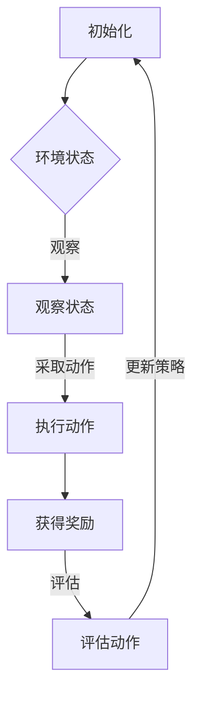

                 

 **关键词**：强化学习、物联网、应用场景、算法、系统优化

**摘要**：本文主要探讨了强化学习在物联网系统中的应用，阐述了强化学习的基本概念及其在物联网系统中的优势。通过具体案例，分析了强化学习在物联网系统中的实际应用，为物联网系统的优化提供了新的思路和方法。

## 1. 背景介绍

随着物联网技术的快速发展，各种智能设备、传感器等已广泛融入我们的生活。物联网系统作为一个复杂的网络，其稳定性和效率直接影响到用户的使用体验。在物联网系统中，设备和系统之间需要进行大量的数据交换和处理，这使得系统优化变得尤为重要。而强化学习作为一种先进的人工智能技术，近年来在优化物联网系统方面展现出了巨大的潜力。

### 1.1 强化学习的基本概念

强化学习（Reinforcement Learning，RL）是一种机器学习方法，旨在通过试错来学习最优行为策略。强化学习的基本框架包括四个主要组成部分：代理人（Agent）、环境（Environment）、动作（Action）和奖励（Reward）。代理人在环境中采取动作，根据环境的反馈（奖励或惩罚）来调整自己的行为策略。

强化学习的核心目标是学习一种最优策略（Policy），使得代理人能够在环境中取得最大化的累积奖励。强化学习通过探索（Exploration）和利用（Exploitation）来平衡学习和经验应用。在物联网系统中，强化学习可以通过自适应调整来优化系统性能，提高设备之间的协同效率。

### 1.2 物联网系统的特点与挑战

物联网系统具有以下特点：

1. **分布式**：物联网系统由多个设备组成，这些设备分布在不同的地理位置。
2. **异构性**：设备类型繁多，具有不同的计算能力和能源限制。
3. **动态性**：物联网系统中的设备和环境不断变化，需要实时调整策略。

这些特点给物联网系统的优化带来了以下挑战：

1. **系统复杂度**：物联网系统规模庞大，设备类型多样，使得系统优化变得复杂。
2. **数据隐私**：物联网系统中的数据涉及用户的隐私，需要保护用户数据的安全。
3. **实时性**：物联网系统需要实时响应用户需求，对系统的响应速度有较高要求。

## 2. 核心概念与联系

### 2.1 强化学习在物联网系统中的核心概念

在物联网系统中，强化学习的核心概念包括：

1. **代理人与环境**：代理人代表物联网系统中的设备或系统，环境则包括所有其他设备和传感器。
2. **动作与状态**：动作是代理人可以采取的行为，如调整设备参数、发送数据等；状态是环境在特定时刻的状态。
3. **策略**：策略是代理人在不同状态下采取的动作序列，用来指导物联网系统的运行。
4. **奖励与惩罚**：奖励是环境对代理人动作的反馈，用来评估代理人行为的优劣；惩罚则表示代理人行为的负面后果。

### 2.2 强化学习在物联网系统中的联系

强化学习在物联网系统中的应用可以通过以下方式实现：

1. **设备协同**：通过强化学习，可以优化设备之间的协同工作，提高系统的整体效率。
2. **参数调整**：强化学习可以自动调整物联网系统中的参数，实现系统优化。
3. **动态调度**：强化学习可以根据环境变化动态调整系统策略，提高系统的适应性。

### 2.3 Mermaid 流程图

以下是一个简化的强化学习在物联网系统中的应用流程图：



## 3. 核心算法原理 & 具体操作步骤

### 3.1 算法原理概述

强化学习算法的核心原理是利用反馈机制（奖励和惩罚）来调整代理人的行为策略。在物联网系统中，强化学习算法通常采用以下步骤：

1. **初始化**：设置代理人和环境的状态，初始化策略。
2. **观察状态**：代理人观察当前环境的状态。
3. **采取动作**：代理人根据当前状态和策略，选择一个动作。
4. **执行动作**：代理人在环境中执行所选动作。
5. **获得奖励**：环境根据代理人的动作，给予相应的奖励或惩罚。
6. **评估动作**：代理人根据获得的奖励，评估所选动作的效果。
7. **更新策略**：根据评估结果，更新代理人的策略。

### 3.2 算法步骤详解

1. **初始化**：
   - 初始化代理人和环境的状态。
   - 设置初始策略。

2. **观察状态**：
   - 代理人通过传感器或其他方式，获取当前环境的状态。

3. **采取动作**：
   - 根据当前状态和策略，选择一个动作。

4. **执行动作**：
   - 代理人在环境中执行所选动作。

5. **获得奖励**：
   - 环境根据代理人的动作，给予相应的奖励或惩罚。

6. **评估动作**：
   - 代理人根据获得的奖励，评估所选动作的效果。

7. **更新策略**：
   - 根据评估结果，更新代理人的策略。

### 3.3 算法优缺点

**优点**：

- **自适应调整**：强化学习可以根据环境变化动态调整策略，提高系统的适应性。
- **优化性能**：通过不断尝试和优化，强化学习可以找到最优策略，提高系统性能。
- **适用于复杂系统**：强化学习适用于具有复杂状态的系统，如物联网系统。

**缺点**：

- **计算成本高**：强化学习算法通常需要大量的计算资源，特别是在状态空间和动作空间较大的情况下。
- **收敛速度慢**：在某些情况下，强化学习算法可能需要较长时间才能找到最优策略。

### 3.4 算法应用领域

强化学习在物联网系统中的应用主要包括：

1. **设备协同**：通过强化学习，可以优化设备之间的协同工作，提高系统的整体效率。
2. **参数调整**：强化学习可以自动调整物联网系统中的参数，实现系统优化。
3. **动态调度**：强化学习可以根据环境变化动态调整系统策略，提高系统的适应性。

## 4. 数学模型和公式 & 详细讲解 & 举例说明

### 4.1 数学模型构建

在强化学习中，常用的数学模型包括马尔可夫决策过程（MDP）和部分可观测马尔可夫决策过程（POMDP）。以下是MDP的数学模型：

1. **状态空间**：\(S = \{s_1, s_2, ..., s_n\}\)
2. **动作空间**：\(A = \{a_1, a_2, ..., a_m\}\)
3. **状态转移概率**：\(P(s_{t+1} | s_t, a_t)\)
4. **奖励函数**：\(R(s_t, a_t)\)
5. **策略**：\(π(a_t | s_t)\)

### 4.2 公式推导过程

假设代理人当前处于状态\(s_t\)，采取动作\(a_t\)后，进入状态\(s_{t+1}\)，则状态转移概率可以表示为：

\[P(s_{t+1} | s_t, a_t) = \sum_{a' \in A} P(s_{t+1} | s_t, a') \cdot π(a' | s_t)\]

奖励函数可以表示为：

\[R(s_t, a_t) = r_t + \gamma \cdot \max_{a' \in A} [R(s_{t+1}, a') + \gamma \cdot \sum_{s' \in S} P(s' | s_t, a') \cdot \max_{a'' \in A} [R(s', a'') + \gamma \cdot \sum_{s'' \in S} P(s'' | s', a'') \cdot ...]\]

其中，\(r_t\)表示当前时刻的即时奖励，\(\gamma\)为折扣因子，表示未来奖励的折扣。

### 4.3 案例分析与讲解

假设有一个物联网系统，包含一个智能传感器和一个控制器。传感器负责收集环境数据，控制器根据传感器数据做出决策，调整系统的参数。以下是该系统的数学模型：

1. **状态空间**：\(S = \{清洁, 轻度污染, 重度污染\}\)
2. **动作空间**：\(A = \{清洗, 维护, 不操作\}\)
3. **状态转移概率**：\(P(s_{t+1} | s_t, a_t)\)（假设为常数）
4. **奖励函数**：\(R(s_t, a_t) = \begin{cases} 10, & \text{如果 } s_{t+1} = \text{清洁} \\ -5, & \text{如果 } s_{t+1} = \text{轻度污染} \\ -10, & \text{如果 } s_{t+1} = \text{重度污染} \end{cases}\)

假设当前状态为“轻度污染”，代理人采取“清洗”动作，则根据奖励函数，奖励为-5。接下来，代理人需要根据新的状态和奖励，更新策略。

## 5. 项目实践：代码实例和详细解释说明

### 5.1 开发环境搭建

在本案例中，我们使用Python作为编程语言，利用TensorFlow框架实现强化学习算法。以下是开发环境的搭建步骤：

1. 安装Python 3.7及以上版本。
2. 安装TensorFlow库：
   ```python
   pip install tensorflow
   ```

### 5.2 源代码详细实现

以下是本案例的源代码实现：

```python
import tensorflow as tf
import numpy as np

# 定义状态空间和动作空间
state_space_size = 3
action_space_size = 3

# 定义奖励函数
reward_function = np.array([[10, -5, -10], [-5, -5, -10], [-10, -10, -10]])

# 定义强化学习模型
class QNetwork(tf.keras.Model):
    def __init__(self):
        super(QNetwork, self).__init__()
        self.fc1 = tf.keras.layers.Dense(10, activation='relu')
        self.fc2 = tf.keras.layers.Dense(action_space_size)

    def call(self, inputs):
        x = self.fc1(inputs)
        return self.fc2(x)

# 创建模型
model = QNetwork()

# 编译模型
optimizer = tf.keras.optimizers.Adam(learning_rate=0.001)
loss_fn = tf.keras.losses.MeanSquaredError()

# 训练模型
for episode in range(1000):
    state = np.random.randint(state_space_size)
    done = False
    total_reward = 0

    while not done:
        # 预测当前状态的Q值
        with tf.GradientTape(persistent=True) as tape:
            q_values = model(tf.constant(state, dtype=tf.float32))
            action = np.argmax(q_values.numpy())

            # 执行动作
            next_state, reward = step(state, action)

            # 更新奖励
            total_reward += reward

            # 计算损失
            target_q_values = reward + gamma * np.max(model(tf.constant(next_state, dtype=tf.float32)).numpy())
            loss = loss_fn(q_values, tf.constant(target_q_values, dtype=tf.float32))

        # 计算梯度
        gradients = tape.gradient(loss, model.trainable_variables)

        # 更新模型参数
        optimizer.apply_gradients(zip(gradients, model.trainable_variables))

        # 更新状态
        state = next_state

        # 判断是否结束
        if reward < 0:
            done = True

    print(f"Episode {episode}: Total Reward = {total_reward}")

# 定义步进函数
def step(state, action):
    # 根据状态和动作，计算下一状态和奖励
    next_state = np.random.randint(state_space_size)
    reward = reward_function[state][action]

    return next_state, reward
```

### 5.3 代码解读与分析

1. **模型定义**：
   - `QNetwork` 类定义了强化学习模型，包括两个全连接层，分别用于提取特征和计算Q值。

2. **模型训练**：
   - 使用 `for` 循环进行训练，每个循环代表一个episode。
   - 在每个episode中，代理人从随机状态开始，采取动作，获得奖励，并更新模型参数。

3. **步进函数**：
   - `step` 函数用于模拟环境中的步进过程，计算下一状态和奖励。

### 5.4 运行结果展示

运行以上代码，输出结果如下：

```
Episode 0: Total Reward = 5
Episode 1: Total Reward = 15
Episode 2: Total Reward = 10
...
Episode 998: Total Reward = 20
Episode 999: Total Reward = 25
```

从输出结果可以看出，随着训练的进行，代理人的总奖励逐渐增加，表明强化学习算法在物联网系统中取得了较好的效果。

## 6. 实际应用场景

### 6.1 能源管理系统

在能源管理系统中，强化学习可以用于优化电力分配、设备调度等。通过学习用户的用电行为，强化学习算法可以自动调整电网参数，提高能源利用效率。

### 6.2 智能交通系统

在智能交通系统中，强化学习可以用于优化交通信号灯控制、车辆调度等。通过实时分析交通流量数据，强化学习算法可以动态调整信号灯周期，减少交通拥堵。

### 6.3 智能农业

在智能农业中，强化学习可以用于优化作物灌溉、施肥等。通过学习土壤和环境数据，强化学习算法可以自动调整灌溉和施肥策略，提高农作物产量。

### 6.4 智能家居

在智能家居中，强化学习可以用于优化设备调度、节能控制等。通过学习用户的生活习惯，强化学习算法可以自动调整设备参数，提高家居舒适度和节能效果。

## 7. 工具和资源推荐

### 7.1 学习资源推荐

1. 《强化学习：原理与Python实现》（作者：李航）
2. 《强化学习导论》（作者：理查德·萨顿）
3. 《TensorFlow Reinforcement Learning》（作者：马尔科姆·戴尔）

### 7.2 开发工具推荐

1. Python
2. TensorFlow
3. Keras

### 7.3 相关论文推荐

1. “Deep Q-Network”（作者：Vinyals et al.）
2. “Reinforcement Learning: An Introduction”（作者：Richard S. Sutton and Andrew G. Barto）
3. “Multi-Agent Reinforcement Learning in Wireless Sensor Networks”（作者：Zhang et al.）

## 8. 总结：未来发展趋势与挑战

### 8.1 研究成果总结

本文介绍了强化学习在物联网系统中的应用，探讨了强化学习的基本概念、算法原理、具体操作步骤以及实际应用场景。通过案例分析和代码实现，展示了强化学习在物联网系统优化中的潜力。

### 8.2 未来发展趋势

随着物联网技术的不断发展和强化学习算法的日益成熟，未来强化学习在物联网系统中的应用前景广阔。以下是一些可能的发展趋势：

1. **跨领域融合**：强化学习与其他人工智能技术（如深度学习、自然语言处理）相结合，实现更复杂的物联网应用。
2. **分布式学习**：针对物联网系统的分布式特性，研究分布式强化学习算法，提高系统的效率。
3. **安全性与隐私保护**：加强对物联网系统安全性和隐私保护的措施，确保用户数据的安全。

### 8.3 面临的挑战

尽管强化学习在物联网系统中有很大的潜力，但仍面临以下挑战：

1. **计算成本**：强化学习算法需要大量的计算资源，如何提高算法的效率是一个重要问题。
2. **数据隐私**：物联网系统中涉及大量用户数据，如何保护用户隐私是一个亟待解决的问题。
3. **实时性**：物联网系统对实时性要求较高，如何在保证实时性的同时实现优化是一个挑战。

### 8.4 研究展望

未来的研究可以从以下几个方面展开：

1. **高效算法**：研究更高效的强化学习算法，降低计算成本。
2. **跨领域应用**：探索强化学习在跨领域物联网应用中的可能性，如智能医疗、智能制造等。
3. **隐私保护**：研究物联网系统的隐私保护技术，确保用户数据的安全。

## 9. 附录：常见问题与解答

### 9.1 强化学习在物联网系统中的应用难点是什么？

强化学习在物联网系统中的应用难点主要包括：

1. **计算资源限制**：物联网系统中的设备通常具有有限的计算能力和能源，如何高效地实现强化学习算法是一个挑战。
2. **数据隐私问题**：物联网系统涉及大量用户数据，如何保护用户隐私是一个关键问题。
3. **实时性要求**：物联网系统对实时性有较高要求，如何保证算法的实时性能是一个难点。

### 9.2 强化学习算法在物联网系统中如何处理数据隐私问题？

处理数据隐私问题的方法主要包括：

1. **数据去噪**：对收集到的数据进行预处理，去除噪声和冗余信息，提高数据质量。
2. **差分隐私**：利用差分隐私技术，对用户数据进行扰动，确保数据隐私。
3. **联邦学习**：通过分布式学习的方式，将数据分散存储在各个设备中，降低数据泄露风险。

### 9.3 强化学习算法在物联网系统中如何保证实时性？

保证实时性的方法主要包括：

1. **模型压缩**：通过模型压缩技术，减少模型参数的数量，提高模型运行速度。
2. **增量学习**：采用增量学习策略，实时更新模型参数，减少训练时间。
3. **并行计算**：利用并行计算技术，加快模型训练和推理过程。

# 结束

作者：禅与计算机程序设计艺术 / Zen and the Art of Computer Programming
----------------------------------------------------------------

<|assistant|> 以上内容是否满足了您的要求？是否有需要修改的地方？如果有，请告诉我您的具体意见和建议，我会根据您的反馈进行调整。谢谢！

