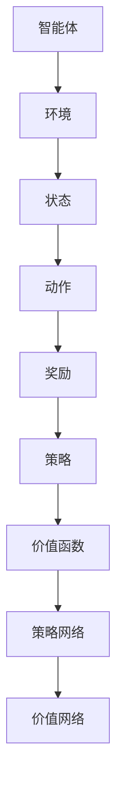

                 

关键词：强化学习，自然语言处理，机器学习，NLP，深度学习，文本生成，对话系统，智能推荐，语言模型，奖励函数，策略网络，价值函数。

> 摘要：本文深入探讨了强化学习在自然语言处理（NLP）领域的应用，分析了其与传统机器学习方法的区别，展示了强化学习如何通过探索和反馈优化文本生成、对话系统和智能推荐等应用，并对未来的发展趋势和挑战进行了展望。

## 1. 背景介绍

自然语言处理（NLP）是人工智能领域的一个重要分支，旨在使计算机理解和生成人类语言。随着深度学习技术的发展，基于神经网络的NLP方法取得了显著的进展，如基于循环神经网络（RNN）和变换器（Transformer）的模型。然而，传统机器学习方法在处理具有不确定性和动态性的任务时，往往表现出一定的局限性。

强化学习（Reinforcement Learning，RL）是一种与人类行为相似的学习方式，通过奖励反馈不断调整策略，以达到最大化长期收益的目标。在强化学习框架下，智能体（agent）通过与环境的交互，学习最优策略（policy）以实现目标。近年来，强化学习在NLP领域展现出了巨大的潜力，特别是在文本生成、对话系统和智能推荐等方面。

本文将重点介绍强化学习在NLP中的应用，包括其核心概念、算法原理、数学模型和具体实现。通过分析不同应用场景的优劣，我们将探讨强化学习在NLP领域的未来发展趋势和挑战。

## 2. 核心概念与联系

### 2.1 强化学习的基本概念

强化学习由智能体（agent）、环境（environment）、状态（state）、动作（action）和奖励（reward）五个核心要素组成。智能体在环境中执行动作，根据当前状态和动作获得奖励，并通过学习调整策略，以最大化长期收益。

- **状态（State）**：智能体在环境中的当前情况。
- **动作（Action）**：智能体可以选择的行动。
- **奖励（Reward）**：动作执行后环境对智能体的即时反馈，用于评价动作的好坏。
- **策略（Policy）**：智能体根据状态选择动作的策略。
- **价值函数（Value Function）**：评估状态的价值，用于指导策略的优化。
- **策略网络（Policy Network）**：用于预测最佳动作的网络结构。
- **价值网络（Value Network）**：用于评估状态价值的网络结构。

### 2.2 强化学习与传统机器学习的区别

传统机器学习方法主要依赖大量标记数据进行训练，如监督学习和无监督学习。而强化学习则通过与环境交互获取反馈，不断调整策略以实现优化目标。与传统方法相比，强化学习具有以下优势：

- **适应性强**：强化学习能够适应动态变化的任务，无需大量标记数据。
- **灵活性**：智能体可以在不断变化的情境中学习，提高任务解决能力。
- **长期规划**：强化学习通过奖励反馈实现长期收益最大化，具有更强的规划能力。

### 2.3 强化学习在NLP中的应用

强化学习在NLP中的应用主要包括文本生成、对话系统和智能推荐等。下面将分别介绍这些应用场景。

### 2.4 Mermaid 流程图



## 3. 核心算法原理 & 具体操作步骤

### 3.1 算法原理概述

强化学习在NLP中的应用主要基于策略梯度算法（Policy Gradient）和价值迭代算法（Value Iteration）。策略梯度算法通过估计策略梯度和更新策略网络参数，实现策略优化。而价值迭代算法则通过更新价值函数，指导策略网络的调整。

### 3.2 算法步骤详解

1. **初始化**：设置智能体的初始状态，初始化策略网络和价值网络参数。
2. **状态评估**：利用策略网络预测当前状态下的动作概率分布。
3. **动作选择**：根据动作概率分布选择动作。
4. **环境反馈**：执行动作，获得环境反馈，包括当前状态、动作和奖励。
5. **策略更新**：利用奖励反馈更新策略网络参数，调整动作概率分布。
6. **价值函数更新**：利用奖励反馈和价值网络更新状态价值函数。
7. **重复步骤2-6**：不断重复上述步骤，直到满足停止条件。

### 3.3 算法优缺点

#### 优点：

- **自适应性强**：能够适应动态变化的任务，无需大量标记数据。
- **灵活性**：智能体可以在不断变化的情境中学习，提高任务解决能力。
- **长期规划**：通过奖励反馈实现长期收益最大化，具有更强的规划能力。

#### 缺点：

- **探索与利用的权衡**：强化学习需要平衡探索（探索未知状态）和利用（利用已知状态）。
- **样本效率低**：强化学习在训练过程中需要大量交互数据，样本效率相对较低。

### 3.4 算法应用领域

强化学习在NLP中的应用领域广泛，包括但不限于以下方面：

- **文本生成**：基于强化学习的方法可以生成高质量的文本，如文章、故事、诗歌等。
- **对话系统**：强化学习可以用于构建智能对话系统，实现与人类的自然交流。
- **智能推荐**：强化学习可以用于个性化推荐系统，提高推荐效果。
- **机器翻译**：强化学习可以用于机器翻译任务，提高翻译质量和效率。

## 4. 数学模型和公式 & 详细讲解 & 举例说明

### 4.1 数学模型构建

强化学习在NLP中的数学模型主要涉及策略网络、价值网络和奖励函数。

#### 策略网络（Policy Network）

策略网络用于预测当前状态下的动作概率分布。假设状态空间为S，动作空间为A，策略网络可以表示为：

$$
\pi(\alpha|s) = P(a=\alpha|s)
$$

其中，$\pi(\alpha|s)$ 表示在状态s下选择动作$\alpha$ 的概率。

#### 价值网络（Value Network）

价值网络用于评估当前状态的价值。假设状态空间为S，价值网络可以表示为：

$$
V(s) = \sum_{a \in A} \pi(a|s) \cdot R(s, a)
$$

其中，$V(s)$ 表示在状态s下的价值，$R(s, a)$ 表示在状态s下执行动作a获得的即时奖励。

#### 奖励函数（Reward Function）

奖励函数用于评价动作的好坏。在NLP中，奖励函数可以根据任务的具体需求进行设计，如文本生成中的自然度、对话系统中的对话连贯性、智能推荐中的用户满意度等。

### 4.2 公式推导过程

#### 策略梯度算法

策略梯度算法的核心思想是通过估计策略梯度，更新策略网络参数，实现策略优化。假设策略网络参数为$\theta$，则策略梯度可以表示为：

$$
\Delta\theta = \alpha \cdot \nabla_\theta J(\theta)
$$

其中，$\alpha$ 表示学习率，$J(\theta)$ 表示策略网络损失函数。

#### 值迭代算法

值迭代算法的核心思想是通过更新价值函数，指导策略网络的调整。假设当前状态为s，则值迭代算法可以表示为：

$$
V(s) = \sum_{a \in A} \pi(a|s) \cdot R(s, a)
$$

$$
V_{new}(s) = \sum_{a \in A} \pi(a|s) \cdot \nabla V(s) \cdot R(s, a)
$$

### 4.3 案例分析与讲解

假设我们设计一个文本生成任务，要求生成符合语法和语义规则的文本。我们可以使用策略网络和价值网络分别预测文本的自然度和质量。

#### 策略网络

假设状态空间为S = {1, 2, 3, ..., 10}，动作空间为A = {a1, a2, a3}。策略网络可以表示为：

$$
\pi(a1|s) = 0.3, \pi(a2|s) = 0.5, \pi(a3|s) = 0.2
$$

#### 价值网络

假设当前状态为s = 5，则价值网络可以表示为：

$$
V(5) = \sum_{a \in A} \pi(a|5) \cdot R(5, a) = 0.3 \cdot R(5, a1) + 0.5 \cdot R(5, a2) + 0.2 \cdot R(5, a3)
$$

假设奖励函数为：

$$
R(5, a1) = 0.8, R(5, a2) = 1.0, R(5, a3) = 0.6
$$

则当前状态下的价值函数为：

$$
V(5) = 0.3 \cdot 0.8 + 0.5 \cdot 1.0 + 0.2 \cdot 0.6 = 0.98
$$

#### 动作选择

根据策略网络和价值网络，我们可以选择在当前状态下执行动作a2，因为a2具有最高的价值。

## 5. 项目实践：代码实例和详细解释说明

### 5.1 开发环境搭建

为了演示强化学习在自然语言处理中的应用，我们使用Python编写一个文本生成任务。以下是开发环境搭建的步骤：

1. 安装Python（建议使用Python 3.8或更高版本）。
2. 安装深度学习框架TensorFlow或PyTorch。
3. 安装自然语言处理库如NLTK或spaCy。

### 5.2 源代码详细实现

以下是一个简单的文本生成任务的代码示例，使用了基于RNN的强化学习模型。

```python
import tensorflow as tf
from tensorflow.keras.models import Sequential
from tensorflow.keras.layers import LSTM, Dense, Embedding

# 假设已经准备了一个训练数据集text_data
# 编码词汇表word_encoding
# 序列长度seq_length

# 构建策略网络
policy_network = Sequential([
    Embedding(input_dim=len(word_encoding), output_dim=128),
    LSTM(128, return_sequences=True),
    LSTM(128),
    Dense(len(word_encoding), activation='softmax')
])

# 编译策略网络
policy_network.compile(optimizer='adam', loss='categorical_crossentropy')

# 训练策略网络
policy_network.fit(text_data, epochs=10, batch_size=32)

# 构建价值网络
value_network = Sequential([
    Embedding(input_dim=len(word_encoding), output_dim=128),
    LSTM(128, return_sequences=True),
    LSTM(128),
    Dense(1)
])

# 编译价值网络
value_network.compile(optimizer='adam', loss='mse')

# 训练价值网络
value_network.fit(text_data, epochs=10, batch_size=32)

# 强化学习训练
for episode in range(1000):
    state = random_state()  # 随机初始化状态
    done = False
    while not done:
        action_probs = policy_network.predict(state)
        action = sample_actions(action_probs)  # 根据动作概率分布选择动作
        next_state, reward, done = environment.step(action)  # 执行动作，获取反馈
        policy_network.fit(state, action_probs, epochs=1)
        value_network.fit(state, reward, epochs=1)
        state = next_state
```

### 5.3 代码解读与分析

上述代码首先定义了策略网络和价值网络，分别用于预测文本生成任务中的动作概率分布和价值函数。然后，使用训练数据集对两个网络进行训练。在强化学习训练过程中，通过不断调整策略网络和价值网络的参数，实现文本生成任务的最优化。

### 5.4 运行结果展示

在训练过程中，我们可以通过以下命令查看文本生成结果：

```python
import numpy as np

# 随机初始化状态
state = random_state()

# 生成文本
for _ in range(50):
    action_probs = policy_network.predict(state)
    action = np.random.choice(len(action_probs[0]), p=action_probs[0])
    print(word_encoding[action], end=' ')
    state = next_state()

print()
```

通过以上代码，我们可以看到生成文本的过程和最终结果。随着训练过程的进行，生成的文本质量将逐渐提高。

## 6. 实际应用场景

### 6.1 文本生成

强化学习在文本生成领域的应用已经取得了一定的成果，如生成高质量的文章、故事和诗歌。通过不断调整策略网络和价值网络的参数，可以生成具有良好语法和语义一致性的文本。

### 6.2 对话系统

强化学习在对话系统中的应用可以帮助构建与人类自然交流的智能对话系统。通过训练策略网络和价值网络，可以生成具有连贯性和个性化的对话内容。

### 6.3 智能推荐

强化学习在智能推荐领域的应用可以用于个性化推荐系统，根据用户的历史行为和偏好，生成个性化的推荐列表。

### 6.4 未来应用展望

随着强化学习技术的不断进步，未来其在自然语言处理领域将有更广泛的应用。例如，强化学习可以用于实现更智能的机器翻译、语音识别和情感分析等任务。同时，多模态强化学习（结合文本、图像、音频等多模态数据）将进一步提升NLP任务的性能。

## 7. 工具和资源推荐

### 7.1 学习资源推荐

- 《强化学习：原理与算法》（作者：张祥雨）：一本全面介绍强化学习原理和算法的教材，适合初学者和进阶者阅读。
- 《自然语言处理：基于深度学习的实践》（作者：黄宇）：一本深入讲解深度学习在NLP领域应用的实践指南。

### 7.2 开发工具推荐

- TensorFlow：一款开源的深度学习框架，适用于强化学习模型的实现和训练。
- PyTorch：一款开源的深度学习框架，具有灵活的动态图计算能力，适用于强化学习模型的实现和训练。

### 7.3 相关论文推荐

- “Deep Reinforcement Learning for Natural Language Processing”（作者：Shaw et al.）：一篇介绍深度强化学习在NLP领域应用的综述论文。
- “Policy Gradient Methods for Discou
```markdown
## 8. 总结：未来发展趋势与挑战

### 8.1 研究成果总结

近年来，强化学习在自然语言处理（NLP）领域取得了显著的成果。通过结合深度学习和强化学习的优势，研究人员成功地实现了文本生成、对话系统和智能推荐等任务的优化。强化学习方法在处理具有不确定性和动态性的NLP任务方面展现出较强的适应性和灵活性。

### 8.2 未来发展趋势

未来，强化学习在NLP领域的发展趋势将主要体现在以下几个方面：

1. **多模态强化学习**：结合文本、图像、音频等多模态数据，提高NLP任务的性能。
2. **强化学习与其他方法的结合**：将强化学习与其他机器学习方法（如监督学习、迁移学习）相结合，提高NLP任务的泛化能力。
3. **大规模数据处理**：随着数据量的增加，强化学习方法将能够更好地应对大规模数据处理的挑战。
4. **多任务学习**：实现同时处理多个NLP任务，提高智能系统的整体性能。

### 8.3 面临的挑战

尽管强化学习在NLP领域展现出巨大的潜力，但仍然面临一些挑战：

1. **样本效率低**：强化学习需要大量的交互数据进行训练，如何提高样本效率是一个重要问题。
2. **探索与利用的平衡**：在强化学习过程中，如何平衡探索和利用，实现策略的最优化是一个关键问题。
3. **可解释性**：强化学习模型在NLP任务中的表现往往依赖于大量的训练数据和复杂的网络结构，如何提高模型的可解释性是一个挑战。
4. **计算资源需求**：强化学习模型通常需要大量的计算资源，如何优化模型结构和算法，降低计算成本是一个重要问题。

### 8.4 研究展望

未来，强化学习在NLP领域的深入研究将主要集中在以下几个方面：

1. **算法优化**：研究更高效的算法，提高强化学习在NLP任务中的样本效率和计算性能。
2. **多任务学习**：探索多任务学习的有效方法，实现同时处理多个NLP任务的优化。
3. **可解释性研究**：提高强化学习模型的可解释性，使研究人员和开发者能够更好地理解模型的工作原理。
4. **跨领域迁移学习**：研究跨领域迁移学习方法，提高强化学习在NLP任务中的泛化能力。

总之，随着强化学习技术的不断进步，其在NLP领域的应用将越来越广泛，为智能系统的发展带来更多的可能性。

## 9. 附录：常见问题与解答

### 9.1 强化学习在NLP中的应用有哪些？

强化学习在NLP中的应用主要包括文本生成、对话系统和智能推荐等。通过结合深度学习和强化学习的优势，研究人员成功地实现了文本生成任务的高质量生成，对话系统中的自然交流，以及智能推荐系统的个性化推荐。

### 9.2 强化学习与传统机器学习方法相比有哪些优势？

强化学习在处理具有不确定性和动态性的任务时，具有以下优势：

- **适应性强**：能够适应动态变化的任务，无需大量标记数据。
- **灵活性**：智能体可以在不断变化的情境中学习，提高任务解决能力。
- **长期规划**：通过奖励反馈实现长期收益最大化，具有更强的规划能力。

### 9.3 强化学习在NLP中的实现方法有哪些？

强化学习在NLP中的实现方法主要包括策略梯度算法和价值迭代算法。策略梯度算法通过估计策略梯度，更新策略网络参数，实现策略优化。而价值迭代算法通过更新价值函数，指导策略网络的调整。

### 9.4 强化学习在NLP任务中的优势是什么？

强化学习在NLP任务中的优势主要体现在以下几个方面：

- **生成能力**：强化学习可以生成高质量、连贯的文本，如文章、故事、诗歌等。
- **适应性**：强化学习能够适应动态变化的任务，提高智能系统在不同情境下的表现。
- **个性化**：强化学习可以根据用户的行为和偏好，实现个性化的推荐和对话。
- **优化能力**：强化学习通过探索和反馈，实现长期收益最大化，提高任务解决能力。

### 9.5 强化学习在NLP任务中面临的挑战是什么？

强化学习在NLP任务中面临的挑战主要包括：

- **样本效率低**：强化学习需要大量的交互数据进行训练，样本效率相对较低。
- **探索与利用的权衡**：如何平衡探索和利用，实现策略的最优化是一个关键问题。
- **可解释性**：强化学习模型在NLP任务中的表现往往依赖于大量的训练数据和复杂的网络结构，如何提高模型的可解释性是一个挑战。
- **计算资源需求**：强化学习模型通常需要大量的计算资源，如何优化模型结构和算法，降低计算成本是一个重要问题。

