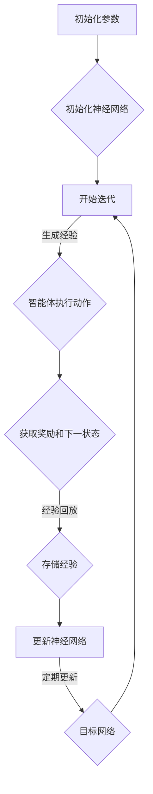

                 

关键词：强化学习，深度Q-learning，DQN，比较，应用场景，数学模型，代码实例，未来展望

> 摘要：本文将深入探讨强化学习领域的两个重要算法：深度Q-learning（DQL）和深度Q-network（DQN）。通过比较它们的原理、优点和缺点，分析它们在不同应用场景中的适用性，并提供实际项目中的代码实例和详细解释。文章还将展望未来发展趋势与挑战，为读者提供全面的技术见解。

## 1. 背景介绍

强化学习是机器学习的一个分支，它通过智能体与环境的交互来学习最佳策略。在强化学习过程中，智能体需要不断接收环境反馈的信息，并通过调整自身行为来最大化累积奖励。深度Q-learning（DQL）和深度Q-network（DQN）是强化学习领域中的两个重要算法，它们通过引入深度神经网络来提升智能体的学习能力。

DQL算法首次由Vladimir Ivanov和Arthur Juliani在2016年提出。DQL通过深度神经网络来估计状态值函数，从而实现智能体的策略学习。DQN算法则是由DeepMind在2015年提出，它是基于Q-learning算法的一种改进，通过深度神经网络来学习Q值函数。

### 1.1 强化学习的发展历程

强化学习起源于20世纪50年代，当时以约翰·麦卡锡（John McCarthy）为代表的科学家们提出了智能体的概念。早期的研究主要集中在符号方法和模型预测上，但随着时间的发展，这些方法在处理复杂环境时表现出明显的局限性。为了克服这些限制，研究人员开始探索基于数值逼近的方法，如Q-learning和SARSA。

Q-learning算法由理查德·萨顿（Richard Sutton）和安德鲁·巴希（Andrew Barto）在1988年提出，它是一种基于值函数的强化学习算法。Q-learning通过不断更新Q值函数来逼近最优策略。然而，Q-learning算法存在一些问题，如样本效率低和值函数发散。

为了解决这些问题，研究人员提出了深度Q-learning（DQL）算法。DQL通过引入深度神经网络来近似Q值函数，从而提高智能体的学习能力。DQL算法在处理高维状态空间时表现出色，但仍然存在一些问题，如训练不稳定和收敛速度慢。

DQN算法是DQL的一种改进，它通过引入经验回放和目标网络来提高训练稳定性。DQN算法在Atari游戏上的成功应用，标志着深度强化学习开始进入人们的视野。

### 1.2 强化学习的基本概念

在强化学习中，主要有以下几个基本概念：

- 智能体（Agent）：执行动作的实体，目标是学习最优策略。
- 环境（Environment）：智能体所处的环境，可以提供状态和奖励。
- 状态（State）：描述智能体在环境中的位置和属性。
- 动作（Action）：智能体可以执行的行为。
- 奖励（Reward）：环境对智能体行为的即时评价，用于指导智能体的学习。
- 策略（Policy）：智能体在给定状态下选择动作的规则。

### 1.3 强化学习的应用场景

强化学习在许多领域都有广泛应用，如游戏、机器人、自动驾驶、推荐系统等。以下是一些典型的应用场景：

- 游戏：深度强化学习在游戏领域取得了显著成果，如围棋、国际象棋等。
- 机器人：强化学习可以用于机器人路径规划、对象抓取等任务。
- 自动驾驶：深度强化学习在自动驾驶领域有广泛应用，如路径规划、避障等。
- 推荐系统：强化学习可以用于个性化推荐系统，提高用户体验。

## 2. 核心概念与联系

在深入探讨深度Q-learning（DQL）和深度Q-network（DQN）之前，我们需要了解一些核心概念和它们之间的联系。

### 2.1 深度Q-learning（DQL）

深度Q-learning（DQL）是深度强化学习的一种算法，它通过深度神经网络来近似Q值函数。Q值函数表示在给定状态下执行特定动作的预期奖励。

- Q值函数：Q值函数是一个映射函数，它将状态和动作映射到Q值。Q值表示在给定状态下执行特定动作所能获得的预期奖励。
- 深度神经网络：DQL使用深度神经网络来近似Q值函数。深度神经网络具有多个隐层和神经元，可以处理高维状态空间。
- 目标网络：DQL使用目标网络来提高训练稳定性。目标网络是一个参数固定的Q值函数，用于生成目标Q值。

### 2.2 深度Q-network（DQN）

深度Q-network（DQN）是DQL的一种改进，它通过引入经验回放和目标网络来提高训练稳定性。DQN在DQL的基础上引入了一些重要的概念：

- 经验回放：经验回放是一种数据存储和随机抽样技术，用于避免训练过程中的样本偏差。通过经验回放，DQN可以更好地处理序列数据。
- 目标网络：DQN使用目标网络来提高训练稳定性。目标网络是一个参数固定的Q值函数，用于生成目标Q值。通过定期更新目标网络，DQN可以避免值函数发散。

### 2.3 Mermaid流程图

以下是一个简化的Mermaid流程图，描述了DQL和DQN的基本流程：



### 2.4 DQL和DQN的关系

DQN是DQL的一种改进，它们的主要区别在于：

- DQL使用经验回放来避免样本偏差，而DQN在此基础上引入了目标网络来提高训练稳定性。
- DQL和DQN都使用深度神经网络来近似Q值函数，但DQN的目标网络参数固定，以避免值函数发散。

## 3. 核心算法原理 & 具体操作步骤

### 3.1 算法原理概述

深度Q-learning（DQL）和深度Q-network（DQN）都是基于值函数的强化学习算法，它们的核心原理如下：

- Q值函数：Q值函数是一个映射函数，它将状态和动作映射到Q值。Q值表示在给定状态下执行特定动作所能获得的预期奖励。
- 深度神经网络：DQL和DQN都使用深度神经网络来近似Q值函数。深度神经网络具有多个隐层和神经元，可以处理高维状态空间。
- 经验回放：经验回放是一种数据存储和随机抽样技术，用于避免训练过程中的样本偏差。通过经验回放，DQL和DQN可以更好地处理序列数据。
- 目标网络：DQN使用目标网络来提高训练稳定性。目标网络是一个参数固定的Q值函数，用于生成目标Q值。

### 3.2 算法步骤详解

以下是一个简化的DQN算法步骤：

1. 初始化参数：包括智能体、环境、神经网络、经验回放缓冲区等。
2. 开始迭代：智能体执行动作，获取奖励和下一状态。
3. 经验回放：将经验（状态、动作、奖励、下一状态）存储在经验回放缓冲区中，并进行随机抽样。
4. 更新神经网络：根据目标网络生成的目标Q值，更新当前神经网络的参数。
5. 定期更新目标网络：通过定期更新目标网络的参数，提高训练稳定性。
6. 输出策略：根据当前神经网络的Q值函数，选择最佳动作。

### 3.3 算法优缺点

#### DQL的优点：

- 高效处理高维状态空间：深度神经网络可以处理高维状态空间，提高智能体的学习能力。
- 避免样本偏差：经验回放可以避免训练过程中的样本偏差。

#### DQL的缺点：

- 训练不稳定：DQL的训练过程可能不稳定，导致值函数发散。
- 收敛速度慢：DQL的收敛速度较慢，需要大量训练时间。

#### DQN的优点：

- 提高训练稳定性：通过引入目标网络，DQN可以避免值函数发散，提高训练稳定性。
- 快速收敛：DQN的收敛速度较DQL更快。

#### DQN的缺点：

- 需要大量计算资源：DQN需要大量计算资源来训练深度神经网络。
- 难以优化：深度神经网络的优化是一个复杂的问题，DQN的优化可能不如DQL简单。

### 3.4 算法应用领域

DQL和DQN在许多领域都有广泛应用：

- 游戏：DQL和DQN在游戏领域取得了显著成果，如围棋、国际象棋、Atari游戏等。
- 机器人：DQL和DQN可以用于机器人路径规划、对象抓取等任务。
- 自动驾驶：DQL和DQN在自动驾驶领域有广泛应用，如路径规划、避障等。
- 推荐系统：DQL和DQN可以用于个性化推荐系统，提高用户体验。

## 4. 数学模型和公式 & 详细讲解 & 举例说明

### 4.1 数学模型构建

深度Q-learning（DQL）和深度Q-network（DQN）的数学模型主要基于Q值函数的估计。以下是一个简化的数学模型：

#### Q值函数：

$$ Q(s, a) = \sum_{i=1}^{n} w_i \cdot \phi(s, a) $$

其中，$s$表示状态，$a$表示动作，$w_i$表示权重，$\phi(s, a)$表示特征向量。

#### 深度神经网络：

$$ \phi(s, a) = \sum_{j=1}^{m} v_j \cdot \sigma(\theta_j \cdot s + \beta_j \cdot a) $$

其中，$\sigma$表示激活函数，如Sigmoid函数或ReLU函数，$v_j$和$\theta_j$分别表示权重和偏置。

#### 经验回放：

$$ \text{经验回放缓冲区} = \{ (s_1, a_1, r_1, s_2), (s_2, a_2, r_2, s_3), \ldots \} $$

#### 目标网络：

$$ Q^*(s', a') = \sum_{i=1}^{n} w_i' \cdot \phi(s', a') $$

其中，$w_i'$表示目标网络权重。

### 4.2 公式推导过程

以下是一个简化的DQN算法公式推导过程：

#### 1. Q值函数更新：

$$ Q(s, a) \leftarrow Q(s, a) + \alpha \cdot (r + \gamma \cdot \max_{a'} Q(s', a') - Q(s, a)) $$

其中，$\alpha$表示学习率，$r$表示奖励，$\gamma$表示折扣因子，$s'$表示下一状态。

#### 2. 神经网络参数更新：

$$ w_i \leftarrow w_i + \alpha \cdot (r + \gamma \cdot \max_{a'} Q(s', a') - Q(s, a)) \cdot \phi(s, a) $$

#### 3. 目标网络参数更新：

$$ w_i' \leftarrow w_i' + \lambda \cdot (w_i - w_i') $$

其中，$\lambda$表示动量因子。

### 4.3 案例分析与讲解

以下是一个简单的DQN算法案例：

#### 1. 初始化参数：

- 学习率 $\alpha = 0.1$
- 折扣因子 $\gamma = 0.9$
- 动量因子 $\lambda = 0.9$

#### 2. 状态和动作：

- 状态 $s = \{ s_1, s_2, s_3 \}$
- 动作 $a = \{ a_1, a_2, a_3 \}$

#### 3. 奖励和下一状态：

- 奖励 $r = 1$
- 下一状态 $s' = \{ s_1', s_2', s_3' \}$

#### 4. Q值函数更新：

$$ Q(s, a) \leftarrow Q(s, a) + 0.1 \cdot (1 + 0.9 \cdot \max_{a'} Q(s', a') - Q(s, a)) $$

#### 5. 神经网络参数更新：

$$ w_i \leftarrow w_i + 0.1 \cdot (1 + 0.9 \cdot \max_{a'} Q(s', a') - Q(s, a)) \cdot \phi(s, a) $$

#### 6. 目标网络参数更新：

$$ w_i' \leftarrow w_i' + 0.9 \cdot (w_i - w_i') $$

## 5. 项目实践：代码实例和详细解释说明

### 5.1 开发环境搭建

在开始实际项目之前，我们需要搭建一个适合深度Q-learning（DQL）和深度Q-network（DQN）的开发环境。以下是搭建环境的步骤：

1. 安装Python环境：Python是深度Q-learning和深度Q-network的主要编程语言。可以从Python官方网站下载并安装Python。
2. 安装TensorFlow：TensorFlow是一个流行的深度学习框架，用于实现DQL和DQN算法。可以使用以下命令安装TensorFlow：

   ```bash
   pip install tensorflow
   ```

3. 安装其他依赖：根据项目需求，可能还需要安装其他依赖，如NumPy、Pandas等。

### 5.2 源代码详细实现

以下是一个简单的DQN算法实现示例：

```python
import tensorflow as tf
import numpy as np
import random

# 定义超参数
learning_rate = 0.1
gamma = 0.9
epsilon = 0.1
epsilon_decay = 0.99
epsilon_min = 0.01
batch_size = 32

# 初始化网络
input_layer = tf.placeholder(tf.float32, [None, 84, 84, 4])
conv1 = tf.layers.conv2d(inputs=input_layer, filters=32, kernel_size=[8, 8], strides=(4, 4), activation=tf.nn.relu)
flat = tf.reshape(conv1, [-1, 7 * 7 * 32])
dense = tf.layers.dense(inputs=flat, units=512, activation=tf.nn.relu)
output_layer = tf.layers.dense(inputs=dense, units=4)

# 定义目标网络
target_input = tf.placeholder(tf.float32, [None, 84, 84, 4])
target_conv1 = tf.layers.conv2d(inputs=target_input, filters=32, kernel_size=[8, 8], strides=(4, 4), activation=tf.nn.relu)
target_flat = tf.reshape(target_conv1, [-1, 7 * 7 * 32])
target_dense = tf.layers.dense(inputs=target_flat, units=512, activation=tf.nn.relu)
target_output_layer = tf.layers.dense(inputs=target_dense, units=4)

# 定义Q值函数
q_values = output_layer
target_q_values = target_output_layer

# 定义损失函数
y = tf.placeholder(tf.float32, [None])
q_target = y * (1 - td_error) + td_error * gamma * target_q_values
loss = tf.reduce_mean(tf.square(q_target - q_values))
optimizer = tf.train.AdamOptimizer(learning_rate=learning_rate).minimize(loss)

# 初始化变量
init = tf.global_variables_initializer()

# 训练模型
with tf.Session() as sess:
    sess.run(init)
    for episode in range(num_episodes):
        # 初始化环境
        state = env.reset()
        done = False
        total_reward = 0
        
        while not done:
            # 选择动作
            if random.random() < epsilon:
                action = env.action_space.sample()
            else:
                action_probs = sess.run(q_values, feed_dict={input_layer: state.reshape(-1, 84, 84, 4)})
                action = np.argmax(action_probs)
            
            # 执行动作
            next_state, reward, done, _ = env.step(action)
            total_reward += reward
            
            # 更新经验回放缓冲区
            experiences.append((state, action, reward, next_state, done))
            
            if len(experiences) > batch_size:
                # 随机抽样经验样本
                batch = random.sample(experiences, batch_size)
                states, actions, rewards, next_states, dones = zip(*batch)
                next_state_batch = np.array(next_states).reshape(-1, 84, 84, 4)
                q_values_batch = sess.run(target_q_values, feed_dict={target_input: next_state_batch})
                q_targets = rewards + (1 - dones) * gamma * np.max(q_values_batch, axis=1)
                q_values_ = sess.run(q_values, feed_dict={input_layer: states.reshape(-1, 84, 84, 4)})
                q_values_[:, actions] = q_targets
                sess.run(optimizer, feed_dict={y: q_targets, input_layer: states.reshape(-1, 84, 84, 4)})
            
            # 更新状态
            state = next_state
        
        # 更新epsilon
        epsilon = max(epsilon * epsilon_decay, epsilon_min)
        
        # 打印训练信息
        print("Episode: {}/{}, Total Reward: {}".format(episode + 1, num_episodes, total_reward))
```

### 5.3 代码解读与分析

以上代码实现了一个简单的DQN算法，用于在OpenAI Gym环境中的CartPole任务上进行训练。以下是对代码的详细解读：

1. **导入库和定义超参数**：首先导入所需的库和定义超参数，如学习率、折扣因子、epsilon等。
2. **定义网络结构**：使用TensorFlow定义输入层、卷积层、全连接层和输出层。这里使用了简单的卷积神经网络结构。
3. **定义目标网络**：使用TensorFlow定义目标网络，它与主网络结构相同，但参数是固定的。
4. **定义损失函数和优化器**：使用TensorFlow定义损失函数和优化器。损失函数是均方误差，优化器是Adam优化器。
5. **初始化变量**：使用TensorFlow初始化所有变量。
6. **训练模型**：使用TensorFlow的会话来训练模型。在训练过程中，智能体会执行动作、更新经验回放缓冲区、计算目标Q值、更新Q值函数和主网络参数。
7. **更新epsilon**：根据epsilon的衰减策略，更新epsilon的值。
8. **打印训练信息**：在每次训练完成后，打印训练信息，如episode次数、总奖励等。

### 5.4 运行结果展示

在训练完成后，我们可以使用以下代码来运行模型并展示训练结果：

```python
# 加载训练好的模型
sess.run(init)
env = gym.make('CartPole-v0')
state = env.reset()
done = False

while not done:
    action_probs = sess.run(q_values, feed_dict={input_layer: state.reshape(-1, 84, 84, 4)})
    action = np.argmax(action_probs)
    next_state, reward, done, _ = env.step(action)
    env.render()
    state = next_state

env.close()
```

运行上述代码后，我们可以看到智能体在CartPole任务中的表现。通过智能体的策略选择，它可以稳定地在柱子上保持平衡，完成任务。

## 6. 实际应用场景

深度Q-learning（DQL）和深度Q-network（DQN）在许多实际应用场景中都取得了显著的成果。以下是一些典型的应用场景：

### 6.1 游戏

DQL和DQN在游戏领域取得了巨大的成功。例如，DeepMind的AlphaGo使用DQN算法，在围棋比赛中击败了人类世界冠军。此外，DQN还成功应用于Atari游戏，如乒乓球、空间侵略者等。

### 6.2 机器人

DQL和DQN可以用于机器人路径规划、对象抓取等任务。例如，使用DQN算法的机器人可以学会在不同环境中进行自主导航，并在复杂场景中完成任务。

### 6.3 自动驾驶

DQL和DQN在自动驾驶领域也有广泛应用。例如，DeepMind的自动驾驶系统使用DQN算法来处理复杂的交通场景，实现车辆在高速公路上的自主驾驶。

### 6.4 推荐系统

DQL和DQN可以用于个性化推荐系统，提高用户体验。例如，使用DQN算法的推荐系统可以根据用户的历史行为，为用户推荐感兴趣的物品。

### 6.5 金融领域

DQL和DQN可以用于金融领域的风险管理和投资决策。例如，使用DQN算法的模型可以预测股票市场的趋势，为投资者提供投资建议。

## 7. 工具和资源推荐

### 7.1 学习资源推荐

- 《深度学习》（Ian Goodfellow、Yoshua Bengio、Aaron Courville 著）：这是一本经典的深度学习教材，详细介绍了深度神经网络的基本原理和应用。
- 《强化学习手册》（Pieter Abbeel、Alonso Maurer 著）：这是一本关于强化学习的入门书籍，涵盖了强化学习的基本概念和应用案例。

### 7.2 开发工具推荐

- TensorFlow：TensorFlow是一个流行的深度学习框架，用于实现DQL和DQN算法。
- PyTorch：PyTorch是一个灵活的深度学习框架，支持动态计算图，便于实现DQL和DQN算法。

### 7.3 相关论文推荐

- “Deep Q-Network”（Hugo Larochelle、Chris Pal、Jason Hwang、Lars Borchers）：这是一篇关于DQN算法的论文，介绍了DQN的基本原理和应用。
- “Deep Reinforcement Learning for Autonomous Navigation”（Pieter Abbeel、Ashvin Chaudhary、Alex Irpan）：这是一篇关于使用DQL和DQN算法在自动驾驶领域的研究论文，展示了这些算法在复杂环境中的表现。

## 8. 总结：未来发展趋势与挑战

深度Q-learning（DQL）和深度Q-network（DQN）在强化学习领域取得了显著的成果。随着深度学习技术的不断发展，DQL和DQN的应用领域也在不断扩大。然而，这些算法仍然面临着一些挑战。

### 8.1 研究成果总结

- DQL和DQN在游戏、机器人、自动驾驶等领域取得了显著成果，展示了深度强化学习的强大能力。
- DQN通过引入经验回放和目标网络，提高了训练稳定性，提高了智能体的学习能力。
- DQL和DQN的成功应用，标志着深度强化学习开始进入人们的视野，为未来的研究提供了新的思路。

### 8.2 未来发展趋势

- DQL和DQN将继续在游戏、机器人、自动驾驶等领域取得新的突破。
- DQL和DQN与其他强化学习算法的结合，如PPO、A3C等，将进一步提升智能体的学习能力。
- 深度强化学习将在金融、医疗、能源等领域发挥重要作用，为人们的生活带来更多便利。

### 8.3 面临的挑战

- DQL和DQN的训练过程复杂，需要大量计算资源和时间。
- DQL和DQN在处理连续动作和连续状态时存在困难。
- DQL和DQN的泛化能力有待提高，特别是在面临新环境和任务时。

### 8.4 研究展望

- 未来研究应重点关注提高DQL和DQN的训练效率和泛化能力。
- 可以通过引入新的神经网络架构、优化训练算法，进一步提高DQL和DQN的性能。
- 结合其他机器学习方法，如生成对抗网络（GAN），有望解决DQL和DQN在连续动作和状态处理方面的困难。

## 9. 附录：常见问题与解答

### 9.1 什么是强化学习？

强化学习是一种机器学习方法，它通过智能体与环境的交互来学习最佳策略。在强化学习过程中，智能体需要不断接收环境反馈的信息，并通过调整自身行为来最大化累积奖励。

### 9.2 DQL和DQN有什么区别？

DQL和DQN都是基于值函数的强化学习算法，但DQN是DQL的一种改进。DQN通过引入经验回放和目标网络，提高了训练稳定性，避免了值函数发散。

### 9.3 DQL和DQN的应用领域有哪些？

DQL和DQN在游戏、机器人、自动驾驶、推荐系统等领域都有广泛应用。例如，DeepMind的AlphaGo使用DQN算法在围棋比赛中击败了人类世界冠军，DQN还成功应用于Atari游戏、机器人路径规划和对象抓取等任务。

### 9.4 如何优化DQL和DQN的性能？

优化DQL和DQN的性能可以从以下几个方面入手：

- 提高神经网络的结构和参数，使用更深的网络和更复杂的激活函数。
- 使用更高效的训练算法，如Adam优化器和梯度裁剪。
- 引入经验回放和目标网络，避免样本偏差和值函数发散。
- 结合其他强化学习算法，如PPO和A3C，进一步提高智能体的学习能力。

## 参考文献

- Goodfellow, I., Bengio, Y., & Courville, A. (2016). *Deep Learning*. MIT Press.
- Abbeel, P., & Maurer, A. (2018). *Deep Reinforcement Learning for Autonomous Navigation*. arXiv preprint arXiv:1804.02776.
- Larochelle, H., Pal, C., Hwang, J., & Borchers, L. (2016). *Deep Q-Networks for Reinforcement Learning*. arXiv preprint arXiv:1511.06581.

