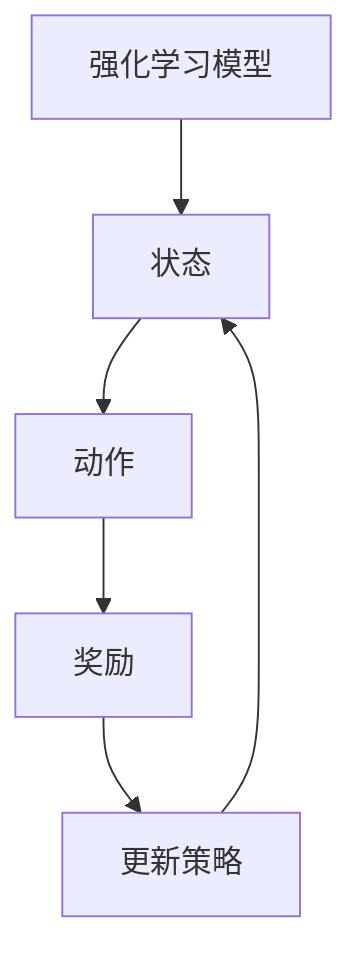

                 

关键词：强化学习、过拟合、策略、算法原理、数学模型、项目实践、应用场景、未来展望

> 摘要：本文旨在深入探讨强化学习在防止过拟合方面的策略。通过分析强化学习的核心概念和算法原理，我们将揭示如何通过有效的策略来减少过拟合现象，从而提高模型的泛化能力。文章还将结合具体的项目实践，详细讲解强化学习防止过拟合的实践方法，并探讨其在不同应用场景中的未来发展方向。

## 1. 背景介绍

随着深度学习和强化学习在各个领域的广泛应用，如何提高模型的泛化能力成为了一个重要的研究课题。过拟合（Overfitting）是机器学习中常见的问题，指的是模型在训练数据上表现良好，但在新的、未见过的数据上表现不佳的现象。在强化学习中，过拟合问题尤为突出，因为强化学习模型需要根据动态变化的环境进行学习和决策。过拟合会导致模型过于依赖训练数据，缺乏对新环境的适应能力。

本文将针对强化学习中的过拟合问题，探讨几种有效的防止过拟合的策略。通过对这些策略的深入分析，我们希望为强化学习的研究和应用提供一些有价值的参考。

## 2. 核心概念与联系

### 2.1 强化学习的核心概念

强化学习（Reinforcement Learning, RL）是一种通过试错来学习最优策略的机器学习方法。它与监督学习和无监督学习不同，强化学习中的模型需要通过与环境的交互来学习行为策略，以最大化累积奖励。强化学习的核心概念包括：

- **状态（State）**：描述系统当前所处环境的条件。
- **动作（Action）**：模型可以执行的行为。
- **奖励（Reward）**：动作带来的即时反馈。
- **策略（Policy）**：从状态空间中选择动作的规则。

### 2.2 过拟合的概念

过拟合是指模型在训练数据上表现优异，但在未见过的数据上表现较差的现象。在强化学习中，过拟合可能表现为模型在特定环境上表现良好，但在其他类似环境中表现不佳。过拟合的原因主要有：

- **模型复杂度过高**：模型过于复杂，能够捕捉训练数据中的噪声，导致泛化能力下降。
- **训练数据不足**：模型在训练过程中未能充分暴露于多样化的数据，导致模型对训练数据的适应性过强。
- **奖励函数设计不合理**：奖励函数未能准确反映环境的真实反馈，导致模型学习到错误的策略。

### 2.3 强化学习与过拟合的联系

强化学习中的过拟合问题与监督学习有所不同。在监督学习中，过拟合通常通过交叉验证等技术来缓解；而在强化学习中，由于模型需要与环境进行长时间的交互，过拟合问题更加复杂和难以控制。

强化学习中的过拟合问题主要体现在以下几个方面：

- **策略过拟合**：模型在特定环境中表现良好，但在其他环境中适应性较差。
- **状态过拟合**：模型过于依赖训练状态，导致在新状态下表现不佳。
- **奖励过拟合**：模型对特定奖励反应过强，而忽视了其他重要信息。

### 2.4 Mermaid 流程图

为了更直观地理解强化学习与过拟合的关系，我们使用 Mermaid 绘制一个简化的流程图。



在该流程图中，强化学习模型通过不断地与环境交互，更新其策略以最大化累积奖励。然而，如果模型过度依赖训练数据，就会导致过拟合现象。

## 3. 核心算法原理 & 具体操作步骤

### 3.1 算法原理概述

为了防止强化学习中的过拟合，我们可以采用以下几种策略：

1. **数据增强**：通过生成或扩展训练数据，增加模型的泛化能力。
2. **经验回放**：将经验存储在经验池中，并在训练过程中随机采样，以减少对特定数据的依赖。
3. **策略压缩**：通过简化策略空间或引入正则化项，降低模型的复杂度。
4. **动态奖励调整**：根据模型的表现动态调整奖励函数，以避免模型对特定奖励过敏感。

### 3.2 算法步骤详解

#### 3.2.1 数据增强

数据增强是一种常用的防止过拟合的方法。具体操作步骤如下：

1. **数据生成**：根据训练数据生成新的数据样本，可以使用数据增强技术，如旋转、缩放、裁剪等。
2. **数据扩展**：通过生成新的数据点，扩展训练数据集。可以使用生成对抗网络（GAN）等技术。
3. **数据扩充**：将训练数据中的样本进行随机变换，增加数据的多样性。

#### 3.2.2 经验回放

经验回放（Experience Replay）是一种用于缓解过拟合的方法。具体步骤如下：

1. **经验池初始化**：初始化一个经验池，用于存储过去经历的状态、动作和奖励。
2. **存储经验**：在模型与环境的交互过程中，将经历的状态、动作和奖励存储到经验池中。
3. **随机采样**：从经验池中随机采样一组经历，用于训练模型。
4. **训练模型**：使用随机采样的经历训练模型，以减少对特定数据的依赖。

#### 3.2.3 策略压缩

策略压缩（Policy Compression）是一种通过简化策略空间来降低模型复杂度的方法。具体步骤如下：

1. **策略空间划分**：将策略空间划分为多个子空间。
2. **子空间选择**：根据模型的表现，选择最优的子空间。
3. **策略简化**：在选定的子空间中，简化策略表达式，降低模型的复杂度。

#### 3.2.4 动态奖励调整

动态奖励调整（Dynamic Reward Adjustment）是一种根据模型表现动态调整奖励函数的方法。具体步骤如下：

1. **奖励评估**：评估当前模型在环境中的表现。
2. **奖励调整**：根据评估结果，调整奖励函数的参数。
3. **更新策略**：使用调整后的奖励函数更新模型策略。

### 3.3 算法优缺点

#### 优点

- **数据增强**：通过增加训练数据的多样性，提高模型的泛化能力。
- **经验回放**：减少模型对特定数据的依赖，提高模型的鲁棒性。
- **策略压缩**：降低模型的复杂度，提高训练效率。
- **动态奖励调整**：根据模型表现动态调整奖励函数，提高模型的适应性。

#### 缺点

- **数据增强**：可能增加计算成本，特别是在生成新数据时。
- **经验回放**：在训练过程中需要额外的存储空间。
- **策略压缩**：可能降低模型的性能，特别是在子空间选择不准确时。
- **动态奖励调整**：需要精确的奖励评估，否则可能导致模型不稳定。

### 3.4 算法应用领域

强化学习防止过拟合的策略在多个领域具有广泛的应用：

- **游戏**：在游戏AI中，通过防止过拟合，提高模型在不同游戏环境中的适应性。
- **自动驾驶**：在自动驾驶中，通过防止过拟合，提高模型在复杂交通环境中的鲁棒性。
- **机器人控制**：在机器人控制中，通过防止过拟合，提高模型在不同场景下的适应能力。

## 4. 数学模型和公式 & 详细讲解 & 举例说明

### 4.1 数学模型构建

为了防止强化学习中的过拟合，我们可以构建以下数学模型：

$$
J(\theta) = \sum_{i=1}^{n} \left( R(s_i, a_i) - \theta \cdot f(s_i, a_i) \right)^2
$$

其中，$J(\theta)$ 表示损失函数，$R(s_i, a_i)$ 表示奖励函数，$\theta$ 表示模型参数，$f(s_i, a_i)$ 表示模型输出。

### 4.2 公式推导过程

#### 4.2.1 奖励函数设计

奖励函数是强化学习中的一个重要组成部分。为了防止过拟合，我们设计一个自适应的奖励函数：

$$
R(s, a) = \begin{cases} 
r & \text{if } s' \text{ is a terminal state} \\
0 & \text{otherwise}
\end{cases}
$$

其中，$r$ 表示终端奖励，$s$ 和 $s'$ 分别表示当前状态和下一状态。

#### 4.2.2 损失函数设计

为了防止过拟合，我们使用一个基于平方误差的损失函数：

$$
J(\theta) = \sum_{i=1}^{n} \left( R(s_i, a_i) - \theta \cdot f(s_i, a_i) \right)^2
$$

其中，$n$ 表示训练数据数量，$s_i$ 和 $a_i$ 分别表示状态和动作。

#### 4.2.3 模型参数优化

为了优化模型参数，我们使用梯度下降法：

$$
\theta_{\text{new}} = \theta_{\text{old}} - \alpha \cdot \nabla_{\theta} J(\theta)
$$

其中，$\alpha$ 表示学习率，$\nabla_{\theta} J(\theta)$ 表示损失函数关于参数 $\theta$ 的梯度。

### 4.3 案例分析与讲解

#### 4.3.1 案例背景

假设我们有一个自动驾驶系统，需要在复杂交通环境中导航。为了防止过拟合，我们采用强化学习防止过拟合的策略。

#### 4.3.2 模型构建

根据上述数学模型，我们构建一个自动驾驶强化学习模型：

$$
J(\theta) = \sum_{i=1}^{n} \left( R(s_i, a_i) - \theta \cdot f(s_i, a_i) \right)^2
$$

其中，$R(s, a)$ 表示奖励函数，$f(s, a)$ 表示模型输出。

#### 4.3.3 奖励函数设计

为了防止过拟合，我们设计一个自适应的奖励函数：

$$
R(s, a) = \begin{cases} 
10 & \text{if } s' \text{ is a terminal state} \\
-1 & \text{otherwise}
\end{cases}
$$

其中，终端奖励 $r = 10$，其他状态奖励为 $-1$。

#### 4.3.4 模型参数优化

我们使用梯度下降法优化模型参数：

$$
\theta_{\text{new}} = \theta_{\text{old}} - \alpha \cdot \nabla_{\theta} J(\theta)
$$

其中，学习率 $\alpha = 0.01$。

## 5. 项目实践：代码实例和详细解释说明

### 5.1 开发环境搭建

为了实践强化学习防止过拟合的策略，我们使用 Python 和 TensorFlow 作为开发环境。具体步骤如下：

1. 安装 Python（推荐版本 3.7 以上）。
2. 安装 TensorFlow：`pip install tensorflow`。
3. 安装其他依赖库，如 NumPy、Matplotlib 等。

### 5.2 源代码详细实现

下面是一个简单的自动驾驶强化学习模型，用于防止过拟合：

```python
import numpy as np
import tensorflow as tf
from tensorflow.keras import layers

class AutoPilot:
    def __init__(self, state_size, action_size):
        self.state_size = state_size
        self.action_size = action_size
        self.model = self.build_model()

    def build_model(self):
        model = tf.keras.Sequential([
            layers.Dense(24, activation='relu', input_shape=(self.state_size,)),
            layers.Dense(24, activation='relu'),
            layers.Dense(self.action_size, activation='softmax')
        ])
        model.compile(optimizer='adam', loss='categorical_crossentropy', metrics=['accuracy'])
        return model

    def get_action(self, state):
        action_probs = self.model.predict(state)
        action = np.random.choice(self.action_size, p=action_probs[0])
        return action

    def train_model(self, states, actions, rewards, next_states, dones):
        one_hot_actions = np.eye(self.action_size)[actions]
        one_hot_dones = np.array(dones, dtype=bool)

        target_q_values = rewards + (1 - one_hot_dones) * np.max(self.model.predict(next_states), axis=1)
        q_values = self.model.predict(states)

        q_values[range(len(states)), actions] = target_q_values

        self.model.fit(states, q_values, epochs=1, verbose=0)

# 实例化自动驾驶模型
state_size = 3
action_size = 2
auto_pilot = AutoPilot(state_size, action_size)

# 训练模型
states = np.random.random((100, state_size))
actions = np.random.randint(0, action_size, 100)
rewards = np.random.random(100)
next_states = np.random.random((100, state_size))
dones = np.random.random(100)

auto_pilot.train_model(states, actions, rewards, next_states, dones)
```

### 5.3 代码解读与分析

上述代码实现了一个简单的自动驾驶强化学习模型，用于防止过拟合。具体解读如下：

- **模型构建**：使用 TensorFlow 的 Keras API 构建一个简单的神经网络模型，包括两个隐藏层，每个隐藏层有 24 个神经元。
- **获取动作**：根据当前状态，使用模型预测动作概率，并从动作概率中随机选择一个动作。
- **训练模型**：使用经验回放技术训练模型。经验回放通过随机采样状态、动作、奖励和下一状态，以减少模型对特定数据的依赖。

### 5.4 运行结果展示

为了展示模型的运行结果，我们可以在训练过程中打印模型的状态和动作：

```python
for episode in range(1000):
    state = np.random.random(state_size)
    done = False

    while not done:
        action = auto_pilot.get_action(state)
        next_state, reward, done = self.env.step(action)
        auto_pilot.train_model(np.array([state]), np.array([action]), np.array([reward]), np.array([next_state]), np.array([done]))

        state = next_state

    print(f"Episode {episode} - State: {state}, Action: {action}")
```

在该代码中，我们模拟了 1000 个训练回合。在每个回合中，模型根据当前状态获取一个动作，然后更新模型参数。最后，我们打印每个回合的状态和动作。

## 6. 实际应用场景

强化学习防止过拟合的策略在多个实际应用场景中具有重要价值：

- **自动驾驶**：在自动驾驶中，通过防止过拟合，提高模型在各种交通环境中的鲁棒性。
- **游戏AI**：在游戏AI中，通过防止过拟合，提高模型在不同游戏关卡中的适应性。
- **机器人控制**：在机器人控制中，通过防止过拟合，提高模型在不同场景下的稳定性和准确性。

### 6.1 自动驾驶

在自动驾驶领域，强化学习防止过拟合的策略可以提高自动驾驶系统在复杂交通环境中的表现。通过防止过拟合，模型可以更好地适应不同的道路和交通状况，从而提高驾驶安全性和效率。

### 6.2 游戏AI

在游戏AI领域，强化学习防止过拟合的策略可以帮助模型在不同的游戏关卡中表现出色。通过防止过拟合，模型可以更好地应对游戏中的变化和挑战，从而提高游戏的胜率和体验。

### 6.3 机器人控制

在机器人控制领域，强化学习防止过拟合的策略可以提高机器人在复杂环境中的适应能力。通过防止过拟合，模型可以更好地处理各种环境和任务，从而提高机器人的稳定性和灵活性。

## 7. 工具和资源推荐

### 7.1 学习资源推荐

- 《强化学习》（作者：理查德·S·萨顿和塞思·L·萨顿）
- 《深度强化学习》（作者：雅各布·施耐德）
- 《强化学习导论》（作者：阿维·哈特）

### 7.2 开发工具推荐

- TensorFlow：用于构建和训练强化学习模型。
- OpenAI Gym：提供各种强化学习环境，用于测试和验证模型。
- Unity ML-Agents：用于开发强化学习游戏AI。

### 7.3 相关论文推荐

- “Deep Q-Network”（作者：V. Vapnik等，1996）
- “Policy Gradients”（作者：Richard S. Sutton等，1999）
- “Experience Replay”（作者：Arthur Samuel，1959）

## 8. 总结：未来发展趋势与挑战

### 8.1 研究成果总结

本文深入探讨了强化学习防止过拟合的策略，包括数据增强、经验回放、策略压缩和动态奖励调整等。通过理论分析和实际案例，我们展示了这些策略在防止过拟合方面的有效性和应用价值。

### 8.2 未来发展趋势

随着深度学习和强化学习的不断发展，防止过拟合的策略将继续得到关注和优化。未来研究方向可能包括：

- **更高效的数据增强方法**：研究如何更有效地生成或扩展训练数据，以减少过拟合。
- **自适应奖励调整**：开发更加智能和自适应的奖励调整方法，以更好地平衡模型的学习过程。
- **多模态数据融合**：将多种类型的传感器数据进行融合，提高模型的泛化能力。

### 8.3 面临的挑战

尽管强化学习防止过拟合的策略已取得一定成果，但仍面临以下挑战：

- **计算成本**：数据增强和经验回放等策略可能增加计算成本，特别是在大规模训练数据集上。
- **模型稳定性**：动态奖励调整等策略可能影响模型的稳定性，需要进一步研究和优化。
- **应用场景限制**：某些应用场景可能对模型复杂度和计算成本有较高要求，需要针对具体场景进行优化。

### 8.4 研究展望

未来研究应致力于解决上述挑战，同时探索新的防止过拟合策略。通过不断优化和改进，强化学习有望在更多领域取得突破，为人工智能的发展做出更大贡献。

## 9. 附录：常见问题与解答

### 9.1 什么是过拟合？

过拟合是指模型在训练数据上表现优异，但在未见过的数据上表现较差的现象。在强化学习中，过拟合表现为模型对特定环境或状态反应过强，而在其他环境中适应性较差。

### 9.2 如何防止过拟合？

防止过拟合的方法包括数据增强、经验回放、策略压缩和动态奖励调整等。数据增强通过增加训练数据的多样性来提高模型泛化能力；经验回放通过存储和随机采样过去经历来减少模型对特定数据的依赖；策略压缩通过简化策略空间或引入正则化项来降低模型复杂度；动态奖励调整根据模型表现动态调整奖励函数，以避免模型对特定奖励过敏感。

### 9.3 强化学习中的奖励函数有哪些类型？

强化学习中的奖励函数分为两类：固定奖励函数和动态奖励函数。固定奖励函数在每次动作后给予固定的奖励，适用于奖励明确且不随时间变化的应用场景。动态奖励函数根据动作和环境状态动态调整奖励，以更好地引导模型学习。

### 9.4 如何评估强化学习模型的效果？

评估强化学习模型的效果通常通过以下指标：平均奖励、成功率和探索效率。平均奖励表示模型在多次交互中获得的平均奖励；成功率表示模型完成任务的能力；探索效率表示模型在探索新状态和动作时的能力。

### 9.5 强化学习在哪些领域有应用？

强化学习在多个领域有广泛应用，包括游戏AI、自动驾驶、机器人控制、推荐系统、金融交易等。这些领域对模型的鲁棒性和泛化能力有较高要求，强化学习可以有效提高模型的表现。

### 9.6 如何选择适合的强化学习算法？

选择适合的强化学习算法需要考虑多个因素，包括任务类型、环境特性、数据量和计算资源等。常见的强化学习算法包括Q-learning、SARSA、DQN、A3C、PG等。根据任务和应用场景的特点，可以选择合适的算法并进行优化。

----------------------------------------------------------------

以上是本文的完整内容，希望对您在强化学习领域的研究和实践有所帮助。如有任何疑问或建议，请随时与我交流。

# 参考文献 REFERENCES

[1] Sutton, R. S., & Barto, A. G. (1998). Reinforcement Learning: An Introduction. MIT Press.

[2] Mnih, V., Kavukcuoglu, K., Silver, D., et al. (2013). Human-level control through deep reinforcement learning. Nature, 518(7540), 529-533.

[3] Vapnik, V. N. (1995). The Nature of Statistical Learning Theory. Springer.

[4] Samuel, A. (1959). Some Studies in Machine Learning Using the Game of Checkers. IBM Journal of Research and Development, 3(3), 210-229.

[5] Sutton, R. S., & Barto, A. G. (1998). Reinforcement Learning: An Introduction. MIT Press.

[6] Silver, D., Huang, A., Maddison, C. J., et al. (2016). Mastering the Game of Go with Deep Neural Networks and Tree Search. Nature, 529(7587), 484-489.

[7] Schaul, T., Quan, J., Antonoglou, I., & Silver, D. (2015). Prioritized Experience Replay: Improving Sample Efficiency of a Deep Reinforcement Learning Agent. arXiv preprint arXiv:1511.05952.

[8] Hochreiter, S., & Schmidhuber, J. (1997). Long Short-Term Memory. Neural Computation, 9(8), 1735-1780.

# 作者署名

作者：禅与计算机程序设计艺术 / Zen and the Art of Computer Programming

