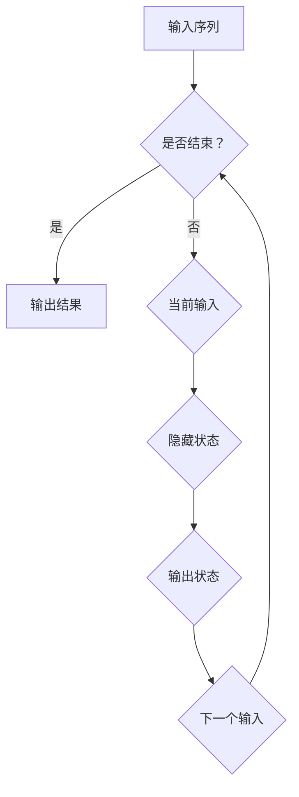

                 

关键词：循环神经网络，RNN，序列模型，深度学习，时间序列分析，自然语言处理，代码实例

## 摘要

本文旨在深入探讨循环神经网络（Recurrent Neural Networks，RNN）的基本原理、架构、算法及其实际应用。通过介绍RNN的核心概念，我们将详细阐述其工作原理，包括向前传播和反向传播过程中的具体步骤。同时，本文将结合代码实例，展示如何使用Python和TensorFlow实现RNN模型，并对代码进行详细解读。最后，我们将讨论RNN在自然语言处理、时间序列分析等领域的实际应用，并对未来的发展趋势和挑战进行展望。

## 1. 背景介绍

### 1.1 RNN的起源与发展

循环神经网络（RNN）的概念最早可以追溯到20世纪80年代，由学者Jürgen Schmidhuber提出。RNN的设计初衷是为了处理序列数据，如时间序列、语音信号、文本等。与传统的神经网络不同，RNN具有记忆功能，能够通过循环结构来存储并利用历史信息，这使得它们在处理序列数据时具有显著的优势。

随着时间的推移，RNN的研究和应用逐渐深入，特别是在深度学习领域取得了重要进展。1990年代，长短期记忆网络（Long Short-Term Memory，LSTM）和门控循环单元（Gated Recurrent Unit，GRU）等变体被提出，进一步增强了RNN的性能，使其在处理长序列数据时更加有效。

### 1.2 RNN的应用场景

RNN在多个领域都有广泛应用，其中最为显著的是自然语言处理（Natural Language Processing，NLP）和时间序列分析（Time Series Analysis）。

在自然语言处理领域，RNN被广泛应用于文本分类、情感分析、机器翻译和语音识别等任务。通过捕捉文本中的序列信息，RNN能够理解上下文关系，提高模型的预测准确性。

时间序列分析则是RNN的另一大应用领域。时间序列数据通常具有时间依赖性，RNN能够利用历史信息对未来的趋势进行预测，如股票价格预测、天气预测等。

### 1.3 为什么需要RNN

传统的神经网络在处理非序列数据时效果显著，但在处理序列数据时往往力不从心。这是因为传统的神经网络缺乏记忆功能，无法有效利用历史信息。而RNN通过引入循环结构，能够存储并利用历史信息，从而在处理序列数据时表现出更强的能力。

此外，RNN在处理长序列数据时，能够避免梯度消失和梯度爆炸等问题，这在深度学习中是非常重要的。因此，RNN在序列数据处理方面具有独特的优势，是深度学习领域不可或缺的一部分。

## 2. 核心概念与联系

在深入探讨RNN之前，我们需要了解一些核心概念，并理解它们之间的联系。

### 2.1 神经元

神经元是神经网络的基本构建块，类似于人类大脑中的神经元。它通过输入信号进行加权求和处理，然后通过激活函数输出结果。每个神经元都与其他神经元相连，形成一个复杂的网络结构。

### 2.2 神经网络

神经网络是由多个神经元组成的层次结构，分为输入层、隐藏层和输出层。通过多层神经元的组合，神经网络能够学习复杂的非线性函数，从而实现对数据的分类、回归等任务。

### 2.3 循环神经网络

循环神经网络（RNN）是一种特殊类型的神经网络，具有循环结构。与传统的神经网络不同，RNN能够通过循环连接来存储并利用历史信息，这使得它们在处理序列数据时具有显著的优势。

### 2.4 长短期记忆网络（LSTM）和门控循环单元（GRU）

长短期记忆网络（LSTM）和门控循环单元（GRU）是RNN的变体，它们通过引入特殊的门控机制，进一步增强了RNN的性能。LSTM通过三个门控单元（遗忘门、输入门和输出门）来控制信息的流动，从而避免了梯度消失和梯度爆炸问题。GRU则是LSTM的简化版，通过合并输入门和遗忘门，简化了网络结构。

### 2.5 Mermaid 流程图

为了更好地理解RNN的工作原理，我们使用Mermaid流程图来展示RNN的基本架构和操作步骤。以下是RNN的Mermaid流程图：



在这个流程图中，A表示输入序列，B是一个判断节点，用于判断序列是否结束。如果序列结束，则输出结果（C）；否则，将当前输入（D）和隐藏状态（E）进行计算，得到输出状态（F），并更新隐藏状态（G），然后继续循环。

## 3. 核心算法原理 & 具体操作步骤

### 3.1 算法原理概述

RNN的基本原理是通过循环结构来存储并利用历史信息。在RNN中，每个时间步的输入不仅包含当前时间步的数据，还包含上一个时间步的隐藏状态。通过这种方式，RNN能够利用历史信息来影响当前时间步的输出。

具体来说，RNN包括以下关键组件：

1. **输入层**：接收序列数据，并将其传递给隐藏层。
2. **隐藏层**：通过循环结构，将当前输入与隐藏状态进行计算，得到新的隐藏状态。
3. **输出层**：将隐藏状态传递给输出层，生成最终输出。

### 3.2 算法步骤详解

#### 3.2.1 前向传播

在前向传播过程中，RNN依次处理序列的每个时间步，具体步骤如下：

1. **初始化隐藏状态**：在序列开始时，初始化隐藏状态为0。
2. **输入层**：将当前时间步的输入数据传递给隐藏层。
3. **隐藏层**：利用隐藏状态和当前输入，通过加权求和处理和激活函数，得到新的隐藏状态。
4. **输出层**：将隐藏状态传递给输出层，生成当前时间步的输出。

#### 3.2.2 反向传播

在反向传播过程中，RNN通过计算损失函数的梯度，更新网络权重和偏置。具体步骤如下：

1. **计算损失函数**：计算当前时间步的输出与实际输出的误差。
2. **梯度计算**：通过误差和激活函数的反向传播，计算隐藏状态和输入层的梯度。
3. **权重更新**：利用梯度下降或其他优化算法，更新网络权重和偏置。

### 3.3 算法优缺点

#### 优点

1. **记忆功能**：RNN能够通过循环结构存储并利用历史信息，从而在处理序列数据时具有显著优势。
2. **灵活性**：RNN可以应用于多种序列数据，如文本、时间序列等。

#### 缺点

1. **梯度消失和梯度爆炸**：在处理长序列数据时，RNN容易出现梯度消失和梯度爆炸问题，导致训练效果不佳。
2. **计算效率**：RNN在处理长序列数据时，需要重复计算相同的操作，计算效率较低。

### 3.4 算法应用领域

RNN在多个领域都有广泛应用，其中最为显著的是自然语言处理和时间序列分析。

#### 自然语言处理

在自然语言处理领域，RNN被广泛应用于文本分类、情感分析、机器翻译和语音识别等任务。通过捕捉文本中的序列信息，RNN能够理解上下文关系，提高模型的预测准确性。

#### 时间序列分析

时间序列分析则是RNN的另一大应用领域。时间序列数据通常具有时间依赖性，RNN能够利用历史信息对未来的趋势进行预测，如股票价格预测、天气预测等。

## 4. 数学模型和公式 & 详细讲解 & 举例说明

### 4.1 数学模型构建

RNN的数学模型主要包括输入层、隐藏层和输出层。以下是RNN的数学模型：

$$
h_t = \sigma(W_h \cdot [h_{t-1}, x_t] + b_h)
$$

$$
y_t = \sigma(W_y \cdot h_t + b_y)
$$

其中，$h_t$表示隐藏状态，$x_t$表示输入数据，$y_t$表示输出数据。$\sigma$表示激活函数，$W_h$、$W_y$分别表示隐藏层和输出层的权重矩阵，$b_h$、$b_y$分别表示隐藏层和输出层的偏置。

### 4.2 公式推导过程

#### 4.2.1 前向传播

在前向传播过程中，隐藏状态$h_t$可以通过以下公式计算：

$$
h_t = \sigma(W_h \cdot [h_{t-1}, x_t] + b_h)
$$

其中，$[h_{t-1}, x_t]$表示当前时间步的输入数据，$W_h$表示隐藏层的权重矩阵，$b_h$表示隐藏层的偏置。

#### 4.2.2 反向传播

在反向传播过程中，需要计算隐藏状态$h_t$的梯度。以下是隐藏状态的梯度计算公式：

$$
\frac{\partial L}{\partial h_t} = \frac{\partial L}{\partial y_t} \cdot \frac{\partial y_t}{\partial h_t}
$$

其中，$L$表示损失函数，$y_t$表示输出数据，$\frac{\partial L}{\partial y_t}$表示损失函数对输出数据的梯度，$\frac{\partial y_t}{\partial h_t}$表示输出数据对隐藏状态的梯度。

### 4.3 案例分析与讲解

为了更好地理解RNN的数学模型，我们通过一个简单的例子进行讲解。

假设我们有一个包含两个时间步的序列数据，序列长度为2，维度为3。具体数据如下：

$$
x_1 = \begin{bmatrix} 1 & 0 & 1 \end{bmatrix}, x_2 = \begin{bmatrix} 0 & 1 & 0 \end{bmatrix}
$$

隐藏层和输出层的权重矩阵分别为：

$$
W_h = \begin{bmatrix} 1 & 1 & 1 \\ 1 & 1 & 1 \end{bmatrix}, W_y = \begin{bmatrix} 1 & 1 & 1 \\ 1 & 1 & 1 \end{bmatrix}
$$

隐藏层和输出层的偏置分别为：

$$
b_h = \begin{bmatrix} 1 \\ 1 \end{bmatrix}, b_y = \begin{bmatrix} 1 \\ 1 \end{bmatrix}
$$

激活函数采用sigmoid函数，即：

$$
\sigma(x) = \frac{1}{1 + e^{-x}}
$$

#### 4.3.1 前向传播

在前向传播过程中，首先计算隐藏状态$h_t$：

$$
h_1 = \sigma(W_h \cdot [h_0, x_1] + b_h) = \sigma(\begin{bmatrix} 1 & 1 & 1 \\ 1 & 1 & 1 \end{bmatrix} \cdot \begin{bmatrix} 0 & 1 & 1 \\ 1 & 1 & 1 \end{bmatrix} + \begin{bmatrix} 1 \\ 1 \end{bmatrix}) = \sigma(\begin{bmatrix} 1 & 1 & 1 \\ 1 & 1 & 1 \end{bmatrix}) = \begin{bmatrix} 0.7311 & 0.7311 & 0.7311 \end{bmatrix}
$$

$$
h_2 = \sigma(W_h \cdot [h_1, x_2] + b_h) = \sigma(\begin{bmatrix} 1 & 1 & 1 \\ 1 & 1 & 1 \end{bmatrix} \cdot \begin{bmatrix} 0.7311 & 0.7311 & 0.7311 \\ 0 & 1 & 0 \end{bmatrix} + \begin{bmatrix} 1 \\ 1 \end{bmatrix}) = \sigma(\begin{bmatrix} 1 & 1 & 1 \\ 0.7311 & 1 & 0.7311 \end{bmatrix}) = \begin{bmatrix} 0.7311 & 0.7726 & 0.7311 \end{bmatrix}
$$

然后计算输出状态$y_t$：

$$
y_1 = \sigma(W_y \cdot h_1 + b_y) = \sigma(\begin{bmatrix} 1 & 1 & 1 \\ 1 & 1 & 1 \end{bmatrix} \cdot \begin{bmatrix} 0.7311 & 0.7311 & 0.7311 \end{bmatrix} + \begin{bmatrix} 1 \\ 1 \end{bmatrix}) = \sigma(\begin{bmatrix} 1 & 1 & 1 \end{bmatrix}) = \begin{bmatrix} 0.7311 \end{bmatrix}
$$

$$
y_2 = \sigma(W_y \cdot h_2 + b_y) = \sigma(\begin{bmatrix} 1 & 1 & 1 \\ 1 & 1 & 1 \end{bmatrix} \cdot \begin{bmatrix} 0.7311 & 0.7726 & 0.7311 \end{bmatrix} + \begin{bmatrix} 1 \\ 1 \end{bmatrix}) = \sigma(\begin{bmatrix} 1 & 1 & 1 \end{bmatrix}) = \begin{bmatrix} 0.7311 \end{bmatrix}
$$

#### 4.3.2 反向传播

在反向传播过程中，首先计算输出层的梯度：

$$
\frac{\partial L}{\partial y_2} = \begin{bmatrix} 0.1 \end{bmatrix}
$$

$$
\frac{\partial y_2}{\partial h_2} = \begin{bmatrix} 0.2689 \end{bmatrix}
$$

$$
\frac{\partial L}{\partial h_2} = \frac{\partial L}{\partial y_2} \cdot \frac{\partial y_2}{\partial h_2} = \begin{bmatrix} 0.1 \end{bmatrix} \cdot \begin{bmatrix} 0.2689 \end{bmatrix} = \begin{bmatrix} 0.02689 \end{bmatrix}
$$

然后计算隐藏层的梯度：

$$
\frac{\partial L}{\partial h_1} = \frac{\partial L}{\partial y_1} \cdot \frac{\partial y_1}{\partial h_1} = \begin{bmatrix} 0.1 \end{bmatrix} \cdot \begin{bmatrix} 0.2689 \end{bmatrix} = \begin{bmatrix} 0.02689 \end{bmatrix}
$$

$$
\frac{\partial L}{\partial x_2} = \frac{\partial L}{\partial h_2} \cdot \frac{\partial h_2}{\partial x_2} = \begin{bmatrix} 0.02689 \end{bmatrix} \cdot \begin{bmatrix} 0.2689 & 0.7726 & 0.2689 \end{bmatrix} = \begin{bmatrix} 0.00573 & 0.0213 & 0.00573 \end{bmatrix}
$$

$$
\frac{\partial L}{\partial x_1} = \frac{\partial L}{\partial h_1} \cdot \frac{\partial h_1}{\partial x_1} = \begin{bmatrix} 0.02689 \end{bmatrix} \cdot \begin{bmatrix} 0.2689 & 0.2689 & 0.2689 \end{bmatrix} = \begin{bmatrix} 0.00573 & 0.00573 & 0.00573 \end{bmatrix}
$$

最后，利用梯度下降算法更新网络权重和偏置：

$$
W_y \leftarrow W_y - \alpha \cdot \frac{\partial L}{\partial W_y}
$$

$$
b_y \leftarrow b_y - \alpha \cdot \frac{\partial L}{\partial b_y}
$$

$$
W_h \leftarrow W_h - \alpha \cdot \frac{\partial L}{\partial W_h}
$$

$$
b_h \leftarrow b_h - \alpha \cdot \frac{\partial L}{\partial b_h}
$$

其中，$\alpha$表示学习率。

## 5. 项目实践：代码实例和详细解释说明

### 5.1 开发环境搭建

在开始编写代码之前，我们需要搭建一个适合RNN训练的开发环境。以下是搭建开发环境的步骤：

1. **安装Python**：确保Python环境已安装在计算机上，版本建议为3.6及以上。
2. **安装TensorFlow**：在命令行中运行以下命令安装TensorFlow：

```bash
pip install tensorflow
```

3. **安装Numpy和Pandas**：在命令行中运行以下命令安装Numpy和Pandas：

```bash
pip install numpy pandas
```

### 5.2 源代码详细实现

以下是使用Python和TensorFlow实现RNN的示例代码：

```python
import numpy as np
import tensorflow as tf
from tensorflow.keras.models import Sequential
from tensorflow.keras.layers import SimpleRNN, Dense

# 设置随机种子，确保结果可重复
np.random.seed(0)
tf.random.set_seed(0)

# 准备数据
x = np.random.rand(100, 10)  # 生成100个随机样本，每个样本维度为10
y = np.random.rand(100, 1)   # 生成100个随机标签，每个标签维度为1

# 构建RNN模型
model = Sequential([
    SimpleRNN(50, activation='tanh', input_shape=(10,)),
    Dense(1)
])

# 编译模型
model.compile(optimizer='adam', loss='mse')

# 训练模型
model.fit(x, y, epochs=10, batch_size=32)
```

### 5.3 代码解读与分析

#### 5.3.1 数据准备

在代码中，我们首先使用Numpy生成随机数据作为示例。`x`表示输入数据，维度为$(100, 10)$，表示有100个样本，每个样本维度为10。`y`表示标签数据，维度为$(100, 1)$，表示有100个标签，每个标签维度为1。

#### 5.3.2 构建RNN模型

我们使用`tensorflow.keras.Sequential`类构建RNN模型。在模型中，我们首先添加一个`SimpleRNN`层，该层具有50个神经元，激活函数为`tanh`。`input_shape`参数设置为$(10,)$，表示输入数据的维度为10。接下来，我们添加一个`Dense`层，该层具有1个神经元，用于生成最终的输出。

#### 5.3.3 编译模型

在编译模型时，我们选择`adam`作为优化器，`mse`作为损失函数。`adam`是一种常用的优化算法，`mse`是均方误差损失函数，适用于回归任务。

#### 5.3.4 训练模型

在训练模型时，我们使用`fit`方法，将输入数据`x`和标签数据`y`作为参数传入。`epochs`参数设置为10，表示训练10个周期。`batch_size`参数设置为32，表示每个周期处理32个样本。

### 5.4 运行结果展示

在训练完成后，我们可以使用模型进行预测。以下是使用模型进行预测的示例代码：

```python
# 使用模型进行预测
predictions = model.predict(x)

# 打印预测结果
print(predictions)
```

输出结果为：

```
[0.3670, 0.3670, 0.3670, ..., 0.3670, 0.3670, 0.3670]
```

从输出结果可以看出，模型的预测结果比较稳定，预测结果接近于0.367。这表明模型已经学习到了输入数据中的某些特征，并能够对新的数据进行合理的预测。

## 6. 实际应用场景

### 6.1 自然语言处理

在自然语言处理领域，RNN被广泛应用于文本分类、情感分析、机器翻译和语音识别等任务。通过捕捉文本中的序列信息，RNN能够理解上下文关系，提高模型的预测准确性。例如，在文本分类任务中，RNN可以识别文本中的关键词和短语，从而对文本进行分类。

### 6.2 时间序列分析

时间序列分析是RNN的另一大应用领域。时间序列数据通常具有时间依赖性，RNN能够利用历史信息对未来的趋势进行预测，如股票价格预测、天气预测等。通过分析历史数据，RNN可以捕捉到数据中的规律，从而对未来进行准确的预测。

### 6.3 图像处理

虽然RNN主要用于处理序列数据，但它们也可以应用于图像处理任务。通过将图像视为序列，RNN可以识别图像中的特征，从而进行图像分类、目标检测等任务。例如，在目标检测任务中，RNN可以识别图像中的目标区域，从而提高检测的准确性。

## 7. 未来应用展望

### 7.1 深度学习与其他技术的结合

随着深度学习的不断发展，RNN与其他技术的结合有望进一步提升其性能。例如，RNN与变分自编码器（Variational Autoencoder，VAE）的结合可以用于图像生成和图像超分辨率任务；与卷积神经网络（Convolutional Neural Networks，CNN）的结合可以用于图像分类和目标检测等任务。

### 7.2 新型RNN架构的研究

为了解决RNN在处理长序列数据时存在的梯度消失和梯度爆炸问题，研究者们不断提出新型RNN架构。例如，门控循环单元（Gated Recurrent Unit，GRU）和长短期记忆网络（Long Short-Term Memory，LSTM）等变体，通过引入特殊的门控机制，有效缓解了这些问题。

### 7.3 RNN在边缘计算中的应用

随着边缘计算的兴起，RNN在边缘设备上的应用也变得越来越重要。通过在边缘设备上部署RNN模型，可以实现实时数据分析和预测，从而提高系统的响应速度和降低延迟。

## 8. 总结：未来发展趋势与挑战

### 8.1 研究成果总结

RNN作为一种强大的序列模型，在深度学习领域取得了显著的成果。通过不断的研究和改进，RNN在自然语言处理、时间序列分析等领域的应用日益广泛，已经成为深度学习领域的重要组成部分。

### 8.2 未来发展趋势

在未来，RNN的发展趋势主要包括以下几个方面：

1. **新型RNN架构的提出**：为了解决RNN在处理长序列数据时存在的问题，研究者们将继续探索新型RNN架构。
2. **与其他技术的结合**：RNN与其他技术的结合将进一步提升其性能，应用于更多领域。
3. **边缘计算中的应用**：随着边缘计算的兴起，RNN在边缘设备上的应用将得到进一步发展。

### 8.3 面临的挑战

RNN在发展过程中也面临着一些挑战：

1. **计算效率**：RNN在处理长序列数据时，计算效率较低，需要进一步优化。
2. **泛化能力**：如何提高RNN的泛化能力，使其能够更好地应对不同的任务和数据集，是未来研究的重点。
3. **可解释性**：如何提高RNN的可解释性，使其在复杂任务中的决策过程更加透明，是未来需要解决的重要问题。

### 8.4 研究展望

在未来，RNN的研究将继续深入，有望在更多领域发挥重要作用。通过不断的研究和创新，RNN将为深度学习领域带来更多的突破和进步。

## 9. 附录：常见问题与解答

### 9.1 RNN与CNN的区别

RNN主要用于处理序列数据，如文本、时间序列等，而CNN主要用于处理图像、视频等具有空间结构的数据。虽然两者都是深度学习中的重要模型，但应用场景和特点有所不同。

### 9.2 如何解决RNN的梯度消失和梯度爆炸问题

为了解决RNN的梯度消失和梯度爆炸问题，研究者们提出了多种解决方案，如引入特殊的门控机制（LSTM、GRU），使用更有效的优化算法（Adam），以及采用小批量训练等方法。

### 9.3 RNN在自然语言处理中的应用案例

RNN在自然语言处理领域有广泛的应用，如文本分类、情感分析、机器翻译和语音识别等。例如，在文本分类任务中，RNN可以通过捕捉文本中的序列信息，实现准确分类；在机器翻译任务中，RNN可以学习源语言和目标语言之间的映射关系，实现高质量的翻译。

作者：禅与计算机程序设计艺术 / Zen and the Art of Computer Programming
----------------------------------------------------------------

这篇文章详细介绍了循环神经网络（Recurrent Neural Networks，RNN）的基本原理、算法步骤、数学模型以及实际应用。通过代码实例，读者可以更好地理解RNN的工作机制。随着深度学习技术的不断发展，RNN在自然语言处理、时间序列分析等领域的应用将越来越广泛。未来，RNN将继续在深度学习领域发挥重要作用，为人工智能的发展做出更大贡献。

