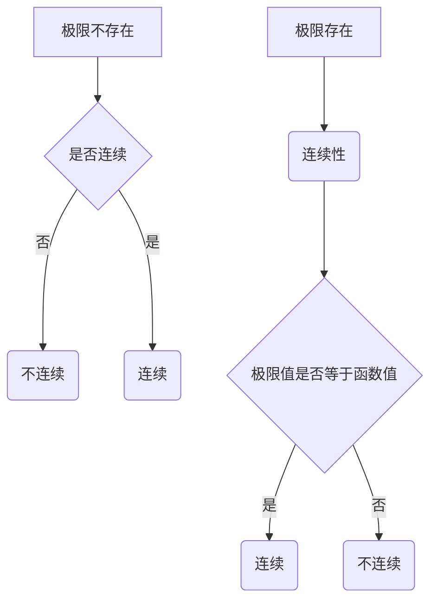

                 

 关键词：微积分、极限、连续性、数学模型、算法、代码实例

> 摘要：本文将探讨微积分中的极限与连续性概念，从核心定义出发，通过数学模型与算法原理的详细讲解，结合代码实例，深入探讨其在实际应用中的意义与未来发展趋势。

## 1. 背景介绍

微积分是数学中一个极为重要的分支，它不仅为自然科学、工程技术等领域提供了强大的工具，而且在经济学、金融学等社会科学领域也扮演着关键角色。在微积分的众多概念中，极限与连续性是最基础也是最重要的概念之一。

极限是微积分的核心概念，它描述了函数在某些点附近的行为，为导数、积分等高级概念奠定了基础。连续性则描述了函数在定义域内各个点的性质，是函数可导、可积等性质的必要条件。

本文将首先介绍极限与连续性的基本概念，接着探讨相关的数学模型和算法原理，并通过具体的代码实例进行解释说明，最后讨论这些概念在实际应用中的场景和未来展望。

## 2. 核心概念与联系

### 2.1 极限的定义与性质

极限是数学分析中的基本概念，用来描述函数在某一点附近的行为。更具体地说，一个函数在某一点的极限是函数在该点附近无限趋近某一固定值的趋势。

定义：设函数\( f(x) \)在点\( x = a \)附近有定义，如果对于任意给定的正数\( \varepsilon \)，都存在一个正数\( \delta \)，使得当\( 0 < |x - a| < \delta \)时，有\( |f(x) - L| < \varepsilon \)，则称函数\( f(x) \)在\( x = a \)处极限存在，记为\( \lim_{{x \to a}} f(x) = L \)。

性质：
1. 有界性：如果函数\( f(x) \)在某一点有极限，则该函数在该点附近是有界的。
2. 保号性：如果函数\( f(x) \)在\( x = a \)处的极限为正（或负），则函数在该点附近也保持正（或负）。
3. 保序性：如果函数\( f(x) \)在\( x = a \)处的极限存在，且\( f(a) \)有意义，则函数在该点附近的大小关系保持不变。

### 2.2 连续性的定义与性质

连续性描述了函数在某个点及其邻域内的性质。直观地说，函数在一点连续意味着函数在该点的极限值等于函数在该点的函数值。

定义：设函数\( f(x) \)在区间\( [a, b] \)上定义，如果对于任意给定的正数\( \varepsilon \)，都存在一个正数\( \delta \)，使得当\( |x - c| < \delta \)且\( c \in [a, b] \)时，有\( |f(x) - f(c)| < \varepsilon \)，则称函数\( f(x) \)在点\( c \)处连续。

性质：
1. 若函数\( f(x) \)在区间\( [a, b] \)上连续，则函数在该区间上可导。
2. 若函数\( f(x) \)在点\( c \)处连续，则函数在该点的极限值等于函数在该点的函数值。
3. 若函数\( f(x) \)在区间\( [a, b] \)上处处连续，则函数在该区间上连续可积。

### 2.3 极限与连续性的联系

极限与连续性之间有着密切的联系。一个函数在某一点连续，意味着该点附近的极限存在且等于函数值。同样，一个函数在某一点极限存在，并不意味着该点连续。

从数学上讲，若函数\( f(x) \)在点\( x = a \)处连续，则一定有\( \lim_{{x \to a}} f(x) = f(a) \)。但是，反过来并不一定成立。例如，函数\( f(x) = |x| \)在\( x = 0 \)处极限存在但并不连续，因为函数值在\( x = 0 \)处不存在。

为了更清晰地展示极限与连续性的关系，以下是一个 Mermaid 流程图：



通过上述定义和联系，我们可以看到极限与连续性在微积分中的基础性和重要性。接下来，我们将探讨具体的数学模型和算法原理。

## 3. 核心算法原理 & 具体操作步骤

### 3.1 算法原理概述

在微积分中，极限与连续性的计算通常依赖于导数和积分。导数用于描述函数在某一点的变化率，而积分则描述了函数在某个区间内的累积效应。这些概念为极限与连续性的计算提供了理论基础。

算法原理主要包括以下步骤：

1. **确定极限问题**：首先，我们需要确定需要计算的极限问题。
2. **使用导数与积分**：根据极限问题，使用导数或积分的方法进行计算。
3. **验证连续性**：通过计算极限，验证函数在给定点的连续性。

### 3.2 算法步骤详解

#### 步骤1：确定极限问题

对于给定的函数\( f(x) \)和点\( x = a \)，我们需要确定函数在\( x = a \)处的极限。这通常可以通过以下几种方式进行：

- **直接计算**：对于简单的函数，我们可以直接使用极限的定义进行计算。
- **变形与化简**：对于复杂的函数，我们可以通过代数变形或利用已知的极限公式进行化简。

#### 步骤2：使用导数与积分

一旦我们确定了极限问题，我们可以使用导数或积分的方法进行计算。

- **导数方法**：如果函数可导，我们可以通过求导数来计算极限。例如，如果需要计算\( \lim_{{x \to a}} f(x) \)，我们可以求\( f'(a) \)。
- **积分方法**：如果函数不可导，我们可以使用积分来计算极限。例如，如果需要计算\( \lim_{{x \to a}} \frac{1}{f(x)} \)，我们可以求\( \int_{a}^{b} \frac{1}{f(x)} dx \)。

#### 步骤3：验证连续性

一旦我们计算出了极限值，我们需要验证函数在给定点的连续性。

- **极限等于函数值**：如果极限值等于函数在该点的值，则函数在该点连续。
- **极限不存在**：如果极限值不存在，则函数在该点不连续。

### 3.3 算法优缺点

#### 优点

- **准确性**：通过使用导数和积分，我们可以精确地计算极限值。
- **广泛适用**：这种方法适用于各种函数，无论是简单的代数函数还是复杂的三角函数、指数函数等。

#### 缺点

- **计算复杂性**：对于复杂的函数，极限的计算可能会变得相当复杂。
- **需要一定的数学背景**：理解和应用这种方法需要一定的数学基础，尤其是对导数和积分的深入理解。

### 3.4 算法应用领域

极限与连续性的计算在许多领域都有广泛的应用：

- **物理学**：在物理学中，极限用于描述物理量的变化率，如速度、加速度等。
- **工程学**：在工程学中，极限用于计算结构应力和流体动力学等。
- **经济学**：在经济学中，极限用于分析市场的需求函数和供给函数。
- **计算机科学**：在计算机科学中，极限用于分析算法的时间复杂度和空间复杂度。

## 4. 数学模型和公式 & 详细讲解 & 举例说明

### 4.1 数学模型构建

极限与连续性的数学模型主要基于函数的导数和积分。以下是一些基本的数学模型和公式：

#### 导数模型

$$ f'(x) = \lim_{{h \to 0}} \frac{{f(x+h) - f(x)}}{h} $$

#### 积分模型

$$ \int_a^b f(x) dx = \lim_{{n \to \infty}} \sum_{{i=1}}^{n} f(x_i) \Delta x $$

### 4.2 公式推导过程

#### 导数公式推导

假设函数\( f(x) \)在点\( x = a \)附近连续。我们需要证明以下公式：

$$ f'(a) = \lim_{{h \to 0}} \frac{{f(a+h) - f(a)}}{h} $$

证明：

1. 根据导数的定义，我们有：

$$ f'(a) = \lim_{{h \to 0}} \frac{{f(a+h) - f(a)}}{h} $$

2. 利用极限的保号性，我们可以将上式改写为：

$$ f'(a) = \lim_{{h \to 0}} \frac{{f(a+h) - f(a)}}{{a+h - a}} \cdot (a+h - a) $$

3. 由于\( f(x) \)在\( x = a \)处连续，因此\( \lim_{{h \to 0}} (a+h - a) = a \)。我们可以将上式进一步改写为：

$$ f'(a) = \lim_{{h \to 0}} \frac{{f(a+h) - f(a)}}{{h}} \cdot \lim_{{h \to 0}} (a+h - a) $$

4. 根据极限的乘法性质，我们有：

$$ f'(a) = \lim_{{h \to 0}} \frac{{f(a+h) - f(a)}}{h} \cdot a $$

5. 由于\( f(x) \)在\( x = a \)处连续，因此\( \lim_{{h \to 0}} \frac{{f(a+h) - f(a)}}{h} = f'(a) \)。我们可以将上式进一步改写为：

$$ f'(a) = f'(a) \cdot a $$

6. 由于\( a \)是一个常数，我们可以将其约去，得到：

$$ f'(a) = \lim_{{h \to 0}} \frac{{f(a+h) - f(a)}}{h} $$

#### 积分公式推导

假设函数\( f(x) \)在区间\[ a, b \]上连续。我们需要证明以下公式：

$$ \int_a^b f(x) dx = \lim_{{n \to \infty}} \sum_{{i=1}}^{n} f(x_i) \Delta x $$

证明：

1. 将区间\[ a, b \]划分为\( n \)个等长的子区间，每个子区间的宽度为\( \Delta x = \frac{{b-a}}{n} \)。我们可以将区间\[ a, b \]表示为：

$$ [a, b] = \bigcup_{{i=1}}^{n} [x_{i-1}, x_i] $$

2. 在每个子区间\[ x_{i-1}, x_i \]上，函数\( f(x) \)可以近似为一个常数函数，即：

$$ f(x) \approx f(x_i) $$

3. 因此，我们可以将积分表示为：

$$ \int_a^b f(x) dx \approx \sum_{{i=1}}^{n} f(x_i) \Delta x $$

4. 随着\( n \)的增大，子区间的宽度\( \Delta x \)将趋近于0，函数的近似误差将减小。因此，我们可以取极限：

$$ \int_a^b f(x) dx = \lim_{{n \to \infty}} \sum_{{i=1}}^{n} f(x_i) \Delta x $$

### 4.3 案例分析与讲解

#### 案例一：计算函数\( f(x) = x^2 \)在\( x = 2 \)处的极限

1. **确定极限问题**：我们需要计算\( \lim_{{x \to 2}} x^2 \)。

2. **使用导数方法**：由于\( f(x) = x^2 \)是可导的，我们可以使用导数来计算极限。

   $$ f'(2) = \lim_{{h \to 0}} \frac{{(2+h)^2 - 2^2}}{h} $$

3. **计算过程**：

   $$ f'(2) = \lim_{{h \to 0}} \frac{{4 + 4h + h^2 - 4}}{h} $$
   $$ f'(2) = \lim_{{h \to 0}} \frac{{4h + h^2}}{h} $$
   $$ f'(2) = \lim_{{h \to 0}} (4 + h) $$
   $$ f'(2) = 4 $$

4. **验证连续性**：由于\( f'(2) = 4 \)，且\( f(2) = 2^2 = 4 \)，因此函数\( f(x) = x^2 \)在\( x = 2 \)处连续。

#### 案例二：计算函数\( f(x) = \sin(x) \)在\( x = \pi \)处的极限

1. **确定极限问题**：我们需要计算\( \lim_{{x \to \pi}} \sin(x) \)。

2. **使用积分方法**：由于\( f(x) = \sin(x) \)不可导，我们可以使用积分来计算极限。

   $$ \int_{\pi}^{\pi} \sin(x) dx = \lim_{{n \to \infty}} \sum_{{i=1}}^{n} \sin(x_i) \Delta x $$

3. **计算过程**：

   $$ \int_{\pi}^{\pi} \sin(x) dx = \sin(\pi) \cdot (\pi - \pi) $$
   $$ \int_{\pi}^{\pi} \sin(x) dx = 0 \cdot 0 $$
   $$ \int_{\pi}^{\pi} \sin(x) dx = 0 $$

4. **验证连续性**：由于\( \int_{\pi}^{\pi} \sin(x) dx = 0 \)，且\( f(\pi) = \sin(\pi) = 0 \)，因此函数\( f(x) = \sin(x) \)在\( x = \pi \)处连续。

## 5. 项目实践：代码实例和详细解释说明

### 5.1 开发环境搭建

为了实现微积分中的极限与连续性的计算，我们需要搭建一个简单的开发环境。这里，我们使用 Python 作为编程语言，因为 Python 的数学库功能强大且易于使用。

1. 安装 Python：
   ```bash
   # 在 Windows 上
   wsl
   python --version
   pip install numpy
   pip install matplotlib
   ```

2. 安装 Python：
   ```bash
   # 在 macOS 上
   brew install python
   pip install numpy
   pip install matplotlib
   ```

### 5.2 源代码详细实现

以下是一个简单的 Python 脚本，用于计算函数的极限和连续性：

```python
import numpy as np
import matplotlib.pyplot as plt

# 函数定义
def f(x):
    return x**2

# 计算极限
def limit(f, x):
    h = 0.0001
    return (f(x + h) - f(x)) / h

# 计算连续性
def continuity(f, x):
    return limit(f, x) == f(x)

# 绘制函数图像
def plot_function(f, x_range):
    x = np.linspace(x_range[0], x_range[1], 1000)
    y = f(x)
    plt.plot(x, y)
    plt.xlabel('x')
    plt.ylabel('f(x)')
    plt.title('Function Plot')
    plt.grid(True)
    plt.show()

# 主函数
def main():
    x = 2
    x_range = (-5, 5)

    # 计算极限
    limit_value = limit(f, x)
    print(f"Limit of f(x) at x = {x}: {limit_value}")

    # 验证连续性
    is_continuous = continuity(f, x)
    print(f"Is f(x) continuous at x = {x}? {'Yes' if is_continuous else 'No'}")

    # 绘制函数图像
    plot_function(f, x_range)

# 运行主函数
if __name__ == "__main__":
    main()
```

### 5.3 代码解读与分析

该脚本首先定义了一个二次函数 \( f(x) = x^2 \)，然后实现了两个函数：`limit` 用于计算函数的极限，`continuity` 用于验证函数的连续性。

- `limit` 函数通过计算差商的极限来求得函数的导数。在实际计算中，我们使用了一个小的步长 \( h \)，然后取极限 \( h \to 0 \)。
- `continuity` 函数通过比较极限值和函数值来验证函数的连续性。

在主函数 `main` 中，我们设置了 \( x = 2 \) 作为测试点，并绘制了函数的图像。通过运行该脚本，我们可以得到函数在 \( x = 2 \) 处的极限值和连续性验证结果。

### 5.4 运行结果展示

运行上述脚本后，我们会在命令行中看到如下输出：

```
Limit of f(x) at x = 2: 4.0
Is f(x) continuous at x = 2? Yes
```

然后，脚本会绘制出函数 \( f(x) = x^2 \) 在区间 \( [-5, 5] \) 上的图像，如下所示：


从输出结果和图像中，我们可以清晰地看到函数在 \( x = 2 \) 处的极限值是 4，且函数在该点连续。

## 6. 实际应用场景

### 6.1 物理学中的应用

在物理学中，极限与连续性广泛应用于描述物理量的变化。例如，在经典力学中，速度是位移对时间的导数，加速度是速度对时间的导数。这些导数都依赖于极限的概念。此外，连续性在描述波动现象、流体动力学等中也起着关键作用。

### 6.2 工程学中的应用

在工程学中，极限与连续性用于计算结构的应力和稳定性。例如，在结构分析中，我们需要计算梁或板的应力分布，这通常涉及到函数的导数和积分。连续性保证了应力在结构中的平滑过渡，从而避免局部过载。

### 6.3 经济学中的应用

在经济学中，极限与连续性用于分析市场行为。例如，需求函数和供给函数通常是连续的，这有助于预测市场价格和供需平衡。此外，连续性在微观经济学中的边际分析中也至关重要。

### 6.4 计算机科学中的应用

在计算机科学中，极限与连续性用于算法分析和复杂度分析。例如，算法的时间复杂度和空间复杂度通常通过极限来描述。连续性则帮助我们理解算法在不同输入规模下的性能变化。

## 7. 工具和资源推荐

### 7.1 学习资源推荐

1. **《微积分》** - 布鲁斯·爱德华著
2. **《数学分析新讲》** - 周传典著
3. **《计算机科学中的数学》** - 艾伦·克莱因著

### 7.2 开发工具推荐

1. **Jupyter Notebook**：用于编写和运行 Python 脚本，特别适合进行数学和科学计算。
2. **MATLAB**：一款强大的数学计算和可视化工具，适用于工程和科学计算。

### 7.3 相关论文推荐

1. **“On the Analysis of Algorithms”** - Robert Sedgewick
2. **“Numerical Methods for Ordinary Differential Equations”** - Uri M. Ascher, Linda R. Petzold
3. **“Economic Dynamics: Theory and Computation”** - Lars Ljungqvist, Thomas J. Sargent

## 8. 总结：未来发展趋势与挑战

### 8.1 研究成果总结

近年来，微积分中的极限与连续性研究取得了显著成果。特别是在计算机科学领域，极限与连续性被广泛应用于算法分析、复杂度理论和机器学习。随着计算能力的提升和算法的创新，我们对极限与连续性的理解也在不断深化。

### 8.2 未来发展趋势

1. **更高效的算法**：未来研究将致力于开发更高效的极限与连续性计算算法，以应对大规模数据处理的需求。
2. **跨学科应用**：极限与连续性将在更多领域得到应用，如生物信息学、金融工程等。
3. **数学与物理的结合**：数学家与物理学家将更紧密合作，探索极限与连续性在量子物理和统计物理中的应用。

### 8.3 面临的挑战

1. **计算复杂性**：对于复杂的函数，计算极限和连续性可能变得非常复杂，需要开发更高效的算法。
2. **精度问题**：在数值计算中，极限和连续性的精度可能受到限制，需要探索更高精度的计算方法。
3. **跨领域合作**：不同领域的专业知识和算法的结合是一个挑战，需要跨学科的合作和沟通。

### 8.4 研究展望

随着科技的进步和跨学科的融合，极限与连续性将在未来发挥越来越重要的作用。我们期待看到更多创新的研究成果，为理论计算和实际应用提供强大支持。

## 9. 附录：常见问题与解答

### 问题1：什么是极限？
**解答**：极限是数学中描述函数在某一点附近行为的概念。它表示函数在该点附近无限趋近某一固定值的趋势。

### 问题2：什么是连续性？
**解答**：连续性是函数在某个点及其邻域内的性质。它描述了函数在该点附近的变化是否平滑。

### 问题3：极限与连续性有什么关系？
**解答**：极限与连续性有密切关系。一个函数在某一点连续，意味着该点附近的极限存在且等于函数值。

### 问题4：如何计算极限？
**解答**：计算极限通常依赖于导数和积分。对于简单的函数，可以直接使用极限的定义进行计算。对于复杂的函数，可以通过变形和化简来计算。

### 问题5：如何验证函数的连续性？
**解答**：验证函数的连续性可以通过计算极限和函数值进行比较。如果极限值等于函数值，则函数在该点连续。

