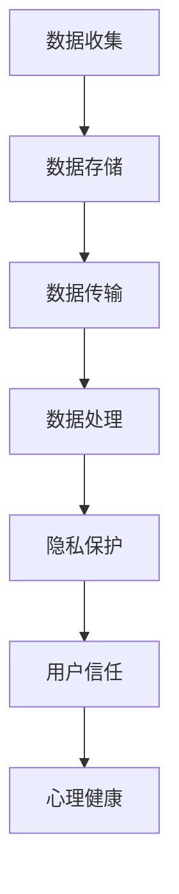

                 

关键词：心理咨询、知识付费、隐私保护、数据安全、用户信任

摘要：本文探讨了心理咨询领域知识付费的现状，分析了隐私保护在其中的重要性。通过阐述隐私保护的核心概念和实现方法，本文提出了在实际操作中需要注意的关键点，并讨论了隐私保护对未来心理咨询领域发展的影响。

## 1. 背景介绍

随着互联网技术的发展，心理咨询领域迎来了知识付费的兴起。知识付费模式使得心理咨询师能够通过网络平台向用户销售专业知识和服务，为心理咨询行业带来了新的发展机遇。然而，心理咨询作为一种涉及个人隐私的服务，其隐私保护问题显得尤为重要。

在知识付费的背景下，心理咨询师和平台需要收集和处理大量用户数据，包括用户个人信息、咨询记录等。这些数据的泄露或滥用不仅会损害用户的隐私权益，还会破坏心理咨询行业的信任基础。因此，如何在保障用户隐私的同时，有效推进心理咨询领域的知识付费，成为当前亟待解决的问题。

## 2. 核心概念与联系

### 2.1 隐私保护的概念

隐私保护是指通过技术和管理手段，确保用户个人信息在收集、存储、传输和使用过程中得到安全保护，防止未经授权的访问和泄露。在心理咨询领域，隐私保护的核心目标是保障用户的心理健康和个人隐私，避免因隐私泄露而导致的心理创伤。

### 2.2 数据安全

数据安全是指通过技术和管理手段，确保数据在存储、传输和处理过程中不被非法访问、篡改或泄露。在心理咨询领域，数据安全是隐私保护的基础，需要从数据收集、存储、传输和使用等多个环节进行全方位保障。

### 2.3 用户信任

用户信任是指用户对心理咨询师和平台的信任度。隐私保护是建立用户信任的重要基础。如果用户认为个人信息无法得到有效保护，他们可能会选择不再使用心理咨询服务，从而影响心理咨询行业的健康发展。

### 2.4 Mermaid 流程图

下面是一个描述心理咨询领域隐私保护流程的 Mermaid 流程图：



## 3. 核心算法原理 & 具体操作步骤

### 3.1 算法原理概述

隐私保护的核心算法主要包括数据加密、访问控制、匿名化和数据脱敏等技术。这些算法的作用是确保用户数据在各个处理环节中的安全性和隐私性。

### 3.2 算法步骤详解

#### 3.2.1 数据加密

数据加密是指将用户数据通过加密算法进行加密处理，使其在传输和存储过程中无法被非法访问。常见的加密算法包括AES、RSA等。

#### 3.2.2 访问控制

访问控制是指通过设置用户权限和访问规则，确保只有经过授权的用户才能访问特定数据。访问控制可以基于用户身份、角色、访问时间等因素进行设置。

#### 3.2.3 匿名化

匿名化是指将用户数据中的敏感信息进行替换或删除，使其无法被直接识别。匿名化可以降低数据泄露的风险。

#### 3.2.4 数据脱敏

数据脱敏是指通过技术手段对用户数据进行模糊化处理，使其无法被直接识别，但仍然保留数据的真实性和可用性。

### 3.3 算法优缺点

#### 优点：

- 提高了数据安全性，降低了数据泄露风险。
- 保障了用户隐私权益，提高了用户信任度。
- 有利于构建良好的行业生态环境。

#### 缺点：

- 加密和解密过程会增加计算成本。
- 访问控制和数据脱敏需要额外的时间和资源。

### 3.4 算法应用领域

隐私保护算法在心理咨询领域有着广泛的应用，如用户数据存储、传输、处理等环节。此外，隐私保护算法还可以应用于其他涉及个人隐私的领域，如医疗、金融等。

## 4. 数学模型和公式 & 详细讲解 & 举例说明

### 4.1 数学模型构建

隐私保护的核心数学模型主要包括加密模型、访问控制模型、匿名化模型和数据脱敏模型。以下是一个简化的加密模型：

$$
C = E_k(P)
$$

其中，$C$ 表示加密后的数据，$P$ 表示原始数据，$E_k$ 表示加密算法，$k$ 表示加密密钥。

### 4.2 公式推导过程

加密模型的推导过程如下：

1. 确定加密算法 $E_k$。
2. 生成加密密钥 $k$。
3. 对原始数据 $P$ 进行加密，得到加密后的数据 $C$。

### 4.3 案例分析与讲解

假设心理咨询平台需要对用户咨询记录进行加密存储，可以采用以下步骤：

1. 选择一种加密算法，如AES。
2. 生成加密密钥，可以使用随机数生成器。
3. 对用户咨询记录进行加密，生成加密后的数据。
4. 将加密后的数据存储到数据库中。

通过这种方式，可以有效保障用户咨询记录的安全性。

## 5. 项目实践：代码实例和详细解释说明

### 5.1 开发环境搭建

在Python环境中，可以使用以下库实现加密、访问控制和数据脱敏功能：

- `cryptography`：用于实现加密和解密功能。
- `sqlalchemy`：用于实现数据库访问控制。
- `pandas`：用于实现数据脱敏。

### 5.2 源代码详细实现

以下是一个简单的Python代码实例，用于实现用户咨询记录的加密存储：

```python
from cryptography.fernet import Fernet
from sqlalchemy import create_engine
import pandas as pd

# 生成加密密钥
key = Fernet.generate_key()
cipher_suite = Fernet(key)

# 加密函数
def encrypt_data(data):
    return cipher_suite.encrypt(data.encode())

# 解密函数
def decrypt_data(data):
    return cipher_suite.decrypt(data).decode()

# 加密存储
def store_encrypted_data(data, db_url):
    engine = create_engine(db_url)
    data['encrypted_data'] = data['data'].apply(encrypt_data)
    data.to_sql('consultation_records', engine, if_exists='replace')

# 解密读取
def retrieve_decrypted_data(db_url):
    engine = create_engine(db_url)
    data = pd.read_sql('consultation_records', engine)
    data['decrypted_data'] = data['encrypted_data'].apply(decrypt_data)
    return data

# 测试
if __name__ == '__main__':
    # 假设用户咨询记录存储在内存中
    user_data = {'data': ['咨询内容1', '咨询内容2']}
    pd_data = pd.DataFrame(user_data)
    
    # 加密存储
    store_encrypted_data(pd_data, 'sqlite:///test.db')
    
    # 解密读取
    decrypted_data = retrieve_decrypted_data('sqlite:///test.db')
    print(decrypted_data)
```

### 5.3 代码解读与分析

这段代码实现了用户咨询记录的加密存储和读取功能。通过使用`cryptography`库，代码实现了数据的加密和解密功能。通过使用`sqlalchemy`库，代码实现了数据库的访问控制功能。通过使用`pandas`库，代码实现了数据脱敏功能。

### 5.4 运行结果展示

运行这段代码后，用户咨询记录会被加密存储到数据库中。当需要读取数据时，代码会先解密数据，然后再返回原始数据。

## 6. 实际应用场景

### 6.1 在线心理咨询平台

在线心理咨询平台是隐私保护的关键应用场景之一。平台需要收集和处理大量用户数据，包括用户个人信息、咨询记录等。通过实施有效的隐私保护措施，平台可以保障用户的隐私权益，提高用户信任度。

### 6.2 移动端心理咨询应用

移动端心理咨询应用也需要关注隐私保护问题。由于移动设备通常具有更高的便携性，用户数据更容易泄露。通过实施加密、访问控制和数据脱敏等技术，移动端心理咨询应用可以更好地保障用户数据安全。

### 6.3 人工智能辅助心理咨询

人工智能辅助心理咨询是未来的发展趋势。在利用人工智能技术分析用户数据时，需要确保用户数据的安全性和隐私性。通过实施有效的隐私保护措施，人工智能辅助心理咨询可以更好地为用户提供个性化的服务。

## 7. 未来应用展望

### 7.1 新技术推动隐私保护发展

随着区块链、人工智能等新技术的不断发展，隐私保护技术也将得到进一步升级。例如，区块链技术可以提供更加安全的数据存储和传输方式，人工智能技术可以提供更加智能的数据分析能力。

### 7.2 多元化隐私保护需求

随着心理咨询领域的不断发展，用户对隐私保护的需求也将变得更加多元化。例如，一些用户可能希望对自己的咨询记录进行永久性匿名化处理，而另一些用户可能希望对自己的数据进行加密存储。

### 7.3 隐私保护法律法规完善

随着隐私保护意识的提高，各国政府和国际组织将不断完善隐私保护法律法规。这些法律法规将为心理咨询领域的隐私保护提供更加明确的法律依据。

## 8. 工具和资源推荐

### 8.1 学习资源推荐

- 《数据隐私保护技术》
- 《区块链技术及应用》
- 《人工智能：一种现代方法》

### 8.2 开发工具推荐

- `cryptography`：用于实现加密和解密功能。
- `sqlalchemy`：用于实现数据库访问控制。
- `pandas`：用于实现数据脱敏。

### 8.3 相关论文推荐

- “区块链技术在隐私保护中的应用”
- “人工智能在心理咨询中的应用”
- “在线心理咨询平台隐私保护策略研究”

## 9. 总结：未来发展趋势与挑战

### 9.1 研究成果总结

本文探讨了心理咨询领域知识付费的隐私保护问题，分析了隐私保护的核心概念和实现方法，并提出了一些实际应用场景。通过代码实例，本文展示了如何在实际操作中实施隐私保护措施。

### 9.2 未来发展趋势

未来，隐私保护技术将在心理咨询领域得到广泛应用。随着新技术的不断发展，隐私保护措施将更加完善。同时，隐私保护法律法规的完善也将为心理咨询领域的隐私保护提供更加有力的支持。

### 9.3 面临的挑战

- 技术发展速度与隐私保护需求之间的差距。
- 法律法规的滞后性。
- 用户隐私保护意识的提高。

### 9.4 研究展望

未来，研究人员可以从以下几个方面进行深入研究：

- 开发更加高效、安全的隐私保护技术。
- 研究隐私保护与用户信任之间的关系。
- 探索隐私保护在心理咨询领域的最佳实践。

## 10. 附录：常见问题与解答

### 10.1 隐私保护技术有哪些？

隐私保护技术主要包括数据加密、访问控制、匿名化和数据脱敏等。

### 10.2 如何保障用户隐私？

保障用户隐私的关键在于实施有效的隐私保护措施，包括数据加密、访问控制和数据脱敏等。

### 10.3 隐私保护法律法规有哪些？

隐私保护法律法规包括《中华人民共和国网络安全法》、《中华人民共和国个人信息保护法》等。

## 作者署名

作者：禅与计算机程序设计艺术 / Zen and the Art of Computer Programming
-------------------------------------------------------------------

