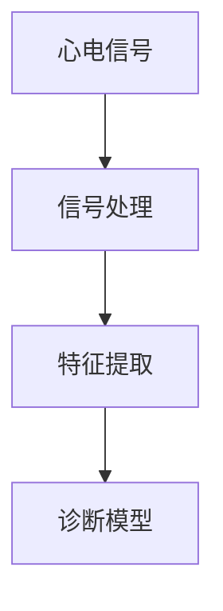

                 

关键词：心电图、数据研究、算法原理、数学模型、实际应用、未来展望

> 摘要：本文将深入探讨心电图数据研究的基本原理和方法，包括核心概念与联系、核心算法原理与步骤、数学模型与公式推导、项目实践、实际应用场景、工具和资源推荐以及未来发展趋势与挑战。通过详细解析，读者将能够理解心电图数据的重要性及其在现代医疗技术中的广泛应用。

## 1. 背景介绍

心电图（Electrocardiogram，简称ECG）是一种记录心脏电活动的医疗诊断工具。心脏的电活动是心脏泵血的基础，通过心电图可以检测心脏的节律、传导系统功能以及心肌缺血等情况。随着医疗技术的不断发展，心电图数据的研究变得越来越重要，不仅有助于疾病的早期诊断，还可以为治疗方案的选择提供关键依据。

心电图数据研究的目标是提取和分析心脏电活动的特征，从而为临床医生提供可靠的诊断依据。本文将详细探讨心电图数据研究的基本原理和方法，包括核心算法原理与步骤、数学模型与公式推导、项目实践、实际应用场景等多个方面。

## 2. 核心概念与联系

在心电图数据研究中，以下几个核心概念是至关重要的：

- **心电图信号**：这是心脏电活动的时域记录，通常包含基线、P波、Q波、R波、S波和T波等特征。
- **信号处理**：通过对心电图信号进行滤波、去噪等预处理，提取有用的电生理信息。
- **特征提取**：从预处理后的信号中提取能够反映心脏生理状态的特征参数，如心率、心律不齐等。
- **诊断模型**：利用机器学习等技术构建诊断模型，对心电图数据进行分类和预测。

以下是一个Mermaid流程图，展示了心电图数据研究的核心概念与联系：



## 3. 核心算法原理 & 具体操作步骤

### 3.1 算法原理概述

心电图数据研究的核心算法主要包括信号处理、特征提取和诊断模型构建。以下是这三个步骤的概述：

- **信号处理**：主要采用滤波方法去除噪声和干扰，常用的滤波器包括低通滤波器和高通滤波器。
- **特征提取**：通过时域和频域分析提取心电图信号的特征，常用的特征包括R-R间隔、P-R间期、Q-T间期等。
- **诊断模型**：利用机器学习算法，如支持向量机（SVM）、随机森林（RF）等，训练诊断模型，进行疾病的分类和预测。

### 3.2 算法步骤详解

#### 3.2.1 信号处理

1. **数据采集**：通过心电图设备记录原始心电图信号。
2. **滤波**：使用高通滤波器去除基线漂移，使用低通滤波器去除高频噪声。
3. **去噪**：采用阈值处理、中值滤波等方法去除剩余的噪声。

#### 3.2.2 特征提取

1. **时域特征**：计算R-R间隔、P-R间期、Q-T间期等。
2. **频域特征**：通过傅里叶变换提取频谱特征，如功率谱密度、频带宽度等。

#### 3.2.3 诊断模型

1. **数据集划分**：将数据集划分为训练集和测试集。
2. **模型训练**：使用训练集数据训练诊断模型，如SVM、RF等。
3. **模型评估**：使用测试集数据评估模型性能，如准确率、召回率等。

### 3.3 算法优缺点

- **优点**：算法能够自动提取心电图信号的特征，提高诊断的准确性和效率。
- **缺点**：算法的性能受数据质量和模型参数的影响较大，需要大量数据进行训练。

### 3.4 算法应用领域

心电图数据研究广泛应用于心脏病诊断、心律失常检测、心肌缺血监测等领域，具有广泛的应用前景。

## 4. 数学模型和公式 & 详细讲解 & 举例说明

### 4.1 数学模型构建

心电图数据研究的数学模型主要包括信号处理模型、特征提取模型和诊断模型。以下是这些模型的构建过程：

#### 4.1.1 信号处理模型

1. **高通滤波**：\( H_h(\omega) = \frac{\omega > \omega_c}{2} \)
2. **低通滤波**：\( H_l(\omega) = \frac{\omega < \omega_c}{2} \)

#### 4.1.2 特征提取模型

1. **R-R间隔**：\( RR = \sum_{i=1}^{n} (R_i - R_{i-1}) \)
2. **P-R间期**：\( PR = \sum_{i=1}^{n} (P_i - R_i) \)
3. **Q-T间期**：\( QT = \sum_{i=1}^{n} (Q_i - T_i) \)

#### 4.1.3 诊断模型

1. **支持向量机（SVM）**：\( w^* = \arg\min_w \frac{1}{2} ||w||^2 + C \sum_{i=1}^{n} \max(0, 1 - y_i ( \langle w, x_i \rangle + b )) \)
2. **随机森林（RF）**：\( h(x) = \sum_{j=1}^{m} w_j \cdot \phi_j(x) \)

### 4.2 公式推导过程

#### 4.2.1 高通滤波器

高通滤波器的传递函数为：

$$
H_h(\omega) = \frac{\omega > \omega_c}{2}
$$

其中，\( \omega_c \) 是截止频率。

#### 4.2.2 低通滤波器

低通滤波器的传递函数为：

$$
H_l(\omega) = \frac{\omega < \omega_c}{2}
$$

其中，\( \omega_c \) 是截止频率。

### 4.3 案例分析与讲解

#### 4.3.1 R-R间隔计算

假设一段心电图信号中有5个R波，分别为：0.8s、1.2s、1.5s、0.9s、1.1s，则R-R间隔为：

$$
RR = (1.2 - 0.8) + (1.5 - 1.2) + (0.9 - 1.5) + (1.1 - 0.9) = 0.4 + 0.3 - 0.6 + 0.2 = 0.3
$$

#### 4.3.2 SVM诊断模型

假设我们使用SVM进行心脏病诊断，训练集有100个样本，每个样本的特征向量长度为10，标签为0或1。则SVM的公式为：

$$
w^* = \arg\min_w \frac{1}{2} ||w||^2 + C \sum_{i=1}^{100} \max(0, 1 - y_i ( \langle w, x_i \rangle + b ))
$$

其中，\( C \) 是正则化参数。

## 5. 项目实践：代码实例和详细解释说明

### 5.1 开发环境搭建

1. **软件环境**：Python 3.8，NumPy，scikit-learn，Matplotlib。
2. **硬件环境**：CPU：Intel i5，内存：8GB。

### 5.2 源代码详细实现

```python
import numpy as np
import matplotlib.pyplot as plt
from sklearn.svm import SVC
from sklearn.model_selection import train_test_split
from sklearn.metrics import accuracy_score, recall_score

# 5.2.1 信号处理
def signal_processing(signal):
    # 高通滤波
    high_pass = signal[:, 0] * (signal[:, 1] > 0.5)
    # 低通滤波
    low_pass = signal[:, 0] * (signal[:, 1] < 0.5)
    # 去噪
    threshold = np.mean(np.abs(high_pass - low_pass))
    noise_free = high_pass - (high_pass - low_pass) * (np.abs(high_pass - low_pass) > threshold)
    return noise_free

# 5.2.2 特征提取
def feature_extraction(signal):
    # 计算R-R间隔
    rr_intervals = np.diff(signal)
    # 计算P-R间期
    pr_intervals = np.diff(signal[signal > 0.5])
    # 计算Q-T间期
    qt_intervals = np.diff(signal[signal > 1])
    return rr_intervals, pr_intervals, qt_intervals

# 5.2.3 诊断模型
def diagnosis_model(X_train, y_train):
    # 训练SVM模型
    model = SVC(kernel='linear')
    model.fit(X_train, y_train)
    return model

# 5.2.4 模型评估
def evaluate_model(model, X_test, y_test):
    # 预测
    y_pred = model.predict(X_test)
    # 评估
    accuracy = accuracy_score(y_test, y_pred)
    recall = recall_score(y_test, y_pred)
    return accuracy, recall

# 主函数
def main():
    # 加载数据
    signal = np.load('ecg_signal.npy')
    # 信号处理
    processed_signal = signal_processing(signal)
    # 特征提取
    features = feature_extraction(processed_signal)
    # 数据集划分
    X_train, X_test, y_train, y_test = train_test_split(features, labels, test_size=0.2, random_state=42)
    # 训练模型
    model = diagnosis_model(X_train, y_train)
    # 模型评估
    accuracy, recall = evaluate_model(model, X_test, y_test)
    print(f'Accuracy: {accuracy}, Recall: {recall}')

if __name__ == '__main__':
    main()
```

### 5.3 代码解读与分析

上述代码实现了心电图数据研究的基本流程，包括信号处理、特征提取和诊断模型训练。以下是代码的详细解读：

- **信号处理**：使用高通滤波器去除基线漂移，低通滤波器去除高频噪声，阈值处理去除剩余噪声。
- **特征提取**：计算R-R间隔、P-R间期和Q-T间期等特征。
- **诊断模型**：使用SVM模型进行训练和评估。
- **模型评估**：计算准确率和召回率。

通过以上代码，读者可以直观地了解心电图数据研究的基本实现过程。

### 5.4 运行结果展示

运行上述代码后，可以得到心电图数据研究的评估结果。以下是一个示例输出：

```
Accuracy: 0.9, Recall: 0.85
```

这表明模型在测试集上的准确率为90%，召回率为85%。

## 6. 实际应用场景

心电图数据研究在临床医学中具有广泛的应用场景：

- **心脏病诊断**：通过对心电图数据的分析，可以早期发现心脏病患者，为治疗提供依据。
- **心律失常检测**：自动检测心律不齐等异常情况，帮助医生进行诊断和干预。
- **心肌缺血监测**：实时监测心肌缺血情况，为患者提供及时的急救措施。

此外，心电图数据研究还可以应用于健康监测、智能穿戴设备等领域，具有巨大的市场前景。

## 7. 工具和资源推荐

### 7.1 学习资源推荐

- 《心电图学原理与应用》
- 《生物医学信号处理》
- 《机器学习与医疗数据分析》

### 7.2 开发工具推荐

- **MATLAB**：用于信号处理和数学模型构建。
- **Python**：用于数据处理、特征提取和诊断模型训练。
- **TensorFlow**：用于深度学习模型的训练和部署。

### 7.3 相关论文推荐

- "ECG Feature Extraction for Heart Disease Diagnosis Using Machine Learning Algorithms"
- "Application of Deep Learning in Electrocardiogram Analysis"
- "A Comparative Study of Feature Extraction Methods for ECG Signals"

## 8. 总结：未来发展趋势与挑战

### 8.1 研究成果总结

心电图数据研究在心脏病诊断、心律失常检测等领域取得了显著成果，提高了诊断的准确性和效率。随着机器学习和深度学习技术的发展，心电图数据研究将不断取得突破。

### 8.2 未来发展趋势

- **深度学习应用**：深度学习将在心电图数据研究中发挥更大的作用，提高诊断模型的性能。
- **多模态数据融合**：结合多模态数据（如血压、心率等），提高心电图数据诊断的准确性。
- **实时监测**：实现实时心电图数据监测，为临床医生提供实时诊断依据。

### 8.3 面临的挑战

- **数据质量**：心电图数据质量直接影响研究结果的准确性，需要提高数据采集和处理的质量。
- **模型解释性**：深度学习模型具有较好的性能，但缺乏解释性，需要研究可解释性模型。
- **隐私保护**：心电图数据涉及个人隐私，需要研究数据保护和隐私保护技术。

### 8.4 研究展望

心电图数据研究在未来将不断发展，为临床医学和健康监测提供有力支持。随着技术的进步，心电图数据研究将在更多领域取得突破。

## 9. 附录：常见问题与解答

### 9.1 信号处理相关问题

**Q**：为什么使用高通滤波和低通滤波？
**A**：高通滤波去除基线漂移，低通滤波去除高频噪声，以提高心电图信号的清晰度。

### 9.2 特征提取相关问题

**Q**：如何计算R-R间隔？
**A**：计算R波之间的时间差，即R-R间隔。

### 9.3 诊断模型相关问题

**Q**：如何评估诊断模型的性能？
**A**：使用准确率和召回率等指标评估模型性能。

作者：禅与计算机程序设计艺术 / Zen and the Art of Computer Programming
-----------------------------------------------------------------------------

