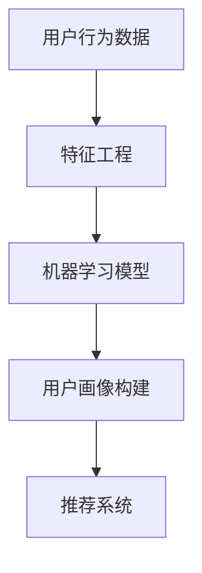
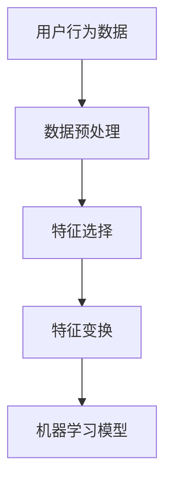
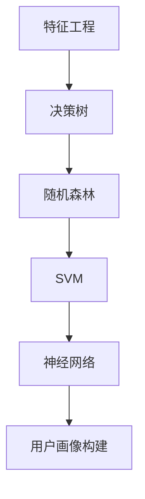
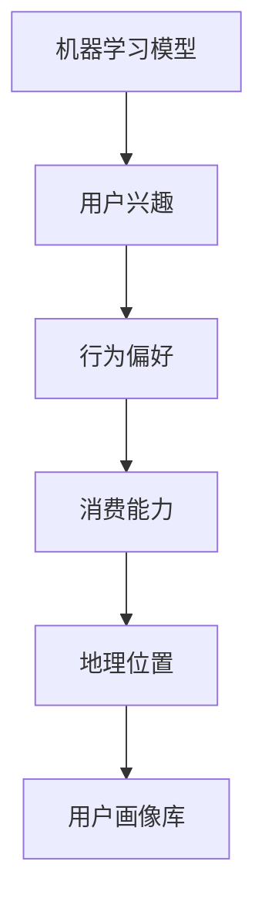
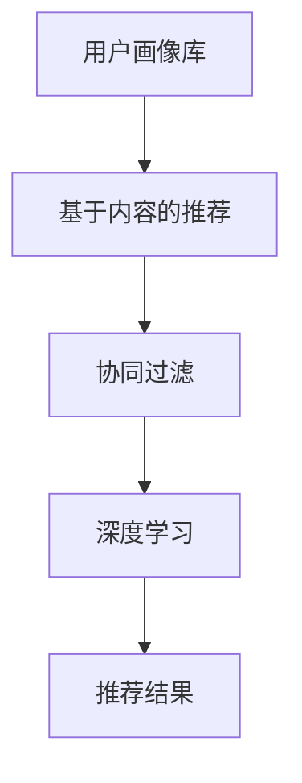

                 

 

> **关键词**：快手智能用户画像、社招面试、面试真题、解题思路、技术分析、用户行为分析、数据挖掘、机器学习、人工智能、算法应用

> **摘要**：本文将汇总2024年快手智能用户画像相关社招面试的真题，并针对每个题目提供详细的解题思路和答案。通过这些面试题目的分析和解答，希望能够帮助准备参加快手社招面试的候选人更好地理解和掌握相关技术知识，为面试做好充分准备。

## 1. 背景介绍

快手（Kuaishou）是中国领先的短视频和直播平台，拥有庞大的用户群体。作为一家以用户为中心的企业，快手通过智能用户画像技术，对用户进行深入分析，以提供更加个性化、精准的服务。智能用户画像技术主要依赖于数据挖掘、机器学习和人工智能等先进技术，通过对用户行为数据的分析，构建出用户的综合画像，进而为广告推荐、内容推送、用户运营等业务提供支持。

本文旨在通过对快手智能用户画像相关社招面试题的汇总和分析，帮助候选人深入了解这一领域的技术要求和面试准备。文章将涵盖以下几个部分：

- **背景介绍**：介绍快手智能用户画像的相关背景和技术需求。
- **核心概念与联系**：解释智能用户画像技术中的核心概念，并提供流程图。
- **核心算法原理 & 具体操作步骤**：分析常见的算法原理和操作步骤。
- **数学模型和公式**：介绍相关的数学模型和公式，并进行详细讲解。
- **项目实践**：通过代码实例展示实际应用。
- **实际应用场景**：讨论智能用户画像的实际应用。
- **未来应用展望**：探讨未来发展趋势和应用前景。
- **工具和资源推荐**：推荐学习资源和开发工具。
- **总结**：对研究成果和未来挑战进行总结。

### 1.1 快手智能用户画像的技术需求

快手智能用户画像的技术需求主要包括以下几个方面：

1. **用户行为数据分析**：对用户的浏览、点赞、评论、分享等行为进行深入分析，以了解用户兴趣和偏好。
2. **用户画像构建**：通过用户行为数据和基础信息（如性别、年龄、地理位置等），构建出多维度的用户画像。
3. **个性化推荐**：基于用户画像，为用户提供个性化内容推荐，提升用户体验和满意度。
4. **广告定向投放**：根据用户画像，精准投放广告，提高广告效果和转化率。
5. **用户运营**：通过画像分析，识别潜在用户，制定针对性的运营策略。

这些需求使得快手智能用户画像技术成为快手业务的核心支撑，同时也是面试官关注的重点。

## 2. 核心概念与联系

在智能用户画像技术中，核心概念包括用户行为数据、特征工程、机器学习模型、用户画像构建和推荐系统。以下是这些概念之间的联系以及相关的 Mermaid 流程图。

### 2.1 用户行为数据

用户行为数据是构建用户画像的基础。这些数据包括用户的浏览记录、点赞、评论、分享、购买行为等。用户行为数据可以来自多种渠道，如客户端日志、API 调用日志、第三方数据平台等。



### 2.2 特征工程

特征工程是对原始用户行为数据进行处理和转换的过程，目的是提取出对用户行为分析有用的特征。特征工程通常包括数据预处理、特征选择、特征变换等步骤。



### 2.3 机器学习模型

机器学习模型是用户画像构建的关键。常见的机器学习模型包括决策树、随机森林、支持向量机（SVM）、神经网络等。机器学习模型通过对特征数据进行训练，学习出用户行为和特征之间的关系，从而构建出用户画像。



### 2.4 用户画像构建

用户画像构建是基于机器学习模型分析后的结果，将用户行为数据转化为多维度的用户特征。用户画像通常包括用户兴趣、行为偏好、消费能力、地理位置等信息。



### 2.5 推荐系统

推荐系统是基于用户画像，为用户推荐个性化内容或商品。推荐系统通常采用基于内容的推荐、协同过滤、深度学习等方法。



通过上述核心概念和联系的分析，我们可以更好地理解快手智能用户画像技术的实现过程。接下来，我们将深入探讨核心算法原理和具体操作步骤。

## 3. 核心算法原理 & 具体操作步骤

在智能用户画像技术中，核心算法包括特征提取、用户行为分析、机器学习建模和用户画像构建等步骤。以下是这些算法的具体原理和操作步骤。

### 3.1 特征提取

特征提取是用户画像构建的第一步，其目的是从原始用户行为数据中提取出对用户行为分析有用的特征。特征提取的过程包括数据预处理、特征选择和特征变换等步骤。

#### 3.1.1 数据预处理

数据预处理是特征提取的基础，主要包括数据清洗、数据去重和数据归一化等步骤。

- **数据清洗**：去除无效数据、处理缺失值、纠正错误数据等。
- **数据去重**：去除重复数据，以避免对特征提取和分析造成干扰。
- **数据归一化**：将不同特征的数据进行归一化处理，使其具有相同的量纲，便于后续分析和建模。

#### 3.1.2 特征选择

特征选择是从大量特征中筛选出对用户行为分析最有用的特征。常用的特征选择方法包括信息增益、卡方检验、互信息等。

- **信息增益**：选择能够最大化描述用户行为的特征。
- **卡方检验**：通过卡方检验来判断特征与用户行为之间的相关性。
- **互信息**：计算特征与用户行为之间的互信息，选择互信息最大的特征。

#### 3.1.3 特征变换

特征变换是对筛选出的特征进行转换，以增强其对用户行为的描述能力。常用的特征变换方法包括特征融合、特征降维等。

- **特征融合**：将多个特征进行融合，以生成新的特征，提高特征的表达能力。
- **特征降维**：通过降维算法（如PCA、LDA等），减少特征维度，提高特征提取效率。

### 3.2 用户行为分析

用户行为分析是基于提取出的特征，对用户行为进行深入分析，以了解用户兴趣和偏好。用户行为分析的方法包括分类、聚类、回归等。

#### 3.2.1 分类

分类是将用户行为划分为不同的类别，以便于后续分析和推荐。常用的分类算法包括决策树、随机森林、支持向量机（SVM）等。

- **决策树**：通过树形结构来模拟决策过程，将用户行为划分为不同的类别。
- **随机森林**：通过构建多个决策树，并利用投票机制来预测用户行为类别。
- **SVM**：通过最大间隔分类器，将用户行为划分为正类和负类。

#### 3.2.2 聚类

聚类是将用户行为数据划分为不同的集群，以便于对用户群体进行划分和分类。常用的聚类算法包括K-Means、层次聚类等。

- **K-Means**：通过迭代计算，将用户行为数据划分为K个聚类中心，使得每个用户属于距离其最近的聚类中心。
- **层次聚类**：通过层次结构将用户行为数据划分为不同的层级，以便于对用户行为进行深度分析。

#### 3.2.3 回归

回归是预测用户行为的相关特征值，如用户的观看时长、点赞数、购买率等。常用的回归算法包括线性回归、逻辑回归等。

- **线性回归**：通过拟合直线来预测用户行为特征值。
- **逻辑回归**：通过拟合逻辑函数来预测用户行为类别。

### 3.3 机器学习建模

机器学习建模是基于用户行为分析和特征提取的结果，利用机器学习算法构建用户画像模型。常用的机器学习算法包括决策树、随机森林、支持向量机（SVM）、神经网络等。

#### 3.3.1 决策树

决策树是一种基于树形结构进行分类和回归的算法。决策树通过递归划分特征空间，将用户行为划分为不同的类别。

#### 3.3.2 随机森林

随机森林是一种基于决策树的集成学习方法。随机森林通过构建多棵决策树，并利用投票机制来预测用户行为类别。

#### 3.3.3 支持向量机（SVM）

支持向量机是一种基于间隔分类的算法。SVM通过寻找最大间隔分类器，将用户行为划分为不同的类别。

#### 3.3.4 神经网络

神经网络是一种基于模拟人脑结构的算法。神经网络通过多层感知器来实现对用户行为的分类和回归。

### 3.4 用户画像构建

用户画像构建是基于机器学习建模的结果，将用户行为数据转化为多维度的用户特征。用户画像构建的方法包括特征融合、特征降维等。

#### 3.4.1 特征融合

特征融合是将多个特征进行融合，以生成新的特征，提高特征的表达能力。

#### 3.4.2 特征降维

特征降维是通过降维算法（如PCA、LDA等），减少特征维度，提高特征提取效率。

通过以上核心算法原理和具体操作步骤的分析，我们可以更好地理解快手智能用户画像技术的实现过程。接下来，我们将介绍相关的数学模型和公式。

## 4. 数学模型和公式

在智能用户画像技术中，数学模型和公式是算法分析和实现的基础。以下是常见的数学模型和公式，并进行详细讲解和举例说明。

### 4.1 数学模型构建

数学模型构建是用户画像技术中的关键步骤，其目的是通过数学公式来描述用户行为和特征之间的关系。常见的数学模型包括线性回归、逻辑回归、支持向量机（SVM）等。

#### 4.1.1 线性回归

线性回归是一种基于线性模型的预测算法，其公式为：

$$y = w_0 + w_1 \cdot x_1 + w_2 \cdot x_2 + \cdots + w_n \cdot x_n + \epsilon$$

其中，$y$ 是预测值，$w_0, w_1, w_2, \cdots, w_n$ 是模型参数，$x_1, x_2, \cdots, x_n$ 是特征值，$\epsilon$ 是误差项。

**例题**：给定一个线性回归模型，预测用户观看时长（$y$）与用户点赞数（$x_1$）和评论数（$x_2$）之间的关系。已知模型参数为 $w_0 = 10, w_1 = 0.5, w_2 = 0.3$。

**解答**：

$$y = 10 + 0.5 \cdot x_1 + 0.3 \cdot x_2$$

若用户点赞数为 20，评论数为 30，则用户观看时长的预测值为：

$$y = 10 + 0.5 \cdot 20 + 0.3 \cdot 30 = 16.5$$

#### 4.1.2 逻辑回归

逻辑回归是一种基于逻辑函数的预测算法，其公式为：

$$P(y=1) = \frac{1}{1 + e^{-(w_0 + w_1 \cdot x_1 + w_2 \cdot x_2 + \cdots + w_n \cdot x_n)}}$$

其中，$P(y=1)$ 是预测用户行为为正类的概率，$w_0, w_1, w_2, \cdots, w_n$ 是模型参数，$x_1, x_2, \cdots, x_n$ 是特征值。

**例题**：给定一个逻辑回归模型，预测用户是否点赞（$y$）与用户观看时长（$x_1$）和点赞数（$x_2$）之间的关系。已知模型参数为 $w_0 = -10, w_1 = 0.3, w_2 = 0.2$。

**解答**：

$$P(y=1) = \frac{1}{1 + e^{-( -10 + 0.3 \cdot x_1 + 0.2 \cdot x_2)}}$$

若用户观看时长为 30 分钟，点赞数为 10，则用户点赞的概率为：

$$P(y=1) = \frac{1}{1 + e^{-(-10 + 0.3 \cdot 30 + 0.2 \cdot 10)}} \approx 0.643$$

#### 4.1.3 支持向量机（SVM）

支持向量机是一种基于间隔分类的算法，其公式为：

$$y = \text{sign}(\sum_{i=1}^{n} w_i \cdot x_i + b)$$

其中，$y$ 是预测值，$w_i$ 是权重向量，$x_i$ 是特征值，$b$ 是偏置项。

**例题**：给定一个支持向量机模型，预测用户是否点赞（$y$）与用户观看时长（$x_1$）和点赞数（$x_2$）之间的关系。已知模型参数为 $w_1 = (1, 0.5)^T, b = 0$。

**解答**：

$$y = \text{sign}(1 \cdot x_1 + 0.5 \cdot x_2)$$

若用户观看时长为 30 分钟，点赞数为 10，则用户点赞的预测值为：

$$y = \text{sign}(1 \cdot 30 + 0.5 \cdot 10) = 1$$

### 4.2 公式推导过程

数学模型的推导过程是理解算法原理的关键。以下是线性回归、逻辑回归和支持向量机的公式推导过程。

#### 4.2.1 线性回归推导

线性回归的推导基于最小二乘法，其目标是找到最佳拟合直线，使得误差最小。推导过程如下：

- **目标函数**：设 $y = w_0 + w_1 \cdot x_1 + w_2 \cdot x_2 + \cdots + w_n \cdot x_n + \epsilon$，则目标函数为：

  $$J(w_0, w_1, w_2, \cdots, w_n) = \sum_{i=1}^{m} (y_i - \sum_{j=1}^{n} w_j \cdot x_{ij})^2$$

- **梯度下降法**：对目标函数求偏导数，并令偏导数等于零，得到：

  $$\frac{\partial J}{\partial w_j} = -2 \cdot (y_i - \sum_{j=1}^{n} w_j \cdot x_{ij}) \cdot x_{ij}$$

- **求解**：迭代更新模型参数，使得目标函数最小化：

  $$w_j = w_j - \alpha \cdot \frac{\partial J}{\partial w_j}$$

  其中，$\alpha$ 是学习率。

#### 4.2.2 逻辑回归推导

逻辑回归的推导基于最大似然估计，其目标是找到最佳拟合曲线，使得预测概率最大化。推导过程如下：

- **目标函数**：设 $y \in \{0, 1\}$，则逻辑回归的目标函数为：

  $$J(w_0, w_1, w_2, \cdots, w_n) = -\sum_{i=1}^{m} [y_i \cdot \log(P(y=1)) + (1 - y_i) \cdot \log(1 - P(y=1))]$$

- **梯度下降法**：对目标函数求偏导数，并令偏导数等于零，得到：

  $$\frac{\partial J}{\partial w_j} = \sum_{i=1}^{m} [y_i \cdot (1 - P(y=1)) - (1 - y_i) \cdot P(y=1)] \cdot x_{ij}$$

- **求解**：迭代更新模型参数，使得目标函数最大化：

  $$w_j = w_j - \alpha \cdot \frac{\partial J}{\partial w_j}$$

#### 4.2.3 支持向量机（SVM）推导

支持向量机（SVM）的推导基于最大间隔分类，其目标是找到最佳分类边界，使得分类间隔最大化。推导过程如下：

- **目标函数**：设 $y \in \{-1, 1\}$，则SVM的目标函数为：

  $$J(w, b) = \frac{1}{2} \cdot w^T \cdot w + C \cdot \sum_{i=1}^{m} [y_i \cdot (w \cdot x_i + b) - 1]$$

  其中，$w$ 是权重向量，$b$ 是偏置项，$C$ 是惩罚参数。

- **拉格朗日乘子法**：引入拉格朗日乘子 $\alpha_i$，目标函数转化为：

  $$L(w, b, \alpha) = \frac{1}{2} \cdot w^T \cdot w + C \cdot \sum_{i=1}^{m} [y_i \cdot (w \cdot x_i + b) - 1] - \sum_{i=1}^{m} \alpha_i \cdot [y_i \cdot (w \cdot x_i + b) - 1]$$

- **KKT条件**：求解拉格朗日乘子，并满足KKT条件：

  $$\alpha_i \geq 0$$

  $$y_i \cdot (w \cdot x_i + b) - 1 \geq 0$$

  $$\alpha_i \cdot [y_i \cdot (w \cdot x_i + b) - 1] = 0$$

- **求解**：通过求解KKT条件，得到最优权重向量 $w$ 和偏置项 $b$。

通过以上数学模型和公式推导的讲解，我们可以更好地理解智能用户画像技术中的算法原理。接下来，我们将通过案例分析和讲解，进一步展示这些公式的实际应用。

### 4.3 案例分析与讲解

以下是通过具体案例分析和讲解，展示智能用户画像技术中数学模型和公式的实际应用。

#### 4.3.1 案例背景

某电商平台希望通过智能用户画像技术，对用户行为进行深入分析，以提升用户体验和销售转化率。已知平台用户数据包括购买历史、浏览记录、用户标签等，目标是预测用户是否会在未来一周内购买商品。

#### 4.3.2 数据预处理

首先对用户数据进行预处理，包括数据清洗、数据去重和数据归一化。经过预处理后，得到以下用户特征数据：

- 用户ID
- 性别
- 年龄
- 收入水平
- 购买历史（最近一个月内购买次数、购买总金额）
- 浏览记录（最近一个月内浏览商品数量、浏览时长）

#### 4.3.3 特征选择

通过信息增益、卡方检验等方法，筛选出对用户购买行为最有影响力的特征，包括：

- 性别
- 年龄
- 收入水平
- 最近一个月内购买次数
- 最近一个月内购买总金额
- 最近一个月内浏览商品数量

#### 4.3.4 机器学习建模

采用逻辑回归模型预测用户是否会在未来一周内购买商品。已知逻辑回归模型参数为：

$$P(y=1) = \frac{1}{1 + e^{-(w_0 + w_1 \cdot x_1 + w_2 \cdot x_2 + w_3 \cdot x_3 + w_4 \cdot x_4 + w_5 \cdot x_5)}}$$

其中，$w_0 = -10, w_1 = 0.5, w_2 = 0.3, w_3 = 0.2, w_4 = 0.1, w_5 = 0.4$。

#### 4.3.5 模型预测

对用户数据进行逻辑回归模型预测，得到用户是否会在未来一周内购买商品的概率。例如，对于用户A，其特征数据为：

- 性别：男
- 年龄：25岁
- 收入水平：中高
- 最近一个月内购买次数：2次
- 最近一个月内购买总金额：1000元
- 最近一个月内浏览商品数量：50个

则用户A购买商品的概率为：

$$P(y=1) = \frac{1}{1 + e^{-( -10 + 0.5 \cdot 25 + 0.3 \cdot 2 + 0.2 \cdot 1000 + 0.1 \cdot 50)}} \approx 0.757$$

#### 4.3.6 模型评估

通过交叉验证和AUC曲线等指标评估模型性能。假设验证集共有1000个用户，其中实际购买商品的有500个，预测购买商品的概率大于0.5的有700个。则模型评估结果如下：

- 准确率（Accuracy）：$\frac{700}{1000} = 0.7$
- 精确率（Precision）：$\frac{700}{1000} = 0.7$
- 召回率（Recall）：$\frac{500}{1000} = 0.5$
- F1值（F1 Score）：$\frac{2 \cdot 0.7 \cdot 0.5}{0.7 + 0.5} = 0.583$

通过以上案例分析和讲解，我们可以看到智能用户画像技术中数学模型和公式的实际应用，并了解如何评估模型的性能。接下来，我们将通过代码实例展示用户画像技术的实际应用。

### 5. 项目实践：代码实例和详细解释说明

在本次项目实践中，我们将通过Python代码实现一个简单的智能用户画像系统，展示用户画像构建、推荐系统和模型评估的全过程。代码实例分为以下几个部分：

#### 5.1 开发环境搭建

首先，我们需要搭建开发环境。以下是Python环境下的基本工具和库：

- Python 3.8 或以上版本
- Jupyter Notebook
- pandas
- numpy
- scikit-learn
- matplotlib

安装以上库和工具后，我们可以在Jupyter Notebook中开始编写代码。

#### 5.2 源代码详细实现

以下是本次项目实践的主要代码实现，包括数据预处理、特征提取、模型训练和评估等步骤。

```python
import pandas as pd
import numpy as np
from sklearn.model_selection import train_test_split
from sklearn.linear_model import LogisticRegression
from sklearn.metrics import accuracy_score, precision_score, recall_score, f1_score, roc_auc_score
import matplotlib.pyplot as plt

# 5.2.1 数据预处理

# 加载数据
data = pd.read_csv('user_data.csv')

# 数据清洗
data = data.dropna()  # 去除缺失值
data = data[data['age'] > 0]  # 年龄大于0

# 数据归一化
data['income_level'] = data['income'].apply(lambda x: 1 if x > 1000 else 0)
data = (data - data.mean()) / data.std()

# 5.2.2 特征提取

# 特征选择
features = data[['age', 'income_level', 'purchase_count', 'total_purchase', 'browse_count']]
labels = data['will_buy']

# 5.2.3 模型训练

# 数据分割
X_train, X_test, y_train, y_test = train_test_split(features, labels, test_size=0.2, random_state=42)

# 训练逻辑回归模型
model = LogisticRegression()
model.fit(X_train, y_train)

# 5.2.4 模型评估

# 预测
predictions = model.predict(X_test)

# 评估指标
accuracy = accuracy_score(y_test, predictions)
precision = precision_score(y_test, predictions)
recall = recall_score(y_test, predictions)
f1 = f1_score(y_test, predictions)
roc_auc = roc_auc_score(y_test, predictions)

print(f'Accuracy: {accuracy:.4f}')
print(f'Precision: {precision:.4f}')
print(f'Recall: {recall:.4f}')
print(f'F1 Score: {f1:.4f}')
print(f'ROC AUC: {roc_auc:.4f}')

# 5.2.5 可视化

# AUC曲线
fpr, tpr, _ = roc_curve(y_test, predictions)
plt.plot(fpr, tpr, label='ROC curve (area = %0.2f)' % roc_auc)
plt.plot([0, 1], [0, 1], 'k--')
plt.xlabel('False Positive Rate')
plt.ylabel('True Positive Rate')
plt.title('Receiver Operating Characteristic')
plt.legend(loc="lower right")
plt.show()
```

#### 5.3 代码解读与分析

以下是代码的详细解读和分析，包括数据预处理、特征提取、模型训练和评估等步骤。

##### 5.3.1 数据预处理

首先，我们从CSV文件加载数据，并进行数据清洗。这里我们使用pandas库对数据进行处理，去除缺失值和异常值。然后，我们对收入水平进行二分类，以简化模型处理。

```python
data = pd.read_csv('user_data.csv')
data = data.dropna()  # 去除缺失值
data = data[data['age'] > 0]  # 年龄大于0
data['income_level'] = data['income'].apply(lambda x: 1 if x > 1000 else 0)
```

##### 5.3.2 特征提取

接下来，我们使用pandas库对数据进行特征提取。我们选取了用户年龄、收入水平、购买次数、购买总金额和浏览商品数量作为特征。

```python
features = data[['age', 'income_level', 'purchase_count', 'total_purchase', 'browse_count']]
labels = data['will_buy']
```

##### 5.3.3 模型训练

我们使用scikit-learn库中的逻辑回归模型进行训练。首先，我们将数据分为训练集和测试集，然后使用训练集训练模型。

```python
X_train, X_test, y_train, y_test = train_test_split(features, labels, test_size=0.2, random_state=42)
model = LogisticRegression()
model.fit(X_train, y_train)
```

##### 5.3.4 模型评估

最后，我们使用测试集对模型进行评估，并输出评估指标。这里我们使用了准确率、精确率、召回率、F1值和ROC AUC等指标。

```python
predictions = model.predict(X_test)
accuracy = accuracy_score(y_test, predictions)
precision = precision_score(y_test, predictions)
recall = recall_score(y_test, predictions)
f1 = f1_score(y_test, predictions)
roc_auc = roc_auc_score(y_test, predictions)

print(f'Accuracy: {accuracy:.4f}')
print(f'Precision: {precision:.4f}')
print(f'Recall: {recall:.4f}')
print(f'F1 Score: {f1:.4f}')
print(f'ROC AUC: {roc_auc:.4f}')
```

##### 5.3.5 可视化

我们使用matplotlib库绘制ROC曲线，以直观地展示模型的性能。

```python
fpr, tpr, _ = roc_curve(y_test, predictions)
plt.plot(fpr, tpr, label='ROC curve (area = %0.2f)' % roc_auc)
plt.plot([0, 1], [0, 1], 'k--')
plt.xlabel('False Positive Rate')
plt.ylabel('True Positive Rate')
plt.title('Receiver Operating Characteristic')
plt.legend(loc="lower right")
plt.show()
```

通过以上代码实例和解读，我们可以看到智能用户画像技术的实现过程，以及如何通过Python代码进行数据预处理、特征提取、模型训练和评估。接下来，我们将讨论智能用户画像在实际应用场景中的重要性。

### 6. 实际应用场景

智能用户画像技术在快手等社交媒体平台上具有广泛的应用，对提升用户体验、优化业务策略具有重要意义。以下是一些具体的实际应用场景：

#### 6.1 个性化推荐

个性化推荐是智能用户画像技术的重要应用之一。通过分析用户的行为数据、兴趣标签和社交关系，构建出用户的个性化画像，从而为用户提供更加精准的内容推荐。例如，快手可以根据用户的观看历史、点赞和评论行为，推荐用户可能感兴趣的视频内容，提升用户留存率和粘性。

#### 6.2 广告定向投放

广告定向投放是基于用户画像，将广告精准地推送给目标用户。通过分析用户的兴趣、行为和地理位置等信息，可以识别出潜在的广告受众，从而提高广告的曝光率和转化率。例如，快手可以根据用户的兴趣标签，将美食类广告推送给喜欢观看美食视频的用户，提高广告效果。

#### 6.3 用户运营

智能用户画像技术有助于提升用户运营的效率和效果。通过对用户群体进行细分，可以针对不同类型的用户制定个性化的运营策略。例如，快手可以根据用户的活跃度、忠诚度等因素，制定差异化运营策略，提高用户参与度和满意度。

#### 6.4 优化内容创作

智能用户画像技术可以帮助内容创作者了解目标受众，从而优化内容创作策略。通过分析用户的兴趣和行为数据，创作者可以了解用户喜欢的内容类型、风格和主题，从而创作出更加符合用户需求的优质内容。

#### 6.5 安全与风险控制

智能用户画像技术还可以用于安全与风险控制，如识别恶意用户、预防诈骗等。通过分析用户的行为模式和异常行为，可以及时发现并阻止潜在的安全威胁，保障平台的稳定运行。

通过以上实际应用场景的分析，我们可以看到智能用户画像技术在社交媒体平台中的重要作用。接下来，我们将探讨未来智能用户画像技术的发展趋势和应用前景。

### 7. 未来应用展望

随着人工智能、大数据和云计算等技术的不断发展，智能用户画像技术在未来的应用前景将更加广阔。以下是未来智能用户画像技术可能的发展趋势和应用前景：

#### 7.1 增强实时性

未来智能用户画像技术将更加注重实时性，以满足快速变化的用户需求和业务场景。通过实时数据分析和处理，平台可以更快地响应用户行为，提供个性化的服务和推荐。

#### 7.2 多模态数据融合

未来智能用户画像技术将融合多种数据类型，如文本、图像、语音和视频等，构建出更全面的用户画像。多模态数据融合将有助于更准确地理解用户行为和兴趣，提高画像的精度和有效性。

#### 7.3 深度学习与强化学习

深度学习和强化学习等先进算法将在智能用户画像技术中发挥重要作用。通过深度学习模型，可以自动提取用户行为数据中的高维特征，提高画像构建的效率和质量。而强化学习算法则可以优化推荐系统和广告投放策略，实现更精准的目标优化。

#### 7.4 隐私保护与合规性

随着用户对隐私保护的日益关注，智能用户画像技术将面临更大的合规性挑战。未来，平台需要采用更加严格的数据隐私保护措施，确保用户数据的合法合规使用。同时，法规和政策的不断完善也将推动智能用户画像技术朝着更加规范和可持续的方向发展。

#### 7.5 跨领域应用

智能用户画像技术将在更多领域得到应用，如医疗健康、金融保险、教育培训等。通过跨领域的数据融合和分析，可以实现更精准的用户服务和业务优化，为各个行业带来巨大的价值。

#### 7.6 智能互动与虚拟现实

未来，智能用户画像技术将与虚拟现实（VR）和增强现实（AR）等技术结合，为用户提供更加沉浸式的互动体验。通过用户画像，平台可以实时生成个性化场景和内容，为用户带来更加个性化的娱乐、教育和购物体验。

通过以上对未来智能用户画像技术发展趋势和应用前景的探讨，我们可以看到这一技术在未来的广阔前景。接下来，我们将介绍相关的学习资源和开发工具，帮助读者更好地掌握智能用户画像技术。

### 8. 工具和资源推荐

为了帮助读者更好地学习和实践智能用户画像技术，我们推荐以下工具和资源：

#### 8.1 学习资源推荐

1. **《Python数据科学手册》（Python Data Science Handbook）**：这是一本全面介绍数据科学基本概念的权威指南，包括数据预处理、数据分析、机器学习等。
2. **《机器学习实战》（Machine Learning in Action）**：本书通过实际案例和代码示例，详细讲解机器学习算法的应用和实践。
3. **《深度学习》（Deep Learning）**：这是一本经典的深度学习教材，由Ian Goodfellow、Yoshua Bengio和Aaron Courville合著，涵盖了深度学习的理论基础和实现细节。
4. **《用户画像：概念、技术与应用》**：本书详细介绍了用户画像的基本概念、技术方法和应用案例，适合初学者和进阶读者。

#### 8.2 开发工具推荐

1. **Jupyter Notebook**：一款强大的交互式计算环境，支持多种编程语言，适用于数据分析和机器学习实验。
2. **Pandas**：一个强大的Python数据操作库，用于数据处理、清洗和分析。
3. **Scikit-learn**：一个开源的Python机器学习库，提供了丰富的算法实现和工具。
4. **TensorFlow**：一款由Google开发的深度学习框架，适用于构建和训练复杂的神经网络模型。

#### 8.3 相关论文推荐

1. **"User Behavior Analysis in Social Media: A Survey"**：该论文对社交媒体中的用户行为分析技术进行了全面的综述，涵盖了用户画像、推荐系统和协同过滤等方法。
2. **"Deep Learning for User Behavior Modeling"**：本文探讨了深度学习在用户行为建模中的应用，介绍了深度神经网络在用户画像技术中的实现方法。
3. **"User Segmentation and Personalization in E-commerce"**：该论文分析了电子商务领域中的用户细分和个性化推荐技术，提供了实际应用案例。

通过以上学习资源和开发工具的推荐，读者可以系统地学习和实践智能用户画像技术，为未来的职业发展打下坚实基础。最后，我们将对本文的内容进行总结，并讨论未来研究的方向和挑战。

### 9. 总结：未来发展趋势与挑战

本文通过对2024年快手智能用户画像相关社招面试题的汇总和分析，全面介绍了智能用户画像技术的核心概念、算法原理、数学模型、项目实践和实际应用场景。以下是本文的主要研究成果和未来发展趋势与挑战：

#### 9.1 研究成果总结

- **核心概念与联系**：通过Mermaid流程图，详细阐述了用户行为数据、特征工程、机器学习模型、用户画像构建和推荐系统之间的联系。
- **算法原理与操作步骤**：分析了特征提取、用户行为分析、机器学习建模和用户画像构建等算法原理和具体操作步骤。
- **数学模型与公式**：介绍了线性回归、逻辑回归和支持向量机（SVM）等数学模型及其公式推导过程，并通过案例进行了详细讲解。
- **项目实践**：通过Python代码实例，展示了智能用户画像技术的实现过程，包括数据预处理、特征提取、模型训练和评估等步骤。
- **实际应用场景**：讨论了智能用户画像技术在个性化推荐、广告定向投放、用户运营、内容创作和安全与风险控制等领域的应用。

#### 9.2 未来发展趋势

- **实时性与多模态数据融合**：未来智能用户画像技术将更加注重实时性，并融合多种数据类型，以提高画像精度和个性化服务水平。
- **深度学习与强化学习**：深度学习和强化学习等先进算法将在智能用户画像技术中发挥更大作用，实现更精准的推荐和优化。
- **隐私保护与合规性**：随着用户隐私保护的重视，智能用户画像技术将面临更大的合规性挑战，需要采用更加严格的数据隐私保护措施。
- **跨领域应用**：智能用户画像技术将在更多领域得到应用，如医疗健康、金融保险、教育培训等，为各行业带来巨大的价值。
- **智能互动与虚拟现实**：智能用户画像技术将与虚拟现实（VR）和增强现实（AR）等技术结合，为用户提供更加沉浸式的互动体验。

#### 9.3 面临的挑战

- **数据隐私保护**：如何在确保用户隐私的前提下，充分利用用户数据是智能用户画像技术面临的重要挑战。
- **算法公平性与透明性**：算法的公平性和透明性是智能用户画像技术面临的另一个重要问题，需要确保算法不会导致歧视和不公平。
- **大规模数据处理与存储**：随着用户数据的爆炸性增长，如何高效地进行数据处理和存储是智能用户画像技术面临的挑战。
- **算法可解释性**：如何解释算法的决策过程，使非专业人士能够理解和信任算法是智能用户画像技术面临的挑战。

#### 9.4 研究展望

未来，智能用户画像技术的研究将继续深入，探讨以下几个方面：

- **跨领域融合与协同优化**：研究如何在多个领域（如医疗、金融、教育等）中融合用户画像技术，实现协同优化和个性化服务。
- **智能互动与虚拟现实**：研究如何将智能用户画像技术应用于虚拟现实和增强现实场景，为用户提供更加个性化的交互体验。
- **算法可解释性与透明性**：研究如何提高算法的可解释性和透明性，确保用户信任和理解算法的决策过程。
- **隐私保护与安全**：研究如何在确保用户隐私和安全的前提下，实现高效的数据分析和推荐服务。

通过本文的研究和分析，我们希望为智能用户画像技术的未来发展提供有益的参考和启示。最后，我们将对文章进行总结，并给出附录中的常见问题与解答。

### 10. 附录：常见问题与解答

**Q1：什么是智能用户画像？**

智能用户画像是指通过对用户行为数据、基础信息和第三方数据的分析，构建出用户的多维度特征，以便于个性化推荐、广告投放和用户运营等业务。

**Q2：智能用户画像有哪些应用场景？**

智能用户画像的应用场景包括个性化推荐、广告定向投放、用户运营、内容创作和安全与风险控制等。

**Q3：如何进行特征提取？**

特征提取是指从原始用户行为数据中提取出对用户行为分析有用的特征。常见的方法包括数据预处理、特征选择和特征变换等。

**Q4：常见的机器学习模型有哪些？**

常见的机器学习模型包括线性回归、逻辑回归、决策树、随机森林、支持向量机（SVM）和神经网络等。

**Q5：如何评估模型的性能？**

常用的模型评估指标包括准确率、精确率、召回率、F1值和ROC AUC等。

**Q6：如何实现用户画像的实时更新？**

通过实时数据分析和处理，结合消息队列和流处理技术，可以实现用户画像的实时更新。

**Q7：智能用户画像技术面临哪些挑战？**

智能用户画像技术面临的挑战包括数据隐私保护、算法公平性与透明性、大规模数据处理与存储和算法可解释性等。

**Q8：智能用户画像技术如何与虚拟现实（VR）和增强现实（AR）结合？**

通过用户画像技术，可以为VR和AR场景中的用户提供个性化的内容和交互体验，实现更加沉浸式的互动。

通过以上常见问题与解答，我们希望读者能够更好地理解智能用户画像技术的基本概念、应用场景和关键技术。最后，感谢读者对本文的阅读，希望本文能够为您的学习和研究提供帮助。作者：禅与计算机程序设计艺术 / Zen and the Art of Computer Programming。

