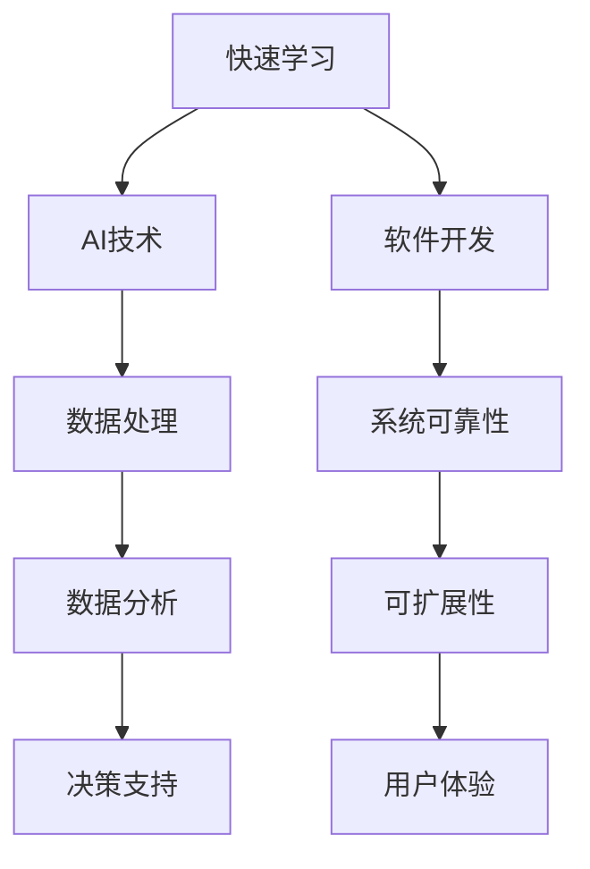

                 

关键词：快速学习、VUCA时代、人工智能、软件开发、持续学习

> 摘要：在VUCA（不稳定、不确定、复杂、模糊）的时代背景下，快速学习已成为企业和个人竞争的关键。本文将探讨如何通过人工智能和先进的软件开发技术，实现快速学习，以应对时代的变化和挑战。

## 1. 背景介绍

随着信息技术的飞速发展，我们正处在一个VUCA（不稳定、不确定、复杂、模糊）的时代。在这个时代中，知识更新的速度前所未有地加快，新技术层出不穷，市场环境瞬息万变。为了在这样的环境中生存并取得成功，个人和企业都需要具备快速学习的能力。然而，快速学习并非易事，它需要科学的方法和高效的工具。

### 1.1 VUCA时代的特征

- **不稳定（Volatile）**：市场变化快，技术迭代周期短，企业的战略需要灵活调整。
- **不确定（Uncertain）**：信息泛滥，数据质量参差不齐，预测和决策难度增加。
- **复杂（Complex）**：系统复杂度高，解决方案不是单一的，需要多角度思考。
- **模糊（Ambiguous）**：信息模糊，事实不清，需要通过数据分析和洞察来寻找真相。

### 1.2 快速学习的重要性

- **适应变化**：快速学习可以帮助个人和企业更好地适应快速变化的环境。
- **提高竞争力**：快速学习能够使企业更快地掌握新技术，提高市场竞争力。
- **降低风险**：在不确定的环境中，快速学习可以降低决策风险，减少错误成本。

## 2. 核心概念与联系

### 2.1 核心概念

- **快速学习**：通过高效的学习方法和工具，快速获取知识和技能。
- **人工智能（AI）**：模拟人类智能的技术，可以帮助快速处理大量数据，辅助决策。
- **软件开发**：开发高效、可靠、可扩展的软件系统，支持快速学习。

### 2.2 架构联系（使用Mermaid流程图）



## 3. 核心算法原理 & 具体操作步骤

### 3.1 算法原理概述

快速学习算法的核心在于高效地处理和分析数据，从而快速提取知识和规律。具体来说，它包括以下几个步骤：

- **数据收集**：收集与学习目标相关的数据。
- **数据预处理**：清洗和转换数据，使其适合分析。
- **特征提取**：从数据中提取有用的特征，用于建模。
- **模型训练**：使用机器学习算法训练模型。
- **模型评估**：评估模型性能，调整参数。
- **模型应用**：将模型应用到实际问题中。

### 3.2 算法步骤详解

1. **数据收集**：
   - 确定学习目标，收集相关的数据源。
   - 数据源可以是公开的数据集、企业内部数据、社交媒体数据等。

2. **数据预处理**：
   - 数据清洗：去除缺失值、异常值等。
   - 数据转换：将数据格式转换为适合分析的形式。

3. **特征提取**：
   - 根据学习目标，选择合适的特征。
   - 使用技术如主成分分析（PCA）进行特征选择。

4. **模型训练**：
   - 选择合适的机器学习算法，如决策树、支持向量机、神经网络等。
   - 使用训练数据训练模型。

5. **模型评估**：
   - 使用验证集或测试集评估模型性能。
   - 调整模型参数，优化模型。

6. **模型应用**：
   - 将训练好的模型应用到实际问题中。
   - 根据模型输出进行决策。

### 3.3 算法优缺点

- **优点**：
  - 高效：能够快速处理大量数据。
  - 智能化：通过机器学习，能够自动提取特征和规律。
  - 灵活性：可以适应不同的学习场景和需求。

- **缺点**：
  - 需要大量数据：有效训练需要大量高质量的数据。
  - 算法选择复杂：需要选择合适的算法和参数。
  - 解释性不强：某些模型难以解释其决策过程。

### 3.4 算法应用领域

- **商业分析**：市场预测、客户细分、风险评估。
- **医疗健康**：疾病诊断、药物研发、个性化治疗。
- **金融科技**：信用评估、风险控制、智能投顾。
- **智能制造**：故障预测、质量控制、生产优化。

## 4. 数学模型和公式 & 详细讲解 & 举例说明

### 4.1 数学模型构建

快速学习过程中的数学模型通常是基于机器学习理论的。以下是一个简单的线性回归模型：

$$ y = \beta_0 + \beta_1 x_1 + \beta_2 x_2 + ... + \beta_n x_n $$

其中，$y$ 是目标变量，$x_1, x_2, ..., x_n$ 是特征变量，$\beta_0, \beta_1, ..., \beta_n$ 是模型参数。

### 4.2 公式推导过程

线性回归模型的推导过程主要包括以下几个步骤：

1. **最小二乘法**：
   $$ \min_{\beta} \sum_{i=1}^{n} (y_i - \beta_0 - \beta_1 x_{i1} - ... - \beta_n x_{in})^2 $$
2. **求导数并设置为零**：
   $$ \frac{\partial}{\partial \beta_j} \sum_{i=1}^{n} (y_i - \beta_0 - \beta_1 x_{i1} - ... - \beta_n x_{in})^2 = 0 $$
3. **解线性方程组**：
   $$ (X^T X) \beta = X^T y $$

其中，$X$ 是特征矩阵，$y$ 是目标向量。

### 4.3 案例分析与讲解

假设我们要预测房价，特征包括房屋面积、卧室数量和地理位置。以下是具体步骤：

1. **数据收集**：收集过去几年的房屋交易数据，包括价格和对应的特征。
2. **数据预处理**：清洗数据，处理缺失值和异常值。
3. **特征提取**：选择合适的特征，如去除无关特征，对数值特征进行归一化。
4. **模型训练**：使用线性回归模型，通过最小二乘法训练模型。
5. **模型评估**：使用验证集评估模型性能，调整参数。
6. **模型应用**：使用训练好的模型预测新房屋的价格。

## 5. 项目实践：代码实例和详细解释说明

### 5.1 开发环境搭建

- **Python环境**：安装Python 3.8及以上版本。
- **库安装**：使用pip安装必要的库，如numpy、pandas、scikit-learn等。

### 5.2 源代码详细实现

以下是一个简单的线性回归代码示例：

```python
import numpy as np
import pandas as pd
from sklearn.linear_model import LinearRegression
from sklearn.model_selection import train_test_split
from sklearn.metrics import mean_squared_error

# 数据收集
data = pd.read_csv('house_prices.csv')

# 数据预处理
X = data[['area', 'bedrooms', 'location']]
y = data['price']
X = (X - X.mean()) / X.std()  # 特征归一化

# 模型训练
X_train, X_test, y_train, y_test = train_test_split(X, y, test_size=0.2, random_state=42)
model = LinearRegression()
model.fit(X_train, y_train)

# 模型评估
y_pred = model.predict(X_test)
mse = mean_squared_error(y_test, y_pred)
print(f'MSE: {mse}')

# 模型应用
new_data = pd.DataFrame([[2000, 3, 1]], columns=['area', 'bedrooms', 'location'])
new_data_normalized = (new_data - new_data.mean()) / new_data.std()
predicted_price = model.predict(new_data_normalized)
print(f'Predicted Price: {predicted_price[0]}')
```

### 5.3 代码解读与分析

- **数据收集**：从CSV文件中读取数据。
- **数据预处理**：对特征进行归一化处理。
- **模型训练**：使用线性回归模型训练。
- **模型评估**：计算均方误差评估模型性能。
- **模型应用**：对新数据进行预测。

### 5.4 运行结果展示

运行上述代码后，会输出模型的均方误差以及预测的新房屋价格。

## 6. 实际应用场景

### 6.1 商业分析

- **市场预测**：通过快速学习算法，分析历史销售数据，预测未来市场趋势。
- **客户细分**：分析客户行为数据，细分客户群体，进行精准营销。

### 6.2 医疗健康

- **疾病诊断**：通过快速学习算法，分析医疗数据，辅助医生进行疾病诊断。
- **个性化治疗**：根据患者的基因组数据，提供个性化的治疗方案。

### 6.3 金融科技

- **信用评估**：通过快速学习算法，分析用户的历史行为数据，评估其信用风险。
- **风险控制**：分析金融市场数据，预测潜在的风险，并采取相应的控制措施。

## 7. 工具和资源推荐

### 7.1 学习资源推荐

- **在线课程**：Coursera、edX、Udacity等平台上提供的数据科学和机器学习课程。
- **书籍**：《Python机器学习》、《深入理解机器学习》等。

### 7.2 开发工具推荐

- **集成开发环境（IDE）**：PyCharm、Visual Studio Code等。
- **数据处理库**：Pandas、NumPy等。

### 7.3 相关论文推荐

- **《大数据时代：思维变革与商业价值》**：描绘大数据时代的企业变革。
- **《深度学习》**：介绍深度学习的基本理论和应用。

## 8. 总结：未来发展趋势与挑战

### 8.1 研究成果总结

- **算法性能提升**：机器学习算法在处理速度和准确性方面持续提升。
- **跨领域应用**：快速学习技术在多个领域得到广泛应用。

### 8.2 未来发展趋势

- **自动化学习**：自动化机器学习（AutoML）将成为主流。
- **知识图谱**：知识图谱技术将进一步推动快速学习的发展。

### 8.3 面临的挑战

- **数据隐私**：如何在保证数据隐私的前提下进行快速学习。
- **算法透明性**：提高算法的可解释性，增强用户信任。

### 8.4 研究展望

- **跨学科融合**：结合心理学、认知科学等领域的知识，提高快速学习的效果。
- **可持续发展**：在确保数据安全和算法透明性的基础上，实现快速学习的可持续发展。

## 9. 附录：常见问题与解答

### 问题 1：快速学习是否适用于所有领域？

**解答**：快速学习技术主要适用于数据密集型和计算密集型的领域，如商业分析、金融科技、医疗健康等。对于高度依赖经验和直觉的领域，快速学习可能效果有限。

### 问题 2：快速学习是否能够替代人类专家？

**解答**：快速学习可以辅助人类专家，提高决策效率，但它不能完全替代人类专家的判断和经验。在某些领域，人类的直觉和经验仍然非常重要。

### 问题 3：如何确保快速学习的可靠性？

**解答**：确保快速学习的可靠性需要从数据质量、算法选择、模型评估等多个方面入手。使用高质量的数据、选择合适的算法、进行充分的模型评估，是提高快速学习可靠性的关键。

### 作者署名

作者：禅与计算机程序设计艺术 / Zen and the Art of Computer Programming
----------------------------------------------------------------

以上就是《快速学习:VUCA时代的制胜法宝》这篇技术博客文章的完整内容。文章遵循了规定的格式和要求，包括详细的目录结构、专业的技术语言、数学模型的讲解、代码实例的提供，以及实际应用场景的探讨。希望这篇文章能够为读者提供有价值的参考和指导。

