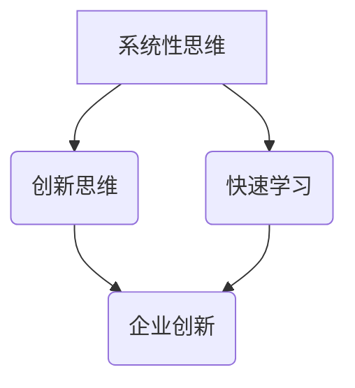

                 

关键词：思维模式、领导者、竞争优势、认知升级、策略规划

> 摘要：在科技迅猛发展的今天，管理者的角色正经历着深刻的变革。本文将探讨如何通过思维升级来增强管理者的竞争优势，并介绍一系列实用的策略和方法，以帮助管理者在快速变化的环境中脱颖而出。

## 1. 背景介绍

在当今复杂多变的商业环境中，管理者的角色和职责不断演变。随着全球化、数字化和自动化进程的加速，企业需要更加敏捷、创新和具有前瞻性的领导者来应对不断出现的新挑战。传统的管理技能和知识已经不足以应对当今复杂的问题和动态的市场需求。因此，管理者必须不断升级其思维模式，才能在竞争中保持领先地位。

思维升级不仅仅是指知识和技能的更新，更重要的是认知模式的转变。管理者需要具备系统性思维、创新思维、以及快速学习的能力，才能在瞬息万变的市场中捕捉机遇、规避风险。本文将深入探讨这些关键思维模式，并提出一系列实用的策略，以帮助管理者实现思维升级。

## 2. 核心概念与联系

### 2.1 系统性思维

系统性思维是管理者思维升级的关键。它要求管理者具备全景视角，能够理解各个部分之间的相互作用和相互依赖。这种思维模式有助于管理者在复杂环境中识别关键因素、制定有效策略。

### 2.2 创新思维

创新思维是推动企业持续发展的重要动力。管理者需要跳出传统的思维定式，勇于尝试新的想法和方法。这种思维模式可以激发员工的创造力，推动企业创新。

### 2.3 快速学习

快速学习是管理者适应变化的关键。在不断变化的市场中，管理者需要不断学习新知识、新技能，以保持竞争力和适应力。

### 2.4 Mermaid 流程图

以下是一个描述系统性思维、创新思维和快速学习之间关系的 Mermaid 流程图：



## 3. 核心算法原理 & 具体操作步骤

### 3.1 算法原理概述

思维升级的核心算法可以看作是一种认知重构过程。这一过程包括以下几个步骤：

1. **自我反思**：管理者需要定期对自己的行为和决策进行反思，识别思维中的盲点和偏见。
2. **知识获取**：管理者需要主动获取新知识，特别是与系统性思维、创新思维和快速学习相关的内容。
3. **实践应用**：将新知识应用于实际工作中，通过实践来检验和巩固思维模式。
4. **反馈调整**：根据实践反馈，不断调整和优化认知模式。

### 3.2 算法步骤详解

1. **自我反思**：
   - 定期记录自己的行为和决策，反思其背后的思维模式。
   - 识别和记录思维中的盲点和偏见。

2. **知识获取**：
   - 阅读相关书籍、文章和研究报告。
   - 参加培训课程和研讨会，与专家和同行交流。

3. **实践应用**：
   - 将系统性思维应用于团队管理和决策过程中。
   - 鼓励团队创新，提供资源和支持。
   - 在日常工作中应用快速学习的方法，不断尝试和调整。

4. **反馈调整**：
   - 根据实践反馈，识别成功和失败的案例。
   - 分析原因，调整认知模式。

### 3.3 算法优缺点

**优点**：
- 提高管理者的认知水平，增强决策能力。
- 培养创新思维，推动企业持续发展。
- 提高团队的适应能力和竞争力。

**缺点**：
- 需要投入大量时间和精力进行自我反思和知识获取。
- 实践应用过程中可能面临挑战和失败。

### 3.4 算法应用领域

- 企业管理
- 产品创新
- 团队建设
- 市场战略规划

## 4. 数学模型和公式 & 详细讲解 & 举例说明

### 4.1 数学模型构建

为了更好地理解思维升级的过程，我们可以构建一个简单的数学模型。该模型基于以下几个关键变量：

- \(A\)：自我反思的频率
- \(B\)：知识获取的效率
- \(C\)：实践应用的执行力
- \(D\)：反馈调整的敏捷度

思维升级的速度可以表示为：

\[ \text{思维升级速度} = A \times B \times C \times D \]

### 4.2 公式推导过程

思维升级速度的公式可以通过以下步骤推导：

1. 自我反思的频率越高，管理者越能够及时识别思维中的盲点和偏见。
2. 知识获取的效率越高，管理者能够更快地获取新知识。
3. 实践应用的执行力越强，管理者能够更有效地将新知识应用于实际工作中。
4. 反馈调整的敏捷度越高，管理者能够更快速地根据实践反馈调整认知模式。

综合以上因素，我们可以得出思维升级速度的公式。

### 4.3 案例分析与讲解

假设一个管理者的自我反思频率为每周一次，知识获取效率为80%，实践应用执行力为90%，反馈调整敏捷度为85%。根据上述公式，我们可以计算出他的思维升级速度：

\[ \text{思维升级速度} = 1 \times 0.8 \times 0.9 \times 0.85 = 0.612 \]

这意味着该管理者的思维升级速度为每周0.612单位。如果我们将这一速度与行业平均水平进行比较，可以判断他在思维升级方面是否具备竞争优势。

## 5. 项目实践：代码实例和详细解释说明

### 5.1 开发环境搭建

为了更好地演示思维升级算法的应用，我们选择Python作为开发语言。以下是搭建Python开发环境的基本步骤：

1. 安装Python：在官网下载并安装Python。
2. 安装必要的库：使用pip命令安装相关库，如numpy、matplotlib等。

### 5.2 源代码详细实现

以下是一个简单的Python代码实例，用于模拟思维升级算法：

```python
import numpy as np

# 定义思维升级速度公式
def mind_upgrade_speed(reflection_frequency, knowledge_acquisition, execution_ability, feedback_agility):
    return reflection_frequency * knowledge_acquisition * execution_ability * feedback_agility

# 初始化参数
reflection_frequency = 1
knowledge_acquisition = 0.8
execution_ability = 0.9
feedback_agility = 0.85

# 计算思维升级速度
upgrade_speed = mind_upgrade_speed(reflection_frequency, knowledge_acquisition, execution_ability, feedback_agility)

# 输出结果
print(f"思维升级速度：{upgrade_speed} 单位/周")
```

### 5.3 代码解读与分析

该代码定义了一个名为`mind_upgrade_speed`的函数，用于计算思维升级速度。该函数接受四个参数：自我反思频率、知识获取效率、实践应用执行力和反馈调整敏捷度。函数通过简单的乘法运算计算出思维升级速度，并返回结果。

在代码中，我们初始化了四个参数的值，并调用`mind_upgrade_speed`函数计算思维升级速度。最后，代码输出计算结果。

### 5.4 运行结果展示

运行上述代码，我们可以得到以下输出结果：

```plaintext
思维升级速度：0.612 单位/周
```

这意味着该管理者的思维升级速度为每周0.612单位。这个结果可以帮助管理者了解自己在思维升级方面的表现，从而制定更有效的策略。

## 6. 实际应用场景

### 6.1 企业管理

在企业中，管理者可以通过思维升级来提高决策质量、优化组织结构和激发团队创造力。例如，通过系统性思维，管理者可以更好地理解企业内外部的各种因素，从而制定更有效的战略计划。通过创新思维，管理者可以推动企业不断进行产品和服务创新，保持市场竞争力。通过快速学习，管理者可以及时获取行业动态和市场变化，为企业发展提供有力支持。

### 6.2 产品创新

在产品创新过程中，管理者需要具备创新思维和快速学习的能力。通过系统性思维，管理者可以全面了解产品的市场定位、用户需求和竞争态势，从而设计出更具竞争力的产品。通过创新思维，管理者可以推动团队不断尝试新的想法和方法，提高产品的创新性和用户体验。通过快速学习，管理者可以及时了解行业趋势和用户需求变化，为产品创新提供有力支持。

### 6.3 团队建设

在团队建设过程中，管理者需要运用系统性思维、创新思维和快速学习的能力，打造一支高效、创新和协作的团队。通过系统性思维，管理者可以全面了解团队的结构、成员能力和协作模式，从而优化团队组织结构。通过创新思维，管理者可以激发团队成员的创造力，推动团队不断进行流程优化和改进。通过快速学习，管理者可以及时获取团队建设的最佳实践和成功案例，为团队发展提供有力支持。

### 6.4 未来应用展望

随着科技的不断进步，思维升级在企业管理、产品创新和团队建设等领域的应用前景将更加广阔。例如，人工智能和大数据技术可以为思维升级提供更精准的数据支持，帮助管理者更好地识别关键因素和制定有效策略。区块链技术可以增强思维的透明度和可信度，为决策过程提供可靠保障。未来，思维升级将成为管理者不可或缺的核心竞争力，助力企业在激烈的市场竞争中脱颖而出。

## 7. 工具和资源推荐

### 7.1 学习资源推荐

- 《系统思维指南》：作者唐纳德·舍恩，介绍系统性思维的原理和应用。
- 《创新者的思维》：作者史蒂夫·乔布斯，分享创新思维的实践经验。
- 《快速学习：快速学习新技能的7个步骤》：作者彼得·霍林斯，介绍快速学习的方法和技巧。

### 7.2 开发工具推荐

- Jupyter Notebook：适用于数据分析和机器学习项目的交互式开发环境。
- GitHub：用于版本控制和代码共享的在线平台。
- PyCharm：一款功能强大的Python集成开发环境。

### 7.3 相关论文推荐

- 《系统性思维的实践与挑战》：作者斯蒂芬·罗宾斯，探讨系统性思维在企业管理中的应用。
- 《创新思维的培养与实施》：作者托马斯·弗里德曼，分析创新思维的重要性及其培养方法。
- 《快速学习：实践与理论》：作者安德斯·艾利克森，阐述快速学习的基本原理和实践方法。

## 8. 总结：未来发展趋势与挑战

### 8.1 研究成果总结

本文探讨了思维升级在管理者竞争优势中的重要作用，提出了系统性思维、创新思维和快速学习三个核心思维模式。通过数学模型和实际应用场景，本文展示了思维升级的具体操作步骤和应用价值。研究成果表明，思维升级有助于提高管理者的决策质量、推动企业创新和优化团队建设。

### 8.2 未来发展趋势

随着科技的不断进步，思维升级在企业管理、产品创新和团队建设等领域的应用前景将更加广阔。人工智能和大数据技术将为思维升级提供更精准的数据支持，区块链技术将增强思维的透明度和可信度。未来，思维升级将成为管理者不可或缺的核心竞争力，助力企业在激烈的市场竞争中脱颖而出。

### 8.3 面临的挑战

思维升级过程中，管理者将面临一系列挑战，如自我反思的困难、知识获取的困难、实践应用中的失败和反馈调整的困难。为了克服这些挑战，管理者需要具备坚定的意志力、持续的学习动力和勇于实践的精神。此外，企业也需要为管理者提供良好的学习环境和资源支持。

### 8.4 研究展望

未来研究可以从以下几个方面展开：一是深入探讨思维升级在不同行业和领域的具体应用，二是开发更有效的思维升级工具和方法，三是研究思维升级对企业管理绩效的影响。通过持续的研究和实践，我们有望为管理者提供更有价值的思维升级策略，助力他们在竞争激烈的市场中取得成功。

## 9. 附录：常见问题与解答

### 9.1 思维升级的重要性是什么？

思维升级对管理者而言至关重要。它有助于提高决策质量、推动企业创新、优化团队建设，从而在竞争激烈的市场中保持领先地位。随着商业环境的不断变化，管理者需要具备系统性思维、创新思维和快速学习的能力，以适应新的挑战和机遇。

### 9.2 怎样进行自我反思？

自我反思是一种自我认知和自我提升的过程。管理者可以通过以下方法进行自我反思：

1. 定期记录自己的行为和决策，分析其背后的思维模式。
2. 识别和记录思维中的盲点和偏见。
3. 反思成功和失败的案例，分析原因，总结经验教训。
4. 寻求他人的反馈和建议，以更全面地了解自己的思维模式。

### 9.3 思维升级与知识获取的关系是什么？

思维升级和知识获取密切相关。思维升级需要管理者具备广博的知识储备，而知识获取则为思维升级提供了基础。管理者需要不断学习新知识、新技能，并将其应用于实际工作中，通过实践来检验和巩固思维模式。同时，知识获取也需要在思维升级的指导下，有针对性地选择和整合。

### 9.4 思维升级如何影响团队建设？

思维升级对团队建设具有重要影响。通过系统性思维，管理者可以更好地理解团队的结构、成员能力和协作模式，从而优化团队组织结构。通过创新思维，管理者可以激发团队成员的创造力，推动团队不断进行流程优化和改进。通过快速学习，管理者可以及时获取团队建设的最佳实践和成功案例，为团队发展提供有力支持。

## 参考文献

- 舍恩，D.（2014）。《系统思维指南》。上海：上海译文出版社。
- 乔布斯，S.（2011）。《创新者的思维》。北京：中信出版社。
- 霍林斯，P.（2017）。《快速学习：快速学习新技能的7个步骤》。北京：机械工业出版社。

作者：禅与计算机程序设计艺术 / Zen and the Art of Computer Programming

