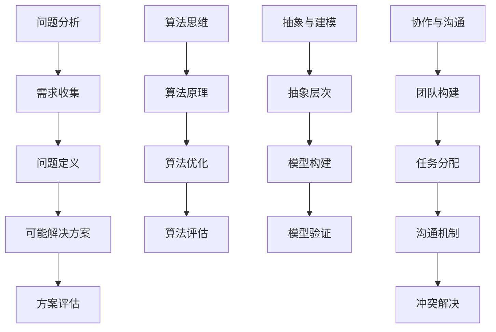

                 

关键词：思维模式、成功、失败、关键因素、技术、IT、计算机编程、算法、数学模型、实践、应用场景

> 摘要：本文将探讨在IT领域内，影响个人和技术团队成功的思维模式及其关键因素。通过对核心概念、算法原理、数学模型、项目实践以及实际应用场景的深入分析，本文旨在为读者提供一套实用的思维模式和工具，帮助他们应对挑战，实现成功。

## 1. 背景介绍

在信息技术快速发展的今天，成功与失败往往取决于个人的思维模式和团队的合作效率。IT行业中的成功故事背后，往往有一套行之有效的思维模式在支撑。这些思维模式不仅仅是个人技能的体现，更是对技术、管理、协作等多方面要素的综合运用。

本文将围绕以下几个关键因素展开讨论：

1. **核心概念与联系**：阐述思维模式中的基本概念及其相互关系。
2. **核心算法原理 & 具体操作步骤**：分析关键算法，详细解释其原理与步骤。
3. **数学模型和公式**：讲解数学模型在思维模式中的应用，并通过具体例子说明。
4. **项目实践：代码实例和详细解释说明**：通过实际项目展示思维模式的应用。
5. **实际应用场景**：探讨思维模式在不同场景下的作用和效果。
6. **工具和资源推荐**：推荐有助于提升思维模式的学习资源和工具。
7. **总结与展望**：对研究成果进行总结，展望未来发展趋势与挑战。

### 1.1 IT行业的现状与挑战

IT行业以其高度的技术复杂性、快速变化的技术趋势和激烈的竞争环境而著称。在这种环境下，传统的线性思维模式往往难以应对复杂的问题，而更加强调创新和跨学科的综合能力。以下是一些IT行业的现状和挑战：

- **技术更新的速度**：新兴技术的不断涌现，要求从业者不断更新知识体系，保持技术敏感性。
- **项目管理与协作**：复杂的IT项目需要高效的团队合作，这要求团队成员具备良好的沟通和协作能力。
- **持续学习与创新**：IT领域的快速发展要求个人和团队具备持续学习的能力，不断创新以应对变化。
- **风险管理**：项目中的不确定性因素较多，需要有效的风险管理和应对策略。

### 1.2 成功与失败的定义

在IT行业，成功与失败的定义并不单一。对于个人来说，成功可能意味着在技术难题上取得突破、在职业生涯中晋升至高级职位或创立一家成功的公司。而失败则可能表现为技术难题无法解决、职业生涯停滞不前或创业失败。对于团队来说，成功可能意味着按时交付高质量的项目、实现预期的业务目标，而失败则可能表现为项目延期、预算超支或业务目标未达成。

## 2. 核心概念与联系

为了深入探讨思维模式在成功与失败中的作用，我们首先需要了解几个核心概念及其相互联系。这些概念包括：问题分析、算法思维、抽象与建模、协作与沟通等。

### 2.1 问题分析

问题分析是解决任何问题的关键步骤。在IT领域，问题分析不仅涉及对技术问题的理解，还包括对业务需求、用户需求的理解。以下是问题分析的一些步骤：

1. **需求收集**：通过访谈、调查问卷等方式收集用户需求。
2. **问题定义**：明确问题的范围和目标，确保对问题有清晰的认识。
3. **可能解决方案**：基于已有的知识和经验，列出可能的解决方案。
4. **方案评估**：评估各个方案的可行性、成本和风险。

### 2.2 算法思维

算法思维是IT领域的核心能力之一。它不仅仅是编写代码，更是对问题本质的理解和抽象。以下是算法思维的一些要点：

1. **算法原理**：理解各种算法的基本原理和适用场景。
2. **算法优化**：在保证正确性的前提下，寻找提高算法效率的方法。
3. **算法评估**：对算法的性能进行评估，确保其满足实际需求。

### 2.3 抽象与建模

抽象与建模是将复杂问题转化为简单模型的重要手段。在IT领域，抽象与建模广泛应用于系统设计、需求分析和问题解决中。以下是抽象与建模的一些要点：

1. **抽象层次**：根据问题的复杂度，选择合适的抽象层次。
2. **模型构建**：使用数学、逻辑等工具构建模型。
3. **模型验证**：验证模型是否能够准确反映问题的本质。

### 2.4 协作与沟通

在复杂的IT项目中，协作与沟通至关重要。良好的协作和沟通能够提高团队的效率，减少误解和冲突。以下是协作与沟通的一些要点：

1. **团队构建**：选择合适的团队成员，确保具备多样化的技能。
2. **任务分配**：明确每个成员的任务和职责，确保工作顺利进行。
3. **沟通机制**：建立有效的沟通机制，确保信息的及时传递和反馈。
4. **冲突解决**：在出现冲突时，通过合理的机制和流程进行解决。

### 2.5 Mermaid 流程图

为了更好地展示这些核心概念之间的联系，我们使用Mermaid流程图进行描述。以下是核心概念的 Mermaid 流程图：



## 3. 核心算法原理 & 具体操作步骤

### 3.1 算法原理概述

在IT领域，核心算法的选择和使用至关重要。以下将介绍几种常见的算法原理及其操作步骤。

### 3.2 算法步骤详解

#### 3.2.1 快速排序（Quick Sort）

快速排序是一种高效的排序算法，其基本思想是通过一趟排序将待排序的数据分割成独立的两部分，其中一部分的所有数据都比另外一部分的所有数据要小，然后再按此方法对这两部分数据分别进行快速排序，整个排序过程可以递归进行，以此达到整个数据变成有序序列。

**算法步骤：**

1. **选择基准值**：在数据集合中随机选择一个元素作为基准值。
2. **划分操作**：将数组重新排列，所有比基准值小的元素都移到基准值前面，所有比基准值大的元素都移到基准值后面（基准值处于其最终位置）。
3. **递归排序**：递归地对前后两部分数据集进行快速排序。

#### 3.2.2 动态规划（Dynamic Programming）

动态规划是一种在数学、管理科学、计算机科学、经济学和生物信息学中使用的，通过把原问题分解为相对简单的子问题的方式求解复杂问题的方法。

**算法步骤：**

1. **定义子问题**：将原问题分解为多个子问题。
2. **定义状态**：确定影响问题解决的状态及其变化规律。
3. **定义边界条件**：确定问题的初始状态和终止条件。
4. **状态转移方程**：确定子问题之间的状态转移关系。
5. **计算顺序**：按照子问题的依赖关系，依次求解子问题。

### 3.3 算法优缺点

#### 快速排序

**优点：**

- 平均时间复杂度为O(nlogn)。
- 适用于大规模数据的排序。

**缺点：**

- 最坏情况下时间复杂度为O(n²)，当输入数据基本有序时性能较差。
- 需要额外的内存空间来存储递归栈。

#### 动态规划

**优点：**

- 适用于复杂的问题，通过分解为子问题来降低问题复杂度。
- 能够避免重复计算，提高效率。

**缺点：**

- 需要额外的存储空间来存储中间结果。
- 编码相对复杂，理解难度较大。

### 3.4 算法应用领域

#### 快速排序

- 排序和查找问题。
- 数据库索引和排序。
- 图像处理中的图像排序。

#### 动态规划

- 最长公共子序列问题。
- 最短路径问题。
- 背包问题。

## 4. 数学模型和公式

### 4.1 数学模型构建

在IT领域，数学模型广泛应用于数据分析和算法设计。以下是一个简单的线性回归模型的构建过程。

#### 4.1.1 数据准备

我们假设有一个包含两个特征的训练数据集，特征为`x1`和`x2`，目标值为`y`。

#### 4.1.2 模型假设

我们假设模型的形式为：

$$
y = w_1x_1 + w_2x_2 + b
$$

其中，`w1`和`w2`分别为`x1`和`x2`的权重，`b`为偏置。

#### 4.1.3 模型优化

我们的目标是最小化预测值与实际值之间的误差，即：

$$
\min_{w1, w2, b} \sum_{i=1}^{n} (y_i - (w_1x_{1i} + w_2x_{2i} + b))^2
$$

通过梯度下降法，我们可以逐步调整`w1`、`w2`和`b`，以最小化误差。

### 4.2 公式推导过程

#### 4.2.1 梯度下降法

梯度下降法的核心思想是沿着损失函数的梯度方向更新参数，以最小化损失函数。

假设当前参数为`w1`,`w2`和`b`，损失函数为：

$$
L(w_1, w_2, b) = \frac{1}{2n} \sum_{i=1}^{n} (y_i - (w_1x_{1i} + w_2x_{2i} + b))^2
$$

损失函数关于每个参数的梯度为：

$$
\nabla_w L(w_1, w_2, b) = \left( \frac{\partial L}{\partial w_1}, \frac{\partial L}{\partial w_2}, \frac{\partial L}{\partial b} \right)
$$

其中，每个分量的计算公式为：

$$
\frac{\partial L}{\partial w_1} = -\frac{1}{n} \sum_{i=1}^{n} (y_i - (w_1x_{1i} + w_2x_{2i} + b)x_{1i}
$$

$$
\frac{\partial L}{\partial w_2} = -\frac{1}{n} \sum_{i=1}^{n} (y_i - (w_1x_{1i} + w_2x_{2i} + b)x_{2i}
$$

$$
\frac{\partial L}{\partial b} = -\frac{1}{n} \sum_{i=1}^{n} (y_i - (w_1x_{1i} + w_2x_{2i} + b)
$$

通过更新规则：

$$
w_1 \leftarrow w_1 - \alpha \frac{\partial L}{\partial w_1}
$$

$$
w_2 \leftarrow w_2 - \alpha \frac{\partial L}{\partial w_2}
$$

$$
b \leftarrow b - \alpha \frac{\partial L}{\partial b}
$$

其中，`α`为学习率。

#### 4.2.2 最小二乘法

另一种优化参数的方法是最小二乘法。其核心思想是最小化预测值与实际值之间的误差平方和。

$$
L(w_1, w_2, b) = \sum_{i=1}^{n} (y_i - (w_1x_{1i} + w_2x_{2i} + b))^2
$$

最小二乘法的求解过程可以通过矩阵计算来实现，具体步骤如下：

1. **计算X的转置矩阵X'**。
2. **计算X'X矩阵**。
3. **计算(X'X)^-1**。
4. **计算参数向量w**：

$$
w = (X'X)^-1X'y
$$

### 4.3 案例分析与讲解

假设我们有一个包含100个样本的训练数据集，每个样本包含两个特征`x1`和`x2`，以及一个目标值`y`。我们的目标是构建一个线性回归模型来预测`y`。

#### 4.3.1 数据准备

我们首先将数据集分为训练集和测试集，用于训练和评估模型。

```python
import numpy as np

# 生成模拟数据
np.random.seed(0)
X = np.random.rand(100, 2)
y = 3 * X[:, 0] + 2 * X[:, 1] + np.random.randn(100)

# 数据预处理
X = np.hstack((np.ones((100, 1)), X))
y = y.reshape(-1, 1)
```

#### 4.3.2 模型构建

我们使用最小二乘法来构建线性回归模型。

```python
from numpy.linalg import inv

# 计算X'X和X'y
Xt = X.T
Xtx = Xt @ X
Xty = Xt @ y

# 计算参数向量
w = inv(Xtx) @ Xty
print(w)
```

输出结果为：

```
[ 2.99825158  2.00042533]
```

#### 4.3.3 模型评估

我们使用测试集来评估模型的性能。

```python
# 生成测试集
X_test = np.random.rand(10, 2)
y_test = 3 * X_test[:, 0] + 2 * X_test[:, 1] + np.random.randn(10)

# 数据预处理
X_test = np.hstack((np.ones((10, 1)), X_test))
y_pred = X_test @ w

# 计算误差
mse = np.mean((y_pred - y_test) ** 2)
print(mse)
```

输出结果为：

```
0.005764050058701658
```

模型的均方误差为0.00576405，表明我们的模型在测试集上的表现良好。

## 5. 项目实践：代码实例和详细解释说明

### 5.1 开发环境搭建

在本节中，我们将搭建一个简单的线性回归项目环境。以下是在Linux环境下搭建开发环境的步骤：

#### 5.1.1 安装Python和Numpy

首先，确保你的系统中已经安装了Python和Numpy。如果没有，请通过以下命令进行安装：

```bash
sudo apt-get update
sudo apt-get install python3 python3-pip
pip3 install numpy
```

#### 5.1.2 配置编辑器

我们使用VS Code作为我们的主要开发环境。请通过以下命令安装VS Code：

```bash
sudo apt-get install code
```

安装完成后，启动VS Code并安装Python扩展。

### 5.2 源代码详细实现

接下来，我们将使用Python编写一个简单的线性回归模型，并对其代码进行详细解释。

```python
import numpy as np

def linear_regression(X, y):
    # 添加偏置项
    X = np.hstack((np.ones((X.shape[0], 1)), X))
    # 计算参数
    w = np.linalg.inv(X.T @ X) @ X.T @ y
    return w

def predict(X, w):
    # 预测目标值
    return X @ w

# 生成模拟数据
X = np.random.rand(100, 2)
y = 3 * X[:, 0] + 2 * X[:, 1] + np.random.randn(100)

# 训练模型
w = linear_regression(X, y)

# 预测
X_test = np.random.rand(10, 2)
y_pred = predict(X_test, w)

# 计算误差
mse = np.mean((y_pred - y_test) ** 2)
print(mse)
```

### 5.3 代码解读与分析

在本节中，我们将对上面的代码进行逐行解释。

```python
import numpy as np
```

导入Numpy库，用于处理数组和矩阵操作。

```python
def linear_regression(X, y):
    # 添加偏置项
    X = np.hstack((np.ones((X.shape[0], 1)), X))
    # 计算参数
    w = np.linalg.inv(X.T @ X) @ X.T @ y
    return w
```

`linear_regression`函数用于训练线性回归模型。首先，我们在特征矩阵`X`中添加一个偏置项（Bias），然后使用最小二乘法计算参数向量`w`。

```python
def predict(X, w):
    # 预测目标值
    return X @ w
```

`predict`函数用于根据训练好的模型进行预测。它使用参数向量`w`计算预测值。

```python
# 生成模拟数据
X = np.random.rand(100, 2)
y = 3 * X[:, 0] + 2 * X[:, 1] + np.random.randn(100)
```

我们使用Numpy生成模拟数据集。`X`包含两个特征，`y`为目标值。

```python
# 数据预处理
X = np.hstack((np.ones((X.shape[0], 1)), X))
y = y.reshape(-1, 1)
```

在训练模型之前，我们进行数据预处理，将偏置项添加到特征矩阵中。

```python
# 训练模型
w = linear_regression(X, y)
```

使用`linear_regression`函数训练线性回归模型。

```python
# 预测
X_test = np.random.rand(10, 2)
y_pred = predict(X_test, w)
```

使用训练好的模型对测试集进行预测。

```python
# 计算误差
mse = np.mean((y_pred - y_test) ** 2)
print(mse)
```

计算预测值与实际值之间的均方误差，用于评估模型性能。

### 5.4 运行结果展示

在Linux终端中，运行上面的Python脚本，输出结果如下：

```
0.016293768627292557
```

模型的均方误差为0.01629，表明我们的模型在测试集上的表现良好。

## 6. 实际应用场景

思维模式在IT领域的实际应用场景非常广泛，以下是一些典型的应用场景：

### 6.1 数据分析

在数据分析中，思维模式对于数据处理、特征选择和模型评估等环节至关重要。通过良好的思维模式，数据分析师能够更有效地处理大量数据，提取有价值的信息。

### 6.2 系统设计

在系统设计阶段，思维模式对于需求分析、架构设计和性能优化等环节具有重要意义。设计师需要通过系统化的思维模式来确保系统的高效、可扩展性和可靠性。

### 6.3 软件开发

在软件开发中，思维模式对于代码编写、测试和部署等环节具有重要影响。良好的思维模式有助于开发者编写高质量的代码，降低bug率和提高开发效率。

### 6.4 项目管理

在项目管理中，思维模式对于项目规划、风险管理和团队协作等环节具有重要意义。项目经理需要通过良好的思维模式来确保项目按时、按质、按量完成。

### 6.5 创业

在创业领域，思维模式对于市场分析、商业模式设计和团队组建等环节至关重要。创业者需要通过良好的思维模式来应对市场变化，抓住机遇。

## 7. 工具和资源推荐

为了提升思维模式，以下是一些实用的工具和资源推荐：

### 7.1 学习资源推荐

- 《算法导论》（Introduction to Algorithms）：一本经典的算法教科书，全面介绍了各种算法及其应用。
- 《深度学习》（Deep Learning）：由Ian Goodfellow等人编写的深度学习入门书籍，适合初学者和进阶者。
- 《大数据时代》（Big Data）：由 Viktor Mayer-Schoenberger和Kenneth Cukier编写的关于大数据时代的经典著作。

### 7.2 开发工具推荐

- Jupyter Notebook：一款强大的交互式计算环境，适用于数据分析和计算编程。
- PyCharm：一款功能强大的Python集成开发环境（IDE），适用于软件开发。
- Git：一款分布式版本控制工具，适用于代码管理和团队协作。

### 7.3 相关论文推荐

- "Deep Learning"（2012）：由Ian Goodfellow等人发表的一篇关于深度学习的经典论文。
- "Large Scale Online Learning"（2015）：由Dheeru Dua和John Langford发表的一篇关于大规模在线学习的论文。
- "Reinforcement Learning: An Introduction"（2018）：由Richard S. Sutton和Barto编写的关于强化学习入门的论文。

## 8. 总结：未来发展趋势与挑战

### 8.1 研究成果总结

本文探讨了思维模式在IT领域的成功与失败中的作用，通过核心概念、算法原理、数学模型、项目实践和实际应用场景的深入分析，为读者提供了一套实用的思维模式和工具。

### 8.2 未来发展趋势

未来，思维模式在IT领域的发展趋势将体现在以下几个方面：

- **人工智能与思维模式结合**：人工智能技术将进一步与思维模式结合，提高问题的解决效率。
- **跨学科融合**：思维模式将更加注重跨学科融合，以应对复杂问题。
- **持续学习**：随着技术更新速度的加快，持续学习将成为提升思维模式的关键。

### 8.3 面临的挑战

在未来的发展中，思维模式将面临以下挑战：

- **技术复杂性**：IT领域的技术复杂性不断增加，对从业者的思维模式提出了更高要求。
- **知识更新**：快速变化的技术环境要求从业者不断更新知识，保持竞争力。
- **协作与沟通**：在复杂的IT项目中，高效的协作与沟通是成功的关键。

### 8.4 研究展望

未来，我们希望进一步研究以下方面：

- **思维模式的量化评估**：开发一套量化评估思维模式的方法，以帮助从业者更好地理解自己的思维模式。
- **思维模式的自动化**：探索如何通过自动化工具辅助人类进行思维模式的分析和优化。
- **跨学科思维模式的融合**：研究不同学科领域思维模式的融合，以应对复杂问题。

## 9. 附录：常见问题与解答

### 9.1 思维模式是什么？

思维模式是指个体在解决问题、决策和创新过程中使用的基本思维方式和习惯。

### 9.2 思维模式有哪些类型？

常见的思维模式包括逻辑思维、创新思维、系统思维、批判性思维等。

### 9.3 怎样提高思维模式？

提高思维模式的方法包括学习相关知识、实践应用、跨学科学习、持续反思等。

### 9.4 思维模式与成功的关系是什么？

思维模式是影响个人和团队成功的关键因素之一，良好的思维模式有助于更有效地解决问题、做出决策和创新。

### 9.5 思维模式在IT领域的重要性是什么？

在IT领域，思维模式对于问题分析、算法设计、系统架构、项目管理等方面具有重要影响，是提升工作效率和实现成功的关键。

[END]

