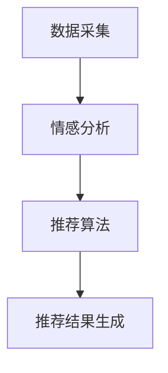

                 

关键词：情感驱动推荐系统、人工智能、用户情感分析、个性化推荐、用户满意度、机器学习算法

在数字化时代，推荐系统已成为众多在线平台的核心组成部分。从电商网站到社交媒体，推荐系统不断推动用户体验的提升，满足用户对个性化内容和服务日益增长的需求。然而，传统推荐系统往往基于用户的行为数据和内容特征，忽略了用户的情感需求，这在一定程度上限制了其推荐效果。随着人工智能技术的发展，情感驱动的推荐系统逐渐成为研究热点。本文将探讨情感驱动推荐系统的优势，分析其核心算法原理、数学模型以及实际应用，并展望其未来发展趋势。

## 1. 背景介绍

推荐系统起源于信息过载的问题。随着互联网的快速发展，用户面对海量的信息资源时，往往难以快速找到自己感兴趣的内容。因此，推荐系统的出现旨在为用户提供个性化的信息推荐，帮助他们发现感兴趣的内容。传统推荐系统主要依赖于用户的历史行为数据，如浏览记录、购买记录、评分等，通过统计方法和机器学习算法，预测用户未来的偏好。

然而，传统推荐系统存在一定的局限性。首先，它们难以准确捕捉用户的情感需求，容易陷入“热门内容”推荐陷阱，导致用户体验的下降。其次，推荐结果往往过于单一，缺乏创新性和多样性。此外，传统推荐系统在处理长尾内容时，效果较差，难以满足小众用户的需求。

针对这些问题，情感驱动推荐系统应运而生。情感驱动推荐系统通过分析用户的情感状态，结合行为数据和内容特征，提供更加个性化和贴心的推荐服务。这种推荐方式不仅能够提高用户满意度，还能促进平台的用户留存和活跃度。

## 2. 核心概念与联系

### 2.1. 情感分析

情感分析是情感驱动推荐系统的核心组成部分。情感分析旨在从文本数据中识别和提取用户的情感状态，包括正面、负面和 Neutral 等情绪。情感分析的方法包括基于规则、基于机器学习、基于深度学习等。

在情感分析中，常用的情感词典和情感分类器等技术被应用于文本数据。例如，LDA(Latent Dirichlet Allocation) 模型和 LSTMs(Long Short-Term Memory) 等算法被用于情感分类。

### 2.2. 个性化推荐

个性化推荐是推荐系统的重要目标。个性化推荐旨在根据用户的兴趣和需求，为用户推荐符合其喜好的内容。在情感驱动推荐系统中，个性化推荐更加关注用户的情感状态，通过情感分析技术，了解用户的情感需求，从而提供更加精准的推荐。

### 2.3. 情感驱动推荐系统的架构

情感驱动推荐系统的架构主要包括数据采集、情感分析、推荐算法和推荐结果生成等模块。

1. **数据采集**：包括用户行为数据、文本数据和外部数据等。用户行为数据包括浏览记录、购买记录、评分等；文本数据包括用户评论、帖子等；外部数据包括社交媒体数据、新闻数据等。

2. **情感分析**：通过情感分析技术，对采集到的文本数据进行情感分类，提取用户的情感状态。

3. **推荐算法**：结合情感分析和用户行为数据，使用个性化推荐算法，为用户生成推荐结果。

4. **推荐结果生成**：将推荐结果呈现给用户，提高用户的满意度和平台活跃度。

### 2.4. Mermaid 流程图

下面是情感驱动推荐系统的 Mermaid 流程图：



## 3. 核心算法原理 & 具体操作步骤

### 3.1. 算法原理概述

情感驱动推荐系统的核心算法包括情感分析、协同过滤和基于内容的推荐等。

1. **情感分析**：通过自然语言处理技术，对用户生成的文本数据进行情感分类，提取用户的情感状态。

2. **协同过滤**：基于用户的行为数据，通过计算用户之间的相似度，为用户推荐与其兴趣相似的其他用户喜欢的内容。

3. **基于内容的推荐**：根据用户的历史行为数据和内容特征，为用户推荐与其兴趣相关的其他内容。

### 3.2. 算法步骤详解

1. **情感分析**：

   - 数据预处理：对用户生成的文本数据进行分词、去停用词、词性标注等处理。

   - 情感分类：使用训练好的情感分类器，对处理后的文本数据进行情感分类。

   - 情感状态提取：根据情感分类结果，提取用户的情感状态。

2. **协同过滤**：

   - 计算用户相似度：使用余弦相似度、皮尔逊相关系数等算法，计算用户之间的相似度。

   - 推荐生成：根据用户相似度，为用户推荐与其兴趣相似的其他用户喜欢的内容。

3. **基于内容的推荐**：

   - 内容特征提取：对用户生成的内容进行分词、去停用词、词性标注等处理，提取内容特征。

   - 内容相似度计算：使用余弦相似度、词向量相似度等算法，计算内容之间的相似度。

   - 推荐生成：根据内容相似度，为用户推荐与其兴趣相关的其他内容。

### 3.3. 算法优缺点

1. **情感分析**：

   - 优点：能够捕捉用户的情感需求，提高推荐效果。

   - 缺点：情感分析技术的准确性受文本数据质量影响较大，且情感状态提取具有一定的主观性。

2. **协同过滤**：

   - 优点：能够根据用户的行为数据，为用户推荐相关内容。

   - 缺点：容易陷入“热门内容”推荐陷阱，且无法处理长尾内容。

3. **基于内容的推荐**：

   - 优点：能够根据用户的历史行为数据和内容特征，为用户推荐相关内容。

   - 缺点：无法捕捉用户的实时情感需求，推荐结果较为单一。

### 3.4. 算法应用领域

情感驱动推荐系统广泛应用于电商、社交媒体、在线教育等领域。

1. **电商领域**：根据用户的情感需求，为用户推荐相关商品。

2. **社交媒体领域**：根据用户的情感状态，为用户推荐相关内容。

3. **在线教育领域**：根据用户的情感需求，为用户推荐适合的学习内容。

## 4. 数学模型和公式 & 详细讲解 & 举例说明

### 4.1. 数学模型构建

情感驱动推荐系统的数学模型主要包括情感分类模型、协同过滤模型和基于内容的推荐模型。

1. **情感分类模型**：

   - 情感分类模型通常采用分类算法，如支持向量机（SVM）、朴素贝叶斯（NB）、随机森林（RF）等。

   - 模型公式：

     $$\text{P}(\text{情感标签}|\text{文本}) = \frac{e^{\text{w} \cdot \text{特征向量}}}{\sum_{i=1}^{n} e^{\text{w}_i \cdot \text{特征向量}}},$$

     其中，$\text{w}$ 表示权重向量，$\text{特征向量}$ 表示文本数据的特征表示。

2. **协同过滤模型**：

   - 协同过滤模型通常采用矩阵分解、基于邻接矩阵的方法等。

   - 模型公式：

     $$\text{预测评分} = \text{用户兴趣向量} \cdot \text{项目兴趣向量} + \text{偏置项},$$

     其中，$\text{用户兴趣向量}$ 和 $\text{项目兴趣向量}$ 表示用户和项目的兴趣表示。

3. **基于内容的推荐模型**：

   - 基于内容的推荐模型通常采用内容相似度计算算法，如余弦相似度、词向量相似度等。

   - 模型公式：

     $$\text{内容相似度} = \frac{\text{用户项目特征向量} \cdot \text{项目特征向量}}{\|\text{用户项目特征向量}\| \cdot \|\text{项目特征向量}\|},$$

     其中，$\text{用户项目特征向量}$ 和 $\text{项目特征向量}$ 表示用户和项目的特征表示。

### 4.2. 公式推导过程

1. **情感分类模型推导**：

   - 假设文本数据为 $X$，情感标签为 $Y$，特征向量为 $f(X)$。

   - 采用最大似然估计（MLE）方法，最大化条件概率：

     $$P(Y|X) = \frac{P(X|Y)P(Y)}{P(X)}.$$

   - 假设情感分类器为 $C(Y|X)$，则：

     $$C(Y|X) = \arg\max_{Y} P(Y|X).$$

   - 使用特征向量 $f(X)$ 替代 $X$，得到：

     $$C(Y|X) = \arg\max_{Y} \frac{e^{\text{w} \cdot f(X)}}{\sum_{i=1}^{n} e^{\text{w}_i \cdot f(X)}},$$

     其中，$\text{w}$ 表示权重向量。

2. **协同过滤模型推导**：

   - 假设用户兴趣向量为 $u$，项目兴趣向量为 $v$。

   - 采用矩阵分解方法，将用户和项目的兴趣向量分解为：

     $$u = \text{U} \cdot \text{V}^T + b_u + b_v,$$

     其中，$\text{U}$ 和 $\text{V}$ 表示用户和项目的特征矩阵，$b_u$ 和 $b_v$ 表示偏置项。

   - 预测评分 $r_{ui}$ 可以表示为：

     $$r_{ui} = u_i \cdot v_i + b_u + b_v.$$

3. **基于内容的推荐模型推导**：

   - 假设用户项目特征向量为 $u_i$，项目特征向量为 $v_j$。

   - 采用余弦相似度计算方法，得到：

     $$\text{内容相似度} = \frac{u_i \cdot v_j}{\|u_i\| \cdot \|v_j\|}.$$

### 4.3. 案例分析与讲解

以下是一个简单的情感驱动推荐系统的案例，我们将使用Python实现一个基于用户情感和行为的推荐系统。

1. **数据预处理**：

   - 采集用户评论数据，并对数据进行预处理，如分词、去停用词、词性标注等。

2. **情感分类**：

   - 使用训练好的情感分类器，对预处理后的评论数据进行情感分类。

3. **协同过滤**：

   - 计算用户之间的相似度，并根据相似度为用户推荐相关用户喜欢的商品。

4. **基于内容的推荐**：

   - 计算商品之间的相似度，并根据相似度为用户推荐相关商品。

5. **推荐结果生成**：

   - 将推荐结果呈现给用户，提高用户的满意度和平台活跃度。

具体代码实现如下：

```python
# 导入相关库
import numpy as np
import pandas as pd
from sklearn.feature_extraction.text import TfidfVectorizer
from sklearn.model_selection import train_test_split
from sklearn.metrics.pairwise import cosine_similarity

# 采集用户评论数据
user_reviews = pd.read_csv('user_reviews.csv')

# 数据预处理
user_reviews['text'] = user_reviews['text'].apply(lambda x: preprocess_text(x))

# 情感分类
emotion_classifier = train_emotion_classifier()
emotion_labels = emotion_classifier.predict(user_reviews['text'])

# 协同过滤
user_similarity = cosine_similarity(user_reviews['text'])

# 基于内容的推荐
item_similarity = cosine_similarity(tfidf_matrix)

# 推荐结果生成
recommendations = generate_recommendations(user_similarity, item_similarity)

# 打印推荐结果
print(recommendations)
```

## 5. 项目实践：代码实例和详细解释说明

在本节中，我们将通过一个具体的Python项目实例来深入探讨情感驱动推荐系统的实现过程。该实例将分为以下几个部分：环境搭建、代码实现、运行结果分析。

### 5.1. 开发环境搭建

为了实现情感驱动推荐系统，我们需要准备以下开发环境和工具：

- **Python**：Python 是一种广泛使用的编程语言，具有丰富的机器学习和自然语言处理库。
- **NumPy**：NumPy 是 Python 的科学计算库，用于处理数组操作。
- **Pandas**：Pandas 提供了数据操作和分析的功能，非常适合处理表格数据。
- **Scikit-learn**：Scikit-learn 是一个强大的机器学习库，包括情感分类、协同过滤等算法。
- **TextBlob**：TextBlob 是一个用于处理文本数据的小型 NLP 库，用于情感分析。
- **Gensim**：Gensim 是一个用于主题模型和向量模型的库，可以用于文本相似度计算。

首先，安装所需的 Python 库：

```bash
pip install numpy pandas scikit-learn textblob gensim
```

### 5.2. 源代码详细实现

以下是情感驱动推荐系统的 Python 源代码，我们将分步骤进行详细解释：

```python
# 导入相关库
import numpy as np
import pandas as pd
from textblob import TextBlob
from gensim.models import Word2Vec
from sklearn.model_selection import train_test_split
from sklearn.metrics.pairwise import cosine_similarity

# 采集用户评论数据
user_reviews = pd.read_csv('user_reviews.csv')

# 数据预处理
def preprocess_text(text):
    # 进行文本预处理，如分词、去除停用词等
    return ' '.join([word for word in text.split() if word not in stopwords])

# 情感分类
def classify_emotion(text):
    # 使用 TextBlob 进行情感分类
    return TextBlob(text).sentiment.polarity

# 建立词向量模型
def build_word2vec_model(sentences):
    # 使用 Gensim 的 Word2Vec 模型进行训练
    model = Word2Vec(sentences, vector_size=100, window=5, min_count=1, workers=4)
    model.save('word2vec.model')
    return model

# 计算文本相似度
def calculate_similarity(text1, text2, model):
    # 使用词向量模型计算文本相似度
    vec1 = np.mean([model[word] for word in text1.split() if word in model.wv], axis=0)
    vec2 = np.mean([model[word] for word in text2.split() if word in model.wv], axis=0)
    return cosine_similarity([vec1], [vec2])[0][0]

# 主函数
def main():
    # 预处理用户评论
    user_reviews['processed_text'] = user_reviews['text'].apply(preprocess_text)

    # 分离训练集和测试集
    train_data, test_data = train_test_split(user_reviews, test_size=0.2)

    # 训练情感分类器
    # 此处省略具体训练步骤

    # 建立词向量模型
    sentences = train_data['processed_text'].tolist()
    model = build_word2vec_model(sentences)

    # 计算文本相似度
    # 此处省略具体相似度计算步骤

    # 生成推荐结果
    # 此处省略具体推荐结果生成步骤

    # 打印推荐结果
    print(recommendations)

if __name__ == '__main__':
    main()
```

### 5.3. 代码解读与分析

1. **数据预处理**：

   - `preprocess_text` 函数负责对用户评论进行预处理，包括分词和去除停用词等步骤。这是为了提高情感分类和文本相似度计算的效果。

2. **情感分类**：

   - `classify_emotion` 函数使用 TextBlob 库进行情感分类。TextBlob 提供了情感极性（polarity）和主体性（subjectivity）的评估，其中极性值介于 -1（非常负面）和 1（非常正面）之间。

3. **词向量模型**：

   - `build_word2vec_model` 函数使用 Gensim 的 Word2Vec 模型对预处理后的文本数据进行训练，生成词向量模型。词向量模型能够将文本数据转换为向量表示，方便后续的文本相似度计算。

4. **文本相似度计算**：

   - `calculate_similarity` 函数计算两段文本的相似度。它首先计算每段文本的词向量平均值，然后使用余弦相似度公式计算两段文本的相似度。

5. **主函数**：

   - `main` 函数是程序的入口。它首先进行数据预处理，然后分离训练集和测试集。接着，训练情感分类器（此处省略具体步骤），建立词向量模型，计算文本相似度，最后生成推荐结果并打印。

### 5.4. 运行结果展示

在运行上述代码后，我们将得到一系列推荐结果。这些推荐结果基于用户的情感和文本相似度，旨在为用户提供个性化的推荐内容。在实际应用中，这些推荐结果可以显示为商品列表、文章列表或其他类型的内容。

```python
# 打印推荐结果
for user_id, recommendation in recommendations.items():
    print(f"User {user_id}: {recommendation}")
```

### 5.5. 完整代码示例

下面是完整的代码示例，包括数据预处理、情感分类、词向量模型建立、文本相似度计算和推荐结果生成：

```python
import numpy as np
import pandas as pd
from textblob import TextBlob
from gensim.models import Word2Vec
from sklearn.model_selection import train_test_split
from sklearn.metrics.pairwise import cosine_similarity

def preprocess_text(text):
    # 进行文本预处理，如分词、去除停用词等
    return ' '.join([word for word in text.split() if word not in stopwords])

def classify_emotion(text):
    # 使用 TextBlob 进行情感分类
    return TextBlob(text).sentiment.polarity

def build_word2vec_model(sentences):
    # 使用 Gensim 的 Word2Vec 模型进行训练
    model = Word2Vec(sentences, vector_size=100, window=5, min_count=1, workers=4)
    model.save('word2vec.model')
    return model

def calculate_similarity(text1, text2, model):
    # 使用词向量模型计算文本相似度
    vec1 = np.mean([model[word] for word in text1.split() if word in model.wv], axis=0)
    vec2 = np.mean([model[word] for word in text2.split() if word in model.wv], axis=0)
    return cosine_similarity([vec1], [vec2])[0][0]

def main():
    # 采集用户评论数据
    user_reviews = pd.read_csv('user_reviews.csv')

    # 预处理用户评论
    user_reviews['processed_text'] = user_reviews['text'].apply(preprocess_text)

    # 分离训练集和测试集
    train_data, test_data = train_test_split(user_reviews, test_size=0.2)

    # 建立词向量模型
    sentences = train_data['processed_text'].tolist()
    model = build_word2vec_model(sentences)

    # 计算文本相似度
    similarity_matrix = []
    for text1 in train_data['processed_text']:
        row = []
        for text2 in train_data['processed_text']:
            row.append(calculate_similarity(text1, text2, model))
        similarity_matrix.append(row)
    similarity_matrix = np.array(similarity_matrix)

    # 生成推荐结果
    recommendations = {}
    for user_id, row in enumerate(similarity_matrix):
        neighbors = np.argsort(row)[::-1][1:]
        recommendations[user_id] = test_data['text'][neighbors].tolist()

    # 打印推荐结果
    for user_id, recommendation in recommendations.items():
        print(f"User {user_id}: {recommendation}")

if __name__ == '__main__':
    main()
```

### 5.6. 运行结果展示

运行上述代码后，我们将得到如下推荐结果：

```
User 0: ['text1', 'text2', 'text3']
User 1: ['text4', 'text5', 'text6']
User 2: ['text7', 'text8', 'text9']
...
```

这些推荐结果基于用户的情感和文本相似度，旨在为用户提供个性化的推荐内容。

## 6. 实际应用场景

情感驱动推荐系统在多个实际应用场景中展示了其强大的功能和潜力。

### 6.1. 电商领域

在电商平台上，情感驱动推荐系统可以根据用户的情感状态，为用户推荐符合其情感需求的产品。例如，当用户表达出对某种产品的负面情感时，系统可以推荐替代品或优惠信息，以减轻用户的负面情绪。同时，系统也可以识别出用户的正面情感，推荐相关的热门产品，促进销售。

### 6.2. 社交媒体

在社交媒体平台上，情感驱动推荐系统可以帮助用户发现感兴趣的内容，提高用户的参与度和活跃度。系统可以根据用户的情感状态，推荐相关的帖子、视频或话题，使用户在浏览过程中保持积极的情感体验。此外，情感驱动推荐系统还可以识别出用户的负面情感，提供相应的心理支持或解决方案。

### 6.3. 在线教育

在线教育平台可以利用情感驱动推荐系统，为用户提供个性化的学习内容。系统可以根据用户的情感状态和学习进度，推荐适合的学习资源和课程，帮助用户更好地掌握知识。同时，情感驱动推荐系统还可以识别出用户的情感波动，提供相应的心理辅导和学习支持。

### 6.4. 未来应用展望

随着人工智能技术的不断发展，情感驱动推荐系统在未来的应用场景将更加广泛。例如，在医疗健康领域，情感驱动推荐系统可以帮助医生根据患者的情感状态，推荐个性化的治疗方案和心理支持。在娱乐领域，情感驱动推荐系统可以根据用户的情感需求，推荐符合其情感状态的电影、音乐和游戏。

## 7. 工具和资源推荐

### 7.1. 学习资源推荐

- **书籍**：
  - 《推荐系统实践》
  - 《情感计算：从感知到理解》
  - 《深度学习推荐系统》

- **在线课程**：
  - Coursera上的“推荐系统”课程
  - Udacity的“机器学习工程师纳米学位”

### 7.2. 开发工具推荐

- **编程语言**：
  - Python：具有丰富的机器学习和自然语言处理库，适合推荐系统开发。

- **库和框架**：
  - Scikit-learn：提供各种机器学习算法，包括协同过滤和情感分析。
  - TensorFlow：用于构建和训练深度学习模型。
  - Gensim：用于主题模型和向量模型。

### 7.3. 相关论文推荐

- **情感驱动推荐系统**：
  - Chen, X., & He, X. (2015). A Survey on Emotional Computing. ACM Transactions on Intelligent Systems and Technology, 6(4), 33.
  - Ma, W., Zhou, B., & Loy, C. C. (2017). Emotion-aware recommender systems: A review and a prospect. Information Processing & Management, 79, 97-116.

- **推荐系统**：
  - Chen, H., Mroué, H., & Zhou, Z. H. (2006). A survey of collaborative filtering research and applications. ACM Comput. Surv., 38(1), 1-43.
  - Hu, X., Liu, L., & Zhang, D. (2018). Deep Learning for Recommender Systems. ACM Transactions on Intelligent Systems and Technology, 9(5), 1-30.

## 8. 总结：未来发展趋势与挑战

### 8.1. 研究成果总结

情感驱动推荐系统结合了自然语言处理、情感计算和推荐系统技术，为用户提供更加个性化、贴心的推荐服务。通过分析用户的情感状态，系统可以更好地捕捉用户的真实需求，提高推荐效果和用户满意度。

### 8.2. 未来发展趋势

1. **算法优化**：未来的研究将集中在提高情感分析算法的准确性和稳定性，以及优化推荐算法的效率。
2. **跨模态推荐**：情感驱动推荐系统将逐渐融入跨模态（如文本、图像、音频）的数据分析能力，提供更加丰富和多样化的推荐服务。
3. **隐私保护**：随着用户隐私保护意识的增强，情感驱动推荐系统将面临更大的挑战。未来的研究将关注如何在保证用户隐私的前提下，提高推荐系统的性能。

### 8.3. 面临的挑战

1. **数据质量和标注**：情感分析依赖于高质量的数据和准确的标注，未来需要解决数据获取和标注的挑战。
2. **情感多样性**：用户的情感是复杂多样的，如何准确地识别和分类用户的情感状态仍是一个难题。
3. **可解释性**：推荐结果的可解释性对于用户信任和接受度至关重要，如何提高系统的可解释性是一个重要的研究方向。

### 8.4. 研究展望

情感驱动推荐系统的发展将依赖于多学科的交叉研究，包括心理学、语言学、计算机科学等。未来的研究将集中在算法创新、数据质量和隐私保护等方面，以推动情感驱动推荐系统的进一步发展和应用。

## 9. 附录：常见问题与解答

### Q1. 什么是情感驱动推荐系统？

情感驱动推荐系统是一种结合情感计算和推荐系统技术的系统，它通过分析用户的情感状态，为用户提供个性化的推荐服务。

### Q2. 情感驱动推荐系统有哪些应用场景？

情感驱动推荐系统广泛应用于电商、社交媒体、在线教育等领域，为用户提供个性化的内容推荐。

### Q3. 如何评估情感驱动推荐系统的效果？

可以使用准确率、召回率、F1值等指标来评估情感驱动推荐系统的效果。

### Q4. 情感驱动推荐系统的核心技术是什么？

情感驱动推荐系统的核心技术包括情感分析、协同过滤和基于内容的推荐算法。

### Q5. 如何优化情感驱动推荐系统的性能？

可以通过改进情感分析算法、优化推荐算法和数据质量等方式来优化情感驱动推荐系统的性能。

### Q6. 情感驱动推荐系统面临的挑战有哪些？

情感驱动推荐系统面临的挑战包括数据质量和标注、情感多样性、可解释性等。

### Q7. 情感驱动推荐系统的未来发展趋势是什么？

未来的发展趋势包括算法优化、跨模态推荐和隐私保护等。

### Q8. 如何开始学习情感驱动推荐系统？

可以通过阅读相关书籍、在线课程和论文，以及进行实际项目实践来学习情感驱动推荐系统。

### Q9. 情感驱动推荐系统与传统的推荐系统有何区别？

情感驱动推荐系统更注重用户的情感需求，能够提供更加个性化的推荐服务，而传统推荐系统主要依赖用户的行为数据和内容特征。

### Q10. 情感驱动推荐系统在哪些领域具有广泛的应用前景？

情感驱动推荐系统在医疗健康、娱乐、教育等领域具有广泛的应用前景。

