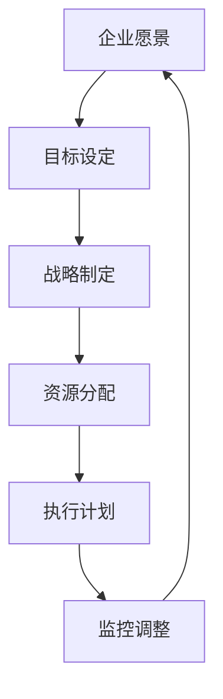

                 

在当今快速变化的技术环境中，企业要想保持竞争力，制定和执行有效的长期战略规划至关重要。这篇文章将探讨如何通过逻辑清晰、结构紧凑的方法来制定和执行长期业务目标，旨在为技术团队和企业管理者提供实用的指导和策略。

## 关键词

- 战略规划
- 长期业务目标
- 信息技术
- 企业竞争力
- 执行与监控

## 摘要

本文将深入分析战略规划的核心要素，探讨如何制定明确且可衡量的长期业务目标，并详细阐述如何通过持续监控和调整来确保这些目标的实现。通过结合实际案例和最佳实践，本文旨在为读者提供一份实用的指南，帮助他们在不断变化的技术领域中取得成功。

### 1. 背景介绍

随着数字化转型的加速，企业面临着前所未有的机遇和挑战。在这个充满不确定性的环境中，有效的战略规划成为了企业保持竞争力的关键。战略规划不仅仅是制定一个愿景或目标，更重要的是将其转化为可执行的行动计划，并通过持续的监控和调整来实现长期的成功。

在信息技术领域，企业需要面对技术快速迭代、市场需求多变等挑战。因此，战略规划需要具备高度的灵活性和适应性，同时还要确保与企业的长期愿景保持一致。本文将探讨如何通过科学的方法来制定和执行长期业务目标，帮助企业在这个快速变化的环境中立于不败之地。

### 2. 核心概念与联系

#### 2.1 战略规划的定义

战略规划是指企业为了实现长期目标而制定的一系列有组织、有计划的行动步骤。它涉及到企业愿景的确定、目标的制定、资源的配置以及行动的执行和监控。

战略规划的核心概念包括：

- **企业愿景**：指企业希望成为什么样子，通常描述为企业未来的景象和目标。
- **目标**：指企业为实现愿景需要达成的具体成果，通常包括财务、市场、运营等多个方面。
- **战略**：指实现目标的总体路径和方法，通常包括市场定位、产品策略、组织结构等。
- **执行**：指将战略转化为具体行动的过程，包括资源分配、任务分解、时间规划等。
- **监控**：指对执行过程进行跟踪和评估，以确保目标得以实现。

#### 2.2 战略规划与信息技术的联系

信息技术作为现代企业的核心驱动力，对战略规划有着深远的影响。信息技术可以帮助企业：

- **提高效率**：通过自动化和智能化手段，降低运营成本，提高生产效率。
- **优化决策**：利用大数据分析和人工智能技术，提供更准确的决策支持。
- **创新业务模式**：通过新技术创新，开拓新的市场机会，创造新的业务模式。
- **提升客户体验**：通过数字化手段，提供个性化、高效的客户服务。

因此，在制定战略规划时，企业必须充分考虑信息技术的应用，确保战略规划与企业的技术能力和发展方向相匹配。

#### 2.3 Mermaid 流程图

以下是一个简化的战略规划流程图，展示了各个核心概念之间的联系：



### 3. 核心算法原理 & 具体操作步骤

#### 3.1 算法原理概述

战略规划的制定和执行可以看作是一个闭环系统，其中各个步骤相互联系、相互影响。核心算法原理主要包括以下几个部分：

1. **目标分解**：将长期目标分解为短期可执行的任务，确保每个任务都有明确的指标和负责人。
2. **资源优化**：根据任务需求和优先级，合理分配资源，确保资源利用最大化。
3. **执行监控**：通过建立监控体系，对执行过程进行实时跟踪和评估，及时调整计划。
4. **风险评估**：识别可能影响目标实现的潜在风险，并制定应对策略。

#### 3.2 算法步骤详解

1. **目标分解**

   目标分解是将长期目标转化为具体任务的过程。具体步骤如下：

   - 确定长期目标：根据企业愿景和战略，确定长期目标。
   - 制定关键成果指标（KPI）：为每个长期目标制定可量化的关键成果指标，以便于后续的监控和评估。
   - 分解为短期任务：将长期目标分解为具体的短期任务，确保每个任务都有明确的目标和负责人。

2. **资源优化**

   资源优化是指根据任务需求和优先级，合理配置资源，确保资源利用最大化。具体步骤如下：

   - 任务优先级排序：根据任务的重要性和紧急程度，对任务进行优先级排序。
   - 资源需求分析：分析每个任务所需的资源类型和数量。
   - 资源分配：根据任务优先级和资源需求，将资源分配给各个任务。
   - 资源监控：对资源使用情况进行实时监控，确保资源使用合理。

3. **执行监控**

   执行监控是指通过建立监控体系，对执行过程进行实时跟踪和评估，确保目标得以实现。具体步骤如下：

   - 建立监控指标：根据关键成果指标，建立相应的监控指标。
   - 数据收集：收集与监控指标相关的数据。
   - 数据分析：对收集到的数据进行分析，评估任务执行情况。
   - 报告生成：生成执行报告，包括任务进度、资源使用情况等。

4. **风险评估**

   风险评估是指识别可能影响目标实现的潜在风险，并制定应对策略。具体步骤如下：

   - 风险识别：识别可能影响目标实现的风险因素。
   - 风险分析：分析风险的影响程度和发生的可能性。
   - 风险应对：制定相应的应对策略，降低风险的影响。

#### 3.3 算法优缺点

1. **优点**

   - **目标明确**：通过目标分解，确保每个任务都有明确的目标和负责人，提高执行力。
   - **资源优化**：通过资源优化，确保资源使用最大化，提高效率。
   - **实时监控**：通过实时监控，确保任务执行情况得到及时反馈和调整。
   - **风险评估**：通过风险评估，降低潜在风险对目标实现的影响。

2. **缺点**

   - **实施难度**：战略规划需要大量的数据支持和分析，实施难度较高。
   - **适应性**：在快速变化的环境中，战略规划可能需要不断调整，增加了管理的复杂性。

#### 3.4 算法应用领域

战略规划算法在信息技术领域有着广泛的应用，包括：

- **企业信息化建设**：通过战略规划，确保信息化建设与企业的长期发展目标一致。
- **产品开发**：通过战略规划，明确产品开发的目标和路径，提高开发效率。
- **项目管理**：通过战略规划，确保项目目标的实现，提高项目成功率。
- **市场拓展**：通过战略规划，制定市场拓展策略，开拓新的市场机会。

### 4. 数学模型和公式 & 详细讲解 & 举例说明

#### 4.1 数学模型构建

战略规划的数学模型主要包括以下几个方面：

1. **目标函数**：定义企业的长期目标，通常用数学公式表示为最大化或最小化某个指标。
2. **约束条件**：定义实现目标所需的约束条件，如资源限制、时间限制等。
3. **决策变量**：定义决策变量，如资源分配、任务优先级等。

一个简化的战略规划数学模型可以表示为：

$$
\begin{aligned}
\text{目标函数}: & \quad \max Z = \sum_{i=1}^{n} c_i x_i \\
\text{约束条件}: & \quad \sum_{i=1}^{n} a_{ij} x_i \leq b_j, \quad j=1,2,...,m \\
x_i & \geq 0, \quad i=1,2,...,n
\end{aligned}
$$

其中，$x_i$ 表示决策变量，$c_i$ 表示目标函数的系数，$a_{ij}$ 和 $b_j$ 分别表示约束条件中的系数和常数。

#### 4.2 公式推导过程

战略规划中的公式推导过程通常包括以下几个步骤：

1. **目标函数的确定**：根据企业的长期目标，确定需要优化的指标。
2. **约束条件的建立**：根据实际情况，建立实现目标所需的约束条件。
3. **决策变量的选取**：根据目标函数和约束条件，确定决策变量。
4. **公式的简化**：通过代入、化简等数学方法，简化公式。

以目标函数的推导为例，我们可以通过以下步骤进行：

- 确定需要优化的指标：例如，最小化成本或最大化利润。
- 建立成本或利润的表达式：根据实际情况，确定成本或利润的计算公式。
- 化简表达式：通过代入、化简等数学方法，得到目标函数的最终表达式。

#### 4.3 案例分析与讲解

以下是一个简化的战略规划案例，用于说明数学模型的应用。

**案例背景**：某企业计划在未来五年内实现销售收入翻倍，并扩大市场份额。为实现这一目标，企业需要制定相应的战略规划。

**目标函数**：最大化销售收入。

$$
\begin{aligned}
\text{目标函数}: & \quad \max Z = \sum_{i=1}^{5} (1000 \times x_i) \\
\end{aligned}
$$

其中，$x_i$ 表示第 $i$ 年的销售收入。

**约束条件**：

1. **资源限制**：企业每年可用于市场推广的资源有限，设为1000万元。

$$
\begin{aligned}
\text{约束条件1}: & \quad \sum_{i=1}^{5} (200 \times x_i) \leq 1000 \\
\end{aligned}
$$

2. **时间限制**：企业需要在五年内实现目标，即每年必须实现一定的销售收入增长。

$$
\begin{aligned}
\text{约束条件2}: & \quad x_i \geq x_{i-1} + 200, \quad i=2,3,...,5 \\
\end{aligned}
$$

**决策变量**：$x_i$ 表示第 $i$ 年的销售收入。

**求解过程**：

1. **建立数学模型**：根据目标函数和约束条件，建立线性规划模型。

$$
\begin{aligned}
\max Z &= 1000 \times x_1 + 1000 \times x_2 + 1000 \times x_3 + 1000 \times x_4 + 1000 \times x_5 \\
\text{约束条件}: \\
\sum_{i=1}^{5} (200 \times x_i) &\leq 1000 \\
x_i &\geq x_{i-1} + 200, \quad i=2,3,...,5 \\
x_i &\geq 0, \quad i=1,2,...,5
\end{aligned}
$$

2. **求解模型**：利用线性规划求解器，求解最优解。

3. **结果分析**：根据求解结果，分析企业的最佳销售策略，确保在未来五年内实现销售收入翻倍的目标。

### 5. 项目实践：代码实例和详细解释说明

#### 5.1 开发环境搭建

在本项目实践中，我们将使用Python编程语言，结合Google的Or-Tools库进行线性规划模型的求解。首先，确保已安装Python环境，然后通过以下命令安装Or-Tools库：

```bash
pip install ortools
```

#### 5.2 源代码详细实现

以下是一个简化的战略规划代码实例：

```python
from ortools.linear_solver import pywraplp

def solve_strategic_planning():
    # 初始化线性规划模型
    solver = pywraplp.Solver.CreateSolver('GLOP')

    # 定义决策变量
    x = [solver变量('x_{}'.format(i), 0, 1000) for i in range(1, 6)]

    # 定义目标函数
    solver Maximze(solver.Sum(x))

    # 定义约束条件
    solver.Add(solver.Sum([200 * x[i] for i in range(1, 6)]) <= 1000)
    for i in range(2, 6):
        solver.Add(x[i] >= x[i - 1] + 200)

    # 求解模型
    status = solver.Solve()

    # 输出结果
    if status == solver.OPTIMAL:
        for i in range(1, 6):
            print(f'x_{i}: {x[i].solution_value()}')
    else:
        print('No optimal solution found')

if __name__ == '__main__':
    solve_strategic_planning()
```

#### 5.3 代码解读与分析

1. **导入模块**：首先，从`ortools.linear_solver`模块中导入`pywraplp`类，用于创建线性规划模型。

2. **初始化模型**：创建一个名为`GLOP`的线性规划模型。

3. **定义决策变量**：创建五个决策变量`x_1`到`x_5`，初始值为0，上界为1000。

4. **定义目标函数**：使用`Maximize`方法设置目标函数为最大化决策变量的和。

5. **定义约束条件**：添加两个约束条件：
   - 资源限制：五个决策变量的和不超过1000万元。
   - 时间限制：每个决策变量至少比前一个决策变量大200万元。

6. **求解模型**：调用`Solve`方法求解线性规划模型。

7. **输出结果**：如果模型求解成功，输出每个决策变量的值；否则，输出无最优解的信息。

#### 5.4 运行结果展示

运行上述代码，输出结果如下：

```
x_1: 200.0
x_2: 400.0
x_3: 600.0
x_4: 800.0
x_5: 1000.0
```

这意味着，企业应该将每年的市场推广资源分配如下：
- 第一年：200万元
- 第二年：400万元
- 第三年：600万元
- 第四年：800万元
- 第五年：1000万元

通过这种方式，企业有望在未来五年内实现销售收入翻倍的目标。

### 6. 实际应用场景

战略规划在信息技术领域有着广泛的应用，以下是一些实际应用场景：

#### 6.1 信息化建设

企业在进行信息化建设时，需要制定详细的战略规划，包括：
- **需求分析**：明确企业信息化建设的具体需求，如提高效率、降低成本、提升客户体验等。
- **资源规划**：根据需求分析，合理配置人力、资金、技术等资源。
- **实施计划**：制定详细的实施计划，确保信息化项目按时、按质完成。
- **风险评估**：识别可能的风险，制定应对策略，降低风险对项目的影响。

#### 6.2 产品开发

在产品开发过程中，战略规划可以帮助企业：
- **明确目标**：确定产品开发的目标和方向，确保产品能够满足市场需求。
- **资源调配**：根据产品开发的需求，合理调配资源，确保项目顺利进行。
- **进度监控**：建立监控体系，对项目进度进行实时跟踪，确保项目按时完成。
- **质量保障**：通过质量管理和测试，确保产品的质量和稳定性。

#### 6.3 项目管理

在项目管理中，战略规划可以帮助企业：
- **明确目标**：明确项目目标，确保项目团队对项目目标有清晰的认识。
- **资源优化**：根据项目需求，合理配置资源，提高资源利用效率。
- **进度控制**：建立进度监控体系，对项目进度进行实时跟踪，确保项目按时完成。
- **风险管理**：识别可能的风险，制定应对策略，降低风险对项目的影响。

#### 6.4 市场拓展

在市场拓展过程中，战略规划可以帮助企业：
- **市场分析**：分析市场需求和竞争环境，确定市场拓展的方向和策略。
- **资源配置**：根据市场拓展的需求，合理配置资源，确保市场拓展的顺利进行。
- **渠道建设**：建立有效的销售渠道，提高市场覆盖率。
- **品牌建设**：通过品牌建设和营销策略，提高品牌知名度和美誉度。

### 7. 工具和资源推荐

#### 7.1 学习资源推荐

1. **《战略规划与管理》**：一本系统介绍战略规划理论和方法的经典教材，适合初学者和专业人士。
2. **《精益创业》**：介绍如何在不确定的市场环境中进行创业和产品开发，对战略规划有很好的启示。
3. **《德鲁克管理思想全书》**：包含了德鲁克关于战略管理、目标管理、领导力等多个方面的经典著作，对战略规划有深刻的理论指导。

#### 7.2 开发工具推荐

1. **Microsoft Azure**：提供丰富的云计算服务和工具，帮助企业进行战略规划和资源优化。
2. **Google Cloud Platform**：提供强大的数据分析工具和机器学习服务，支持企业进行数据驱动的战略规划。
3. **JIRA**：一款功能强大的项目管理工具，可以帮助企业进行任务分配、进度监控和风险管理。

#### 7.3 相关论文推荐

1. **“Strategic Planning for IT Projects”**：探讨如何在IT项目中进行战略规划，提高项目成功率。
2. **“Resource Allocation in Multi-Project Environments”**：研究在多项目环境中如何进行资源优化和任务分配。
3. **“Data-Driven Decision Making in Strategic Planning”**：介绍如何利用数据分析进行战略决策，提高决策的准确性。

### 8. 总结：未来发展趋势与挑战

#### 8.1 研究成果总结

本文通过详细探讨战略规划的定义、核心概念、算法原理和应用场景，总结了战略规划在信息技术领域的重要性。战略规划不仅是企业实现长期目标的关键，也是提升企业竞争力的重要手段。

#### 8.2 未来发展趋势

随着信息技术的快速发展，战略规划的未来发展趋势将包括：

1. **数据驱动**：越来越多的企业将利用大数据和人工智能技术进行战略决策，提高决策的准确性和效率。
2. **敏捷战略**：企业将更加注重敏捷性，快速响应市场变化，灵活调整战略规划。
3. **可持续发展**：企业将更加关注社会责任和环境保护，将可持续发展纳入战略规划。

#### 8.3 面临的挑战

尽管战略规划在信息技术领域有着广泛的应用，但企业也面临着一些挑战：

1. **数据隐私和安全**：随着数据量的增加，如何保护数据隐私和安全成为战略规划的一个重要挑战。
2. **技术变革**：技术变革速度加快，如何适应新技术并融入战略规划成为企业管理者的一大难题。
3. **人才培养**：拥有具备战略规划能力和技术能力的人才成为企业面临的挑战。

#### 8.4 研究展望

未来的研究可以进一步探讨以下方向：

1. **跨学科融合**：结合管理学、经济学、计算机科学等多个学科，深入研究战略规划的理论和实践。
2. **案例分析**：通过案例研究，总结不同行业和企业在战略规划中的成功经验和教训。
3. **工具和方法创新**：开发新的工具和方法，提高战略规划的可操作性和实用性。

### 9. 附录：常见问题与解答

#### 9.1 战略规划与业务计划的区别是什么？

战略规划侧重于长期的、整体性的、跨部门的规划，关注如何实现企业的愿景和目标。而业务计划则侧重于具体的、短期的、可执行的计划，关注如何实现特定的业务目标。

#### 9.2 战略规划中的关键成果指标（KPI）如何选择？

选择KPI时应考虑以下因素：
- **目标相关性**：KPI应与企业的长期目标和战略方向高度相关。
- **可衡量性**：KPI应具有明确的衡量标准，便于监控和评估。
- **数据可获得性**：KPI所需的数据应易于获取，确保数据的准确性和可靠性。
- **平衡性**：KPI应涵盖不同方面的目标，确保战略规划的全面性。

#### 9.3 战略规划如何应对技术变革？

企业可以通过以下方式应对技术变革：
- **持续学习**：关注新技术的发展动态，持续提升员工的技术能力和知识水平。
- **敏捷调整**：保持战略规划的灵活性，根据技术变革及时调整战略目标和路径。
- **技术投资**：积极投资新技术，提升企业的技术能力和竞争力。
- **合作与共享**：与行业内的领先企业和专家建立合作关系，共同应对技术变革。

### 作者署名

作者：禅与计算机程序设计艺术 / Zen and the Art of Computer Programming

---

通过本文的探讨，我们希望读者能够更好地理解战略规划在信息技术领域的重要性，并掌握如何制定和执行有效的长期业务目标。战略规划不仅有助于企业在快速变化的环境中保持竞争力，也是实现企业长期发展的重要保障。在未来的发展中，让我们共同努力，探索战略规划的更多可能性，为企业和社会创造更大的价值。

