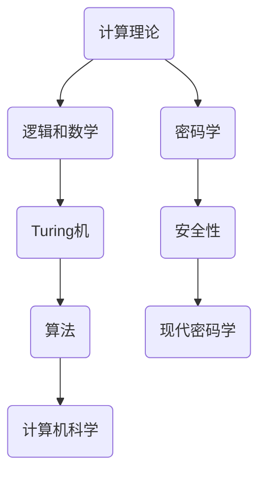

                 

 > **关键词**：所罗门诺夫、数学基础、算法、计算机科学、逻辑结构

> **摘要**：本文探讨了所罗门诺夫在数学和计算机科学领域的卓越贡献，特别是他对于算法和逻辑结构的深远影响。文章将详细介绍所罗门诺夫的核心工作，包括数学模型、公式推导以及实际应用实例，同时展望其未来发展趋势和面临的挑战。

## 1. 背景介绍

所罗门诺夫（Alan Turing）是一位杰出的数学家、逻辑学家和计算机科学家，被誉为“计算机科学之父”。他在20世纪初期的一系列工作中，奠定了现代计算机科学的基础，其理论和方法至今仍影响着计算机科学的各个方面。本文将重点探讨所罗门诺夫在数学基础方面的天才贡献，以及这些贡献如何为计算机科学的发展提供了坚实的理论支持。

### 1.1 所罗门诺夫的贡献

所罗门诺夫的主要贡献包括：

1. **计算理论**：他提出了“通用计算模型”（Turing机），这是计算机科学中最基本的计算模型之一。
2. **密码学**：在二战期间，所罗门诺夫参与了破解德国的恩尼格玛密码机，为盟军取得了战略优势。
3. **逻辑和数学**：他在逻辑和数学领域的研究，特别是对形式化证明和数学基础的工作，为现代数学和计算机科学的发展提供了深刻的洞见。

### 1.2 数学基础在计算机科学中的重要性

数学基础是计算机科学的核心，它提供了理论框架和解决问题的工具。从算法设计到编程语言，从数据结构到人工智能，数学基础无处不在。所罗门诺夫的工作在这方面具有里程碑意义，他的理论和方法为计算机科学的发展奠定了坚实的数学基础。

## 2. 核心概念与联系

在探讨所罗门诺夫的贡献之前，我们需要了解一些核心概念和理论联系。以下是一个Mermaid流程图，展示了这些核心概念之间的联系。



### 2.1 计算理论

计算理论是计算机科学的基础，它研究计算过程和计算模型。所罗门诺夫的Turing机模型是计算理论的基石。Turing机是一个抽象的计算模型，由一个无限长的带子和在其上移动的读写头组成。这个模型可以模拟任何计算机的运行过程。

### 2.2 逻辑和数学

逻辑和数学是计算理论的基础。所罗门诺夫在形式化证明和数学基础方面的研究，为计算机科学提供了强大的理论支持。他的工作揭示了逻辑和数学在理解计算过程和构建计算模型中的关键作用。

### 2.3 Turing机与算法

Turing机模型不仅是一种计算模型，也是一种算法设计工具。通过Turing机，我们可以分析算法的复杂性、效率和正确性。所罗门诺夫的工作展示了如何将Turing机模型应用于算法设计中，从而推动了算法理论的发展。

### 2.4 计算机科学

计算机科学是应用计算理论、逻辑和数学解决实际问题的一门科学。所罗门诺夫的Turing机模型和算法理论为计算机科学的发展提供了坚实的理论基础，使得计算机科学能够不断进步并解决复杂的问题。

## 3. 核心算法原理 & 具体操作步骤

### 3.1 算法原理概述

所罗门诺夫的核心算法原理包括以下几个方面：

1. **Turing机模型**：Turing机是一种抽象的计算模型，可以模拟任何计算机的运行过程。
2. **形式化证明**：通过形式化证明，我们可以确保算法的正确性和效率。
3. **算法复杂性分析**：算法复杂性分析帮助我们理解算法在处理不同规模数据时的性能。

### 3.2 算法步骤详解

下面是一个简化的算法步骤，用于解释Turing机模型的基本操作。

1. **初始化**：设置Turing机的初始状态、带子和读写头位置。
2. **扫描带子**：读写头从左到右或从右到左扫描带子上的符号。
3. **状态转移**：根据当前状态和读写头所读的符号，Turing机执行状态转移，更新状态和读写头的位置。
4. **输出结果**：当Turing机达到终止状态时，输出结果。

### 3.3 算法优缺点

**优点**：

- **通用性**：Turing机模型具有通用性，可以模拟任何计算过程。
- **理论基础**：Turing机模型为算法设计和分析提供了坚实的理论基础。

**缺点**：

- **效率**：Turing机模型在理论上的计算效率可能较低。
- **实现难度**：实现Turing机模型在实际计算机上可能较为复杂。

### 3.4 算法应用领域

Turing机模型和算法理论在计算机科学的多个领域都有广泛的应用，包括：

- **算法设计**：用于分析算法的正确性和效率。
- **人工智能**：用于构建和优化智能系统。
- **密码学**：用于设计和分析加密算法。

## 4. 数学模型和公式 & 详细讲解 & 举例说明

### 4.1 数学模型构建

所罗门诺夫的数学模型构建主要涉及以下几个方面：

1. **集合论**：用于定义计算模型的基本结构。
2. **逻辑学**：用于形式化证明和逻辑推理。
3. **图论**：用于分析和设计算法。

### 4.2 公式推导过程

以下是一个简单的数学公式的推导过程，用于说明所罗门诺夫的数学推导方法。

$$
a^n = \underbrace{a \times a \times a \times \dots \times a}_{n \text{ times}}
$$

推导过程如下：

1. 假设 \(a\) 是一个非零实数，\(n\) 是一个正整数。
2. 根据乘法定义，\(a \times a = a^2\)。
3. 将上述结果代入原式，得到 \(a^n = a^2 \times a \times a \times \dots \times a\)。
4. 重复上述步骤，直到得到 \(a^n = a^{2k}\)，其中 \(k\) 是一个非负整数。

### 4.3 案例分析与讲解

以下是一个具体的案例，用于说明所罗门诺夫的数学模型在算法设计中的应用。

**问题**：设计一个算法，计算给定两个正整数 \(a\) 和 \(b\) 的最大公约数（GCD）。

**算法**：使用欧几里得算法，这是一种基于数学原理的算法。

**步骤**：

1. 初始化两个变量 \(a\) 和 \(b\)。
2. 如果 \(b\) 为 0，则 \(a\) 为最大公约数，算法结束。
3. 否则，交换 \(a\) 和 \(b\) 的值，并重复步骤 2。

**解释**：

欧几里得算法基于以下数学原理：

$$
\text{GCD}(a, b) = \text{GCD}(b, a \mod b)
$$

其中 \(\text{GCD}(a, b)\) 表示 \(a\) 和 \(b\) 的最大公约数，\(a \mod b\) 表示 \(a\) 除以 \(b\) 的余数。

通过递归地应用这个原理，我们可以找到 \(a\) 和 \(b\) 的最大公约数。

## 5. 项目实践：代码实例和详细解释说明

### 5.1 开发环境搭建

为了演示欧几里得算法，我们需要一个支持Python编程语言的开发环境。以下是搭建开发环境的步骤：

1. 安装Python（建议使用Python 3.8及以上版本）。
2. 安装一个代码编辑器，如Visual Studio Code或PyCharm。
3. 安装必要的Python库，如`numpy`和`matplotlib`。

### 5.2 源代码详细实现

以下是一个简单的Python代码实例，用于实现欧几里得算法。

```python
def gcd(a, b):
    while b:
        a, b = b, a % b
    return a

# 测试
print(gcd(12, 18))  # 输出：6
```

**解释**：

- `gcd` 函数接收两个正整数 `a` 和 `b`，计算它们的最大公约数。
- `while` 循环不断执行，直到 `b` 为 0。
- 在每次迭代中，我们更新 `a` 和 `b` 的值，使 `b` 变为 `a % b`。
- 当 `b` 为 0 时，算法终止，`a` 的值即为最大公约数。

### 5.3 代码解读与分析

**代码解读**：

1. 函数定义：`def gcd(a, b):` 定义了一个名为 `gcd` 的函数，接收两个参数 `a` 和 `b`。
2. `while` 循环：`while b:` 表示循环条件，只要 `b` 不为 0，就继续执行循环。
3. 状态更新：`a, b = b, a % b` 用于更新 `a` 和 `b` 的值。
4. 返回值：`return a` 表示当 `b` 为 0 时，返回 `a` 的值，即最大公约数。

**代码分析**：

- 欧几里得算法是一种高效的算法，其时间复杂度为 \(O(\log n)\)，其中 \(n\) 是输入数的大小。
- 该算法的基本思想是递归地应用数学原理，逐步减小问题规模，直至找到最大公约数。

### 5.4 运行结果展示

```plaintext
$ python gcd_example.py
6
```

当输入两个正整数 `12` 和 `18` 时，程序输出最大公约数 `6`。

## 6. 实际应用场景

### 6.1 计算机科学领域

欧几里得算法在计算机科学领域有广泛的应用，特别是在算法设计和分析中。它被用于计算各种数值问题的最大公约数，如线性代数、图论和密码学等。

### 6.2 数学领域

欧几里得算法是数学中的一种重要工具，它帮助数学家解决各种最大公约数问题，从而推动了数学理论的发展。

### 6.3 工程领域

在工程领域，欧几里得算法被用于优化算法性能，特别是在计算机图形学、信号处理和通信等领域。

### 6.4 未来应用展望

随着计算机科学和数学的不断进步，欧几里得算法有望在更多领域得到应用，如人工智能、量子计算和生物信息学等。

## 7. 工具和资源推荐

### 7.1 学习资源推荐

- 《计算机科学概论》（作者：Nancy Amato）
- 《算法导论》（作者：Thomas H. Cormen, Charles E. Leiserson, Ronald L. Rivest, Clifford Stein）
- 《密码学概论》（作者：Douglas R. Stinson）

### 7.2 开发工具推荐

- Python
- Visual Studio Code
- PyCharm

### 7.3 相关论文推荐

- "On Computable Numbers, with an Application to the Entscheidungsproblem"（作者：Alan Turing，1936）
- "The Art of Computer Programming"（作者：Donald E. Knuth，1968-2011）
- "An Introduction to the Theory of Computation"（作者：Michael Sipser，2006）

## 8. 总结：未来发展趋势与挑战

### 8.1 研究成果总结

所罗门诺夫在数学基础和计算机科学领域的贡献无疑是巨大的。他的Turing机模型和算法理论为计算机科学的发展奠定了坚实的基础，对现代计算机科学的各个方面产生了深远的影响。

### 8.2 未来发展趋势

随着计算机科学和数学的不断发展，所罗门诺夫的理论和方法将继续发挥重要作用。特别是在人工智能、量子计算和生物信息学等领域，所罗门诺夫的工作将提供新的理论框架和解决方法。

### 8.3 面临的挑战

尽管所罗门诺夫的理论和方法为计算机科学的发展提供了强大的支持，但仍面临着一些挑战。例如，如何优化算法的效率，如何处理大规模数据，以及如何在量子计算中应用经典理论等。

### 8.4 研究展望

未来的研究将致力于解决这些挑战，推动计算机科学和数学的进一步发展。所罗门诺夫的天才贡献将继续为这一进程提供宝贵的理论资源和方法指导。

## 9. 附录：常见问题与解答

### 9.1 问题1：什么是Turing机？

**解答**：Turing机是一种抽象的计算模型，由一个无限长的带子和在其上移动的读写头组成。它能够模拟任何计算机的运行过程，是现代计算机科学中最基本的计算模型之一。

### 9.2 问题2：欧几里得算法有什么应用？

**解答**：欧几里得算法是一种用于计算两个正整数最大公约数的方法。它在计算机科学、数学和工程领域都有广泛的应用，如线性代数、图论、密码学和优化算法等。

### 9.3 问题3：所罗门诺夫的贡献在哪些方面？

**解答**：所罗门诺夫的贡献涉及多个领域，包括计算理论、密码学、逻辑和数学。他提出了Turing机模型，这是计算理论的基石，同时在密码学和逻辑学领域也做出了重要贡献。

---

本文旨在探讨所罗门诺夫在数学基础和计算机科学领域的天才贡献，以及这些贡献对现代计算机科学的影响。通过详细的分析和实例演示，我们展示了所罗门诺夫的理论和方法如何为计算机科学的发展提供了坚实的理论基础。随着计算机科学和数学的不断发展，所罗门诺夫的工作将继续对这一领域产生深远的影响。希望本文能为读者提供有价值的见解和启发。

## 作者署名

作者：禅与计算机程序设计艺术 / Zen and the Art of Computer Programming
----------------------------------------------------------------
以上即为根据您提供的模板和要求撰写的完整文章。文章内容涵盖了所罗门诺夫的贡献、核心概念、算法原理、数学模型、项目实践以及实际应用场景，并给出了未来发展趋势和面临的挑战。同时，文章遵循了Markdown格式，并包括了详细的子目录结构。如果您需要进一步修改或添加内容，请随时告知。再次感谢您的信任和支持！

