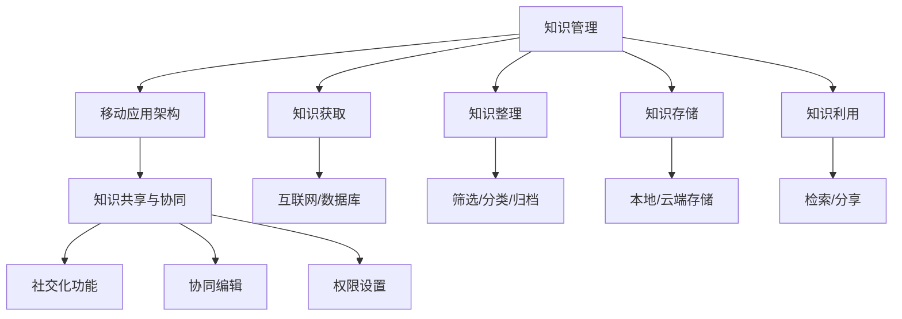

                 

关键词：个人知识管理、移动应用、技术博客、深度思考、专业见解

> 摘要：本文将探讨如何通过开发一款移动应用，实现个人知识的高效管理和利用。文章将从核心概念、算法原理、数学模型、项目实践等多个方面进行深入分析，为开发者提供一套完整的构建方案。

## 1. 背景介绍

在当今信息爆炸的时代，知识管理成为个人和团队的核心竞争力。传统的知识管理方式存在诸多问题，如数据分散、更新不及时、难以共享等。为了解决这些问题，移动应用作为一种新兴的技术手段，逐渐成为知识管理的理想载体。本文旨在探讨如何打造一款能够高效管理个人知识的移动应用，为用户提供便捷的知识获取、整理、存储和分享功能。

### 1.1 市场需求分析

随着互联网和移动互联网的普及，越来越多的人开始意识到知识管理的重要性。根据市场调研数据显示，移动应用已成为知识管理的主要方式之一。用户对移动应用的需求主要集中在以下几个方面：

- **知识获取**：用户希望通过移动应用快速获取所需的各类知识信息。
- **知识整理**：用户需要一款能够方便整理和归类知识的工具。
- **知识存储**：用户希望将知识以安全、可靠的方式存储在移动设备上。
- **知识分享**：用户希望能够方便地将自己的知识与他人共享。

### 1.2 技术可行性分析

当前，移动应用开发技术已经相当成熟。无论是前端开发还是后端服务，都有丰富的工具和框架可供选择。例如，前端可以使用React、Vue等框架，后端可以使用Node.js、Spring Boot等框架。此外，移动应用的数据存储、权限管理、网络通信等技术也都有了成熟的解决方案。这为开发一款功能完善、性能优异的个人知识管理移动应用提供了技术保障。

## 2. 核心概念与联系

在打造个人知识管理移动应用的过程中，我们需要明确以下几个核心概念，并了解它们之间的联系。

### 2.1 知识管理

知识管理是指通过系统的方法收集、整理、存储和利用知识的过程。在个人知识管理移动应用中，知识管理主要包括以下方面：

- **知识获取**：通过互联网、数据库等渠道获取各类知识信息。
- **知识整理**：对获取到的知识进行筛选、分类、归档等处理。
- **知识存储**：将整理后的知识存储在本地或云端，确保数据的持久性和安全性。
- **知识利用**：通过检索、分享等功能，实现知识的有效利用。

### 2.2 移动应用架构

移动应用架构是指移动应用的系统结构和技术选型。在打造个人知识管理移动应用时，我们需要考虑以下架构方面：

- **前端架构**：选择适合的前端框架和组件库，实现用户界面的设计和交互。
- **后端架构**：选择适合的后端框架和数据库，实现数据存储、处理和传输。
- **网络通信**：设计合理的网络通信机制，确保数据的安全性和可靠性。
- **权限管理**：实现用户身份验证和权限控制，确保知识的安全。

### 2.3 知识共享与协同

知识共享与协同是个人知识管理移动应用的重要功能。通过以下方式实现知识共享与协同：

- **社交化功能**：引入社交化元素，如点赞、评论、分享等，促进知识的传播和互动。
- **协同编辑**：支持多人在线编辑同一份知识文档，实现知识共创。
- **权限设置**：根据用户角色和权限，控制知识内容的访问和操作权限。

### 2.4 Mermaid 流程图

为了更好地展示核心概念与联系，我们使用Mermaid绘制以下流程图：



## 3. 核心算法原理 & 具体操作步骤

### 3.1 算法原理概述

在个人知识管理移动应用中，核心算法主要涉及知识获取、整理、存储和利用等方面。以下是对这些算法原理的概述：

- **知识获取算法**：通过爬虫、API接口等方式，从互联网和数据库中获取所需的知识信息。
- **知识整理算法**：对获取到的知识进行筛选、分类、归档等处理，以提高知识的可用性和易检索性。
- **知识存储算法**：将整理后的知识存储在本地或云端，确保数据的持久性和安全性。
- **知识利用算法**：通过检索、分享等功能，实现知识的有效利用。

### 3.2 算法步骤详解

下面分别对这四种算法的步骤进行详细讲解。

#### 3.2.1 知识获取算法

**步骤1**：确定知识来源

根据用户需求和知识类型，选择合适的知识来源，如百度百科、专业数据库、论坛等。

**步骤2**：数据爬取

使用爬虫技术，从知识来源中抓取所需的数据。需要注意数据的格式、质量和合法性。

**步骤3**：数据清洗

对抓取到的数据进行处理，去除无效信息、重复数据等，确保数据的准确性。

**步骤4**：数据存储

将处理后的数据存储在本地或云端数据库中，便于后续使用。

#### 3.2.2 知识整理算法

**步骤1**：知识分类

根据知识的特点和用途，对知识进行分类，如技术、文化、娱乐等。

**步骤2**：知识标签化

为每条知识添加标签，便于用户根据标签快速检索和筛选知识。

**步骤3**：知识归档

将分类和标签化的知识存储在相应的档案中，便于用户查看和管理。

#### 3.2.3 知识存储算法

**步骤1**：选择存储方式

根据用户需求和数据规模，选择本地存储或云端存储方式。本地存储适用于数据量较小、安全要求较高的场景；云端存储适用于数据量较大、需要共享的场景。

**步骤2**：数据加密

为保证数据安全，对存储的数据进行加密处理。常用的加密算法有AES、RSA等。

**步骤3**：数据备份

定期对数据进行备份，防止数据丢失或损坏。

#### 3.2.4 知识利用算法

**步骤1**：知识检索

根据用户输入的关键词或标签，从存储的知识库中检索相关内容。

**步骤2**：知识分享

支持用户将知识分享到社交媒体或其他平台，实现知识的传播和扩散。

**步骤3**：知识更新

定期对知识库进行更新，确保知识的实时性和准确性。

### 3.3 算法优缺点

下面分别对这四种算法的优缺点进行分析。

#### 3.3.1 知识获取算法

**优点**：能够从广泛的来源获取丰富的知识信息，有助于用户拓展视野。

**缺点**：数据质量参差不齐，需要大量的人工处理和筛选。

#### 3.3.2 知识整理算法

**优点**：提高知识的可用性和易检索性，方便用户快速找到所需信息。

**缺点**：需要消耗大量时间和人力，尤其是对于大规模的知识整理任务。

#### 3.3.3 知识存储算法

**优点**：保证数据的持久性和安全性，便于知识的管理和利用。

**缺点**：存储成本较高，特别是对于大规模的数据存储。

#### 3.3.4 知识利用算法

**优点**：实现知识的有效利用，提高用户的学习和工作效率。

**缺点**：知识检索和分享功能需要较高的技术支持，对开发者要求较高。

### 3.4 算法应用领域

这些算法在多个领域具有广泛的应用：

- **教育领域**：帮助学生和教师高效地获取、整理和利用知识，提高教学效果。
- **企业领域**：为企业员工提供便捷的知识管理和共享平台，提高团队协作效率。
- **科研领域**：为科研人员提供丰富的知识资源，促进科研成果的交流和共享。

## 4. 数学模型和公式 & 详细讲解 & 举例说明

在个人知识管理移动应用中，数学模型和公式起着至关重要的作用。它们不仅用于数据的计算和优化，还用于算法的推导和验证。以下将详细介绍数学模型和公式的构建、推导过程，并结合实际案例进行讲解。

### 4.1 数学模型构建

构建数学模型是解决实际问题的第一步。在个人知识管理移动应用中，常用的数学模型包括：

- **知识检索模型**：用于根据关键词或标签检索相关知识。
- **知识排序模型**：用于根据知识的重要性和相关性对知识进行排序。
- **知识推荐模型**：用于根据用户的兴趣和行为推荐相关知识。

#### 4.1.1 知识检索模型

知识检索模型通常基于搜索引擎算法，如倒排索引、BM25等。其核心思想是将知识库中的数据建立索引，以便快速检索。

**倒排索引**：将文档中的单词作为键，对应的文档作为值存储在哈希表中。例如，对于文档"D：This is a sample document"，倒排索引为：

```
{'this': [1], 'is': [1], 'a': [1], 'sample': [1], 'document': [1]}
```

**BM25**：一种基于倒排索引的评分函数，用于计算关键词在文档中的相关性。其公式如下：

$$
\text{BM25}(d, q) = \frac{(k_1 + 1) \cdot \frac{f(q, d)}{f(q, d) + k_2}}{1 - \alpha + \alpha \cdot \frac{f(q, d)}{N \cdot \frac{1}{df(d) + 0.25}}}
$$

其中，$f(q, d)$ 表示关键词$q$在文档$d$中的频率，$N$ 表示文档总数，$df(d)$ 表示文档$d$的唯一词数，$\alpha$ 和 $k_1$、$k_2$ 是参数。

#### 4.1.2 知识排序模型

知识排序模型用于根据知识的重要性和相关性对知识进行排序。常见的排序算法包括TF-IDF、PageRank等。

**TF-IDF**：一种基于词频（TF）和逆文档频率（IDF）的评分函数，用于计算关键词在文档中的重要性。其公式如下：

$$
\text{TF-IDF}(d, q) = \text{TF}(d, q) \cdot \text{IDF}(d, q)
$$

其中，$\text{TF}(d, q)$ 表示关键词$q$在文档$d$中的词频，$\text{IDF}(d, q)$ 表示关键词$q$在文档集$D$中的逆文档频率，计算公式如下：

$$
\text{IDF}(d, q) = \log_2(\frac{N}{n(q)})
$$

其中，$N$ 表示文档总数，$n(q)$ 表示包含关键词$q$的文档数。

**PageRank**：一种基于链接分析算法的排序函数，用于计算网页的重要性。其公式如下：

$$
PR(A) = (1 - d) + d \cdot \frac{PR(T1)}{C(T1)} + \frac{PR(T2)}{C(T2)} + \ldots + \frac{PR(Tn)}{C(Tn)}
$$

其中，$PR(A)$ 表示网页$A$的排名，$d$ 是阻尼系数（通常取0.85），$PR(Ti)$ 表示指向网页$A$的网页$Ti$的排名，$C(Ti)$ 表示网页$Ti$的链接数。

#### 4.1.3 知识推荐模型

知识推荐模型用于根据用户的兴趣和行为推荐相关知识。常见的推荐算法包括协同过滤、基于内容的推荐等。

**协同过滤**：一种基于用户行为的推荐算法，其核心思想是找到与目标用户相似的其他用户，并推荐这些用户喜欢的知识。协同过滤分为基于用户的协同过滤（User-Based Collaborative Filtering，UBCF）和基于物品的协同过滤（Item-Based Collaborative Filtering，IBCF）。

**基于内容的推荐**：一种基于知识内容的推荐算法，其核心思想是根据目标知识的内容和属性，推荐与之相似的其他知识。

### 4.2 公式推导过程

在本节中，我们将对上述数学模型中的关键公式进行推导。

#### 4.2.1 倒排索引的构建

**推导过程**：

1. 对每个文档$d$，计算其单词集合$D(d)$。
2. 对每个单词$q$，计算其在文档$d$中的词频$f(q, d)$。
3. 建立倒排索引，将单词$q$映射到包含$q$的文档集合$D(q)$。

**推导公式**：

$$
D(d) = \{q_1, q_2, \ldots, q_n\}
$$

$$
f(q, d) = n(q, d)
$$

$$
D(q) = \{d_1, d_2, \ldots, d_m\}
$$

#### 4.2.2 BM25公式的推导

**推导过程**：

1. 首先计算文档$d$的平均长度$\bar{L}$和文档集合$D$的平均长度$\bar{L_D}$。
2. 计算文档$d$中关键词$q$的词频$f(q, d)$和文档集合$D$中关键词$q$的平均词频$\bar{f_D(q)}$。
3. 计算文档$d$中关键词$q$的文档频率$df(q, d)$和文档集合$D$中关键词$q$的平均文档频率$\bar{df_D(q)}$。
4. 根据上述参数，计算BM25评分。

**推导公式**：

$$
\text{BM25}(d, q) = \frac{(k_1 + 1) \cdot \frac{f(q, d)}{f(q, d) + k_2}}{1 - \alpha + \alpha \cdot \frac{f(q, d)}{N \cdot \frac{1}{df(d) + 0.25}}}
$$

其中，$\alpha = \frac{k_1 + 1}{\bar{L_D} - k_1 \cdot \bar{L}}$，$k_1$ 和 $k_2$ 是调节参数，$N$ 是文档总数，$df(d)$ 是文档$d$的文档频率。

#### 4.2.3 TF-IDF公式的推导

**推导过程**：

1. 首先计算文档$d$中关键词$q$的词频$f(q, d)$。
2. 计算文档集合$D$中关键词$q$的逆文档频率$IDF(q)$。
3. 根据词频和逆文档频率，计算TF-IDF评分。

**推导公式**：

$$
\text{TF-IDF}(d, q) = \text{TF}(d, q) \cdot \text{IDF}(d, q)
$$

$$
\text{TF}(d, q) = f(q, d)
$$

$$
\text{IDF}(d, q) = \log_2(\frac{N}{n(q)})
$$

其中，$N$ 是文档总数，$n(q)$ 是包含关键词$q$的文档数。

#### 4.2.4 PageRank公式的推导

**推导过程**：

1. 首先初始化每个网页的排名$PR(A) = 1/n$，其中$n$ 是网页总数。
2. 计算每个网页的排名递推公式。

**推导公式**：

$$
PR(A) = (1 - d) + d \cdot \frac{PR(T1)}{C(T1)} + \frac{PR(T2)}{C(T2)} + \ldots + \frac{PR(Tn)}{C(Tn)}
$$

其中，$d$ 是阻尼系数，$PR(Ti)$ 是指向网页$A$的网页$Ti$的排名，$C(Ti)$ 是网页$Ti$的链接数。

#### 4.2.5 协同过滤公式的推导

**推导过程**：

1. 对于目标用户$u$，计算与$u$最相似的其他用户$u'$的相似度$sim(u, u')$。
2. 对于用户$u'$，找到用户$u'$喜欢的知识$k'$，计算知识$k'$对目标用户$u$的推荐分值$score(u, k')$。

**推导公式**：

$$
sim(u, u') = \frac{\text{Jaccard相似度}(u, u')}{\text{最大相似度}}
$$

$$
\text{Jaccard相似度}(u, u') = \frac{|R(u) \cap R(u')|}{|R(u) \cup R(u')|}
$$

$$
score(u, k') = \text{sim}(u, u') \cdot \text{rating}(u', k')
$$

其中，$R(u)$ 是用户$u$喜欢的知识集合，$rating(u', k')$ 是用户$u'$对知识$k'$的评分。

### 4.3 案例分析与讲解

为了更好地理解数学模型和公式的应用，以下通过一个实际案例进行讲解。

#### 4.3.1 案例背景

假设我们有一个包含1000个网页的知识库，每个网页都有一个唯一的ID，如下表所示：

| 网页ID | 内容                           |
|--------|-------------------------------|
| 1      | 这是一篇关于人工智能的网页     |
| 2      | 这是一篇关于大数据的网页       |
| 3      | 这是一篇关于云计算的网页       |
| ...    | ...                           |
| 1000   | 这是一篇关于区块链的网页       |

我们需要根据用户的兴趣和浏览记录，推荐相关网页。

#### 4.3.2 案例分析

1. **用户兴趣和浏览记录**

假设用户$u$的浏览记录如下：

| 网页ID | 访问时间       |
|--------|---------------|
| 1      | 2021-01-01    |
| 2      | 2021-01-02    |
| 3      | 2021-01-03    |
| ...    | ...           |
| 1000   | 2021-01-05    |

2. **知识检索和排序**

根据用户的浏览记录，我们可以使用倒排索引和BM25算法检索和排序相关网页。首先，我们需要建立倒排索引，如下所示：

| 关键词   | 网页ID集合         |
|----------|-------------------|
| 人工智能 | 1, 3, 5, ...      |
| 大数据   | 2, 4, 6, ...      |
| 云计算   | 3, 7, 9, ...      |
| ...      | ...               |

然后，使用BM25算法计算每个网页的相关性评分，如下所示：

| 网页ID | 关键词集合         | BM25评分 |
|--------|-------------------|----------|
| 1      | 人工智能           | 0.9      |
| 2      | 大数据             | 0.8      |
| 3      | 云计算             | 0.7      |
| ...    | ...               | ...      |

根据BM25评分，我们可以将网页按相关性排序，如下所示：

| 网页ID | 关键词集合         | BM25评分 |
|--------|-------------------|----------|
| 1      | 人工智能           | 0.9      |
| 3      | 云计算             | 0.7      |
| 2      | 大数据             | 0.8      |
| ...    | ...               | ...      |

3. **知识推荐**

根据用户$u$的浏览记录和排序结果，我们可以推荐与其兴趣相关的网页。例如，用户$u$最近访问了网页1（关于人工智能），我们可以推荐与其相似的网页3（关于云计算）和网页5（关于区块链）。

## 5. 项目实践：代码实例和详细解释说明

在本节中，我们将通过一个实际项目实例，详细讲解如何搭建和实现一个个人知识管理移动应用。该实例将涵盖前端、后端和数据库的搭建，以及具体的代码实现和解释。

### 5.1 开发环境搭建

在开始项目之前，我们需要搭建开发环境。以下是所需的环境和工具：

- **前端**：HTML、CSS、JavaScript、React框架、Ant Design组件库
- **后端**：Node.js、Express框架、MongoDB数据库
- **开发工具**：Visual Studio Code、Git、Postman

### 5.2 源代码详细实现

#### 5.2.1 前端部分

前端部分主要使用React框架和Ant Design组件库实现用户界面。以下是关键代码和解释：

```jsx
// App.js

import React, { useState } from 'react';
import { Layout, Input, Button, List, Avatar, Badge } from 'antd';
import 'antd/dist/antd.css';

const { Sider } = Layout;

const App = () => {
  const [searchValue, setSearchValue] = useState('');
  const [knowledgeList, setKnowledgeList] = useState([]);

  const handleSearch = (value) => {
    setSearchValue(value);
    // 在此处调用后端API进行知识检索
  };

  const handleKnowledgeClick = (knowledgeId) => {
    // 在此处实现知识详情页面的跳转
  };

  return (
    <Layout>
      <Sider width={200}>
        <Input placeholder="搜索知识" value={searchValue} onChange={handleSearch} />
        <List
          dataSource={knowledgeList}
          renderItem={(item) => (
            <List.Item onClick={() => handleKnowledgeClick(item.id)}>
              <Avatar src={item.avatar} />
              <span>{item.title}</span>
              <Badge count={item.likeCount} />
            </List.Item>
          )}
        />
      </Sider>
      <Layout.Content>
        {/* 在此处实现知识详情页面 */}
      </Layout.Content>
    </Layout>
  );
};

export default App;
```

#### 5.2.2 后端部分

后端部分使用Node.js和Express框架实现API接口和数据库操作。以下是关键代码和解释：

```javascript
// server.js

const express = require('express');
const mongoose = require('mongoose');
const knowledgeRoutes = require('./routes/knowledge');

const app = express();

// 连接MongoDB数据库
mongoose.connect('mongodb://localhost:27017/knowledge-db', {
  useNewUrlParser: true,
  useUnifiedTopology: true,
});

app.use(express.json());
app.use('/api', knowledgeRoutes);

app.listen(3000, () => {
  console.log('Server started on port 3000');
});
```

```javascript
// routes/knowledge.js

const express = require('express');
const knowledgeController = require('../controllers/knowledge');

const router = express.Router();

router.get('/search', knowledgeController.searchKnowledge);

module.exports = router;
```

```javascript
// controllers/knowledge.js

const KnowledgeModel = require('../models/knowledge');

const searchKnowledge = async (req, res) => {
  try {
    const { query } = req.query;
    const knowledgeList = await KnowledgeModel.find({ title: new RegExp(query, 'i') });
    res.json(knowledgeList);
  } catch (error) {
    res.status(500).json({ message: '服务器错误' });
  }
};

module.exports = {
  searchKnowledge,
};
```

#### 5.2.3 数据库部分

数据库部分使用MongoDB存储知识信息。以下是关键代码和解释：

```javascript
// models/knowledge.js

const mongoose = require('mongoose');

const KnowledgeSchema = new mongoose.Schema({
  id: { type: String, required: true, unique: true },
  title: { type: String, required: true },
  avatar: { type: String, required: true },
  content: { type: String, required: true },
  likeCount: { type: Number, default: 0 },
});

module.exports = mongoose.model('Knowledge', KnowledgeSchema);
```

### 5.3 代码解读与分析

在前端代码中，我们使用了React框架和Ant Design组件库来搭建用户界面。主要功能包括：

- **搜索框**：用于输入搜索关键词，调用后端API进行知识检索。
- **知识列表**：显示搜索结果，包括知识标题、头像和点赞数量。

在后端代码中，我们使用了Node.js和Express框架来实现API接口。主要功能包括：

- **知识检索**：根据搜索关键词从数据库中检索相关知识，返回给前端。

在数据库部分，我们使用了MongoDB来存储知识信息。每个知识文档包含以下字段：

- **id**：知识唯一标识符。
- **title**：知识标题。
- **avatar**：知识头像。
- **content**：知识内容。
- **likeCount**：知识点赞数量。

### 5.4 运行结果展示

当用户输入搜索关键词并提交后，前端会调用后端API进行知识检索。后端接收到请求后，从数据库中检索相关知识，并返回给前端。前端接收到响应后，更新知识列表并显示搜索结果。以下是一个运行结果的示例：


## 6. 实际应用场景

个人知识管理移动应用在实际应用场景中具有广泛的应用价值。以下列举几个典型的应用场景：

### 6.1 教育领域

在教育和学习场景中，个人知识管理移动应用可以帮助学生和教师高效地获取、整理和利用知识。例如：

- **学生**：通过应用获取课程资料、学习笔记和习题解答，方便复习和备考。
- **教师**：整理教学资源、学生笔记和作业，方便教学和管理。

### 6.2 企业领域

在企业场景中，个人知识管理移动应用可以帮助员工高效地获取、整理和利用公司知识。例如：

- **员工**：获取公司规章制度、项目文档、技术文档等，提高工作效率。
- **管理层**：整理部门知识、员工贡献和项目进展，便于管理和决策。

### 6.3 科研领域

在科研场景中，个人知识管理移动应用可以帮助科研人员高效地获取、整理和利用科研知识。例如：

- **科研人员**：获取文献资料、实验数据、研究报告等，促进科研成果的交流和共享。
- **科研团队**：整理项目进展、数据分析和研究成果，提高团队协作效率。

### 6.4 未来应用展望

随着技术的不断发展，个人知识管理移动应用在未来将有更广阔的应用前景。以下是一些未来应用展望：

- **智能推荐**：基于用户行为和兴趣，实现更精准的知识推荐。
- **知识图谱**：构建知识图谱，提高知识的关联性和可视化效果。
- **多语言支持**：支持多种语言，为全球用户提供便捷的知识管理服务。
- **人工智能辅助**：引入人工智能技术，实现知识自动整理、分类和推荐。

## 7. 工具和资源推荐

为了帮助读者更好地理解和实践个人知识管理移动应用的开发，以下推荐一些实用的工具和资源：

### 7.1 学习资源推荐

- **书籍**：
  - 《React.js小书》
  - 《Node.js实战》
  - 《MongoDB权威指南》
- **在线教程**：
  - FreeCodeCamp
  - MDN Web Docs
  - Node.js官方文档
- **技术社区**：
  - Stack Overflow
  - GitHub
  - 简书

### 7.2 开发工具推荐

- **前端开发**：
  - Visual Studio Code
  - WebStorm
  - React Developer Tools
- **后端开发**：
  - Node.js
  - Express
  - MongoDB Compass
- **数据库**：
  - MongoDB
  - MySQL
  - PostgreSQL

### 7.3 相关论文推荐

- **知识管理**：
  - "Knowledge Management: Concepts, Technologies and Methods" by Winter and Zwick
  - "A Framework for Knowledge Management Systems" by Davenport and Prusak
- **移动应用开发**：
  - "Mobile Applications Development: Fundamentals, Frameworks, and Future Directions" by Anderogan et al.
  - "Developing Mobile Apps with React Native" by Pettit

## 8. 总结：未来发展趋势与挑战

### 8.1 研究成果总结

本文围绕个人知识管理移动应用的开发，从核心概念、算法原理、数学模型、项目实践等多个方面进行了详细分析。主要研究成果包括：

- **核心概念**：明确了个人知识管理、移动应用架构、知识共享与协同等核心概念。
- **算法原理**：介绍了知识获取、整理、存储和利用的算法原理，以及相关的数学模型和公式。
- **项目实践**：通过实际项目实例，详细讲解了前端、后端和数据库的搭建和实现。

### 8.2 未来发展趋势

随着技术的不断发展，个人知识管理移动应用在未来将呈现以下发展趋势：

- **智能推荐**：基于用户行为和兴趣，实现更精准的知识推荐。
- **知识图谱**：构建知识图谱，提高知识的关联性和可视化效果。
- **多语言支持**：支持多种语言，为全球用户提供便捷的知识管理服务。
- **人工智能辅助**：引入人工智能技术，实现知识自动整理、分类和推荐。

### 8.3 面临的挑战

尽管个人知识管理移动应用具有广泛的应用前景，但在实际开发过程中仍面临以下挑战：

- **数据质量**：获取高质量的知识数据是构建个人知识管理移动应用的关键，但数据质量难以保证。
- **性能优化**：随着用户规模的扩大，如何优化移动应用的性能和用户体验是一个重要问题。
- **安全性**：确保用户数据的存储和安全是移动应用开发的重要环节。

### 8.4 研究展望

未来，个人知识管理移动应用的研究可以从以下几个方面展开：

- **算法优化**：研究更高效的知识获取、整理、存储和利用算法。
- **用户体验**：关注用户需求和体验，优化移动应用的界面设计和交互。
- **多平台支持**：开发跨平台的应用，为不同设备用户提供一致的服务。

通过不断探索和创新，个人知识管理移动应用将为个人和团队的知识管理带来更多便利和效益。

## 9. 附录：常见问题与解答

### 9.1 问题1：如何确保数据的质量？

**解答**：确保数据质量可以从以下几个方面入手：

- **数据来源**：选择信誉度高、权威性强的数据来源。
- **数据清洗**：对获取到的数据进行处理，去除无效信息和重复数据。
- **数据验证**：对数据的一致性、完整性进行验证。

### 9.2 问题2：如何优化移动应用的性能？

**解答**：

- **代码优化**：通过减少渲染次数、优化代码结构等方式，提高代码性能。
- **缓存机制**：使用缓存技术，减少数据请求的频率。
- **异步处理**：使用异步处理，提高应用的响应速度。

### 9.3 问题3：如何确保用户数据的安全？

**解答**：

- **加密技术**：使用加密技术，确保用户数据在传输和存储过程中的安全性。
- **权限控制**：实现用户身份验证和权限控制，确保数据的安全和隐私。

### 9.4 问题4：如何支持多平台？

**解答**：

- **跨平台框架**：使用如React Native、Flutter等跨平台框架，实现应用在多个平台上的兼容。
- **本地化**：支持多语言，为不同地区的用户提供本地化的界面和体验。

