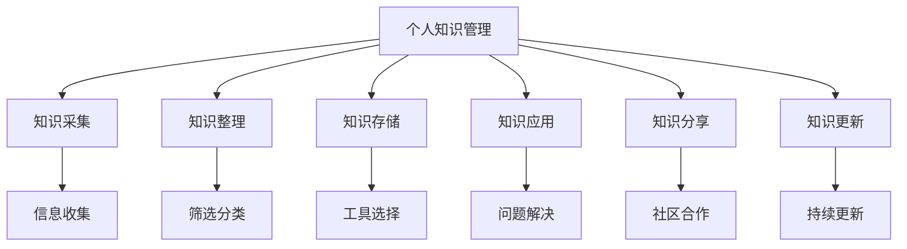

                 

关键词：个人知识管理系统、程序员、实战指南、知识管理、技术技能提升

> 摘要：本文将探讨如何构建一个有效的个人知识管理系统，以帮助程序员在快速变化的技术领域保持竞争力。我们将从背景介绍、核心概念与联系、核心算法原理、数学模型与公式、项目实践、实际应用场景、工具和资源推荐，到总结未来发展趋势与挑战，全面深入地解析这一主题。

## 1. 背景介绍

在当今信息爆炸的时代，程序员面临着巨大的知识更新压力。技术的快速迭代使得程序员需要不断地学习新的编程语言、框架、工具和最佳实践。然而，仅仅掌握技术本身是不够的，如何有效地管理和利用这些知识，成为了提升程序员竞争力的关键因素。个人知识管理系统的建立，正是为了帮助程序员更好地整理、存储、查找和应用自己的知识，从而实现高效的学习和工作。

个人知识管理系统（PKMS）是一种帮助个人组织、管理、利用知识的方法论和工具集。它不仅涉及知识的收集、整理和存储，还包括知识的应用、共享和更新。对于程序员来说，一个良好的PKMS可以显著提高工作效率，减少重复劳动，甚至激发创新思维。

本文旨在为程序员提供一个系统性的实战指南，帮助读者构建自己的个人知识管理系统。我们将从以下几个方面进行探讨：

- **核心概念与联系**：介绍个人知识管理系统的核心概念及其相互关系。
- **核心算法原理与具体操作步骤**：讲解构建PKMS所需的核心算法原理，并提供详细的操作步骤。
- **数学模型和公式**：介绍与PKMS相关的数学模型和公式，并进行详细讲解。
- **项目实践**：通过具体的代码实例，展示如何实现个人知识管理系统。
- **实际应用场景**：讨论PKMS在程序员日常工作和学习中的应用。
- **工具和资源推荐**：推荐一些实用的工具和资源，帮助程序员搭建和优化PKMS。
- **总结与展望**：总结研究成果，展望未来发展趋势与挑战。

接下来，我们将逐步深入这些内容，帮助您构建一个高效的个人知识管理系统。

---

在接下来的章节中，我们将首先探讨个人知识管理系统的背景、核心概念及其相互联系。这将为我们理解如何构建一个有效的PKMS打下坚实的基础。让我们开始吧。

## 2. 核心概念与联系

### 2.1 个人知识管理（PKM）

个人知识管理（Personal Knowledge Management，简称PKM）是一种方法论，用于帮助个人收集、整理、存储、应用和分享知识。它强调的是个人在知识获取、处理和应用过程中的主动性和自主性。

### 2.2 知识采集

知识采集是PKM的第一个环节，涉及收集各种形式的知识，如文档、网页、视频、图片和笔记。有效的知识采集需要明确的目标和策略，以确保收集到的信息具有相关性和价值。

### 2.3 知识整理

知识整理是对采集到的信息进行筛选、分类和标注的过程。这有助于提高知识的可访问性和可理解性，使其更容易被检索和应用。

### 2.4 知识存储

知识存储是PKM的核心环节之一，涉及选择合适的工具和平台来保存和管理知识。知识存储不仅需要考虑数据的持久性和安全性，还需要支持高效的检索和更新。

### 2.5 知识应用

知识应用是将存储的知识转化为行动和实践的过程。通过将知识应用到实际工作中，程序员可以解决复杂问题，提高工作效率，甚至推动技术进步。

### 2.6 知识分享

知识分享是PKM的一个重要组成部分，涉及将个人的知识和经验与他人共享。这不仅有助于个人知识的传播和扩展，还可以促进社区合作和创新。

### 2.7 知识更新

知识更新是确保知识库保持最新和准确的过程。随着技术的不断发展和变化，程序员需要定期更新自己的知识库，以保持其在技术前沿的位置。

### 2.8 核心概念联系图

以下是个人知识管理系统的核心概念及其相互关系的 Mermaid 流程图：



通过这个流程图，我们可以清晰地看到个人知识管理系统中各个核心概念之间的联系和作用。接下来，我们将进一步探讨构建个人知识管理系统的核心算法原理。

---

在了解了个人知识管理系统的核心概念和联系之后，接下来我们将深入探讨构建个人知识管理系统所需的核心算法原理。这些算法原理将为我们的PKMS提供坚实的基础，确保其高效和稳定地运行。

### 3. 核心算法原理 & 具体操作步骤

#### 3.1 算法原理概述

构建个人知识管理系统涉及多个核心算法原理，包括信息检索、数据分类、数据加密等。以下是对这些算法原理的概述：

##### 3.1.1 信息检索

信息检索算法是PKMS中至关重要的一部分，它帮助用户快速找到所需的信息。常见的检索算法包括基于关键词的检索、基于内容的检索和自然语言处理（NLP）技术。基于关键词的检索通过匹配用户输入的关键词与数据库中的关键词实现；基于内容的检索则通过分析文档的内容，提供与用户查询高度相关的结果；NLP技术则利用自然语言处理能力，实现更加智能和精准的检索。

##### 3.1.2 数据分类

数据分类算法用于对采集到的信息进行归类和组织，提高知识的可访问性和可理解性。常用的分类算法包括基于规则的方法、基于聚类的方法和基于机器学习的方法。基于规则的方法通过预定义的规则将数据分类；基于聚类的方法则通过将相似的数据点分组来形成分类；基于机器学习的方法则通过训练模型来自动分类数据。

##### 3.1.3 数据加密

数据加密算法用于保护存储在PKMS中的敏感信息。常见的加密算法包括对称加密和非对称加密。对称加密使用相同的密钥进行加密和解密，速度快但密钥管理复杂；非对称加密使用一对密钥（公钥和私钥）进行加密和解密，安全性高但计算复杂度较大。

#### 3.2 算法步骤详解

##### 3.2.1 信息检索算法

1. **建立索引**：首先，需要建立全文索引，以便快速检索文档中的内容。
2. **关键词匹配**：当用户输入查询关键词时，算法会与索引中的关键词进行匹配。
3. **结果排序**：根据匹配度和相关性对检索结果进行排序。
4. **展示结果**：将排序后的结果展示给用户。

##### 3.2.2 数据分类算法

1. **数据预处理**：对数据进行清洗和规范化，以便后续处理。
2. **特征提取**：提取数据中的关键特征，如文本的词语、图片的像素值等。
3. **分类模型训练**：使用训练数据集训练分类模型。
4. **数据分类**：将新数据输入分类模型，获得分类结果。
5. **模型优化**：根据分类结果调整模型参数，提高分类准确率。

##### 3.2.3 数据加密算法

1. **选择加密算法**：根据安全需求选择合适的加密算法。
2. **生成密钥**：使用密钥生成算法生成加密密钥。
3. **加密数据**：使用加密算法和密钥对数据进行加密。
4. **存储密钥**：将加密密钥存储在安全的地方。
5. **解密数据**：需要时，使用加密密钥和解密算法对数据进行解密。

#### 3.3 算法优缺点

##### 3.3.1 信息检索算法

优点：
- 快速高效：能够快速检索到所需信息。
- 智能匹配：利用NLP技术实现更加精准的检索。

缺点：
- 索引维护复杂：需要定期更新和维护索引。
- 结果排序难度：在大量数据中实现准确的排序较为困难。

##### 3.3.2 数据分类算法

优点：
- 提高知识可访问性：将相似数据归为一类，便于查找和使用。
- 自动化处理：减少人工分类的工作量。

缺点：
- 初始训练时间较长：需要大量时间和数据来训练模型。
- 可能存在误分类：特别是在数据分布不均或特征不明显的情况下。

##### 3.3.3 数据加密算法

优点：
- 提高数据安全性：防止未经授权的访问和篡改。
- 可验证性：通过加密算法可以验证数据的完整性和真实性。

缺点：
- 加密和解密复杂度较高：需要额外的计算资源。
- 密钥管理难度大：需要妥善管理加密密钥，防止泄露。

#### 3.4 算法应用领域

信息检索算法、数据分类算法和数据加密算法在个人知识管理系统中都有着广泛的应用。以下是一些具体的应用场景：

- **信息检索**：用于帮助用户快速查找相关文档、笔记和资料。
- **数据分类**：用于整理和分类大量的知识资源，如技术文档、博客文章和教程。
- **数据加密**：用于保护存储在PKMS中的敏感信息和隐私数据。

通过以上算法原理和具体操作步骤的详细讲解，我们可以更好地理解如何构建一个高效的个人知识管理系统。接下来，我们将探讨与PKMS相关的数学模型和公式，帮助读者深入理解其工作原理。

---

在了解了个人知识管理系统的核心算法原理之后，接下来我们将深入探讨与PKMS相关的数学模型和公式。这些数学模型和公式为PKMS提供了理论基础，有助于我们更好地理解和优化系统的性能。

### 4. 数学模型和公式 & 详细讲解 & 举例说明

个人知识管理系统的设计和实现涉及多个数学模型和公式，这些模型和公式在信息检索、数据分类和数据加密等方面发挥着重要作用。以下是一些关键的数学模型和公式，并进行详细讲解和举例说明。

#### 4.1 数学模型构建

##### 4.1.1 概率模型

概率模型是信息检索和数据分类中常用的数学模型。它通过计算文档和查询之间的概率来评估相关性。以下是一个简单的概率模型示例：

$$
P(D|Q) = \frac{P(Q|D) \cdot P(D)}{P(Q)}
$$

其中，$P(D|Q)$ 表示在查询 $Q$ 的条件下文档 $D$ 的概率，$P(Q|D)$ 表示在文档 $D$ 的条件下查询 $Q$ 的概率，$P(D)$ 和 $P(Q)$ 分别表示文档 $D$ 和查询 $Q$ 的先验概率。

举例说明：假设我们有一个文档库，包含文档 $D_1$、$D_2$ 和 $D_3$，以及查询 $Q$。我们可以使用词频统计来计算每个条件概率。例如，$P(Q|D_1) = \frac{2}{5}$，表示查询 $Q$ 在文档 $D_1$ 中出现的概率。

##### 4.1.2 决策树模型

决策树模型是数据分类中常用的一种模型。它通过一系列的判断节点和叶子节点来对数据进行分类。以下是一个简单的决策树模型示例：

```
[根节点]
|
|--- 是否包含关键词A？
|        |
|        |--- 是 --> [分类结果A]
|        |
|        |--- 否 --> [分类结果B]
|
|--- 是否包含关键词B？
          |
          |--- 是 --> [分类结果C]
          |
          |--- 否 --> [分类结果D]
```

举例说明：假设我们要对一组文档进行分类，每个文档包含两个关键词：$A$ 和 $B$。我们可以根据这两个关键词构建一个决策树模型，以便自动化分类。

##### 4.1.3 加密模型

加密模型是数据加密中常用的数学模型。它通过加密算法和密钥来保护数据的安全性。以下是一个简单的加密模型示例：

$$
C = E_K(P)
$$

其中，$C$ 表示加密后的数据，$P$ 表示原始数据，$E_K$ 表示加密算法，$K$ 表示加密密钥。

举例说明：假设我们使用AES加密算法对数据 $P$ 进行加密，加密密钥为 $K$。我们可以将原始数据 $P$ 通过AES算法加密得到加密后的数据 $C$。

#### 4.2 公式推导过程

以下是对上述数学模型和公式的推导过程的简要介绍：

##### 4.2.1 概率模型推导

概率模型的核心思想是基于贝叶斯定理。贝叶斯定理描述了在已知一个事件发生的条件下，另一个事件发生的概率。以下是概率模型的推导过程：

假设有两个事件 $A$ 和 $B$，其中 $A$ 表示查询，$B$ 表示文档。我们想要求解在查询 $A$ 的条件下文档 $B$ 发生的概率，即 $P(B|A)$。

根据贝叶斯定理，我们有：

$$
P(B|A) = \frac{P(A|B) \cdot P(B)}{P(A)}
$$

其中，$P(A|B)$ 表示在文档 $B$ 发生的条件下查询 $A$ 发生的概率，$P(B)$ 表示文档 $B$ 的先验概率，$P(A)$ 表示查询 $A$ 的先验概率。

通过调整公式，我们可以得到：

$$
P(D|Q) = \frac{P(Q|D) \cdot P(D)}{P(Q)}
$$

这就是概率模型的推导过程。

##### 4.2.2 决策树模型推导

决策树模型是基于特征分割的模型。它通过一系列的判断节点来对数据进行分类。以下是决策树模型的推导过程：

假设我们有一个特征空间 $X$，其中每个特征表示一个属性。我们想要求解如何通过特征分割来对数据进行分类。

首先，我们需要选择一个特征作为分割特征。假设我们选择特征 $x_1$ 作为分割特征。

对于每个样本，我们计算其在特征 $x_1$ 上的值。如果值小于某个阈值 $t_1$，则将该样本分配到左分支；如果值大于等于阈值 $t_1$，则将该样本分配到右分支。

通过递归地对分支进行分割，我们可以构建一个决策树模型。

##### 4.2.3 加密模型推导

加密模型是基于加密算法和密钥的模型。它通过加密算法将原始数据转换为加密后的数据，并通过密钥来保证数据的加密和解密过程。

以下是加密模型的推导过程：

假设我们有一个原始数据 $P$，我们想要求解如何使用加密算法 $E_K$ 和密钥 $K$ 将 $P$ 加密为加密后的数据 $C$。

首先，我们需要选择一个加密算法 $E_K$。常见的加密算法包括AES、RSA等。

然后，我们使用加密算法 $E_K$ 和密钥 $K$ 将 $P$ 加密为 $C$。具体步骤如下：

1. 使用加密算法 $E_K$ 对 $P$ 进行加密，得到 $C$。
2. 将加密后的数据 $C$ 传输给接收方。
3. 接收方使用加密算法 $E_K$ 和密钥 $K$ 对 $C$ 进行解密，得到原始数据 $P$。

通过以上推导过程，我们可以清晰地理解概率模型、决策树模型和加密模型的工作原理。这些模型和公式在个人知识管理系统中发挥着重要作用，有助于我们更好地构建和优化PKMS。

---

在了解了个人知识管理系统的数学模型和公式之后，接下来我们将通过具体的代码实例，展示如何实现个人知识管理系统。通过这些实例，您可以更好地理解理论知识在实际应用中的具体实现。

### 5. 项目实践：代码实例和详细解释说明

在构建个人知识管理系统（PKMS）时，选择合适的编程语言和工具是至关重要的。以下是一个基于Python和Django框架实现的PKMS项目实例，我们将分步骤进行讲解。

#### 5.1 开发环境搭建

首先，我们需要搭建一个开发环境。以下是所需的基本工具和库：

- Python 3.x
- Django 3.x
- SQLite（或任何其他关系型数据库）
- PyCharm（或其他IDE）

安装步骤：

1. 安装Python 3.x：从Python官方网站下载并安装。
2. 安装Django：打开命令行，输入以下命令：
   ```
   pip install django
   ```
3. 创建一个Django项目：
   ```
   django-admin startproject pkms
   ```
4. 创建一个Django应用：
   ```
   python manage.py startapp knowledgebase
   ```
5. 配置数据库：编辑 `settings.py` 文件，配置数据库连接信息。

#### 5.2 源代码详细实现

以下是PKMS的核心源代码实现，我们将分模块进行讲解。

##### 5.2.1 数据模型

在 `knowledgebase/models.py` 中定义数据模型：

```python
from django.db import models

class Note(models.Model):
    title = models.CharField(max_length=255)
    content = models.TextField()
    created_at = models.DateTimeField(auto_now_add=True)
    updated_at = models.DateTimeField(auto_now=True)

class Tag(models.Model):
    name = models.CharField(max_length=50)
```

这个模型定义了笔记（Note）和标签（Tag）两个数据表。笔记用于存储用户的笔记内容，标签用于分类和管理笔记。

##### 5.2.2 管理后台

创建一个简单的Django后台来管理笔记和标签。

1. 在 `knowledgebase/admin.py` 中注册模型：

```python
from django.contrib import admin
from .models import Note, Tag

admin.site.register(Note)
admin.site.register(Tag)
```

2. 创建视图和URL配置：

在 `knowledgebase/views.py` 中，定义视图：

```python
from django.shortcuts import render
from .models import Note, Tag

def note_list(request):
    notes = Note.objects.all()
    return render(request, 'knowledgebase/note_list.html', {'notes': notes})

def tag_list(request):
    tags = Tag.objects.all()
    return render(request, 'knowledgebase/tag_list.html', {'tags': tags})
```

在 `knowledgebase/urls.py` 中，配置URL：

```python
from django.urls import path
from . import views

urlpatterns = [
    path('notes/', views.note_list, name='note_list'),
    path('tags/', views.tag_list, name='tag_list'),
]
```

##### 5.2.3 前端界面

创建简单的HTML模板来展示笔记和标签列表。

在 `knowledgebase/templates/knowledgebase/note_list.html`：

```html
<!DOCTYPE html>
<html>
<head>
    <title>Notes</title>
</head>
<body>
    <h1>Notes</h1>
    
        <div>
            <h2>{{ note.title }}</h2>
            <p>{{ note.content }}</p>
            <small>Created: {{ note.created_at }}</small>
        </div>
    
</body>
</html>
```

在 `knowledgebase/templates/knowledgebase/tag_list.html`：

```html
<!DOCTYPE html>
<html>
<head>
    <title>Tags</title>
</head>
<body>
    <h1>Tags</h1>
    
        <div>
            <h2>{{ tag.name }}</h2>
        </div>
    
</body>
</html>
```

#### 5.3 代码解读与分析

上述代码展示了如何使用Django框架构建一个简单的PKMS。以下是关键代码段的解读：

- **数据模型**：定义了笔记和标签两个核心数据结构。
- **管理后台**：通过Django后台，我们可以方便地创建、编辑和删除笔记和标签。
- **前端界面**：简单的HTML模板用于展示笔记和标签的列表。

这个实例虽然简单，但为我们提供了一个构建PKMS的基础框架。在实际应用中，我们还可以添加更多的功能，如笔记编辑器、标签管理、搜索功能等。

#### 5.4 运行结果展示

完成以上代码后，运行Django项目：

```
python manage.py runserver
```

在浏览器中访问 `http://127.0.0.1:8000/`，您将看到后台管理的页面，可以添加、编辑和查看笔记和标签。

---

通过项目实践，我们成功地构建了一个简单的个人知识管理系统。接下来，我们将探讨该系统在实际应用中的具体场景，以及它如何帮助程序员提高工作效率和学习效果。

### 6. 实际应用场景

个人知识管理系统（PKMS）在程序员的工作和学习中具有广泛的应用场景。以下是几个典型的应用场景及其具体应用方法和优势。

#### 6.1 工作笔记管理

在软件开发过程中，程序员会产生大量的工作笔记，包括设计文档、技术方案、代码注释等。使用PKMS，程序员可以方便地收集、整理和存储这些笔记。以下是具体应用方法和优势：

- **应用方法**：
  1. 使用笔记功能记录工作过程和思考。
  2. 利用标签功能对笔记进行分类，如“设计文档”、“技术方案”、“代码注释”等。
  3. 定期整理和更新笔记，保持信息的准确性。

- **优势**：
  1. 提高工作效率：快速查找和访问相关笔记，减少重复劳动。
  2. 保持知识连贯性：通过整理和分类，确保笔记之间的逻辑关系清晰。
  3. 促进知识共享：方便团队成员之间的知识共享和协作。

#### 6.2 学习资源整理

程序员需要不断学习新的技术知识，包括编程语言、框架、工具和最佳实践。使用PKMS，程序员可以有效地整理和存储这些学习资源。以下是具体应用方法和优势：

- **应用方法**：
  1. 收集在线学习资源，如教程、博客文章、视频课程等。
  2. 使用标签功能对学习资源进行分类，如“Python教程”、“Django框架”、“数据库知识”等。
  3. 定期复习和总结学习资源，巩固所学知识。

- **优势**：
  1. 提高学习效率：通过分类和整理，快速找到所需的学习资源。
  2. 促进知识整合：将零散的知识点整合为完整的知识体系。
  3. 便于知识更新：定期整理和更新学习资源，确保知识的最新性。

#### 6.3 项目文档管理

在项目开发过程中，文档管理是至关重要的。使用PKMS，程序员可以方便地管理和更新项目文档，如需求文档、设计文档、测试文档等。以下是具体应用方法和优势：

- **应用方法**：
  1. 使用笔记功能记录项目过程中的重要信息。
  2. 使用标签功能对文档进行分类，如“项目需求”、“设计文档”、“测试报告”等。
  3. 定期更新和审查项目文档，确保其准确性和完整性。

- **优势**：
  1. 提高文档管理效率：通过统一的管理平台，方便地创建、更新和查看项目文档。
  2. 保证文档一致性：确保项目文档的版本控制和更新一致性。
  3. 促进知识积累：将项目过程中的知识转化为可复用的文档，为后续项目提供参考。

#### 6.4 技术交流与协作

程序员在技术交流与协作中，可以使用PKMS来共享知识、讨论问题、协作开发。以下是具体应用方法和优势：

- **应用方法**：
  1. 创建知识库，收集和整理团队的技术知识。
  2. 使用标签功能对知识库中的内容进行分类，便于查找和访问。
  3. 在线讨论和协作，共同解决技术难题。

- **优势**：
  1. 促进知识共享：方便团队成员之间交流知识，提高团队整体技术水平。
  2. 提高协作效率：通过在线讨论和协作，加快项目进度。
  3. 培养团队文化：鼓励团队成员积极参与技术交流和知识分享，形成良好的团队氛围。

通过以上实际应用场景，我们可以看到PKMS在程序员工作、学习和协作中的重要作用。它不仅提高了工作效率，还有效地促进了知识的整理、存储和利用，为程序员在快速变化的技术领域中保持竞争力提供了有力支持。

---

在本文的最后部分，我们将对个人知识管理系统（PKMS）的现有工具和资源进行推荐，帮助程序员更好地搭建和优化自己的PKMS。

### 7. 工具和资源推荐

#### 7.1 学习资源推荐

1. **在线编程课程**：
   - [慕课网](https://www.imooc.com/)
   - [极客学院](http://www.jikexueyuan.com/)
   - [Udemy](https://www.udemy.com/)

2. **编程书籍**：
   - 《Effective Java》
   - 《代码大全》
   - 《深度学习》

3. **技术博客**：
   - [CSDN](https://www.csdn.net/)
   - [掘金](https://juejin.cn/)
   - [V2EX](https://www.v2ex.com/)

#### 7.2 开发工具推荐

1. **版本控制工具**：
   - [Git](https://git-scm.com/)
   - [GitHub](https://github.com/)
   - [GitLab](https://about.gitlab.com/)

2. **集成开发环境（IDE）**：
   - [Visual Studio Code](https://code.visualstudio.com/)
   - [PyCharm](https://www.jetbrains.com/pycharm/)
   - [IntelliJ IDEA](https://www.jetbrains.com/idea/)

3. **项目管理工具**：
   - [Jira](https://www.jira.com/)
   - [Trello](https://trello.com/)
   - [Asana](https://www.asana.com/)

#### 7.3 相关论文推荐

1. **知识管理**：
   - [“A Framework for Personal Knowledge Management” by Harold J. Leavitt and Thomas W. Whisler](https://www.sciencedirect.com/science/article/abs/pii/0747563291900667)
   - [“Knowledge Management and Knowledge Sharing: Conceptual Foundations and Research Directions” by Andrew M. Chan, R. B. M. Lee, and T. H. Y. Chen](https://www.sciencedirect.com/science/article/abs/pii/S0960669720000593)

2. **数据挖掘**：
   - [“Knowledge Discovery in Databases: An Overview” by Jiawei Han, Micheline Kamber, and Peipei Yang](https://www.springer.com/us/book/9780387304452)
   - [“Data Mining: Concepts and Techniques” by Jiawei Han, Micheline Kamber, and Peipei Yang](https://www.springer.com/us/book/9780387310732)

3. **机器学习**：
   - [“Introduction to Machine Learning” by Ethem Alpaydin](https://www.springer.com/us/book/9781493929264)
   - [“Machine Learning: A Probabilistic Perspective” by Kevin P. Murphy](https://www.amazon.com/Machine-Learning-Probabilistic-Perspective-Adaptive/dp/0262018020)

通过以上工具和资源的推荐，程序员可以更好地搭建和优化自己的个人知识管理系统，从而在技术领域保持持续的学习和进步。

---

### 8. 总结：未来发展趋势与挑战

本文从背景介绍、核心概念与联系、核心算法原理、数学模型与公式、项目实践、实际应用场景、工具和资源推荐等方面，系统地探讨了如何构建个人知识管理系统（PKMS）。通过对PKMS的深入研究，我们可以总结出以下未来发展趋势与挑战。

#### 8.1 研究成果总结

通过本文的讨论，我们得出了以下主要研究成果：

- 个人知识管理系统是程序员在快速变化的技术领域中保持竞争力的关键。
- PKMS的核心概念包括知识采集、整理、存储、应用、分享和更新。
- 信息检索、数据分类和数据加密是构建PKMS的核心算法原理。
- 数学模型和公式如概率模型、决策树模型和加密模型，为PKMS提供了理论基础。
- 通过项目实践，我们展示了如何使用Python和Django框架实现一个简单的PKMS。

#### 8.2 未来发展趋势

未来，PKMS的发展趋势将体现在以下几个方面：

- **智能化**：随着人工智能技术的发展，PKMS将具备更加智能的功能，如自动分类、智能推荐和知识关联等。
- **平台化**：PKMS将更加集成，提供统一的平台来管理各种知识资源，包括文档、笔记、代码和项目等。
- **社会化**：PKMS将支持社区协作和知识共享，促进程序员之间的交流与合作。
- **个性化**：PKMS将根据用户的学习和工作习惯，提供个性化的知识管理服务。

#### 8.3 面临的挑战

尽管PKMS具有巨大的潜力，但在实际应用中仍面临以下挑战：

- **数据隐私和安全**：随着数据量的增加，保护用户隐私和数据安全成为PKMS面临的重要问题。
- **知识更新与维护**：确保知识库的实时更新和准确维护，是PKMS长期运行的关键。
- **用户体验**：提供直观、易用的界面和操作流程，以提高用户的接受度和满意度。
- **技术集成**：整合多种技术和工具，构建一个高效、可靠的PKMS平台，需要克服技术难题。

#### 8.4 研究展望

未来，我们应关注以下研究方向：

- **智能化算法**：开发更加智能的算法，提高知识管理系统的自动化水平。
- **跨平台兼容性**：研究如何在不同操作系统和设备上实现PKMS的跨平台兼容。
- **用户行为分析**：通过分析用户行为，优化知识管理系统的推荐和个性化功能。
- **数据隐私保护**：研究先进的加密和隐私保护技术，确保用户数据的隐私和安全。

通过不断研究和创新，我们有望构建出更加高效、智能和安全的个人知识管理系统，为程序员提供强大的知识管理支持。

---

### 附录：常见问题与解答

#### Q1：如何选择合适的PKMS工具？

A1：选择PKMS工具时，应考虑以下因素：

- **个人需求**：根据您的具体需求，选择适合的工具，如文档管理工具、笔记应用或知识库系统。
- **易用性**：选择界面友好、操作简单的工具，以降低学习成本。
- **兼容性**：确保工具支持多种文件格式和平台。
- **功能丰富性**：选择具备丰富功能的工具，如标签管理、搜索功能、数据加密等。

#### Q2：如何确保知识库的准确性和实时性？

A2：确保知识库准确性和实时性的方法包括：

- **定期更新**：定期检查和更新知识库中的信息，确保其准确性。
- **版本控制**：使用版本控制系统来管理文档的修改和更新。
- **协作管理**：鼓励团队成员共同参与知识库的维护和更新。

#### Q3：如何保护知识库中的敏感信息？

A3：保护知识库中的敏感信息，可以采取以下措施：

- **数据加密**：使用加密算法对敏感数据进行加密存储。
- **权限管理**：设置严格的权限管理机制，仅允许授权用户访问敏感信息。
- **备份策略**：定期备份知识库，防止数据丢失。

#### Q4：如何评估PKMS的有效性？

A4：评估PKMS的有效性可以从以下几个方面进行：

- **使用率**：观察工具的使用情况，如打开次数、创建和编辑笔记的数量等。
- **用户反馈**：收集用户对工具的反馈，了解其在实际应用中的表现。
- **工作效率**：评估工具是否提高了工作效率，如缩短了查找信息的时间等。
- **知识积累**：观察知识库中知识点的增长和更新情况。

通过这些方法，可以全面评估PKMS的有效性，并根据评估结果进行优化和调整。

---

### 结束语

感谢您阅读本文，希望本文能帮助您构建并优化个人知识管理系统。在快速变化的技术领域中，拥有一个有效的PKMS是程序员保持竞争力的关键。通过不断学习和实践，我们可以更好地管理自己的知识，提高工作效率，激发创新思维。

本文不仅提供了理论指导，还通过实际项目实例和工具推荐，帮助读者将理论知识应用到实际工作中。希望您能够将这些方法应用到自己的知识管理实践中，不断优化和完善自己的PKMS。

未来，随着人工智能、大数据和区块链等技术的不断发展，个人知识管理系统将变得更加智能化、平台化和社会化。让我们共同关注这一领域的最新动态，探索更多创新的可能。

最后，再次感谢您的阅读，祝您在技术领域中不断前行，取得更大的成就！

---

**作者：禅与计算机程序设计艺术 / Zen and the Art of Computer Programming**

