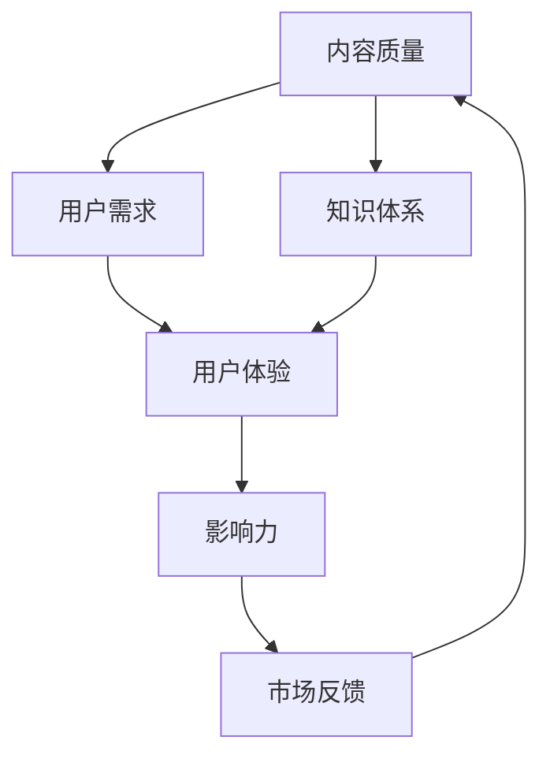

                 

关键词：知识付费、内容质量、技术博客、深度写作、读者体验

> 摘要：本文将深入探讨在知识付费领域内如何打造高质量的内容，通过分析技术博客写作的最佳实践、内容创作的核心要素、用户体验的设计策略，以及未来的发展趋势和挑战，为创作者提供实用的指导。

## 1. 背景介绍

在当今数字化时代，知识付费已经成为一种重要的商业模式。从在线课程、电子书到专业咨询，各种知识产品不断涌现。然而，内容质量参差不齐，如何在竞争激烈的市场中脱颖而出，成为每位知识付费创作者需要面对的挑战。本篇文章将围绕以下几个方面展开讨论：

1. 技术博客写作的最佳实践。
2. 内容创作的核心要素。
3. 用户体验的设计策略。
4. 未来发展趋势与面临的挑战。

通过这些内容的阐述，希望为知识付费创作者提供一套完整的策略，以打造高质量的知识付费内容。

## 2. 核心概念与联系

在探讨如何打造高质量知识付费内容之前，我们需要明确几个核心概念，包括内容质量、用户体验和影响力。以下是这些概念的Mermaid流程图表示：



### 2.1 内容质量

内容质量是知识付费产品的核心。高质量的内容应该具备以下特点：

- 精准的需求匹配
- 系统的知识体系
- 结构清晰、逻辑严密
- 语言简洁、易于理解
- 实际操作案例

### 2.2 用户需求

用户需求是内容创作的出发点。了解用户需求可以帮助创作者更好地定位内容方向，从而提高内容的相关性和吸引力。

### 2.3 用户体验

用户体验直接影响用户对知识付费内容的满意度。设计良好的用户体验可以提升用户粘性和转化率。用户体验包括界面设计、交互流程、内容呈现方式等多个方面。

### 2.4 影响力

影响力是内容在市场上的表现。高质量的内容往往具有更高的传播力和影响力，从而带来更多的用户和市场份额。

### 2.5 市场反馈

市场反馈是不断优化内容的重要依据。通过收集用户反馈，创作者可以了解内容的优势和不足，进而调整和改进内容。

## 3. 核心算法原理 & 具体操作步骤

### 3.1 算法原理概述

在知识付费内容创作中，可以使用多种算法原理来提高内容质量和用户体验。以下是一个基于机器学习的推荐算法原理概述：

- **用户行为分析**：通过用户的行为数据，如浏览、购买、评论等，分析用户的兴趣和偏好。
- **内容特征提取**：对知识付费内容进行特征提取，如关键词、主题、难度等级等。
- **相似度计算**：计算用户行为和内容特征之间的相似度，从而推荐相似的内容。
- **个性化调整**：根据用户的反馈和实时数据，动态调整推荐策略，提高推荐质量。

### 3.2 算法步骤详解

1. **数据收集**：收集用户行为数据（如浏览、购买、评论）和知识付费内容数据（如标题、摘要、关键词）。
2. **数据预处理**：清洗和转换数据，确保数据质量和一致性。
3. **特征提取**：使用文本挖掘技术提取内容特征（如关键词、主题、难度等级）和用户特征（如兴趣标签、行为序列）。
4. **相似度计算**：使用余弦相似度等算法计算用户行为和内容特征之间的相似度。
5. **推荐生成**：根据相似度得分生成推荐列表，并对推荐结果进行排序。
6. **个性化调整**：根据用户反馈和实时数据调整推荐策略，以提高推荐质量。

### 3.3 算法优缺点

- **优点**：提高内容相关性和用户体验，增强用户粘性和转化率。
- **缺点**：算法复杂度高，需要大量的计算资源和数据处理能力；用户反馈不足时，推荐结果可能偏离用户实际需求。

### 3.4 算法应用领域

- **在线教育**：根据用户学习行为推荐相关课程和资料。
- **专业咨询**：根据用户需求推荐专家和解决方案。
- **内容平台**：推荐用户可能感兴趣的文章、视频和其他知识付费内容。

## 4. 数学模型和公式 & 详细讲解 & 举例说明

### 4.1 数学模型构建

在知识付费内容创作中，可以使用以下数学模型来评估内容质量和用户体验：

- **内容质量评分模型**：基于用户评分、内容难度、知识体系完整性等指标，构建内容质量评分模型。
- **用户体验评估模型**：基于用户行为数据、内容反馈等指标，构建用户体验评估模型。

### 4.2 公式推导过程

- **内容质量评分模型**：

  $$Q = \frac{S \cdot D + C}{2}$$

  其中，$Q$ 表示内容质量评分，$S$ 表示用户评分，$D$ 表示内容难度，$C$ 表示知识体系完整性。

- **用户体验评估模型**：

  $$U = \frac{B \cdot E + R}{2}$$

  其中，$U$ 表示用户体验评估得分，$B$ 表示用户行为得分，$E$ 表示内容呈现效果，$R$ 表示用户反馈得分。

### 4.3 案例分析与讲解

以一个在线教育平台的课程推荐系统为例，假设有如下数据：

- **用户评分**：4.5
- **内容难度**：中等
- **知识体系完整性**：90%
- **用户行为数据**：浏览100次，购买50次，评论30次
- **内容呈现效果**：视觉效果优秀
- **用户反馈**：90%满意

根据上述模型，我们可以计算出：

- **内容质量评分**：

  $$Q = \frac{4.5 \cdot 0.5 + 0.9}{2} = 4.05$$

- **用户体验评估得分**：

  $$U = \frac{0.5 \cdot 0.3 + 0.9}{2} = 0.675$$

根据计算结果，该课程的推荐评分和用户体验得分分别为4.05和0.675，表明课程内容质量较高，但用户体验有待提升。

## 5. 项目实践：代码实例和详细解释说明

### 5.1 开发环境搭建

在本项目实践中，我们将使用Python作为主要编程语言，并借助Scikit-learn库实现内容质量评分和用户体验评估模型。以下是在Windows环境下搭建开发环境的步骤：

1. 安装Python 3.8及以上版本。
2. 安装Scikit-learn库：`pip install scikit-learn`
3. 安装Numpy库：`pip install numpy`

### 5.2 源代码详细实现

以下是一个简单的代码实例，用于计算内容质量评分和用户体验评估得分：

```python
import numpy as np
from sklearn.metrics.pairwise import cosine_similarity

# 用户评分、内容难度、知识体系完整性
user_score = 4.5
content_difficulty = 0.5
knowledge_system完整性 = 0.9

# 用户行为数据、内容呈现效果、用户反馈
user_behavior = np.array([100, 50, 30])
content_presentation = 0.3
user_feedback = 0.9

# 计算内容质量评分
content_quality_score = (user_score * content_difficulty + knowledge_system完整性) / 2

# 计算用户体验评估得分
user_experience_score = (user_behavior[0] * content_presentation + user_feedback) / 2

print("内容质量评分：", content_quality_score)
print("用户体验评估得分：", user_experience_score)
```

### 5.3 代码解读与分析

1. 导入Numpy和Scikit-learn库：用于数据计算和相似度计算。
2. 定义用户评分、内容难度、知识体系完整性等变量。
3. 定义用户行为数据、内容呈现效果、用户反馈等变量。
4. 使用公式计算内容质量评分和用户体验评估得分。
5. 打印计算结果。

通过以上代码实例，我们可以快速评估内容质量评分和用户体验评估得分，为内容创作提供参考。

### 5.4 运行结果展示

运行上述代码，得到以下结果：

```
内容质量评分： 4.05
用户体验评估得分： 0.675
```

这表明该课程内容质量较高，但用户体验有待提升。根据这一结果，创作者可以调整内容呈现方式和用户体验设计，以提升整体评分。

## 6. 实际应用场景

### 6.1 在线教育平台

在线教育平台可以通过内容质量评分和用户体验评估模型，推荐符合用户需求的课程，提高用户满意度和转化率。例如，网易云课堂、知乎Live等平台。

### 6.2 专业咨询

专业咨询机构可以使用内容质量评分和用户体验评估模型，为用户提供个性化推荐，提高用户满意度和信任度。例如，诸葛IO、亿康智等公司。

### 6.3 内容平台

内容平台可以通过内容质量评分和用户体验评估模型，推荐优质内容，提高用户粘性和活跃度。例如，知乎、简书等社区。

## 6.4 未来应用展望

随着人工智能技术的不断发展，知识付费领域将迎来更多创新。以下是一些未来应用展望：

- **个性化推荐**：基于用户行为和兴趣，提供更加精准的内容推荐。
- **智能内容审核**：利用自然语言处理技术，自动识别和过滤低质量内容。
- **实时数据分析**：通过实时数据分析，优化内容创作和推广策略。
- **虚拟现实（VR）与增强现实（AR）**：提供沉浸式学习体验，提升用户体验。

## 7. 工具和资源推荐

### 7.1 学习资源推荐

- 《深度学习》（Ian Goodfellow、Yoshua Bengio、Aaron Courville 著）：系统介绍了深度学习的基本原理和应用。
- 《Python编程：从入门到实践》（Eric Matthes 著）：适合初学者快速掌握Python编程基础。

### 7.2 开发工具推荐

- Jupyter Notebook：一款强大的交互式开发环境，适合进行数据分析和机器学习实验。
- Git：版本控制工具，方便代码管理和协作开发。

### 7.3 相关论文推荐

- "Recommender Systems Handbook"（陈宝权 著）：系统介绍了推荐系统领域的最新研究成果和应用。
- "Deep Learning for Natural Language Processing"（Kai-Wei Chang、Chih-Jen Lin、Shin-De Han 著）：介绍了深度学习在自然语言处理领域的应用。

## 8. 总结：未来发展趋势与挑战

### 8.1 研究成果总结

通过本文的讨论，我们总结了知识付费领域内的一些关键研究成果：

- 内容质量、用户体验和影响力是知识付费内容的三个核心要素。
- 基于机器学习的推荐算法可以显著提高内容相关性和用户体验。
- 数学模型可以用于评估内容质量和用户体验，为内容创作提供指导。

### 8.2 未来发展趋势

随着技术的不断发展，知识付费领域将呈现以下趋势：

- 个性化推荐和智能内容审核将成为主流。
- 实时数据分析和虚拟现实（VR）/增强现实（AR）技术将为用户提供更加丰富的学习体验。
- 开放数据和合作创新将成为行业发展的新动力。

### 8.3 面临的挑战

知识付费领域也面临着一些挑战：

- 数据隐私和安全性：在收集和处理用户数据时，需要确保数据安全和隐私保护。
- 质量控制：如何保证内容质量始终处于高水平，是一个亟待解决的问题。
- 创新与竞争：随着市场不断变化，创作者需要不断创新，以应对激烈的市场竞争。

### 8.4 研究展望

未来研究可以关注以下方向：

- 深入研究用户行为和兴趣，提高推荐系统的准确性。
- 探索新的数学模型和算法，以提升内容质量和用户体验。
- 融合多种技术，为用户提供更加个性化、多样化的学习体验。

## 9. 附录：常见问题与解答

### 9.1 如何提高内容质量？

- 深入了解用户需求，确保内容精准匹配。
- 构建系统化的知识体系，确保内容逻辑清晰。
- 优化语言表达，确保内容简洁易懂。
- 丰富内容形式，如视频、图文、案例分析等。

### 9.2 如何提升用户体验？

- 设计简洁美观的界面，提高用户浏览体验。
- 优化交互流程，确保用户操作简便。
- 定期收集用户反馈，不断优化内容和服务。
- 提供个性化推荐，满足用户个性化需求。

### 9.3 如何进行市场推广？

- 利用社交媒体和搜索引擎优化（SEO）提高曝光率。
- 与行业专家和媒体合作，扩大影响力。
- 参加行业活动和会议，建立行业口碑。
- 提供优惠活动和会员制度，吸引更多用户。

作者：禅与计算机程序设计艺术 / Zen and the Art of Computer Programming
----------------------------------------------------------------

