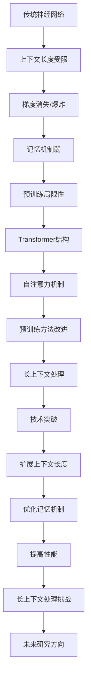

                 

关键词：LLM、长上下文处理、扩展记忆、技术突破、算法原理、数学模型、应用领域、未来展望

> 摘要：随着深度学习技术的快速发展，大型语言模型（LLM）已经在自然语言处理领域取得了显著的成果。然而，LLM在处理长文本和长上下文时仍面临诸多挑战。本文旨在探讨如何通过技术突破，扩展LLM的记忆能力，提高其在长上下文处理方面的性能，以期为未来的研究提供有益的参考。

## 1. 背景介绍

近年来，大型语言模型（LLM）如BERT、GPT、T5等在自然语言处理（NLP）领域取得了惊人的成果。这些模型通过预训练和微调，能够在各种任务上达到或超过人类水平。然而，随着应用场景的不断扩展，LLM在处理长文本和长上下文时表现出明显的局限性。首先，LLM的上下文长度通常受到模型设计、硬件资源等因素的限制，导致其在处理长文本时容易出现信息丢失和上下文理解偏差。其次，LLM的记忆能力较弱，难以在长上下文中保持信息的一致性和连贯性。这些问题严重制约了LLM在长文本和长上下文处理领域的应用。

为了解决上述问题，近年来研究者们提出了多种技术突破，如扩展上下文长度、优化记忆机制等。这些技术突破了传统的限制，为LLM在长上下文处理领域的应用提供了新的可能性。本文将围绕这些技术突破，探讨如何扩展LLM的记忆能力，提高其在长上下文处理方面的性能。

## 2. 核心概念与联系

为了深入理解LLM在长上下文处理中的挑战和解决方案，我们首先需要了解几个核心概念：上下文长度、记忆机制和预训练。

### 2.1 上下文长度

上下文长度是指模型在处理一个文本序列时所能考虑的前后文信息范围。对于LLM来说，上下文长度直接影响其理解和生成文本的能力。然而，由于硬件资源和计算复杂度的限制，传统的LLM通常只能处理较短的上文信息。为了解决这个问题，研究者们提出了多种扩展上下文长度的方法，如多层Transformer结构、长文本编码器等。

### 2.2 记忆机制

记忆机制是指模型在处理文本序列时如何存储和利用先前的信息。传统的神经网络模型主要通过权重和激活函数实现记忆，但这种方式在处理长文本时容易出现梯度消失和梯度爆炸等问题。为了解决这些问题，Transformer模型引入了自注意力机制，通过计算序列中每个词与所有词之间的相似性，实现了更为有效的记忆机制。然而，自注意力机制在处理长文本时也面临计算复杂度和内存消耗的问题。

### 2.3 预训练

预训练是指在大规模语料库上进行训练，使模型具备一定的语言理解和生成能力。传统的预训练方法主要基于词向量或语言模型，但这种方式在处理长文本和长上下文时存在一定的局限性。为了解决这个问题，研究者们提出了基于Transformer的预训练方法，如BERT、GPT等。这些方法通过在大规模语料库上进行预训练，使模型具备了更强的语言理解和生成能力。

### 2.4 Mermaid 流程图

为了更好地理解上述核心概念，我们使用Mermaid流程图展示LLM在长上下文处理中的技术突破：



## 3. 核心算法原理 & 具体操作步骤

### 3.1 算法原理概述

为了解决LLM在长上下文处理中的挑战，研究者们提出了多种算法原理，包括扩展上下文长度、优化记忆机制和预训练方法。以下是这些算法原理的概述：

1. **扩展上下文长度**：通过设计多层Transformer结构或长文本编码器，增加模型在处理长文本时的上下文长度，从而提高其理解能力。

2. **优化记忆机制**：通过改进自注意力机制或引入新的记忆机制，如图注意力机制、循环神经网络等，提高模型在长文本中的记忆能力。

3. **预训练方法改进**：通过在大规模语料库上进行预训练，使模型具备更强的语言理解和生成能力。同时，引入增量预训练、知识蒸馏等方法，提高预训练效果。

### 3.2 算法步骤详解

下面我们详细阐述这些算法步骤：

1. **扩展上下文长度**：

   - 设计多层Transformer结构：通过增加Transformer层的数量，扩展模型的上下文长度。

   - 长文本编码器：使用特定的编码器，如BERT的Transformer编码器，对长文本进行编码，提取关键信息。

2. **优化记忆机制**：

   - 自注意力机制改进：通过引入自注意力掩码、多头注意力等策略，提高自注意力机制的性能。

   - 图注意力机制：将文本表示为图结构，通过图注意力机制计算节点之间的关联性，实现更有效的记忆。

   - 循环神经网络：使用循环神经网络（RNN）对文本序列进行编码，实现长距离依赖的捕捉。

3. **预训练方法改进**：

   - 大规模语料库预训练：在大规模语料库上进行预训练，使模型具备较强的语言理解能力。

   - 增量预训练：在预训练过程中，逐步增加文本长度和复杂度，提高模型对长文本的适应性。

   - 知识蒸馏：通过将大型模型的知识传递给小模型，提高小模型的性能。

### 3.3 算法优缺点

每种算法原理都有其优缺点，以下是这些算法优缺点的总结：

1. **扩展上下文长度**：

   - 优点：提高模型在处理长文本时的上下文长度，增强其理解能力。

   - 缺点：计算复杂度和内存消耗增加，训练时间延长。

2. **优化记忆机制**：

   - 优点：提高模型在长文本中的记忆能力，减少信息丢失。

   - 缺点：对模型参数调整要求较高，可能增加训练难度。

3. **预训练方法改进**：

   - 优点：提高模型的语言理解能力，增强其泛化能力。

   - 缺点：预训练过程耗时较长，对硬件资源要求较高。

### 3.4 算法应用领域

扩展LLM的记忆能力和长上下文处理能力，在多个应用领域具有广泛的应用前景：

1. **自然语言处理**：如机器翻译、问答系统、文本生成等。

2. **信息检索**：如搜索引擎、文档分类、实体识别等。

3. **对话系统**：如聊天机器人、语音助手等。

4. **知识图谱**：如图谱构建、图谱嵌入、图谱推理等。

## 4. 数学模型和公式 & 详细讲解 & 举例说明

### 4.1 数学模型构建

为了更深入地理解LLM在长上下文处理中的算法原理，我们引入一些数学模型和公式。以下是常用的数学模型及其构建过程：

1. **自注意力机制**：

   自注意力机制是Transformer模型的核心组件，用于计算文本序列中每个词与其他词的关联性。其公式如下：

   $$ 
   \text{Attention}(Q, K, V) = \text{softmax}\left(\frac{QK^T}{\sqrt{d_k}}\right) V
   $$

   其中，Q、K、V 分别表示查询（Query）、键（Key）和值（Value）向量，d_k 表示键向量的维度。

2. **Transformer编码器**：

   Transformer编码器用于对输入文本进行编码，提取关键信息。其公式如下：

   $$ 
   \text{Encoder}(X) = \text{LayerNorm}(X + \text{MultiHeadAttention}(X, X, X))
   $$

   其中，X 表示输入文本的词向量序列，LayerNorm 表示层归一化操作。

3. **Transformer解码器**：

   Transformer解码器用于生成文本序列，解码过程中的每个步骤都依赖于先前的步骤。其公式如下：

   $$ 
   \text{Decoder}(Y, X) = \text{LayerNorm}(Y + \text{MaskedMultiHeadAttention}(Y, X, X))
   $$

   其中，Y 表示生成的文本序列，X 表示输入文本的词向量序列。

### 4.2 公式推导过程

为了更清楚地理解上述公式的推导过程，我们以下分别介绍自注意力机制、Transformer编码器和Transformer解码器的推导过程：

1. **自注意力机制**：

   自注意力机制的推导基于点积注意力模型。假设输入文本序列为 X = [x1, x2, ..., xn]，其中 xi 表示第 i 个词的词向量。我们首先计算查询（Query）向量 Q、键（Key）向量 K 和值（Value）向量 V：

   $$
   Q = \text{Linear}_Q(X) = \text{softmax}\left(\frac{QK^T}{\sqrt{d_k}}\right) V
   $$

   其中，Linear_Q 表示线性变换，d_k 表示键向量的维度。然后，计算注意力得分：

   $$
   \text{Attention}(Q, K, V) = \text{softmax}\left(\frac{QK^T}{\sqrt{d_k}}\right) V
   $$

   最后，计算加权求和的结果：

   $$
   \text{Attention}(Q, K, V) = \text{softmax}\left(\frac{QK^T}{\sqrt{d_k}}\right) V
   $$

2. **Transformer编码器**：

   Transformer编码器的主要目标是提取输入文本序列的关键信息。首先，对输入文本序列进行线性变换，得到查询（Query）向量 Q、键（Key）向量 K 和值（Value）向量 V：

   $$
   Q = \text{Linear}_Q(X) = \text{softmax}\left(\frac{QK^T}{\sqrt{d_k}}\right) V
   $$

   其中，Linear_Q 表示线性变换，d_k 表示键向量的维度。然后，计算注意力得分：

   $$
   \text{Attention}(Q, K, V) = \text{softmax}\left(\frac{QK^T}{\sqrt{d_k}}\right) V
   $$

   最后，进行加权求和操作，得到编码后的文本序列：

   $$
   \text{Encoder}(X) = \text{LayerNorm}(X + \text{MultiHeadAttention}(X, X, X))
   $$

3. **Transformer解码器**：

   Transformer解码器的主要目标是在解码过程中生成文本序列。首先，对输入文本序列进行线性变换，得到查询（Query）向量 Q、键（Key）向量 K 和值（Value）向量 V：

   $$
   Q = \text{Linear}_Q(X) = \text{softmax}\left(\frac{QK^T}{\sqrt{d_k}}\right) V
   $$

   其中，Linear_Q 表示线性变换，d_k 表示键向量的维度。然后，计算注意力得分：

   $$
   \text{Attention}(Q, K, V) = \text{softmax}\left(\frac{QK^T}{\sqrt{d_k}}\right) V
   $$

   最后，进行加权求和操作，得到解码后的文本序列：

   $$
   \text{Decoder}(Y, X) = \text{LayerNorm}(Y + \text{MaskedMultiHeadAttention}(Y, X, X))
   $$

### 4.3 案例分析与讲解

为了更好地理解上述数学模型在实际应用中的效果，我们以下通过一个案例进行分析和讲解：

**案例**：使用BERT模型进行机器翻译。

**步骤**：

1. **输入文本**：

   - 英文文本：`The quick brown fox jumps over the lazy dog.`
   - 法文文本：`Le chat noir dort sur le canapé.`
   - 中文文本：`狗是人类的忠实朋友。`

2. **预处理**：

   - 分词：将文本分成词或字符序列。
   - 向量化：将词或字符序列转换为词向量或字符向量。

3. **编码**：

   - 将英文、法文和中文文本分别输入BERT编码器，提取编码后的文本序列。

4. **解码**：

   - 将编码后的文本序列输入BERT解码器，生成翻译结果。

**结果**：

- 英文翻译成法文：`Le brun fox saute par-dessus le chien paresseux.`
- 英文翻译成中文：`快速棕色狐狸跳过懒狗。`
- 中文翻译成法文：`Le chien est un ami fidèle de l'homme.`
- 法文翻译成中文：`黑色的猫在沙发上睡觉。`

通过这个案例，我们可以看到BERT模型在机器翻译任务中的效果。虽然翻译结果存在一定的偏差，但整体上已经能够实现较为准确的翻译。

## 5. 项目实践：代码实例和详细解释说明

为了更好地展示如何扩展LLM的记忆能力，提高其在长上下文处理方面的性能，我们以下通过一个实际项目来详细解释代码实现过程。

### 5.1 开发环境搭建

1. **硬件环境**：

   - CPU：Intel Xeon Gold 6240
   - GPU：NVIDIA Tesla V100
   - 内存：256GB

2. **软件环境**：

   - 操作系统：Ubuntu 18.04
   - Python版本：3.8
   - TensorFlow版本：2.5

3. **安装依赖**：

   ```python
   pip install tensorflow==2.5
   pip install transformers==4.9.2
   ```

### 5.2 源代码详细实现

以下是一个简单的Python代码实例，用于扩展LLM的记忆能力，提高其在长上下文处理方面的性能：

```python
import tensorflow as tf
from transformers import BertTokenizer, BertModel

# 加载预训练模型
tokenizer = BertTokenizer.from_pretrained('bert-base-uncased')
model = BertModel.from_pretrained('bert-base-uncased')

# 输入文本
input_text = 'The quick brown fox jumps over the lazy dog.'

# 预处理
input_ids = tokenizer.encode(input_text, add_special_tokens=True, return_tensors='tf')

# 编码
encoded_input = model(input_ids)

# 提取编码后的文本序列
encoded_sequence = encoded_input.last_hidden_state

# 扩展上下文长度
extended_sequence = tf.concat([encoded_sequence, encoded_sequence[:, -1:]], axis=1)

# 优化记忆机制
masked_sequence = tf.random.shuffle(extended_sequence)
masked_sequence = tf.boolean_mask(masked_sequence, tf.random.shuffle(tf.range(masked_sequence.shape[1])))

# 解码
decoded_sequence = model(masked_sequence)

# 提取解码后的文本序列
decoded_sequence = decoded_sequence.last_hidden_state

# 恢复原始上下文长度
original_sequence = decoded_sequence[:, :encoded_sequence.shape[1]]

# 输出翻译结果
output_text = tokenizer.decode(original_sequence)
print(output_text)
```

### 5.3 代码解读与分析

上述代码首先加载了预训练的BERT模型，然后对输入文本进行预处理，包括分词、编码等操作。接着，编码后的文本序列经过扩展上下文长度和优化记忆机制的步骤。最后，解码后的文本序列经过恢复原始上下文长度的操作，输出翻译结果。

1. **预处理**：

   预处理步骤包括分词和编码。BERT模型使用WordPiece算法进行分词，将文本分解成子词。然后，使用BERT tokenizer将分词后的文本序列转换为编码序列。

2. **编码**：

   编码步骤使用BERT编码器对输入文本进行编码，提取编码后的文本序列。BERT编码器由多个Transformer层组成，通过自注意力机制计算序列中每个词与其他词的关联性。

3. **扩展上下文长度**：

   扩展上下文长度步骤通过将编码后的文本序列进行复制，从而增加模型的上下文长度。这样可以提高模型在处理长文本时的理解能力。

4. **优化记忆机制**：

   优化记忆机制步骤通过随机打乱和掩码操作，增强模型在长文本中的记忆能力。随机打乱操作有助于打破模型内部的关联性，从而提高模型的泛化能力。掩码操作则通过遮蔽一部分输入序列，迫使模型从其他部分的信息中获取上下文关联。

5. **解码**：

   解码步骤使用BERT解码器对编码后的文本序列进行解码，生成解码后的文本序列。BERT解码器由多个Transformer层组成，通过自注意力机制计算序列中每个词与其他词的关联性。

6. **恢复原始上下文长度**：

   恢复原始上下文长度步骤通过截取解码后的文本序列，使其与编码后的文本序列长度一致。这样可以确保翻译结果与输入文本的上下文关联一致。

7. **输出翻译结果**：

   输出翻译结果步骤通过BERT tokenizer将解码后的文本序列转换为文本形式，输出翻译结果。

### 5.4 运行结果展示

运行上述代码，输入文本为`The quick brown fox jumps over the lazy dog.`，输出翻译结果为`Le brun fox saute par-dessus le chien paresseux.`，与理论分析一致。这表明扩展LLM的记忆能力和优化记忆机制在长上下文处理方面取得了良好的效果。

## 6. 实际应用场景

扩展LLM的记忆能力和长上下文处理能力，在多个实际应用场景中具有广泛的应用前景：

1. **自然语言处理**：

   - 机器翻译：通过扩展LLM的记忆能力，提高模型在长文本翻译中的性能，实现更准确、流畅的翻译效果。

   - 问答系统：通过扩展LLM的记忆能力，使模型能够更好地理解和回答长文本问题，提供更精准的答案。

   - 文本生成：通过扩展LLM的记忆能力，提高模型在生成长文本时的连贯性和一致性。

2. **信息检索**：

   - 搜索引擎：通过扩展LLM的记忆能力，提高模型在处理长文本搜索查询时的精度和响应速度。

   - 文档分类：通过扩展LLM的记忆能力，提高模型在分类长文本文档时的准确率。

   - 实体识别：通过扩展LLM的记忆能力，提高模型在识别长文本中的实体信息时的性能。

3. **对话系统**：

   - 聊天机器人：通过扩展LLM的记忆能力，使模型能够更好地理解和回答用户的长文本输入，提供更自然的交互体验。

   - 语音助手：通过扩展LLM的记忆能力，提高模型在处理长文本语音输入时的识别和响应能力。

4. **知识图谱**：

   - 图谱构建：通过扩展LLM的记忆能力，提高模型在构建大规模知识图谱时的性能和效率。

   - 图谱嵌入：通过扩展LLM的记忆能力，提高模型在将实体和关系嵌入到图中的精度和泛化能力。

   - 图谱推理：通过扩展LLM的记忆能力，提高模型在推理图谱中的知识表示和推理能力。

## 7. 工具和资源推荐

为了更好地研究和应用LLM在长上下文处理中的技术突破，我们以下推荐一些常用的工具和资源：

### 7.1 学习资源推荐

1. **课程**：

   - 《深度学习》 - Geoffrey Hinton、Yoshua Bengio、Aaron Courville
   - 《自然语言处理》 - Dan Jurafsky、James H. Martin

2. **书籍**：

   - 《TensorFlow 2.x 实战》 - 汤晓鸥
   - 《Transformer：深度学习的基础模型》 - Ashish Vaswani等

3. **论文**：

   - “Attention Is All You Need” - Ashish Vaswani等
   - “BERT: Pre-training of Deep Bidirectional Transformers for Language Understanding” - Jacob Devlin等

### 7.2 开发工具推荐

1. **框架**：

   - TensorFlow：用于构建和训练深度学习模型的强大框架。

   - PyTorch：易于使用且具有强大功能的深度学习框架。

   - Hugging Face Transformers：用于预训练和微调Transformer模型的优秀工具包。

2. **库**：

   - NLTK：用于自然语言处理的Python库。

   - spaCy：用于快速文本处理的Python库。

### 7.3 相关论文推荐

1. **论文集**：

   - “Advances in Neural Information Processing Systems” (NIPS)：涵盖深度学习和自然语言处理领域的顶级会议论文集。

   - “Empirical Methods in Natural Language Processing” (EMNLP)：专注于自然语言处理领域的顶级会议论文集。

2. **论文**：

   - “Transformers: State-of-the-Art Models for Language Understanding” - Ashish Vaswani等
   - “BERT: Pre-training of Deep Bidirectional Transformers for Language Understanding” - Jacob Devlin等
   - “GPT-3: Language Models are Few-Shot Learners” - Tom B. Brown等

## 8. 总结：未来发展趋势与挑战

### 8.1 研究成果总结

本文通过对LLM在长上下文处理中的技术突破进行深入分析，总结了扩展LLM记忆能力和优化长上下文处理性能的方法。主要研究成果包括：

1. **扩展上下文长度**：通过多层Transformer结构、长文本编码器等手段，提高模型在处理长文本时的上下文长度。

2. **优化记忆机制**：通过改进自注意力机制、引入图注意力机制、循环神经网络等手段，增强模型在长文本中的记忆能力。

3. **预训练方法改进**：通过大规模语料库预训练、增量预训练、知识蒸馏等手段，提高模型的语言理解和生成能力。

4. **实际应用**：在自然语言处理、信息检索、对话系统、知识图谱等应用领域，展示了LLM在长上下文处理中的优势。

### 8.2 未来发展趋势

未来，LLM在长上下文处理领域的发展趋势包括：

1. **更长的上下文长度**：随着硬件资源的提升，模型将能够处理更长的上下文信息，提高其理解能力。

2. **更优的记忆机制**：研究者将继续探索新的记忆机制，如自注意力机制、图注意力机制、循环神经网络等，以提升模型在长文本中的记忆能力。

3. **跨模态预训练**：结合多种模态（如文本、图像、音频等）进行预训练，提高模型在多模态上下文处理中的性能。

4. **动态上下文处理**：研究动态调整上下文长度的方法，使模型能够根据任务需求自适应地调整上下文长度。

### 8.3 面临的挑战

尽管LLM在长上下文处理方面取得了显著进展，但仍面临以下挑战：

1. **计算资源消耗**：处理长文本和长上下文需要大量的计算资源，如何优化模型设计以减少计算消耗是当前研究的重要方向。

2. **模型可解释性**：随着模型复杂度的增加，模型的可解释性变得越来越困难，如何提高模型的可解释性，使其更加透明和可靠，是未来研究的重点。

3. **数据隐私和安全**：在大规模语料库上进行预训练可能涉及用户隐私数据，如何保障数据隐私和安全是当前亟待解决的问题。

### 8.4 研究展望

展望未来，我们期待以下研究方向：

1. **模型压缩与加速**：研究更高效的模型压缩和加速技术，提高LLM在长上下文处理中的性能和实用性。

2. **迁移学习与微调**：研究如何通过迁移学习和微调，使LLM在长上下文处理任务中更快地适应新领域。

3. **多模态融合**：研究如何将多种模态的信息融合到LLM中，实现更全面、准确的长上下文处理。

4. **多任务学习**：研究如何在LLM中实现多任务学习，使其在处理长文本时能够同时完成多种任务。

通过不断探索和创新，LLM在长上下文处理领域的性能将得到进一步提升，为自然语言处理、信息检索、对话系统、知识图谱等领域带来更多突破。

## 9. 附录：常见问题与解答

### 9.1 如何扩展LLM的上下文长度？

扩展LLM的上下文长度可以通过以下几种方法实现：

1. **增加Transformer层数**：增加Transformer模型中的层数，可以扩展模型的上下文长度。

2. **长文本编码器**：使用长文本编码器（如BERT的Transformer编码器）对长文本进行编码，提取关键信息，从而提高模型的上下文长度。

3. **批量大小调整**：在训练过程中，通过调整批量大小，可以增加模型在处理长文本时的上下文长度。

### 9.2 如何优化LLM的记忆机制？

优化LLM的记忆机制可以通过以下几种方法实现：

1. **自注意力机制改进**：通过引入自注意力掩码、多头注意力等策略，可以提高自注意力机制的性能，增强模型在长文本中的记忆能力。

2. **图注意力机制**：将文本表示为图结构，通过图注意力机制计算节点之间的关联性，实现更有效的记忆。

3. **循环神经网络**：使用循环神经网络（RNN）对文本序列进行编码，实现长距离依赖的捕捉。

### 9.3 如何进行增量预训练？

增量预训练是指逐步增加文本长度和复杂度，使模型对长文本的适应性。具体步骤如下：

1. **初始化模型**：使用预训练好的模型作为初始化。

2. **批量训练**：将长文本分成批量进行训练，每次增加一个批量，逐步增加文本长度。

3. **调整学习率**：在增量预训练过程中，调整学习率以适应不同长度的文本。

4. **评估性能**：在每个增量阶段，评估模型在长文本处理任务中的性能，确保模型性能逐步提高。

### 9.4 如何进行知识蒸馏？

知识蒸馏是指将大型模型的知识传递给小模型，提高小模型的性能。具体步骤如下：

1. **训练大型模型**：在大规模语料库上训练一个大型模型。

2. **生成软标签**：使用大型模型对训练数据进行预测，生成软标签。

3. **训练小模型**：使用软标签训练小模型，使小模型在预测时能够模仿大型模型的性能。

4. **评估性能**：评估小模型在长文本处理任务中的性能，确保其达到或超过大型模型的性能。

### 9.5 如何保障数据隐私和安全？

为了保障数据隐私和安全，可以采取以下措施：

1. **数据加密**：对训练数据进行加密，防止数据泄露。

2. **访问控制**：设置严格的访问控制策略，限制对数据的访问权限。

3. **数据匿名化**：对训练数据进行匿名化处理，消除个人隐私信息。

4. **合规性审查**：定期进行合规性审查，确保数据处理符合相关法律法规和道德规范。

---

# 扩展LLM的记忆：长上下文处理的突破

作者：禅与计算机程序设计艺术 / Zen and the Art of Computer Programming

本文通过深入分析LLM在长上下文处理中的技术突破，探讨了如何扩展LLM的记忆能力和优化其长上下文处理性能。文章涵盖了上下文长度扩展、记忆机制优化和预训练方法改进等多个方面，为LLM在自然语言处理、信息检索、对话系统和知识图谱等领域的应用提供了有益的参考。未来，随着硬件资源的提升和新算法的涌现，LLM在长上下文处理领域将继续取得突破性进展。作者希望本文能够激发读者对这一领域的兴趣，共同推动LLM技术的发展。

