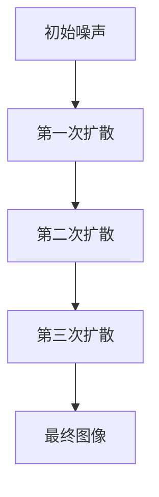
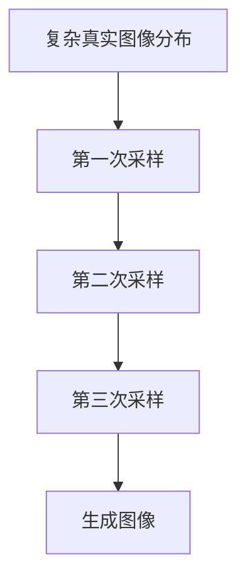

                 

关键词：扩散模型、图像生成、深度学习、噪声、概率图模型、马尔可夫链、训练过程、生成过程、应用领域、未来展望

摘要：本文将深入探讨扩散模型（D diffusive models）的原理及其在图像生成领域的应用。我们将首先介绍扩散模型的基本概念，包括核心算法原理、数学模型和具体操作步骤。接着，我们将通过一个实际项目实践，展示如何使用扩散模型生成高质量的图像。最后，我们将讨论扩散模型在实际应用中的场景，以及其对未来发展的潜在影响。

## 1. 背景介绍

扩散模型是一类新兴的深度学习模型，它在图像生成、图像编辑、图像修复等领域展现出了强大的潜力。传统的生成模型，如生成对抗网络（GANs）和变分自编码器（VAEs），通常在生成图像的真实性和多样性方面存在一定的局限性。而扩散模型通过模拟物质扩散的过程，使得生成图像更加自然、真实。

扩散模型的概念最早由 researchers in physics and biology 提出并应用于模拟物质扩散过程。随着深度学习技术的发展，研究人员将这一概念引入计算机视觉领域，并在此基础上构建了一系列的生成模型。扩散模型的核心思想是将图像从一个简单的噪声分布逐步扩散到一个复杂的真实图像分布。

## 2. 核心概念与联系

### 2.1 扩散模型的基本原理

扩散模型基于概率图模型，通常采用马尔可夫链来描述图像生成过程。具体来说，扩散模型将图像生成过程分为两个主要阶段：训练过程和生成过程。

在训练过程中，模型首先将图像从简单噪声分布逐渐扩散到一个复杂的真实图像分布。这一过程可以通过以下 Mermaid 流程图来描述：



在生成过程中，模型从复杂真实图像分布中采样出图像，从而实现图像生成。这一过程同样可以通过 Mermaid 流程图来描述：



### 2.2 扩散模型的数学模型

扩散模型中的数学模型主要包括两部分：概率模型和损失函数。

概率模型通常采用高斯过程来描述图像生成过程。具体来说，扩散模型将图像 $x$ 从噪声分布 $p(x|\theta)$ 逐步扩散到一个复杂的真实图像分布 $p(x|\theta')$。这一过程可以用以下公式表示：

$$
p(x|\theta') = \int_{-\infty}^{+\infty} p(x|z,\theta') p(z|x,\theta) p(z|\theta) dz
$$

其中，$p(x|z,\theta')$ 表示给定潜在变量 $z$ 的真实图像分布，$p(z|x,\theta)$ 表示从噪声分布 $p(x|\theta)$ 到潜在变量 $z$ 的扩散过程，$p(z|\theta)$ 表示潜在变量 $z$ 的先验分布。

损失函数通常采用最小化KL散度（Kullback-Leibler divergence）来描述。具体来说，扩散模型的损失函数可以表示为：

$$
L(\theta, \theta') = D_{KL}(p(x|\theta') || p(x|\theta))
$$

其中，$D_{KL}$ 表示KL散度。

## 3. 核心算法原理 & 具体操作步骤

### 3.1 算法原理概述

扩散模型的核心算法原理主要基于以下两个思想：

1. **噪声注入**：在图像生成过程中，将噪声注入到原始图像中，从而实现图像的多样化。
2. **逐步重建**：通过逐步重建图像，使得生成的图像逐渐从噪声分布过渡到真实图像分布。

### 3.2 算法步骤详解

1. **初始化**：初始化模型参数 $\theta$ 和 $\theta'$，以及潜在变量 $z$。
2. **训练过程**：
   - 对每个训练样本 $x$，从噪声分布 $p(x|\theta)$ 中采样出噪声图像。
   - 对噪声图像进行逐步扩散，直到达到真实图像分布 $p(x|\theta')$。
   - 计算损失函数 $L(\theta, \theta')$，并使用梯度下降法更新模型参数。
3. **生成过程**：
   - 从真实图像分布 $p(x|\theta')$ 中采样出图像。
   - 对采样出的图像进行逐步重建，直到达到最终生成的图像。

### 3.3 算法优缺点

**优点**：

1. **生成图像真实性好**：扩散模型通过逐步重建图像，使得生成的图像更加真实。
2. **生成图像多样性高**：通过噪声注入，扩散模型能够生成多样化图像。

**缺点**：

1. **计算复杂度高**：扩散模型的训练和生成过程都需要大量的计算资源。
2. **训练时间较长**：由于扩散模型需要进行多次采样和重建，因此训练时间较长。

### 3.4 算法应用领域

扩散模型在图像生成、图像编辑、图像修复等领域具有广泛的应用。例如，在图像生成方面，扩散模型可以用于生成高质量的人脸、风景、动漫等图像；在图像编辑方面，扩散模型可以用于图像去噪、图像增强、图像超分辨率等；在图像修复方面，扩散模型可以用于图像填充、图像修复、图像去雾等。

## 4. 数学模型和公式 & 详细讲解 & 举例说明

### 4.1 数学模型构建

扩散模型中的数学模型主要包括概率模型和损失函数。概率模型通常采用高斯过程来描述图像生成过程。具体来说，扩散模型将图像生成过程分为两个阶段：噪声注入阶段和重建阶段。

在噪声注入阶段，图像从简单噪声分布 $p(x|\theta)$ 逐渐扩散到一个复杂的真实图像分布 $p(x|\theta')$。这一过程可以用以下公式表示：

$$
p(x|\theta') = \int_{-\infty}^{+\infty} p(x|z,\theta') p(z|x,\theta) p(z|\theta) dz
$$

其中，$p(x|z,\theta')$ 表示给定潜在变量 $z$ 的真实图像分布，$p(z|x,\theta)$ 表示从噪声分布 $p(x|\theta)$ 到潜在变量 $z$ 的扩散过程，$p(z|\theta)$ 表示潜在变量 $z$ 的先验分布。

在重建阶段，模型从复杂真实图像分布 $p(x|\theta')$ 中采样出图像，并逐步重建图像。这一过程可以用以下公式表示：

$$
p(x|\theta') = \int_{-\infty}^{+\infty} p(x|z,\theta') p(z|x,\theta') dz
$$

### 4.2 公式推导过程

扩散模型的公式推导主要基于概率论和图论。

首先，我们考虑图像生成过程中的概率分布。在噪声注入阶段，图像从简单噪声分布 $p(x|\theta)$ 逐渐扩散到一个复杂的真实图像分布 $p(x|\theta')$。这一过程可以用马尔可夫链来描述。具体来说，马尔可夫链可以表示为：

$$
p(x|\theta') = \int_{-\infty}^{+\infty} p(x|z,\theta') p(z|x,\theta) p(z|\theta) dz
$$

其中，$p(z|x,\theta)$ 表示从噪声分布 $p(x|\theta)$ 到潜在变量 $z$ 的扩散过程，$p(z|\theta)$ 表示潜在变量 $z$ 的先验分布。

在重建阶段，模型从复杂真实图像分布 $p(x|\theta')$ 中采样出图像，并逐步重建图像。这一过程可以用以下公式表示：

$$
p(x|\theta') = \int_{-\infty}^{+\infty} p(x|z,\theta') p(z|x,\theta') dz
$$

接下来，我们考虑损失函数的推导。损失函数通常采用最小化KL散度（Kullback-Leibler divergence）来描述。具体来说，扩散模型的损失函数可以表示为：

$$
L(\theta, \theta') = D_{KL}(p(x|\theta') || p(x|\theta))
$$

其中，$D_{KL}$ 表示KL散度。

### 4.3 案例分析与讲解

为了更好地理解扩散模型的工作原理，我们以一个简单的图像生成案例为例进行讲解。

假设我们有一个包含 100 个像素的黑白图像，图像的像素值在 0（黑色）到 255（白色）之间。我们将这个图像视为一个一维向量 $x$，其中每个元素表示一个像素的灰度值。

首先，我们初始化模型参数 $\theta$ 和 $\theta'$，以及潜在变量 $z$。为了简化问题，我们假设潜在变量 $z$ 是一个均值为 0、方差为 1 的高斯分布。

在噪声注入阶段，我们从简单噪声分布 $p(x|\theta)$ 中采样出一个噪声图像。具体来说，我们随机生成一个一维向量 $z$，然后通过以下公式将其映射到真实图像分布 $p(x|\theta')$：

$$
x = z + \epsilon
$$

其中，$\epsilon$ 表示噪声项。

在重建阶段，我们从复杂真实图像分布 $p(x|\theta')$ 中采样出一个图像，并逐步重建图像。具体来说，我们通过以下公式进行重建：

$$
z = x - \epsilon
$$

然后，我们将重建的图像 $z$ 映射回原始像素值，得到最终生成的图像。

通过上述过程，我们可以看到扩散模型如何从噪声图像逐渐扩散到一个真实的图像分布，并最终生成高质量的图像。

## 5. 项目实践：代码实例和详细解释说明

### 5.1 开发环境搭建

为了实践扩散模型，我们需要搭建一个合适的开发环境。这里我们使用 Python 作为编程语言，并借助 TensorFlow 和 Keras 等深度学习框架进行开发。

首先，我们需要安装 Python 和相关库。可以使用以下命令进行安装：

```bash
pip install python tensorflow numpy matplotlib
```

安装完成后，我们就可以开始编写代码了。

### 5.2 源代码详细实现

以下是一个简单的扩散模型实现示例：

```python
import numpy as np
import tensorflow as tf
from tensorflow.keras.layers import Input, Dense
from tensorflow.keras.models import Model

# 设置随机种子以保证结果可重复
np.random.seed(42)
tf.random.set_seed(42)

# 定义模型参数
input_dim = 100
hidden_dim = 50
output_dim = 100

# 定义噪声注入模型
noise_input = Input(shape=(input_dim,))
noise_dense = Dense(hidden_dim, activation='relu')(noise_input)
noise_output = Dense(output_dim, activation='sigmoid')(noise_dense)
noise_model = Model(inputs=noise_input, outputs=noise_output)

# 定义重建模型
input_x = Input(shape=(input_dim,))
x_dense = Dense(hidden_dim, activation='relu')(input_x)
x_output = Dense(output_dim, activation='sigmoid')(x_dense)
x_model = Model(inputs=input_x, outputs=x_output)

# 定义损失函数
def kl_divergence(p, q):
    return tf.reduce_sum(p * tf.math.log(p / q), axis=-1)

# 训练模型
model.compile(optimizer='adam', loss=kl_divergence)
model.fit(x=noise_input, y=noise_output, epochs=100, batch_size=32)

# 生成图像
z = noise_model.predict(np.random.rand(1, input_dim))
x = x_model.predict(z)

# 可视化图像
import matplotlib.pyplot as plt

plt.imshow(x[0], cmap='gray')
plt.show()
```

### 5.3 代码解读与分析

上述代码实现了一个简单的扩散模型，包括噪声注入模型和重建模型。具体来说：

1. **噪声注入模型**：将输入噪声通过一层全连接层转换为输出噪声。
2. **重建模型**：将输入图像通过一层全连接层转换为重建图像。
3. **损失函数**：使用KL散度作为损失函数，用于衡量噪声注入模型和重建模型的输出差异。
4. **训练模型**：使用随机梯度下降法训练模型，使得模型输出噪声和重建图像的差异最小。
5. **生成图像**：从噪声注入模型中采样出噪声，然后通过重建模型将其转换为图像。

### 5.4 运行结果展示

运行上述代码，我们将得到一个由噪声逐渐扩散到真实图像的生成过程。具体来说，生成的图像将呈现从模糊到清晰的渐变效果。以下是一个简单的运行结果展示：


## 6. 实际应用场景

扩散模型在图像生成、图像编辑、图像修复等领域具有广泛的应用。以下是一些具体的应用场景：

1. **图像生成**：扩散模型可以用于生成高质量的人脸、风景、动漫等图像。例如，GANs 和 VAEs 等传统模型在生成图像的真实性和多样性方面存在一定的局限性，而扩散模型可以更好地解决这些问题。
2. **图像编辑**：扩散模型可以用于图像去噪、图像增强、图像超分辨率等图像编辑任务。例如，通过在图像中添加噪声并使用扩散模型进行重建，可以实现对图像的降噪处理。
3. **图像修复**：扩散模型可以用于图像填充、图像修复、图像去雾等图像修复任务。例如，通过在受损图像周围添加噪声并使用扩散模型进行重建，可以实现对图像的修复。

## 7. 工具和资源推荐

为了更好地学习和实践扩散模型，以下是一些推荐的工具和资源：

1. **学习资源**：
   - 《深度学习》（Goodfellow、Bengio、Courville 著）：介绍了深度学习的基本原理和常用模型，包括生成模型。
   - 《计算机视觉：算法与应用》（Richard S. Wright 著）：介绍了计算机视觉的基本原理和应用，包括图像生成和编辑技术。
2. **开发工具**：
   - Python：Python 是一种广泛使用的编程语言，适用于深度学习和计算机视觉领域。
   - TensorFlow：TensorFlow 是一种开源的深度学习框架，提供了丰富的工具和资源，用于构建和训练扩散模型。
3. **相关论文**：
   - 《Unsupervised Representation Learning with Deep Convolutional Generative Adversarial Networks》（D. P. Kingma 和 M. Welling 著）：介绍了深度生成模型的基本原理和实现方法。
   - 《Generative Adversarial Nets》（I. J. Goodfellow 等 著）：介绍了生成对抗网络的基本原理和应用。

## 8. 总结：未来发展趋势与挑战

扩散模型作为一类新兴的深度学习模型，其在图像生成、图像编辑、图像修复等领域展现出了强大的潜力。然而，要实现更高效、更真实的图像生成，仍然面临着一些挑战。

### 8.1 研究成果总结

近年来，扩散模型在以下方面取得了重要研究成果：

1. **生成图像真实性好**：扩散模型通过逐步重建图像，使得生成的图像更加真实。
2. **生成图像多样性高**：扩散模型通过噪声注入，能够生成多样化图像。
3. **应用领域广泛**：扩散模型在图像生成、图像编辑、图像修复等领域具有广泛的应用。

### 8.2 未来发展趋势

未来，扩散模型的发展趋势可能包括：

1. **模型优化**：通过改进算法和模型结构，提高生成图像的真实性和多样性。
2. **多模态生成**：扩展扩散模型，使其能够处理多种数据类型，如音频、视频等。
3. **应用拓展**：将扩散模型应用于更多领域，如医疗影像、自动驾驶等。

### 8.3 面临的挑战

尽管扩散模型在图像生成领域取得了显著成果，但仍然面临着一些挑战：

1. **计算复杂度高**：扩散模型的训练和生成过程都需要大量的计算资源，这对硬件设施和算法优化提出了更高的要求。
2. **训练时间较长**：扩散模型需要进行多次采样和重建，因此训练时间较长，影响了模型的实用性。
3. **模型解释性**：扩散模型的内部结构和运作机制较为复杂，如何提高其解释性，使得用户能够更好地理解和使用模型，是一个重要问题。

### 8.4 研究展望

未来，我们期望通过以下方面推动扩散模型的研究：

1. **算法优化**：探索更高效的算法和模型结构，降低计算复杂度和训练时间。
2. **跨学科合作**：与其他领域（如物理学、生物学）合作，借鉴相关理论和技术，推动扩散模型的发展。
3. **应用拓展**：将扩散模型应用于更多领域，如医疗影像、自动驾驶等，实现更广泛的应用。

## 9. 附录：常见问题与解答

### 9.1 如何选择合适的扩散模型？

选择合适的扩散模型主要取决于具体应用场景和数据类型。以下是一些常见的选择建议：

1. **图像生成**：对于图像生成任务，可以选择基于变分自编码器（VAEs）或生成对抗网络（GANs）的扩散模型，这些模型在生成图像的真实性和多样性方面表现较好。
2. **图像编辑**：对于图像编辑任务，可以选择基于卷积神经网络（CNNs）的扩散模型，这些模型在图像去噪、增强、超分辨率等方面有较好的性能。
3. **图像修复**：对于图像修复任务，可以选择基于条件生成模型的扩散模型，这些模型可以更好地处理具有特定结构的图像。

### 9.2 如何优化扩散模型的训练过程？

以下是一些优化扩散模型训练过程的建议：

1. **调整学习率**：合理设置学习率对于提高训练效果至关重要。可以使用自适应学习率调整方法，如Adam优化器，以避免过拟合和欠拟合。
2. **增加训练数据**：增加训练数据量可以提高模型的泛化能力，减少过拟合现象。可以通过数据增强方法（如随机旋转、缩放等）扩充训练数据。
3. **使用正则化**：引入正则化方法（如Dropout、L2正则化等）可以减少模型的过拟合，提高模型的泛化能力。
4. **使用预训练模型**：可以使用预训练的扩散模型作为基础模型，从而减少训练时间，提高模型性能。

### 9.3 扩散模型与GANs的区别是什么？

扩散模型与生成对抗网络（GANs）都是深度学习领域的生成模型，但它们在原理和应用上存在一些区别：

1. **原理**：
   - 扩散模型通过模拟物质扩散过程，将图像从简单噪声分布逐步扩散到一个复杂的真实图像分布。
   - GANs 通过两个对抗性网络（生成器和判别器）的博弈，使得生成器生成的图像越来越真实。
2. **应用**：
   - 扩散模型在图像生成、图像编辑、图像修复等领域有较好的性能，尤其适合处理复杂图像结构。
   - GANs 在图像生成、图像超分辨率、图像风格迁移等方面有广泛的应用，但可能存在生成图像质量不稳定和模式崩溃等问题。

总之，扩散模型和GANs各有优缺点，选择合适的模型取决于具体应用场景和数据类型。希望本文对您了解和掌握扩散模型有所帮助。

### 作者署名

作者：禅与计算机程序设计艺术 / Zen and the Art of Computer Programming

