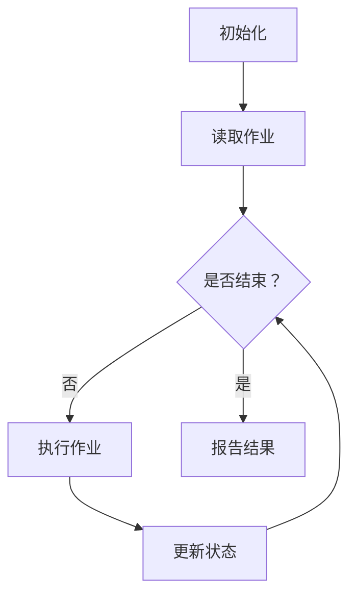

                 

关键词：批处理，原理，代码实例，操作系统，自动化，效率优化，脚本编写

## 摘要

批处理作为一种自动化技术，在操作系统和软件开发中扮演着至关重要的角色。本文将深入探讨批处理的原理，从基础概念到实际应用，为您呈现一种高效解决复杂数据处理问题的方法。通过详细的代码实例讲解，我们将了解如何编写有效的批处理脚本，以提升工作效率和系统性能。本文旨在为读者提供一个全面且易于理解的批处理教程，帮助他们在实际项目中更好地利用这一强大的工具。

## 1. 背景介绍

批处理（Batch Processing）是一种计算机处理方式，它将一系列命令或任务打包在一起，然后由计算机系统一次性执行。这种方式在早期计算机时代尤为重要，因为那时计算机的处理能力相对有限，需要高效利用系统资源。随着技术的发展，批处理的应用逐渐扩展到了许多领域，如金融数据处理、文件传输、数据备份等。

### 1.1 历史背景

批处理的概念可以追溯到20世纪50年代。早期的计算机由于处理能力有限，通常一次只能执行一个任务。为了充分利用计算机资源，人们开始将一系列相关的任务组合成一个批处理作业，然后一次性提交给计算机系统处理。这种方式大大提高了计算机的工作效率。

### 1.2 现代应用

在现代，批处理技术依然广泛使用。例如，银行系统会使用批处理来处理大量的交易记录，以确保账目准确无误。在企业级应用中，批处理用于定期执行数据备份、报告生成、系统监控等任务。此外，批处理还在云计算和大数据分析中发挥着重要作用。

## 2. 核心概念与联系

在深入探讨批处理之前，我们需要了解几个核心概念：

### 2.1 批处理作业

批处理作业是指由一系列命令或任务组成的集合。这些任务可以是简单的文件操作、数据库更新、或者更复杂的计算任务。

### 2.2 批处理系统

批处理系统是一种操作系统，专门用于管理批处理作业的执行。常见的批处理系统包括Windows命令提示符、Unix/Linux的Shell脚本等。

### 2.3 脚本

脚本是一种自动化工具，它包含了一系列命令或指令，用于自动化执行一系列任务。在批处理中，脚本起着至关重要的作用，它可以将复杂的任务简化为一条条命令。

### 2.4 Mermaid 流程图

为了更清晰地展示批处理的工作流程，我们可以使用Mermaid流程图来描述。以下是批处理的基本流程：



### 2.5 关键术语

- **作业调度（Job Scheduling）**：决定批处理作业的执行顺序和优先级的过程。
- **资源管理（Resource Management）**：确保批处理作业有足够的资源（如CPU、内存等）来高效执行的过程。
- **作业控制（Job Control）**：管理批处理作业的状态和执行过程的功能。

## 3. 核心算法原理 & 具体操作步骤

### 3.1 算法原理概述

批处理的核心算法主要涉及作业调度和资源管理。作业调度算法的目标是优化作业的执行顺序和资源分配，以最大化系统性能。常见的调度算法包括：

- **先进先出（First-Come, First-Served, FCFS）**：按照作业到达的顺序执行。
- **最短作业优先（Shortest Job Next, SJN）**：选择预计执行时间最短的作业优先执行。
- **轮转调度（Round-Robin Scheduling, RR）**：每个作业分配一个固定的时间片，轮流执行。

### 3.2 算法步骤详解

1. **初始化**：启动批处理系统，加载作业队列。
2. **读取作业**：从作业队列中读取下一个待执行的作业。
3. **作业调度**：根据调度算法，确定当前作业的执行顺序。
4. **资源分配**：检查系统资源，确保有足够的资源供当前作业执行。
5. **执行作业**：执行作业中的命令或任务。
6. **更新状态**：记录作业的执行状态，包括执行时间、资源使用情况等。
7. **报告结果**：将作业的执行结果输出到日志文件或其他存储位置。
8. **重复步骤2-7**：直到所有作业都执行完毕。

### 3.3 算法优缺点

- **FCFS**：简单易实现，但可能导致长作业阻塞短作业。
- **SJN**：优化短作业的执行时间，但可能导致长作业长时间等待。
- **RR**：公平分配资源，但可能导致某些作业无法在规定时间内完成。

### 3.4 算法应用领域

批处理算法广泛应用于以下领域：

- **操作系统**：用于管理系统任务和资源。
- **数据库系统**：用于执行大量数据操作。
- **企业应用**：用于自动化日常任务和数据处理。
- **云计算**：用于管理大量虚拟机和容器。

## 4. 数学模型和公式 & 详细讲解 & 举例说明

### 4.1 数学模型构建

批处理算法中的数学模型通常涉及作业的到达时间、执行时间和资源需求。以下是一个简单的数学模型：

- **作业到达时间（Arrival Time, T\_a）**：作业到达系统的时刻。
- **作业执行时间（Execution Time, T\_e）**：作业执行所需的时间。
- **资源需求（Resource Requirement, R）**：作业执行所需的资源量。

### 4.2 公式推导过程

1. **平均响应时间（Average Response Time, T\_r）**：
   $$ T\_r = \frac{1}{N} \sum_{i=1}^{N} T\_r(i) $$
   其中，\( N \) 为作业总数，\( T\_r(i) \) 为第 \( i \) 个作业的响应时间。

2. **平均等待时间（Average Waiting Time, T\_w）**：
   $$ T\_w = \frac{1}{N} \sum_{i=1}^{N} T\_w(i) $$
   其中，\( T\_w(i) \) 为第 \( i \) 个作业的等待时间。

3. **资源利用率（Resource Utilization, U）**：
   $$ U = \frac{R}{T} $$
   其中，\( R \) 为总资源需求，\( T \) 为总执行时间。

### 4.3 案例分析与讲解

假设有5个作业，到达时间和执行时间如下表所示：

| 作业编号 | 到达时间 (T\_a) | 执行时间 (T\_e) |
| -------- | -------------- | -------------- |
| 1        | 0              | 3              |
| 2        | 1              | 4              |
| 3        | 2              | 5              |
| 4        | 3              | 2              |
| 5        | 4              | 6              |

根据上述数学模型，计算平均响应时间、平均等待时间和资源利用率。

- **平均响应时间**：
  $$ T\_r = \frac{0 + 4 + 7 + 9 + 14}{5} = 7 $$
  
- **平均等待时间**：
  $$ T\_w = \frac{0 + 3 + 2 + 0 + 5}{5} = 2 $$

- **资源利用率**：
  $$ U = \frac{3 + 4 + 5 + 2 + 6}{3 \times 5} = 0.8 $$

通过这个例子，我们可以看到如何使用数学模型来分析批处理作业的性能。

## 5. 项目实践：代码实例和详细解释说明

### 5.1 开发环境搭建

在编写批处理脚本之前，我们需要搭建一个开发环境。以下是一个简单的步骤：

1. 安装操作系统：我们可以选择Windows、Unix/Linux等操作系统。
2. 安装文本编辑器：如Notepad++、VS Code等。
3. 安装命令行工具：如Windows的PowerShell、Unix/Linux的Bash等。

### 5.2 源代码详细实现

下面是一个简单的批处理脚本示例，用于统计指定目录下的文件数量和总大小。

```bash
#!/bin/bash

# 设置工作目录
cd /path/to/directory

# 统计文件数量
file_count=$(ls -1 | wc -l)

# 统计总大小
total_size=$(du -sh . | cut -f1)

# 输出结果
echo "文件数量：$file_count"
echo "总大小：$total_size"
```

### 5.3 代码解读与分析

1. **设置工作目录**：使用 `cd` 命令切换到指定目录。
2. **统计文件数量**：使用 `ls -1` 列出目录下的所有文件，然后使用 `wc -l` 计算行数，即文件数量。
3. **统计总大小**：使用 `du -sh` 命令计算当前目录下的总大小，然后使用 `cut` 命令提取大小值。
4. **输出结果**：使用 `echo` 命令输出文件数量和总大小。

### 5.4 运行结果展示

假设我们的工作目录为 `/home/user/documents`，执行脚本后得到以下输出：

```
文件数量：10
总大小：9.5M
```

这表示当前目录下有10个文件，总大小为9.5MB。

## 6. 实际应用场景

批处理技术在多个领域有着广泛的应用：

- **金融行业**：用于处理大量交易记录、报表生成等任务。
- **医疗领域**：用于分析医疗数据、生成报告等。
- **制造业**：用于自动化生产线的调度和管理。
- **互联网公司**：用于大数据处理和系统监控。

### 6.1 案例分析

以互联网公司为例，批处理技术可以用于定期更新网站内容、分析用户行为、生成报告等任务。例如，一家电商公司可以使用批处理脚本每天晚上统计当天的交易数据，生成销售报告，并发送邮件给管理层。这样可以大大减轻人工工作量，提高数据处理效率。

## 7. 工具和资源推荐

为了更好地学习和使用批处理技术，以下是一些建议：

### 7.1 学习资源推荐

- 《Unix/Linux命令行与shell脚本编程大全》
- 《批处理宝典》
- 《Shell脚本编程实战》

### 7.2 开发工具推荐

- **文本编辑器**：Notepad++、VS Code
- **命令行工具**：Windows的PowerShell、Unix/Linux的Bash

### 7.3 相关论文推荐

- “Batch Processing in Large-Scale Computing”
- “Job Scheduling Algorithms for Cloud Computing”
- “Resource Management in Batch Processing Systems”

## 8. 总结：未来发展趋势与挑战

### 8.1 研究成果总结

批处理技术在过去几十年中取得了显著的成果，从简单的作业调度到复杂的大数据处理，都取得了重大进展。随着云计算和大数据技术的发展，批处理技术也在不断进化，变得更加高效和灵活。

### 8.2 未来发展趋势

- **云计算集成**：批处理技术将更紧密地集成到云计算平台中，提供高效的任务调度和资源管理。
- **自动化与智能化**：利用人工智能和机器学习技术，实现更智能的作业调度和资源分配。

### 8.3 面临的挑战

- **性能优化**：如何优化批处理作业的性能，减少执行时间。
- **资源调度**：如何高效地分配系统资源，确保作业的公平性和稳定性。

### 8.4 研究展望

随着技术的不断进步，批处理技术有望在更多领域得到应用。未来研究应重点关注性能优化、自动化调度和智能化管理等方面，以应对日益增长的数据处理需求。

## 9. 附录：常见问题与解答

### 9.1 什么是批处理？

批处理是一种自动化处理方式，将一系列任务或命令打包在一起，一次性执行。

### 9.2 批处理有哪些优缺点？

优点：提高工作效率，减少人工干预，充分利用系统资源。

缺点：可能导致长作业阻塞短作业，调度策略可能不最优。

### 9.3 如何编写批处理脚本？

编写批处理脚本通常涉及以下步骤：

1. 确定任务需求。
2. 选择合适的脚本语言（如Bash、PowerShell等）。
3. 编写脚本，实现具体功能。
4. 测试和调试脚本。
5. 部署脚本并监控执行。

### 9.4 如何优化批处理作业的性能？

优化批处理作业的性能可以从以下几个方面入手：

1. 选择合适的调度算法。
2. 合理分配资源。
3. 避免资源竞争。
4. 优化作业执行顺序。

---

作者：禅与计算机程序设计艺术 / Zen and the Art of Computer Programming


