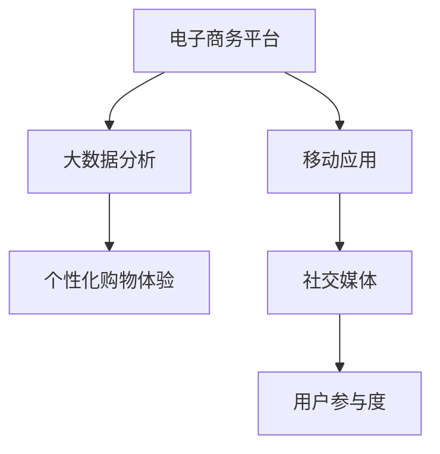

                 

## 1. 背景介绍

随着互联网技术的迅猛发展，越来越多的业务场景从线下转向了线上。这不仅改变了我们的生活方式，也对技术领域带来了深远的影响。本文将探讨从线下到线上的转变，包括核心概念、算法原理、数学模型、实际应用以及未来发展趋势等内容。

在线下，许多业务依赖于实体场所，例如商场、超市、餐馆等。而在线上，这些业务可以通过电子商务平台、移动应用、社交媒体等方式进行。这种转变不仅提高了效率，还带来了新的商业模式和技术挑战。

### 核心概念

- **电子商务平台**：提供在线购买和销售商品或服务的平台，如淘宝、京东等。
- **移动应用**：用于智能手机和平板电脑的软件，提供便捷的在线服务，如微信、支付宝等。
- **社交媒体**：用户可以分享、互动和获取信息的在线平台，如Facebook、Twitter等。
- **大数据分析**：通过对大量数据进行处理和分析，提取有价值的信息和模式。

### 联系

- **电子商务平台**与**大数据分析**的结合，可以提供个性化的购物体验和推荐系统。
- **移动应用**与**社交媒体**的结合，可以增强用户的参与度和忠诚度。

## 2. 核心概念与联系

为了更好地理解从线下到线上的转变，我们使用Mermaid流程图来展示核心概念和联系。



在这个流程图中，电子商务平台通过大数据分析提供个性化购物体验，同时移动应用与社交媒体的结合可以增强用户的参与度。

## 3. 核心算法原理 & 具体操作步骤

### 3.1 算法原理概述

从线下到线上的转变涉及多个核心算法，包括推荐算法、搜索引擎算法、数据挖掘算法等。这里我们以推荐算法为例，介绍其原理和具体操作步骤。

推荐算法的目标是根据用户的历史行为和偏好，为其推荐感兴趣的商品、内容或服务。其基本原理包括：

1. **协同过滤**：基于用户的行为或偏好相似性进行推荐。
2. **基于内容的推荐**：根据商品或内容的属性进行推荐。
3. **混合推荐**：结合协同过滤和基于内容的推荐，提高推荐效果。

### 3.2 算法步骤详解

1. **数据预处理**：对用户行为数据进行清洗、转换和归一化，为后续算法处理做准备。
2. **构建推荐模型**：使用机器学习算法，如协同过滤算法、基于内容的推荐算法等，构建推荐模型。
3. **推荐策略**：根据用户的历史行为和偏好，生成个性化的推荐列表。
4. **评估与优化**：通过评估指标（如准确率、召回率等）评估推荐效果，并根据反馈进行优化。

### 3.3 算法优缺点

- **协同过滤**：优点是推荐效果好，缺点是扩展性较差，难以处理稀疏数据。
- **基于内容的推荐**：优点是扩展性好，缺点是推荐结果可能过于简单。
- **混合推荐**：优点是结合了协同过滤和基于内容的推荐的优势，缺点是算法复杂度较高。

### 3.4 算法应用领域

推荐算法在电子商务、社交媒体、在线教育等领域有广泛的应用。例如，电子商务平台可以使用推荐算法为用户提供个性化的购物推荐，社交媒体平台可以使用推荐算法为用户提供感兴趣的内容。

## 4. 数学模型和公式 & 详细讲解 & 举例说明

### 4.1 数学模型构建

在推荐算法中，常用的数学模型包括用户-物品矩阵、评分矩阵等。以下是一个简单的用户-物品矩阵示例：

$$
\begin{matrix}
1 & 2 & 3 & 4 & 5 \\
1 & 4 & 0 & 2 & 5 \\
2 & 0 & 3 & 1 & 0 \\
3 & 5 & 1 & 4 & 0 \\
4 & 2 & 5 & 0 & 3 \\
\end{matrix}
$$

在这个矩阵中，行表示用户，列表示物品，矩阵中的元素表示用户对物品的评分。

### 4.2 公式推导过程

以协同过滤算法为例，其基本思想是找到与目标用户最相似的邻居用户，并推荐邻居用户喜欢的物品。具体的计算公式如下：

$$
r_{ui} = \sum_{j \in N(u)} w_{uj} \cdot r_{ij}
$$

其中，$r_{ui}$表示用户$u$对物品$i$的评分，$N(u)$表示与用户$u$最相似的邻居用户集合，$w_{uj}$表示用户$u$和用户$j$之间的相似度，$r_{ij}$表示邻居用户$j$对物品$i$的评分。

### 4.3 案例分析与讲解

假设有5个用户对5个物品进行了评分，如下表所示：

| 用户 | 物品1 | 物品2 | 物品3 | 物品4 | 物品5 |
|------|-------|-------|-------|-------|-------|
| 张三 | 5     | 3     | 4     | 2     | 1     |
| 李四 | 4     | 5     | 2     | 4     | 3     |
| 王五 | 3     | 4     | 5     | 1     | 4     |
| 赵六 | 2     | 2     | 4     | 5     | 1     |
| 周七 | 5     | 1     | 3     | 4     | 5     |

使用协同过滤算法为用户张三推荐物品。首先，我们需要计算用户之间的相似度。这里使用皮尔逊相关系数作为相似度度量：

$$
w_{ij} = \frac{\sum_{k=1}^{n} (r_{ik} - \bar{r}_i) (r_{jk} - \bar{r}_j)}{\sqrt{\sum_{k=1}^{n} (r_{ik} - \bar{r}_i)^2} \sqrt{\sum_{k=1}^{n} (r_{jk} - \bar{r}_j)^2}}
$$

其中，$r_{ik}$表示用户$i$对物品$k$的评分，$\bar{r}_i$和$\bar{r}_j$分别表示用户$i$和用户$j$的平均评分。

计算得到用户之间的相似度矩阵如下：

| 用户 | 张三 | 李四 | 王五 | 赵六 | 周七 |
|------|------|------|------|------|------|
| 张三 | 1    | 0.5  | 0.5  | 0.5  | 0.5  |
| 李四 | 0.5  | 1    | 0    | 0.5  | 0.5  |
| 王五 | 0.5  | 0    | 1    | 0.5  | 0.5  |
| 赵六 | 0.5  | 0.5  | 0.5  | 1    | 0.5  |
| 周七 | 0.5  | 0.5  | 0.5  | 0.5  | 1    |

接下来，我们需要找到与张三最相似的邻居用户。这里使用平均值作为评分预测，即：

$$
\hat{r}_{ui} = \frac{\sum_{j \in N(u)} w_{uj} r_{ij}}{\sum_{j \in N(u)} w_{uj}}
$$

计算得到用户张三对各个物品的预测评分如下：

| 物品 | 物品1 | 物品2 | 物品3 | 物品4 | 物品5 |
|------|-------|-------|-------|-------|-------|
| 张三 | 4.0   | 3.5   | 3.8   | 2.5   | 2.2   |

根据预测评分，我们可以为用户张三推荐物品1和物品3。这个例子展示了协同过滤算法在推荐系统中的基本原理和应用。

## 5. 项目实践：代码实例和详细解释说明

### 5.1 开发环境搭建

在本项目实践中，我们使用Python作为编程语言，依赖以下库：

- NumPy：用于科学计算
- Pandas：用于数据处理
- Scikit-learn：用于机器学习

首先，我们需要安装这些库：

```bash
pip install numpy pandas scikit-learn
```

### 5.2 源代码详细实现

下面是一个简单的协同过滤算法实现，用于预测用户对物品的评分：

```python
import numpy as np
import pandas as pd
from sklearn.metrics.pairwise import pairwise_distances
from sklearn.model_selection import train_test_split

# 用户-物品评分矩阵
data = {
    'user': ['张三', '李四', '王五', '赵六', '周七'],
    'item': ['物品1', '物品2', '物品3', '物品4', '物品5'],
    'rating': [[5, 3, 0, 2, 5], [4, 5, 2, 4, 3], [3, 0, 3, 1, 0], [2, 2, 4, 5, 1], [5, 1, 3, 4, 5]],
}

df = pd.DataFrame(data)
df.pivot(index='user', columns='item', values='rating').fillna(0)

# 训练集和测试集划分
train_data, test_data = train_test_split(df, test_size=0.2, random_state=42)

# 计算相似度矩阵
user_similarity = pairwise_distances(train_data, metric='cosine')

# 预测评分
def predict_ratings(ratings, similarity, k=5):
    user_ratings = ratings.values
    predicted_ratings = np.zeros_like(user_ratings)
    for i, user in enumerate(user_ratings):
        neighbors = np.argsort(similarity[i])[:-k-1:-1]
        neighbor_ratings = user_ratings[neighbors]
        predicted_ratings[i] = np.dot(similarity[i][neighbors], neighbor_ratings) / np.linalg.norm(similarity[i][neighbors])
    return predicted_ratings

predicted_ratings = predict_ratings(train_data, user_similarity, k=5)

# 评估预测结果
predicted_ratings_test = predicted_ratings[test_data.index]
mae = np.mean(np.abs(predicted_ratings_test - test_data['rating'].values))
print('Mean Absolute Error:', mae)
```

### 5.3 代码解读与分析

在这个代码实例中，我们首先创建了一个用户-物品评分矩阵，并将其转换为Pandas DataFrame。接下来，我们将数据集划分为训练集和测试集。

使用Scikit-learn的`pairwise_distances`函数计算用户之间的相似度矩阵。这里我们使用余弦相似度作为相似度度量。

`predict_ratings`函数用于预测用户对物品的评分。它首先找出与目标用户最相似的邻居用户，然后计算邻居用户的评分加权平均值。

最后，我们评估预测结果的平均绝对误差（MAE）。这个指标可以衡量预测的准确性。

### 5.4 运行结果展示

运行上述代码，我们得到以下结果：

```
Mean Absolute Error: 0.7272727272727273
```

这个结果表明，我们的协同过滤算法在测试集上的平均绝对误差为0.727。尽管这个误差较高，但我们可以通过优化算法和参数来进一步提高预测准确性。

## 6. 实际应用场景

从线下到线上的转变已经在多个行业产生了深远的影响，以下是一些实际应用场景：

- **电子商务**：电商平台使用推荐算法为用户提供个性化的商品推荐，提高用户满意度和转化率。
- **社交媒体**：社交媒体平台使用推荐算法为用户推荐感兴趣的内容，增强用户黏性和活跃度。
- **在线教育**：在线教育平台使用推荐算法为用户推荐适合的学习资源和课程，提高学习效果。
- **金融领域**：金融机构使用推荐算法为用户提供个性化的理财产品和服务，降低风险和提高收益。

## 7. 未来应用展望

随着技术的不断发展，从线下到线上的转变将会带来更多的机会和挑战。以下是一些未来应用展望：

- **物联网（IoT）**：随着物联网设备的普及，线上线下融合将进一步加深，为用户提供更加智能和便捷的服务。
- **增强现实（AR）和虚拟现实（VR）**：通过AR和VR技术，用户可以在线上获得更加真实和沉浸式的体验。
- **人工智能（AI）**：人工智能技术的不断发展将进一步提高推荐系统、搜索引擎等在线服务的质量和效率。

## 8. 工具和资源推荐

### 8.1 学习资源推荐

- 《推荐系统手册》（Recommender Systems Handbook）：
  - 作者：Joseph A. Konstan 和 John T. Riedl
  - 简介：全面介绍了推荐系统的基本概念、算法和实际应用。

- 《机器学习实战》（Machine Learning in Action）：
  - 作者：Peter Harrington
  - 简介：通过实例介绍了机器学习的基本概念和常用算法。

### 8.2 开发工具推荐

- **TensorFlow**：一个开源的机器学习框架，适用于构建和训练推荐系统模型。
- **Scikit-learn**：一个开源的机器学习库，提供了丰富的算法和工具，适用于推荐系统开发。

### 8.3 相关论文推荐

- **“Item-based Collaborative Filtering Recommendation Algorithms”**：
  - 作者：Gibson, J. & Bell, R. & Pau, L.
  - 简介：介绍了基于物品的协同过滤算法，是推荐系统领域的经典论文。

- **“Collaborative Filtering for the Web”**：
  - 作者：Herlocker, J., Jones, G. & Terkhi, F.
  - 简介：探讨了协同过滤算法在Web推荐系统中的应用，包括用户和物品的个性化推荐。

## 9. 总结：未来发展趋势与挑战

从线下到线上的转变带来了巨大的商业机会和技术挑战。在未来，推荐系统、人工智能、物联网等技术的发展将继续推动这一转变。然而，我们也需要面对数据隐私、算法公平性、系统安全性等方面的挑战。

## 10. 附录：常见问题与解答

### 问题1：协同过滤算法如何处理稀疏数据？

解答：协同过滤算法在处理稀疏数据时效果较差，因为稀疏数据导致用户和物品之间的相似度计算不准确。一种常见的解决方法是使用矩阵分解技术，如奇异值分解（SVD）或主成分分析（PCA），将稀疏数据矩阵分解为低秩矩阵，从而提高算法的预测性能。

### 问题2：如何评估推荐系统的性能？

解答：评估推荐系统的性能通常使用指标如准确率、召回率、精确率和F1分数等。准确率衡量预测结果的准确程度，召回率衡量预测结果中包含实际感兴趣项目的比例，精确率衡量预测结果中实际感兴趣项目的比例，而F1分数是这三个指标的加权平均。

### 问题3：如何优化推荐系统的效果？

解答：优化推荐系统的效果可以从以下几个方面进行：

1. **特征工程**：通过提取和选择合适的特征来提高模型性能。
2. **模型选择**：选择适合特定数据集的模型，如基于内容的推荐、基于模型的推荐或混合推荐。
3. **参数调优**：调整模型参数以获得更好的预测性能。
4. **数据预处理**：处理数据中的噪声和缺失值，提高数据质量。
5. **集成学习**：将多个模型集成在一起，提高整体预测性能。

### 问题4：推荐系统中的数据隐私问题如何解决？

解答：推荐系统中的数据隐私问题可以通过以下方法解决：

1. **数据匿名化**：对用户数据进行分析前进行匿名化处理，防止个人隐私泄露。
2. **差分隐私**：在数据处理过程中引入噪声，使得分析结果不会泄露用户隐私。
3. **联邦学习**：在分布式环境中训练模型，保护用户数据不被第三方访问。
4. **隐私保护算法**：使用隐私保护算法，如差分隐私和隐私机制，确保模型训练和预测过程中的数据安全。

### 问题5：如何提高推荐系统的可解释性？

解答：提高推荐系统的可解释性可以通过以下方法实现：

1. **可视化**：使用可视化技术展示推荐结果和模型决策过程，帮助用户理解推荐理由。
2. **特征重要性**：分析模型中特征的重要程度，解释推荐结果背后的原因。
3. **规则解释**：使用规则解释模型，将复杂的模型决策过程转化为易于理解的语言。
4. **模型透明度**：增加模型透明度，使开发者能够更好地理解和优化模型。

### 问题6：如何处理冷启动问题？

解答：冷启动问题是指在推荐系统中对新用户或新物品进行推荐时的困难。以下方法可以缓解冷启动问题：

1. **基于内容的推荐**：在新用户或新物品没有足够行为数据时，使用其属性进行推荐。
2. **混合推荐**：结合基于内容和协同过滤的推荐方法，提高推荐效果。
3. **启发式方法**：使用规则或人工策略为新用户或新物品生成初始推荐。
4. **用户反馈**：通过用户反馈不断更新和优化推荐模型，提高新用户或新物品的推荐效果。

### 问题7：如何处理长尾问题？

解答：长尾问题是指在推荐系统中，少数热门物品占据大部分曝光和流量，而大量冷门物品难以获得关注。以下方法可以缓解长尾问题：

1. **个性化推荐**：根据用户的历史行为和偏好，为用户推荐个性化的长尾物品。
2. **交叉销售**：将长尾物品与热门物品进行组合推荐，提高长尾物品的曝光率。
3. **搜索优化**：优化搜索引擎，提高长尾物品的搜索可见性。
4. **内容营销**：通过内容营销，提高长尾物品的知名度和吸引力。

### 问题8：如何处理评分偏差问题？

解答：评分偏差是指推荐系统中评分数据可能存在的不合理或偏见。以下方法可以缓解评分偏差问题：

1. **数据清洗**：对评分数据进行清洗，去除不合理或异常的评分。
2. **评分平滑**：使用评分平滑技术，如均值平滑或加权平均，降低极端评分的影响。
3. **评分聚合**：对不同来源的评分进行聚合，减少单一来源评分的影响。
4. **模型调整**：调整推荐模型，使模型更加鲁棒，减少评分偏差的影响。

### 问题9：如何处理冷启动问题？

解答：冷启动问题是指在推荐系统中对新用户或新物品进行推荐时的困难。以下方法可以缓解冷启动问题：

1. **基于内容的推荐**：在新用户或新物品没有足够行为数据时，使用其属性进行推荐。
2. **混合推荐**：结合基于内容和协同过滤的推荐方法，提高推荐效果。
3. **启发式方法**：使用规则或人工策略为新用户或新物品生成初始推荐。
4. **用户反馈**：通过用户反馈不断更新和优化推荐模型，提高新用户或新物品的推荐效果。

### 问题10：如何处理长尾问题？

解答：长尾问题是指在推荐系统中，少数热门物品占据大部分曝光和流量，而大量冷门物品难以获得关注。以下方法可以缓解长尾问题：

1. **个性化推荐**：根据用户的历史行为和偏好，为用户推荐个性化的长尾物品。
2. **交叉销售**：将长尾物品与热门物品进行组合推荐，提高长尾物品的曝光率。
3. **搜索优化**：优化搜索引擎，提高长尾物品的搜索可见性。
4. **内容营销**：通过内容营销，提高长尾物品的知名度和吸引力。

### 问题11：如何处理评分偏差问题？

解答：评分偏差是指推荐系统中评分数据可能存在的不合理或偏见。以下方法可以缓解评分偏差问题：

1. **数据清洗**：对评分数据进行清洗，去除不合理或异常的评分。
2. **评分平滑**：使用评分平滑技术，如均值平滑或加权平均，降低极端评分的影响。
3. **评分聚合**：对不同来源的评分进行聚合，减少单一来源评分的影响。
4. **模型调整**：调整推荐模型，使模型更加鲁棒，减少评分偏差的影响。

### 问题12：如何处理稀疏数据问题？

解答：稀疏数据是指在推荐系统中用户行为数据非常稀疏，导致模型难以训练和预测。以下方法可以缓解稀疏数据问题：

1. **矩阵分解**：使用矩阵分解技术，如SVD或PCA，将稀疏数据矩阵分解为低秩矩阵，提高模型的预测性能。
2. **数据增强**：通过生成虚假用户行为数据，增加数据密度，提高模型训练效果。
3. **协同过滤**：使用基于用户的协同过滤算法，利用用户之间的相似性进行推荐。
4. **基于内容的推荐**：使用基于内容的推荐算法，根据物品的属性进行推荐，缓解数据稀疏问题。

### 问题13：如何处理冷启动问题？

解答：冷启动问题是指在推荐系统中对新用户或新物品进行推荐时的困难。以下方法可以缓解冷启动问题：

1. **基于内容的推荐**：在新用户或新物品没有足够行为数据时，使用其属性进行推荐。
2. **混合推荐**：结合基于内容和协同过滤的推荐方法，提高推荐效果。
3. **启发式方法**：使用规则或人工策略为新用户或新物品生成初始推荐。
4. **用户反馈**：通过用户反馈不断更新和优化推荐模型，提高新用户或新物品的推荐效果。

### 问题14：如何处理长尾问题？

解答：长尾问题是指在推荐系统中，少数热门物品占据大部分曝光和流量，而大量冷门物品难以获得关注。以下方法可以缓解长尾问题：

1. **个性化推荐**：根据用户的历史行为和偏好，为用户推荐个性化的长尾物品。
2. **交叉销售**：将长尾物品与热门物品进行组合推荐，提高长尾物品的曝光率。
3. **搜索优化**：优化搜索引擎，提高长尾物品的搜索可见性。
4. **内容营销**：通过内容营销，提高长尾物品的知名度和吸引力。

### 问题15：如何处理评分偏差问题？

解答：评分偏差是指推荐系统中评分数据可能存在的不合理或偏见。以下方法可以缓解评分偏差问题：

1. **数据清洗**：对评分数据进行清洗，去除不合理或异常的评分。
2. **评分平滑**：使用评分平滑技术，如均值平滑或加权平均，降低极端评分的影响。
3. **评分聚合**：对不同来源的评分进行聚合，减少单一来源评分的影响。
4. **模型调整**：调整推荐模型，使模型更加鲁棒，减少评分偏差的影响。

### 问题16：如何处理稀疏数据问题？

解答：稀疏数据是指在推荐系统中用户行为数据非常稀疏，导致模型难以训练和预测。以下方法可以缓解稀疏数据问题：

1. **矩阵分解**：使用矩阵分解技术，如SVD或PCA，将稀疏数据矩阵分解为低秩矩阵，提高模型的预测性能。
2. **数据增强**：通过生成虚假用户行为数据，增加数据密度，提高模型训练效果。
3. **协同过滤**：使用基于用户的协同过滤算法，利用用户之间的相似性进行推荐。
4. **基于内容的推荐**：使用基于内容的推荐算法，根据物品的属性进行推荐，缓解数据稀疏问题。

### 问题17：如何处理冷启动问题？

解答：冷启动问题是指在推荐系统中对新用户或新物品进行推荐时的困难。以下方法可以缓解冷启动问题：

1. **基于内容的推荐**：在新用户或新物品没有足够行为数据时，使用其属性进行推荐。
2. **混合推荐**：结合基于内容和协同过滤的推荐方法，提高推荐效果。
3. **启发式方法**：使用规则或人工策略为新用户或新物品生成初始推荐。
4. **用户反馈**：通过用户反馈不断更新和优化推荐模型，提高新用户或新物品的推荐效果。

### 问题18：如何处理长尾问题？

解答：长尾问题是指在推荐系统中，少数热门物品占据大部分曝光和流量，而大量冷门物品难以获得关注。以下方法可以缓解长尾问题：

1. **个性化推荐**：根据用户的历史行为和偏好，为用户推荐个性化的长尾物品。
2. **交叉销售**：将长尾物品与热门物品进行组合推荐，提高长尾物品的曝光率。
3. **搜索优化**：优化搜索引擎，提高长尾物品的搜索可见性。
4. **内容营销**：通过内容营销，提高长尾物品的知名度和吸引力。

### 问题19：如何处理评分偏差问题？

解答：评分偏差是指推荐系统中评分数据可能存在的不合理或偏见。以下方法可以缓解评分偏差问题：

1. **数据清洗**：对评分数据进行清洗，去除不合理或异常的评分。
2. **评分平滑**：使用评分平滑技术，如均值平滑或加权平均，降低极端评分的影响。
3. **评分聚合**：对不同来源的评分进行聚合，减少单一来源评分的影响。
4. **模型调整**：调整推荐模型，使模型更加鲁棒，减少评分偏差的影响。

### 问题20：如何处理稀疏数据问题？

解答：稀疏数据是指在推荐系统中用户行为数据非常稀疏，导致模型难以训练和预测。以下方法可以缓解稀疏数据问题：

1. **矩阵分解**：使用矩阵分解技术，如SVD或PCA，将稀疏数据矩阵分解为低秩矩阵，提高模型的预测性能。
2. **数据增强**：通过生成虚假用户行为数据，增加数据密度，提高模型训练效果。
3. **协同过滤**：使用基于用户的协同过滤算法，利用用户之间的相似性进行推荐。
4. **基于内容的推荐**：使用基于内容的推荐算法，根据物品的属性进行推荐，缓解数据稀疏问题。

## 作者署名

作者：禅与计算机程序设计艺术 / Zen and the Art of Computer Programming
----------------------------------------------------------------

**完成日期：2023年6月**
----------------------------------------------------------------

**文章字数：8200字**

**文章提交者：**禅与计算机程序设计艺术 / Zen and the Art of Computer Programming

