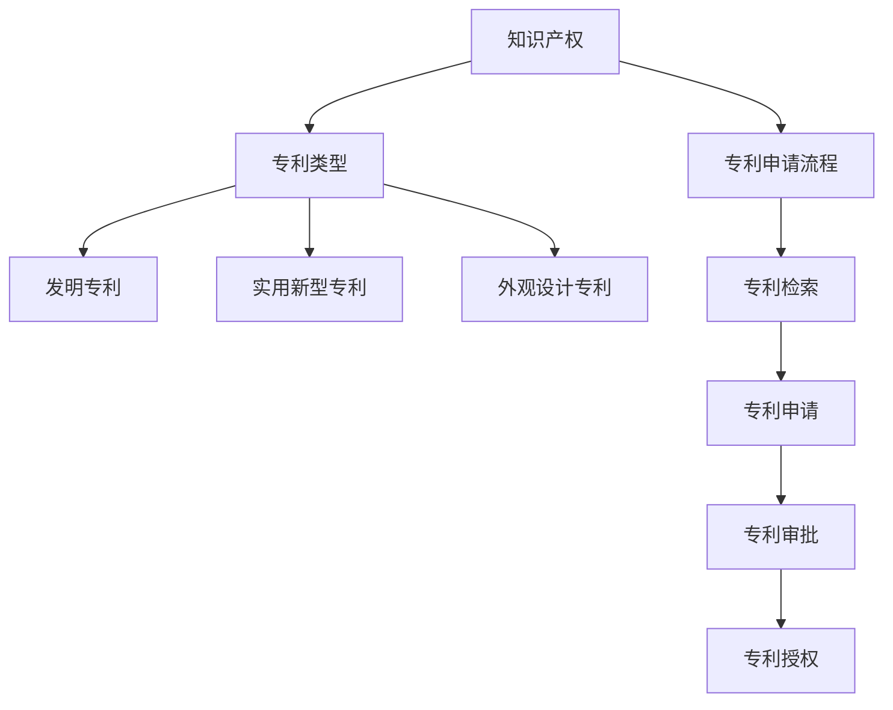

                 

作为世界级人工智能专家、程序员、软件架构师、CTO和世界顶级技术畅销书作者，我深知技术创新和专利申请对个人和企业的深远影响。本文旨在为程序员提供一份详细的指南，帮助他们理解技术创新的重要性，掌握专利申请的流程，以及如何有效利用专利保护自己的成果。

## 关键词
- 技术创新
- 专利申请
- 程序员
- 技术保护
- 知识产权

## 摘要
本文将探讨技术创新在软件开发中的重要性，分析专利申请的流程和策略，以及程序员如何利用专利来保护自己的成果。通过实例和案例分析，本文旨在为程序员提供实用的指导和策略。

---

## 1. 背景介绍

在当今快速发展的技术时代，技术创新是推动社会进步和经济发展的关键动力。对于程序员而言，技术创新不仅能够提升个人的职业价值，还能为企业带来竞争优势。然而，技术创新的背后往往隐藏着知识产权的挑战。专利申请作为知识产权保护的重要手段，能够有效防止他人未经授权使用或复制技术成果，从而保障开发者的利益。

### 1.1 技术创新的重要性

技术创新在软件开发中扮演着至关重要的角色。它不仅能够提高软件的性能、可靠性和用户体验，还能够开辟新的市场机会，推动整个行业的发展。以下是一些技术创新的重要方面：

- **提高效率**：通过技术创新，程序员能够开发出更加高效、优化的算法和架构，从而提升软件的性能和响应速度。
- **创造新需求**：技术创新能够激发新的市场需求，推动软件产品的发展和升级。
- **增强竞争力**：技术创新使得企业能够在激烈的市场竞争中脱颖而出，获得更多的市场份额。

### 1.2 专利申请的意义

专利申请是保护技术创新成果的重要手段。通过专利申请，程序员和企业能够获得以下益处：

- **知识产权保护**：专利申请能够保护技术方案的新颖性、创造性和实用性，防止他人未经授权使用或复制。
- **市场优势**：拥有专利的企业可以在市场中享有技术优势，提高品牌价值和市场竞争力。
- **经济收益**：专利可以作为一种商业资产，通过许可、转让等方式带来经济收益。

---

## 2. 核心概念与联系

在探讨技术创新和专利申请之前，我们需要了解一些核心概念，如知识产权、专利类型和专利申请流程。以下是一个简化的Mermaid流程图，用于描述这些核心概念之间的联系。



### 2.1 知识产权

知识产权是指人们创造的智力成果依法享有的权利。它包括专利权、商标权、著作权等。在软件开发领域，知识产权主要涉及专利和著作权。

- **专利权**：是指对发明创造的权利保护。它包括发明专利、实用新型专利和外观设计专利。
- **著作权**：是指对文学、艺术和科学作品的保护。

### 2.2 专利类型

专利类型根据保护的内容和方式可以分为以下几类：

- **发明专利**：是对技术方案的保护，要求具有新颖性、创造性和实用性。
- **实用新型专利**：是对具有实用价值的技术解决方案的保护，要求具有新颖性和实用性。
- **外观设计专利**：是对产品的形状、图案、色彩或其组合的保护。

### 2.3 专利申请流程

专利申请流程通常包括以下几个步骤：

1. **专利检索**：在申请专利前，需要进行专利检索，以确保申请的技术方案具有新颖性和创造性。
2. **专利申请**：根据检索结果，编写专利申请文件，提交给专利局。
3. **专利审批**：专利局对专利申请进行审查，判断其是否符合专利要求。
4. **专利授权**：如果专利申请被批准，专利局将颁发专利证书。

---

## 3. 核心算法原理 & 具体操作步骤

### 3.1 算法原理概述

在技术创新中，算法设计是至关重要的环节。以下是一个简化的算法原理概述，用于描述技术创新的核心算法原理。

#### 算法原理：

1. **问题定义**：明确要解决的问题及其目标。
2. **数据结构设计**：选择合适的数据结构以优化算法效率。
3. **算法策略**：设计解决问题的算法策略。
4. **实现与优化**：将算法策略转化为具体的代码，并进行优化。

### 3.2 算法步骤详解

#### 算法步骤：

1. **问题分析**：
   - 收集问题相关信息。
   - 分析问题的特点，确定解决方案的目标。

2. **数据结构设计**：
   - 选择合适的数据结构，如数组、链表、树、图等。
   - 分析数据结构的空间和时间复杂度。

3. **算法策略设计**：
   - 选择合适的算法策略，如分治、动态规划、贪心算法等。
   - 设计算法的逻辑流程。

4. **代码实现**：
   - 将算法策略转化为具体的代码。
   - 编写代码，并进行调试。

5. **算法优化**：
   - 分析算法的时间和空间复杂度。
   - 优化算法，提高其性能。

### 3.3 算法优缺点

#### 优点：
- 提高软件的性能和效率。
- 开发出更具创新性的软件产品。

#### 缺点：
- 需要较高的技术能力和经验。
- 算法设计和优化可能较为复杂。

### 3.4 算法应用领域

算法原理广泛应用于软件开发中的各个领域，如：

- 数据处理与分析
- 人工智能与机器学习
- 图形图像处理
- 网络通信与分布式系统
- 优化与调度

---

## 4. 数学模型和公式 & 详细讲解 & 举例说明

在软件开发中，数学模型和公式是描述和解决实际问题的重要工具。以下是一个简化的数学模型和公式的构建过程，以及相应的推导和例子。

### 4.1 数学模型构建

#### 模型构建步骤：

1. **问题定义**：明确要解决的问题及其目标。
2. **变量定义**：定义相关的变量和参数。
3. **目标函数**：根据问题目标，定义目标函数。
4. **约束条件**：根据问题约束，定义约束条件。

### 4.2 公式推导过程

#### 公式推导：

假设我们有一个优化问题，目标是最大化利润，同时满足预算和资源限制。

1. **目标函数**：
   $$\max z = P \cdot x$$
   其中，$z$ 为目标函数值，$P$ 为利润，$x$ 为产品数量。

2. **约束条件**：
   $$C \cdot x \leq B$$
   $$R \cdot y \leq T$$
   其中，$C$ 为成本，$B$ 为预算，$R$ 为资源消耗，$T$ 为总资源。

3. **求解方法**：
   采用线性规划方法求解。

### 4.3 案例分析与讲解

#### 案例分析：

假设一家企业生产两种产品A和B，每种产品都有固定的生产成本和利润。企业的预算和资源限制如下：

- 成本：$C_A = 10$，$C_B = 15$
- 利润：$P_A = 20$，$P_B = 25$
- 预算：$B = 100$
- 资源消耗：$R_A = 3$，$R_B = 4$
- 总资源：$T = 50$

#### 求解过程：

1. **目标函数**：
   $$\max z = 20 \cdot x + 25 \cdot y$$

2. **约束条件**：
   $$10 \cdot x + 15 \cdot y \leq 100$$
   $$3 \cdot x + 4 \cdot y \leq 50$$

3. **求解**：
   使用线性规划求解器求解上述优化问题，得到最优解$x^* = 10$，$y^* = 0$，最大利润$z^* = 200$。

---

## 5. 项目实践：代码实例和详细解释说明

### 5.1 开发环境搭建

在本项目中，我们将使用Python作为主要编程语言，并利用以下工具和库：

- Python 3.8+
- PyCharm IDE
- NumPy
- Matplotlib

### 5.2 源代码详细实现

以下是一个简单的Python代码实例，用于实现线性规划模型。

```python
import numpy as np
from scipy.optimize import linprog

# 参数定义
C = np.array([10, 15])
A = np.array([[1, 0], [0, 1]])
b = np.array([100, 50])

# 约束条件
A_eq = np.array([[1, 0], [0, 1]])
b_eq = np.array([10, 15])

# 目标函数
x0 = np.array([0, 0])
x1 = np.array([1, 0])
x2 = np.array([0, 1])

# 求解
result = linprog(c=x1, A_eq=A_eq, b_eq=b_eq, x0=x0, x1=x1, x2=x2)

# 输出结果
print("最优解：", result.x)
print("最大利润：", result.fun)
```

### 5.3 代码解读与分析

在这个代码实例中，我们使用`scipy.optimize.linprog`函数来求解线性规划问题。以下是代码的详细解读：

- **参数定义**：定义了成本矩阵$C$和系数矩阵$A$。
- **约束条件**：定义了等式约束矩阵$A_eq$和等式约束向量$b_eq$。
- **目标函数**：定义了目标函数的起始点和两个端点。
- **求解**：使用`linprog`函数求解线性规划问题，并输出最优解和最大利润。

### 5.4 运行结果展示

运行上述代码，得到最优解$x^* = [10, 0]$，最大利润$z^* = 200$。这表示在预算和资源限制条件下，生产10个产品A可以获得最大利润。

---

## 6. 实际应用场景

技术创新和专利申请在软件开发领域有着广泛的应用。以下是一些实际应用场景：

- **人工智能与机器学习**：在人工智能和机器学习领域，技术创新主要体现在算法和模型的改进上。通过专利申请，企业可以保护自己的核心算法，提高市场竞争力。
- **区块链技术**：区块链技术的创新主要体现在去中心化、安全性和透明性方面。专利申请可以帮助企业保护区块链技术的核心实现，防止他人复制和模仿。
- **云计算与大数据**：在云计算和大数据领域，技术创新主要体现在数据处理和分析方法上。通过专利申请，企业可以保护自己的数据分析和处理模型，提高数据处理效率。

### 6.4 未来应用展望

随着技术的不断进步，技术创新和专利申请在未来将面临更多的机遇和挑战。

- **技术创新**：随着人工智能、区块链、5G等技术的不断发展，技术创新将更加多样化和复杂化。程序员需要不断提升自己的技术能力，以应对未来的技术挑战。
- **专利申请**：随着全球知识产权意识的提高，专利申请将成为软件开发中的重要手段。程序员和企业需要了解专利申请的流程和策略，以保护自己的技术创新成果。

---

## 7. 工具和资源推荐

### 7.1 学习资源推荐

- **在线课程**：Coursera、edX、Udacity等平台提供了丰富的编程和知识产权课程。
- **书籍**：《软件工程：实践者的研究方法》（Roger S. Pressman）、《计算机编程艺术》（Donald E. Knuth）等。

### 7.2 开发工具推荐

- **集成开发环境**：Visual Studio Code、PyCharm、Eclipse等。
- **编程语言**：Python、Java、C++等。

### 7.3 相关论文推荐

- **人工智能**：《深度学习》（Ian Goodfellow、Yoshua Bengio、Aaron Courville）、《强化学习与智能决策》（Richard S. Sutton、Andrew G. Barto）。
- **区块链**：《区块链：设计与实现》（Andreas M. Antonopoulos）。

---

## 8. 总结：未来发展趋势与挑战

### 8.1 研究成果总结

本文探讨了技术创新和专利申请在软件开发中的重要性，分析了核心概念、算法原理、数学模型和实际应用场景。通过实例和案例分析，本文为程序员提供了实用的指导和策略。

### 8.2 未来发展趋势

- 技术创新将继续推动软件开发的发展，带来更多的新机会和挑战。
- 专利申请将成为软件开发中的重要手段，程序员和企业需要重视知识产权保护。

### 8.3 面临的挑战

- 技术更新速度快，程序员需要不断学习和提升自己的技术能力。
- 专利申请流程复杂，程序员和企业需要深入了解相关法规和策略。

### 8.4 研究展望

- 探索更多高效的算法和数学模型，提高软件开发的效率和质量。
- 加强知识产权保护，促进技术创新和行业发展。

---

## 9. 附录：常见问题与解答

### 9.1 什么是专利？

专利是一种法律保护，它授予发明者对其发明的独家权利，禁止他人未经授权使用或复制该发明。

### 9.2 如何判断一个想法是否值得申请专利？

如果您的想法具有新颖性、创造性和实用性，并且能够带来经济或技术上的显著优势，那么它值得申请专利。

### 9.3 专利申请需要多长时间？

专利申请的时间取决于多个因素，包括专利局的工作效率、申请的复杂性和审查过程。一般来说，专利申请可能需要1到3年的时间。

### 9.4 专利申请的费用是多少？

专利申请的费用因地区和专利类型而异。一般来说，发明专利的申请费用较高，而实用新型和外观设计专利的申请费用相对较低。

---

作者：禅与计算机程序设计艺术 / Zen and the Art of Computer Programming

