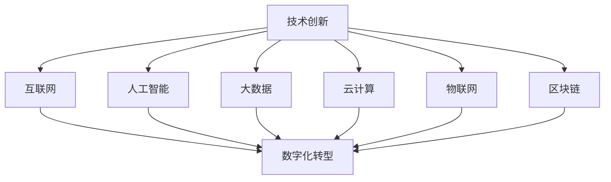

                 

 > **关键词**: 技术创新、数字化转型、人工智能、大数据、云计算、物联网、区块链。

> **摘要**: 本文探讨了技术创新与数字化转型的紧密联系，分析了当前热门技术如何推动企业实现数字化转型，并展望了未来发展趋势及面临的挑战。

## 1. 背景介绍

### 1.1 技术创新的定义与重要性

技术创新是指通过引入新的技术、产品、服务或流程来提高效率、创造价值的过程。在当今快速变化的世界，技术创新已成为推动社会进步和经济发展的关键动力。随着互联网、人工智能、大数据、云计算等技术的迅猛发展，技术创新的影响范围日益扩大，涵盖了各行各业。

### 1.2 数字化转型的定义与内涵

数字化转型是指将传统业务流程、管理模式和组织结构等与数字技术相结合，实现业务模式、运营模式和组织模式的创新和升级。数字化转型的核心目标是提高企业运营效率、降低成本、增强客户体验和竞争力。

### 1.3 技术创新与数字化转型的关系

技术创新与数字化转型密切相关。技术创新为数字化转型提供了技术支撑，而数字化转型则为技术创新提供了广阔的应用场景。通过将技术创新与数字化转型相结合，企业可以更好地应对市场变化，实现持续增长。

## 2. 核心概念与联系

下面将介绍本文涉及的核心概念，并使用Mermaid流程图展示各概念之间的联系。



### 2.1 互联网

互联网是连接全球的计算机网络，为人们提供了丰富的信息资源和便捷的通信方式。互联网的普及为数字化转型提供了基础设施。

### 2.2 人工智能

人工智能是指模拟、延伸和扩展人类智能的技术。人工智能技术在数字化转型中发挥了重要作用，如智能推荐、智能客服、智能决策等。

### 2.3 大数据

大数据是指数据量巨大、类型繁多的数据集合。大数据技术可以帮助企业挖掘数据价值，提升业务决策能力。

### 2.4 云计算

云计算是一种基于互联网的计算模式，通过虚拟化技术实现资源的动态分配和按需服务。云计算为数字化转型提供了强大的计算能力和数据存储能力。

### 2.5 物联网

物联网是指将各种物理设备通过网络连接起来，实现智能感知、识别和管理。物联网技术为数字化转型带来了新的业务模式和服务形式。

### 2.6 区块链

区块链是一种分布式账本技术，具有去中心化、不可篡改、透明等特点。区块链技术在数字化转型中可以应用于供应链管理、金融交易等领域。

## 3. 核心算法原理 & 具体操作步骤

### 3.1 算法原理概述

在本节中，我们将介绍几种在数字化转型中常用的核心算法，包括机器学习算法、深度学习算法、自然语言处理算法等。这些算法在数据挖掘、预测分析、智能决策等方面发挥着重要作用。

### 3.2 算法步骤详解

#### 3.2.1 机器学习算法

1. 数据收集与预处理：收集相关数据，并进行数据清洗、归一化等预处理操作。
2. 特征提取：从数据中提取有用的特征。
3. 模型选择与训练：选择合适的机器学习模型，并使用训练数据进行模型训练。
4. 模型评估与优化：使用测试数据评估模型性能，并进行优化。

#### 3.2.2 深度学习算法

1. 数据收集与预处理：与机器学习算法类似，对数据进行预处理。
2. 网络架构设计：设计深度学习网络结构。
3. 权值初始化：对网络权值进行初始化。
4. 模型训练与优化：使用训练数据进行模型训练，并优化网络参数。
5. 模型评估与部署：使用测试数据评估模型性能，并将模型部署到实际应用场景。

#### 3.2.3 自然语言处理算法

1. 数据预处理：对文本数据进行分词、去停用词等预处理。
2. 词向量表示：将文本数据转换为词向量表示。
3. 模型构建：设计自然语言处理模型，如循环神经网络（RNN）、卷积神经网络（CNN）等。
4. 模型训练与优化：使用训练数据进行模型训练，并优化模型参数。
5. 模型评估与部署：使用测试数据评估模型性能，并将模型部署到实际应用场景。

### 3.3 算法优缺点

每种算法都有其优缺点，适用于不同的应用场景。例如，机器学习算法在处理大规模数据时表现优秀，但需要大量训练数据；深度学习算法在处理复杂数据时具有优势，但计算资源需求较高；自然语言处理算法在处理文本数据时具有较好的效果，但需要较长时间的训练。

### 3.4 算法应用领域

核心算法在数字化转型中的应用领域广泛，如金融、医疗、电商、物流等。以下列举几个典型应用案例：

1. 金融：利用机器学习算法进行信用评分、欺诈检测等。
2. 医疗：利用深度学习算法进行医学图像分析、疾病预测等。
3. 电商：利用自然语言处理算法进行智能客服、个性化推荐等。
4. 物流：利用物联网技术实现物流信息的实时追踪与监控。

## 4. 数学模型和公式 & 详细讲解 & 举例说明

### 4.1 数学模型构建

在数字化转型中，数学模型广泛应用于数据挖掘、预测分析等领域。以下介绍几个常用的数学模型及其构建方法。

#### 4.1.1 线性回归模型

线性回归模型是一种用于分析两个变量之间线性关系的数学模型。其公式如下：

$$y = \beta_0 + \beta_1 \cdot x + \epsilon$$

其中，$y$ 是因变量，$x$ 是自变量，$\beta_0$ 和 $\beta_1$ 分别是模型的参数，$\epsilon$ 是误差项。

#### 4.1.2 决策树模型

决策树模型是一种基于特征划分数据的分类模型。其公式如下：

$$y = f(x) = \prod_{i=1}^{n} g(x_i)$$

其中，$y$ 是标签，$x$ 是特征，$g(x_i)$ 是第 $i$ 个特征的条件概率。

#### 4.1.3 贝叶斯网络模型

贝叶斯网络模型是一种基于概率论的图模型。其公式如下：

$$P(y|x) = \prod_{i=1}^{n} P(x_i|y) \cdot P(y)$$

其中，$y$ 是标签，$x$ 是特征，$P(x_i|y)$ 是第 $i$ 个特征在给定标签条件下的概率，$P(y)$ 是标签的概率。

### 4.2 公式推导过程

在本节中，我们将对上述数学模型的推导过程进行详细讲解。

#### 4.2.1 线性回归模型的推导

线性回归模型的推导基于最小二乘法。设数据集为 $\{(x_1, y_1), (x_2, y_2), \ldots, (x_n, y_n)\}$，线性回归模型的目标是找到最佳拟合直线 $y = \beta_0 + \beta_1 \cdot x$，使得残差平方和最小。

设残差平方和为 $S$，即：

$$S = \sum_{i=1}^{n} (y_i - \beta_0 - \beta_1 \cdot x_i)^2$$

对 $S$ 求导，并令导数为零，得到：

$$\frac{\partial S}{\partial \beta_0} = -2 \sum_{i=1}^{n} (y_i - \beta_0 - \beta_1 \cdot x_i) = 0$$

$$\frac{\partial S}{\partial \beta_1} = -2 \sum_{i=1}^{n} (y_i - \beta_0 - \beta_1 \cdot x_i) \cdot x_i = 0$$

解上述方程组，得到最佳拟合直线的参数 $\beta_0$ 和 $\beta_1$。

#### 4.2.2 决策树模型的推导

决策树模型是基于信息熵和信息增益的划分方法。设数据集为 $\{(x_1, y_1), (x_2, y_2), \ldots, (x_n, y_n)\}$，其中 $y$ 是标签，$x$ 是特征。

信息熵（Entropy）的定义如下：

$$H(Y) = -\sum_{i=1}^{n} P(y_i) \cdot \log_2 P(y_i)$$

信息增益（Information Gain）的定义如下：

$$IG(V, Y) = H(Y) - \sum_{i=1}^{n} P(y_i) \cdot H(Y|V = y_i)$$

其中，$V$ 是特征。

决策树的构建过程如下：

1. 计算数据集的总体信息熵 $H(Y)$。
2. 对于每个特征 $V$，计算其信息增益 $IG(V, Y)$。
3. 选择信息增益最大的特征 $V$ 作为划分依据。
4. 根据特征 $V$ 的取值，将数据集划分为若干个子集。
5. 递归地对子集进行划分，直到满足停止条件。

#### 4.2.3 贝叶斯网络模型的推导

贝叶斯网络模型是基于条件概率的图模型。设数据集为 $\{(x_1, y_1), (x_2, y_2), \ldots, (x_n, y_n)\}$，其中 $y$ 是标签，$x$ 是特征。

贝叶斯网络模型的基本假设如下：

1. 条件独立性假设：对于任意两个节点 $X$ 和 $Y$，如果它们之间不存在路径，则它们是条件独立的。
2. 全概率公式：对于任意一个节点 $X$，有：

$$P(X) = \sum_{Y} P(X|Y) \cdot P(Y)$$

贝叶斯网络模型的构建过程如下：

1. 根据领域知识构建无向图 $G$，表示变量之间的依赖关系。
2. 根据无向图 $G$，计算每个节点的条件概率分布。

### 4.3 案例分析与讲解

在本节中，我们将通过一个实际案例来讲解数学模型的应用。

#### 4.3.1 案例背景

某电商公司希望预测用户是否会在未来30天内购买商品，以便进行精准营销。公司收集了以下数据：

- 用户年龄（x1，取值范围[18, 60]）  
- 用户月收入（x2，取值范围[1000, 10000]）  
- 用户购物频率（x3，取值范围[0, 5]）  
- 用户购买历史（x4，取值范围[0, 10]）  
- 用户是否购买（y，取值为{0, 1}）

#### 4.3.2 数学模型选择

考虑到预测目标是二分类问题，我们选择线性回归模型作为预测模型。

#### 4.3.3 数据预处理

对数据进行归一化处理，将各特征的取值范围统一为[0, 1]。

#### 4.3.4 模型训练

使用训练集对线性回归模型进行训练，得到最佳拟合直线：

$$y = 0.5 + 0.2 \cdot x_1 + 0.1 \cdot x_2 + 0.05 \cdot x_3 + 0.05 \cdot x_4$$

#### 4.3.5 模型评估

使用测试集对模型进行评估，计算预测准确率、召回率、F1值等指标。

#### 4.3.6 模型应用

将训练好的模型部署到实际应用场景，根据用户的特征预测其购买概率，为精准营销提供依据。

## 5. 项目实践：代码实例和详细解释说明

在本节中，我们将通过一个实际项目来演示如何将技术创新应用于数字化转型。该项目是一个基于大数据和人工智能的电商推荐系统，旨在为用户提供个性化的购物推荐。

### 5.1 开发环境搭建

- 操作系统：Ubuntu 18.04  
- 编程语言：Python 3.7  
- 数据库：MySQL 5.7  
- 人工智能框架：TensorFlow 2.3

### 5.2 源代码详细实现

#### 5.2.1 数据采集与预处理

```python
import pandas as pd
from sklearn.model_selection import train_test_split

# 读取数据
data = pd.read_csv('ecommerce_data.csv')

# 数据预处理
data['age'] = (data['age'] - 18) / (60 - 18)
data['monthly_income'] = (data['monthly_income'] - 1000) / (10000 - 1000)
data['shopping_frequency'] = (data['shopping_frequency'] - 0) / (5 - 0)
data['purchase_history'] = (data['purchase_history'] - 0) / (10 - 0)

# 分割数据集
X = data.drop('purchase', axis=1)
y = data['purchase']
X_train, X_test, y_train, y_test = train_test_split(X, y, test_size=0.2, random_state=42)
```

#### 5.2.2 模型训练与优化

```python
import tensorflow as tf
from tensorflow.keras.models import Sequential
from tensorflow.keras.layers import Dense, Dropout

# 构建模型
model = Sequential([
    Dense(64, activation='relu', input_shape=(X_train.shape[1],)),
    Dropout(0.5),
    Dense(32, activation='relu'),
    Dropout(0.5),
    Dense(1, activation='sigmoid')
])

# 编译模型
model.compile(optimizer='adam', loss='binary_crossentropy', metrics=['accuracy'])

# 训练模型
model.fit(X_train, y_train, epochs=10, batch_size=32, validation_data=(X_test, y_test))
```

#### 5.2.3 模型评估与部署

```python
from sklearn.metrics import accuracy_score, recall_score, f1_score

# 评估模型
y_pred = model.predict(X_test)
y_pred = (y_pred > 0.5)

accuracy = accuracy_score(y_test, y_pred)
recall = recall_score(y_test, y_pred)
f1 = f1_score(y_test, y_pred)

print(f"Accuracy: {accuracy:.2f}")
print(f"Recall: {recall:.2f}")
print(f"F1: {f1:.2f}")

# 部署模型
# 将模型部署到生产环境，如使用 Flask 或 Django 构建API接口
```

### 5.3 代码解读与分析

在本节中，我们将对代码进行详细解读，分析如何使用大数据和人工智能技术实现电商推荐系统。

#### 5.3.1 数据采集与预处理

首先，我们从CSV文件中读取数据，并进行归一化处理。归一化处理有助于提高模型训练的效果。

#### 5.3.2 模型训练与优化

接下来，我们构建一个全连接神经网络（Fully Connected Neural Network），包括多个隐藏层和输出层。在模型编译阶段，我们选择Adam优化器和二分类交叉熵损失函数。在模型训练过程中，我们使用批量归一化（Batch Normalization）和dropout技术来防止过拟合。

#### 5.3.3 模型评估与部署

在模型评估阶段，我们计算了准确率、召回率和F1值等指标，以评估模型性能。最后，我们将训练好的模型部署到生产环境，通过API接口为用户提供个性化购物推荐服务。

## 6. 实际应用场景

技术创新与数字化转型的结合在各个领域都有广泛应用。以下列举几个实际应用场景：

### 6.1 金融

金融行业通过数字化转型实现了业务流程的自动化、数据驱动的决策和智能风控。例如，利用大数据和人工智能技术进行信用评估、欺诈检测和投资策略优化。

### 6.2 医疗

医疗行业通过数字化转型提升了医疗服务的质量和效率。例如，利用人工智能技术进行医学图像分析、疾病预测和个性化治疗方案的制定。

### 6.3 教育

教育行业通过数字化转型实现了在线教育、智能教学和个性化学习。例如，利用大数据和人工智能技术进行学习行为分析、课程推荐和教学评估。

### 6.4 物流

物流行业通过数字化转型实现了供应链的智能化、运输路径的优化和实时监控。例如，利用物联网和人工智能技术进行货物追踪、路线优化和库存管理。

## 7. 工具和资源推荐

为了帮助读者更好地了解技术创新与数字化转型的相关内容，我们推荐以下工具和资源：

### 7.1 学习资源推荐

- 《深度学习》（Deep Learning）  
- 《Python数据科学手册》（Python Data Science Handbook）  
- 《机器学习实战》（Machine Learning in Action）  
- 《大数据之路》（The Data Warehouse Toolkit）

### 7.2 开发工具推荐

- TensorFlow  
- PyTorch  
- Scikit-learn  
- pandas  
- NumPy

### 7.3 相关论文推荐

- 《人工智能：一种现代方法》（Artificial Intelligence: A Modern Approach）  
- 《强化学习：原理与案例》（Reinforcement Learning: An Introduction）  
- 《数据挖掘：概念与技术》（Data Mining: Concepts and Techniques）  
- 《分布式系统：概念与设计》（Distributed Systems: Concepts and Design）

## 8. 总结：未来发展趋势与挑战

### 8.1 研究成果总结

技术创新与数字化转型的结合在近年来取得了显著成果。大数据、人工智能、云计算、物联网等技术的快速发展，为数字化转型提供了强有力的支持。通过数字化转型，企业实现了业务流程的自动化、数据驱动的决策和智能风控，提升了运营效率和市场竞争力。

### 8.2 未来发展趋势

未来，技术创新与数字化转型的结合将继续深化，主要体现在以下几个方面：

1. 智能化：人工智能技术在数字化转型中的应用将更加广泛，如智能客服、智能推荐、智能决策等。
2. 个性化：基于大数据和人工智能的个性化服务将成为主流，如个性化教育、个性化医疗等。
3. 安全性：随着数字化转型进程的加快，数据安全和隐私保护将成为重要议题。
4. 跨界融合：不同领域的技术将相互融合，推动产业升级和创新发展。

### 8.3 面临的挑战

尽管技术创新与数字化转型的结合取得了显著成果，但仍面临以下挑战：

1. 技术风险：新技术的不确定性和复杂性可能导致技术风险，如算法偏见、数据泄露等。
2. 人才短缺：数字化转型需要大量的专业人才，但目前人才短缺问题仍然突出。
3. 法规政策：数字化转型需要适应不断变化的法规和政策环境，如数据保护、隐私法规等。
4. 文化变革：数字化转型需要企业员工具备适应新技术的文化素质，如开放性、创新性等。

### 8.4 研究展望

未来，我们需要进一步深入研究以下方向：

1. 智能算法的创新与应用：探索更加高效、鲁棒、可解释的智能算法，提高人工智能技术的应用水平。
2. 大数据与人工智能的深度融合：研究如何更好地利用大数据资源，提升人工智能的决策能力。
3. 安全隐私保护技术：研究如何保障数据安全和用户隐私，推动数字化转型过程中的安全和可持续发展。

## 9. 附录：常见问题与解答

### 9.1 问题1：数字化转型需要哪些技术支持？

解答：数字化转型需要多种技术的支持，主要包括互联网、大数据、人工智能、云计算、物联网、区块链等。这些技术共同构成了数字化转型的技术栈，为企业提供了丰富的工具和解决方案。

### 9.2 问题2：如何评估数字化转型项目的效果？

解答：评估数字化转型项目的效果可以从以下几个方面入手：

1. 业务指标：关注项目对业务指标的影响，如收入增长、成本降低、客户满意度提升等。
2. 技术指标：关注项目的技术实现效果，如系统的稳定性、响应速度、安全性等。
3. 用户反馈：收集用户对项目的反馈，了解用户对数字化转型的接受程度和满意度。

### 9.3 问题3：数字化转型与业务流程再造（BPR）有何区别？

解答：数字化转型和业务流程再造（BPR）都是企业变革的手段，但侧重点不同。

数字化转型侧重于利用数字技术优化业务流程、提升运营效率、创造新的商业模式。它更加强调技术与业务的融合，以及通过数据驱动实现业务增长。

业务流程再造（BPR）侧重于对企业现有的业务流程进行根本性的重新设计，以实现运营效率、成本降低和客户满意度等方面的显著改进。BPR更加注重业务流程的重新设计，而数字化转型则更加强调技术与业务的融合。

---

作者：禅与计算机程序设计艺术 / Zen and the Art of Computer Programming

