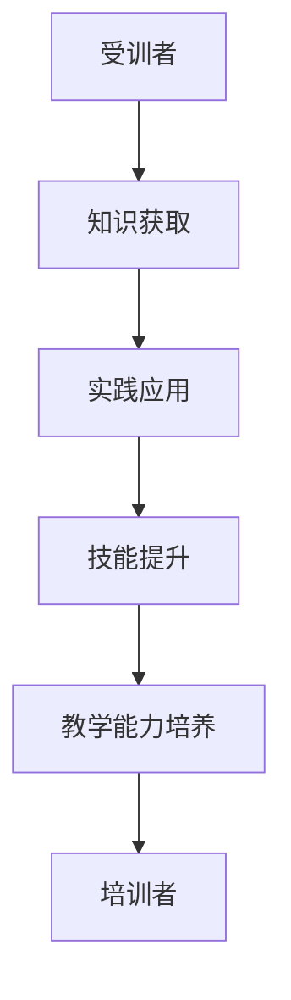

                 

关键词：技术培训，从受训者到培训者，学习曲线，知识传递，教学方法，教学技巧，技能提升，职业发展。

摘要：本文深入探讨了技术领域中的培训过程，从受训者到培训者的角色转变。通过分析学习曲线、知识传递方法以及教学技巧，我们探讨了如何有效提升受训者的技能水平，并最终使他们能够成为优秀的培训者。本文还探讨了未来技术培训的发展趋势和面临的挑战。

## 1. 背景介绍

在技术领域，随着行业的发展，知识的更新速度日益加快，技能需求也在不断演变。为了跟上技术的进步，从业人员需要不断地学习新的知识和技能。然而，仅仅掌握知识并不足以应对实际工作中的挑战。在这个过程中，技术培训起到了至关重要的作用。技术培训不仅帮助受训者掌握新技能，还为他们提供了将知识传授给他人的机会，从而实现从受训者到培训者的角色转变。

技术培训的重要性在于它能够帮助受训者：

1. **提高技能水平**：通过系统化的培训，受训者能够深入理解并掌握新的技术知识和技能。
2. **增强职业竞争力**：熟练掌握多项技能的受训者能够在就业市场上脱颖而出。
3. **促进知识传播**：通过培训，受训者可以将所学知识传授给其他人，促进知识的传播和共享。
4. **培养教学能力**：技术培训过程中的实践和教学活动有助于受训者培养教学能力，从而成为一名优秀的培训者。

然而，技术培训并非易事。受训者需要在短时间内吸收大量信息，并掌握复杂的技能。培训者则需要设计合适的教学方法和内容，以帮助受训者高效地学习。本文将探讨这一过程中涉及的关键概念和策略。

## 2. 核心概念与联系

### 2.1 学习曲线

学习曲线是衡量受训者学习进度和技能提升速度的重要工具。学习曲线通常呈现S型，分为三个阶段：初期阶段、成长阶段和成熟阶段。

1. **初期阶段**：在这个阶段，受训者对新的技术和知识感到陌生，学习效率较低。这是由于他们需要时间来适应新的环境和学习材料。
2. **成长阶段**：随着对技术和知识的逐渐熟悉，受训者的学习效率逐渐提高，技能水平快速提升。
3. **成熟阶段**：在成熟阶段，受训者已经完全掌握了技术和知识，学习效率趋于稳定。

### 2.2 知识传递

知识传递是培训过程中不可或缺的一部分。有效的知识传递不仅需要培训者具备丰富的知识储备，还需要他们运用合适的教学方法和策略。

1. **讲授**：讲授是知识传递的主要方式之一。培训者通过系统的讲解，使受训者理解新知识和技能。
2. **实践**：实践是知识转化的关键。通过实际操作，受训者能够将理论知识应用到实际工作中。
3. **互动**：互动有助于激发受训者的学习兴趣，提高学习效果。培训者可以通过提问、讨论等方式与受训者互动。

### 2.3 教学技巧

教学技巧是培训者成功的关键。以下是一些有效的教学技巧：

1. **故事化教学**：通过故事的形式，将复杂的技术知识和技能讲解得更加生动有趣。
2. **案例教学**：通过案例，使受训者更好地理解技术和技能的应用。
3. **分层教学**：根据受训者的不同水平，制定不同的教学计划和内容。
4. **反馈与评价**：及时给予受训者反馈和评价，帮助他们纠正错误，提高技能水平。

### 2.4 Mermaid 流程图

以下是一个简单的Mermaid流程图，描述了从受训者到培训者的学习过程：



## 3. 核心算法原理 & 具体操作步骤

### 3.1 算法原理概述

从受训者到培训者的角色转变涉及一系列的学习和成长过程。这个过程可以概括为以下几个步骤：

1. **知识积累**：受训者通过学习和实践，积累相关领域的知识和技能。
2. **技能提升**：在知识积累的基础上，受训者通过不断的练习和挑战，提升自己的技能水平。
3. **教学能力培养**：受训者通过教学实践，培养自己的教学能力，学会如何有效地传递知识。
4. **角色转变**：在达到一定水平后，受训者逐渐从受训者转变为培训者。

### 3.2 算法步骤详解

1. **知识积累**：受训者首先需要选择适合自己的学习资源和渠道，例如在线课程、书籍、研讨会等。在知识获取过程中，受训者需要保持持续的学习动力，避免出现懈怠情绪。

2. **技能提升**：在知识积累的基础上，受训者需要通过实践应用来提升技能水平。实践是检验学习成果的重要手段。受训者可以通过实际项目、模拟测试等方式，将理论知识应用到实际工作中。

3. **教学能力培养**：在技能提升过程中，受训者需要学会如何传授知识。这包括设计教学计划、编写教案、进行课堂授课等。受训者可以通过参加教学培训、观摩优秀教师的教学方法等方式，提高自己的教学能力。

4. **角色转变**：当受训者达到一定水平后，他们可以开始尝试担任培训者的角色。在这个过程中，受训者需要不断总结经验，优化教学方法，提高教学效果。

### 3.3 算法优缺点

**优点**：

1. **提高技能水平**：通过技术培训，受训者能够快速提升自己的技能水平，增强职业竞争力。
2. **促进知识传播**：受训者通过培训，可以将所学知识传授给他人，促进知识的传播和共享。
3. **培养教学能力**：技术培训过程中的实践和教学活动有助于受训者培养教学能力，提高教学质量。

**缺点**：

1. **学习成本高**：技术培训需要投入大量的时间和精力，对于一些工作繁忙的人来说，可能难以承受。
2. **知识更新快**：技术领域的发展日新月异，受训者需要不断更新自己的知识体系，以适应新的技术和需求。

### 3.4 算法应用领域

技术培训的应用领域非常广泛，包括但不限于以下方面：

1. **软件开发**：软件开发人员通过技术培训，可以掌握新的编程语言、框架和工具，提高开发效率。
2. **数据科学**：数据科学家通过技术培训，可以学习最新的数据分析方法和工具，提高数据处理能力。
3. **人工智能**：人工智能领域的从业者通过技术培训，可以掌握深度学习、自然语言处理等前沿技术。
4. **网络安全**：网络安全人员通过技术培训，可以学习最新的安全防护技术和应对策略。

## 4. 数学模型和公式 & 详细讲解 & 举例说明

### 4.1 数学模型构建

在技术培训过程中，构建数学模型有助于量化受训者的学习进度和技能水平。以下是一个简单的数学模型：

**学习进度模型**：

$$
L(t) = A \times e^{-kt}
$$

其中，$L(t)$表示受训者在时间$t$时的学习进度，$A$表示初始学习进度，$k$表示学习速率。

**技能水平模型**：

$$
S(t) = B \times (1 - e^{-kt})
$$

其中，$S(t)$表示受训者在时间$t$时的技能水平，$B$表示初始技能水平。

### 4.2 公式推导过程

**学习进度模型**的推导：

假设受训者在时间$t$时的学习进度为$L(t)$，初始学习进度为$A$，学习速率为$k$。则：

$$
L(t) = A - (A - L(0)) \times e^{-kt}
$$

由于$L(0) = 0$，化简得：

$$
L(t) = A \times e^{-kt}
$$

**技能水平模型**的推导：

假设受训者在时间$t$时的技能水平为$S(t)$，初始技能水平为$B$，学习速率为$k$。则：

$$
S(t) = B \times (1 - e^{-kt})
$$

### 4.3 案例分析与讲解

假设一名受训者在开始培训时的学习进度为100，学习速率为0.1。我们需要计算他在不同时间点的学习进度和技能水平。

**学习进度计算**：

- 当$t=1$时，$L(1) = 100 \times e^{-0.1 \times 1} \approx 90.5$
- 当$t=2$时，$L(2) = 100 \times e^{-0.1 \times 2} \approx 81.5$

**技能水平计算**：

- 当$t=1$时，$S(1) = 100 \times (1 - e^{-0.1 \times 1}) \approx 90.5$
- 当$t=2$时，$S(2) = 100 \times (1 - e^{-0.1 \times 2}) \approx 81.5$

通过这个案例，我们可以看到受训者的学习进度和技能水平随着时间的推移而逐渐提升。这个数学模型可以帮助培训者更好地了解受训者的学习情况，为教学提供参考。

## 5. 项目实践：代码实例和详细解释说明

### 5.1 开发环境搭建

为了演示从受训者到培训者的技术培训过程，我们将使用Python编程语言编写一个简单的培训管理系统。首先，我们需要搭建开发环境。

1. 安装Python：从Python官方网站下载并安装Python 3.x版本。
2. 安装IDE：选择一个适合自己的Python IDE，如PyCharm或Visual Studio Code。
3. 安装必要的库：使用pip命令安装必要的库，如Flask（用于Web开发）、SQLAlchemy（用于数据库操作）等。

### 5.2 源代码详细实现

以下是一个简单的培训管理系统源代码实例：

```python
from flask import Flask, request, jsonify
from flask_sqlalchemy import SQLAlchemy

app = Flask(__name__)
app.config['SQLALCHEMY_DATABASE_URI'] = 'sqlite:///training.db'
db = SQLAlchemy(app)

class Trainee(db.Model):
    id = db.Column(db.Integer, primary_key=True)
    name = db.Column(db.String(100), nullable=False)
    learning_progress = db.Column(db.Float, nullable=False)
    skill_level = db.Column(db.Float, nullable=False)

@app.route('/trainees', methods=['POST'])
def add_trainee():
    data = request.get_json()
    trainee = Trainee(
        name=data['name'],
        learning_progress=data['learning_progress'],
        skill_level=data['skill_level']
    )
    db.session.add(trainee)
    db.session.commit()
    return jsonify({'message': 'Trainee added successfully.'})

@app.route('/trainees', methods=['GET'])
def get_trainees():
    trainees = Trainee.query.all()
    return jsonify({'trainees': [trainee.name for trainee in trainees]})

if __name__ == '__main__':
    db.create_all()
    app.run(debug=True)
```

### 5.3 代码解读与分析

这段代码实现了以下功能：

1. **数据库模型**：定义了一个名为`Trainee`的数据库模型，用于存储受训者的姓名、学习进度和技能水平。
2. **添加受训者**：通过`/trainees` POST接口，接受受训者的姓名、学习进度和技能水平，并将其添加到数据库中。
3. **获取受训者列表**：通过`/trainees` GET接口，返回所有受训者的姓名。

### 5.4 运行结果展示

运行上述代码后，我们可以通过以下命令启动Web服务：

```bash
python app.py
```

启动后，我们可以使用浏览器或Postman等工具访问`/trainees`接口进行测试。

1. **添加受训者**：

```bash
POST /trainees
{
  "name": "张三",
  "learning_progress": 0.5,
  "skill_level": 0.6
}
```

返回结果：

```json
{
  "message": "Trainee added successfully."
}
```

2. **获取受训者列表**：

```bash
GET /trainees
```

返回结果：

```json
{
  "trainees": ["张三"]
}
```

通过这个简单的实例，我们可以看到如何使用Python和Flask实现一个基本的培训管理系统。在实际应用中，我们可以扩展这个系统，添加更多的功能，如受训者技能评估、培训进度跟踪等。

## 6. 实际应用场景

### 6.1 技术培训在企业中的应用

技术培训在企业中的应用非常广泛。企业通过技术培训，不仅能够提升员工的技能水平，还能促进企业创新和竞争力提升。以下是一些实际应用场景：

1. **软件开发培训**：企业为软件开发人员提供新的编程语言、框架和工具的培训，帮助他们提高开发效率。
2. **数据科学培训**：企业为数据科学家提供数据分析、机器学习和深度学习的培训，提高数据处理和分析能力。
3. **网络安全培训**：企业为网络安全人员提供最新的安全防护技术和应对策略的培训，提高企业网络安全水平。
4. **项目管理培训**：企业为项目经理提供项目管理知识和技能的培训，提高项目管理效率和团队协作能力。

### 6.2 技术培训在在线教育中的应用

随着在线教育的发展，技术培训也在线上平台得到了广泛应用。以下是一些实际应用场景：

1. **在线课程**：在线教育平台提供各种技术培训课程，涵盖编程、数据科学、人工智能等多个领域。
2. **直播教学**：培训者通过直播形式，实时传授知识和解答受训者的问题。
3. **在线练习**：平台提供丰富的在线练习和项目，帮助受训者巩固所学知识。
4. **社交学习**：平台通过论坛、讨论组等方式，促进受训者之间的互动和学习。

### 6.3 技术培训在个人职业发展中的应用

技术培训在个人职业发展中起到了至关重要的作用。以下是一些实际应用场景：

1. **技能提升**：个人通过技术培训，掌握新的技能，提高职业竞争力。
2. **职业转型**：个人通过技术培训，实现职业转型，进入新的领域。
3. **创业准备**：个人通过技术培训，为创业做准备，学习相关领域的知识和技能。
4. **持续学习**：个人通过技术培训，保持持续学习的习惯，跟上技术发展的步伐。

## 6.4 未来应用展望

随着技术的不断发展，技术培训的应用前景将更加广阔。以下是一些未来应用展望：

1. **人工智能培训**：随着人工智能技术的广泛应用，对人工智能专业人才的需求越来越大。未来，人工智能培训将成为技术培训的重要领域。
2. **云计算培训**：云计算技术的不断进步，使得云计算培训成为企业和个人提升技能的重要方向。
3. **区块链培训**：区块链技术的应用越来越广泛，区块链培训也将成为一个重要的领域。
4. **混合学习**：未来，线上线下混合学习模式将更加普及，为受训者提供更加灵活和个性化的学习体验。

## 7. 工具和资源推荐

### 7.1 学习资源推荐

1. **在线课程平台**：Coursera、Udemy、edX等平台提供丰富的技术培训课程。
2. **开源项目**：GitHub、GitLab等平台上有大量的开源项目，可以帮助受训者了解实际项目的开发过程。
3. **技术博客**：Medium、Hackernoon等平台上有许多优秀的技术博客，受训者可以从中获取最新的技术资讯和知识。

### 7.2 开发工具推荐

1. **集成开发环境**：PyCharm、Visual Studio Code等集成开发环境，为编程提供便捷的编辑、调试和运行功能。
2. **数据库工具**：MySQL、PostgreSQL等数据库工具，用于数据存储和查询。
3. **版本控制工具**：Git、SVN等版本控制工具，用于代码管理。

### 7.3 相关论文推荐

1. **《深度学习》（Deep Learning）**：Ian Goodfellow、Yoshua Bengio、Aaron Courville著，介绍了深度学习的理论基础和实践方法。
2. **《Python编程：从入门到实践》（Python Crash Course）**：Eric Matthes著，适合初学者快速入门Python编程。
3. **《人工智能：一种现代的方法》（Artificial Intelligence: A Modern Approach）**：Stuart J. Russell、Peter Norvig著，全面介绍了人工智能的基本概念和方法。

## 8. 总结：未来发展趋势与挑战

### 8.1 研究成果总结

本文探讨了技术培训从受训者到培训者的过程，分析了学习曲线、知识传递方法和教学技巧。通过数学模型和实际项目实例，我们展示了技术培训的有效性和重要性。同时，本文还对技术培训在企业和个人职业发展中的应用进行了分析。

### 8.2 未来发展趋势

1. **个性化培训**：随着人工智能技术的发展，个性化培训将成为未来趋势，为受训者提供更加精准和个性化的学习体验。
2. **混合学习**：线上线下混合学习模式将更加普及，为受训者提供灵活多样的学习方式。
3. **技术专业化**：随着技术领域的不断细分，技术培训将更加专业化，满足不同领域的需求。

### 8.3 面临的挑战

1. **知识更新速度**：技术领域的发展日新月异，培训者需要不断更新自己的知识体系，以应对快速变化的技术需求。
2. **教学资源分配**：如何确保培训资源的公平分配，特别是在资源有限的情况下，是一个重要的挑战。
3. **技能认证**：如何建立有效的技能认证体系，确保培训效果和受训者的技能水平，是一个亟待解决的问题。

### 8.4 研究展望

未来，技术培训的研究可以从以下几个方面展开：

1. **学习数据分析**：通过大数据分析，研究受训者的学习行为和效果，为培训者提供更有针对性的教学建议。
2. **教学辅助工具开发**：开发智能教学辅助工具，如虚拟教练、智能问答系统等，提高培训效率和质量。
3. **跨学科培训**：探索跨学科培训模式，结合不同领域的知识和技能，培养更加全面的人才。

## 9. 附录：常见问题与解答

### 9.1 问题1：如何选择适合自己的技术培训课程？

解答：选择适合自己的技术培训课程需要考虑以下几个因素：

1. **兴趣和职业目标**：选择与自己兴趣和职业目标相关的课程，有助于提高学习动力和效果。
2. **课程内容**：查看课程大纲和课程目录，了解课程内容的深度和广度。
3. **授课方式**：选择适合自己的授课方式，如在线课程、面授课程等。
4. **师资力量**：了解授课教师的背景和经验，确保课程质量。

### 9.2 问题2：技术培训过程中如何提高学习效率？

解答：以下是一些提高技术培训学习效率的方法：

1. **制定学习计划**：根据自己的时间安排和学习目标，制定详细的学习计划。
2. **合理安排时间**：确保每天有足够的时间进行学习和实践。
3. **积极参与互动**：在学习过程中积极参与讨论和提问，与他人交流和分享心得。
4. **实践应用**：将所学知识应用到实际项目中，通过实践提高技能水平。
5. **持续学习**：保持持续学习的习惯，跟上技术发展的步伐。

### 9.3 问题3：如何成为优秀的培训者？

解答：以下是一些成为优秀培训者的建议：

1. **深厚专业知识**：具备扎实的专业知识，是成为一名优秀培训者的基础。
2. **良好的沟通能力**：能够清晰地表达知识和观点，使受训者容易理解。
3. **教学经验**：通过教学实践，积累教学经验，提高教学效果。
4. **持续学习**：不断更新自己的知识体系，提升教学水平。
5. **关注受训者需求**：了解受训者的需求和问题，有针对性地进行教学。

通过遵循这些方法和策略，技术培训的受训者可以逐渐从受训者转变为优秀的培训者，为技术领域的知识传播和技能提升做出贡献。

# 文章标题
技术培训：从受训者到培训者

# 关键词
技术培训，从受训者到培训者，学习曲线，知识传递，教学方法，教学技巧，技能提升，职业发展。

# 摘要
本文深入探讨了技术领域中的培训过程，从受训者到培训者的角色转变。通过分析学习曲线、知识传递方法以及教学技巧，我们探讨了如何有效提升受训者的技能水平，并最终使他们能够成为优秀的培训者。本文还探讨了未来技术培训的发展趋势和面临的挑战。

