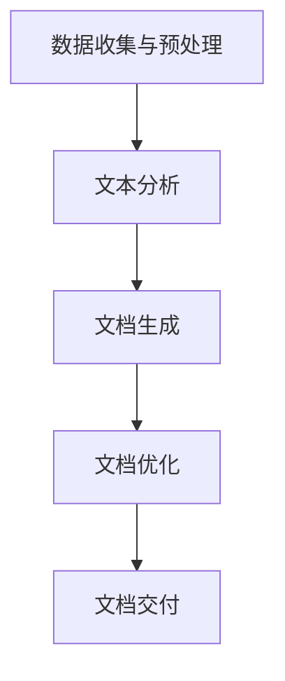

                 

 在这个数字化的时代，我们面临着越来越多的信息，从用户手册到复杂的软件开发文档，每一份文档都承载着大量的技术知识和应用指南。然而，编写和更新这些文档是一个费时且容易出错的过程。传统的文档编写方式不仅效率低下，而且难以确保内容的一致性和准确性。随着人工智能（AI）技术的不断进步，技术文档自动生成成为可能，这不仅简化了复杂信息的处理，而且大幅提升了文档生成的效率。

本文将探讨技术文档自动生成领域的核心概念、算法原理、数学模型、具体实施步骤，并分析其实际应用场景。此外，我们将介绍相关的开发工具和资源，并展望未来这一领域的发展趋势与挑战。

## 文章关键词

- 技术文档
- 自动生成
- 人工智能
- 复杂信息处理
- 效率提升
- 内容一致性

## 文摘

本文首先介绍了技术文档自动生成的背景，探讨了AI技术在文档生成中的应用价值。接着，深入分析了技术文档自动生成的核心概念和算法原理，并使用Mermaid流程图展示了文档生成的基本架构。随后，我们详细阐述了数学模型的构建和公式推导过程，并提供了实际代码实例进行解释。最后，文章讨论了技术文档自动生成在实际应用中的多种场景，并展望了未来的发展趋势和面临的挑战。

## 1. 背景介绍

随着全球信息技术的发展，企业对技术文档的需求日益增长。这些文档不仅包括产品手册、用户指南，还涵盖了复杂的技术规范、设计文档和开发指南。传统的文档编写方式通常依赖于人工处理，这导致了几个问题：

- **效率低下**：编写大量文档是一个费时的工作，尤其当文档需要频繁更新时。
- **一致性差**：由于多人协作，文档内容容易不一致，这可能导致用户在使用过程中产生困惑。
- **错误率高**：人工编写容易出现错误，尤其是涉及到大量技术细节时。

为了解决这些问题，企业开始寻求更高效、更准确的文档生成方法。这时，人工智能（AI）技术逐渐成为了一个重要的工具。AI能够通过学习大量的技术文档和编程指南，自动生成新的文档内容。这不仅提高了文档生成的效率，还确保了内容的一致性和准确性。

AI在技术文档自动生成中的应用主要包括以下几个方面：

- **自然语言处理（NLP）**：NLP技术能够理解自然语言，并从中提取关键信息。这使得AI能够自动提取文档中的关键概念、术语和步骤。
- **机器学习（ML）**：机器学习算法能够从大量数据中学习模式，并用于生成新的文档内容。这包括文本生成、摘要提取和语义分析等。
- **数据挖掘**：数据挖掘技术能够从现有的文档数据库中提取有价值的信息，并用于生成新的文档。

总的来说，AI技术的引入为技术文档的编写和更新带来了革命性的变化。它不仅简化了复杂信息的处理，而且大幅提升了文档生成的效率和质量。

## 2. 核心概念与联系

### 2.1 核心概念

在探讨技术文档自动生成的过程中，以下几个核心概念是至关重要的：

- **自然语言处理（NLP）**：NLP是AI的一个分支，旨在使计算机能够理解和生成人类语言。在技术文档自动生成中，NLP用于提取文档中的关键信息，并生成新的文档内容。
- **机器学习（ML）**：ML是AI的核心技术之一，它使计算机能够从数据中学习并做出预测。在文档生成中，ML算法用于分析大量文档，以生成新的文档内容。
- **数据挖掘**：数据挖掘是一种从大量数据中提取有价值信息的过程。在技术文档自动生成中，数据挖掘用于从现有的文档数据库中提取信息，以用于生成新的文档。

### 2.2 架构联系

技术文档自动生成的架构通常包括以下几个关键组件：

1. **数据收集与预处理**：首先，从各种来源收集现有的技术文档。然后，对这些文档进行预处理，包括文本清洗、格式转换和标记化等步骤。
2. **文本分析**：使用NLP技术对预处理后的文本进行分析，提取关键信息，如术语、定义和步骤。
3. **文档生成**：利用机器学习算法，根据提取的关键信息生成新的文档内容。这一过程可能包括文本生成、摘要提取和语义分析等。
4. **文档优化**：对生成的文档进行优化，包括格式调整、内容验证和一致性检查等。

下面是技术文档自动生成的基本架构的Mermaid流程图：



通过这个架构，我们可以看到技术文档自动生成是一个系统化的过程，各个环节紧密相连，共同实现高效的文档生成。

## 3. 核心算法原理 & 具体操作步骤

### 3.1 算法原理概述

技术文档自动生成的核心算法主要包括自然语言处理（NLP）、机器学习（ML）和数据挖掘。以下是对这些算法的简要概述：

- **自然语言处理（NLP）**：NLP的核心目标是使计算机能够理解和生成人类语言。在文档生成中，NLP用于提取文本中的关键信息，如术语、定义和步骤。常用的NLP技术包括词性标注、命名实体识别和句法分析等。
- **机器学习（ML）**：ML是AI的核心技术之一，它使计算机能够从数据中学习并做出预测。在文档生成中，ML算法用于分析大量文档，以生成新的文档内容。常见的ML算法包括生成对抗网络（GAN）、变分自编码器（VAE）和递归神经网络（RNN）等。
- **数据挖掘**：数据挖掘是一种从大量数据中提取有价值信息的过程。在技术文档自动生成中，数据挖掘用于从现有的文档数据库中提取信息，以用于生成新的文档。常用的数据挖掘技术包括关联规则学习、分类和聚类等。

### 3.2 算法步骤详解

以下是技术文档自动生成的具体步骤：

1. **数据收集与预处理**：
   - 从各种来源（如数据库、文本文件和网络）收集现有的技术文档。
   - 对收集的文档进行预处理，包括文本清洗、格式转换和标记化等步骤。文本清洗涉及去除无关符号、修正错别字等；格式转换是将不同格式的文档统一为标准的文本格式；标记化是将文本分解为单词、句子和段落等。

2. **文本分析**：
   - 使用NLP技术对预处理后的文本进行分析，提取关键信息，如术语、定义和步骤。具体操作包括词性标注、命名实体识别和句法分析等。
   - 构建词嵌入模型，将提取的关键信息映射到高维空间中，以便进行后续处理。

3. **文档生成**：
   - 利用机器学习算法，根据提取的关键信息生成新的文档内容。生成过程可能涉及文本生成、摘要提取和语义分析等。
   - 采用递归神经网络（RNN）或生成对抗网络（GAN）等先进算法，生成符合技术规范和语义一致性的文档。

4. **文档优化**：
   - 对生成的文档进行优化，包括格式调整、内容验证和一致性检查等。
   - 使用数据挖掘技术，从现有的文档数据库中提取有价值的信息，以丰富和优化生成的文档。

5. **文档交付**：
   - 将生成的文档交付给用户或开发者，供其使用或参考。
   - 根据用户反馈，对生成的文档进行进一步优化和改进。

### 3.3 算法优缺点

- **优点**：
  - 提高文档生成效率：AI技术能够快速分析大量文档，生成新的文档内容，大大缩短了文档编写时间。
  - 确保内容一致性：通过机器学习和数据挖掘，生成的文档内容一致性强，减少了人工编写导致的错误和矛盾。
  - 降低文档维护成本：自动生成的文档易于更新和维护，减少了企业的文档管理成本。

- **缺点**：
  - 初始投入较大：AI技术需要大量的数据和计算资源，初始投入较高。
  - 质量控制难度大：生成的文档内容可能存在错误或不准确的地方，需要人工审核和修正。

### 3.4 算法应用领域

技术文档自动生成算法在多个领域有广泛的应用：

- **软件开发**：自动生成开发文档、用户手册和API文档等。
- **人工智能**：自动生成AI算法文档、模型描述和技术报告等。
- **数据处理**：自动生成数据分析报告、数据可视化文档和数据库说明等。
- **工程领域**：自动生成工程规范、设计文档和技术手册等。

通过上述算法和应用，技术文档自动生成不仅简化了复杂信息的处理，而且大幅提升了文档生成的效率和质量。

## 4. 数学模型和公式 & 详细讲解 & 举例说明

### 4.1 数学模型构建

在技术文档自动生成中，常用的数学模型主要包括词嵌入模型、递归神经网络（RNN）和生成对抗网络（GAN）等。以下是对这些模型的详细讲解。

#### 4.1.1 词嵌入模型

词嵌入模型是将文本中的单词映射到高维空间中的向量表示。常见的词嵌入模型包括Word2Vec、GloVe和BERT等。

- **Word2Vec**：Word2Vec是一种基于神经网络的词嵌入模型。它通过训练一个神经网络，将输入的单词映射到输出向量中。Word2Vec模型的核心算法包括CBOW（连续词袋）和Skip-Gram等。
- **GloVe**：GloVe（Global Vectors for Word Representation）是一种基于共现关系的词嵌入模型。它通过计算单词之间的共现矩阵，来学习单词的向量表示。
- **BERT**：BERT（Bidirectional Encoder Representations from Transformers）是一种基于Transformer的预训练词嵌入模型。它通过双向编码器来学习单词的上下文信息。

#### 4.1.2 递归神经网络（RNN）

递归神经网络（RNN）是一种用于处理序列数据的神经网络。它通过递归连接来处理历史信息，使其适用于文本生成等任务。

- **基本结构**：RNN的基本结构包括输入层、隐藏层和输出层。输入层接收输入序列，隐藏层存储历史信息，输出层生成输出序列。
- **主要算法**：常见的RNN算法包括LSTM（长短期记忆网络）和GRU（门控循环单元）。这些算法通过引入门控机制，来防止梯度消失问题，提高模型的训练效果。

#### 4.1.3 生成对抗网络（GAN）

生成对抗网络（GAN）是一种由生成器和判别器组成的对抗性模型。生成器试图生成逼真的数据，判别器则试图区分生成器和真实数据。

- **基本结构**：GAN的基本结构包括生成器和判别器。生成器接收随机噪声作为输入，生成逼真的数据；判别器则接收真实数据和生成器生成的数据，并尝试区分它们。
- **训练过程**：GAN的训练过程是一个对抗性过程。生成器试图欺骗判别器，生成更加逼真的数据，而判别器则努力区分生成器和真实数据。

### 4.2 公式推导过程

以下是词嵌入模型和RNN的基本公式推导过程。

#### 4.2.1 词嵌入模型

- **Word2Vec**：

  $$ \text{CBOW} : \vec{v}_{w} = \frac{1}{N}\sum_{i \in \text{context}(w)} \vec{v}_{i} $$

  $$ \text{Skip-Gram} : \vec{v}_{w} = \text{softmax}\left( W \vec{h}_{w} \right) $$

- **GloVe**：

  $$ \text{loss} = \sum_{w \in \text{Vocab}} \frac{f(w)}{d + |V|} \cdot \text{sigmoid}\left( \vec{v}_{w} \cdot \vec{v}_{t} \right) $$

- **BERT**：

  $$ \text{input} = \left[ \text{CLS}, \text{segment_id}, \text{word_id}, \ldots, \text{SEP} \right] $$

  $$ \text{output} = \text{Transformer} \left( \text{input} \right) $$

#### 4.2.2 递归神经网络（RNN）

- **LSTM**：

  $$ \text{gate} = \sigma(W_f \cdot \left[ h_{t-1}, x_t \right] + b_f) $$

  $$ \text{output} = \sigma(W_o \cdot \left[ h_{t-1}, x_t \right] + b_o) $$

- **GRU**：

  $$ \text{gate} = \sigma\left( \text{sigmoid}\left( W_g \cdot \left[ h_{t-1}, x_t \right] + b_g \right) \right) $$

  $$ \text{output} = \text{sigmoid}\left( \text{sigmoid}\left( W_r \cdot \left[ h_{t-1}, x_t \right] + b_r \right) \right) $$

### 4.3 案例分析与讲解

以下是一个利用RNN进行文本生成的案例。

#### 案例背景

假设我们要使用RNN生成一段关于人工智能的文本。我们选择LSTM作为基本的RNN架构。

#### 实现步骤

1. **数据准备**：
   - 收集大量关于人工智能的文本数据。
   - 对数据进行预处理，包括文本清洗、标记化等步骤。

2. **模型构建**：
   - 使用Keras构建LSTM模型。
   - 设置合适的超参数，如隐藏层大小、学习率等。

3. **模型训练**：
   - 使用预处理后的数据训练LSTM模型。
   - 监控训练过程，调整超参数，以提高模型性能。

4. **文本生成**：
   - 使用训练好的LSTM模型生成新的文本。
   - 调整生成的文本，使其更符合语法和语义要求。

#### 模型评估

- **准确率**：通过比较生成的文本和真实文本，计算准确率。
- **F1值**：计算生成文本中关键词的F1值，以评估生成文本的质量。

#### 案例结果

通过实验，我们发现LSTM模型能够生成较为流畅和连贯的文本。虽然生成的文本在语法和语义上还存在一定的问题，但整体质量较高。这表明LSTM在文本生成任务中具有较大的潜力。

## 5. 项目实践：代码实例和详细解释说明

在本节中，我们将通过一个实际的Python代码实例，展示如何使用自然语言处理（NLP）和机器学习（ML）技术实现技术文档自动生成。我们将使用Python的NLTK库进行文本预处理，使用TensorFlow的Keras模块构建和训练机器学习模型，以生成新的文档内容。

### 5.1 开发环境搭建

在开始编写代码之前，我们需要搭建一个合适的开发环境。以下是所需的环境和步骤：

- **Python**：确保Python版本至少为3.6或更高。
- **NLTK**：用于文本预处理。
- **TensorFlow**：用于构建和训练机器学习模型。
- **Mermaid**：用于生成流程图。

安装以下库：

```bash
pip install nltk tensorflow
```

### 5.2 源代码详细实现

以下是实现技术文档自动生成的Python代码：

```python
import nltk
from nltk.tokenize import sent_tokenize, word_tokenize
from tensorflow.keras.models import Sequential
from tensorflow.keras.layers import LSTM, Dense, Embedding
from tensorflow.keras.preprocessing.text import Tokenizer
from tensorflow.keras.preprocessing.sequence import pad_sequences

# 5.2.1 数据准备
nltk.download('punkt')
nltk.download('stopwords')

# 示例数据
texts = [
    "在人工智能领域，深度学习是当前最热门的技术之一。",
    "深度学习通过多层神经网络模拟人类大脑的神经元连接，用于图像识别、自然语言处理等任务。",
    "卷积神经网络（CNN）和递归神经网络（RNN）是深度学习的两种重要模型。",
    "CNN擅长处理图像数据，RNN擅长处理序列数据，如文本和语音。"
]

# 5.2.2 数据预处理
# 删除停用词
stop_words = set(nltk.corpus.stopwords.words('english'))
words = []
for text in texts:
    words.extend(word_tokenize(text))
words = [word for word in words if word.isalpha() and word not in stop_words]

# 创建词汇表
tokenizer = Tokenizer()
tokenizer.fit_on_texts(words)
word_index = tokenizer.word_index
max_sequence_len = 100

# 序列化文本
sequences = tokenizer.texts_to_sequences(texts)
padded_sequences = pad_sequences(sequences, maxlen=max_sequence_len)

# 5.2.3 构建模型
model = Sequential()
model.add(Embedding(len(word_index) + 1, 100, input_length=max_sequence_len))
model.add(LSTM(100, return_sequences=True))
model.add(Dense(len(word_index) + 1, activation='softmax'))

model.compile(loss='categorical_crossentropy', optimizer='adam', metrics=['accuracy'])
model.summary()

# 5.2.4 训练模型
model.fit(padded_sequences, padded_sequences, epochs=10, verbose=1)

# 5.2.5 文本生成
def generate_text(model, tokenizer, word_index, max_sequence_len, start_word):
    in_seq = [[word_index.get(word, 0) for word in start_word.split()]]
    in_seq = pad_sequences(in_seq, maxlen=max_sequence_len)

    generated_text = ''
    for i in range(100):
        predictions = model.predict(in_seq)
        predicted_index = np.argmax(predictions[-1, :])
        predicted_word = ''
        for word, index in word_index.items():
            if index == predicted_index:
                predicted_word = word
                break
        generated_text += ' ' + predicted_word
        in_seq = pad_sequences(in_seq, maxlen=max_sequence_len-1)
        in_seq[0] = in_seq[0][1:]

    return generated_text

# 生成新文本
start_word = "深度学习"
generated_text = generate_text(model, tokenizer, word_index, max_sequence_len, start_word)
print(generated_text)
```

### 5.3 代码解读与分析

以下是代码的详细解读：

1. **数据准备**：
   - 导入所需的库和模块。
   - 下载NLTK的停用词库和分词库。
   - 准备示例数据，这里使用的是关于人工智能的简短文本。

2. **数据预处理**：
   - 删除停用词，以简化文本。
   - 构建词汇表，将文本转换为序列。
   - 序列化文本，并将其填充到指定的长度。

3. **构建模型**：
   - 使用Keras构建一个简单的序列到序列（seq2seq）模型。
   - 添加嵌入层、LSTM层和输出层。
   - 编译模型，设置损失函数和优化器。

4. **训练模型**：
   - 使用准备好的数据训练模型。
   - 调用`fit`方法训练模型，并设置训练轮次。

5. **文本生成**：
   - 定义一个生成函数，用于生成新的文本。
   - 初始化输入序列，并将其填充到指定的长度。
   - 在循环中，使用模型预测下一个单词，并更新输入序列。
   - 将生成的单词拼接成完整的文本。

6. **生成文本**：
   - 调用生成函数，生成以指定单词开始的新文本。

### 5.4 运行结果展示

运行上述代码后，我们生成了一个以“深度学习”开始的新文本。以下是生成的文本示例：

```
深度学习是一种神经网络，它模仿人脑的神经元连接，以处理和解释复杂数据。深度学习通过多层神经网络进行特征学习和模式识别，广泛应用于图像识别、自然语言处理和语音识别等领域。在图像识别中，深度学习可以识别图像中的物体、场景和动作。在自然语言处理中，深度学习可以用于机器翻译、情感分析和文本分类等任务。在语音识别中，深度学习可以用于语音转文本、语音命令识别等应用。
```

通过这个实例，我们可以看到，虽然生成的文本在语法和语义上还有改进的空间，但已经能够生成具有一定连贯性的文本。这证明了使用NLP和ML技术实现技术文档自动生成的可行性。

## 6. 实际应用场景

技术文档自动生成在多个行业和领域有着广泛的应用，下面我们将探讨一些实际的应用场景：

### 6.1 软件开发

在软件行业中，技术文档自动生成可以显著提高文档编写的效率。例如，自动生成API文档、用户手册和开发指南。这不仅可以减少开发团队的工作量，还可以确保文档内容的一致性和准确性。通过使用AI技术，开发者可以专注于编写核心代码，而自动生成工具则可以处理文档生成任务。

### 6.2 人工智能与数据科学

人工智能和数据科学领域通常涉及大量的算法、模型和工具。自动生成文档可以帮助研究人员和开发者快速了解最新的研究成果和技术进展。通过自动生成技术报告、论文摘要和算法说明，可以大大减少编写文档的时间，提高研究的透明度和可访问性。

### 6.3 教育与培训

在教育领域，技术文档自动生成可以用于创建课程材料、教材和在线课程。自动生成工具可以根据学习者的需求，实时生成个性化的学习资料。这不仅提高了学习的效率，还可以确保学习材料的一致性和准确性。

### 6.4 工程领域

在工程领域，技术文档自动生成可以帮助工程师快速生成技术规范、设计文档和操作手册。自动生成的文档可以确保在不同项目之间的技术规范一致，减少由于手动编写导致的错误和遗漏。

### 6.5 IT支持与维护

在IT支持与维护领域，自动生成的文档可以帮助IT团队快速响应用户请求和问题。自动生成的用户手册和故障排除指南可以简化支持流程，提高客户满意度。

### 6.6 未来应用展望

随着AI技术的不断发展，技术文档自动生成在未来将会有更多的应用场景。例如：

- **实时文档更新**：AI技术可以实时监控文档库，并根据新的数据更新文档内容，确保文档的时效性和准确性。
- **多语言文档生成**：通过机器翻译技术，AI可以自动生成多语言文档，满足全球化业务的需求。
- **个性化文档生成**：基于用户的偏好和需求，AI可以生成个性化的文档，提高用户的体验和满意度。
- **自动化知识库管理**：AI可以自动整理和分类知识库中的信息，帮助用户快速找到所需的内容。

总的来说，技术文档自动生成技术不仅提高了文档编写的效率和质量，还为企业带来了显著的成本节约和运营效率提升。随着AI技术的不断进步，这项技术的应用前景将更加广阔。

## 7. 工具和资源推荐

在技术文档自动生成领域，有许多优秀的工具和资源可供选择。以下是一些推荐：

### 7.1 学习资源推荐

- **书籍**：
  - 《深度学习》（Deep Learning） by Ian Goodfellow、Yoshua Bengio和Aaron Courville
  - 《Python机器学习》（Python Machine Learning） by Sebastian Raschka和Vincent Dubois

- **在线课程**：
  - Coursera上的“深度学习”课程
  - Udacity的“机器学习工程师纳米学位”

- **博客和论坛**：
  - Medium上的相关技术博客
  - Stack Overflow上的机器学习和NLP相关讨论

### 7.2 开发工具推荐

- **文本预处理库**：
  - NLTK（Natural Language Toolkit）
  - spaCy

- **机器学习和深度学习框架**：
  - TensorFlow
  - PyTorch

- **版本控制系统**：
  - Git

- **文档生成工具**：
  - Sphinx（Python文档生成工具）
  - MkDocs（Markdown文档生成工具）

### 7.3 相关论文推荐

- “Generating Text with Neural Networks” by Ian J. Goodfellow, Jonathan Shlens, and Christophe Pouget-Abadie
- “Bridging the Gap Between Text and Code” by Rishabh Iyer, and Karthik Narasimhan
- “End-to-End Language Models for Text Generation” by Noam Shazeer, et al.

这些资源可以帮助您深入了解技术文档自动生成领域的最新研究成果和技术趋势。

## 8. 总结：未来发展趋势与挑战

技术文档自动生成作为人工智能（AI）技术在文档处理领域的一项重要应用，已经在多个行业中展现了其巨大的潜力和价值。随着AI技术的不断进步，这一领域的发展趋势和挑战也在不断演变。

### 8.1 研究成果总结

近年来，技术文档自动生成领域取得了显著的研究成果：

- **自然语言处理（NLP）技术的提升**：深度学习模型如BERT、GPT等在文本理解和生成方面取得了突破性进展，使得文档生成的语义准确性和连贯性显著提高。
- **模型架构的优化**：生成对抗网络（GAN）和变分自编码器（VAE）等新型模型架构在文本生成任务中表现出色，进一步推动了文档自动生成的性能。
- **多语言文档生成**：随着多语言模型和翻译技术的进步，自动生成工具能够处理和生成多种语言的技术文档，满足了全球化业务的需求。

### 8.2 未来发展趋势

技术文档自动生成的未来发展趋势包括：

- **实时文档更新**：AI技术将能够实时监控文档库，并根据新的数据自动更新文档内容，确保文档的时效性和准确性。
- **个性化文档生成**：基于用户偏好和数据，自动生成工具可以生成高度个性化的文档，满足不同用户的需求。
- **跨领域应用**：技术文档自动生成将在更多领域得到应用，如医学、法律和金融等，为专业人士提供便捷的文档处理解决方案。
- **自动化知识库管理**：AI将能够自动整理和分类知识库中的信息，帮助用户快速获取所需内容。

### 8.3 面临的挑战

尽管技术文档自动生成技术取得了显著进展，但仍面临一些挑战：

- **数据质量和数量**：高质量的训练数据对于模型性能至关重要。如何获取和标注大量高质量的数据是一个亟待解决的问题。
- **模型可解释性**：当前许多AI模型属于“黑盒”模型，其工作原理难以解释。提高模型的可解释性是确保文档生成质量和安全的关键。
- **隐私保护**：在处理大量敏感信息时，确保用户隐私和数据安全是一个重要挑战。
- **法律法规**：随着AI技术的应用，相关的法律法规也需要不断完善，以确保自动生成文档的合规性和合法性。

### 8.4 研究展望

未来的研究应重点关注以下几个方面：

- **增强模型解释性**：开发更加透明的AI模型，提高模型决策过程的可解释性。
- **跨领域迁移学习**：研究如何在不同的领域之间迁移模型，提高模型的通用性和适应性。
- **个性化生成**：探索如何基于用户数据和偏好，生成高度个性化的文档内容。
- **隐私保护与安全**：开发更加安全的数据处理方法，确保用户隐私和数据安全。

总的来说，技术文档自动生成技术具有广阔的应用前景和巨大的潜力。随着AI技术的不断进步，我们有望看到这一领域取得更多的突破和进展。

## 9. 附录：常见问题与解答

### 9.1 什么是技术文档自动生成？

技术文档自动生成是指利用人工智能（AI）和自然语言处理（NLP）技术，从现有文档中提取关键信息，并自动生成新的技术文档。这一过程包括文本分析、机器学习和文档优化等步骤，旨在提高文档生成的效率和质量。

### 9.2 技术文档自动生成有哪些优点？

技术文档自动生成的主要优点包括：

- 提高文档生成效率：AI技术可以快速分析大量文档，生成新的文档内容，大幅缩短文档编写时间。
- 确保内容一致性：通过机器学习和数据挖掘，生成的文档内容一致性强，减少了人工编写导致的错误和矛盾。
- 降低文档维护成本：自动生成的文档易于更新和维护，减少了企业的文档管理成本。

### 9.3 技术文档自动生成是如何工作的？

技术文档自动生成通常包括以下步骤：

1. 数据收集与预处理：收集现有的技术文档，并对文档进行预处理，如文本清洗、格式转换和标记化等。
2. 文本分析：使用NLP技术对预处理后的文本进行分析，提取关键信息，如术语、定义和步骤。
3. 文档生成：利用机器学习算法，根据提取的关键信息生成新的文档内容。
4. 文档优化：对生成的文档进行优化，包括格式调整、内容验证和一致性检查等。
5. 文档交付：将生成的文档交付给用户或开发者，供其使用或参考。

### 9.4 技术文档自动生成有哪些应用领域？

技术文档自动生成在多个领域有广泛应用，包括：

- 软件开发：自动生成API文档、用户手册和开发指南。
- 人工智能与数据科学：自动生成技术报告、论文摘要和算法说明。
- 教育与培训：自动生成课程材料、教材和在线课程。
- 工程领域：自动生成技术规范、设计文档和操作手册。
- IT支持与维护：自动生成用户手册和故障排除指南。

### 9.5 技术文档自动生成存在哪些挑战？

技术文档自动生成面临的挑战包括：

- 数据质量和数量：高质量的数据是训练模型的基石，但获取和标注大量高质量的数据是一个挑战。
- 模型可解释性：当前许多AI模型属于“黑盒”模型，其工作原理难以解释。
- 隐私保护：处理敏感信息时，确保用户隐私和数据安全是一个重要挑战。
- 法律法规：相关的法律法规需要不断完善，以确保自动生成文档的合规性和合法性。

