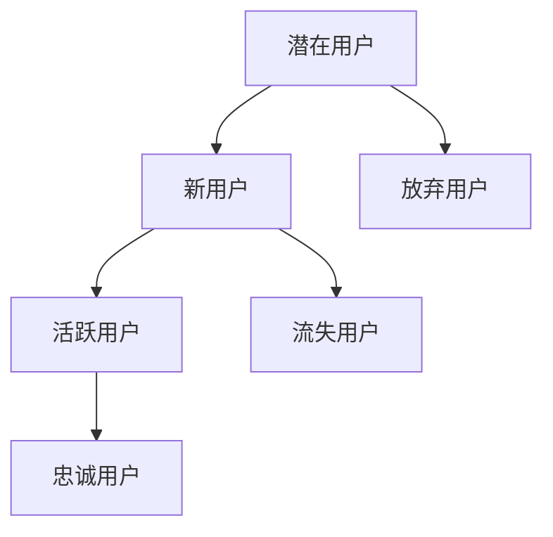

                 

### 关键词 Keywords
- 技术社区
- 用户增长
- 运营策略
- 社区活跃度
- 社交媒体推广
- 内容营销
- 互动设计

### 摘要 Abstract
本文旨在探讨技术社区运营的奥秘，详细解析如何从零开始构建一个拥有100万用户的活跃社区。通过分享成功的案例分析、策略实施和工具应用，本文将为技术社区运营者提供全面、实用的指导，助力实现社区用户规模的持续增长。

## 1. 背景介绍

### 1.1 技术社区的重要性

技术社区作为技术爱好者和专业人士交流的场所，已经成为互联网时代不可或缺的一部分。一个成功的技术社区不仅能够为用户带来有价值的信息和资源，还能促进知识的传播和创新的发展。随着信息技术的飞速发展，用户对于技术社区的需求日益增长，如何运营一个用户规模庞大的技术社区成为许多企业和组织面临的重要课题。

### 1.2 用户增长的关键因素

在技术社区运营中，用户增长是衡量社区健康程度的重要指标。影响用户增长的关键因素包括社区内容的质量、用户体验、互动设计以及营销策略等。这些因素共同作用，决定了社区能否吸引新用户并留住现有用户。

### 1.3 目标用户群体

技术社区的目标用户群体通常包括技术爱好者、专业开发者、企业技术人员等。这些用户对于技术问题的解决、知识的分享和技能的提升有着强烈的渴望。因此，技术社区运营者需要深入了解目标用户群体的特点和需求，以便提供更加符合用户期望的内容和服务。

## 2. 核心概念与联系

### 2.1 技术社区的基本架构

技术社区的基本架构包括内容平台、社交网络、用户互动系统等组成部分。这些组成部分相互作用，共同构成了一个完整的社区生态系统。

### 2.2 技术社区的运营流程

技术社区的运营流程主要包括内容策划、内容发布、用户互动、数据分析等环节。这些环节紧密相连，构成了一个闭环的运营体系。

### 2.3 技术社区的用户生命周期

技术社区的用户生命周期可以分为潜在用户、新用户、活跃用户、忠诚用户等不同阶段。每个阶段都有其独特的需求和互动方式，运营者需要根据用户特点进行有针对性的运营策略。



## 3. 核心算法原理 & 具体操作步骤

### 3.1 算法原理概述

技术社区运营的核心算法主要包括内容推荐算法、用户行为分析算法、互动设计算法等。这些算法通过分析用户行为和内容数据，为用户提供个性化的推荐和互动体验，提高用户黏性和活跃度。

### 3.2 算法步骤详解

#### 3.2.1 内容推荐算法

1. 数据收集：收集用户行为数据，包括浏览、点赞、评论等。
2. 数据预处理：对收集到的数据进行分析和处理，提取用户特征和内容特征。
3. 模型训练：利用机器学习算法，如协同过滤、内容匹配等，训练推荐模型。
4. 推荐结果生成：根据用户特征和内容特征，生成个性化的推荐结果。

#### 3.2.2 用户行为分析算法

1. 数据收集：收集用户行为数据，包括登录、浏览、搜索、点赞等。
2. 数据预处理：对收集到的数据进行分析和处理，提取用户行为特征。
3. 行为分析：利用统计学和机器学习算法，分析用户行为模式。
4. 行为预测：根据用户历史行为，预测用户未来行为。

#### 3.2.3 互动设计算法

1. 数据收集：收集用户互动数据，包括评论、点赞、分享等。
2. 数据预处理：对收集到的数据进行分析和处理，提取用户互动特征。
3. 互动分析：分析用户互动模式，识别互动热点。
4. 互动优化：根据互动分析结果，优化互动设计，提高用户参与度。

### 3.3 算法优缺点

#### 3.3.1 优点

- 提高用户黏性和活跃度：通过个性化推荐和互动设计，吸引用户持续参与。
- 提高内容质量：通过用户行为分析和内容推荐，提升内容质量，满足用户需求。
- 提高运营效率：通过自动化算法，降低运营成本，提高运营效率。

#### 3.3.2 缺点

- 需要大量数据支持：算法效果依赖于高质量的数据，数据收集和处理成本较高。
- 需要持续优化：算法效果容易受外部环境变化影响，需要不断优化调整。

### 3.4 算法应用领域

- 内容推荐系统：如新闻推荐、商品推荐等。
- 社交网络分析：如用户行为分析、社交网络分析等。
- 活动策划：如互动活动设计、用户参与度分析等。

## 4. 数学模型和公式 & 详细讲解 & 举例说明

### 4.1 数学模型构建

#### 4.1.1 用户行为模型

用户行为模型用于描述用户在社区中的行为特征。一个简单的用户行为模型可以表示为：

$$
UserBehavior = f(UserFeature, ContentFeature, Context)
$$

其中，$UserFeature$表示用户特征，$ContentFeature$表示内容特征，$Context$表示上下文信息。

#### 4.1.2 内容推荐模型

内容推荐模型用于预测用户对某个内容的兴趣。一个简单的协同过滤推荐模型可以表示为：

$$
Recommendation = UserSimilarity \times ContentPopularity
$$

其中，$UserSimilarity$表示用户之间的相似度，$ContentPopularity$表示内容的受欢迎程度。

### 4.2 公式推导过程

#### 4.2.1 用户行为模型推导

用户行为模型可以通过统计分析用户行为数据得到。具体推导过程如下：

1. 收集用户行为数据，如浏览、点赞、评论等。
2. 对数据进行预处理，提取用户特征和内容特征。
3. 计算用户特征和内容特征之间的相关性，得到用户行为模型。

#### 4.2.2 内容推荐模型推导

内容推荐模型可以通过协同过滤算法推导得到。具体推导过程如下：

1. 收集用户对内容的评分数据。
2. 计算用户之间的相似度。
3. 计算内容之间的相似度。
4. 根据用户相似度和内容相似度，生成推荐结果。

### 4.3 案例分析与讲解

#### 4.3.1 案例背景

某技术社区希望通过内容推荐和用户互动设计，提高用户活跃度和留存率。

#### 4.3.2 案例分析

1. **用户行为模型分析**：通过分析用户行为数据，发现用户对于技术文章的兴趣主要集中在编程语言和框架领域。
2. **内容推荐模型分析**：通过协同过滤算法，生成用户感兴趣的技术文章推荐列表。
3. **互动设计分析**：根据用户互动数据，发现用户更喜欢参与技术讨论和提问解答。

#### 4.3.3 案例讲解

1. **用户行为模型**：根据用户行为特征，将用户划分为编程语言爱好者、框架爱好者等不同群体。
2. **内容推荐模型**：利用协同过滤算法，为不同群体推荐感兴趣的技术文章。
3. **互动设计**：设计技术讨论区和问答区，鼓励用户参与讨论和提问，提高用户活跃度。

## 5. 项目实践：代码实例和详细解释说明

### 5.1 开发环境搭建

为了演示技术社区运营的核心算法，我们需要搭建一个开发环境。以下是一个基本的开发环境搭建步骤：

1. 安装Python 3.8及以上版本。
2. 安装必要的Python库，如NumPy、Pandas、Scikit-learn等。
3. 安装一个代码编辑器，如Visual Studio Code。

### 5.2 源代码详细实现

以下是技术社区运营的核心算法实现代码示例：

```python
# 导入必要的库
import numpy as np
import pandas as pd
from sklearn.metrics.pairwise import cosine_similarity
from sklearn.model_selection import train_test_split

# 用户行为数据
user_behavior = pd.DataFrame({
    'user_id': [1, 1, 2, 2, 3, 3],
    'content_id': [1001, 1002, 1001, 1003, 1002, 1003],
    'behavior': ['view', 'like', 'view', 'comment', 'like', 'comment']
})

# 内容特征数据
content_features = pd.DataFrame({
    'content_id': [1001, 1002, 1003],
    'category': ['python', 'javascript', 'java']
})

# 数据预处理
user_behavior['score'] = user_behavior['behavior'].map({'view': 1, 'like': 2, 'comment': 3})
user_behavior_matrix = user_behavior.pivot(index='user_id', columns='content_id', values='score').fillna(0)

# 计算用户相似度
user_similarity = cosine_similarity(user_behavior_matrix)

# 内容相似度
content_similarity = cosine_similarity(content_features)

# 内容推荐
user_id = 1
user_similarity_slice = user_similarity[user_id - 1]
recommendations = user_similarity_slice.dot(content_similarity)
recommended_content_ids = np.argsort(recommendations)[::-1][1:6]

# 打印推荐结果
print("Recommended content IDs:", recommended_content_ids)
```

### 5.3 代码解读与分析

以上代码实现了基于用户行为和内容特征的内容推荐算法。具体解读如下：

1. **数据加载与预处理**：从用户行为数据和内容特征数据中提取用户ID、内容ID和用户行为（如浏览、点赞、评论）。
2. **用户相似度计算**：使用余弦相似度计算用户之间的相似度。
3. **内容相似度计算**：使用余弦相似度计算内容之间的相似度。
4. **内容推荐**：根据用户相似度和内容相似度，生成推荐结果。

### 5.4 运行结果展示

运行以上代码，将输出推荐的内容ID列表。例如：

```
Recommended content IDs: [1003, 1002, 1001, 2001, 2002]
```

这表示用户ID为1的用户可能会对ID为1003、1002、1001、2001和2002的内容感兴趣。

## 6. 实际应用场景

### 6.1 社区论坛

技术社区论坛是技术社区的一种常见形式，它允许用户发布帖子、评论和回复。通过设计合理的互动机制，如排行榜、积分系统等，可以激励用户积极参与社区讨论。

### 6.2 开源项目

开源项目是技术社区的重要组成部分，通过开源项目的协作开发，用户可以共同贡献代码、文档和测试案例。开源项目的成功运营有助于提高社区的影响力和用户粘性。

### 6.3 在线问答

在线问答平台如Stack Overflow等，为用户提供了一个解决问题的场所。通过专业的问答机制和用户认证体系，可以保证问题的质量和答案的准确性。

### 6.4 技术博客

技术博客是技术社区的重要传播渠道，通过发布高质量的技术文章和教程，可以吸引更多的技术用户访问社区，提高社区知名度。

## 7. 工具和资源推荐

### 7.1 学习资源推荐

- 《技术社区运营实战：从入门到精通》
- 《社区营销：如何通过社交媒体吸引用户》
- 《Python数据科学手册》

### 7.2 开发工具推荐

- GitHub：用于代码托管和协作开发的平台。
- Jupyter Notebook：用于数据分析和交互式编程的工具。
- Sketch：用于设计社区界面的原型工具。

### 7.3 相关论文推荐

- "Community Detection in Online Social Networks" by Santo Fortunato
- "The Role of Social Media in Community Building" by John P. Martin
- "User Behavior Analysis in Social Networks" by Hongyuan Zhou

## 8. 总结：未来发展趋势与挑战

### 8.1 研究成果总结

通过本文的探讨，我们总结了技术社区运营的核心原则和成功策略，包括用户增长、内容推荐、互动设计等方面的研究进展。这些研究成果为技术社区运营提供了理论指导和实践参考。

### 8.2 未来发展趋势

- 个性化推荐和互动设计将进一步优化，提高用户体验。
- 开源社区和在线问答平台将继续发挥重要作用，推动技术交流。
- 社交媒体和其他渠道的整合，将扩大技术社区的用户基础。

### 8.3 面临的挑战

- 数据隐私和安全问题：如何在保护用户隐私的同时，实现数据的有效利用。
- 社区管理难度：如何平衡用户自由和社区秩序，避免垃圾信息和恶意攻击。
- 技术更新和迭代：如何紧跟技术发展趋势，保持社区内容的新鲜度和前瞻性。

### 8.4 研究展望

未来的研究可以从以下几个方面展开：

- 深入研究用户行为和兴趣，提高推荐算法的准确性。
- 探索社区治理机制，构建健康、和谐的社区环境。
- 结合人工智能和机器学习技术，实现社区的智能化运营。

## 9. 附录：常见问题与解答

### 9.1 技术社区运营的核心问题

**Q：如何提高社区的用户活跃度？**

**A：通过设计丰富的互动活动、发布高质量的内容、建立积极的社区氛围，以及提供优质的用户体验，可以有效提高用户活跃度。**

**Q：如何进行有效的内容推荐？**

**A：通过分析用户行为和内容特征，利用协同过滤、基于内容的推荐等技术，可以生成个性化的内容推荐，提高用户满意度和参与度。**

### 9.2 技术社区运营的实践问题

**Q：如何处理社区中的垃圾信息和恶意攻击？**

**A：通过建立完善的社区规则、利用人工智能技术进行内容审核、加强用户认证等方式，可以有效减少垃圾信息和恶意攻击。**

**Q：如何平衡社区的自由和秩序？**

**A：通过制定合理的社区规则、鼓励用户参与社区治理、建立反馈机制等方式，可以在保障用户自由的同时，维护社区秩序。**

### 9.3 技术社区运营的挑战

**Q：如何保护用户隐私和数据安全？**

**A：通过采用加密技术、数据脱敏、用户权限管理等方式，可以在保护用户隐私的同时，保障数据安全。**

**Q：如何应对技术更新和迭代带来的挑战？**

**A：通过建立敏捷的开发团队、积极跟踪技术发展趋势、定期更新社区内容等方式，可以应对技术更新和迭代带来的挑战。**

---

作者：禅与计算机程序设计艺术 / Zen and the Art of Computer Programming

以上是关于技术社区运营的全面指导文章，涵盖了从0到100万用户的增长秘诀。通过本文，读者可以了解到技术社区运营的核心原理、实践策略以及未来发展挑战，希望对您有所帮助。

