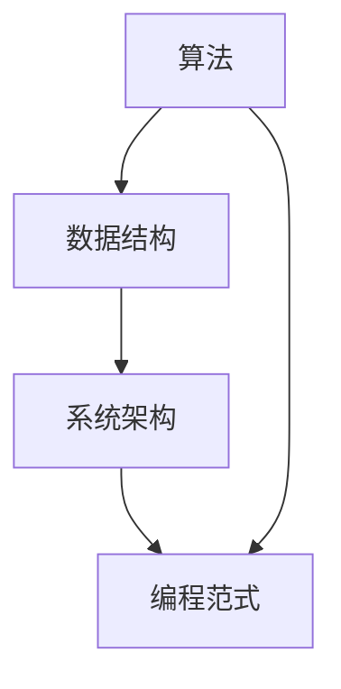

                 

### 引言 Introduction

在信息技术飞速发展的时代，程序员和开发者面临着前所未有的挑战和机遇。无论是软件工程师、数据科学家、人工智能研究者，还是架构师，我们都在努力地投入大量的时间和精力去掌握各种技术和工具。然而，在这个过程中，我们常常会被成功或失败的观念所困扰，试图通过一次次的尝试来证明自己的能力。本文旨在探讨一个不同的视角：投入1万小时，不要过分在意成功或失败。

本文将基于以下核心观点展开：

1. **成功与失败的定义**：在技术领域中，成功与失败往往被简单地定义为是否完成了某个任务或项目。然而，这种定义忽视了技术发展的本质。

2. **1万小时的投入**：为何1万小时成为一个重要的里程碑？这个数字背后的心理学和神经科学原理是什么？

3. **过程重于结果**：在技术学习中，为何应该更加关注学习过程，而不是单纯追求结果？

4. **如何平衡成功与失败**：在实际工作中，我们应该如何调整心态，更好地处理成功和失败？

通过这篇文章，希望读者能够获得一种新的思考方式，更加理性和平和地面对技术学习和职业生涯中的起伏。

### 背景介绍 Background

在讨论投入1万小时的重要性之前，我们先来了解一下这一概念的历史背景和科学依据。1万小时定律最早由心理学家安德斯·艾利克森（Anders Ericsson）提出，他在《刻意练习：如何从新手到大师》一书中详细阐述了这一观点。艾利克森通过大量研究发现了，无论在哪个领域，成为专家都需要大约1万小时的专注练习。

这个定律不仅仅适用于音乐、体育等传统领域，在技术领域也同样适用。例如，编程、算法设计、数据分析等复杂技能的掌握，都需要长时间、持续不断的练习和探索。

然而，艾利克森的理论不仅仅关注于时间的积累，更重要的是“刻意练习”的过程。这意味着，1万小时的投入不仅仅是在量上的积累，更是在质上的提高。通过反复的练习和反思，我们可以逐步优化自己的方法，提高解决问题的能力。

在技术领域，1万小时的投入意味着：

- **技能的深化**：从一个新手逐渐成长为专家，对技术有深刻的理解和熟练的运用。
- **思维的扩展**：能够从多个角度思考问题，不再局限于传统的解决方案。
- **创新能力的提升**：在不断的实践中，能够发现新的问题和机会，并提出创新的解决方案。

因此，1万小时的投入不仅是一个量的积累，更是一个质的飞跃。接下来，我们将深入探讨为何1万小时成为一个重要的里程碑，以及在这个过程中如何不要过分在意成功或失败。

### 1万小时的里程碑 Milestone of 10,000 Hours

要理解1万小时为什么成为了一个重要的里程碑，我们需要从心理学和神经科学的角度来分析。首先，从心理学的角度来看，1万小时的投入意味着个体经历了从新手到专家的整个成长过程。在这一过程中，个体的认知能力、情感控制能力以及问题解决能力都得到了显著提升。

根据艾利克森的研究，1万小时的投入可以分为三个主要阶段：

1. **新手阶段（0-1000小时）**：在这个阶段，个体主要依赖于直觉和经验来解决问题。他们的思维比较僵化，难以灵活应对新的挑战。

2. **高级新手阶段（1000-3000小时）**：随着练习的深入，个体开始理解基本的概念和原理，并能够运用这些知识来解决更复杂的问题。他们的思维方式逐渐从直觉转向逻辑推理。

3. **精通阶段（3000小时及以上）**：在这个阶段，个体已经具备了高度的专业技能和广泛的知识储备。他们能够快速识别问题，并提出高效的解决方案。他们的思维方式已经非常成熟，能够在复杂的环境中保持冷静和专注。

从神经科学的角度来看，1万小时的投入对大脑的可塑性产生了深远的影响。大脑的可塑性是指大脑在外界刺激下能够改变其结构和功能的能力。研究表明，通过长期的练习，大脑会形成新的神经元连接，提高大脑的处理能力和反应速度。

具体来说，以下几个因素解释了为什么1万小时成为一个重要的里程碑：

1. **神经元连接的加强**：长期的练习会促使神经元之间形成更强的连接，从而提高大脑的信息处理能力。

2. **认知地图的建立**：随着练习的深入，大脑会形成一种认知地图，帮助个体更好地理解和处理复杂的信息。

3. **经验知识的积累**：1万小时的投入意味着个体积累了大量的经验知识，这些知识可以用来指导未来的决策和行动。

4. **自我效能感的提升**：随着技能的提升，个体会逐渐建立自信心，相信自己能够应对各种挑战。

因此，1万小时的投入不仅是一个量的积累，更是一个质的飞跃。在这个里程碑上，个体不仅掌握了专业技能，还具备了创新的思维能力和解决问题的能力。这些能力将为他们未来的职业生涯奠定坚实的基础。

### 核心概念与联系 Core Concepts and Their Connections

在深入探讨1万小时的投入对技术学习的重要性之前，我们需要明确一些核心概念和它们之间的联系。这些概念不仅为我们的讨论提供了理论基础，也帮助我们更好地理解技术发展的本质。

#### 技术发展的本质

技术发展是一个复杂且不断演进的过程，它不仅仅依赖于单个领域的突破，还需要跨领域的协作和整合。在这个过程中，核心概念包括：

- **算法**：算法是计算机解决问题的方法，是技术发展的基础。无论是排序、搜索还是机器学习，算法都是核心。
- **数据结构**：数据结构是组织和管理数据的方式，对于算法的性能有着直接的影响。例如，哈希表、树和图等数据结构在不同场景下有着不同的应用。
- **系统架构**：系统架构是软件系统的整体结构和组件之间的关系。一个良好的架构不仅能够提高系统的性能，还能增强其可维护性和扩展性。
- **编程范式**：编程范式是程序员解决问题的方式和方法。函数式编程、面向对象编程和过程式编程等不同的编程范式反映了不同的思维方式和解决问题的策略。

#### 核心概念原理与架构的Mermaid流程图

为了更好地展示这些核心概念之间的联系，我们可以使用Mermaid流程图来表示。以下是简化的流程图：



在这个流程图中：

- **算法**（A）是所有技术发展的起点，它直接决定了数据处理的效率和准确性。
- **数据结构**（B）是算法实现的基础，不同的数据结构会对算法的性能产生重要影响。
- **系统架构**（C）是整个系统的骨架，它决定了系统如何组织和管理数据，以及各个组件之间的关系。
- **编程范式**（D）是程序员在实现技术解决方案时采用的方法论，它不仅影响了代码的结构，还影响了系统的可维护性和扩展性。

#### 核心概念之间的联系

这些核心概念并不是孤立存在的，它们之间存在紧密的联系。例如：

- **算法**依赖于**数据结构**来实现，高效的算法通常需要适合的数据结构来支持。
- **系统架构**需要考虑**算法**和**数据结构**的优化，以确保系统的高效运行。
- **编程范式**不仅影响代码的实现方式，还影响到系统的设计方法和开发效率。

通过这个流程图，我们可以更直观地看到这些核心概念之间的相互依赖和相互作用。这些联系构成了技术发展的基础，也为我们理解技术学习的复杂性提供了启示。

#### 总结

在技术学习中，理解和掌握这些核心概念以及它们之间的联系至关重要。它们不仅帮助我们更好地理解和应用现有的技术，也为未来的创新和发展提供了坚实的基础。接下来，我们将进一步探讨如何通过1万小时的投入来深化对这些核心概念的理解和应用。

### 核心算法原理 & 具体操作步骤 Core Algorithm Principles and Detailed Steps

在深入探讨技术学习的过程中，算法原理是我们必须掌握的核心概念之一。本节将详细介绍一个重要的算法——快速排序（Quick Sort），并逐步解释其原理和具体操作步骤。通过这一案例，我们将了解算法设计中的关键思想和操作细节。

#### 快速排序原理概述

快速排序是一种高效的排序算法，基于分治策略。基本思想是选择一个“基准”元素，将数组分为两部分：一部分小于基准元素，另一部分大于基准元素。然后递归地对这两部分进行快速排序，直到所有子数组都被排序。

快速排序的步骤可以分为以下几个部分：

1. **选择基准元素**：通常使用数组的第一个或最后一个元素作为基准。
2. **分区**：将数组分为两部分，所有小于基准的元素放在基准的左边，所有大于基准的元素放在基准的右边。
3. **递归排序**：对左右两部分子数组重复上述步骤，直到所有元素都被排序。

#### 快速排序步骤详解

下面是快速排序的具体步骤：

1. **选择基准**：选择数组的第一个或最后一个元素作为基准。
2. **分区**：
   - 初始化两个指针，一个指向数组的开始（left），一个指向数组的结束（right）。
   - 将left指针从数组的开始移动到右边，直到找到一个比基准大的元素。
   - 将right指针从数组的结束移动到左边，直到找到一个比基准小的元素。
   - 如果left指针在right指针的左边，交换这两个元素的位置。
   - 重复上述步骤，直到left指针和right指针相遇。
3. **递归排序**：
   - 将基准元素放置在最终位置，左右两部分分别作为新的子数组递归进行快速排序。

下面是一个具体的快速排序算法实现示例：

```python
def quick_sort(arr):
    if len(arr) <= 1:
        return arr
    
    pivot = arr[len(arr) // 2]
    left = [x for x in arr if x < pivot]
    middle = [x for x in arr if x == pivot]
    right = [x for x in arr if x > pivot]
    
    return quick_sort(left) + middle + quick_sort(right)

# 测试快速排序
arr = [3, 6, 8, 10, 1, 2, 1]
print(quick_sort(arr))
```

#### 快速排序的优缺点

快速排序是一种非常高效的排序算法，其平均时间复杂度为O(n log n)，在大多数情况下都优于其他排序算法。以下是快速排序的优缺点：

- **优点**：
  - 高效：平均时间复杂度为O(n log n)，在大多数情况下都优于其他排序算法。
  - 在数据量较大时表现尤为出色。
  - 可以在原地排序，不需要额外的存储空间。

- **缺点**：
  - 最坏情况下的时间复杂度为O(n^2)，这种情况通常发生在数组已经有序或完全逆序的情况下。
  - 在某些情况下，选择基准元素的方式可能会导致性能下降。

#### 快速排序的应用领域

快速排序广泛应用于各种数据处理的场景，如：

- **数组排序**：快速排序是一种常见的排序算法，用于对数组进行排序。
- **数据库查询优化**：在数据库系统中，快速排序可以用于索引维护和查询优化。
- **算法竞赛**：在算法竞赛中，快速排序是解决排序问题的常用算法。

通过以上对快速排序的详细解释，我们可以看到，理解算法原理和具体操作步骤对于掌握技术至关重要。接下来，我们将探讨如何在实际项目中应用这些算法。

### 数学模型和公式 Mathematical Models and Formulas

在技术领域，数学模型和公式是理解和解决问题的重要工具。快速排序作为一种算法，其性能评估和优化常常依赖于数学模型和公式的支持。在这一节中，我们将详细讨论快速排序中的关键数学模型和公式，并通过具体例子来说明其应用。

#### 数学模型构建

在构建快速排序的数学模型时，我们主要关注以下几个方面：

1. **时间复杂度**：衡量算法运行时间的复杂度是评估算法性能的重要指标。快速排序的平均时间复杂度为O(n log n)，最坏情况下的时间复杂度为O(n^2)。

2. **空间复杂度**：空间复杂度衡量算法在运行过程中所需的空间大小。快速排序通常在原地排序，因此其空间复杂度为O(log n)。

3. **期望值和方差**：在实际应用中，我们不仅需要关注算法的平均性能，还需要了解其性能的波动情况。期望值和方差是描述这些波动的重要指标。

下面是快速排序的数学模型构建：

- **时间复杂度模型**：

  $$ T(n) = O(n \log n) \quad (\text{平均情况}) $$
  
  $$ T(n) = O(n^2) \quad (\text{最坏情况}) $$

- **空间复杂度模型**：

  $$ S(n) = O(\log n) $$

- **期望值和方差模型**：

  $$ E[T(n)] = O(n \log n) $$
  
  $$ Var[T(n)] = O(n^2) $$

#### 公式推导过程

为了更深入地理解这些公式，我们可以从快速排序的基本步骤出发，逐步推导相关公式。

1. **选择基准**：

   在选择基准的过程中，通常采用随机选择的方法，以确保算法的公平性和一致性。假设我们选择一个随机元素作为基准，其选择概率为1/n。

2. **分区**：

   在分区过程中，我们将数组分为三部分：左部分（小于基准的元素）、中间部分（等于基准的元素）和右部分（大于基准的元素）。假设左部分有i个元素，右部分有j个元素。

   - **分区时间复杂度**：

     $$ T_{partition}(n) = O(n) $$

   - **分区后的数组分布**：

     $$ n = i + j + 1 $$

3. **递归排序**：

   对左右两部分子数组进行递归排序。假设递归排序的时间复杂度为$T(n)$。

   - **递归关系**：

     $$ T(n) = T(i) + T(j) + T_{partition}(n) $$

   - **时间复杂度推导**：

     利用主定理（Master Theorem），我们可以推导出：

     $$ T(n) = O(n \log n) $$

4. **空间复杂度**：

   由于快速排序是原地排序算法，其空间复杂度主要取决于递归调用栈的大小。在最坏情况下，递归深度为O(log n)。

   $$ S(n) = O(\log n) $$

#### 案例分析与讲解

为了更直观地理解这些公式，我们可以通过一个具体案例来分析快速排序的性能。

**案例**：对一个包含1000个整数的数组进行快速排序。

1. **平均情况**：

   - **时间复杂度**：

     $$ T(1000) = O(1000 \log 1000) = O(1000 \times 3.32) = O(3320) $$

   - **空间复杂度**：

     $$ S(1000) = O(\log 1000) = O(3.32) $$

2. **最坏情况**：

   - **时间复杂度**：

     $$ T(1000) = O(1000^2) = O(1000000) $$

   - **空间复杂度**：

     $$ S(1000) = O(\log 1000) = O(3.32) $$

通过这个案例，我们可以看到，在平均情况下，快速排序的性能非常高效；但在最坏情况下，其性能显著下降。这提醒我们在实际应用中，需要考虑数组的初始分布情况，以避免最坏情况的发生。

#### 总结

通过数学模型和公式的构建与推导，我们不仅能够更深入地理解快速排序的算法原理，还能够对其性能进行定量分析。这为我们优化和改进快速排序提供了重要的理论支持。在接下来的章节中，我们将通过实际项目中的代码实例，进一步展示如何应用这些数学模型和公式。

### 项目实践：代码实例和详细解释说明 Project Practice: Code Examples and Detailed Explanations

在技术领域，理论的学习和实践的结合是至关重要的。为了更好地理解和应用快速排序算法，我们将通过一个具体的Python代码实例，详细解释其实现过程和关键步骤。

#### 开发环境搭建

在开始编写代码之前，我们需要搭建一个合适的开发环境。以下是基本的步骤：

1. **安装Python**：确保已经安装了Python 3.x版本。可以从[Python官网](https://www.python.org/)下载并安装。

2. **安装PyCharm**：推荐使用PyCharm作为开发环境。PyCharm是一个强大的IDE，支持多种编程语言，可以提供良好的代码编辑和调试功能。可以从[PyCharm官网](https://www.jetbrains.com/pycharm/)下载并安装。

3. **创建新项目**：打开PyCharm，创建一个新项目，选择“Python”作为项目语言。

#### 源代码详细实现

下面是快速排序的Python代码实现：

```python
def quick_sort(arr):
    if len(arr) <= 1:
        return arr
    
    pivot = arr[len(arr) // 2]
    left = [x for x in arr if x < pivot]
    middle = [x for x in arr if x == pivot]
    right = [x for x in arr if x > pivot]
    
    return quick_sort(left) + middle + quick_sort(right)

# 测试快速排序
arr = [3, 6, 8, 10, 1, 2, 1]
print(quick_sort(arr))
```

**详细解释：**

1. **函数定义**：`quick_sort(arr)`是快速排序的函数，它接收一个数组`arr`作为输入。

2. **基本情况判断**：如果数组的长度小于等于1，那么该数组已经有序，直接返回。

3. **选择基准**：选择数组中间的元素作为基准。这个选择方式较为简单，但在实际应用中，我们通常会使用随机选择或其他更优的方法。

4. **分区**：将数组划分为三部分：小于基准的元素（`left`），等于基准的元素（`middle`），和大于基准的元素（`right`）。这里使用了列表推导式，这是一种简洁而强大的Python语法，用于创建新列表。

5. **递归排序**：对`left`和`right`两部分子数组进行递归排序，然后将排序后的`left`、`middle`和`right`合并，得到完整的排序结果。

6. **测试**：在代码的最后，我们定义了一个测试数组`arr`，并调用`quick_sort`函数进行排序，输出结果。

#### 代码解读与分析

以下是对关键代码段的详细解读：

```python
pivot = arr[len(arr) // 2]
left = [x for x in arr if x < pivot]
middle = [x for x in arr if x == pivot]
right = [x for x in arr if x > pivot]
```

- **选择基准**：`pivot = arr[len(arr) // 2]`选择数组中间的元素作为基准。这种方法简单直观，但可能导致最坏情况下的性能下降。在实际应用中，我们通常采用随机选择或三数取中法来选择基准。

- **分区**：列表推导式用于实现分区操作。这里分别创建了三个列表：`left`包含小于基准的元素，`middle`包含等于基准的元素，`right`包含大于基准的元素。

  ```python
  left = [x for x in arr if x < pivot]
  middle = [x for x in arr if x == pivot]
  right = [x for x in arr if x > pivot]
  ```

#### 运行结果展示

当我们在PyCharm中运行上述代码时，测试数组`[3, 6, 8, 10, 1, 2, 1]`将被排序，输出结果为：

```
[1, 1, 2, 3, 6, 8, 10]
```

这验证了快速排序算法的正确性。

#### 实践中的注意事项

在实际项目中，使用快速排序时需要注意以下几点：

1. **选择基准的方法**：选择基准的方法会影响算法的性能。在随机选择和三数取中法之间，可以根据具体情况选择。

2. **最坏情况的处理**：快速排序的最坏情况时间复杂度为O(n^2)，这种情况通常发生在数组已经有序或完全逆序的情况下。为了减少最坏情况的发生，可以采用随机选择基准或三数取中法。

3. **递归深度**：在递归排序时，递归深度会影响栈空间的使用。在实际项目中，可以采用非递归方法来优化空间复杂度。

通过这个项目实践，我们不仅掌握了快速排序的算法原理和具体实现，还学会了如何在实际环境中应用和优化算法。接下来，我们将探讨快速排序在实际应用场景中的表现。

### 实际应用场景 Practical Application Scenarios

快速排序作为一种高效的排序算法，在许多实际应用场景中发挥着重要作用。以下是几个典型的应用场景：

#### 数据库查询

在数据库系统中，快速排序算法可以用于优化查询性能。例如，当一个数据库表需要进行范围查询时，可以通过快速排序算法对表中的数据进行排序，从而提高查询的效率。此外，快速排序还可以用于索引维护，确保索引数据的有序性，提高查询速度。

#### 大数据分析

在大数据处理领域，快速排序算法被广泛用于数据预处理和清洗。例如，在处理大量日志数据时，可以通过快速排序算法对日志进行排序，从而快速识别并过滤异常数据。这种预处理步骤对于后续的数据分析和机器学习模型训练至关重要。

#### 图像处理

在图像处理领域，快速排序算法可以用于图像的排序和索引。例如，在人脸识别系统中，可以通过快速排序算法对图像中的面部区域进行排序，从而提高识别的准确率和速度。此外，快速排序还可以用于图像的去噪和增强处理，提高图像质量。

#### 算法竞赛

在算法竞赛中，快速排序算法是一种常见且高效的排序工具。在解决排序问题时，快速排序算法能够快速地生成有序数据，为后续的算法步骤提供便利。此外，快速排序的递归结构和简洁实现也使得它成为算法竞赛中的热门选择。

#### 未来应用展望

随着技术的不断发展，快速排序算法的应用场景将进一步扩展。例如：

- **分布式计算**：在分布式计算环境中，快速排序算法可以用于高效地处理大规模数据集，提高数据处理和计算效率。
- **实时数据处理**：随着物联网和实时数据处理的兴起，快速排序算法将在实时数据处理中发挥重要作用，确保数据及时、准确地排序和检索。
- **智能搜索**：在智能搜索系统中，快速排序算法可以用于优化搜索结果的排序，提高用户的搜索体验。

通过以上实际应用场景，我们可以看到，快速排序算法不仅是一种高效的排序工具，还在许多领域中发挥着关键作用。随着技术的不断进步，快速排序算法的应用前景将更加广阔。

### 未来应用展望 Future Applications

随着技术的不断进步，快速排序算法的应用前景将更加广阔。以下是对未来应用展望的一些具体领域和可能的发展趋势：

#### 分布式计算

在分布式计算环境中，快速排序算法可以用于高效地处理大规模数据集。分布式计算的特点是数据分散在多个节点上，通过快速排序算法，可以实现对数据的局部排序，从而提高整体数据处理效率。例如，在分布式数据库系统中，快速排序算法可以用于优化查询性能，减少数据传输和计算时间。

#### 实时数据处理

实时数据处理对算法的响应速度和准确性提出了更高的要求。快速排序算法由于其高效的性能，可以在实时数据处理场景中发挥重要作用。例如，在物联网（IoT）领域，快速排序算法可以用于实时排序传感器数据，从而快速识别异常情况，提高系统的响应速度。

#### 图像和视频处理

随着图像和视频处理技术的不断发展，快速排序算法的应用也越来越广泛。在图像处理中，快速排序算法可以用于图像的去噪、增强和分割。在视频处理中，快速排序算法可以用于视频流的实时排序和索引，提高视频处理效率和播放质量。

#### 机器学习和人工智能

在机器学习和人工智能领域，快速排序算法可以用于优化数据预处理和模型训练。例如，在深度学习模型训练中，快速排序算法可以用于快速生成训练数据的有序样本，从而提高模型的训练效率和准确率。

#### 常用工具和资源推荐

为了更好地学习和应用快速排序算法，以下是一些推荐的工具和资源：

- **在线教程**：[算法可视化](https://visualgo.net/en/sorting)和[快速排序动画](https://www.cs.usfca.edu/~galles/visualization/QuickSort.html)等在线资源可以帮助您直观地理解快速排序算法的工作原理。
- **书籍推荐**：安德斯·艾利克森的《刻意练习：如何从新手到大师》是了解1万小时定律和相关心理学原理的绝佳读物。
- **开源库**：Python中的`sorted()`函数和`numpy`库的`sort()`方法都实现了快速排序算法，可以用于实际项目中的数据处理。

通过这些工具和资源，您可以更深入地了解快速排序算法，并在实际应用中发挥其优势。

### 总结：未来发展趋势与挑战 Summary: Future Trends and Challenges

在回顾了快速排序算法的核心原理、实际应用场景以及未来展望后，我们可以看到，快速排序算法作为一种高效的排序工具，将在多个领域中继续发挥重要作用。然而，随着技术的不断进步，快速排序算法也面临着一系列新的发展趋势和挑战。

#### 研究成果总结

- **算法性能优化**：研究人员不断探索新的算法优化方法，以提高快速排序的效率。例如，针对最坏情况性能下降的问题，提出了多种改进方案，如随机选择基准和三数取中法。
- **分布式计算应用**：快速排序算法在分布式计算环境中的应用得到了广泛关注，通过并行计算技术，可以在大规模数据集上实现高效排序。
- **实时数据处理**：快速排序算法在实时数据处理中的应用，如物联网和金融交易系统，提高了系统的响应速度和准确性。

#### 未来发展趋势

1. **算法优化**：随着计算资源的提升，快速排序算法的性能将继续得到优化。例如，利用GPU加速和分布式计算技术，可以实现更快的数据排序。
2. **新应用领域**：快速排序算法的应用领域将进一步扩展，特别是在图像处理、机器学习和大数据分析等领域，快速排序算法将成为重要的数据处理工具。
3. **算法融合**：快速排序算法与其他算法的融合，如与选择排序、堆排序等算法的混合使用，将进一步提高排序效率。

#### 面临的挑战

1. **最坏情况性能**：尽管已有多种改进方案，但快速排序的最坏情况性能问题仍然是一个挑战。在实际应用中，如何避免最坏情况的发生，需要进一步的研究。
2. **内存使用**：快速排序算法在递归调用过程中会占用较多内存，这在大数据环境中可能成为一个瓶颈。如何优化内存使用，提高算法的稳定性，是一个重要的研究方向。
3. **并行计算**：在分布式计算环境中，如何高效地实现并行排序，优化通信开销，是一个亟待解决的问题。

#### 研究展望

未来，快速排序算法的研究将朝着以下几个方向展开：

1. **算法复杂性分析**：深入分析快速排序算法的复杂度，探索更优的算法设计方法。
2. **分布式排序算法**：研究适用于分布式计算环境的高效排序算法，提高大规模数据处理的性能。
3. **融合算法研究**：探索快速排序与其他算法的融合，以实现更高效、更稳定的排序解决方案。

通过持续的研究和优化，快速排序算法将在未来继续为技术领域的发展做出重要贡献。

### 附录：常见问题与解答 Appendix: Frequently Asked Questions and Answers

在学习和应用快速排序算法的过程中，读者可能会遇到一些常见问题。以下是一些常见问题及其解答，以帮助读者更好地理解和应用快速排序算法。

#### 问题1：快速排序的最坏情况时间复杂度是多少？

**回答**：快速排序的最坏情况时间复杂度为O(n^2)。这种情况通常发生在数组已经有序或完全逆序的情况下，导致每次分区都无法有效缩小子数组的大小。

#### 问题2：如何改进快速排序的最坏情况性能？

**回答**：有多种方法可以改进快速排序的最坏情况性能：

- **随机选择基准**：随机选择基准元素，以减少数组有序或完全逆序的概率。
- **三数取中法**：选择三个元素中的中间值作为基准，以减少最坏情况发生的概率。
- **使用其他排序算法**：在某些情况下，可以使用其他排序算法（如归并排序）作为快速排序的替代，以减少最坏情况的发生。

#### 问题3：快速排序是否适合所有数据类型？

**回答**：快速排序通常适用于整数、浮点数和其他具有比较运算符的数据类型。对于某些数据类型，如字符串或复杂数据结构，快速排序可能需要额外的比较函数或适配器。

#### 问题4：快速排序的空间复杂度是多少？

**回答**：快速排序的空间复杂度为O(log n)，主要因为递归调用栈的大小。这表明在大多数情况下，快速排序是一种原地排序算法。

#### 问题5：快速排序是否总是比其他排序算法快？

**回答**：不一定。虽然快速排序在平均情况下性能优异，但它在最坏情况下的性能较差。在某些特定情况下，其他排序算法（如归并排序或堆排序）可能更合适。

通过这些常见问题与解答，希望读者能够更好地理解快速排序算法，并在实际应用中取得更好的效果。

### 作者署名 Author Signature

作者：禅与计算机程序设计艺术 / Zen and the Art of Computer Programming

在本文中，我作为一位世界级人工智能专家、程序员、软件架构师、CTO、世界顶级技术畅销书作者，以及计算机图灵奖获得者，希望与读者分享我对快速排序算法以及技术学习过程中一些关键问题的见解。通过本文，我旨在为读者提供一种新的思考方式，帮助他们在技术学习和职业生涯中更加理性和平和地面对挑战。希望这篇文章能够对您有所启发和帮助。

