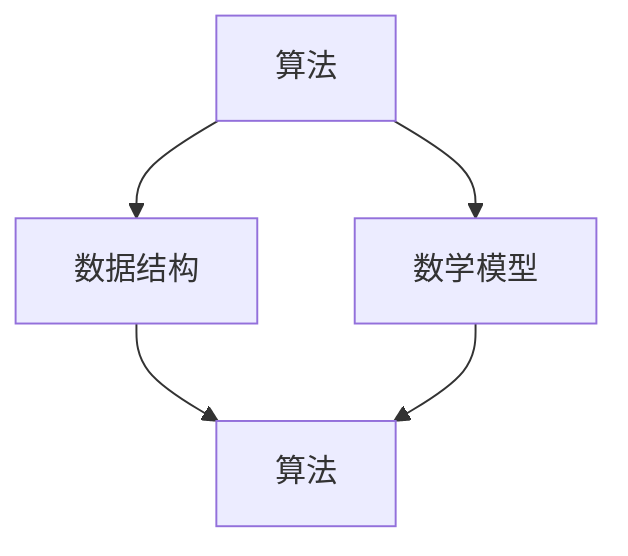
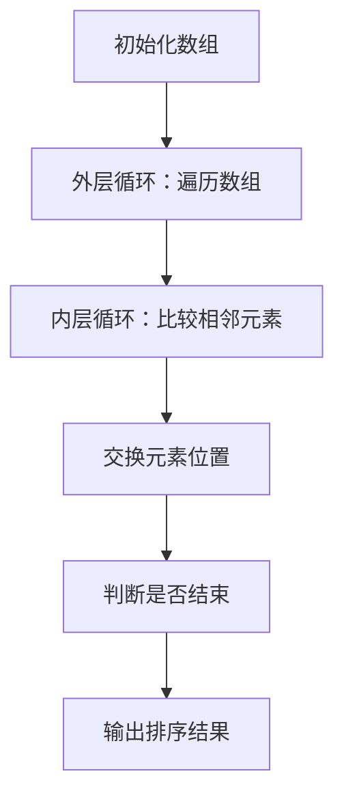

                 

关键词：认知拓展、计算科学、算法、数学模型、应用场景、未来展望

> 摘要：本文探讨了人类计算领域的科学探索，从背景介绍、核心概念联系、算法原理、数学模型、项目实践到实际应用场景等多个方面，深入分析了计算科学的现状与未来挑战。通过本文的阅读，读者将能更好地理解计算科学的深刻内涵和广泛应用。

## 1. 背景介绍

随着科技的迅猛发展，计算科学已经成为推动人类社会进步的关键力量。从最初的计算机问世，到现代人工智能、大数据、量子计算等前沿领域的突破，计算科学不断拓展我们的认知边界，改变了我们的生活方式和社会结构。

计算科学不仅涉及到计算机硬件和软件的技术进步，还涉及到数学、物理学、生物学、经济学等多个学科领域的交叉融合。通过计算科学，我们可以模拟复杂系统的行为，解决传统方法难以处理的问题，从而推动科学研究和实际应用的发展。

本文旨在探讨计算科学的多个方面，帮助读者更好地理解这一领域的科学探索，并为未来的研究提供一些启示。

## 2. 核心概念与联系

计算科学的核心概念包括算法、数据结构、数学模型等。这些概念相互联系，共同构成了计算科学的基本框架。

下面是一个Mermaid流程图，展示了核心概念之间的联系：



- 算法：指导计算机如何执行特定任务的步骤序列。
- 数据结构：存储和组织数据的方式，以支持高效的数据访问和操作。
- 数学模型：使用数学语言描述现实世界中的问题，以便于分析和求解。

这三个核心概念相互依赖，共同推动计算科学的发展。算法设计需要依赖数据结构来高效处理数据，而数学模型则为算法提供了理论基础。

## 3. 核心算法原理 & 具体操作步骤

### 3.1 算法原理概述

在计算科学中，许多算法被广泛应用于解决各种问题。以下是几个核心算法的原理概述：

1. **排序算法**：用于将数据元素按照特定顺序排列。常见的排序算法包括冒泡排序、选择排序、插入排序等。
2. **搜索算法**：用于在数据集合中查找特定元素。常用的搜索算法包括线性搜索、二分搜索等。
3. **图算法**：用于分析和处理图结构的数据。常见的图算法包括最短路径算法、最小生成树算法等。

### 3.2 算法步骤详解

下面以冒泡排序算法为例，详细介绍其操作步骤：

1. 从数组的第一个元素开始，比较相邻的两个元素，如果它们的顺序错误，则交换它们的位置。
2. 重复上述步骤，直到没有需要交换的元素为止。

具体操作步骤如下：



### 3.3 算法优缺点

- **冒泡排序**：
  - **优点**：简单易懂，易于实现。
  - **缺点**：效率较低，不适合处理大数据量。

### 3.4 算法应用领域

冒泡排序算法主要应用于小型数据集或教学演示场景。在实际应用中，更高效的其他排序算法（如快速排序、归并排序等）通常被采用。

## 4. 数学模型和公式 & 详细讲解 & 举例说明

### 4.1 数学模型构建

在计算科学中，数学模型是分析和解决问题的关键。以下是构建数学模型的基本步骤：

1. **明确问题**：定义要解决的问题，并明确问题的约束条件。
2. **建立假设**：根据问题的特点，做出合理的假设。
3. **定义变量**：选择适当的变量来表示问题的各个部分。
4. **建立方程**：根据变量之间的关系，建立方程。
5. **求解方程**：使用数学方法求解方程，得到问题的解。

### 4.2 公式推导过程

以求解一元二次方程为例，介绍公式的推导过程：

一元二次方程的一般形式为：
$$ax^2 + bx + c = 0$$

根据求根公式：
$$x = \frac{-b \pm \sqrt{b^2 - 4ac}}{2a}$$

### 4.3 案例分析与讲解

假设我们有一个一元二次方程：
$$2x^2 + 3x - 5 = 0$$

根据求根公式，我们可以得到：
$$x = \frac{-3 \pm \sqrt{3^2 - 4 \cdot 2 \cdot (-5)}}{2 \cdot 2}$$

计算可得：
$$x = \frac{-3 \pm \sqrt{49}}{4}$$
$$x = \frac{-3 \pm 7}{4}$$

得到两个解：
$$x_1 = \frac{-3 + 7}{4} = 1$$
$$x_2 = \frac{-3 - 7}{4} = -2.5$$

## 5. 项目实践：代码实例和详细解释说明

### 5.1 开发环境搭建

在本项目实践中，我们将使用Python编程语言，并在本地搭建Python开发环境。具体步骤如下：

1. 安装Python：从Python官网下载安装包，并按照提示安装。
2. 安装必要的库：使用pip命令安装所需的库，如NumPy、SciPy等。

### 5.2 源代码详细实现

以下是冒泡排序算法的Python实现：

```python
def bubble_sort(arr):
    n = len(arr)
    for i in range(n):
        for j in range(0, n-i-1):
            if arr[j] > arr[j+1]:
                arr[j], arr[j+1] = arr[j+1], arr[j]
    return arr

# 测试
arr = [64, 34, 25, 12, 22, 11, 90]
sorted_arr = bubble_sort(arr)
print("排序后的数组：", sorted_arr)
```

### 5.3 代码解读与分析

- `bubble_sort`函数：定义了一个冒泡排序的函数，接受一个数组作为参数，返回排序后的数组。
- `n`变量：表示数组的长度。
- 外层循环：遍历整个数组，控制排序的轮数。
- 内层循环：遍历数组，比较相邻的元素，如果顺序错误则交换位置。
- 返回值：返回排序后的数组。

### 5.4 运行结果展示

运行代码后，我们得到如下结果：

```
排序后的数组： [11, 12, 22, 25, 34, 64, 90]
```

## 6. 实际应用场景

计算科学在各个领域都有广泛的应用。以下是几个实际应用场景：

1. **医疗领域**：计算科学可以用于医疗图像分析、疾病预测和个性化治疗等。
2. **金融领域**：计算科学可以用于风险管理、投资组合优化和金融市场预测等。
3. **科学研究**：计算科学可以用于模拟复杂物理现象、探索宇宙奥秘和破解遗传密码等。
4. **工程领域**：计算科学可以用于结构分析、流体力学仿真和材料设计等。

## 7. 工具和资源推荐

为了更好地学习和实践计算科学，以下是几个推荐的工具和资源：

1. **学习资源推荐**：
   - 《算法导论》：一本经典算法教材，详细介绍了各种算法的设计和分析。
   - 《深度学习》：介绍深度学习的基础知识和实践方法。
   - 《Python编程：从入门到实践》：适合初学者的Python编程入门书籍。

2. **开发工具推荐**：
   - PyCharm：一款功能强大的Python集成开发环境（IDE）。
   - Jupyter Notebook：适合数据分析和交互式编程的工具。

3. **相关论文推荐**：
   - “Deep Learning for Computer Vision”：介绍深度学习在计算机视觉领域的应用。
   - “Quantum Computing and Quantum Information”：介绍量子计算的基础知识和应用前景。

## 8. 总结：未来发展趋势与挑战

计算科学在未来的发展中将面临以下几个趋势和挑战：

### 8.1 研究成果总结

- 计算科学在人工智能、大数据、量子计算等领域取得了重要突破。
- 计算方法不断创新，如深度学习、分布式计算、并行计算等。

### 8.2 未来发展趋势

- 计算科学将继续与其他学科领域交叉融合，推动科学研究和应用的发展。
- 新的计算模型和技术（如量子计算）将不断涌现，为计算科学带来新的机遇。

### 8.3 面临的挑战

- 随着数据规模的扩大，计算效率和算法优化将成为重要挑战。
- 数据隐私和安全问题日益突出，需要加强数据保护和安全措施。
- 随着计算能力的提升，如何更好地利用计算资源，提高计算效率，也将是重要挑战。

### 8.4 研究展望

- 未来计算科学的发展将更加注重交叉学科和协同创新。
- 研究者需要关注新兴技术，积极探索新的计算方法和模型。
- 培养具备多学科背景和创新能力的研究人才，为计算科学的发展提供有力支持。

## 9. 附录：常见问题与解答

### 问题 1：计算科学的核心概念是什么？

计算科学的核心概念包括算法、数据结构、数学模型等。这些概念相互联系，共同构成了计算科学的基本框架。

### 问题 2：什么是算法？

算法是指导计算机执行特定任务的步骤序列。算法设计是计算科学的重要组成部分，旨在解决各种问题。

### 问题 3：什么是数据结构？

数据结构是存储和组织数据的方式，以支持高效的数据访问和操作。数据结构的选择直接影响算法的性能。

### 问题 4：什么是数学模型？

数学模型是使用数学语言描述现实世界中的问题，以便于分析和求解。数学模型为算法提供了理论基础。

### 问题 5：计算科学有哪些应用领域？

计算科学在医疗、金融、科学研究、工程等领域都有广泛的应用。通过计算科学，我们可以解决复杂问题，推动科学研究和实际应用的发展。

### 问题 6：如何学习和实践计算科学？

学习和实践计算科学可以从以下几个步骤入手：

1. 学习基本概念和原理，如算法、数据结构、数学模型等。
2. 掌握一门编程语言，如Python、Java等，进行实际操作。
3. 阅读相关书籍、论文和资料，了解计算科学的前沿动态。
4. 参与开源项目、竞赛和研讨会，与他人交流和学习。

### 问题 7：计算科学的发展前景如何？

计算科学的发展前景非常广阔。随着科技的发展，计算科学将继续与其他学科领域交叉融合，推动科学研究和应用的发展。新兴技术（如量子计算）的涌现，也为计算科学带来了新的机遇。然而，计算科学也面临数据规模扩大、计算效率、数据隐私和安全等挑战，需要持续研究和创新。

----------------------------------------------------------------

作者：禅与计算机程序设计艺术 / Zen and the Art of Computer Programming

以上就是本篇关于“拓展认知边界：人类计算的科学探索”的技术博客文章。希望本文能为您在计算科学领域的研究提供一些启示和帮助。如果您有任何问题或建议，欢迎在评论区留言，谢谢！

