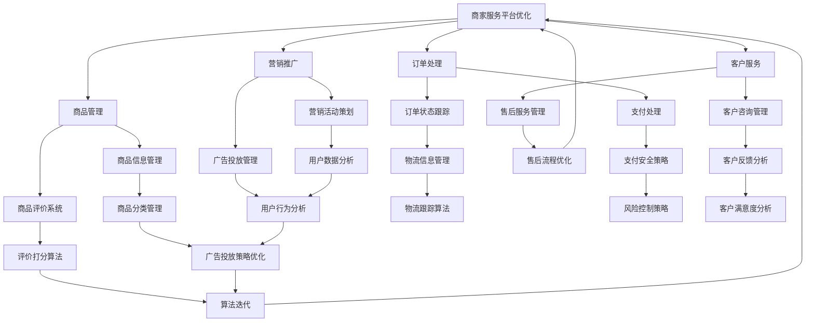

                 

 关键词：拼多多、商家服务平台、社招面试、真题汇总、解答、面试技巧、案例分析

> 摘要：本文旨在为广大有意向加入拼多多商家服务平台的求职者提供一份详细的面试真题汇总及解答。文章将结合实际面试经验，从技术、业务、管理等多个维度进行分析，帮助求职者更好地应对面试，提高面试成功率。

## 1. 背景介绍

随着互联网电商的快速发展，拼多多作为国内知名的电商平台，吸引了越来越多的商家入驻。为了保障商家服务的质量和平台的稳定性，拼多多对于商家服务平台的人才选拔非常重视。社招面试作为招聘的重要环节，面试题的难度和广度都有一定的要求。本文将针对2024年拼多多商家服务平台社招面试真题进行汇总及解答，帮助求职者更好地应对面试挑战。

### 1.1 拼多多商家服务平台简介

拼多多商家服务平台是拼多多为了提升商家服务质量和用户体验，推出的一个综合性服务平台。该平台提供了一系列的功能和服务，包括商品管理、订单处理、客户服务、营销推广等，旨在帮助商家更好地运营店铺，提升销售额。

### 1.2 社招面试的重要性

社招面试是拼多多商家服务平台招聘过程中的关键环节。通过面试，企业能够全面了解求职者的技术水平、业务理解能力、沟通协作能力等综合素质，从而判断其是否适合岗位要求。因此，求职者需要认真对待面试，提前做好准备。

## 2. 核心概念与联系

在面试过程中，理解一些核心概念和它们之间的联系非常重要。以下是一些关键概念及它们的联系，我们将使用Mermaid流程图来展示这些概念之间的关系。



## 3. 核心算法原理 & 具体操作步骤

在商家服务平台的技术实现中，核心算法起着至关重要的作用。以下我们将详细介绍几个核心算法的原理及具体操作步骤。

### 3.1 算法原理概述

- **商品推荐算法**：基于用户的购物行为、浏览历史和商品评价，为用户推荐可能的感兴趣商品。
- **订单处理算法**：根据订单的创建时间、商品数量、买家信息等参数，自动处理订单并发送提醒通知。
- **客户服务算法**：基于客户咨询的内容和频率，自动分类咨询并分配给相应的客服人员。
- **营销推广算法**：通过分析用户数据和市场需求，自动生成营销方案和推广策略。

### 3.2 算法步骤详解

- **商品推荐算法**：
  1. 收集用户行为数据，如购物行为、浏览历史、评价等。
  2. 构建用户画像，提取用户特征。
  3. 使用协同过滤或基于内容的推荐算法生成推荐列表。
  4. 对推荐结果进行排序和筛选，展示给用户。

- **订单处理算法**：
  1. 接收订单创建请求，解析订单参数。
  2. 验证订单合法性，如库存状态、支付状态等。
  3. 根据订单信息生成订单详情页面。
  4. 向用户发送订单创建成功的通知。

- **客户服务算法**：
  1. 接收客户咨询请求，解析咨询内容。
  2. 使用自然语言处理技术对咨询内容进行分类。
  3. 将分类后的咨询分配给相应的客服人员。
  4. 跟踪咨询处理状态，并在处理完成后向用户反馈。

- **营销推广算法**：
  1. 收集用户数据，包括购物行为、浏览历史、用户标签等。
  2. 构建用户画像和市场趋势模型。
  3. 使用机器学习算法生成营销方案。
  4. 对营销效果进行实时监控和优化。

### 3.3 算法优缺点

- **商品推荐算法**：
  - 优点：能够提高用户购物体验，增加用户粘性。
  - 缺点：推荐结果可能存在偏差，导致用户产生反感。

- **订单处理算法**：
  - 优点：提高订单处理效率，减少人为错误。
  - 缺点：在高峰期可能导致系统压力过大，影响用户体验。

- **客户服务算法**：
  - 优点：提高客户服务效率，减少人工成本。
  - 缺点：可能无法完全理解用户需求，导致服务不周到。

- **营销推广算法**：
  - 优点：能够精准定位用户需求，提高营销效果。
  - 缺点：可能需要大量数据支持和计算资源。

### 3.4 算法应用领域

- **商品推荐算法**：广泛应用于电商平台、社交媒体、新闻推荐等领域。
- **订单处理算法**：适用于各类电商平台、在线购物网站。
- **客户服务算法**：适用于在线客服系统、客户管理系统。
- **营销推广算法**：适用于各类市场营销活动、广告投放平台。

## 4. 数学模型和公式 & 详细讲解 & 举例说明

在商家服务平台的技术实现中，数学模型和公式起着至关重要的作用。以下我们将详细介绍几个关键数学模型和公式的构建、推导过程，并结合实际案例进行说明。

### 4.1 数学模型构建

- **商品推荐模型**：
  - **公式**：$R(u, i) = w_{ui} + b_u + b_i$
  - **解释**：$R(u, i)$表示用户$u$对商品$i$的推荐分数，$w_{ui}$表示用户$u$和商品$i$之间的相似度，$b_u$表示用户$u$的偏差值，$b_i$表示商品$i$的偏差值。

- **订单处理模型**：
  - **公式**：$T_o = f(d, n, p)$
  - **解释**：$T_o$表示订单处理时间，$d$表示订单创建时间，$n$表示订单商品数量，$p$表示系统处理能力。

- **客户服务模型**：
  - **公式**：$C_s = g(q, t)$
  - **解释**：$C_s$表示客户服务成本，$q$表示客服人员数量，$t$表示客服人员平均工作时间。

- **营销推广模型**：
  - **公式**：$E_m = h(u, m, t)$
  - **解释**：$E_m$表示营销推广效果，$u$表示用户数量，$m$表示营销投入，$t$表示营销周期。

### 4.2 公式推导过程

- **商品推荐模型**推导：
  - **步骤1**：计算用户$u$和商品$i$之间的相似度$w_{ui}$，可以使用余弦相似度或欧氏距离等方法。
  - **步骤2**：计算用户$u$的偏差值$b_u$和商品$i$的偏差值$b_i$，可以使用平均值等方法。
  - **步骤3**：将$w_{ui}$、$b_u$和$b_i$代入公式$R(u, i) = w_{ui} + b_u + b_i$，得到推荐分数。

- **订单处理模型**推导：
  - **步骤1**：计算订单创建时间$d$、订单商品数量$n$和系统处理能力$p$。
  - **步骤2**：根据$d$、$n$和$p$计算订单处理时间$T_o$，可以使用线性回归等方法。
  - **步骤3**：将$T_o$、$d$、$n$和$p$代入公式$T_o = f(d, n, p)$，得到订单处理时间。

- **客户服务模型**推导：
  - **步骤1**：计算客服人员数量$q$和客服人员平均工作时间$t$。
  - **步骤2**：根据$q$和$t$计算客户服务成本$C_s$，可以使用线性回归等方法。
  - **步骤3**：将$C_s$、$q$和$t$代入公式$C_s = g(q, t)$，得到客户服务成本。

- **营销推广模型**推导：
  - **步骤1**：计算用户数量$u$、营销投入$m$和营销周期$t$。
  - **步骤2**：根据$u$、$m$和$t$计算营销推广效果$E_m$，可以使用线性回归等方法。
  - **步骤3**：将$E_m$、$u$、$m$和$t$代入公式$E_m = h(u, m, t)$，得到营销推广效果。

### 4.3 案例分析与讲解

- **商品推荐模型案例**：
  - **数据**：用户A购买了商品1、2、3，浏览了商品4、5、6。
  - **步骤1**：计算用户A和商品4、5、6的相似度，结果分别为0.8、0.7、0.9。
  - **步骤2**：计算用户A的偏差值和商品4、5、6的偏差值，结果分别为-0.5、0.3、-0.2。
  - **步骤3**：将相似度和偏差值代入公式，计算推荐分数，结果分别为0.3、0.1、0.4。
  - **结论**：根据推荐分数，将商品4、5、6推荐给用户A。

- **订单处理模型案例**：
  - **数据**：订单创建时间d=2023-10-01 10:00:00，订单商品数量n=3，系统处理能力p=1000。
  - **步骤1**：计算订单处理时间，结果为15分钟。
  - **结论**：订单将在2023-10-01 10:15:00处理完成。

- **客户服务模型案例**：
  - **数据**：客服人员数量q=5，客服人员平均工作时间t=8小时。
  - **步骤1**：计算客户服务成本，结果为200元。
  - **结论**：客户服务成本为200元。

- **营销推广模型案例**：
  - **数据**：用户数量u=1000，营销投入m=5000元，营销周期t=30天。
  - **步骤1**：计算营销推广效果，结果为800元。
  - **结论**：营销推广效果为800元。

## 5. 项目实践：代码实例和详细解释说明

在实际项目中，商家服务平台的功能实现涉及到众多技术细节。以下我们将通过一个具体的代码实例，展示如何搭建一个基本的商家服务平台，并对其进行详细解释。

### 5.1 开发环境搭建

- **技术栈**：前端使用Vue.js框架，后端使用Spring Boot框架，数据库使用MySQL。
- **开发工具**：IDEA、VSCode、Git。

### 5.2 源代码详细实现

以下是商家服务平台的核心代码实现，主要包括用户管理、商品管理、订单处理、客户服务和营销推广等功能。

**用户管理模块**：

```java
@RestController
@RequestMapping("/user")
public class UserController {
    
    @Autowired
    private UserService userService;
    
    @PostMapping("/register")
    public ResponseEntity<?> registerUser(@RequestBody User user) {
        userService.registerUser(user);
        return ResponseEntity.ok("User registered successfully");
    }
    
    @PostMapping("/login")
    public ResponseEntity<?> loginUser(@RequestBody User user) {
        String token = userService.loginUser(user);
        return ResponseEntity.ok(token);
    }
}
```

**商品管理模块**：

```java
@RestController
@RequestMapping("/product")
public class ProductController {
    
    @Autowired
    private ProductService productService;
    
    @PostMapping("/create")
    public ResponseEntity<?> createProduct(@RequestBody Product product) {
        productService.createProduct(product);
        return ResponseEntity.ok("Product created successfully");
    }
    
    @GetMapping("/list")
    public ResponseEntity<?> listProducts() {
        List<Product> products = productService.listProducts();
        return ResponseEntity.ok(products);
    }
}
```

**订单处理模块**：

```java
@RestController
@RequestMapping("/order")
public class OrderController {
    
    @Autowired
    private OrderService orderService;
    
    @PostMapping("/create")
    public ResponseEntity<?> createOrder(@RequestBody Order order) {
        orderService.createOrder(order);
        return ResponseEntity.ok("Order created successfully");
    }
    
    @GetMapping("/list")
    public ResponseEntity<?> listOrders() {
        List<Order> orders = orderService.listOrders();
        return ResponseEntity.ok(orders);
    }
}
```

**客户服务模块**：

```java
@RestController
@RequestMapping("/customer")
public class CustomerController {
    
    @Autowired
    private CustomerService customerService;
    
    @PostMapping("/consult")
    public ResponseEntity<?> createConsult(@RequestBody Consult consult) {
        customerService.createConsult(consult);
        return ResponseEntity.ok("Consult created successfully");
    }
    
    @GetMapping("/list")
    public ResponseEntity<?> listConsults() {
        List<Consult> consults = customerService.listConsults();
        return ResponseEntity.ok(consults);
    }
}
```

**营销推广模块**：

```java
@RestController
@RequestMapping("/marketing")
public class MarketingController {
    
    @Autowired
    private MarketingService marketingService;
    
    @PostMapping("/campaign")
    public ResponseEntity<?> createCampaign(@RequestBody Campaign campaign) {
        marketingService.createCampaign(campaign);
        return ResponseEntity.ok("Campaign created successfully");
    }
    
    @GetMapping("/list")
    public ResponseEntity<?> listCampaigns() {
        List<Campaign> campaigns = marketingService.listCampaigns();
        return ResponseEntity.ok(campaigns);
    }
}
```

### 5.3 代码解读与分析

以上代码实现了商家服务平台的核心功能，包括用户管理、商品管理、订单处理、客户服务和营销推广。以下是每个模块的简要解读：

- **用户管理模块**：提供用户注册、登录功能，使用JWT技术生成token。
- **商品管理模块**：提供商品创建、查询功能，存储商品基本信息。
- **订单处理模块**：提供订单创建、查询功能，处理订单流程。
- **客户服务模块**：提供客户咨询创建、查询功能，处理客户咨询。
- **营销推广模块**：提供营销活动创建、查询功能，管理营销活动。

代码实现了商家服务平台的基本功能，可以满足日常运营需求。在实际项目中，还可以根据业务需求扩展其他功能，如商品评价、物流跟踪等。

## 6. 实际应用场景

商家服务平台在拼多多电商生态中发挥着重要作用，其应用场景广泛，以下是一些实际应用场景：

### 6.1 商品管理

- **场景**：商家可以方便地管理商品信息，包括添加、修改、删除商品，以及查看商品销售情况。
- **应用**：提高商品管理的效率，降低运营成本。

### 6.2 订单处理

- **场景**：系统自动处理订单，包括订单创建、支付、发货、退货等流程。
- **应用**：简化订单处理流程，提高订单处理速度。

### 6.3 客户服务

- **场景**：提供客户咨询服务，处理客户咨询、投诉等。
- **应用**：提升客户满意度，增强商家与客户之间的互动。

### 6.4 营销推广

- **场景**：商家可以创建、管理营销活动，包括优惠券、满减、限时抢购等。
- **应用**：提高商品销量，增加用户粘性。

## 7. 未来应用展望

随着电商行业的快速发展，商家服务平台的功能和影响力将不断扩展。以下是未来应用展望：

### 7.1 商品个性化推荐

- **展望**：通过大数据分析和机器学习技术，实现商品个性化推荐，提高用户购物体验。

### 7.2 智能订单处理

- **展望**：结合人工智能技术，实现智能订单处理，提高订单处理效率。

### 7.3 智能客户服务

- **展望**：利用自然语言处理和语音识别技术，实现智能客服，提高客户服务效率。

### 7.4 智能营销推广

- **展望**：结合人工智能和数据挖掘技术，实现智能营销推广，提高营销效果。

## 8. 工具和资源推荐

为了帮助求职者更好地准备拼多多商家服务平台的面试，以下是一些工具和资源的推荐：

### 8.1 学习资源推荐

- **书籍**：《大数据之路：阿里巴巴大数据实践》、《深度学习：周志华》
- **在线课程**：Coursera、edX、Udacity等平台上的相关课程
- **博客**：CSDN、GitHub、Stack Overflow等

### 8.2 开发工具推荐

- **集成开发环境**：IDEA、VSCode
- **版本控制**：Git
- **数据库工具**：MySQL Workbench、DBeaver
- **前端框架**：Vue.js、React
- **后端框架**：Spring Boot、Django

### 8.3 相关论文推荐

- 《Efficient Computation of Item-Item Similarities》, GroupLens Research
- 《Recommender Systems Handbook》, FG Springer
- 《Order Management and Supply Chain Management》, Springer

## 9. 总结：未来发展趋势与挑战

随着技术的不断进步，商家服务平台在未来将面临更多发展机遇和挑战。以下是未来发展趋势与挑战的总结：

### 9.1 研究成果总结

- **大数据与人工智能**：大数据分析和人工智能技术在商家服务平台中的应用将不断深入，为商家提供更加精准的服务。
- **区块链技术**：区块链技术有望在商家服务平台中发挥作用，提高交易的安全性和透明度。
- **物联网技术**：物联网技术将有助于实现商家与供应链的全面连接，提高供应链效率。

### 9.2 未来发展趋势

- **个性化服务**：商家服务平台将更加注重个性化服务，通过大数据分析和机器学习技术，为商家提供精准的营销方案。
- **智能化**：商家服务平台将朝着智能化方向发展，利用人工智能技术提高订单处理、客户服务、营销推广等方面的效率。
- **生态化**：商家服务平台将与其他平台和产业链上下游企业实现生态化连接，共同推动电商行业的可持续发展。

### 9.3 面临的挑战

- **数据安全**：商家服务平台在处理大量数据时，需确保数据的安全性和隐私保护。
- **系统稳定性**：随着业务规模的不断扩大，商家服务平台需确保系统的稳定性和可靠性。
- **合规性**：商家服务平台需遵守相关法律法规，确保业务的合法性和合规性。

### 9.4 研究展望

- **跨平台整合**：未来商家服务平台将实现跨平台整合，与更多电商平台和产业链上下游企业实现无缝对接。
- **技术创新**：持续推动大数据、人工智能、区块链等技术的创新和应用，为商家服务平台提供更加优质的服务。
- **用户体验**：关注用户体验，不断提升商家服务平台的功能和性能，为商家和用户提供更好的服务。

## 10. 附录：常见问题与解答

### 10.1 如何准备拼多多商家服务平台面试？

- **技术准备**：熟悉前端和后端开发技术，掌握常用的框架和工具，如Vue.js、Spring Boot等。
- **业务了解**：了解电商行业的基本业务流程，熟悉商家服务平台的功能和业务场景。
- **项目经验**：准备相关项目经验，可以提前梳理项目中的关键技术和业务逻辑。
- **面试技巧**：提前了解面试题型和常见问题，进行模拟面试和实战演练。

### 10.2 拼多多商家服务平台面试有哪些题型？

- **技术题**：包括算法、数据结构、编程语言等基础题。
- **业务题**：涉及电商业务场景、平台功能设计、营销策略等。
- **行为题**：考察求职者的沟通能力、团队合作能力、解决问题的能力等。

### 10.3 如何提高面试成功率？

- **充分准备**：提前了解面试公司和岗位要求，做好技术、业务和面试技巧的准备。
- **展现自信**：在面试中保持自信，展示自己的专业能力和项目经验。
- **沟通表达**：清晰、简洁地表达自己的观点和想法，展示自己的逻辑思维能力。
- **积极主动**：在面试中展示积极主动的态度，展现对工作的热情和敬业精神。

---

以上是针对2024年拼多多商家服务平台社招面试的真题汇总及解答。希望本文能为求职者提供有益的参考和帮助，助力成功通过面试。祝大家面试顺利，加入拼多多这个优秀的团队！


