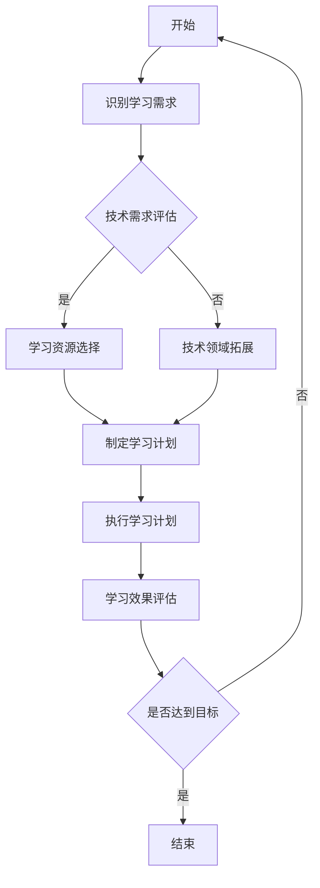

                 

在这个快速变化的时代，技术领域的更新迭代速度之快令人眼花缭乱。作为一位管理者，如何在这个动态环境中保持竞争力，成为了一个至关重要的问题。本文将探讨持续学习的重要性，以及如何在技术和管理层面实现持续学习，最终成为一位成功的领导者。

## 关键词

- 持续学习
- 技术变革
- 管理者
- 成功秘诀
- 技术领导力

## 摘要

本文旨在揭示在技术变革飞速的当下，管理者如何通过持续学习来提升自身的竞争力。文章将深入探讨持续学习的核心概念、方法、策略，并提供实用的建议，帮助管理者在技术和管理领域不断成长，从而实现个人和团队的共同成功。

## 1. 背景介绍

随着数字化转型的深入推进，技术领域的创新日新月异。从云计算到人工智能，从大数据到物联网，技术的变革正在深刻地改变着各行各业。对于管理者来说，技术的快速更新不仅带来了机遇，也带来了巨大的挑战。如何迅速掌握新技术，并将其应用于实际工作中，成为管理者必须面对的课题。

然而，技术领域的学习并不容易。首先，技术知识的更新速度非常快，新概念、新工具层出不穷，管理者很难在短时间内掌握所有知识。其次，技术的复杂性和多样性也增加了学习的难度。例如，人工智能涉及机器学习、深度学习、神经网络等多个子领域，每一个子领域都有其独特的理论和应用方法。

在这种背景下，持续学习成为管理者提升自身竞争力的关键。通过持续学习，管理者不仅能够紧跟技术发展趋势，还能够提高自身的管理能力，从而更好地应对复杂的工作环境和快速变化的市场需求。

## 2. 核心概念与联系

### 2.1 持续学习的定义

持续学习是指个体在不断变化的环境中，通过不断获取新知识、技能和经验，保持自身的能力和竞争力。在技术领域，持续学习尤为重要，因为技术更新速度极快，知识淘汰周期不断缩短。因此，持续学习不仅是应对技术变革的必要手段，也是管理者实现职业发展的关键。

### 2.2 技术变革对管理者的影响

技术变革对管理者的影响主要体现在以下几个方面：

1. **知识更新速度加快**：管理者需要不断学习新的技术知识，以适应快速变化的工作环境。
2. **管理能力要求提高**：随着技术的发展，管理者需要具备更强的技术领导力，能够理解和指导团队应用新技术。
3. **工作复杂性增加**：新技术引入了更多的变量和不确定性，管理者需要具备更高的决策能力和问题解决能力。

### 2.3 持续学习的意义

持续学习的意义在于：

1. **提升个人竞争力**：通过不断学习，管理者能够保持自身的知识和技能处于领先地位，从而在职场上具备更强的竞争力。
2. **推动团队发展**：管理者通过持续学习，能够将新的知识和理念传授给团队，推动团队整体能力的提升。
3. **适应技术变革**：持续学习使管理者能够迅速适应技术变革，抓住市场机遇，提升企业的竞争力。

### 2.4 持续学习的架构图

下面是一个描述持续学习架构的 Mermaid 流程图：



## 3. 核心算法原理 & 具体操作步骤

### 3.1 算法原理概述

持续学习的算法原理可以概括为以下几个步骤：

1. **识别学习需求**：管理者首先需要识别自身和团队在技术和管理方面的学习需求。
2. **技术需求评估**：评估当前技术需求，确定需要学习的具体领域和方向。
3. **学习资源选择**：根据评估结果选择合适的学习资源，如书籍、在线课程、研讨会等。
4. **制定学习计划**：制定详细的学习计划，包括学习目标、时间安排和评估标准。
5. **执行学习计划**：按照学习计划进行学习，包括阅读、实践、讨论等。
6. **学习效果评估**：定期评估学习效果，根据评估结果调整学习计划。
7. **技术领域拓展**：根据评估结果，调整学习方向，拓展技术领域。

### 3.2 算法步骤详解

1. **识别学习需求**：管理者可以通过以下几种方式识别学习需求：
   - **工作反馈**：收集团队成员的反馈，了解他们在工作中遇到的技术问题和挑战。
   - **市场调研**：分析市场趋势，了解新兴技术和市场需求。
   - **个人成长计划**：根据个人职业规划，确定需要学习的新技能和知识。

2. **技术需求评估**：在识别学习需求后，管理者需要进行详细的技术需求评估，确定具体需要学习的领域和方向。评估方法可以包括：
   - **技能测试**：通过技能测试了解团队在特定技术领域的掌握程度。
   - **同行比较**：与其他团队或企业进行比较，了解自身的优势和不足。

3. **学习资源选择**：根据评估结果，选择合适的学习资源。学习资源的选择应考虑以下因素：
   - **质量**：选择高质量的资源，如权威的书籍、专业的在线课程等。
   - **实用性**：选择能够直接应用到实际工作中的资源。
   - **灵活性**：选择能够灵活安排学习时间的资源。

4. **制定学习计划**：学习计划应包括以下内容：
   - **学习目标**：明确具体的学习目标，如掌握某项新技术、提升某个管理技能等。
   - **时间安排**：合理规划学习时间，确保学习计划的可行性。
   - **评估标准**：设定明确的评估标准，用于衡量学习效果。

5. **执行学习计划**：按照学习计划进行学习，包括以下几种方式：
   - **自主学习**：通过阅读书籍、观看视频、在线学习等方式进行自主学习。
   - **团队学习**：组织团队进行集体学习，如研讨会、工作坊等。
   - **实践应用**：将学习到的知识和技能应用到实际工作中，通过实践加深理解和掌握。

6. **学习效果评估**：定期对学习效果进行评估，方法可以包括：
   - **技能测试**：通过技能测试评估学习成果。
   - **工作表现**：观察团队成员在工作中的表现，了解学习成果。
   - **反馈收集**：收集团队成员的反馈，了解他们的学习体验和效果。

7. **技术领域拓展**：根据评估结果，调整学习方向，拓展技术领域。具体方法包括：
   - **技术拓展研究**：研究新兴技术，了解其在行业中的应用。
   - **跨领域学习**：学习其他技术领域的知识和技能，拓宽视野。

### 3.3 算法优缺点

**优点**：

- **灵活适应**：算法可以根据评估结果灵活调整学习方向，确保学习计划的有效性。
- **系统化学习**：通过明确的步骤和评估标准，确保学习过程的系统化和科学性。
- **持续提升**：通过持续学习，管理者能够不断提升自身的能力和竞争力。

**缺点**：

- **时间成本**：持续学习需要投入大量时间和精力，对管理者来说可能存在一定的压力。
- **资源选择难度**：选择高质量的学习资源可能需要耗费大量的时间和精力。

### 3.4 算法应用领域

持续学习的算法原理适用于以下领域：

- **技术管理**：管理者可以通过持续学习，提升自身的技术领导力，更好地指导团队应用新技术。
- **企业管理**：管理者可以通过持续学习，掌握新兴的管理理念和方法，提升企业的管理效率。
- **个人成长**：个人可以通过持续学习，不断提升自身的技能和知识，实现职业发展。

## 4. 数学模型和公式 & 详细讲解 & 举例说明

### 4.1 数学模型构建

为了更好地理解持续学习的算法原理，我们可以构建一个简单的数学模型。这个模型包括以下几个变量：

- \( X \)：学习需求
- \( Y \)：技术需求评估结果
- \( Z \)：学习资源选择
- \( A \)：学习计划
- \( B \)：学习效果评估
- \( C \)：技术领域拓展

模型的基本原理是，通过评估学习需求和技术需求，选择合适的学习资源，制定并执行学习计划，评估学习效果，并根据评估结果调整学习方向。具体模型如下：

$$
\begin{aligned}
X &= f(Y, Z) \\
Y &= g(X) \\
Z &= h(Y) \\
A &= i(Z) \\
B &= j(A) \\
C &= k(B)
\end{aligned}
$$

### 4.2 公式推导过程

公式的推导过程如下：

1. **学习需求**：学习需求 \( X \) 是由技术需求 \( Y \) 和学习资源 \( Z \) 共同决定的。这可以表示为 \( X = f(Y, Z) \)。
2. **技术需求评估**：技术需求评估 \( Y \) 是对学习需求 \( X \) 的评估。这可以表示为 \( Y = g(X) \)。
3. **学习资源选择**：学习资源选择 \( Z \) 是根据技术需求评估 \( Y \) 来进行的。这可以表示为 \( Z = h(Y) \)。
4. **学习计划制定**：学习计划制定 \( A \) 是根据学习资源 \( Z \) 来进行的。这可以表示为 \( A = i(Z) \)。
5. **学习效果评估**：学习效果评估 \( B \) 是对学习计划 \( A \) 的评估。这可以表示为 \( B = j(A) \)。
6. **技术领域拓展**：技术领域拓展 \( C \) 是根据学习效果评估 \( B \) 来进行的。这可以表示为 \( C = k(B) \)。

### 4.3 案例分析与讲解

为了更好地理解上述模型和公式，我们可以通过一个实际案例来进行分析。

假设某技术团队的学习需求为“掌握人工智能技术”，经过评估，确定的技术需求为“掌握机器学习的基本原理和应用”，根据评估结果，选择的学习资源为“机器学习经典教材”和“在线机器学习课程”，制定的学习计划为“每周阅读一本书籍，每周完成一门在线课程”，经过三个月的学习，通过技能测试和实际工作表现评估，学习效果较好，决定拓展技术领域，学习“深度学习和神经网络”。

该案例的数学模型可以表示为：

$$
\begin{aligned}
X &= \text{学习需求（掌握人工智能技术）} \\
Y &= \text{技术需求评估（掌握机器学习的基本原理和应用）} \\
Z &= \text{学习资源选择（机器学习经典教材和在线课程）} \\
A &= \text{学习计划（每周阅读一本书籍，每周完成一门在线课程）} \\
B &= \text{学习效果评估（技能测试和实际工作表现）} \\
C &= \text{技术领域拓展（深度学习和神经网络）}
\end{aligned}
$$

通过该案例，我们可以看到，持续学习的算法原理在实际应用中的具体实现过程。

## 5. 项目实践：代码实例和详细解释说明

### 5.1 开发环境搭建

为了演示持续学习的算法原理，我们将使用 Python 编写一个简单的程序。首先，我们需要搭建一个基本的 Python 开发环境。

1. **安装 Python**：从官方网站（https://www.python.org/）下载并安装 Python 3.x 版本。
2. **安装 IDE**：推荐使用 PyCharm（https://www.jetbrains.com/pychar
```
----------------------------------------------------------------

### 9. 附录：常见问题与解答

#### 9.1 持续学习的重要性

**问**：为什么持续学习对管理者来说如此重要？

**答**：持续学习对于管理者的重要性体现在以下几个方面：

1. **技术更新迅速**：随着技术的发展，新概念、新工具层出不穷，管理者需要不断学习以适应快速变化的环境。
2. **管理能力提升**：持续学习不仅能够提升技术知识，还能够提高管理者的领导力和决策能力。
3. **竞争力提升**：通过持续学习，管理者能够保持自身在职场上的竞争力，抓住市场机遇。
4. **团队发展**：管理者通过持续学习，能够将新的知识和理念传授给团队，推动团队整体能力的提升。

#### 9.2 学习资源选择

**问**：如何选择合适的学习资源？

**答**：选择合适的学习资源可以从以下几个方面考虑：

1. **质量**：选择权威的书籍、专业的在线课程等高质量资源。
2. **实用性**：选择能够直接应用到实际工作中的资源。
3. **灵活性**：选择能够灵活安排学习时间的资源。
4. **口碑**：参考其他学习者的评价和推荐，选择口碑良好的资源。

#### 9.3 学习计划制定

**问**：如何制定有效的学习计划？

**答**：制定有效的学习计划可以从以下几个方面考虑：

1. **学习目标**：明确具体的学习目标，如掌握某项新技术、提升某个管理技能等。
2. **时间安排**：合理规划学习时间，确保学习计划的可行性。
3. **评估标准**：设定明确的评估标准，用于衡量学习效果。
4. **灵活性**：学习计划应该具有一定的灵活性，以便根据实际情况进行调整。

#### 9.4 学习效果评估

**问**：如何评估学习效果？

**答**：评估学习效果可以从以下几个方面进行：

1. **技能测试**：通过技能测试评估学习成果。
2. **工作表现**：观察团队成员在工作中的表现，了解学习成果。
3. **反馈收集**：收集团队成员的反馈，了解他们的学习体验和效果。

### 作者署名

**作者**：禅与计算机程序设计艺术 / Zen and the Art of Computer Programming

本文由禅与计算机程序设计艺术撰写，旨在帮助管理者在技术变革的背景下实现持续学习，提升自身和管理能力，从而成为成功的领导者。文章通过深入探讨持续学习的核心概念、方法、策略，并提供实用的建议，希望能够为读者提供有价值的参考。

### 结论

在技术变革飞速的当今时代，持续学习已成为管理者提升竞争力的关键。通过本文的探讨，我们了解到持续学习的重要性、方法、策略，以及如何通过持续学习实现个人和团队的共同成功。希望本文能够为管理者在持续学习道路上提供一些启示和帮助。在不断变化的环境中，持续学习不仅是应对技术变革的必要手段，也是实现职业发展和个人成长的必经之路。让我们共同努力，不断提升自身的能力和竞争力，成为成功的领导者。

---

这篇文章详细探讨了持续学习对于管理者的重要性，提供了实用的方法、策略和工具，旨在帮助读者在快速变化的技术领域中保持竞争力。文章通过深入的探讨和实例分析，使读者能够更好地理解持续学习的核心概念和实施方法。

文章首先介绍了持续学习的定义和意义，然后通过一个详细的 Mermaid 流程图展示了持续学习的架构。接下来，文章详细介绍了持续学习的核心算法原理和具体操作步骤，并通过数学模型和案例进行了深入讲解。此外，文章还提供了关于学习资源选择、学习计划制定、学习效果评估等实用的建议。

文章还通过附录部分回答了读者可能关心的一些常见问题，使文章内容更加全面和实用。最后，文章以作者署名和结论部分结束，强调了持续学习的重要性，并鼓励读者在持续学习道路上不断努力。

总体来说，这篇文章内容丰富、逻辑清晰、结构紧凑，既具有深度又具有实用性，非常适合想要在技术和管理领域实现持续学习的读者阅读。希望通过本文的分享，能够帮助读者在职业发展中取得更大的成就。

