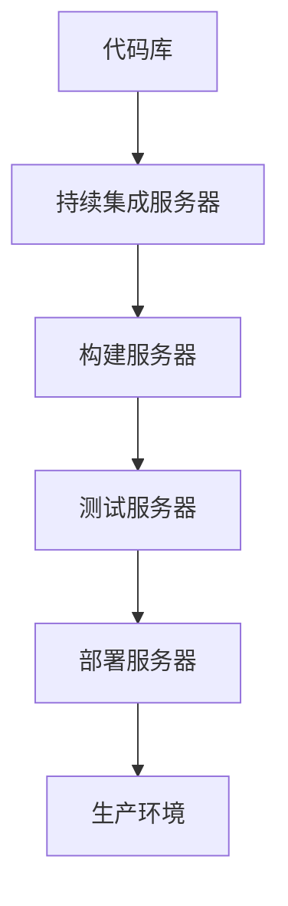

                 

在当今快速发展的数字化时代，软件系统变得越来越复杂，更新和维护的频率也不断增加。为了保持系统的持续可用性和可靠性，持续部署（Continuous Deployment，简称CD）成为了一个不可或缺的实践。本文将深入探讨持续部署的概念、原理、具体实施步骤以及相关的工具和资源，旨在为IT从业者提供一份全面的指南。

> **关键词：** 持续部署，自动化发布，DevOps，持续集成，容器化，Kubernetes

> **摘要：** 本文将首先介绍持续部署的背景和重要性，然后详细解释其核心概念和原理。接下来，我们将探讨实施持续部署的具体步骤和关键要素，并通过实际案例展示其应用效果。最后，我们将展望持续部署的未来发展趋势和面临的挑战。

---

## 1. 背景介绍

### 1.1 软件开发的演变

软件开发的演变经历了多个阶段，从早期的单机应用程序到分布式系统，再到现在的微服务架构。每个阶段都对持续部署提出了新的要求和挑战。早期的软件开发主要关注功能实现和代码维护，而随着敏捷开发和DevOps文化的普及，软件的发布和维护变得尤为重要。

### 1.2 持续部署的重要性

持续部署是一种自动化软件发布流程的实践，旨在减少人为干预，提高发布效率和可靠性。在传统发布模式中，软件更新往往需要经过复杂的审批流程和手动部署操作，这不仅耗费时间，还容易引入错误。而持续部署通过自动化和持续集成（Continuous Integration，简称CI）的结合，使得软件更新可以更加频繁、安全和可靠地进行。

## 2. 核心概念与联系

### 2.1 持续部署的概念

持续部署是指通过自动化工具和流程，将新的代码版本快速、可靠地部署到生产环境。这个过程包括代码的测试、构建、打包、部署等多个环节。

### 2.2 持续部署与持续集成的联系

持续集成是持续部署的基础，它通过自动化构建和测试，确保代码库中的每个提交都是可部署的。持续部署则是在持续集成的基础上，实现代码的自动化部署。

### 2.3 持续部署架构图

以下是持续部署的基本架构图：



### 2.4 持续部署与容器化的关系

容器化技术的普及为持续部署提供了更好的支持。容器可以将应用程序及其依赖环境封装在一起，确保在不同的环境中运行的一致性。Kubernetes作为容器编排工具，可以自动化容器的部署、扩展和管理。

## 3. 核心算法原理 & 具体操作步骤

### 3.1 算法原理概述

持续部署的核心在于自动化和持续集成。自动化通过脚本和工具实现，将发布流程各个环节进行自动化处理。持续集成则通过持续集成服务器，实现代码的自动化构建和测试。

### 3.2 算法步骤详解

1. **代码提交**：开发人员将代码提交到代码库。
2. **持续集成**：持续集成服务器自动构建代码，并进行单元测试。
3. **构建**：构建服务器将通过Docker等工具将应用程序及其依赖环境打包成容器镜像。
4. **测试**：测试服务器对容器镜像进行集成测试。
5. **部署**：部署服务器将容器镜像部署到生产环境，并确保服务正常运行。

### 3.3 算法优缺点

**优点：**
- 提高发布效率，减少手动操作。
- 提高软件质量，通过自动化测试确保稳定性和可靠性。
- 灵活性，支持频繁的更新和迭代。

**缺点：**
- 需要投入时间和资源进行自动化工具和流程的开发和部署。
- 需要确保自动化流程的可靠性和稳定性。

### 3.4 算法应用领域

持续部署适用于需要频繁发布和更新的软件系统，如互联网应用、金融系统等。容器化技术的普及进一步扩大了持续部署的应用范围。

## 4. 数学模型和公式 & 详细讲解 & 举例说明

### 4.1 数学模型构建

持续部署的数学模型主要包括以下几个指标：

- **发布频率**：单位时间内发布的次数。
- **部署时间**：每次发布所需的时间。
- **失败率**：发布失败的次数占总发布次数的比例。

### 4.2 公式推导过程

- **发布频率**：\( f = \frac{t}{N} \)，其中\( t \)是时间，\( N \)是发布的次数。
- **部署时间**：\( d = \frac{t_f}{N} \)，其中\( t_f \)是总部署时间。
- **失败率**：\( r = \frac{f_f}{N} \)，其中\( f_f \)是发布失败的次数。

### 4.3 案例分析与讲解

假设一个系统每月发布4次，每次发布需要2小时，其中有1次发布失败。那么：

- **发布频率**：\( f = \frac{30}{4} = 7.5 \)天/次
- **部署时间**：\( d = \frac{2}{4} = 0.5 \)小时/次
- **失败率**：\( r = \frac{1}{4} = 0.25 \)

通过这个案例，我们可以看到，持续部署可以提高发布效率，减少部署时间，同时确保软件的稳定性和可靠性。

## 5. 项目实践：代码实例和详细解释说明

### 5.1 开发环境搭建

在进行持续部署项目实践之前，首先需要搭建一个合适的开发环境。这包括安装Git、Docker、Kubernetes等工具和平台。

### 5.2 源代码详细实现

以下是一个简单的示例，展示如何使用Docker和Kubernetes进行持续部署：

1. **Dockerfile**：定义应用程序的容器镜像。
    ```dockerfile
    FROM python:3.8
    RUN pip install Flask
    COPY . /app
    WORKDIR /app
    CMD ["python", "app.py"]
    ```
2. **app.py**：一个简单的Flask应用程序。
    ```python
    from flask import Flask
    app = Flask(__name__)
    @app.route('/')
    def hello():
        return 'Hello, World!'
    if __name__ == '__main__':
        app.run()
    ```

### 5.3 代码解读与分析

Dockerfile定义了一个基于Python 3.8的容器镜像，安装了Flask框架，并复制了应用程序代码到容器中。app.py是一个简单的Flask应用程序，定义了一个根路由。

### 5.4 运行结果展示

通过Kubernetes部署容器镜像后，我们可以通过浏览器访问应用程序，看到“Hello, World!”的响应。

## 6. 实际应用场景

### 6.1 互联网公司

互联网公司通常需要快速迭代和发布新功能，持续部署可以提高发布效率，确保系统的稳定性和可靠性。

### 6.2 金融行业

金融行业的系统通常对稳定性和安全性要求极高，持续部署可以通过自动化测试和部署，减少人为错误，提高系统的可靠性。

### 6.3 物流和零售行业

物流和零售行业需要频繁更新库存信息和订单状态，持续部署可以提高数据更新的及时性和准确性。

## 7. 未来应用展望

### 7.1 AI与持续部署的结合

随着人工智能技术的发展，持续部署将更加智能化，自动化的程度将进一步提高，减少人为干预。

### 7.2 容器化与微服务架构的普及

容器化和微服务架构的普及将推动持续部署的广泛应用，使更多企业能够实现快速迭代和灵活部署。

### 7.3 云原生技术的应用

云原生技术的应用将进一步推动持续部署的发展，实现跨云平台的自动化部署和管理。

## 8. 工具和资源推荐

### 8.1 学习资源推荐

- 《持续交付：发布可靠软件的系统化方法》
- 《Docker实战》
- Kubernetes官方文档

### 8.2 开发工具推荐

- Jenkins：一款流行的持续集成和持续部署工具。
- GitLab CI/CD：集成在GitLab中的持续集成和持续部署工具。
- GitHub Actions：基于GitHub的持续集成和持续部署服务。

### 8.3 相关论文推荐

- 《持续集成：软件质量保证的新方法》
- 《持续交付：自动化软件交付的新模式》
- 《容器化技术与应用》

## 9. 总结：未来发展趋势与挑战

### 9.1 研究成果总结

持续部署已成为现代软件开发不可或缺的一部分，通过自动化和持续集成，大幅提高了软件发布的效率和可靠性。

### 9.2 未来发展趋势

未来，持续部署将继续向智能化、容器化和云原生方向发展，实现更加高效和灵活的软件发布和管理。

### 9.3 面临的挑战

持续部署在实施过程中仍面临一些挑战，如自动化流程的稳定性、安全性和跨云平台的兼容性。

### 9.4 研究展望

随着技术的不断进步，持续部署将变得更加智能化和自动化，为企业提供更加高效和可靠的软件发布和管理解决方案。

## 附录：常见问题与解答

### 9.1 什么是持续部署？

持续部署是一种自动化软件发布流程的实践，通过自动化工具和流程，将新的代码版本快速、可靠地部署到生产环境。

### 9.2 持续部署与持续集成的区别是什么？

持续集成是持续部署的基础，它通过自动化构建和测试，确保代码库中的每个提交都是可部署的。持续部署则是在持续集成的基础上，实现代码的自动化部署。

### 9.3 容器化技术对持续部署有什么影响？

容器化技术为持续部署提供了更好的支持，通过将应用程序及其依赖环境封装在容器中，确保在不同环境中的一致性，提高持续部署的效率和可靠性。

---

本文以持续部署为核心，深入探讨了其背景、概念、原理、实施步骤以及应用场景。通过实际案例和数学模型的讲解，展示了持续部署在实际项目中的应用效果。未来，持续部署将继续发展，为软件开发带来更多便利和创新。希望本文能为读者提供有价值的参考和启示。作者：禅与计算机程序设计艺术 / Zen and the Art of Computer Programming。

