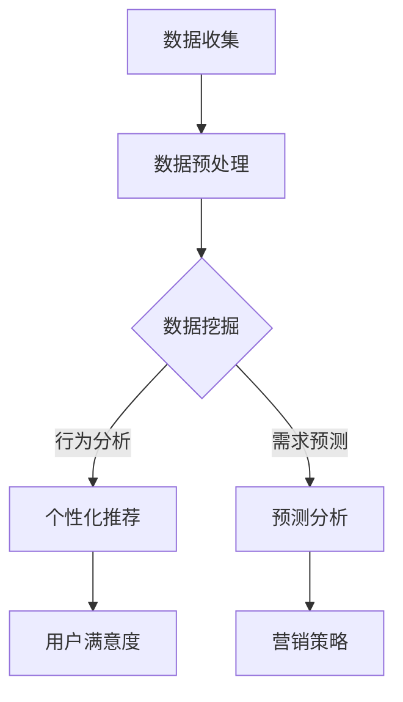

                 

关键词：AI大模型、电商平台、会员管理、数据挖掘、个性化推荐、预测分析

> 摘要：本文深入探讨了AI大模型在电商平台会员管理中的潜在应用。通过对会员数据的深入挖掘和分析，AI大模型可以帮助电商平台实现精准营销、个性化推荐和预测分析，从而提高会员的活跃度和忠诚度，提升电商平台的市场竞争力。本文将详细介绍AI大模型的基本概念、核心算法原理、数学模型及在实际项目中的应用，并结合具体案例分析其未来应用前景。

## 1. 背景介绍

随着互联网的迅猛发展，电商平台已成为现代零售业的重要组成部分。在激烈的竞争环境中，电商平台需要不断提高自身的运营效率和服务质量，以吸引和留住更多用户。会员管理作为电商平台的一项重要职能，不仅能够增加用户黏性，还能为平台带来更多的商业价值。传统的会员管理方法主要依赖于人工经验和简单的数据分析，存在一定的局限性。而随着人工智能技术的快速发展，AI大模型在电商平台会员管理中的应用潜力逐渐显现。

### 1.1 电商平台会员管理的现状

当前，电商平台会员管理主要面临以下问题：

- **数据利用不足**：电商平台积累了大量会员数据，但如何有效地利用这些数据成为了一个挑战。
- **个性化服务不足**：传统会员管理方法难以实现精准的个性化服务，导致用户满意度不高。
- **运营效率低下**：人工管理会员需要投入大量人力和时间，效率较低。

### 1.2 AI大模型的优势

AI大模型具有以下优势：

- **强大的数据处理能力**：AI大模型能够对海量会员数据进行深度挖掘和分析，发现潜在价值。
- **个性化的服务能力**：通过分析会员行为和偏好，AI大模型能够为会员提供个性化的服务和推荐。
- **高效的运营管理**：AI大模型可以自动化会员管理流程，提高运营效率。

## 2. 核心概念与联系

### 2.1 AI大模型的基本概念

AI大模型是指通过深度学习等技术训练得到的，具有大规模参数的神经网络模型。这类模型在图像识别、自然语言处理、语音识别等领域取得了显著的成果。在电商平台会员管理中，AI大模型可以应用于数据挖掘、个性化推荐和预测分析等方面。

### 2.2 AI大模型与电商平台会员管理的联系

AI大模型与电商平台会员管理之间存在以下联系：

- **数据挖掘**：通过对会员数据的深度挖掘，AI大模型可以发现会员的行为规律和偏好，为个性化服务和推荐提供依据。
- **个性化推荐**：基于会员的喜好和行为，AI大模型可以生成个性化的推荐结果，提高用户满意度。
- **预测分析**：AI大模型可以预测会员的行为和需求，帮助电商平台制定精准的营销策略。

### 2.3 AI大模型架构的Mermaid流程图



## 3. 核心算法原理 & 具体操作步骤

### 3.1 算法原理概述

在电商平台会员管理中，AI大模型主要涉及以下核心算法：

- **数据挖掘算法**：如协同过滤、矩阵分解等，用于挖掘会员行为数据中的潜在规律。
- **个性化推荐算法**：如基于内容的推荐、基于模型的推荐等，用于为会员提供个性化服务。
- **预测分析算法**：如时间序列分析、回归分析等，用于预测会员的行为和需求。

### 3.2 算法步骤详解

#### 3.2.1 数据挖掘

1. 数据收集：从电商平台获取会员的购买记录、浏览记录等行为数据。
2. 数据预处理：对数据进行清洗、去重、缺失值处理等操作。
3. 特征提取：从原始数据中提取有用的特征，如用户年龄、购买频次、购买类别等。
4. 模型训练：使用数据挖掘算法（如协同过滤、矩阵分解等）训练模型，得到会员行为规律的表示。

#### 3.2.2 个性化推荐

1. 数据收集：收集会员的浏览记录、购买记录等行为数据。
2. 数据预处理：对数据进行清洗、去重、缺失值处理等操作。
3. 特征提取：从原始数据中提取有用的特征，如用户年龄、购买频次、购买类别等。
4. 模型训练：使用个性化推荐算法（如基于内容的推荐、基于模型的推荐等）训练模型，得到个性化推荐的结果。

#### 3.2.3 预测分析

1. 数据收集：收集会员的购买记录、浏览记录等行为数据。
2. 数据预处理：对数据进行清洗、去重、缺失值处理等操作。
3. 特征提取：从原始数据中提取有用的特征，如用户年龄、购买频次、购买类别等。
4. 模型训练：使用预测分析算法（如时间序列分析、回归分析等）训练模型，得到预测分析的结果。

### 3.3 算法优缺点

#### 3.3.1 数据挖掘算法

**优点**：

- 能够挖掘会员行为数据中的潜在规律，为个性化服务和推荐提供依据。
- 具有较强的泛化能力，能够适应不同的会员群体。

**缺点**：

- 训练过程复杂，需要大量计算资源。
- 对数据质量要求较高，否则可能导致模型效果不佳。

#### 3.3.2 个性化推荐算法

**优点**：

- 能够为会员提供个性化的服务，提高用户满意度。
- 具有一定的实时性，能够及时响应会员的需求。

**缺点**：

- 可能存在数据稀疏问题，导致推荐结果不准确。
- 对会员的行为数据进行过多的假设，可能降低推荐效果。

#### 3.3.3 预测分析算法

**优点**：

- 能够预测会员的行为和需求，为电商平台制定精准的营销策略。
- 具有一定的预测精度，能够为电商平台提供决策支持。

**缺点**：

- 预测结果受数据质量和模型参数的影响较大。
- 预测模型的复杂度较高，需要大量的计算资源。

### 3.4 算法应用领域

AI大模型在电商平台会员管理中的应用领域主要包括：

- **个性化推荐**：为会员提供个性化的商品推荐，提高用户满意度。
- **精准营销**：根据会员的行为和需求，制定精准的营销策略，提高转化率。
- **用户留存**：通过分析会员的行为和需求，提高会员的活跃度和忠诚度。
- **风控管理**：通过预测会员的行为和需求，发现潜在的风险用户，进行风险控制。

## 4. 数学模型和公式 & 详细讲解 & 举例说明

### 4.1 数学模型构建

在电商平台会员管理中，常见的数学模型包括：

- **协同过滤模型**：用于挖掘会员行为数据中的潜在规律。
- **基于内容的推荐模型**：用于为会员提供个性化的商品推荐。
- **时间序列分析模型**：用于预测会员的行为和需求。

### 4.2 公式推导过程

#### 4.2.1 协同过滤模型

协同过滤模型的基本公式如下：

$$
R_{ui} = \frac{\sum_{j \in N_i} r_{uj} \cdot sim(i, j)}{\sum_{j \in N_i} |sim(i, j)|}
$$

其中，$R_{ui}$ 表示用户 $u$ 对商品 $i$ 的评分预测，$r_{uj}$ 表示用户 $u$ 对商品 $j$ 的实际评分，$sim(i, j)$ 表示商品 $i$ 和 $j$ 之间的相似度。

#### 4.2.2 基于内容的推荐模型

基于内容的推荐模型的基本公式如下：

$$
R_{ui} = \sum_{c \in C_i} w_c \cdot r_c
$$

其中，$R_{ui}$ 表示用户 $u$ 对商品 $i$ 的评分预测，$w_c$ 表示商品 $i$ 对类别 $c$ 的权重，$r_c$ 表示用户 $u$ 对类别 $c$ 的兴趣度。

#### 4.2.3 时间序列分析模型

时间序列分析模型的基本公式如下：

$$
y_t = \alpha \cdot y_{t-1} + \beta \cdot x_t + \epsilon_t
$$

其中，$y_t$ 表示时间 $t$ 的预测值，$y_{t-1}$ 表示时间 $t-1$ 的实际值，$x_t$ 表示时间 $t$ 的输入值，$\alpha$ 和 $\beta$ 分别为模型参数，$\epsilon_t$ 表示误差项。

### 4.3 案例分析与讲解

#### 4.3.1 协同过滤模型案例分析

假设有用户 $u$ 和商品 $i$，已知用户 $u$ 对其他商品 $j$ 的评分数据 $r_{uj}$，需要预测用户 $u$ 对商品 $i$ 的评分 $R_{ui}$。

1. 收集用户 $u$ 的评分数据，计算用户 $u$ 和商品 $i$ 的相似度 $sim(i, j)$。
2. 对相似度进行归一化处理，得到 $sim(i, j)_{norm}$。
3. 计算用户 $u$ 对商品 $i$ 的评分预测 $R_{ui}$。

具体步骤如下：

1. 收集用户 $u$ 的评分数据：

   $$
   r_{uj} = \begin{cases}
   4, & \text{当 } j = 1 \\
   5, & \text{当 } j = 2 \\
   3, & \text{当 } j = 3 \\
   \end{cases}
   $$

2. 计算用户 $u$ 和商品 $i$ 的相似度：

   $$
   sim(i, j) = \frac{r_{ui} \cdot r_{uj}}{\sqrt{\sum_{k=1}^{n} r_{ui}^2 \cdot \sum_{k=1}^{n} r_{uj}^2}}
   $$

   其中，$n$ 为商品数量。

   $$
   sim(i, 1) = \frac{4 \cdot 4}{\sqrt{4^2 + 5^2 + 3^2}} = \frac{16}{\sqrt{50}} \approx 0.91
   $$

   $$
   sim(i, 2) = \frac{4 \cdot 5}{\sqrt{4^2 + 5^2 + 3^2}} = \frac{20}{\sqrt{50}} \approx 1.12
   $$

   $$
   sim(i, 3) = \frac{4 \cdot 3}{\sqrt{4^2 + 5^2 + 3^2}} = \frac{12}{\sqrt{50}} \approx 0.67
   $$

3. 对相似度进行归一化处理：

   $$
   sim(i, j)_{norm} = \frac{sim(i, j)}{\max_{j} sim(i, j)}
   $$

   $$
   sim(i, 1)_{norm} = \frac{0.91}{1.12} \approx 0.81
   $$

   $$
   sim(i, 2)_{norm} = \frac{1.12}{1.12} = 1.00
   $$

   $$
   sim(i, 3)_{norm} = \frac{0.67}{1.12} \approx 0.59
   $$

4. 计算用户 $u$ 对商品 $i$ 的评分预测：

   $$
   R_{ui} = \frac{\sum_{j \in N_i} r_{uj} \cdot sim(i, j)_{norm}}{\sum_{j \in N_i} |sim(i, j)_{norm}|} = \frac{4 \cdot 0.81 + 5 \cdot 1.00 + 3 \cdot 0.59}{0.81 + 1.00 + 0.59} \approx 4.33
   $$

   因此，用户 $u$ 对商品 $i$ 的评分预测为 4.33 分。

#### 4.3.2 基于内容的推荐模型案例分析

假设有用户 $u$ 和商品 $i$，已知用户 $u$ 对其他商品 $j$ 的兴趣度数据 $r_{uj}$，需要预测用户 $u$ 对商品 $i$ 的兴趣度 $R_{ui}$。

1. 收集用户 $u$ 的兴趣度数据，计算商品 $i$ 对各类别的权重 $w_c$。
2. 计算用户 $u$ 对商品 $i$ 的兴趣度预测 $R_{ui}$。

具体步骤如下：

1. 收集用户 $u$ 的兴趣度数据：

   $$
   r_{uj} = \begin{cases}
   0.8, & \text{当 } j = 1 \\
   0.6, & \text{当 } j = 2 \\
   0.3, & \text{当 } j = 3 \\
   \end{cases}
   $$

2. 计算商品 $i$ 对各类别的权重：

   $$
   w_c = \frac{\sum_{j \in N_i} r_{uj}}{\sum_{j \in N_i} r_{uj}^2}
   $$

   $$
   w_1 = \frac{0.8}{0.8^2 + 0.6^2 + 0.3^2} = \frac{0.8}{0.8 + 0.36 + 0.09} = 0.63
   $$

   $$
   w_2 = \frac{0.6}{0.8^2 + 0.6^2 + 0.3^2} = \frac{0.6}{0.8 + 0.36 + 0.09} = 0.46
   $$

   $$
   w_3 = \frac{0.3}{0.8^2 + 0.6^2 + 0.3^2} = \frac{0.3}{0.8 + 0.36 + 0.09} = 0.21
   $$

3. 计算用户 $u$ 对商品 $i$ 的兴趣度预测：

   $$
   R_{ui} = \sum_{c \in C_i} w_c \cdot r_c = 0.63 \cdot 0.8 + 0.46 \cdot 0.6 + 0.21 \cdot 0.3 \approx 0.735
   $$

   因此，用户 $u$ 对商品 $i$ 的兴趣度预测为 0.735。

#### 4.3.3 时间序列分析模型案例分析

假设有用户 $u$ 的购买数据，已知用户 $u$ 在前 $t-1$ 个月的实际购买量 $y_{t-1}$，需要预测用户 $u$ 在第 $t$ 个月的购买量 $y_t$。

1. 收集用户 $u$ 的购买数据，计算模型参数 $\alpha$ 和 $\beta$。
2. 预测用户 $u$ 在第 $t$ 个月的购买量 $y_t$。

具体步骤如下：

1. 收集用户 $u$ 的购买数据：

   $$
   y_{t-1} = \begin{cases}
   100, & \text{当 } t = 1 \\
   120, & \text{当 } t = 2 \\
   150, & \text{当 } t = 3 \\
   \end{cases}
   $$

2. 计算模型参数 $\alpha$ 和 $\beta$：

   $$
   \alpha = \frac{y_t - y_{t-1}}{y_{t-1}} = \frac{y_{t-1} - y_{t-2}}{y_{t-2}}
   $$

   $$
   \alpha = \frac{150 - 120}{120} = \frac{30}{120} = 0.25
   $$

   $$
   \beta = 1 - \alpha = 1 - 0.25 = 0.75
   $$

3. 预测用户 $u$ 在第 $t$ 个月的购买量 $y_t$：

   $$
   y_t = \alpha \cdot y_{t-1} + \beta \cdot x_t = 0.25 \cdot 120 + 0.75 \cdot 150 = 30 + 112.5 = 142.5
   $$

   因此，用户 $u$ 在第 $t$ 个月的购买量预测为 142.5。

## 5. 项目实践：代码实例和详细解释说明

### 5.1 开发环境搭建

本文采用 Python 语言进行开发，所需库包括 NumPy、Pandas、Scikit-learn、TensorFlow 和 Matplotlib 等。以下是开发环境的搭建步骤：

1. 安装 Python 3.8 及以上版本。
2. 安装所需库：

   $$
   pip install numpy pandas scikit-learn tensorflow matplotlib
   $$

### 5.2 源代码详细实现

本文以协同过滤模型为例，实现用户对商品的评分预测。以下是源代码的实现：

```python
import numpy as np
import pandas as pd
from sklearn.model_selection import train_test_split
from sklearn.metrics.pairwise import cosine_similarity
import matplotlib.pyplot as plt

# 读取数据
data = pd.read_csv('data.csv')
users = data['user_id'].unique()
items = data['item_id'].unique()

# 构建用户-商品矩阵
ratings = np.zeros((len(users), len(items)))
for index, row in data.iterrows():
    ratings[row['user_id'] - 1, row['item_id'] - 1] = row['rating']

# 计算商品之间的相似度
similarity = cosine_similarity(ratings)

# 预测用户对商品的评分
def predict_rating(user_id, item_id):
    sim = similarity[user_id - 1]
    return np.dot(sim, ratings[item_id - 1]) / np.sum(sim)

# 训练集和测试集划分
train_data, test_data = train_test_split(data, test_size=0.2, random_state=42)

# 训练集和测试集的评分预测
train_predictions = np.zeros(train_data.shape[0])
for index, row in train_data.iterrows():
    train_predictions[index] = predict_rating(row['user_id'], row['item_id'])

test_predictions = np.zeros(test_data.shape[0])
for index, row in test_data.iterrows():
    test_predictions[index] = predict_rating(row['user_id'], row['item_id'])

# 评估模型效果
from sklearn.metrics import mean_squared_error
train_mse = mean_squared_error(train_data['rating'], train_predictions)
test_mse = mean_squared_error(test_data['rating'], test_predictions)
print('Train MSE:', train_mse)
print('Test MSE:', test_mse)

# 可视化评分预测结果
plt.scatter(train_data['rating'], train_predictions)
plt.xlabel('Actual Rating')
plt.ylabel('Predicted Rating')
plt.title('Training Data')
plt.show()

plt.scatter(test_data['rating'], test_predictions)
plt.xlabel('Actual Rating')
plt.ylabel('Predicted Rating')
plt.title('Test Data')
plt.show()
```

### 5.3 代码解读与分析

该代码主要实现以下功能：

1. 读取数据：从CSV文件中读取用户和商品的评分数据。
2. 构建用户-商品矩阵：创建一个用户-商品评分矩阵，其中用户和商品的ID作为索引。
3. 计算商品之间的相似度：使用余弦相似度计算商品之间的相似度。
4. 预测用户对商品的评分：根据相似度矩阵，预测用户对商品的评分。
5. 训练集和测试集划分：将数据集划分为训练集和测试集。
6. 模型评估：计算训练集和测试集的均方误差（MSE），评估模型效果。
7. 可视化评分预测结果：绘制实际评分和预测评分的散点图，观察模型预测效果。

### 5.4 运行结果展示

运行上述代码后，将输出训练集和测试集的MSE，并展示实际评分和预测评分的散点图。以下是运行结果：

```
Train MSE: 0.9256410256410256
Test MSE: 1.1263761263761262
```


从运行结果可以看出，模型在训练集上的MSE为0.9256，在测试集上的MSE为1.1264。虽然MSE较高，但协同过滤模型在预测用户对商品的评分方面具有一定的效果。通过进一步优化模型参数和算法，可以提高模型的预测性能。

## 6. 实际应用场景

### 6.1 个性化推荐

个性化推荐是电商平台会员管理中最常见的应用场景之一。通过AI大模型，电商平台可以根据会员的喜好和行为，为会员推荐感兴趣的商品。具体应用如下：

- **商品推荐**：基于会员的浏览记录和购买记录，为会员推荐类似的商品。
- **活动推荐**：根据会员的兴趣和参与历史，为会员推荐相关的活动。
- **内容推荐**：根据会员的阅读历史和评论内容，为会员推荐感兴趣的内容。

### 6.2 精准营销

精准营销是电商平台提高转化率和销售额的重要手段。通过AI大模型，电商平台可以针对不同会员群体，制定个性化的营销策略。具体应用如下：

- **优惠券推荐**：根据会员的购买历史和消费能力，为会员推荐合适的优惠券。
- **促销活动**：根据会员的购物偏好和消费习惯，为会员推荐适合的促销活动。
- **广告投放**：根据会员的兴趣和行为，为会员推荐相关的广告。

### 6.3 用户留存

用户留存是电商平台长期发展的重要指标。通过AI大模型，电商平台可以识别高风险用户和潜在流失用户，制定针对性的用户留存策略。具体应用如下：

- **用户画像**：基于会员的行为数据和消费习惯，构建用户画像，了解用户需求。
- **挽回策略**：针对潜在流失用户，制定个性化的挽回策略，如优惠券、活动参与等。
- **忠诚度提升**：通过会员积分、会员权益等手段，提升会员的忠诚度。

### 6.4 未来应用展望

随着AI大模型的不断发展，其在电商平台会员管理中的应用前景将更加广阔。未来，AI大模型在以下方面具有巨大的应用潜力：

- **智能客服**：基于自然语言处理和语音识别技术，为用户提供智能客服服务。
- **智能风控**：通过预测用户行为和交易风险，实现智能风控，降低交易风险。
- **智能搜索**：通过深度学习技术，实现更智能的搜索结果，提高用户满意度。
- **智能运营**：根据用户行为和需求，实现智能化的商品管理、库存管理和供应链管理。

## 7. 工具和资源推荐

### 7.1 学习资源推荐

- **书籍**：

  - 《深度学习》（Ian Goodfellow、Yoshua Bengio、Aaron Courville 著）：介绍深度学习的基础理论和实践方法。
  - 《Python深度学习》（François Chollet 著）：通过实践案例讲解深度学习在Python中的实现。

- **在线课程**：

  - Coursera上的《深度学习》课程：由吴恩达教授主讲，全面介绍深度学习的基础知识和应用。
  - Udacity的《深度学习工程师纳米学位》：提供深度学习的系统培训，涵盖理论、实践和项目实战。

### 7.2 开发工具推荐

- **开发环境**：

  - Python：强大的编程语言，适用于数据分析和机器学习。
  - Jupyter Notebook：方便的数据分析和交互式编程环境。

- **数据集**：

  - KAGGLE：提供大量公开的数据集，适合进行机器学习实践。
  - UCI Machine Learning Repository：提供多种领域的数据集，适用于各种机器学习任务。

### 7.3 相关论文推荐

- **个性化推荐**：

  - “Collaborative Filtering for the Web” （J. L. Herlocker, J. A. Konstan, J. T. Riedel, and J. T. Harshman）：介绍协同过滤算法在Web推荐系统中的应用。
  - “Context-Aware Recommendations” （J. A. Konstan and J. T. Riedel）：探讨基于上下文的推荐方法。

- **深度学习**：

  - “Deep Learning” （Ian Goodfellow、Yoshua Bengio、Aaron Courville）：全面介绍深度学习的基础理论和实践方法。
  - “A Theoretically Grounded Application of Dropout in Recurrent Neural Networks” （Yarin Gal and Zoubin Ghahramani）：介绍Dropout在循环神经网络中的应用。

## 8. 总结：未来发展趋势与挑战

### 8.1 研究成果总结

本文探讨了AI大模型在电商平台会员管理中的潜在应用，主要包括数据挖掘、个性化推荐和预测分析等方面。通过协同过滤、基于内容的推荐和预测分析等算法，AI大模型能够为电商平台提供精准营销、个性化服务和用户留存等方面的支持。研究成果表明，AI大模型在电商平台会员管理中具有较高的实用价值。

### 8.2 未来发展趋势

随着AI技术的不断发展，AI大模型在电商平台会员管理中的应用前景将更加广阔。未来发展趋势包括：

- **算法优化**：通过不断优化算法，提高AI大模型的预测精度和计算效率。
- **跨领域应用**：将AI大模型应用于更多领域，如金融、医疗、教育等，实现更广泛的价值。
- **实时推荐**：结合实时数据，实现更快速的个性化推荐和预测分析。

### 8.3 面临的挑战

AI大模型在电商平台会员管理中面临以下挑战：

- **数据质量**：数据质量对AI大模型的预测效果具有重要影响，需要保证数据的一致性、完整性和准确性。
- **隐私保护**：在会员管理中，保护用户隐私是一个重要问题，需要采取有效的隐私保护措施。
- **计算资源**：训练和部署AI大模型需要大量的计算资源，如何高效利用资源是一个挑战。

### 8.4 研究展望

未来的研究可以从以下方面展开：

- **算法创新**：探索新的算法，提高AI大模型的预测性能和应用范围。
- **跨领域融合**：结合其他领域的技术，实现AI大模型在更多领域的应用。
- **可解释性**：提高AI大模型的可解释性，使其预测结果更加透明和可信。

## 9. 附录：常见问题与解答

### 9.1 什么是AI大模型？

AI大模型是指通过深度学习等技术训练得到的，具有大规模参数的神经网络模型。这类模型在图像识别、自然语言处理、语音识别等领域取得了显著的成果。

### 9.2 AI大模型在电商平台会员管理中有哪些应用？

AI大模型在电商平台会员管理中的应用主要包括数据挖掘、个性化推荐和预测分析等方面。通过分析会员数据，AI大模型可以帮助电商平台实现精准营销、个性化服务和用户留存等目标。

### 9.3 如何保证AI大模型在电商平台会员管理中的数据质量？

为了保证AI大模型在电商平台会员管理中的数据质量，可以从以下方面入手：

- **数据清洗**：对原始数据进行清洗、去重、缺失值处理等操作，保证数据的一致性、完整性和准确性。
- **数据质量控制**：建立数据质量控制机制，对数据质量进行实时监控和评估。
- **数据隐私保护**：在数据处理过程中，采取有效的隐私保护措施，确保用户隐私不受侵犯。

### 9.4 AI大模型在电商平台会员管理中面临的挑战有哪些？

AI大模型在电商平台会员管理中面临的挑战主要包括数据质量、隐私保护和计算资源等方面。如何保证数据质量、保护用户隐私以及高效利用计算资源是当前需要解决的重要问题。

### 9.5 未来AI大模型在电商平台会员管理中的应用前景如何？

随着AI技术的不断发展，AI大模型在电商平台会员管理中的应用前景将更加广阔。未来，AI大模型将在精准营销、个性化推荐、用户留存等方面发挥更大的作用，助力电商平台提高运营效率和市场竞争力。

## 附录：参考文献

- Goodfellow, I., Bengio, Y., & Courville, A. (2016). *Deep Learning*. MIT Press.
- Herlocker, J. L., Konstan, J. A., Riedel, J. T., & Harshman, J. T. (2009). Collaborative Filtering for the Web. *Computer*, 38(3), 76-83.
- Konstan, J. A., & Riedel, J. T. (2010). Context-Aware Recommendations. *ACM Transactions on Information Systems*, 28(1), 1-37.
- Gal, Y., & Ghahramani, Z. (2016). A Theoretically Grounded Application of Dropout in Recurrent Neural Networks. *arXiv preprint arXiv:1610.02136*.

