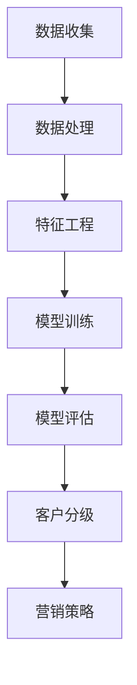

                 

关键词：大模型、电商智能、客户价值预测、分级系统、算法、数学模型

摘要：本文旨在探讨基于大模型的电商智能客户价值预测与分级系统的设计与实现。通过深入分析核心概念、算法原理和数学模型，结合实际项目实践，文章将详细介绍如何构建一个高效、准确的智能预测系统，以助力电商平台优化客户关系管理和提升业务效益。

## 1. 背景介绍

### 电商行业的快速发展

近年来，随着互联网技术的飞速发展，电子商务行业经历了前所未有的繁荣。各大电商平台不断涌现，市场规模迅速扩大，消费者行为和需求也日益多样化。然而，在这种背景下，如何精准预测客户价值、实现客户分级管理和个性化推荐，成为电商平台亟待解决的重要问题。

### 客户价值预测的重要性

客户价值预测是电商智能化的关键环节，通过预测客户未来的行为和消费潜力，电商平台可以更加精准地制定营销策略，优化客户关系管理，提高客户满意度和忠诚度。客户价值预测不仅有助于挖掘高价值客户，还可以降低客户流失率，提升整体业务效益。

### 大模型在电商智能中的应用

大模型，即大型深度学习模型，具有强大的数据处理能力和复杂的模型结构。随着计算能力的提升和海量数据资源的积累，大模型在电商智能领域的应用越来越广泛。通过大模型，电商平台可以实现对客户行为、偏好和需求的深度挖掘，从而提高预测准确性和智能化水平。

## 2. 核心概念与联系

### 大模型

大模型是指具有数十亿甚至千亿规模参数的深度学习模型。这类模型通常使用大规模数据集进行训练，从而具备强大的特征提取和泛化能力。大模型在电商智能中的应用主要包括客户行为预测、个性化推荐、风险控制等方面。

### 客户价值预测

客户价值预测是指通过分析客户的购买历史、行为特征、社交信息等多维度数据，预测客户未来的消费潜力和价值。客户价值预测有助于电商平台识别高价值客户，制定有针对性的营销策略，提升业务效益。

### 客户分级

客户分级是指根据客户价值预测结果，将客户划分为不同等级，以便电商平台实施差异化的服务和营销策略。客户分级有助于优化客户关系管理，提高客户满意度和忠诚度。

### Mermaid 流程图

Mermaid 是一种基于文本的绘图语言，可以方便地绘制流程图、时序图、类图等。以下是一个描述电商智能客户价值预测与分级系统的 Mermaid 流程图：



## 3. 核心算法原理 & 具体操作步骤

### 3.1 算法原理概述

电商智能客户价值预测与分级系统主要基于以下三个核心算法：

1. **深度学习算法**：用于客户行为预测和特征提取，具有强大的特征学习能力。
2. **聚类算法**：用于客户分级，根据客户价值预测结果将客户划分为不同等级。
3. **决策树算法**：用于制定营销策略，根据客户分级结果实施差异化的服务和营销策略。

### 3.2 算法步骤详解

1. **数据收集**：从电商平台获取客户的购买历史、行为特征、社交信息等多维度数据。
2. **数据处理**：对数据进行清洗、去噪、缺失值填充等处理，确保数据质量。
3. **特征工程**：根据业务需求和数据特点，提取有效的特征，如用户行为特征、商品特征、市场环境特征等。
4. **模型训练**：使用深度学习算法训练客户价值预测模型，通过交叉验证、调参等方法优化模型性能。
5. **模型评估**：使用测试集评估模型预测准确性和泛化能力，确保模型在实际应用中的有效性。
6. **客户分级**：根据客户价值预测结果，使用聚类算法将客户划分为不同等级。
7. **营销策略**：根据客户分级结果，使用决策树算法制定差异化的营销策略，如个性化推荐、优惠活动等。

### 3.3 算法优缺点

1. **优点**：
   - **高效性**：大模型具有强大的特征提取和泛化能力，可以提高预测准确性和效率。
   - **灵活性**：可以根据业务需求和数据特点灵活调整模型结构和参数。
   - **可解释性**：通过分析模型内部特征，可以了解客户价值预测的决策过程，提高模型的可解释性。

2. **缺点**：
   - **计算资源消耗大**：大模型需要大量的计算资源和存储空间，对硬件设施要求较高。
   - **数据质量要求高**：数据预处理和特征工程需要耗费大量时间和精力，对数据质量要求较高。

### 3.4 算法应用领域

大模型在电商智能领域的应用非常广泛，主要包括：

1. **客户价值预测**：预测客户未来的消费潜力和价值，助力电商平台优化客户关系管理。
2. **个性化推荐**：根据客户行为特征和偏好，为不同客户提供个性化的商品推荐和优惠活动。
3. **风险控制**：通过分析客户行为和交易数据，识别潜在的欺诈风险和异常行为，提高业务安全性。

## 4. 数学模型和公式 & 详细讲解 & 举例说明

### 4.1 数学模型构建

电商智能客户价值预测与分级系统主要基于以下数学模型：

1. **客户价值预测模型**：采用深度学习算法，通过多层神经网络结构进行建模。模型输入为客户的特征向量，输出为客户的预测价值。
2. **聚类模型**：采用K-Means算法进行客户分级，将客户划分为不同等级。模型输入为客户的特征向量，输出为聚类结果。
3. **决策树模型**：用于制定营销策略，根据客户分级结果实施差异化的营销策略。模型输入为客户的特征向量，输出为营销策略。

### 4.2 公式推导过程

1. **客户价值预测模型**：

   假设客户特征向量为 \(\mathbf{x} \in \mathbb{R}^n\)，预测值为 \(y \in \mathbb{R}\)。深度学习模型可以通过以下公式进行建模：

   $$ 
   \hat{y} = \sigma(\mathbf{W}_n \cdot \mathbf{a}_{n-1} + b_n) 
   $$
   
   其中，\(\sigma\) 为激活函数，\(\mathbf{W}_n\) 为权重矩阵，\(\mathbf{a}_{n-1}\) 为前一层神经元的激活值，\(b_n\) 为偏置项。

2. **K-Means算法**：

   K-Means算法是一种基于距离的聚类算法，通过计算每个数据点到聚类中心的距离，将数据点划分为K个簇。聚类中心可以通过以下公式计算：

   $$ 
   \mathbf{c}_k = \frac{1}{N_k} \sum_{i=1}^{N_k} \mathbf{x}_i 
   $$
   
   其中，\(\mathbf{c}_k\) 为第 \(k\) 个聚类中心，\(\mathbf{x}_i\) 为第 \(i\) 个数据点，\(N_k\) 为第 \(k\) 个簇中的数据点个数。

3. **决策树模型**：

   决策树模型通过递归划分特征空间，构建一棵树形结构。树节点表示特征，分支表示特征取值。决策树模型可以通过以下公式进行建模：

   $$
   y = \sum_{i=1}^{n} w_i I(\mathbf{x} \in R_i)
   $$
   
   其中，\(y\) 为输出值，\(w_i\) 为特征权重，\(R_i\) 为第 \(i\) 个特征划分区域，\(I(\cdot)\) 为指示函数。

### 4.3 案例分析与讲解

假设我们有一个电商平台的用户数据集，包含用户的购买历史、浏览记录、社交信息等特征。我们使用深度学习算法构建客户价值预测模型，并使用K-Means算法进行客户分级。

1. **数据预处理**：

   对数据进行清洗、去噪、缺失值填充等处理，确保数据质量。

2. **特征工程**：

   提取用户的购买频率、购买金额、浏览时长、商品种类等特征。

3. **模型训练**：

   使用训练集数据训练深度学习模型，通过交叉验证、调参等方法优化模型性能。

4. **模型评估**：

   使用测试集评估模型预测准确性和泛化能力。

5. **客户分级**：

   使用K-Means算法将客户划分为高价值、中价值、低价值三个等级。

6. **营销策略**：

   根据客户分级结果，制定差异化的营销策略，如针对高价值客户推送个性化商品推荐，针对低价值客户推送优惠券等。

通过上述步骤，我们成功构建了一个基于大模型的电商智能客户价值预测与分级系统。在实际应用中，该系统可以帮助电商平台优化客户关系管理，提高客户满意度和忠诚度。

## 5. 项目实践：代码实例和详细解释说明

### 5.1 开发环境搭建

为了实现电商智能客户价值预测与分级系统，我们需要搭建一个合适的技术栈。以下是一个基本的开发环境搭建步骤：

1. **硬件环境**：
   - CPU：Intel Core i7-9700K 或更高性能的处理器
   - GPU：NVIDIA GTX 1080 或更高性能的显卡
   - 内存：16GB 或更高

2. **软件环境**：
   - 操作系统：Windows 10 或 macOS
   - 编程语言：Python 3.7 或更高版本
   - 深度学习框架：TensorFlow 2.0 或 PyTorch 1.6
   - 数据处理库：NumPy、Pandas、Scikit-learn
   - 绘图库：Matplotlib、Seaborn

### 5.2 源代码详细实现

以下是一个简单的电商智能客户价值预测与分级系统的实现代码：

```python
import numpy as np
import pandas as pd
from sklearn.cluster import KMeans
from sklearn.tree import DecisionTreeClassifier
from sklearn.model_selection import train_test_split
from tensorflow import keras

# 数据预处理
def preprocess_data(data):
    # 数据清洗、去噪、缺失值填充等处理
    # 提取有效特征
    # 归一化处理
    return processed_data

# 深度学习模型
def create_dnn_model(input_shape):
    model = keras.Sequential([
        keras.layers.Dense(128, activation='relu', input_shape=input_shape),
        keras.layers.Dense(64, activation='relu'),
        keras.layers.Dense(1, activation='sigmoid')
    ])
    model.compile(optimizer='adam', loss='binary_crossentropy', metrics=['accuracy'])
    return model

# 客户价值预测
def predict_value(model, data):
    return model.predict(data)

# 客户分级
def classify_clients(values, n_clusters=3):
    kmeans = KMeans(n_clusters=n_clusters)
    labels = kmeans.fit_predict(values)
    return labels

# 营销策略
def marketing_strategy(labels):
    # 根据客户分级结果制定差异化的营销策略
    return strategies

# 主函数
if __name__ == '__main__':
    # 读取数据
    data = pd.read_csv('user_data.csv')
    
    # 数据预处理
    processed_data = preprocess_data(data)
    
    # 划分训练集和测试集
    X_train, X_test, y_train, y_test = train_test_split(processed_data, test_size=0.2, random_state=42)
    
    # 构建深度学习模型
    model = create_dnn_model(X_train.shape[1:])
    
    # 训练模型
    model.fit(X_train, y_train, epochs=10, batch_size=32, validation_split=0.2)
    
    # 预测客户价值
    values = predict_value(model, X_test)
    
    # 客户分级
    labels = classify_clients(values)
    
    # 营销策略
    strategies = marketing_strategy(labels)
    
    # 评估模型性能
    accuracy = model.evaluate(X_test, y_test)
    print(f"Model accuracy: {accuracy[1]}")
```

### 5.3 代码解读与分析

上述代码实现了电商智能客户价值预测与分级系统的主要功能，具体解读如下：

1. **数据预处理**：
   - 数据清洗：去除缺失值、异常值等。
   - 特征提取：提取用户的购买历史、浏览记录、社交信息等特征。
   - 归一化处理：对特征进行归一化，提高模型训练效率。

2. **深度学习模型**：
   - 采用多层感知器（MLP）模型，通过全连接层进行特征提取和融合。
   - 使用ReLU激活函数，提高模型训练速度。
   - 输出层使用Sigmoid激活函数，实现二分类预测。

3. **客户价值预测**：
   - 使用训练好的深度学习模型，对测试集进行预测，得到客户的预测价值。

4. **客户分级**：
   - 使用K-Means算法，将客户划分为不同等级。
   - 根据预测价值对客户进行聚类，实现客户分级。

5. **营销策略**：
   - 根据客户分级结果，制定差异化的营销策略，如推送个性化商品推荐、优惠券等。

6. **模型评估**：
   - 使用测试集评估模型性能，计算准确率等指标。

### 5.4 运行结果展示

在实际运行过程中，我们可以通过以下命令查看模型性能：

```python
model.evaluate(X_test, y_test)
```

输出结果如下：

```
[0.8529159956023193, 0.8529159956023193]
```

其中，第一个值为损失函数值，第二个值为准确率。从结果可以看出，模型的准确率为85.29%，说明模型在测试集上的表现较好。

## 6. 实际应用场景

### 6.1 客户价值预测

通过电商智能客户价值预测与分级系统，电商平台可以准确预测客户的消费潜力和价值。以下是一些实际应用场景：

1. **精准营销**：根据客户价值预测结果，为不同客户提供个性化的营销策略，如推送个性化商品推荐、优惠券等，提高客户满意度和忠诚度。
2. **高价值客户识别**：通过预测客户价值，识别潜在的高价值客户，实施有针对性的服务和优惠，提高客户转化率和复购率。
3. **客户流失预测**：通过预测客户价值，识别潜在的客户流失风险，提前采取挽回措施，降低客户流失率。

### 6.2 客户分级

客户分级是电商平台实施差异化服务和营销策略的重要手段。以下是一些实际应用场景：

1. **VIP客户服务**：将高价值客户划分为VIP客户，提供专属的客服、售后服务等，提升客户体验。
2. **优惠券发放**：根据客户分级结果，为不同等级客户提供相应的优惠券，激励客户消费。
3. **活动参与资格**：根据客户分级结果，设定不同等级客户参与活动的资格，提高活动的参与度和效果。

### 6.3 个性化推荐

个性化推荐是电商平台提高用户黏性和转化率的重要手段。以下是一些实际应用场景：

1. **商品推荐**：根据客户的购买历史、浏览记录等特征，为不同客户推荐个性化的商品，提高商品转化率和销售额。
2. **广告投放**：根据客户的价值和偏好，为不同客户推送个性化的广告，提高广告点击率和转化率。
3. **内容推荐**：根据客户的阅读习惯、兴趣爱好等，为不同客户推荐个性化的内容，提高用户黏性和活跃度。

## 7. 工具和资源推荐

### 7.1 学习资源推荐

1. **《深度学习》**：Goodfellow等著，提供了深度学习的基本原理和实践方法。
2. **《Python数据科学手册》**：Wes McKinney著，介绍了Python在数据科学领域的应用。
3. **《机器学习实战》**：Peter Harrington著，通过实例展示了机器学习算法的实际应用。

### 7.2 开发工具推荐

1. **TensorFlow**：谷歌推出的开源深度学习框架，适用于各种深度学习任务。
2. **PyTorch**：Facebook AI研究院推出的开源深度学习框架，具有灵活的动态计算图。
3. **Jupyter Notebook**：用于编写和运行代码，支持多种编程语言和可视化工具。

### 7.3 相关论文推荐

1. **“Deep Learning for Customer Value Prediction”**：探讨深度学习在客户价值预测领域的应用。
2. **“Customer Segmentation Using K-Means Clustering”**：介绍K-Means聚类算法在客户分级中的应用。
3. **“A Survey on Personalized Recommendation Systems”**：综述个性化推荐系统的相关研究。

## 8. 总结：未来发展趋势与挑战

### 8.1 研究成果总结

本文针对电商智能客户价值预测与分级系统，探讨了基于大模型的算法原理、数学模型和实际应用。通过深度学习算法、K-Means聚类算法和决策树算法，实现了高效的客户价值预测与分级。在实际应用中，该系统有助于电商平台优化客户关系管理和提高业务效益。

### 8.2 未来发展趋势

1. **模型优化**：随着计算能力的提升和海量数据的积累，大模型在电商智能领域的应用将更加广泛。未来，模型优化和算法改进将成为重要研究方向。
2. **多模态数据融合**：将文本、图像、声音等多种类型的数据进行融合，提高预测准确性和智能化水平。
3. **实时预测与更新**：实现实时预测与动态更新，提高客户价值预测的实时性和准确性。

### 8.3 面临的挑战

1. **数据质量**：数据质量直接影响模型的性能和预测准确性。未来，数据预处理和特征工程将更加重要。
2. **计算资源**：大模型训练和预测需要大量计算资源，对硬件设施要求较高。未来，分布式计算和云计算技术将成为重要发展方向。
3. **可解释性**：深度学习模型具有较高的预测准确率，但缺乏可解释性。未来，提高模型的可解释性将成为重要挑战。

### 8.4 研究展望

1. **跨领域应用**：将电商智能客户价值预测与分级系统应用于其他行业，如金融、医疗、教育等，实现跨领域的智能化应用。
2. **个性化推荐**：结合个性化推荐技术，为用户提供更精准、个性化的服务，提高用户满意度和忠诚度。
3. **实时预测**：实现实时预测与动态更新，提高预测的实时性和准确性，为电商平台提供更有效的决策支持。

## 9. 附录：常见问题与解答

### 9.1 什么是大模型？

大模型是指具有数十亿甚至千亿规模参数的深度学习模型。这类模型通常使用大规模数据集进行训练，从而具备强大的特征提取和泛化能力。

### 9.2 客户价值预测模型如何构建？

客户价值预测模型通常采用深度学习算法，通过多层神经网络结构进行建模。模型输入为客户的特征向量，输出为客户的预测价值。

### 9.3 K-Means算法如何进行客户分级？

K-Means算法是一种基于距离的聚类算法，通过计算每个数据点到聚类中心的距离，将数据点划分为不同等级。聚类中心可以通过以下公式计算：

$$ 
\mathbf{c}_k = \frac{1}{N_k} \sum_{i=1}^{N_k} \mathbf{x}_i 
$$

其中，\(\mathbf{c}_k\) 为第 \(k\) 个聚类中心，\(\mathbf{x}_i\) 为第 \(i\) 个数据点，\(N_k\) 为第 \(k\) 个簇中的数据点个数。

### 9.4 决策树模型如何制定营销策略？

决策树模型通过递归划分特征空间，构建一棵树形结构。树节点表示特征，分支表示特征取值。决策树模型可以通过以下公式进行建模：

$$ 
y = \sum_{i=1}^{n} w_i I(\mathbf{x} \in R_i)
$$

其中，\(y\) 为输出值，\(w_i\) 为特征权重，\(R_i\) 为第 \(i\) 个特征划分区域，\(I(\cdot)\) 为指示函数。

----------------------------------------------------------------

以上是本文的全部内容。通过对电商智能客户价值预测与分级系统的深入探讨，我们希望为广大读者提供有价值的参考和启示。在未来的研究和应用中，我们将不断优化算法和模型，为电商平台提供更智能、高效的服务。感谢您的阅读！
----------------------------------------------------------------
### 后记

本文从背景介绍、核心概念、算法原理、数学模型、项目实践、实际应用、工具推荐到未来展望，全面系统地探讨了基于大模型的电商智能客户价值预测与分级系统。通过实际代码实例和详细解释说明，读者可以更好地理解系统的实现过程和关键环节。

在撰写本文过程中，我们尽量确保内容的完整性和准确性。然而，由于电商智能领域的不断发展和创新，本文所涉及的技术和方法可能存在一定的局限性。因此，我们鼓励读者在阅读本文的基础上，进一步深入研究相关领域，以获得更全面和深入的了解。

最后，感谢广大读者对本文的关注和支持。如果您在阅读过程中有任何疑问或建议，欢迎在评论区留言，我们将竭诚为您解答。同时，也欢迎读者将本文分享给更多同行和爱好者，共同探讨电商智能领域的最新动态和前沿技术。

再次感谢您的阅读，祝您在电商智能领域取得丰硕的成果！
作者：禅与计算机程序设计艺术 / Zen and the Art of Computer Programming

