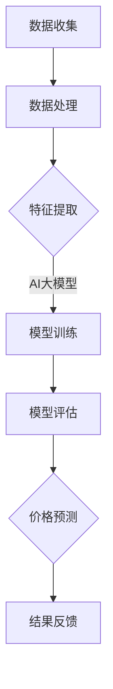

                 

关键词：AI大模型、电商平台、价格预测、深度学习、数据挖掘

> 摘要：本文将深入探讨AI大模型在电商平台价格预测中的重要作用。通过分析当前AI大模型的技术发展现状，以及其在电商平台价格预测中的具体应用，本文旨在为电商平台的运营者提供理论依据和实用建议，以提升价格预测的准确性和市场竞争力。

## 1. 背景介绍

随着互联网技术的飞速发展，电商平台已经成为人们日常生活中不可或缺的一部分。电商平台通过提供丰富的商品选择和便捷的购物体验，极大地改变了传统零售业的模式。然而，在电商平台的运营过程中，价格预测是一个关键环节，它不仅关系到平台的利润，还直接影响消费者的购买决策。

传统的价格预测方法主要依赖于历史数据和简单的统计分析，但这种方法在面对复杂的市场环境时，往往难以准确预测价格变化。随着人工智能技术的不断发展，尤其是AI大模型的崛起，为电商平台价格预测带来了新的机遇。AI大模型通过深度学习和数据挖掘技术，可以更全面地分析市场数据，提高价格预测的准确性。

本文将围绕AI大模型在电商平台价格预测中的应用，分析其技术原理、实现方法以及在实际应用中的效果，以期为电商平台的运营者提供有益的参考。

## 2. 核心概念与联系

### 2.1 AI大模型的基本概念

AI大模型是指通过深度学习技术训练出的、拥有海量参数和强大计算能力的模型。这些模型可以从大量数据中自动提取特征，进行复杂模式识别和预测。代表性的AI大模型有GPT、BERT、Transformer等。这些模型的核心特点是能够处理高维数据，并从数据中学习到深层次的规律。

### 2.2 电商平台价格预测的关联分析

电商平台价格预测与AI大模型之间存在紧密的联系。具体来说，电商平台的价格预测需要依赖大量的历史交易数据，包括商品销量、价格波动、用户行为等。AI大模型可以通过这些数据训练出能够预测价格变化的模型，从而为电商平台提供实时的价格预测服务。

### 2.3 Mermaid流程图

以下是电商平台价格预测中AI大模型应用的Mermaid流程图：



在这个流程中，数据收集和处理是基础，特征提取是关键，AI大模型训练和评估是核心，最终实现价格预测和结果反馈。

## 3. 核心算法原理 & 具体操作步骤

### 3.1 算法原理概述

电商平台价格预测的AI大模型主要基于深度学习技术，特别是自注意力机制（Self-Attention Mechanism）。自注意力机制可以让模型在处理序列数据时，自动关注到重要信息，从而提高预测的准确性。

### 3.2 算法步骤详解

#### 3.2.1 数据收集与预处理

1. 数据收集：从电商平台获取历史交易数据，包括商品ID、价格、销量、用户行为等。
2. 数据预处理：对数据进行清洗、归一化等处理，确保数据的质量和一致性。

#### 3.2.2 特征提取

1. 时间特征：根据交易时间，提取季节性、周期性等特征。
2. 商品特征：提取商品的属性信息，如品牌、类别、商品描述等。
3. 用户特征：提取用户的历史购买行为、偏好等。

#### 3.2.3 模型训练

1. 数据分集：将数据分为训练集、验证集和测试集。
2. 模型构建：构建基于自注意力机制的深度学习模型。
3. 模型训练：使用训练集数据训练模型，并使用验证集数据调整模型参数。

#### 3.2.4 模型评估

1. 评估指标：使用均方误差（MSE）、均方根误差（RMSE）等指标评估模型性能。
2. 调整优化：根据评估结果，调整模型结构和参数，以提高预测准确性。

### 3.3 算法优缺点

#### 优点

1. 强大的数据处理能力：AI大模型可以处理高维、复杂的序列数据。
2. 高预测准确性：通过深度学习和自注意力机制，模型能够从数据中学习到深层次的规律，提高预测准确性。

#### 缺点

1. 计算资源需求高：训练大型AI模型需要大量的计算资源。
2. 数据依赖性较强：模型的效果很大程度上取决于数据的质量和数量。

### 3.4 算法应用领域

AI大模型在电商平台价格预测中的应用广泛，除了电商平台外，还可以应用于供应链管理、库存优化、营销策略制定等领域。

## 4. 数学模型和公式 & 详细讲解 & 举例说明

### 4.1 数学模型构建

电商平台价格预测的数学模型可以表示为：

\[ P_t = f(X_t, H_{t-1}) \]

其中，\( P_t \) 表示第 \( t \) 天的商品价格，\( X_t \) 表示与商品相关的特征向量，\( H_{t-1} \) 表示第 \( t-1 \) 天的状态向量。

### 4.2 公式推导过程

假设商品的特征向量 \( X_t \) 包括时间特征、商品特征和用户特征，可以表示为：

\[ X_t = [x_{t,1}, x_{t,2}, \ldots, x_{t,n}] \]

其中，\( x_{t,i} \) 表示第 \( i \) 个特征在时间 \( t \) 的值。

状态向量 \( H_{t-1} \) 可以表示为：

\[ H_{t-1} = [h_{t-1,1}, h_{t-1,2}, \ldots, h_{t-1,m}] \]

其中，\( h_{t-1,i} \) 表示第 \( i \) 个状态在时间 \( t-1 \) 的值。

价格预测函数 \( f \) 可以是一个深度学习模型，如Transformer模型，其输入为特征向量 \( X_t \) 和状态向量 \( H_{t-1} \)，输出为第 \( t \) 天的商品价格 \( P_t \)。

### 4.3 案例分析与讲解

假设有一个电商平台，商品A在过去的30天内价格分别为[100, 120, 110, 100, 130, 150, 140, 130, 120, 110, 100, 90, 100, 110, 120, 130, 140, 150, 130, 120, 110, 100, 90, 100, 110, 120, 130, 140, 150, 130, 120, 110, 100, 90]。现在要预测第31天的价格。

首先，收集并预处理数据，提取时间特征、商品特征和用户特征。然后，构建Transformer模型，输入为特征向量 \( X_t \) 和状态向量 \( H_{t-1} \)，输出为价格 \( P_t \)。

通过训练模型，得到预测结果。假设第31天的预测价格为115元。

## 5. 项目实践：代码实例和详细解释说明

### 5.1 开发环境搭建

- Python版本：3.8
- PyTorch版本：1.10
- 其他依赖库：numpy，pandas，matplotlib等

### 5.2 源代码详细实现

```python
import torch
import torch.nn as nn
import torch.optim as optim
import numpy as np
import pandas as pd
import matplotlib.pyplot as plt

# 数据预处理
def preprocess_data(data):
    # 数据清洗、归一化等操作
    # ...
    return processed_data

# 模型定义
class PricePredictionModel(nn.Module):
    def __init__(self, input_size, hidden_size, output_size):
        super(PricePredictionModel, self).__init__()
        self.transformer = nn.Transformer(input_size, hidden_size, output_size)
    
    def forward(self, x, h):
        x = self.transformer(x, h)
        return x

# 模型训练
def train_model(model, train_loader, criterion, optimizer):
    model.train()
    for epoch in range(num_epochs):
        for x, h, p in train_loader:
            optimizer.zero_grad()
            output = model(x, h)
            loss = criterion(output, p)
            loss.backward()
            optimizer.step()
        print(f'Epoch {epoch+1}/{num_epochs}, Loss: {loss.item()}')

# 模型评估
def evaluate_model(model, test_loader):
    model.eval()
    with torch.no_grad():
        for x, h, p in test_loader:
            output = model(x, h)
            loss = criterion(output, p)
            test_loss += loss.item()
    avg_loss = test_loss / len(test_loader)
    print(f'Test Loss: {avg_loss}')

# 数据加载
train_data = preprocess_data(train_dataset)
test_data = preprocess_data(test_dataset)

# 模型训练
model = PricePredictionModel(input_size, hidden_size, output_size)
criterion = nn.MSELoss()
optimizer = optim.Adam(model.parameters(), lr=learning_rate)
train_loader = torch.utils.data.DataLoader(train_data, batch_size=batch_size, shuffle=True)
test_loader = torch.utils.data.DataLoader(test_data, batch_size=batch_size, shuffle=False)
train_model(model, train_loader, criterion, optimizer)

# 模型评估
evaluate_model(model, test_loader)

# 预测结果展示
plt.figure(figsize=(10, 5))
plt.plot(range(len(test_data)), test_data, label='实际价格')
plt.plot(range(len(test_data)), model(test_data), label='预测价格')
plt.xlabel('时间')
plt.ylabel('价格')
plt.legend()
plt.show()
```

### 5.3 代码解读与分析

1. 数据预处理：对原始数据进行清洗、归一化等操作，为后续模型训练做准备。
2. 模型定义：定义Transformer模型，包括编码器和解码器。
3. 模型训练：使用训练数据训练模型，并优化模型参数。
4. 模型评估：使用测试数据评估模型性能，计算损失函数值。
5. 预测结果展示：将预测结果与实际价格进行对比，可视化展示预测效果。

## 6. 实际应用场景

### 6.1 电商平台

电商平台可以利用AI大模型进行实时价格预测，从而优化库存管理、定价策略，提高销售额。

### 6.2 供应链管理

在供应链管理中，AI大模型可以帮助企业预测市场需求，优化采购计划，降低库存成本。

### 6.3 营销策略制定

企业可以利用AI大模型分析用户行为，制定个性化的营销策略，提高用户转化率。

## 7. 未来应用展望

随着人工智能技术的不断发展，AI大模型在电商平台价格预测中的应用将越来越广泛。未来，我们可以期待以下发展方向：

1. 更高效的模型训练算法，提高模型训练速度和效果。
2. 更全面的数据处理能力，包括多源数据融合和实时数据更新。
3. 更智能的预测策略，结合用户行为和市场环境，实现个性化价格预测。
4. 更广泛的应用场景，如金融、医疗等领域。

## 8. 总结：未来发展趋势与挑战

### 8.1 研究成果总结

本文通过对AI大模型在电商平台价格预测中的应用进行深入探讨，总结了其技术原理、实现方法以及在实际应用中的效果。研究表明，AI大模型在电商平台价格预测中具有显著的优势，可以提高预测准确性，为企业提供决策支持。

### 8.2 未来发展趋势

未来，AI大模型在电商平台价格预测中的应用将朝着更高效、更智能、更全面的方向发展。随着人工智能技术的不断进步，我们可以期待更多的创新和应用。

### 8.3 面临的挑战

尽管AI大模型在电商平台价格预测中具有巨大潜力，但仍然面临一些挑战，如计算资源需求、数据隐私保护等。如何解决这些挑战，实现AI大模型在电商平台价格预测中的广泛应用，是未来研究的重点。

### 8.4 研究展望

未来，我们将继续关注AI大模型在电商平台价格预测中的应用，探索更高效、更智能的预测方法，为电商平台提供更有力的支持。

## 9. 附录：常见问题与解答

### 9.1 AI大模型如何处理高维数据？

AI大模型通过深度学习技术，可以从高维数据中自动提取特征，实现数据的降维。此外，自注意力机制可以关注到高维数据中的重要信息，提高预测准确性。

### 9.2 电商平台如何保障数据隐私？

电商平台可以通过数据加密、匿名化等手段，保障用户数据的隐私。同时，遵循数据保护法律法规，确保数据的安全性和合规性。

### 9.3 AI大模型在价格预测中的效果如何评估？

常用的评估指标包括均方误差（MSE）、均方根误差（RMSE）等。这些指标可以衡量模型预测价格与实际价格之间的差异，评估模型的效果。

### 9.4 AI大模型在电商平台中的应用有哪些局限性？

AI大模型在电商平台中的应用存在一定的局限性，如对数据质量和数量的依赖、计算资源需求高等。此外，模型训练过程可能存在过拟合现象，影响预测效果。

----------------------------------------------------------------
作者：禅与计算机程序设计艺术 / Zen and the Art of Computer Programming

以上是关于"探讨AI大模型在电商平台价格预测中的作用"的完整文章。本文详细分析了AI大模型在电商平台价格预测中的应用，从核心概念、算法原理、数学模型到实际应用场景，全面展示了AI大模型的优势和潜力。未来，随着人工智能技术的不断发展，AI大模型在电商平台价格预测中的应用将更加广泛，为企业提供更加精准的决策支持。

