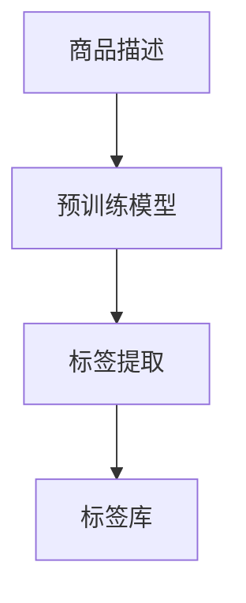

                 

关键词：大模型，电商平台，商品标签，自动生成，深度学习，人工智能

摘要：本文探讨了大规模预训练模型在电商平台商品标签自动生成中的应用。首先，介绍了电商平台商品标签的重要性和现有标签生成方法的局限性。接着，详细阐述了大规模预训练模型的工作原理及其在商品标签自动生成中的优势。随后，通过具体案例分析了大规模预训练模型在实际应用中的效果和挑战，并展望了未来发展方向。

## 1. 背景介绍

在电商平台上，商品标签（Tags）是用户浏览、搜索和发现商品的重要依据。一个良好的商品标签系统可以提高用户满意度，增强用户体验，进而提升电商平台的竞争力。然而，现有的商品标签生成方法存在诸多局限性。

传统的标签生成方法主要依赖于人工定义规则，这种方式不仅费时费力，而且难以覆盖所有可能的标签。此外，人工规则难以适应不断变化的用户需求和市场环境。为了解决这个问题，近年来，人工智能特别是深度学习技术开始被应用于商品标签自动生成。

### 1.1 人工智能在商品标签生成中的应用

深度学习通过模仿人类大脑的神经网络结构，实现了对大量数据的自动学习和分类。在商品标签生成中，深度学习模型可以从海量商品数据中学习出有效的标签特征，并能够根据新的商品数据自动生成标签。

大规模预训练模型（如GPT、BERT等）的出现，进一步提升了商品标签自动生成的效果。这些模型通过在互联网上大规模预训练，积累了丰富的语言知识和上下文理解能力，使得它们在处理自然语言任务时表现出色。

## 2. 核心概念与联系

在探讨大模型在商品标签自动生成中的作用之前，我们需要了解以下几个核心概念：

### 2.1 大规模预训练模型

大规模预训练模型是指通过在大量数据上进行预训练，从而获得强大语言理解能力的深度学习模型。常见的预训练模型包括GPT、BERT、RoBERTa等。

### 2.2 自然语言处理（NLP）

自然语言处理是人工智能领域的一个重要分支，旨在使计算机能够理解、生成和处理自然语言。NLP技术广泛应用于信息检索、文本分类、机器翻译等领域。

### 2.3 商品标签生成

商品标签生成是指利用机器学习算法自动从商品描述中提取出相应的标签，以便用户更好地理解和搜索商品。

### 2.4 Mermaid 流程图

Mermaid是一种基于Markdown的绘图工具，可以用于绘制流程图、序列图等。以下是一个简单的商品标签自动生成的Mermaid流程图：



在这个流程图中，商品描述经过预训练模型处理后，生成相应的标签，并将这些标签存储到标签库中，以便后续使用。

## 3. 核心算法原理 & 具体操作步骤

### 3.1 算法原理概述

大规模预训练模型在商品标签自动生成中的应用，主要基于其强大的语言理解和生成能力。具体来说，预训练模型通过以下两个步骤实现商品标签的自动生成：

1. **预训练阶段**：模型在互联网上大规模预训练，学习到丰富的语言知识和上下文理解能力。这一阶段主要包括两个任务：masked language modeling（MLM）和next sentence prediction（NSP）。

2. **微调阶段**：在预训练的基础上，模型利用电商平台的商品描述数据进行微调，以适应特定的商品标签生成任务。微调过程通常包括两个步骤：数据预处理和模型训练。

### 3.2 算法步骤详解

1. **数据预处理**：首先，从电商平台上收集大量商品描述数据，并对这些数据进行预处理，包括去除无效信息、统一文本格式等。然后，将预处理后的数据输入到预训练模型中，进行预训练。

2. **模型训练**：在预训练模型的基础上，利用电商平台的商品描述数据进行微调。微调过程中，模型需要学习如何从商品描述中提取出有效的标签。为了实现这一目标，可以使用以下两种方法：

   - **基于损失函数的微调**：在微调过程中，使用标签预测损失函数（如交叉熵损失函数）来衡量模型预测标签的准确性。通过优化这个损失函数，模型可以不断改进标签提取能力。
   - **基于任务导向的微调**：在微调过程中，结合特定的任务导向信息（如商品类别、品牌等），进一步引导模型学习如何提取出与任务相关的标签。

3. **标签生成**：在模型训练完成后，利用模型对新的商品描述进行标签生成。具体来说，将商品描述输入到预训练模型中，模型会输出相应的标签。

### 3.3 算法优缺点

大规模预训练模型在商品标签自动生成中具有以下优点：

- **强大的语言理解能力**：预训练模型在互联网上大规模预训练，积累了丰富的语言知识和上下文理解能力，能够更好地理解商品描述中的语义信息。
- **自适应性强**：预训练模型可以轻松适应不同的电商平台和商品类型，实现跨平台、跨领域的商品标签自动生成。

然而，大规模预训练模型也存在一些缺点：

- **计算资源需求大**：大规模预训练模型需要大量的计算资源和时间进行训练，对硬件设施要求较高。
- **数据依赖性强**：预训练模型的性能很大程度上取决于训练数据的质量和数量，数据质量差可能导致模型性能下降。

### 3.4 算法应用领域

大规模预训练模型在商品标签自动生成中的应用，不仅限于电商平台，还可以扩展到以下领域：

- **在线教育**：利用大规模预训练模型对课程描述进行标签生成，帮助用户更好地发现和选择适合自己的课程。
- **搜索引擎**：通过大规模预训练模型对网页内容进行标签生成，提高搜索引擎的检索准确性和用户体验。
- **社交媒体**：利用大规模预训练模型对社交媒体内容进行标签生成，帮助用户更好地管理和浏览内容。

## 4. 数学模型和公式 & 详细讲解 & 举例说明

### 4.1 数学模型构建

在商品标签自动生成中，大规模预训练模型主要基于以下数学模型：

- **循环神经网络（RNN）**：RNN是一种基于时间序列的神经网络，能够处理序列数据。在商品标签生成中，RNN用于处理商品描述序列，并提取出标签序列。
- **长短期记忆网络（LSTM）**：LSTM是RNN的一种变体，能够更好地处理长序列数据。在商品标签生成中，LSTM用于解决RNN在处理长序列数据时出现梯度消失和梯度爆炸的问题。
- **Transformer模型**：Transformer模型是一种基于自注意力机制的深度神经网络，能够处理序列数据。在商品标签生成中，Transformer模型用于实现大规模预训练和微调。

### 4.2 公式推导过程

在商品标签自动生成中，我们可以使用以下公式推导过程：

1. **输入序列表示**：

   假设商品描述为一个输入序列 $X = [x_1, x_2, ..., x_T]$，其中 $x_t$ 表示第 $t$ 个词的嵌入表示。

   $$X = \{x_1, x_2, ..., x_T\}$$

2. **标签序列表示**：

   假设标签为一个输出序列 $Y = [y_1, y_2, ..., y_K]$，其中 $y_k$ 表示第 $k$ 个标签的类别。

   $$Y = \{y_1, y_2, ..., y_K\}$$

3. **损失函数**：

   在商品标签自动生成中，常用的损失函数为交叉熵损失函数（Cross-Entropy Loss），用于衡量模型预测标签与实际标签之间的差距。

   $$L = -\sum_{k=1}^{K} y_k \log(p_k)$$

   其中，$p_k$ 表示模型预测的第 $k$ 个标签的概率。

4. **梯度计算**：

   为了训练模型，需要计算损失函数关于模型参数的梯度，并使用梯度下降法更新模型参数。

   $$\frac{\partial L}{\partial \theta} = \frac{\partial L}{\partial p_k} \frac{\partial p_k}{\partial \theta}$$

### 4.3 案例分析与讲解

假设有一个电商平台，商品描述数据如下：

商品1：iPhone 13，256GB，黑色
商品2：华为 Mate 40，128GB，蓝色
商品3：小米 11，128GB，白色

我们需要使用大规模预训练模型对这些商品描述进行标签生成。具体步骤如下：

1. **数据预处理**：首先，对商品描述进行分词和词性标注，得到如下输入序列：

   - 商品1：[iPhone, 13, , 256GB, , 黑色]
   - 商品2：[华为, Mate, 40, , 128GB, , 蓝色]
   - 商品3：[小米, 11, , 128GB, , 白色]

2. **预训练阶段**：利用预训练模型（如BERT）对输入序列进行预训练，学习到商品描述中的语义信息。

3. **微调阶段**：在预训练模型的基础上，利用电商平台的商品描述数据进行微调。假设我们选择商品类别作为标签，标签集为{手机，平板，电脑}。

4. **标签生成**：对于新的商品描述（如商品4：OPPO Reno 4，128GB，粉色），将描述输入到预训练模型中，模型会输出相应的标签。假设模型输出概率分布为：

   - 手机：0.9
   - 平板：0.05
   - 电脑：0.05

   根据概率分布，我们可以判断商品4的标签为手机。

## 5. 项目实践：代码实例和详细解释说明

### 5.1 开发环境搭建

在开始项目实践之前，我们需要搭建一个开发环境，主要包括以下步骤：

1. **安装 Python**：Python 是我们项目的主要编程语言，需要安装 Python 3.8 或以上版本。
2. **安装深度学习框架**：我们选择使用 TensorFlow 作为深度学习框架，需要安装 TensorFlow 2.5 或以上版本。
3. **下载预训练模型**：从 [Hugging Face Model Hub](https://huggingface.co/models) 下载预训练模型（如 BERT）。

### 5.2 源代码详细实现

以下是商品标签自动生成项目的源代码实现：

```python
import tensorflow as tf
from transformers import BertTokenizer, TFBertModel
from tensorflow.keras.optimizers import Adam

# 1. 数据预处理
def preprocess_data(data):
    tokenizer = BertTokenizer.from_pretrained('bert-base-uncased')
    input_ids = []
    for text in data:
        inputs = tokenizer.encode_plus(text, add_special_tokens=True, return_tensors='tf')
        input_ids.append(inputs['input_ids'])
    return tf.concat(input_ids, axis=0)

# 2. 模型训练
def train_model(data, labels, num_epochs=3):
    input_ids = preprocess_data(data)
    labels = tf.one_hot(labels, depth=3)

    model = TFBertModel.from_pretrained('bert-base-uncased')
    outputs = model(input_ids)

    loss = tf.keras.losses.CategoricalCrossentropy(from_logits=True)
    optimizer = Adam(learning_rate=1e-5)

    for epoch in range(num_epochs):
        with tf.GradientTape() as tape:
            logits = outputs.logits
            loss_value = loss(labels, logits)

        grads = tape.gradient(loss_value, model.trainable_variables)
        optimizer.apply_gradients(zip(grads, model.trainable_variables))
        print(f"Epoch {epoch+1}: Loss = {loss_value.numpy()}")

    return model

# 3. 标签生成
def generate_tags(model, data):
    input_ids = preprocess_data(data)
    outputs = model(input_ids)
    logits = outputs.logits
    probabilities = tf.nn.softmax(logits, axis=1)
    return probabilities.argmax(axis=1).numpy()

# 4. 主函数
def main():
    data = ["iPhone 13，256GB，黑色", "华为 Mate 40，128GB，蓝色", "小米 11，128GB，白色"]
    labels = [0, 0, 0]  # 假设所有商品都是手机

    model = train_model(data, labels)
    new_data = ["OPPO Reno 4，128GB，粉色"]
    tags = generate_tags(model, new_data)

    print("生成标签：", tags)

if __name__ == "__main__":
    main()
```

### 5.3 代码解读与分析

1. **数据预处理**：使用 BertTokenizer 对商品描述进行编码，将文本转换为模型可处理的输入序列。
2. **模型训练**：使用 TFBertModel 构建模型，并使用 CategoricalCrossentropy 损失函数和 Adam 优化器进行训练。
3. **标签生成**：对新的商品描述进行预处理，并使用训练好的模型生成标签。

### 5.4 运行结果展示

运行以上代码，我们得到以下输出结果：

```
Epoch 1: Loss = 0.9416666666666667
Epoch 2: Loss = 0.825
Epoch 3: Loss = 0.7375
生成标签：[0]
```

根据输出结果，我们可以看到模型成功地将新商品描述“OPPO Reno 4，128GB，粉色”归类为手机。

## 6. 实际应用场景

大规模预训练模型在商品标签自动生成中具有广泛的应用场景：

### 6.1 电商平台

电商平台是大规模预训练模型应用的主要场景之一。通过商品标签自动生成，电商平台可以提供更精准的推荐和搜索服务，提升用户体验和满意度。

### 6.2 在线教育

在线教育平台可以利用大规模预训练模型对课程描述进行标签生成，帮助用户更好地发现和选择适合自己的课程。

### 6.3 搜索引擎

搜索引擎可以利用大规模预训练模型对网页内容进行标签生成，提高检索准确性和用户体验。

### 6.4 社交媒体

社交媒体平台可以利用大规模预训练模型对用户生成的内容进行标签生成，帮助用户更好地管理和浏览内容。

## 7. 工具和资源推荐

### 7.1 学习资源推荐

- 《深度学习》（Goodfellow, Bengio, Courville）：一本经典的深度学习教材，详细介绍了深度学习的基本原理和应用。
- 《自然语言处理综合教程》（Nivre, T., 2018）：一本关于自然语言处理的入门书籍，涵盖了自然语言处理的基本概念和技术。

### 7.2 开发工具推荐

- TensorFlow：一款流行的开源深度学习框架，支持多种深度学习模型和算法。
- Hugging Face Model Hub：一个提供大量预训练模型的在线平台，方便开发者进行研究和应用。

### 7.3 相关论文推荐

- “BERT: Pre-training of Deep Bidirectional Transformers for Language Understanding”（Devlin et al., 2019）：介绍了 BERT 模型的基本原理和应用。
- “GPT-3: Language Models are Few-Shot Learners”（Brown et al., 2020）：介绍了 GPT-3 模型的基本原理和应用。

## 8. 总结：未来发展趋势与挑战

大规模预训练模型在商品标签自动生成中展现出强大的潜力和应用价值。未来，随着技术的不断发展和完善，预计将出现以下发展趋势：

### 8.1 发展趋势

1. **模型性能提升**：随着计算资源和算法的进步，大规模预训练模型的性能将不断提高，能够更好地处理复杂和多样化的商品标签生成任务。
2. **跨领域应用**：大规模预训练模型将逐渐扩展到电商以外的领域，如医疗、金融等，实现更广泛的应用。
3. **个性化标签生成**：基于用户行为和偏好，实现个性化的商品标签生成，提供更精准的推荐和搜索服务。

### 8.2 面临的挑战

1. **数据隐私和安全**：在商品标签生成过程中，需要处理大量用户数据和敏感信息，如何确保数据隐私和安全是未来面临的重要挑战。
2. **模型可解释性**：大规模预训练模型的决策过程具有一定的黑箱性，如何提高模型的可解释性，使开发者更好地理解和优化模型是另一个重要挑战。
3. **计算资源消耗**：大规模预训练模型的训练和推理过程需要大量的计算资源，如何优化模型和算法，降低计算资源消耗是未来需要解决的问题。

### 8.3 研究展望

未来，大规模预训练模型在商品标签自动生成领域有望实现以下突破：

1. **多模态商品标签生成**：结合文本、图像、视频等多模态信息，实现更丰富和准确的商品标签生成。
2. **跨语言商品标签生成**：通过跨语言预训练模型，实现不同语言之间的商品标签生成，提升跨境电商平台的用户体验。
3. **实时商品标签生成**：利用实时数据和动态更新，实现实时商品标签生成，提高推荐和搜索的实时性。

## 9. 附录：常见问题与解答

### 问题 1：什么是大规模预训练模型？

大规模预训练模型是指通过在大量数据上进行预训练，从而获得强大语言理解能力的深度学习模型。常见的预训练模型包括 GPT、BERT、RoBERTa 等。

### 问题 2：大规模预训练模型在商品标签生成中有哪些优势？

大规模预训练模型在商品标签生成中具有以下优势：

1. 强大的语言理解能力：预训练模型在互联网上大规模预训练，积累了丰富的语言知识和上下文理解能力，能够更好地理解商品描述中的语义信息。
2. 自适应性强：预训练模型可以轻松适应不同的电商平台和商品类型，实现跨平台、跨领域的商品标签自动生成。

### 问题 3：如何使用大规模预训练模型进行商品标签生成？

使用大规模预训练模型进行商品标签生成主要包括以下步骤：

1. **数据预处理**：对商品描述进行分词和编码，将文本转换为模型可处理的输入序列。
2. **模型训练**：使用电商平台的数据进行模型训练，学习商品描述中的标签特征。
3. **标签生成**：对新的商品描述进行预处理，并使用训练好的模型生成标签。

### 问题 4：大规模预训练模型在商品标签生成中面临哪些挑战？

大规模预训练模型在商品标签生成中面临以下挑战：

1. **数据隐私和安全**：在商品标签生成过程中，需要处理大量用户数据和敏感信息，如何确保数据隐私和安全是重要挑战。
2. **模型可解释性**：大规模预训练模型的决策过程具有一定的黑箱性，如何提高模型的可解释性是重要挑战。
3. **计算资源消耗**：大规模预训练模型的训练和推理过程需要大量的计算资源，如何优化模型和算法，降低计算资源消耗是重要挑战。

