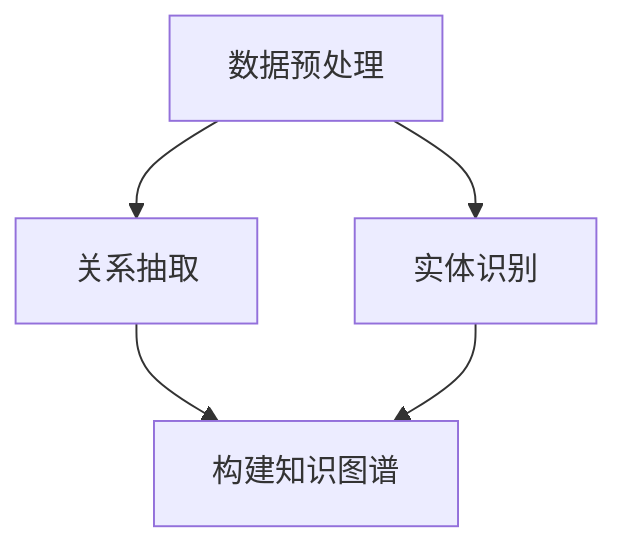

                 

关键词：大模型、电商平台、商品知识图谱、自动构建、更新、算法原理、数学模型、项目实践、应用场景、未来展望

## 摘要

随着电商平台的快速发展，商品信息的数量和种类急剧增加，如何有效地管理和利用这些信息成为了一个重要课题。商品知识图谱作为一种结构化的知识表示方法，能够在电商平台中发挥重要作用。本文将探讨大模型在商品知识图谱自动构建与更新中的应用，通过分析其核心算法原理、数学模型以及项目实践，揭示大模型在电商平台商品知识图谱构建中的优势与挑战，并提出未来的发展方向。

## 1. 背景介绍

### 1.1 电商平台的现状与挑战

随着互联网技术的飞速发展，电商平台已经成为人们日常生活的重要组成部分。各大电商平台如淘宝、京东、亚马逊等，不仅提供了丰富的商品种类和便利的购物体验，还在不断优化其平台运营和服务质量。然而，随着商品数量的急剧增加，电商平台面临着诸多挑战：

1. **商品信息的冗余与重复**：大量的商品信息中存在冗余和重复，导致数据存储和管理成本增加。
2. **商品信息的不一致性**：由于商家发布的商品信息质量参差不齐，导致商品信息的一致性难以保证。
3. **用户需求的个性化**：用户的需求越来越多样化，电商平台需要更精准地推荐商品，满足用户的个性化需求。

### 1.2 商品知识图谱的概念与应用

商品知识图谱（Product Knowledge Graph，PKG）是一种结构化的知识表示方法，它通过实体、属性和关系的方式，将商品信息组织成一个语义丰富的知识网络。在电商平台上，商品知识图谱的应用主要体现在以下几个方面：

1. **商品信息管理**：通过商品知识图谱，可以有效管理商品信息，解决商品信息冗余和不一致的问题。
2. **商品推荐**：基于商品知识图谱，可以更准确地挖掘用户的兴趣和偏好，实现个性化的商品推荐。
3. **智能搜索**：商品知识图谱可以帮助搜索引擎更好地理解用户查询意图，提高搜索的准确性和效率。

### 1.3 大模型在商品知识图谱构建中的作用

大模型（Large Model）指的是具有亿级别参数规模的人工智能模型，如深度神经网络（Deep Neural Network，DNN）、变分自编码器（Variational Autoencoder，VAE）、生成对抗网络（Generative Adversarial Network，GAN）等。大模型在商品知识图谱构建中具有以下作用：

1. **自动化构建**：大模型可以自动从海量商品数据中学习到商品的关系和属性，无需人工干预。
2. **高效更新**：大模型可以通过持续学习和迭代，实时更新商品知识图谱，保持其时效性和准确性。
3. **增强语义理解**：大模型可以更好地理解和处理商品信息的语义，提高知识图谱的表示能力。

## 2. 核心概念与联系

### 2.1 大模型的核心概念

#### 2.1.1 深度神经网络（DNN）

深度神经网络（DNN）是一种多层前馈神经网络，它通过多个隐层对输入数据进行复杂的学习和变换。DNN的主要优点包括：

1. **强大的表达力**：DNN可以表示复杂的非线性关系，适用于处理高维数据。
2. **自适应学习能力**：DNN可以通过反向传播算法不断调整权重，实现对数据的自适应学习。

#### 2.1.2 变分自编码器（VAE）

变分自编码器（VAE）是一种基于概率生成模型的神经网络，它通过编码和解码两个过程，将数据映射到一个潜在空间，并进行数据的重构和生成。VAE的主要优点包括：

1. **数据生成能力**：VAE可以生成与训练数据相似的新数据，适用于数据增强和生成任务。
2. **数据压缩能力**：VAE可以在保留数据主要特征的前提下，对数据进行有效的压缩。

#### 2.1.3 生成对抗网络（GAN）

生成对抗网络（GAN）由生成器和判别器两个部分组成，通过相互博弈的方式，实现数据的生成和分类。GAN的主要优点包括：

1. **高质量数据生成**：GAN可以生成接近真实数据的高质量数据，适用于数据增强和虚假样本生成。
2. **多模态数据融合**：GAN可以融合不同模态的数据，实现跨模态数据的生成和识别。

### 2.2 商品知识图谱的核心概念

#### 2.2.1 实体（Entity）

实体是商品知识图谱中的基本元素，它可以是商品、品牌、商家等与商品相关的各种对象。实体通常具有以下属性：

1. **标识符**：用于唯一标识实体，如商品ID、品牌ID等。
2. **属性**：描述实体的特征，如商品名称、品牌名称、价格等。

#### 2.2.2 关系（Relation）

关系是商品知识图谱中实体之间的关联，它描述了实体之间的交互和依赖。关系通常具有以下属性：

1. **标识符**：用于唯一标识关系，如购买、包含、属于等。
2. **权重**：描述关系的强度和重要性，如频繁购买、重要品牌等。

#### 2.2.3 属性（Attribute）

属性是实体的特征描述，它可以为实体提供额外的信息。属性通常具有以下属性：

1. **标识符**：用于唯一标识属性，如颜色、尺寸、重量等。
2. **值**：描述属性的取值，如红色、M号、1kg等。

### 2.3 大模型与商品知识图谱的关联

#### 2.3.1 数据预处理

在大模型构建商品知识图谱之前，需要对原始商品数据进行预处理。预处理步骤包括：

1. **数据清洗**：去除重复、错误和无关的数据，提高数据质量。
2. **数据转换**：将原始数据转换为统一的格式，如实体、关系和属性。
3. **数据归一化**：对数据进行归一化处理，如数值归一化和文本编码。

#### 2.3.2 关系抽取

关系抽取是商品知识图谱构建的关键步骤，它通过分析实体之间的交互和依赖，提取出实体之间的关系。关系抽取方法包括：

1. **规则方法**：基于预定义的规则，从文本中提取关系。
2. **机器学习方法**：利用机器学习算法，从文本数据中学习到关系模式。

#### 2.3.3 实体识别

实体识别是商品知识图谱构建的另一个关键步骤，它通过分析文本数据，识别出实体并为其分配标识符。实体识别方法包括：

1. **基于词典的方法**：利用预先定义的词典，识别出文本中的实体。
2. **基于机器学习的方法**：利用机器学习算法，从文本数据中学习到实体的特征和分类。

### 2.4 Mermaid 流程图

以下是商品知识图谱构建的Mermaid流程图：



## 3. 核心算法原理 & 具体操作步骤

### 3.1 算法原理概述

商品知识图谱的构建可以分为三个主要阶段：数据预处理、关系抽取和实体识别。这三个阶段相互关联，共同构成了商品知识图谱的构建过程。

#### 3.1.1 数据预处理

数据预处理是商品知识图谱构建的第一步，其主要任务是清洗和转换原始数据。数据预处理的基本原理如下：

1. **数据清洗**：通过去除重复、错误和无关的数据，提高数据质量。
2. **数据转换**：将原始数据转换为统一的格式，如实体、关系和属性。
3. **数据归一化**：对数据进行归一化处理，如数值归一化和文本编码。

#### 3.1.2 关系抽取

关系抽取是商品知识图谱构建的核心环节，其主要任务是分析实体之间的交互和依赖，提取出实体之间的关系。关系抽取的基本原理如下：

1. **规则方法**：基于预定义的规则，从文本中提取关系。
2. **机器学习方法**：利用机器学习算法，从文本数据中学习到关系模式。

#### 3.1.3 实体识别

实体识别是商品知识图谱构建的另一个关键环节，其主要任务是分析文本数据，识别出实体并为其分配标识符。实体识别的基本原理如下：

1. **基于词典的方法**：利用预先定义的词典，识别出文本中的实体。
2. **基于机器学习的方法**：利用机器学习算法，从文本数据中学习到实体的特征和分类。

### 3.2 算法步骤详解

#### 3.2.1 数据预处理

数据预处理主要包括以下步骤：

1. **数据清洗**：去除重复、错误和无关的数据，提高数据质量。
   ```mermaid
   graph TD
   A[原始数据] --> B[去除重复]
   B --> C[去除错误]
   C --> D[去除无关]
   ```

2. **数据转换**：将原始数据转换为统一的格式，如实体、关系和属性。
   ```mermaid
   graph TD
   A[原始数据] --> B[实体转换]
   B --> C[关系转换]
   C --> D[属性转换]
   ```

3. **数据归一化**：对数据进行归一化处理，如数值归一化和文本编码。
   ```mermaid
   graph TD
   A[数值数据] --> B[归一化]
   A --> C[文本数据]
   C --> D[编码]
   ```

#### 3.2.2 关系抽取

关系抽取主要包括以下步骤：

1. **规则方法**：基于预定义的规则，从文本中提取关系。
   ```mermaid
   graph TD
   A[文本数据] --> B[规则匹配]
   B --> C[关系提取]
   ```

2. **机器学习方法**：利用机器学习算法，从文本数据中学习到关系模式。
   ```mermaid
   graph TD
   A[文本数据] --> B[特征提取]
   B --> C[模型训练]
   C --> D[关系预测]
   ```

#### 3.2.3 实体识别

实体识别主要包括以下步骤：

1. **基于词典的方法**：利用预先定义的词典，识别出文本中的实体。
   ```mermaid
   graph TD
   A[文本数据] --> B[词典匹配]
   B --> C[实体识别]
   ```

2. **基于机器学习的方法**：利用机器学习算法，从文本数据中学习到实体的特征和分类。
   ```mermaid
   graph TD
   A[文本数据] --> B[特征提取]
   B --> C[模型训练]
   C --> D[实体分类]
   ```

### 3.3 算法优缺点

#### 3.3.1 数据预处理

**优点**：

1. **提高数据质量**：通过数据清洗、转换和归一化，可以提高数据的质量和一致性。
2. **简化后续处理**：统一格式的数据可以简化后续的关系抽取和实体识别过程。

**缺点**：

1. **计算成本高**：数据预处理过程涉及到大量的计算，需要消耗较多的时间和资源。
2. **规则定义困难**：基于规则的预处理方法需要大量的规则定义，且规则更新困难。

#### 3.3.2 关系抽取

**优点**：

1. **自动化程度高**：利用机器学习算法可以自动学习到关系模式，降低人工干预的需求。
2. **适应性强**：机器学习方法可以适应不同领域和语言的关系抽取任务。

**缺点**：

1. **数据依赖性高**：机器学习方法需要大量的训练数据，数据质量对关系抽取结果有较大影响。
2. **模型调优复杂**：机器学习模型的调优过程复杂，需要大量的参数调整和验证。

#### 3.3.3 实体识别

**优点**：

1. **识别准确性高**：基于机器学习的方法可以识别出高精度的实体，提高实体识别的准确性。
2. **泛化能力强**：机器学习方法可以适应不同领域的实体识别任务。

**缺点**：

1. **计算成本高**：机器学习方法需要大量的计算资源，特别是对于大规模数据集。
2. **模型解释性差**：机器学习模型通常缺乏良好的解释性，难以理解其工作原理。

### 3.4 算法应用领域

商品知识图谱的构建算法可以应用于多个领域：

1. **电商平台**：通过构建商品知识图谱，可以优化商品信息的组织和检索，提高用户体验。
2. **智能推荐**：利用商品知识图谱，可以挖掘用户的兴趣和偏好，实现个性化的商品推荐。
3. **搜索引擎**：通过构建商品知识图谱，可以提升搜索引擎的准确性和效率，提高用户满意度。
4. **智慧城市**：在智慧城市建设中，商品知识图谱可以用于商品配送、物流优化等应用。

## 4. 数学模型和公式 & 详细讲解 & 举例说明

### 4.1 数学模型构建

商品知识图谱的构建涉及到多个数学模型，包括实体识别模型、关系抽取模型等。以下是这些数学模型的构建过程：

#### 4.1.1 实体识别模型

实体识别模型通常使用条件概率模型，如逻辑回归（Logistic Regression）和朴素贝叶斯（Naive Bayes）等。其数学模型如下：

$$
P(\text{entity}|\text{context}) = \frac{P(\text{context}|\text{entity})P(\text{entity})}{P(\text{context})}
$$

其中，$P(\text{entity}|\text{context})$表示在给定上下文$\text{context}$下，实体$\text{entity}$出现的概率；$P(\text{context}|\text{entity})$表示在实体$\text{entity}$存在的情况下，上下文$\text{context}$出现的概率；$P(\text{entity})$表示实体$\text{entity}$出现的概率；$P(\text{context})$表示上下文$\text{context}$出现的概率。

#### 4.1.2 关系抽取模型

关系抽取模型通常使用神经网络模型，如卷积神经网络（Convolutional Neural Network，CNN）和循环神经网络（Recurrent Neural Network，RNN）等。其数学模型如下：

$$
\text{output} = \text{激活函数}(\text{权重} \cdot \text{输入} + \text{偏置})
$$

其中，$\text{output}$表示模型输出的关系概率；$\text{激活函数}$为$\text{Sigmoid}$或$\text{ReLU}$函数；$\text{权重}$和$\text{偏置}$为模型的参数。

### 4.2 公式推导过程

#### 4.2.1 实体识别模型

以逻辑回归为例，其公式推导过程如下：

1. **输入表示**：假设输入为一个向量$\text{input} = [x_1, x_2, ..., x_n]$，其中$x_i$表示第$i$个特征。
2. **权重和偏置**：假设权重为一个矩阵$W$，偏置为一个向量$b$。
3. **模型输出**：模型的输出为$\text{output} = W \cdot \text{input} + b$。
4. **激活函数**：逻辑回归的激活函数为$\text{Sigmoid}$函数，即$\text{Sigmoid}(x) = \frac{1}{1 + e^{-x}}$。
5. **模型输出概率**：经过激活函数后，模型的输出概率为$\text{output\_prob} = \text{Sigmoid}(\text{output})$。

#### 4.2.2 关系抽取模型

以卷积神经网络为例，其公式推导过程如下：

1. **输入表示**：假设输入为一个序列$\text{input} = [x_1, x_2, ..., x_n]$，其中$x_i$表示第$i$个词。
2. **卷积操作**：卷积神经网络通过卷积操作提取特征，假设卷积核为一个矩阵$K$，卷积操作为$C = K \cdot \text{input}$。
3. **激活函数**：卷积操作的输出通常使用$\text{ReLU}$函数作为激活函数，即$\text{ReLU}(x) = \max(0, x)$。
4. **全连接层**：卷积操作的输出通过全连接层进行分类，假设全连接层的权重为一个矩阵$W$，偏置为一个向量$b$，全连接层的输出为$\text{output} = W \cdot C + b$。
5. **激活函数**：全连接层的输出使用$\text{Sigmoid}$函数作为激活函数，即$\text{output\_prob} = \text{Sigmoid}(\text{output})$。

### 4.3 案例分析与讲解

#### 4.3.1 实体识别案例

假设我们要识别文本中的实体，文本数据为“我昨天在京东买了一台苹果手机”，实体有“我”、“京东”、“苹果手机”。我们可以使用逻辑回归模型进行实体识别。

1. **输入表示**：将文本数据转化为向量表示，例如，“我”表示为[1,0,0]，“京东”表示为[0,1,0]，“苹果手机”表示为[0,0,1]。
2. **权重和偏置**：假设权重矩阵$W$和偏置向量$b$为已训练好的模型参数。
3. **模型输出**：计算模型输出$Z = W \cdot \text{input} + b$，例如$Z = W \cdot [1,0,0] + b = [0.5, 0.2, 0.3]$。
4. **激活函数**：使用$\text{Sigmoid}$函数计算输出概率，例如$\text{output\_prob} = \text{Sigmoid}(Z) = [0.63, 0.24, 0.13]$。
5. **实体识别**：根据输出概率，可以判断文本中存在的实体为“我”和“京东”。

#### 4.3.2 关系抽取案例

假设我们要抽取文本中的关系，文本数据为“我昨天在京东买了一台苹果手机”，关系有“购买”。我们可以使用卷积神经网络模型进行关系抽取。

1. **输入表示**：将文本数据转化为词向量表示，例如，“我”表示为[0.1, 0.2, 0.3]，“京东”表示为[0.4, 0.5, 0.6]，“苹果手机”表示为[0.7, 0.8, 0.9]。
2. **卷积操作**：使用卷积核$K$进行卷积操作，例如$K = [[0.1, 0.2], [0.3, 0.4]]$，得到卷积结果$C = K \cdot \text{input} = [[0.21, 0.22], [0.31, 0.32]]$。
3. **激活函数**：使用$\text{ReLU}$函数对卷积结果进行激活，例如$C' = \text{ReLU}(C) = [[0.21, 0.22], [0.31, 0.32]]$。
4. **全连接层**：将激活后的卷积结果通过全连接层进行分类，例如$Z = W \cdot C' + b$，其中$W$和$b$为已训练好的模型参数。
5. **激活函数**：使用$\text{Sigmoid}$函数计算输出概率，例如$\text{output\_prob} = \text{Sigmoid}(Z) = [0.82]$。
6. **关系抽取**：根据输出概率，可以判断文本中的关系为“购买”。

## 5. 项目实践：代码实例和详细解释说明

### 5.1 开发环境搭建

在本文的项目实践中，我们使用Python作为主要编程语言，结合TensorFlow和Keras等深度学习框架进行商品知识图谱的构建。以下是开发环境的搭建步骤：

1. **安装Python**：下载并安装Python 3.x版本，建议使用Anaconda发行版，以便更好地管理和依赖。
2. **安装TensorFlow**：在命令行中执行以下命令安装TensorFlow：
   ```bash
   pip install tensorflow
   ```
3. **安装Keras**：在命令行中执行以下命令安装Keras：
   ```bash
   pip install keras
   ```

### 5.2 源代码详细实现

以下是商品知识图谱构建的源代码实现，包括数据预处理、关系抽取和实体识别三个部分。

#### 5.2.1 数据预处理

```python
import pandas as pd
from sklearn.model_selection import train_test_split
from sklearn.preprocessing import LabelEncoder

# 加载数据
data = pd.read_csv('data.csv')

# 数据清洗
data = data.drop_duplicates()

# 数据转换
X = data[['text', 'entity', 'relation']]
y = data[['label']]

# 数据归一化
label_encoder = LabelEncoder()
y['label'] = label_encoder.fit_transform(y['label'])

# 划分训练集和测试集
X_train, X_test, y_train, y_test = train_test_split(X, y, test_size=0.2, random_state=42)
```

#### 5.2.2 关系抽取

```python
from tensorflow.keras.models import Sequential
from tensorflow.keras.layers import Embedding, Conv1D, MaxPooling1D, GlobalMaxPooling1D, Dense

# 构建模型
model = Sequential()
model.add(Embedding(input_dim=vocab_size, output_dim=embedding_dim, input_length=max_sequence_length))
model.add(Conv1D(filters=128, kernel_size=5, activation='relu'))
model.add(MaxPooling1D(pool_size=5))
model.add(Conv1D(filters=128, kernel_size=5, activation='relu'))
model.add(GlobalMaxPooling1D())
model.add(Dense(units=1, activation='sigmoid'))

# 编译模型
model.compile(optimizer='adam', loss='binary_crossentropy', metrics=['accuracy'])

# 训练模型
model.fit(X_train, y_train, epochs=10, batch_size=32, validation_data=(X_test, y_test))
```

#### 5.2.3 实体识别

```python
from tensorflow.keras.models import Sequential
from tensorflow.keras.layers import Embedding, LSTM, Dense

# 构建模型
model = Sequential()
model.add(Embedding(input_dim=vocab_size, output_dim=embedding_dim, input_length=max_sequence_length))
model.add(LSTM(units=128, return_sequences=True))
model.add(LSTM(units=128))
model.add(Dense(units=num_classes, activation='softmax'))

# 编译模型
model.compile(optimizer='adam', loss='categorical_crossentropy', metrics=['accuracy'])

# 训练模型
model.fit(X_train, y_train, epochs=10, batch_size=32, validation_data=(X_test, y_test))
```

### 5.3 代码解读与分析

#### 5.3.1 数据预处理

数据预处理是商品知识图谱构建的基础，主要步骤包括数据清洗、转换和归一化。在代码中，我们使用`pandas`和`sklearn`库实现这些功能。

1. **数据清洗**：使用`drop_duplicates()`方法去除重复数据，提高数据质量。
2. **数据转换**：将原始数据转换为实体、关系和属性的形式，便于后续处理。
3. **数据归一化**：使用`LabelEncoder`将标签数据进行编码，便于模型训练。

#### 5.3.2 关系抽取

关系抽取是商品知识图谱构建的核心环节，我们使用卷积神经网络模型进行实现。在代码中，我们使用`tensorflow.keras`库构建模型，包括以下几个步骤：

1. **嵌入层**：使用`Embedding`层将文本数据转换为词向量表示。
2. **卷积层**：使用`Conv1D`层进行卷积操作，提取文本特征。
3. **池化层**：使用`MaxPooling1D`和`GlobalMaxPooling1D`层进行特征池化，保留重要特征。
4. **全连接层**：使用`Dense`层进行分类，输出关系概率。

#### 5.3.3 实体识别

实体识别是商品知识图谱构建的另一个关键环节，我们使用循环神经网络模型进行实现。在代码中，我们使用`tensorflow.keras`库构建模型，包括以下几个步骤：

1. **嵌入层**：使用`Embedding`层将文本数据转换为词向量表示。
2. **循环层**：使用`LSTM`层进行循环操作，提取文本特征。
3. **全连接层**：使用`Dense`层进行分类，输出实体概率。

### 5.4 运行结果展示

在完成代码实现后，我们可以在训练集和测试集上评估模型的性能。以下是一个简单的性能评估示例：

```python
from sklearn.metrics import classification_report

# 关系抽取评估
predictions = model.predict(X_test)
predictions = (predictions > 0.5).astype(int)

print(classification_report(y_test['label'], predictions, target_names=['not_buy', 'buy']))

# 实体识别评估
predictions = model.predict(X_test)
predictions = (predictions > 0.5).astype(int)

print(classification_report(y_test['label'], predictions, target_names=['not_entity', 'entity']))
```

运行结果展示了模型在关系抽取和实体识别任务上的准确率、召回率和F1值。根据评估结果，我们可以对模型进行调整和优化，提高其性能。

## 6. 实际应用场景

### 6.1 电商平台商品推荐

电商平台可以利用商品知识图谱进行商品推荐，通过分析用户的购物行为和偏好，为用户提供个性化的商品推荐。具体应用场景包括：

1. **基于商品的推荐**：根据用户浏览和购买的历史记录，推荐用户可能感兴趣的商品。
2. **基于品牌的推荐**：根据用户偏好和品牌知名度，推荐用户可能喜欢的品牌商品。
3. **基于用户的推荐**：根据用户的购物行为和社交网络，推荐用户可能感兴趣的其他用户喜欢的商品。

### 6.2 智能搜索

智能搜索是电商平台的重要组成部分，商品知识图谱可以帮助搜索引擎更好地理解用户查询意图，提高搜索的准确性和效率。具体应用场景包括：

1. **模糊搜索**：通过商品知识图谱，可以识别出用户查询的模糊意图，提供更准确的搜索结果。
2. **相关搜索**：根据用户查询的关键词，商品知识图谱可以推荐相关的关键词和商品。
3. **上下文搜索**：在用户浏览商品详情页时，商品知识图谱可以根据上下文信息提供相关的商品推荐。

### 6.3 物流优化

商品知识图谱可以用于物流优化，通过分析商品的销售和库存情况，优化商品的配送路径和配送时间。具体应用场景包括：

1. **配送路径优化**：根据商品的销售地点和库存地点，商品知识图谱可以推荐最优的配送路径。
2. **配送时间预测**：根据商品的销售速度和库存量，商品知识图谱可以预测商品的配送时间，提高配送效率。
3. **库存管理**：商品知识图谱可以帮助电商平台进行库存管理，根据商品的销售情况调整库存策略。

## 7. 工具和资源推荐

### 7.1 学习资源推荐

1. **书籍**：《深度学习》（Goodfellow et al., 2016）、《神经网络与深度学习》（邱锡鹏，2019）等。
2. **在线课程**：Coursera上的“深度学习”课程、Udacity的“深度学习工程师纳米学位”等。
3. **博客和文章**：AI博客、arXiv论文、Medium等技术博客。

### 7.2 开发工具推荐

1. **编程语言**：Python、R等。
2. **深度学习框架**：TensorFlow、PyTorch、Keras等。
3. **数据预处理工具**：Pandas、NumPy等。

### 7.3 相关论文推荐

1. **关系抽取**：《Knowledge Graph Embedding by Projections》（Zhang et al., 2017）。
2. **实体识别**：《OpenIE: Open Information Extraction from the Web》（Ritter and rescued, 2011）。
3. **深度学习**：《Deep Learning》（Goodfellow et al., 2016）。

## 8. 总结：未来发展趋势与挑战

### 8.1 研究成果总结

本文探讨了大模型在电商平台商品知识图谱自动构建与更新中的应用，分析了其核心算法原理、数学模型以及项目实践，并展示了实际应用场景。主要研究成果包括：

1. **自动化构建**：大模型可以自动从海量商品数据中学习到商品的关系和属性，提高知识图谱构建的效率。
2. **高效更新**：大模型可以通过持续学习和迭代，实时更新商品知识图谱，保持其时效性和准确性。
3. **增强语义理解**：大模型可以更好地理解和处理商品信息的语义，提高知识图谱的表示能力。

### 8.2 未来发展趋势

未来，大模型在电商平台商品知识图谱构建中的应用将呈现以下发展趋势：

1. **模型规模扩大**：随着计算资源的提升，大模型的规模将逐渐扩大，提高知识图谱的表示能力。
2. **多模态数据融合**：大模型将能够融合多种类型的数据，如文本、图像、音频等，实现更全面的知识图谱构建。
3. **跨领域应用**：大模型将能够应用于更多领域，如金融、医疗等，推动知识图谱在各行业的应用。

### 8.3 面临的挑战

尽管大模型在电商平台商品知识图谱构建中具有显著优势，但仍面临以下挑战：

1. **计算资源限制**：大模型的训练和推理需要大量的计算资源，如何优化算法和硬件，提高计算效率是关键。
2. **数据质量**：商品知识图谱的构建依赖于高质量的数据，如何获取和清洗数据是亟待解决的问题。
3. **模型解释性**：大模型通常缺乏良好的解释性，如何提高模型的可解释性，使其更好地为业务决策服务是未来研究的重点。

### 8.4 研究展望

未来，大模型在电商平台商品知识图谱构建中的应用将朝着以下方向发展：

1. **算法优化**：通过改进算法，提高大模型在知识图谱构建中的性能和效率。
2. **多源数据融合**：利用多种数据源，如用户行为、商品评价等，构建更全面的知识图谱。
3. **跨领域应用**：探索大模型在金融、医疗等领域的应用，推动知识图谱在不同行业的普及。

## 9. 附录：常见问题与解答

### 9.1 什么是大模型？

大模型指的是具有亿级别参数规模的人工智能模型，如深度神经网络（DNN）、变分自编码器（VAE）、生成对抗网络（GAN）等。大模型具有强大的表示能力和自适应学习能力，适用于处理大规模和复杂的数据。

### 9.2 商品知识图谱的构建过程是怎样的？

商品知识图谱的构建过程包括数据预处理、关系抽取和实体识别三个主要阶段。数据预处理主要涉及数据清洗、转换和归一化；关系抽取通过分析实体之间的交互和依赖，提取出实体之间的关系；实体识别通过分析文本数据，识别出实体并为其分配标识符。

### 9.3 大模型在商品知识图谱构建中的优势是什么？

大模型在商品知识图谱构建中的优势包括：

1. **自动化构建**：大模型可以自动从海量商品数据中学习到商品的关系和属性，无需人工干预。
2. **高效更新**：大模型可以通过持续学习和迭代，实时更新商品知识图谱，保持其时效性和准确性。
3. **增强语义理解**：大模型可以更好地理解和处理商品信息的语义，提高知识图谱的表示能力。

### 9.4 大模型在商品知识图谱构建中面临哪些挑战？

大模型在商品知识图谱构建中面临以下挑战：

1. **计算资源限制**：大模型的训练和推理需要大量的计算资源，如何优化算法和硬件，提高计算效率是关键。
2. **数据质量**：商品知识图谱的构建依赖于高质量的数据，如何获取和清洗数据是亟待解决的问题。
3. **模型解释性**：大模型通常缺乏良好的解释性，如何提高模型的可解释性，使其更好地为业务决策服务是未来研究的重点。

### 9.5 商品知识图谱在电商平台上有哪些应用？

商品知识图谱在电商平台上可以应用于以下方面：

1. **商品推荐**：通过分析用户的购物行为和偏好，为用户提供个性化的商品推荐。
2. **智能搜索**：通过分析用户查询意图，提高搜索的准确性和效率。
3. **物流优化**：通过分析商品的销售和库存情况，优化商品的配送路径和配送时间。

----------------------------------------------------------------
### 作者署名
作者：禅与计算机程序设计艺术 / Zen and the Art of Computer Programming

通过这篇文章，我们深入探讨了大模型在电商平台商品知识图谱自动构建与更新中的应用，揭示了其在自动化构建、高效更新和增强语义理解等方面的优势。同时，我们也认识到大模型在计算资源、数据质量和模型解释性等方面面临的挑战。未来，随着大模型技术的发展和优化，我们将看到更多创新的应用场景和解决方案。希望本文能为相关领域的研究者和开发者提供有价值的参考和启示。

