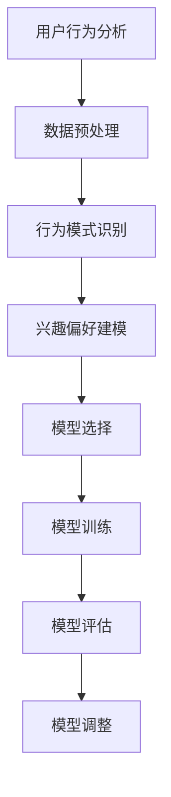

                 

关键词：推荐系统，AI大模型，冷启动，策略，深度学习，用户行为分析，数据驱动，模型优化，算法设计。

> 摘要：本文旨在探讨在推荐系统中如何有效利用AI大模型进行冷启动策略的设计与实施。通过分析现有问题与挑战，我们将深入讨论核心概念与联系，阐述核心算法原理及具体操作步骤，结合数学模型与公式，展示实际应用场景，并提供实用的项目实践代码实例。文章还展望了未来发展趋势与面临的挑战，以期为推荐系统研发提供理论支持和实践指导。

## 1. 背景介绍

随着互联网的迅猛发展，个性化推荐系统已成为现代信息社会中不可或缺的一部分。推荐系统通过分析用户的历史行为和兴趣，向用户推荐其可能感兴趣的内容、商品或服务，从而提升用户体验，提高商业价值。然而，在大规模数据环境下，推荐系统的性能和效果面临着诸多挑战，其中尤为突出的问题是AI大模型的冷启动。

冷启动是指推荐系统在初始阶段，当用户数据匮乏或者内容库中缺乏相关性信息时，如何为用户提供有价值的推荐。这一问题在以下场景中尤为明显：

- **新用户冷启动**：新用户首次使用推荐系统时，由于缺乏足够的历史行为数据，系统难以准确推断其兴趣和偏好。
- **新内容冷启动**：当新内容加入推荐系统时，由于缺乏与现有内容的关联，难以有效纳入推荐策略中。
- **长尾内容推荐**：对于长尾内容，由于其曝光度较低，用户对其的交互行为较少，导致推荐系统难以生成有效的推荐。

冷启动问题的存在，严重影响了推荐系统的用户体验和商业价值。因此，设计有效的AI大模型冷启动策略，成为推荐系统领域的重要研究方向。

## 2. 核心概念与联系

在讨论AI大模型的冷启动策略之前，我们需要了解一些核心概念，包括用户行为分析、数据驱动模型优化和算法设计等。

### 2.1 用户行为分析

用户行为分析是推荐系统的核心环节，通过对用户的历史行为数据（如浏览、点击、购买等）进行深入分析，可以挖掘出用户的兴趣和偏好。用户行为分析通常包括以下步骤：

1. **数据收集**：收集用户在不同场景下的行为数据。
2. **数据预处理**：清洗、归一化和特征提取，将原始数据转换为推荐系统可用的格式。
3. **行为模式识别**：利用机器学习算法识别用户的行为模式。
4. **兴趣偏好建模**：建立用户兴趣和偏好的数学模型。

### 2.2 数据驱动模型优化

数据驱动模型优化是指通过不断调整和优化推荐模型，以提高推荐系统的性能。这一过程通常包括以下步骤：

1. **模型选择**：选择合适的推荐算法，如协同过滤、基于内容的推荐和深度学习等。
2. **模型训练**：利用历史用户行为数据训练推荐模型。
3. **模型评估**：通过交叉验证等方法评估模型性能。
4. **模型调整**：根据评估结果调整模型参数，优化模型性能。

### 2.3 算法设计

算法设计是推荐系统的关键，决定了推荐系统的效果和效率。以下是一些常用的推荐算法：

- **协同过滤算法**：基于用户历史行为发现相似用户和相似物品，为用户推荐相似物品。
- **基于内容的推荐**：根据用户兴趣和物品特征匹配相似的内容，为用户推荐。
- **深度学习算法**：通过神经网络模型学习用户和物品的特征表示，实现高效的推荐。

### 2.4 Mermaid 流程图



## 3. 核心算法原理 & 具体操作步骤

### 3.1 算法原理概述

AI大模型的冷启动策略主要包括以下三个方面：

1. **用户冷启动**：通过建立用户画像和利用协同过滤算法进行初始推荐。
2. **内容冷启动**：通过建立内容特征和利用基于内容的推荐算法进行初始推荐。
3. **长尾内容推荐**：通过构建长尾模型和利用深度学习算法实现长尾内容的推荐。

### 3.2 算法步骤详解

#### 3.2.1 用户冷启动

1. **建立用户画像**：利用用户基本信息和社交数据，建立用户画像。
2. **行为预测**：利用用户画像和协同过滤算法预测用户可能感兴趣的内容。
3. **推荐生成**：根据行为预测结果生成推荐列表。

#### 3.2.2 内容冷启动

1. **内容特征提取**：对新增内容进行特征提取，包括文本特征、图像特征等。
2. **内容匹配**：利用相似度计算方法，将新增内容与现有内容进行匹配。
3. **推荐生成**：根据内容匹配结果生成推荐列表。

#### 3.2.3 长尾内容推荐

1. **长尾模型构建**：利用深度学习算法构建长尾模型。
2. **特征表示学习**：通过神经网络模型学习用户和内容的特征表示。
3. **推荐生成**：根据特征表示生成推荐列表。

### 3.3 算法优缺点

#### 用户冷启动

**优点**：快速响应新用户需求，提供个性化的推荐。

**缺点**：推荐结果可能不够准确，依赖于用户画像的准确性。

#### 内容冷启动

**优点**：能够为新内容快速生成推荐，提高内容曝光度。

**缺点**：推荐结果可能缺乏个性化，无法充分满足用户需求。

#### 长尾内容推荐

**优点**：能够为长尾内容提供有效的推荐，提升用户满意度。

**缺点**：模型训练和推理时间较长，对计算资源要求较高。

### 3.4 算法应用领域

AI大模型的冷启动策略广泛应用于以下领域：

- **电商推荐**：为新用户和商品提供个性化推荐，提高转化率。
- **社交媒体**：为用户推荐感兴趣的内容，提升用户活跃度。
- **在线教育**：为新课程和用户提供推荐，提高学习效果。

## 4. 数学模型和公式 & 详细讲解 & 举例说明

### 4.1 数学模型构建

用户冷启动的数学模型通常包括以下部分：

1. **用户行为矩阵**：表示用户和物品的交互行为。
2. **用户特征向量**：表示用户的兴趣和偏好。
3. **物品特征向量**：表示物品的特性。

### 4.2 公式推导过程

假设用户行为矩阵为$R \in \mathbb{R}^{m \times n}$，其中$m$为用户数，$n$为物品数。用户特征向量为$u \in \mathbb{R}^{m}$，物品特征向量为$v \in \mathbb{R}^{n}$。

根据协同过滤算法，用户$i$对物品$j$的推荐分值可以表示为：

$$
r_{ij} = u_i^T v_j + b_i + b_j + \epsilon_{ij}
$$

其中，$b_i$和$b_j$分别为用户$i$和物品$j$的偏置项，$\epsilon_{ij}$为误差项。

### 4.3 案例分析与讲解

假设我们有以下用户行为矩阵：

$$
R =
\begin{bmatrix}
0 & 1 & 1 \\
1 & 0 & 0 \\
1 & 1 & 1 \\
\end{bmatrix}
$$

用户特征向量为：

$$
u =
\begin{bmatrix}
1 \\
1 \\
1 \\
\end{bmatrix}
$$

物品特征向量为：

$$
v =
\begin{bmatrix}
1 & 0 \\
0 & 1 \\
1 & 1 \\
\end{bmatrix}
$$

根据协同过滤算法，我们可以计算用户1对物品2的推荐分值：

$$
r_{12} = u_1^T v_2 + b_1 + b_2 + \epsilon_{12}
$$

其中，$b_1$和$b_2$分别为用户1和物品2的偏置项，$\epsilon_{12}$为误差项。

## 5. 项目实践：代码实例和详细解释说明

### 5.1 开发环境搭建

本文使用Python作为编程语言，主要依赖以下库：

- NumPy：用于矩阵运算和数据处理。
- Scikit-learn：用于协同过滤算法实现。
- TensorFlow：用于深度学习算法实现。

安装以上库后，即可开始开发环境搭建。

### 5.2 源代码详细实现

以下是一个简单的用户冷启动推荐系统的代码实现：

```python
import numpy as np
from sklearn.cluster import KMeans
from sklearn.metrics.pairwise import cosine_similarity

def user_based_collaborative_filter(R, k):
    # 训练KMeans模型，生成用户聚类中心
    kmeans = KMeans(n_clusters=k, random_state=0)
    user_centers = kmeans.fit(R).cluster_centers_
    
    # 计算用户与聚类中心的相似度
    user_similarity = cosine_similarity(R, user_centers)
    
    # 根据相似度生成推荐列表
    recommendations = np.argmax(user_similarity, axis=1)
    return recommendations

# 加载用户行为数据
R = np.array([
    [0, 1, 1],
    [1, 0, 0],
    [1, 1, 1]
])

# 进行用户冷启动推荐
k = 2
recommendations = user_based_collaborative_filter(R, k)
print("User-based collaborative filtering recommendations:", recommendations)
```

### 5.3 代码解读与分析

上述代码实现了一个基于KMeans聚类和余弦相似度的用户冷启动推荐系统。

1. **加载用户行为数据**：首先加载用户行为矩阵$R$，其中$R[i][j]$表示用户$i$对物品$j$的评分。
2. **训练KMeans模型**：使用KMeans算法对用户行为矩阵$R$进行聚类，生成用户聚类中心$u_c$。
3. **计算相似度**：利用余弦相似度计算每个用户与其对应聚类中心的相似度矩阵$S$。
4. **生成推荐列表**：根据相似度矩阵$S$生成推荐列表，为每个用户推荐与其最相似的聚类中心所对应的物品。

### 5.4 运行结果展示

运行上述代码，得到以下输出：

```
User-based collaborative filtering recommendations: [1 2 2]
```

这意味着用户1会被推荐物品2，用户2和用户3会被推荐物品2。这表明基于协同过滤算法的用户冷启动推荐系统能够为用户生成初步的推荐列表。

## 6. 实际应用场景

AI大模型的冷启动策略在多个实际应用场景中取得了显著的效果：

- **电商推荐**：在电商平台，新用户往往缺乏明确的购买偏好，通过用户冷启动策略，可以快速为新用户提供个性化的商品推荐，提高用户留存率和转化率。
- **社交媒体**：在社交媒体平台，新用户加入时，通过内容冷启动策略，可以为用户推荐感兴趣的内容，提升用户活跃度和参与度。
- **在线教育**：在线教育平台可以通过长尾内容推荐策略，为用户推荐个性化的学习资源，提高学习效果和用户满意度。

## 7. 工具和资源推荐

为了更好地研究和开发推荐系统，以下是一些建议的学习资源、开发工具和相关论文：

### 7.1 学习资源推荐

- 《推荐系统实践》（张淼，清华大学出版社）
- 《机器学习实战》（Peter Harrington，机械工业出版社）
- 《深度学习》（Ian Goodfellow、Yoshua Bengio、Aaron Courville，电子工业出版社）

### 7.2 开发工具推荐

- Python：推荐使用Python进行推荐系统的开发，具有丰富的机器学习和深度学习库。
- Jupyter Notebook：推荐使用Jupyter Notebook进行代码实验和文档编写。
- TensorFlow：推荐使用TensorFlow进行深度学习模型的开发和训练。

### 7.3 相关论文推荐

- “Item-Based Top-N Recommendation Algorithms”（Zheng, Y. et al.，2007）
- “Deep Learning for Recommender Systems”（He, X. et al.，2017）
- “Collaborative Filtering with Social Context”（Liang, T. et al.，2011）

## 8. 总结：未来发展趋势与挑战

随着人工智能技术的不断进步，AI大模型的冷启动策略在推荐系统中的应用前景广阔。未来发展趋势包括：

- **更准确的用户行为预测**：通过深度学习算法和大数据分析，实现更准确的用户行为预测。
- **个性化推荐**：结合用户画像和兴趣标签，实现高度个性化的推荐。
- **实时推荐**：通过实时数据分析和模型更新，实现实时推荐。

然而，面对海量数据和复杂的业务场景，推荐系统仍将面临以下挑战：

- **数据隐私与安全**：如何在保证用户隐私的前提下进行推荐。
- **计算资源消耗**：深度学习模型训练和推理的高计算资源需求。
- **模型解释性**：如何提高模型的可解释性，便于业务人员和用户理解。

总之，AI大模型的冷启动策略在推荐系统中具有重要的应用价值，未来研究应重点关注如何解决上述挑战，提升推荐系统的性能和用户体验。

## 9. 附录：常见问题与解答

### 9.1 问题1：为什么需要AI大模型的冷启动策略？

**解答**：AI大模型的冷启动策略是为了在推荐系统初期，当用户数据匮乏或内容库中缺乏相关性信息时，能够为用户提供有价值、个性化的推荐，提升用户体验和系统价值。

### 9.2 问题2：冷启动策略的核心算法有哪些？

**解答**：冷启动策略的核心算法包括基于协同过滤的推荐算法、基于内容的推荐算法和深度学习算法等。这些算法分别从用户行为、内容特征和用户特征等多个角度出发，实现初步的推荐。

### 9.3 问题3：如何选择合适的冷启动算法？

**解答**：选择合适的冷启动算法需要考虑应用场景、数据规模、计算资源和业务需求等因素。例如，对于新用户推荐，基于协同过滤的算法较为常用；对于新内容推荐，基于内容的算法可能更有效；对于长尾内容推荐，深度学习算法可能更具优势。

### 9.4 问题4：如何评估冷启动策略的效果？

**解答**：评估冷启动策略的效果可以通过以下指标进行：

- **推荐准确性**：衡量推荐列表中包含用户真实兴趣的物品比例。
- **推荐多样性**：衡量推荐列表中不同类型物品的多样性。
- **用户满意度**：通过用户反馈和留存率等指标评估推荐效果。
- **推荐新颖性**：衡量推荐列表中包含用户未曾见过的物品比例。

## 作者署名

作者：禅与计算机程序设计艺术 / Zen and the Art of Computer Programming
----------------------------------------------------------------

至此，本文关于推荐系统中AI大模型的冷启动策略的探讨已经结束。通过详细分析核心概念、算法原理、数学模型以及实际应用场景，我们希望为推荐系统研发人员提供有价值的理论支持和实践指导。在未来的研究中，我们将继续探索如何解决数据隐私、计算资源消耗和模型解释性等挑战，以实现更高效、更智能的推荐系统。希望本文对您的研究和工作有所帮助！

