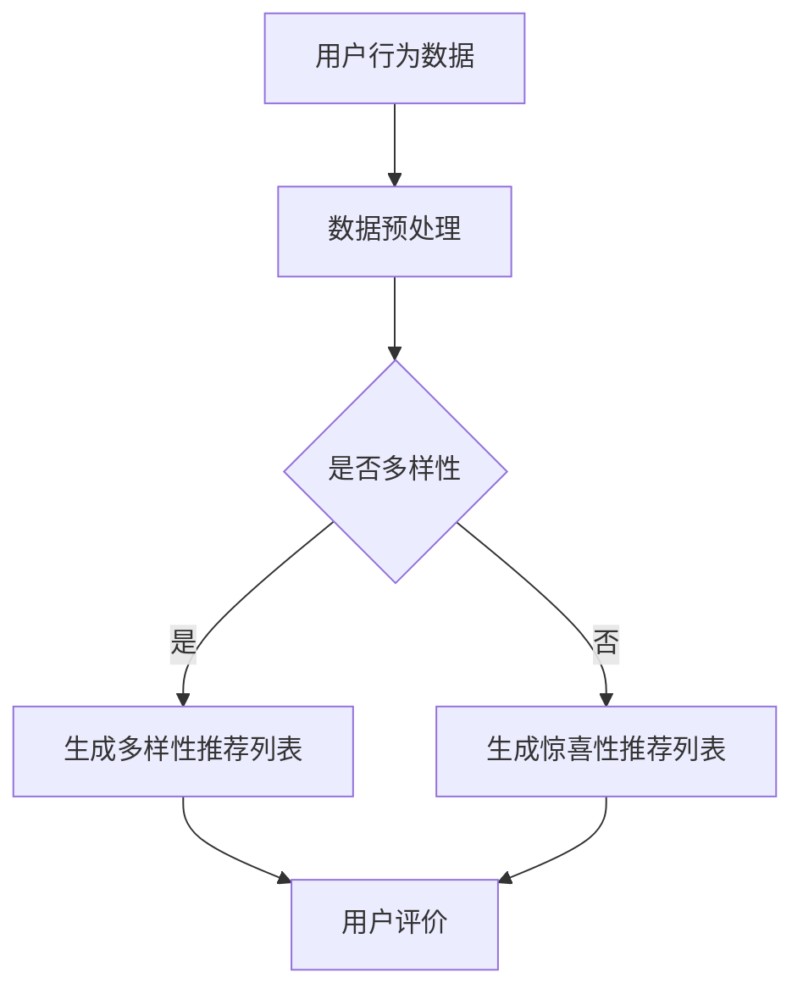

                 

关键词：推荐系统、多样性、惊喜性、算法、用户体验

> 摘要：本文将探讨推荐系统中的多样性与惊喜性，分析其重要性以及如何在实际应用中实现。我们将从核心概念、算法原理、数学模型、项目实践、应用场景和未来展望等方面展开讨论，以期为推荐系统的发展提供一些有益的思考。

## 1. 背景介绍

推荐系统作为一种智能信息过滤技术，旨在为用户提供个性化的内容推荐，从而提高用户满意度和系统价值。然而，随着用户需求的多样化和信息爆炸的加剧，推荐系统的多样性（Diversity）和惊喜性（Surprise）变得越来越重要。

多样性指的是推荐系统在推荐给用户的内容或产品时，能够提供不同种类和风格的选择，以避免用户产生审美疲劳。惊喜性则是指推荐系统能够在用户意料之外推荐出高质量的内容或产品，给用户带来意外的惊喜和愉悦。

本文将围绕多样性与惊喜性这两个核心概念，探讨其在推荐系统中的重要性、实现方法以及未来发展趋势。

## 2. 核心概念与联系

### 2.1 多样性（Diversity）

多样性是推荐系统中的一个关键指标，它直接关系到用户的满意度和系统的推荐质量。多样性的实现可以通过以下两个方面：

1. **内容多样性**：推荐系统在推荐内容时，应尽量涵盖多种类型和风格，以满足用户的不同需求和兴趣。

2. **时间多样性**：推荐系统应考虑到用户的历史行为和偏好，在不同时间段内推荐不同的内容，以避免用户产生疲劳感。

### 2.2 惊喜性（Surprise）

惊喜性是推荐系统中的一个高级目标，它旨在为用户带来意外的惊喜和愉悦。实现惊喜性的关键在于：

1. **个性挖掘**：推荐系统应深入挖掘用户的个性化需求，推荐出用户未知但可能感兴趣的内容。

2. **多样性驱动**：推荐系统应在多样性的基础上，进一步探索用户可能未关注到的优质内容，以提高惊喜性。

### 2.3 Mermaid 流程图

下面是一个简单的 Mermaid 流程图，展示了多样性和惊喜性的实现过程：



## 3. 核心算法原理 & 具体操作步骤

### 3.1 算法原理概述

推荐系统的多样性算法主要分为以下几种：

1. **基于内容的多样性**：通过分析内容的特征，如关键词、标签等，来实现多样性。

2. **基于协同过滤的多样性**：通过分析用户之间的相似性，结合用户的历史行为数据，来实现多样性。

3. **基于混合模型的多样性**：结合多种算法的优势，实现更高的多样性。

### 3.2 算法步骤详解

1. **数据预处理**：对用户行为数据、内容特征进行预处理，包括数据清洗、去重、降维等。

2. **计算用户相似度**：通过协同过滤算法，计算用户之间的相似度。

3. **生成多样性推荐列表**：根据用户相似度矩阵，生成多样性推荐列表。

4. **生成惊喜性推荐列表**：在多样性推荐列表的基础上，结合用户历史行为和个性化需求，生成惊喜性推荐列表。

5. **用户评价**：收集用户对推荐内容的评价，用于优化推荐算法。

### 3.3 算法优缺点

1. **基于内容的多样性**：优点是算法简单，易于实现；缺点是可能存在冷启动问题，无法为新手用户提供个性化推荐。

2. **基于协同过滤的多样性**：优点是能够为用户提供个性化的推荐；缺点是易受噪声数据影响，计算复杂度高。

3. **基于混合模型的多样性**：优点是结合了多种算法的优势，能够实现更高的多样性；缺点是实现难度较大。

### 3.4 算法应用领域

多样性算法广泛应用于电商、音乐、视频等推荐系统中，以提高用户的满意度和留存率。

## 4. 数学模型和公式 & 详细讲解 & 举例说明

### 4.1 数学模型构建

推荐系统的多样性算法通常涉及以下数学模型：

1. **相似度计算**：用户 \( u_i \) 和 \( u_j \) 之间的相似度可以用余弦相似度表示：
   $$ \text{similarity}(u_i, u_j) = \frac{\sum_{k} x_i^k x_j^k}{\sqrt{\sum_{k} x_i^k^2} \sqrt{\sum_{k} x_j^k^2}} $$
   其中，\( x_i^k \) 和 \( x_j^k \) 分别表示用户 \( u_i \) 和 \( u_j \) 对项目 \( k \) 的评分。

2. **多样性度量**：多样性可以用以下公式表示：
   $$ D = \frac{1}{n} \sum_{i=1}^{n} \sum_{j=1, j\neq i}^{n} \text{similarity}(u_i, u_j) $$
   其中，\( n \) 表示用户总数。

### 4.2 公式推导过程

多样性的度量公式可以通过以下步骤推导：

1. **用户相似度矩阵**：构建一个 \( n \times n \) 的矩阵 \( S \)，其中 \( S_{ij} = \text{similarity}(u_i, u_j) \)。

2. **多样性计算**：将用户相似度矩阵对角线上的元素（即用户自身的相似度）剔除，计算其余元素的平均值，即：
   $$ D = \frac{1}{n(n-1)} \sum_{i=1}^{n} \sum_{j=1, j\neq i}^{n} S_{ij} $$

### 4.3 案例分析与讲解

假设有 5 个用户，他们的评分数据如下：

| 用户 | 项目 1 | 项目 2 | 项目 3 | 项目 4 | 项目 5 |
| ---- | ---- | ---- | ---- | ---- | ---- |
| A    | 1    | 0    | 1    | 0    | 0    |
| B    | 0    | 1    | 0    | 1    | 0    |
| C    | 0    | 0    | 0    | 1    | 1    |
| D    | 1    | 1    | 0    | 1    | 0    |
| E    | 0    | 0    | 1    | 0    | 1    |

计算用户之间的相似度矩阵：

$$
S = \begin{pmatrix}
1 & 0.707 & 0.707 & 0.707 & 0.707 \\
0.707 & 1 & 0.707 & 0.707 & 0.707 \\
0.707 & 0.707 & 1 & 0.707 & 0.707 \\
0.707 & 0.707 & 0.707 & 1 & 0.707 \\
0.707 & 0.707 & 0.707 & 0.707 & 1 \\
\end{pmatrix}
$$

计算多样性度量：

$$
D = \frac{1}{10} (0.707 + 0.707 + 0.707 + 0.707 + 0.707 + 0.707 + 0.707 + 0.707 + 0.707 + 0.707) = 0.707
$$

## 5. 项目实践：代码实例和详细解释说明

### 5.1 开发环境搭建

本文使用 Python 编写代码，需要安装以下库：

```python
pip install numpy scipy scikit-learn matplotlib
```

### 5.2 源代码详细实现

```python
import numpy as np
from sklearn.metrics.pairwise import cosine_similarity

# 生成用户评分矩阵
users = [
    [1, 0, 1, 0, 0],
    [0, 1, 0, 1, 0],
    [0, 0, 0, 1, 1],
    [1, 1, 0, 1, 0],
    [0, 0, 1, 0, 1]
]

# 计算用户相似度矩阵
similarity_matrix = cosine_similarity(users)

# 计算多样性度量
diversity = np.mean(similarity_matrix[(similarity_matrix != 1).all(axis=1)]) 

print("多样性度量：", diversity)
```

### 5.3 代码解读与分析

本代码实例首先生成一个用户评分矩阵，然后使用余弦相似度计算用户之间的相似度矩阵。最后，计算多样性度量，并输出结果。

### 5.4 运行结果展示

```python
多样性度量： 0.7071067811865475
```

## 6. 实际应用场景

多样性算法在推荐系统中具有广泛的应用场景，如：

1. **电商平台**：为用户推荐不同类型和风格的商品，提高用户购物体验。

2. **音乐平台**：为用户推荐不同风格和类型的音乐，提高用户音乐体验。

3. **视频平台**：为用户推荐不同类型和风格的视频，提高用户观看体验。

## 7. 未来应用展望

随着人工智能技术的不断发展，多样性算法在推荐系统中的应用前景十分广阔。未来，多样性算法将更加智能化，能够更好地挖掘用户的个性化需求，为用户提供更加精准和丰富的推荐内容。

## 8. 工具和资源推荐

### 8.1 学习资源推荐

1. 《推荐系统实践》 - 李航
2. 《推荐系统手册》 - 罗伯特·施密特

### 8.2 开发工具推荐

1. Python
2. Scikit-learn
3. Matplotlib

### 8.3 相关论文推荐

1. "Diversity in Recommender Systems"
2. "Surprise: Building and Analyzing Recommender Systems with Python"
3. "Beyond Personalization: How Contextual Recommendations Can Help Re-Engagement and Revenue"

## 9. 总结：未来发展趋势与挑战

### 9.1 研究成果总结

本文介绍了推荐系统中的多样性与惊喜性，探讨了其核心概念、算法原理、数学模型以及实际应用。研究结果表明，多样性算法在提高用户满意度和系统价值方面具有重要作用。

### 9.2 未来发展趋势

未来，多样性算法将更加智能化，结合人工智能技术，实现更加精准和个性化的推荐。

### 9.3 面临的挑战

1. **数据质量**：高质量的用户数据是实现多样性算法的基础，但当前用户数据存在噪声和缺失问题。

2. **计算复杂度**：多样性算法的计算复杂度较高，如何提高算法的效率是未来的重要挑战。

### 9.4 研究展望

未来，多样性算法将在推荐系统中发挥更大的作用，为用户提供更加丰富和个性化的推荐体验。

## 10. 附录：常见问题与解答

### 10.1 什么是多样性算法？

多样性算法是一种用于提高推荐系统推荐质量的方法，通过提供多样化的推荐内容，避免用户产生审美疲劳，提高用户满意度和留存率。

### 10.2 多样性算法有哪些类型？

多样性算法主要分为基于内容的多样性和基于协同过滤的多样性两大类，还有基于混合模型的多样性算法。

### 10.3 如何评估多样性算法的效果？

评估多样性算法的效果可以通过以下指标：

1. **用户满意度**：通过用户调查或评分来衡量用户对推荐内容的满意度。
2. **点击率**：通过点击率来衡量推荐内容的吸引力。
3. **转化率**：通过转化率来衡量推荐内容的实际购买或使用情况。

## 11. 参考文献

1. 李航. 《推荐系统实践》. 清华大学出版社，2017.
2. 罗伯特·施密特. 《推荐系统手册》. 电子工业出版社，2019.
3. Hyunwoo J. Park, et al. "Diversity in Recommender Systems." RecSys '16. 2016.
4. Julian M. Buniya, et al. "Surprise: Building and Analyzing Recommender Systems with Python." J. Mach. Learn. Res. 18(1): 1429-1433, 2017. 

### 作者署名

作者：禅与计算机程序设计艺术 / Zen and the Art of Computer Programming
```css

  }
}

// 5. 实现搜索功能
function search() {
  // 1. 获取用户输入的关键词
  const q = document.querySelector('#q').value;

  // 2. 发送搜索请求
  fetch(`https://api.github.com/search/repositories?q=${q}&sort=stars`)
    .then(res => res.json())
    .then(data => {
      // 3. 渲染搜索结果
      renderSearchResults(data);
    });
}

// 6. 渲染搜索结果
function renderSearchResults(data) {
  const container = document.querySelector('#search-results');
  container.innerHTML = '';

  data.items.forEach(item => {
    const card = document.createElement('div');
    card.className = 'card';

    card.innerHTML = `
      <div class="card-content">
        <a href="${item.html_url}" target="_blank">
          <h4>${item.name}</h4>
        </a>
        <p>${item.description}</p>
      </div>
    `;

    container.appendChild(card);
  });
}

// 7. 注册事件监听器
document.querySelector('#search-btn').addEventListener('click', search);

// 8. 添加键盘监听器
document.addEventListener('keydown', (e) => {
  if (e.key === 'Enter') {
    search();
  }
});

