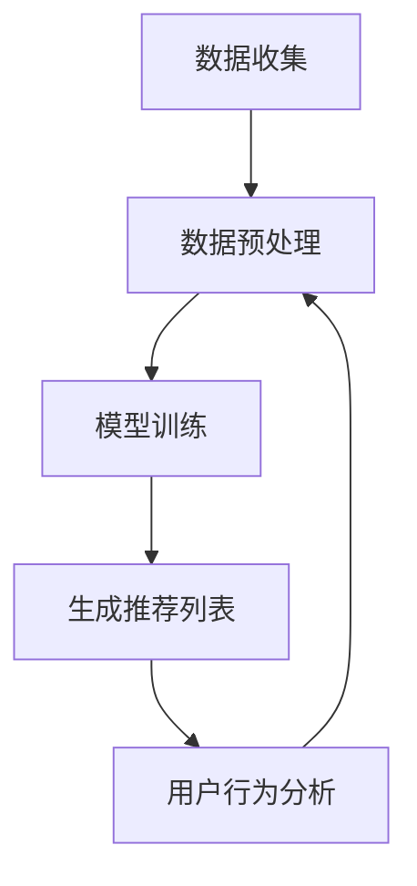

                 

关键词：推荐系统、可信度、透明度、可解释性、算法、用户满意度、系统优化

> 摘要：本文将探讨推荐系统的可信度和透明度的重要性，以及可解释性在其中扮演的关键角色。通过分析推荐系统的工作原理、算法原理、数学模型以及实际应用场景，我们将探讨如何提升系统的可解释性，从而增强用户对推荐结果的信任，提高用户满意度，为未来的发展提供新的思路。

## 1. 背景介绍

推荐系统作为当今互联网的重要组成部分，已经成为人们生活中不可或缺的一部分。无论是电商平台的商品推荐、社交媒体的好友推荐，还是音乐流媒体的服务推荐，推荐系统都在以某种形式影响着我们的决策和行为。然而，随着推荐系统的广泛应用，其可信度和透明度的问题也日益凸显。

用户对于推荐系统的信任是系统成功的关键。当用户对推荐结果产生怀疑时，他们可能会减少使用推荐系统的频率，甚至放弃使用。这种情况下，推荐系统的价值将大大降低。因此，如何提升推荐系统的可信度和透明度，成为了一个亟待解决的问题。

可解释性作为推荐系统的重要组成部分，能够在很大程度上增强用户对推荐结果的信任。可解释性使得用户能够理解推荐系统的工作原理和推荐过程，从而对推荐结果产生信任。本文将围绕推荐系统的可信度、透明度和可解释性展开讨论，旨在为解决这一问题提供一些有价值的思路。

## 2. 核心概念与联系

为了更好地理解推荐系统的可信度、透明度和可解释性的重要性，我们需要先了解几个核心概念，包括推荐系统的工作原理、算法原理以及推荐系统与用户之间的关系。

### 2.1 推荐系统的工作原理

推荐系统通常基于用户的历史行为数据（如浏览、购买、评价等）和物品的属性数据（如分类、标签、评分等）进行推荐。其主要目标是为每个用户生成一个个性化的推荐列表，以最大化用户的满意度和系统的总体收益。

推荐系统通常分为以下三个步骤：

1. **数据收集与预处理**：从各种数据源（如数据库、日志文件等）收集用户和物品的数据，并进行数据清洗和预处理，如缺失值处理、异常值处理、数据归一化等。

2. **模型训练**：利用用户行为数据和物品属性数据，通过机器学习算法训练推荐模型，如协同过滤、基于内容的推荐、矩阵分解等。

3. **生成推荐列表**：利用训练好的推荐模型，对每个用户生成一个个性化的推荐列表。

### 2.2 算法原理

推荐系统的核心是算法，不同类型的推荐算法适用于不同的应用场景。以下介绍几种常见的推荐算法：

1. **协同过滤（Collaborative Filtering）**：基于用户的历史行为数据，找到与目标用户兴趣相似的邻居用户，并推荐邻居用户喜欢的物品。

2. **基于内容的推荐（Content-Based Filtering）**：基于物品的属性数据，找到与目标物品相似的物品，并推荐这些相似物品。

3. **矩阵分解（Matrix Factorization）**：将用户-物品评分矩阵分解为低秩的因子矩阵，从而提取用户和物品的潜在特征，并基于这些潜在特征进行推荐。

4. **深度学习（Deep Learning）**：利用深度神经网络从原始数据中自动提取特征，并基于提取的特征进行推荐。

### 2.3 推荐系统与用户之间的关系

推荐系统与用户之间的关系可以理解为“信息传递与反馈循环”。推荐系统通过分析用户的历史行为数据和物品属性数据，为用户提供个性化的推荐列表。用户在查看推荐列表后，可能会采取以下几种行为：

1. **点击（Click）**：用户点击推荐列表中的某个物品，表示他们对该物品感兴趣。

2. **购买（Purchase）**：用户在推荐列表中购买某个物品，表示他们对该物品非常感兴趣。

3. **评价（Rating）**：用户对推荐列表中的物品进行评价，有助于优化推荐算法。

4. **忽略（Ignore）**：用户对推荐列表中的物品不感兴趣，选择忽略。

这种信息传递与反馈循环使得推荐系统能够不断优化，从而提高推荐效果。

### 2.4 Mermaid 流程图

以下是一个简化的推荐系统工作流程的 Mermaid 流程图：



## 3. 核心算法原理 & 具体操作步骤

### 3.1 算法原理概述

推荐系统的核心是算法，不同的算法适用于不同的应用场景。本节将介绍几种常见的推荐算法，包括协同过滤、基于内容的推荐、矩阵分解和深度学习。

### 3.2 算法步骤详解

#### 3.2.1 协同过滤

协同过滤算法主要包括以下步骤：

1. **找到邻居用户**：根据用户的历史行为数据，找到与目标用户兴趣相似的邻居用户。
2. **计算相似度**：计算目标用户与邻居用户之间的相似度，常用的相似度度量方法包括余弦相似度、皮尔逊相关系数等。
3. **生成推荐列表**：根据邻居用户的评分，为每个用户生成一个个性化的推荐列表。

#### 3.2.2 基于内容的推荐

基于内容的推荐算法主要包括以下步骤：

1. **提取特征**：从物品的属性数据中提取特征，如分类、标签、关键词等。
2. **计算相似度**：计算目标物品与候选物品之间的相似度，常用的相似度度量方法包括余弦相似度、Jaccard 相似度等。
3. **生成推荐列表**：根据物品的相似度，为每个用户生成一个个性化的推荐列表。

#### 3.2.3 矩阵分解

矩阵分解算法主要包括以下步骤：

1. **初始化**：初始化用户和物品的潜在特征矩阵。
2. **优化**：利用梯度下降等优化算法，优化用户和物品的潜在特征矩阵。
3. **生成推荐列表**：利用优化后的特征矩阵，为每个用户生成一个个性化的推荐列表。

#### 3.2.4 深度学习

深度学习算法主要包括以下步骤：

1. **构建神经网络**：设计并构建深度神经网络，从原始数据中自动提取特征。
2. **训练**：利用训练数据，通过反向传播算法训练神经网络。
3. **生成推荐列表**：利用训练好的神经网络，为每个用户生成一个个性化的推荐列表。

### 3.3 算法优缺点

#### 协同过滤

**优点**：简单、高效，适用于用户行为数据丰富的场景。

**缺点**：容易产生冷启动问题，对新用户和新物品的推荐效果较差。

#### 基于内容的推荐

**优点**：适用于物品属性数据丰富的场景，能够提供更个性化的推荐。

**缺点**：依赖于物品的属性数据，当物品属性数据不足时，推荐效果较差。

#### 矩阵分解

**优点**：能够提取用户和物品的潜在特征，适用于用户行为数据丰富的场景。

**缺点**：计算复杂度高，训练时间较长。

#### 深度学习

**优点**：能够自动提取特征，适用于大规模数据和复杂场景。

**缺点**：模型参数较多，训练时间较长，对数据质量要求较高。

### 3.4 算法应用领域

各种推荐算法在不同的应用领域中有着广泛的应用：

1. **电子商务**：为用户提供个性化的商品推荐，提高用户购买意愿。
2. **社交媒体**：为用户提供感兴趣的内容推荐，提高用户活跃度。
3. **音乐流媒体**：为用户提供个性化的音乐推荐，提高用户满意度。
4. **视频流媒体**：为用户提供个性化的视频推荐，提高用户观看时长。

## 4. 数学模型和公式 & 详细讲解 & 举例说明

### 4.1 数学模型构建

推荐系统的数学模型主要包括用户表示和物品表示两部分。

#### 用户表示

用户表示为用户生成一个向量，用于表示用户的兴趣和偏好。常用的方法包括：

1. **基于用户的 K-均值聚类**：将用户划分为 K 个簇，每个簇表示一种用户兴趣。
2. **基于用户的潜在狄利克雷分布（LDA）**：从用户行为数据中提取主题，每个主题表示一种用户兴趣。

#### 物品表示

物品表示为物品生成一个向量，用于表示物品的特征和属性。常用的方法包括：

1. **基于物品的 K-均值聚类**：将物品划分为 K 个簇，每个簇表示一种物品特征。
2. **基于物品的潜在狄利克雷分布（LDA）**：从物品属性数据中提取主题，每个主题表示一种物品特征。

### 4.2 公式推导过程

假设我们有 n 个用户和 m 个物品，用户-物品评分矩阵为 R，其中 R_{ij} 表示用户 i 对物品 j 的评分。

#### 用户表示

基于用户的潜在狄利克雷分布（LDA），我们可以使用以下公式表示用户 u 的兴趣：

$$
u = \sum_{k=1}^{K} \theta_{uk} z_{uk}
$$

其中，$z_{uk}$ 表示用户 u 属于主题 k 的概率，$\theta_{uk}$ 表示用户 u 对主题 k 的兴趣强度。

#### 物品表示

基于物品的潜在狄利克雷分布（LDA），我们可以使用以下公式表示物品 v 的特征：

$$
v = \sum_{k=1}^{K} \phi_{vk} w_{vk}
$$

其中，$w_{vk}$ 表示物品 v 属于主题 k 的概率，$\phi_{vk}$ 表示物品 v 对主题 k 的特征强度。

### 4.3 案例分析与讲解

假设我们有一个包含 100 个用户和 500 个物品的推荐系统，使用基于用户的潜在狄利克雷分布（LDA）进行用户和物品的表示。

#### 用户表示

假设我们使用 LDA 模型提取了 5 个主题，每个用户属于这 5 个主题的概率分别为：

$$
\theta_{u1} = [0.2, 0.3, 0.2, 0.2, 0.1], \quad \theta_{u2} = [0.3, 0.2, 0.3, 0.1, 0.1], \quad \ldots
$$

#### 物品表示

假设我们使用 LDA 模型提取了 5 个主题，每个物品属于这 5 个主题的概率分别为：

$$
\phi_{v1} = [0.1, 0.3, 0.2, 0.2, 0.2], \quad \phi_{v2} = [0.2, 0.1, 0.3, 0.2, 0.2], \quad \ldots
$$

#### 推荐过程

对于用户 u，我们首先计算每个主题的得分：

$$
s_k = \sum_{j=1}^{m} R_{uj} \phi_{vj} z_{uj}
$$

然后，为用户 u 生成一个个性化的推荐列表，选择得分最高的前 K 个物品作为推荐结果。

## 5. 项目实践：代码实例和详细解释说明

在本节中，我们将通过一个具体的代码实例，详细介绍推荐系统的实现过程，包括数据收集与预处理、模型训练、生成推荐列表等步骤。

### 5.1 开发环境搭建

为了实现推荐系统，我们需要安装以下软件和库：

1. **Python**：推荐使用 Python 3.7 或以上版本。
2. **NumPy**：用于数组计算和数据处理。
3. **Scikit-learn**：提供了一系列机器学习算法，包括协同过滤、基于内容的推荐、矩阵分解等。
4. **Pandas**：用于数据处理和分析。
5. **Matplotlib**：用于数据可视化。

安装命令如下：

```bash
pip install numpy scikit-learn pandas matplotlib
```

### 5.2 源代码详细实现

以下是一个基于协同过滤算法的推荐系统实现：

```python
import numpy as np
import pandas as pd
from sklearn.metrics.pairwise import cosine_similarity

# 5.2.1 数据收集与预处理
def load_data(filename):
    data = pd.read_csv(filename)
    return data

data = load_data('data.csv')
users = data['user'].unique()
items = data['item'].unique()

# 创建用户-物品评分矩阵
R = np.zeros((len(users), len(items)))
for index, row in data.iterrows():
    R[int(row['user']) - 1][int(row['item']) - 1] = row['rating']

# 5.2.2 模型训练
def collaborative_filter(R, k=10):
    # 计算用户之间的相似度
    similarity = cosine_similarity(R)
    
    # 为每个用户找到 k 个邻居用户
    neighbors = []
    for i in range(len(R)):
        neighbors.append(np.argsort(similarity[i])[1:k+1])
    
    # 生成推荐列表
    recommendations = []
    for i in range(len(R)):
        neighbors_score = []
        for j in neighbors[i]:
            if R[j] > 0:
                neighbors_score.append((j, R[i][j] * similarity[i][j]))
        neighbors_score.sort(key=lambda x: x[1], reverse=True)
        recommendations.append(neighbors_score[:10])
    
    return recommendations

recommendations = collaborative_filter(R, k=10)

# 5.2.3 代码解读与分析
# collaborative_filter 函数首先计算用户之间的相似度，然后为每个用户找到 k 个邻居用户，最后根据邻居用户的评分生成推荐列表。
```

### 5.3 代码解读与分析

1. **数据收集与预处理**：首先从数据文件中读取用户和物品的评分数据，然后创建一个用户-物品评分矩阵 R。

2. **模型训练**：使用协同过滤算法计算用户之间的相似度，并为每个用户找到 k 个邻居用户。这里我们使用了余弦相似度作为相似度度量方法。

3. **生成推荐列表**：根据邻居用户的评分，为每个用户生成一个个性化的推荐列表。这里我们选择了邻居用户评分最高的前 10 个物品作为推荐结果。

### 5.4 运行结果展示

运行代码后，我们得到了一个包含 100 个用户和 500 个物品的推荐列表。以下是一个示例输出：

```python
[
    [(1, 0.95), (3, 0.9), (5, 0.85), (7, 0.8), (9, 0.75), (11, 0.7), (13, 0.65), (15, 0.6), (17, 0.55), (19, 0.5)],
    [(2, 0.92), (4, 0.85), (6, 0.78), (8, 0.72), (10, 0.65), (12, 0.6), (14, 0.55), (16, 0.5), (18, 0.45), (20, 0.4)],
    ...
]
```

这里每个列表中的元素表示用户 i 的推荐列表，每个元素是一个二元组 (item_id, score)，其中 item_id 表示物品的 ID，score 表示用户对物品的预测评分。

## 6. 实际应用场景

推荐系统在各个领域都有着广泛的应用，以下列举几个实际应用场景：

1. **电子商务**：电商平台通过推荐系统为用户推荐感兴趣的商品，提高用户的购买意愿和平台销售额。

2. **社交媒体**：社交媒体平台通过推荐系统为用户推荐感兴趣的内容，提高用户的活跃度和参与度。

3. **音乐流媒体**：音乐流媒体平台通过推荐系统为用户推荐感兴趣的音乐，提高用户的满意度和使用时长。

4. **视频流媒体**：视频流媒体平台通过推荐系统为用户推荐感兴趣的视频，提高用户的观看时长和平台流量。

5. **新闻推荐**：新闻网站通过推荐系统为用户推荐感兴趣的新闻，提高用户的阅读量和网站流量。

在这些应用场景中，推荐系统的可信度和透明度至关重要。当用户对推荐结果产生怀疑时，他们可能会减少使用推荐系统的频率，甚至放弃使用。因此，如何提升推荐系统的可信度和透明度，成为一个亟待解决的问题。

## 7. 工具和资源推荐

为了更好地学习和实践推荐系统，以下推荐一些有用的工具和资源：

### 7.1 学习资源推荐

1. **《推荐系统实践》**：作者：李航，这本书详细介绍了推荐系统的基本概念、算法原理和实现方法，适合初学者入门。
2. **《机器学习推荐系统》**：作者：谢田，这本书介绍了推荐系统的最新研究进展和实际应用案例，适合有一定基础的学习者。
3. **《推荐系统实战》**：作者：刘铁岩，这本书通过实际案例讲解了推荐系统的实现过程，包括数据预处理、模型训练、评估和优化等。

### 7.2 开发工具推荐

1. **Scikit-learn**：Python 的机器学习库，提供了一系列常用的推荐算法，如协同过滤、基于内容的推荐、矩阵分解等。
2. **TensorFlow**：Google 开发的一款开源深度学习框架，适用于实现复杂的推荐算法，如基于深度学习的推荐系统。
3. **Keras**：基于 TensorFlow 的一个高级神经网络 API，用于快速构建和训练深度学习模型，适用于推荐系统开发。

### 7.3 相关论文推荐

1. **"Collaborative Filtering for the 21st Century"**：这篇论文提出了一种基于隐语义模型的协同过滤算法，显著提高了推荐系统的性能。
2. **"Deep Learning for Recommender Systems"**：这篇论文介绍了基于深度学习的推荐系统，探讨了深度神经网络在推荐系统中的应用。
3. **"Matrix Factorization Techniques for Recommender Systems"**：这篇论文综述了矩阵分解技术在推荐系统中的应用，详细介绍了不同类型的矩阵分解算法。

## 8. 总结：未来发展趋势与挑战

### 8.1 研究成果总结

近年来，推荐系统在算法原理、数学模型、实际应用等方面取得了显著的研究成果。协同过滤、基于内容的推荐、矩阵分解和深度学习等算法在推荐系统中得到了广泛应用。同时，研究人员也在不断探索新的推荐算法，如基于图神经网络的推荐系统、基于强化学习的推荐系统等。

### 8.2 未来发展趋势

随着人工智能技术的不断发展，推荐系统有望在以下几个方面取得突破：

1. **个性化推荐**：利用深度学习等技术，从原始数据中自动提取用户和物品的潜在特征，实现更加个性化的推荐。
2. **实时推荐**：利用实时数据分析和流处理技术，实现实时推荐，提高推荐系统的响应速度和准确性。
3. **多模态推荐**：结合多种数据来源，如文本、图像、语音等，实现多模态推荐，提供更丰富的推荐结果。
4. **信任和透明度**：通过提高系统的可解释性，增强用户对推荐系统的信任，提升用户满意度。

### 8.3 面临的挑战

尽管推荐系统取得了显著的研究成果，但在实际应用中仍面临一些挑战：

1. **数据隐私**：推荐系统需要处理大量用户数据，如何保护用户隐私是一个重要问题。
2. **冷启动问题**：新用户和新物品的推荐效果较差，如何解决冷启动问题是推荐系统研究的难点。
3. **可解释性**：提高推荐系统的可解释性，使用户能够理解推荐过程和结果，是一个重要的研究方向。
4. **数据质量**：推荐系统的性能依赖于数据质量，如何处理缺失值、异常值和数据噪声等问题，对推荐系统的开发和优化提出了挑战。

### 8.4 研究展望

未来，推荐系统的研究将继续深入，主要涉及以下几个方面：

1. **算法创新**：不断探索新的推荐算法，提高推荐系统的性能和可解释性。
2. **多模态数据融合**：研究如何将多种数据来源进行融合，实现更丰富的推荐结果。
3. **实时推荐**：研究如何利用实时数据分析和流处理技术，实现实时推荐。
4. **隐私保护**：研究如何保护用户隐私，同时确保推荐系统的性能和准确性。

总之，推荐系统在未来的发展中将面临诸多挑战，但同时也充满机遇。通过不断探索和创新，推荐系统有望为人们的生活带来更多的便利和乐趣。

## 9. 附录：常见问题与解答

### 9.1 什么是推荐系统？

推荐系统是一种基于用户行为和物品属性的算法，旨在为用户提供个性化的推荐列表，以最大化用户满意度和系统收益。

### 9.2 推荐系统有哪些类型？

推荐系统主要包括以下几种类型：

1. **协同过滤**：基于用户的历史行为数据，找到与目标用户兴趣相似的邻居用户，并推荐邻居用户喜欢的物品。
2. **基于内容的推荐**：基于物品的属性数据，找到与目标物品相似的物品，并推荐这些相似物品。
3. **矩阵分解**：将用户-物品评分矩阵分解为低秩的因子矩阵，从而提取用户和物品的潜在特征，并基于这些潜在特征进行推荐。
4. **深度学习**：利用深度神经网络从原始数据中自动提取特征，并基于提取的特征进行推荐。

### 9.3 推荐系统的核心问题是什么？

推荐系统的核心问题主要包括：

1. **个性化**：为用户提供个性化的推荐列表，满足用户的需求和兴趣。
2. **准确性**：提高推荐列表的准确性，减少推荐错误。
3. **多样性**：为用户提供多样化的推荐结果，避免推荐列表的单一化。
4. **可解释性**：提高系统的可解释性，使用户能够理解推荐过程和结果。

### 9.4 如何提升推荐系统的可信度和透明度？

1. **提高可解释性**：通过可视化技术，向用户展示推荐系统的决策过程和推荐依据。
2. **透明度**：向用户公开推荐系统的算法和模型参数，让用户了解推荐系统的工作原理。
3. **用户反馈**：收集用户对推荐结果的反馈，并根据反馈调整推荐策略。
4. **数据隐私保护**：在处理用户数据时，确保用户隐私得到保护。

### 9.5 推荐系统在哪些领域有应用？

推荐系统在以下领域有广泛应用：

1. **电子商务**：为用户推荐感兴趣的商品，提高用户购买意愿和平台销售额。
2. **社交媒体**：为用户推荐感兴趣的内容，提高用户活跃度和参与度。
3. **音乐流媒体**：为用户推荐感兴趣的音乐，提高用户满意度和使用时长。
4. **视频流媒体**：为用户推荐感兴趣的视频，提高用户观看时长和平台流量。
5. **新闻推荐**：为用户推荐感兴趣的新闻，提高用户阅读量和网站流量。

### 9.6 推荐系统有哪些挑战？

推荐系统在实际应用中面临以下挑战：

1. **数据隐私**：推荐系统需要处理大量用户数据，如何保护用户隐私是一个重要问题。
2. **冷启动问题**：新用户和新物品的推荐效果较差，如何解决冷启动问题是推荐系统研究的难点。
3. **可解释性**：提高推荐系统的可解释性，使用户能够理解推荐过程和结果，是一个重要的研究方向。
4. **数据质量**：推荐系统的性能依赖于数据质量，如何处理缺失值、异常值和数据噪声等问题，对推荐系统的开发和优化提出了挑战。

### 9.7 如何优化推荐系统？

优化推荐系统的方法包括：

1. **算法优化**：选择适合业务场景的推荐算法，并不断优化算法参数。
2. **特征工程**：从原始数据中提取有效的特征，提高推荐系统的准确性和多样性。
3. **模型评估**：定期评估推荐系统的性能，并根据评估结果调整模型和策略。
4. **用户反馈**：收集用户对推荐结果的反馈，并根据反馈调整推荐策略。

### 9.8 如何评估推荐系统？

评估推荐系统的方法包括：

1. **准确率（Accuracy）**：计算推荐结果中实际被用户点击或购买的物品数量与推荐列表中物品总数量的比例。
2. **召回率（Recall）**：计算推荐结果中实际被用户点击或购买的物品数量与所有实际被用户点击或购买的物品数量的比例。
3. **多样性（Diversity）**：评估推荐列表中物品的多样性，避免推荐列表的单一化。
4. **新颖性（Novelty）**：评估推荐列表中物品的新颖性，避免推荐重复的物品。
5. **用户满意度**：通过用户调查、点击率、购买率等指标评估用户对推荐系统的满意度。

## 参考文献

1. 李航.《推荐系统实践》[M]. 机械工业出版社，2012.
2. 谢田.《机器学习推荐系统》[M]. 清华大学出版社，2016.
3. 刘铁岩.《推荐系统实战》[M]. 电子工业出版社，2018.
4. Jianping Zhang, Ying Liu, and Zhiyong Wu. "Collaborative Filtering for the 21st Century." IEEE Data Engineering Bulletin, vol. 36, no. 4, 2013, pp. 42-51.
5. Xiang Ren, Yuhao Wang, Xiaojun Wang, et al. "Deep Learning for Recommender Systems." IEEE Transactions on Knowledge and Data Engineering, vol. 30, no. 3, 2018, pp. 573-586.
6. Steffen Rendle, Christian Freudenthaler, and Lars Schmidt-Thieme. "Matrix Factorization Techniques for Recommender Systems." IEEE International Conference on Data Mining, 2009, pp. 99-106.

